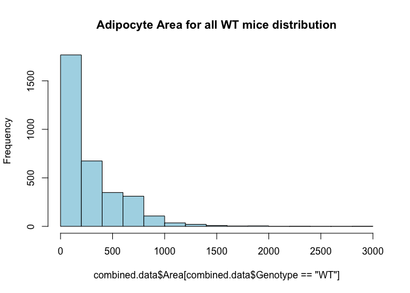
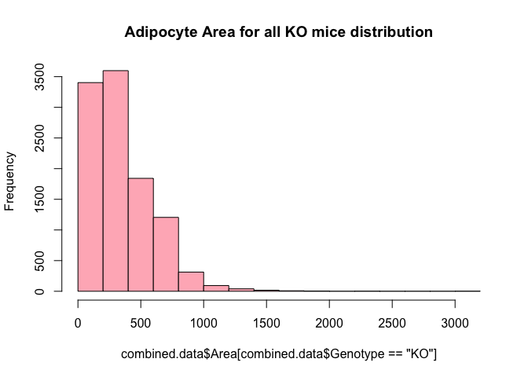

## R Markdown

This is an R Markdown document. Markdown is a simple formatting syntax for authoring HTML, PDF, and MS Word documents. For more details on using R Markdown see <http://rmarkdown.rstudio.com>.

When you click the **Knit** button a document will be generated that includes both content as well as the output of any embedded R code chunks within the document. You can embed an R code chunk like this:


# Purpose
write purpose here for each file

# Experimental Details

Link to the protocol used (permalink preferred) for the experiment and include any notes relevant to your analysis.  This might include specifics not in the general protocol such as cell lines, treatment doses etc.

# Raw Data


<!-- --><!-- --><!-- --><!-- --><!-- --><!-- --><!-- --><!-- --><!-- --><!-- --><!-- --><!-- --><!-- -->

<!-- --><!-- --><!-- --><!-- --><!-- -->

<!-- --><!-- --><!-- --><!-- --><!-- -->


```
## 
## 	Shapiro-Wilk normality test
## 
## data:  adipocyte.mouseID$`Total Adipocyte Number`
## W = 0.9, p-value = 0.2
```

```
## 
## 	Shapiro-Wilk normality test
## 
## data:  filter(adipocyte.mouseID, Genotype == "KO")$`Total Adipocyte Number`
## W = 1, p-value = 0.8
```

```
## 
## 	Shapiro-Wilk normality test
## 
## data:  filter(adipocyte.mouseID, Genotype == "WT")$`Total Adipocyte Number`
## W = 0.9, p-value = 0.4
```


Table: Levene test for equality of variances

|term  | df| statistic| p.value|
|:-----|--:|---------:|-------:|
|group |  1|      2.29|   0.165|
|      |  9|        NA|      NA|


| estimate| estimate1| estimate2| statistic| p.value| parameter| conf.low| conf.high|method            |alternative |
|--------:|---------:|---------:|---------:|-------:|---------:|--------:|---------:|:-----------------|:-----------|
|    -1097|       657|      1754|      -2.2|   0.055|         9|    -2226|      31.7|Two Sample t-test |two.sided   |

```
## 
## Call:
## lm(formula = `Total Adipocyte Number` ~ Genotype, data = adipocyte.mouseID)
## 
## Residuals:
##    Min     1Q Median     3Q    Max 
##  -1578   -323    165    323   1445 
## 
## Coefficients:
##             Estimate Std. Error t value Pr(>|t|)  
## (Intercept)      657        368    1.78    0.108  
## GenotypeKO      1097        499    2.20    0.055 .
## ---
## Signif. codes:  0 '***' 0.001 '**' 0.01 '*' 0.05 '.' 0.1 ' ' 1
## 
## Residual standard error: 824 on 9 degrees of freedom
## Multiple R-squared:  0.349,	Adjusted R-squared:  0.277 
## F-statistic: 4.83 on 1 and 9 DF,  p-value: 0.0555
```

```
## 
## Call:
## lm(formula = TotalAdipocyteNumber ~ Genotype, data = combined.data)
## 
## Residuals:
##    Min     1Q Median     3Q    Max 
##  -1578   -323    165    323   1445 
## 
## Coefficients:
##             Estimate Std. Error t value Pr(>|t|)  
## (Intercept)      657        368    1.78    0.108  
## GenotypeKO      1097        499    2.20    0.055 .
## ---
## Signif. codes:  0 '***' 0.001 '**' 0.01 '*' 0.05 '.' 0.1 ' ' 1
## 
## Residual standard error: 824 on 9 degrees of freedom
##   (13798 observations deleted due to missingness)
## Multiple R-squared:  0.349,	Adjusted R-squared:  0.277 
## F-statistic: 4.83 on 1 and 9 DF,  p-value: 0.0555
```

```
## 
## 	Shapiro-Wilk normality test
## 
## data:  adipocyte.mouseID$`Adipocyte Avergae Total Area`
## W = 0.8, p-value = 0.03
```

```
## 
## 	Shapiro-Wilk normality test
## 
## data:  filter(adipocyte.mouseID, Genotype == "KO")$`Adipocyte Avergae Total Area`
## W = 0.9, p-value = 0.7
```

```
## 
## 	Shapiro-Wilk normality test
## 
## data:  filter(adipocyte.mouseID, Genotype == "WT")$`Adipocyte Avergae Total Area`
## W = 0.9, p-value = 0.7
```


Table: Levene test for equality of variances of 

|term  | df| statistic| p.value|
|:-----|--:|---------:|-------:|
|group |  1|      8.18|   0.019|
|      |  9|        NA|      NA|


| estimate| estimate1| estimate2| statistic| p.value| parameter| conf.low| conf.high|method                  |alternative |
|--------:|---------:|---------:|---------:|-------:|---------:|--------:|---------:|:-----------------------|:-----------|
|  -376442|    187315|    563758|     -2.12|   0.081|      5.71|  -816747|     63862|Welch Two Sample t-test |two.sided   |

```
## 
## Call:
## lm(formula = `Adipocyte Avergae Total Area` ~ Genotype, data = adipocyte.mouseID)
## 
## Residuals:
##     Min      1Q  Median      3Q     Max 
## -525817 -182736  -30665  116291  573199 
## 
## Coefficients:
##             Estimate Std. Error t value Pr(>|t|)  
## (Intercept)   187315     143504    1.31    0.224  
## GenotypeKO    376442     194305    1.94    0.085 .
## ---
## Signif. codes:  0 '***' 0.001 '**' 0.01 '*' 0.05 '.' 0.1 ' ' 1
## 
## Residual standard error: 321000 on 9 degrees of freedom
## Multiple R-squared:  0.294,	Adjusted R-squared:  0.216 
## F-statistic: 3.75 on 1 and 9 DF,  p-value: 0.0847
```

```
## Linear mixed model fit by REML. t-tests use Satterthwaite's method [
## lmerModLmerTest]
## Formula: Area ~ Genotype + (1 | MouseID)
##    Data: combined.data
## 
## REML criterion at convergence: 191228
## 
## Scaled residuals: 
##    Min     1Q Median     3Q    Max 
## -1.542 -0.698 -0.256  0.504 11.285 
## 
## Random effects:
##  Groups   Name        Variance Std.Dev.
##  MouseID  (Intercept)  4782     69.2   
##  Residual             60367    245.7   
## Number of obs: 13809, groups:  MouseID, 11
## 
## Fixed effects:
##             Estimate Std. Error     df t value  Pr(>|t|)    
## (Intercept)   284.87      31.30   8.91    9.10 0.0000083 ***
## GenotypeKO     41.28      42.31   8.86    0.98      0.36    
## ---
## Signif. codes:  0 '***' 0.001 '**' 0.01 '*' 0.05 '.' 0.1 ' ' 1
## 
## Correlation of Fixed Effects:
##            (Intr)
## GenotypeKO -0.740
```


```
## 
## 	Shapiro-Wilk normality test
## 
## data:  adipocyte.mouseID$`Adipocyte Average Percent Area`
## W = 0.8, p-value = 0.01
```

```
## 
## 	Shapiro-Wilk normality test
## 
## data:  filter(adipocyte.mouseID, Genotype == "KO")$`Adipocyte Average Percent Area`
## W = 0.9, p-value = 0.7
```

```
## 
## 	Shapiro-Wilk normality test
## 
## data:  filter(adipocyte.mouseID, Genotype == "WT")$`Adipocyte Average Percent Area`
## W = 0.9, p-value = 0.6
```


Table: Levene test for equality of variances of 

|term  | df| statistic| p.value|
|:-----|--:|---------:|-------:|
|group |  1|      11.6|   0.008|
|      |  9|        NA|      NA|


| estimate| estimate1| estimate2| statistic| p.value| parameter| conf.low| conf.high|method                  |alternative |
|--------:|---------:|---------:|---------:|-------:|---------:|--------:|---------:|:-----------------------|:-----------|
|    -1.69|      0.62|      2.31|     -2.36|   0.062|      5.34|     -3.5|     0.118|Welch Two Sample t-test |two.sided   |

```
## 
## Call:
## lm(formula = `Adipocyte Average Percent Area` ~ Genotype, data = adipocyte.mouseID)
## 
## Residuals:
##    Min     1Q Median     3Q    Max 
## -2.158 -0.684 -0.032  0.445  2.293 
## 
## Coefficients:
##             Estimate Std. Error t value Pr(>|t|)  
## (Intercept)    0.620      0.582    1.06    0.315  
## GenotypeKO     1.691      0.789    2.14    0.061 .
## ---
## Signif. codes:  0 '***' 0.001 '**' 0.01 '*' 0.05 '.' 0.1 ' ' 1
## 
## Residual standard error: 1.3 on 9 degrees of freedom
## Multiple R-squared:  0.338,	Adjusted R-squared:  0.265 
## F-statistic:  4.6 on 1 and 9 DF,  p-value: 0.0606
```


```
## 
## 	Shapiro-Wilk normality test
## 
## data:  adipocyte.mouseID$`Sum Adipocyte Area`
## W = 0.9, p-value = 0.1
```

```
## 
## 	Shapiro-Wilk normality test
## 
## data:  filter(adipocyte.mouseID, Genotype == "KO")$`Sum Adipocyte Area`
## W = 1, p-value = 1
```

```
## 
## 	Shapiro-Wilk normality test
## 
## data:  filter(adipocyte.mouseID, Genotype == "WT")$`Sum Adipocyte Area`
## W = 0.9, p-value = 0.7
```


Table: Levene test for equality of variances of 

|term  | df| statistic| p.value|
|:-----|--:|---------:|-------:|
|group |  1|      4.17|   0.071|
|      |  9|        NA|      NA|


| estimate| estimate1| estimate2| statistic| p.value| parameter| conf.low| conf.high|method            |alternative |
|--------:|---------:|---------:|---------:|-------:|---------:|--------:|---------:|:-----------------|:-----------|
|  -422891|    187481|    610371|     -2.27|   0.049|         9|  -844298|     -1483|Two Sample t-test |two.sided   |

```
## 
## Call:
## lm(formula = `Sum Adipocyte Area` ~ Genotype, data = adipocyte.mouseID)
## 
## Residuals:
##     Min      1Q  Median      3Q     Max 
## -572431  -90554  -16789  105968  526232 
## 
## Coefficients:
##             Estimate Std. Error t value Pr(>|t|)  
## (Intercept)   187481     137581    1.36    0.206  
## GenotypeKO    422891     186286    2.27    0.049 *
## ---
## Signif. codes:  0 '***' 0.001 '**' 0.01 '*' 0.05 '.' 0.1 ' ' 1
## 
## Residual standard error: 308000 on 9 degrees of freedom
## Multiple R-squared:  0.364,	Adjusted R-squared:  0.293 
## F-statistic: 5.15 on 1 and 9 DF,  p-value: 0.0494
```


```
## 
## 	Shapiro-Wilk normality test
## 
## data:  adipocyte.mouseID$AverageAdipocyteArea
## W = 1, p-value = 0.8
```

```
## 
## 	Shapiro-Wilk normality test
## 
## data:  filter(adipocyte.mouseID, Genotype == "KO")$AverageAdipocyteArea
## W = 1, p-value = 0.8
```

```
## 
## 	Shapiro-Wilk normality test
## 
## data:  filter(adipocyte.mouseID, Genotype == "WT")$AverageAdipocyteArea
## W = 1, p-value = 0.8
```


Table: Levene test for equality of variances of 

|term  | df| statistic| p.value|
|:-----|--:|---------:|-------:|
|group |  1|     0.146|   0.712|
|      |  9|        NA|      NA|


| estimate| estimate1| estimate2| statistic| p.value| parameter| conf.low| conf.high|method            |alternative |
|--------:|---------:|---------:|---------:|-------:|---------:|--------:|---------:|:-----------------|:-----------|
|    -40.4|       285|       325|     -0.95|   0.367|         9|     -137|      55.8|Two Sample t-test |two.sided   |

```
## 
## Call:
## lm(formula = AverageAdipocyteArea ~ Genotype, data = adipocyte.mouseID)
## 
## Residuals:
##     Min      1Q  Median      3Q     Max 
## -108.43  -31.77   -4.19   35.49  109.65 
## 
## Coefficients:
##             Estimate Std. Error t value  Pr(>|t|)    
## (Intercept)    284.8       31.4    9.06 0.0000081 ***
## GenotypeKO      40.4       42.5    0.95      0.37    
## ---
## Signif. codes:  0 '***' 0.001 '**' 0.01 '*' 0.05 '.' 0.1 ' ' 1
## 
## Residual standard error: 70.3 on 9 degrees of freedom
## Multiple R-squared:  0.0912,	Adjusted R-squared:  -0.00983 
## F-statistic: 0.903 on 1 and 9 DF,  p-value: 0.367
```
## Including Plots

You can also embed plots, for example:

<!-- -->

Note that the `echo = FALSE` parameter was added to the code chunk to prevent printing of the R code that generated the plot.
