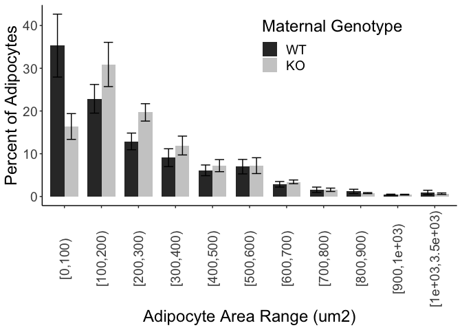
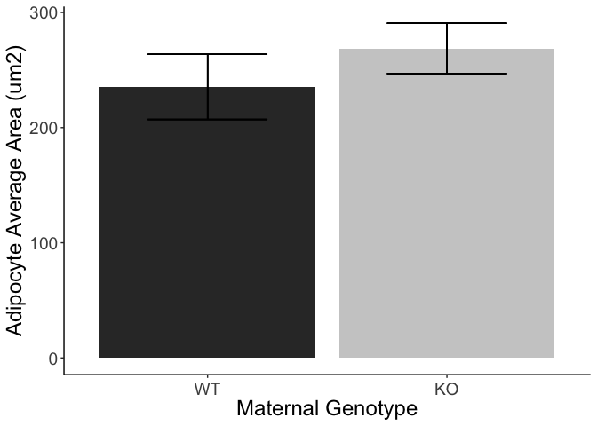

## R Markdown

This is an R Markdown document. Markdown is a simple formatting syntax for authoring HTML, PDF, and MS Word documents. For more details on using R Markdown see <http://rmarkdown.rstudio.com>.

When you click the **Knit** button a document will be generated that includes both content as well as the output of any embedded R code chunks within the document. You can embed an R code chunk like this:


# Purpose
write purpose here for each file

# Experimental Details

Link to the protocol used (permalink preferred) for the experiment and include any notes relevant to your analysis.  This might include specifics not in the general protocol such as cell lines, treatment doses etc.

# Raw Data


```
## # A tibble: 88 x 3
##    `Image#` MouseID `Total Area`
##       <dbl>   <dbl>        <dbl>
##  1        1    7981      3117987
##  2        2    7981      3145728
##  3        3    7981      3120420
##  4        4    7981      3145728
##  5        5    7981      3005199
##  6        6    7981      3145728
##  7        7    7981      3145728
##  8        8    7981      2264574
##  9        1    7983      2809380
## 10        2    7983      3145728
## # … with 78 more rows
```

<!-- --><!-- --><!-- --><!-- --><!-- --><!-- --><!-- --><!-- --><!-- --><!-- --><!-- -->

```
## # A tibble: 13,809 x 11
##    MouseID `Image number` `Adipocyte numb…  Area `Mean Area`   Min   Max
##      <dbl>          <dbl>            <dbl> <dbl>       <dbl> <dbl> <dbl>
##  1    7981              1                1   185        195.   185   205
##  2    7981              1                2   100        193.   182   200
##  3    7981              1                3   119        161.   153   176
##  4    7981              1                4   171        193.   171   202
##  5    7981              1                5   101        161.   150   174
##  6    7981              1                6   455        192.   169   205
##  7    7981              1                7    88        203.   196   211
##  8    7981              1                8   181        192.   178   201
##  9    7981              1                9   111        205.   197   212
## 10    7981              1               10   109        165.   156   177
## # … with 13,799 more rows, and 4 more variables: Genotype <fct>,
## #   TotalAdipocyteNumber <dbl>, ...10 <lgl>, TotalImageArea <lgl>
```

```
## # A tibble: 13,809 x 12
##    MouseID `Image number` `Adipocyte numb…  Area `Mean Area`   Min   Max
##      <dbl>          <dbl>            <dbl> <dbl>       <dbl> <dbl> <dbl>
##  1    7981              1                1   185        195.   185   205
##  2    7981              1                2   100        193.   182   200
##  3    7981              1                3   119        161.   153   176
##  4    7981              1                4   171        193.   171   202
##  5    7981              1                5   101        161.   150   174
##  6    7981              1                6   455        192.   169   205
##  7    7981              1                7    88        203.   196   211
##  8    7981              1                8   181        192.   178   201
##  9    7981              1                9   111        205.   197   212
## 10    7981              1               10   109        165.   156   177
## # … with 13,799 more rows, and 5 more variables: Genotype <fct>,
## #   TotalAdipocyteNumber <dbl>, ...10 <lgl>, TotalImageArea <lgl>, `Total
## #   Area` <dbl>
```


```
## Linear mixed model fit by REML. t-tests use Satterthwaite's method [
## lmerModLmerTest]
## Formula: adipocytesperarea ~ Genotype + (1 | MouseID)
##    Data: adipocyte.number
## 
## REML criterion at convergence: -299
## 
## Scaled residuals: 
##    Min     1Q Median     3Q    Max 
## -2.926 -0.423 -0.126  0.508  3.937 
## 
## Random effects:
##  Groups   Name        Variance Std.Dev.
##  MouseID  (Intercept) 0.00120  0.0347  
##  Residual             0.00133  0.0365  
## Number of obs: 88, groups:  MouseID, 11
## 
## Fixed effects:
##             Estimate Std. Error     df t value Pr(>|t|)  
## (Intercept)   0.0294     0.0166 9.0000    1.77    0.110  
## GenotypeKO    0.0490     0.0224 9.0000    2.19    0.057 .
## ---
## Signif. codes:  0 '***' 0.001 '**' 0.01 '*' 0.05 '.' 0.1 ' ' 1
## 
## Correlation of Fixed Effects:
##            (Intr)
## GenotypeKO -0.739
```

```
## # A tibble: 88 x 6
## # Groups:   Image number, MouseID [88]
##    `Image number` MouseID Genotype adipocyttesum totalarea adipocytesperarea
##             <dbl>   <dbl> <fct>            <int>     <dbl>             <dbl>
##  1              1    7981 KO                 661     2835.          0.233   
##  2              1    7983 KO                  69     2554.          0.0270  
##  3              1    7984 KO                   1     2758.          0.000363
##  4              1    8161 KO                 293     2625.          0.112   
##  5              1    8162 WT                  34     2805.          0.0121  
##  6              1    8444 WT                  62     2620.          0.0237  
##  7              1    8445 WT                 162     2739.          0.0592  
##  8              1    8446 WT                 101     2776.          0.0364  
##  9              1    8465 KO                 422     2639.          0.160   
## 10              1    8466 KO                 176     2791.          0.0631  
## # … with 78 more rows
```

```
## # A tibble: 11 x 3
## # Groups:   MouseID [11]
##    MouseID Genotype adipocyttesum
##      <dbl> <fct>            <dbl>
##  1    7981 KO             0.0912 
##  2    7983 KO             0.0858 
##  3    7984 KO             0.00779
##  4    8161 KO             0.104  
##  5    8162 WT             0.0165 
##  6    8444 WT             0.0457 
##  7    8445 WT             0.0356 
##  8    8446 WT             0.0361 
##  9    8465 KO             0.143  
## 10    8466 KO             0.0388 
## 11    8467 WT             0.0130
```

```
## # A tibble: 2 x 3
##   Genotype adipocytenumbergenotpye se.adipocytenumbergenotpye
##   <fct>                      <dbl>                      <dbl>
## 1 WT                        0.0294                    0.00626
## 2 KO                        0.0784                    0.0196
```

<!-- -->

```
## Linear mixed model fit by REML. t-tests use Satterthwaite's method [
## lmerModLmerTest]
## Formula: Area ~ Genotype + (1 | MouseID)
##    Data: allmergeddata
## 
## REML criterion at convergence: 191228
## 
## Scaled residuals: 
##    Min     1Q Median     3Q    Max 
## -1.542 -0.698 -0.256  0.504 11.285 
## 
## Random effects:
##  Groups   Name        Variance Std.Dev.
##  MouseID  (Intercept)  4782     69.2   
##  Residual             60367    245.7   
## Number of obs: 13809, groups:  MouseID, 11
## 
## Fixed effects:
##             Estimate Std. Error     df t value  Pr(>|t|)    
## (Intercept)   284.87      31.30   8.91    9.10 0.0000083 ***
## GenotypeKO     41.28      42.31   8.86    0.98      0.36    
## ---
## Signif. codes:  0 '***' 0.001 '**' 0.01 '*' 0.05 '.' 0.1 ' ' 1
## 
## Correlation of Fixed Effects:
##            (Intr)
## GenotypeKO -0.740
```

```
## Generalized linear mixed model fit by maximum likelihood (Laplace
##   Approximation) [glmerMod]
##  Family: poisson  ( log )
## Formula: Area ~ Genotype + (1 | MouseID)
##    Data: allmergeddata
## 
##      AIC      BIC   logLik deviance df.resid 
##  2351179  2351202 -1175587  2351173    13806 
## 
## Scaled residuals: 
##    Min     1Q Median     3Q    Max 
## -19.16  -9.79  -3.48   6.83 186.94 
## 
## Random effects:
##  Groups  Name        Variance Std.Dev.
##  MouseID (Intercept) 0.0474   0.218   
## Number of obs: 13809, groups:  MouseID, 11
## 
## Fixed effects:
##             Estimate Std. Error z value Pr(>|z|)    
## (Intercept)   5.6234     0.0966   58.20   <2e-16 ***
## GenotypeKO    0.1419     0.1310    1.08     0.28    
## ---
## Signif. codes:  0 '***' 0.001 '**' 0.01 '*' 0.05 '.' 0.1 ' ' 1
## 
## Correlation of Fixed Effects:
##            (Intr)
## GenotypeKO -0.735
```


```
## # A tibble: 88 x 6
## # Groups:   Image number, MouseID [88]
##    `Image number` MouseID Genotype adipocytearea totalarea normalizedadipocytes…
##             <dbl>   <dbl> <fct>            <dbl>     <dbl>                 <dbl>
##  1              1    7981 KO              144166   3117987               4.62   
##  2              1    7983 KO               24203   2809380               0.862  
##  3              1    7984 KO                 259   3034170               0.00854
##  4              1    8161 KO              115965   2887962               4.02   
##  5              1    8162 WT               10390   3085188               0.337  
##  6              1    8444 WT               37627   2882385               1.31   
##  7              1    8445 WT               17122   3012591               0.568  
##  8              1    8446 WT               30654   3053796               1.00   
##  9              1    8465 KO              139326   2903272               4.80   
## 10              1    8466 KO               59800   3070488               1.95   
## # … with 78 more rows
```

```
## Linear mixed model fit by REML. t-tests use Satterthwaite's method [
## lmerModLmerTest]
## Formula: normalizedadipocytesarea ~ Genotype + (1 | MouseID)
##    Data: adipocyte.percent
## 
## REML criterion at convergence: 278
## 
## Scaled residuals: 
##    Min     1Q Median     3Q    Max 
## -3.502 -0.353 -0.056  0.439  2.937 
## 
## Random effects:
##  Groups   Name        Variance Std.Dev.
##  MouseID  (Intercept) 1.46     1.21    
##  Residual             1.04     1.02    
## Number of obs: 88, groups:  MouseID, 11
## 
## Fixed effects:
##             Estimate Std. Error    df t value Pr(>|t|)  
## (Intercept)    0.761      0.564 9.000    1.35    0.210  
## GenotypeKO     1.723      0.764 9.000    2.26    0.051 .
## ---
## Signif. codes:  0 '***' 0.001 '**' 0.01 '*' 0.05 '.' 0.1 ' ' 1
## 
## Correlation of Fixed Effects:
##            (Intr)
## GenotypeKO -0.739
```

```
## [1] 226
```

```
## # A tibble: 11 x 3
## # Groups:   MouseID [11]
##    MouseID Genotype adipocytearea
##      <dbl> <fct>            <dbl>
##  1    7981 KO               2.67 
##  2    7983 KO               2.38 
##  3    7984 KO               0.152
##  4    8161 KO               3.90 
##  5    8162 WT               0.487
##  6    8444 WT               1.09 
##  7    8445 WT               0.640
##  8    8446 WT               1.29 
##  9    8465 KO               4.60 
## 10    8466 KO               1.20 
## 11    8467 WT               0.291
```

```
## # A tibble: 2 x 3
##   Genotype adipocyteareagenotpye se.adipocyteareagenotpye
##   <fct>                    <dbl>                    <dbl>
## 1 WT                       0.761                    0.187
## 2 KO                       2.48                     0.674
```

<!-- -->


```
## # A tibble: 13,809 x 13
##    MouseID `Image number` `Adipocyte numb…  Area `Mean Area`   Min   Max
##      <dbl>          <dbl>            <dbl> <dbl>       <dbl> <dbl> <dbl>
##  1    7981              1                1   185        195.   185   205
##  2    7981              1                2   100        193.   182   200
##  3    7981              1                3   119        161.   153   176
##  4    7981              1                4   171        193.   171   202
##  5    7981              1                5   101        161.   150   174
##  6    7981              1                6   455        192.   169   205
##  7    7981              1                7    88        203.   196   211
##  8    7981              1                8   181        192.   178   201
##  9    7981              1                9   111        205.   197   212
## 10    7981              1               10   109        165.   156   177
## # … with 13,799 more rows, and 6 more variables: Genotype <fct>,
## #   TotalAdipocyteNumber <dbl>, ...10 <lgl>, TotalImageArea <lgl>, `Total
## #   Area` <dbl>, Areanm2 <dbl>
```

<!-- -->

|term  |    df| statistic| p.value|
|:-----|-----:|---------:|-------:|
|group |     1|      19.7|       0|
|      | 13807|        NA|      NA|

<!-- -->

```
## # A tibble: 22 x 5
## # Groups:   Genotype [2]
##    Genotype range     count totaladipocytes percentofadipocytes
##    <fct>    <fct>     <int>           <int>               <dbl>
##  1 WT       [0,0.1)    1135            3285              34.6  
##  2 WT       [0.1,0.2)   734            3285              22.3  
##  3 WT       [0.2,0.3)   398            3285              12.1  
##  4 WT       [0.3,0.4)   253            3285               7.70 
##  5 WT       [0.4,0.5)   202            3285               6.15 
##  6 WT       [0.5,0.6)   220            3285               6.70 
##  7 WT       [0.6,0.7)   141            3285               4.29 
##  8 WT       [0.7,0.8)    63            3285               1.92 
##  9 WT       [0.8,0.9)    58            3285               1.77 
## 10 WT       [0.9,1)      29            3285               0.883
## # … with 12 more rows
```

<!-- -->

```
## # A tibble: 22 x 4
## # Groups:   Genotype [2]
##    Genotype range     averagepercentofadipocytes se.averagepercentofadipocytes
##    <fct>    <fct>                          <dbl>                         <dbl>
##  1 WT       [0,0.1)                        32.3                          7.06 
##  2 WT       [0.1,0.2)                      22.9                          2.98 
##  3 WT       [0.2,0.3)                      13.3                          2.52 
##  4 WT       [0.3,0.4)                       8.40                         1.49 
##  5 WT       [0.4,0.5)                       6.80                         1.36 
##  6 WT       [0.5,0.6)                       6.77                         1.34 
##  7 WT       [0.6,0.7)                       4.22                         0.867
##  8 WT       [0.7,0.8)                       1.72                         0.511
##  9 WT       [0.8,0.9)                       1.50                         0.621
## 10 WT       [0.9,1)                         1.00                         0.403
## # … with 12 more rows
```

<!-- -->

```
## 
## Call:
## lm(formula = percentofadipocytes ~ Genotype + range, data = percentileareabymouseonly)
## 
## Residuals:
##     Min      1Q  Median      3Q     Max 
## -17.776  -1.918  -0.074   1.370  25.659 
## 
## Coefficients:
##                 Estimate Std. Error t value Pr(>|t|)    
## (Intercept)     22.32046    1.93511   11.53  < 2e-16 ***
## GenotypeKO       0.00311    1.12204    0.00    0.998    
## range[0.1,0.2)   3.44939    2.59618    1.33    0.187    
## range[0.2,0.3)  -5.41296    2.59618   -2.08    0.039 *  
## range[0.3,0.4) -11.57439    2.59618   -4.46  2.0e-05 ***
## range[0.4,0.5) -14.52568    2.59618   -5.60  1.7e-07 ***
## range[0.5,0.6) -15.51906    2.59618   -5.98  3.0e-08 ***
## range[0.6,0.7) -17.99881    2.59618   -6.93  3.2e-10 ***
## range[0.7,0.8) -20.15267    2.59618   -7.76  5.3e-12 ***
## range[0.8,0.9) -20.95228    2.59618   -8.07  1.1e-12 ***
## range[0.9,1)   -21.52036    2.66100   -8.09  1.0e-12 ***
## range[1,3.5)   -21.15827    2.66078   -7.95  2.0e-12 ***
## ---
## Signif. codes:  0 '***' 0.001 '**' 0.01 '*' 0.05 '.' 0.1 ' ' 1
## 
## Residual standard error: 6.09 on 107 degrees of freedom
## Multiple R-squared:  0.682,	Adjusted R-squared:  0.649 
## F-statistic: 20.9 on 11 and 107 DF,  p-value: <2e-16
```

```
## # A tibble: 11 x 3
##    range       pval delta
##    <fct>      <dbl> <dbl>
##  1 [0,0.1)   0.0591 0.435
##  2 [0.1,0.2) 0.388  1.23 
##  3 [0.2,0.3) 0.0619 1.49 
##  4 [0.3,0.4) 0.114  1.51 
##  5 [0.4,0.5) 0.382  1.27 
##  6 [0.5,0.6) 0.977  1.01 
##  7 [0.6,0.7) 0.897  1.04 
##  8 [0.7,0.8) 0.210  1.48 
##  9 [0.8,0.9) 0.743  0.844
## 10 [0.9,1)   0.477  0.666
## 11 [1,3.5)   0.704  0.797
```


<!-- --><!-- --><!-- --><!-- --><!-- -->

<!-- --><!-- --><!-- --><!-- --><!-- -->


```
## 
## 	Shapiro-Wilk normality test
## 
## data:  adipocyte.mouseID$`Total Adipocyte Number`
## W = 0.9, p-value = 0.2
```

```
## 
## 	Shapiro-Wilk normality test
## 
## data:  filter(adipocyte.mouseID, Genotype == "KO")$`Total Adipocyte Number`
## W = 1, p-value = 0.8
```

```
## 
## 	Shapiro-Wilk normality test
## 
## data:  filter(adipocyte.mouseID, Genotype == "WT")$`Total Adipocyte Number`
## W = 0.9, p-value = 0.4
```


Table: Levene test for equality of variances

|term  | df| statistic| p.value|
|:-----|--:|---------:|-------:|
|group |  1|      2.29|   0.165|
|      |  9|        NA|      NA|


| estimate| estimate1| estimate2| statistic| p.value| parameter| conf.low| conf.high|method            |alternative |
|--------:|---------:|---------:|---------:|-------:|---------:|--------:|---------:|:-----------------|:-----------|
|    -1097|       657|      1754|      -2.2|   0.055|         9|    -2226|      31.7|Two Sample t-test |two.sided   |

```
## 
## Call:
## lm(formula = `Total Adipocyte Number` ~ Genotype, data = adipocyte.mouseID)
## 
## Residuals:
##    Min     1Q Median     3Q    Max 
##  -1578   -323    165    323   1445 
## 
## Coefficients:
##             Estimate Std. Error t value Pr(>|t|)  
## (Intercept)      657        368    1.78    0.108  
## GenotypeKO      1097        499    2.20    0.055 .
## ---
## Signif. codes:  0 '***' 0.001 '**' 0.01 '*' 0.05 '.' 0.1 ' ' 1
## 
## Residual standard error: 824 on 9 degrees of freedom
## Multiple R-squared:  0.349,	Adjusted R-squared:  0.277 
## F-statistic: 4.83 on 1 and 9 DF,  p-value: 0.0555
```

```
## 
## Call:
## lm(formula = TotalAdipocyteNumber ~ Genotype, data = combined.data)
## 
## Residuals:
##    Min     1Q Median     3Q    Max 
##  -1580   -323    165    327   1443 
## 
## Coefficients:
##             Estimate Std. Error t value Pr(>|t|)  
## (Intercept)      657        369    1.78    0.108  
## GenotypeKO      1099        499    2.20    0.055 .
## ---
## Signif. codes:  0 '***' 0.001 '**' 0.01 '*' 0.05 '.' 0.1 ' ' 1
## 
## Residual standard error: 824 on 9 degrees of freedom
##   (13798 observations deleted due to missingness)
## Multiple R-squared:  0.35,	Adjusted R-squared:  0.278 
## F-statistic: 4.84 on 1 and 9 DF,  p-value: 0.0553
```

```
## 
## 	Shapiro-Wilk normality test
## 
## data:  adipocyte.mouseID$`Adipocyte Avergae Total Area`
## W = 0.8, p-value = 0.03
```

```
## 
## 	Shapiro-Wilk normality test
## 
## data:  filter(adipocyte.mouseID, Genotype == "KO")$`Adipocyte Avergae Total Area`
## W = 0.9, p-value = 0.7
```

```
## 
## 	Shapiro-Wilk normality test
## 
## data:  filter(adipocyte.mouseID, Genotype == "WT")$`Adipocyte Avergae Total Area`
## W = 0.9, p-value = 0.7
```


Table: Levene test for equality of variances of 

|term  | df| statistic| p.value|
|:-----|--:|---------:|-------:|
|group |  1|      8.18|   0.019|
|      |  9|        NA|      NA|


| estimate| estimate1| estimate2| statistic| p.value| parameter| conf.low| conf.high|method                  |alternative |
|--------:|---------:|---------:|---------:|-------:|---------:|--------:|---------:|:-----------------------|:-----------|
|  -376442|    187315|    563758|     -2.12|   0.081|      5.71|  -816747|     63862|Welch Two Sample t-test |two.sided   |

```
## 
## Call:
## lm(formula = `Adipocyte Avergae Total Area` ~ Genotype, data = adipocyte.mouseID)
## 
## Residuals:
##     Min      1Q  Median      3Q     Max 
## -525817 -182736  -30665  116291  573199 
## 
## Coefficients:
##             Estimate Std. Error t value Pr(>|t|)  
## (Intercept)   187315     143504    1.31    0.224  
## GenotypeKO    376442     194305    1.94    0.085 .
## ---
## Signif. codes:  0 '***' 0.001 '**' 0.01 '*' 0.05 '.' 0.1 ' ' 1
## 
## Residual standard error: 321000 on 9 degrees of freedom
## Multiple R-squared:  0.294,	Adjusted R-squared:  0.216 
## F-statistic: 3.75 on 1 and 9 DF,  p-value: 0.0847
```

```
## Linear mixed model fit by REML. t-tests use Satterthwaite's method [
## lmerModLmerTest]
## Formula: Area ~ Genotype + (1 | MouseID)
##    Data: combined.data
## 
## REML criterion at convergence: 191228
## 
## Scaled residuals: 
##    Min     1Q Median     3Q    Max 
## -1.542 -0.698 -0.256  0.504 11.285 
## 
## Random effects:
##  Groups   Name        Variance Std.Dev.
##  MouseID  (Intercept)  4782     69.2   
##  Residual             60367    245.7   
## Number of obs: 13809, groups:  MouseID, 11
## 
## Fixed effects:
##             Estimate Std. Error     df t value  Pr(>|t|)    
## (Intercept)   284.87      31.30   8.91    9.10 0.0000083 ***
## GenotypeKO     41.28      42.31   8.86    0.98      0.36    
## ---
## Signif. codes:  0 '***' 0.001 '**' 0.01 '*' 0.05 '.' 0.1 ' ' 1
## 
## Correlation of Fixed Effects:
##            (Intr)
## GenotypeKO -0.740
```


```
## 
## 	Shapiro-Wilk normality test
## 
## data:  adipocyte.mouseID$`Adipocyte Average Percent Area`
## W = 0.8, p-value = 0.01
```

```
## 
## 	Shapiro-Wilk normality test
## 
## data:  filter(adipocyte.mouseID, Genotype == "KO")$`Adipocyte Average Percent Area`
## W = 0.9, p-value = 0.7
```

```
## 
## 	Shapiro-Wilk normality test
## 
## data:  filter(adipocyte.mouseID, Genotype == "WT")$`Adipocyte Average Percent Area`
## W = 0.9, p-value = 0.6
```


Table: Levene test for equality of variances of 

|term  | df| statistic| p.value|
|:-----|--:|---------:|-------:|
|group |  1|      11.6|   0.008|
|      |  9|        NA|      NA|


| estimate| estimate1| estimate2| statistic| p.value| parameter| conf.low| conf.high|method                  |alternative |
|--------:|---------:|---------:|---------:|-------:|---------:|--------:|---------:|:-----------------------|:-----------|
|    -1.69|      0.62|      2.31|     -2.36|   0.062|      5.34|     -3.5|     0.118|Welch Two Sample t-test |two.sided   |

```
## 
## Call:
## lm(formula = `Adipocyte Average Percent Area` ~ Genotype, data = adipocyte.mouseID)
## 
## Residuals:
##    Min     1Q Median     3Q    Max 
## -2.158 -0.684 -0.032  0.445  2.293 
## 
## Coefficients:
##             Estimate Std. Error t value Pr(>|t|)  
## (Intercept)    0.620      0.582    1.06    0.315  
## GenotypeKO     1.691      0.789    2.14    0.061 .
## ---
## Signif. codes:  0 '***' 0.001 '**' 0.01 '*' 0.05 '.' 0.1 ' ' 1
## 
## Residual standard error: 1.3 on 9 degrees of freedom
## Multiple R-squared:  0.338,	Adjusted R-squared:  0.265 
## F-statistic:  4.6 on 1 and 9 DF,  p-value: 0.0606
```


```
## 
## 	Shapiro-Wilk normality test
## 
## data:  adipocyte.mouseID$`Sum Adipocyte Area`
## W = 0.9, p-value = 0.1
```

```
## 
## 	Shapiro-Wilk normality test
## 
## data:  filter(adipocyte.mouseID, Genotype == "KO")$`Sum Adipocyte Area`
## W = 1, p-value = 1
```

```
## 
## 	Shapiro-Wilk normality test
## 
## data:  filter(adipocyte.mouseID, Genotype == "WT")$`Sum Adipocyte Area`
## W = 0.9, p-value = 0.7
```


Table: Levene test for equality of variances of 

|term  | df| statistic| p.value|
|:-----|--:|---------:|-------:|
|group |  1|      4.17|   0.071|
|      |  9|        NA|      NA|


| estimate| estimate1| estimate2| statistic| p.value| parameter| conf.low| conf.high|method            |alternative |
|--------:|---------:|---------:|---------:|-------:|---------:|--------:|---------:|:-----------------|:-----------|
|  -422891|    187481|    610371|     -2.27|   0.049|         9|  -844298|     -1483|Two Sample t-test |two.sided   |

```
## 
## Call:
## lm(formula = `Sum Adipocyte Area` ~ Genotype, data = adipocyte.mouseID)
## 
## Residuals:
##     Min      1Q  Median      3Q     Max 
## -572431  -90554  -16789  105968  526232 
## 
## Coefficients:
##             Estimate Std. Error t value Pr(>|t|)  
## (Intercept)   187481     137581    1.36    0.206  
## GenotypeKO    422891     186286    2.27    0.049 *
## ---
## Signif. codes:  0 '***' 0.001 '**' 0.01 '*' 0.05 '.' 0.1 ' ' 1
## 
## Residual standard error: 308000 on 9 degrees of freedom
## Multiple R-squared:  0.364,	Adjusted R-squared:  0.293 
## F-statistic: 5.15 on 1 and 9 DF,  p-value: 0.0494
```


```
## 
## 	Shapiro-Wilk normality test
## 
## data:  adipocyte.mouseID$AverageAdipocyteArea
## W = 1, p-value = 0.8
```

```
## 
## 	Shapiro-Wilk normality test
## 
## data:  filter(adipocyte.mouseID, Genotype == "KO")$AverageAdipocyteArea
## W = 1, p-value = 0.8
```

```
## 
## 	Shapiro-Wilk normality test
## 
## data:  filter(adipocyte.mouseID, Genotype == "WT")$AverageAdipocyteArea
## W = 1, p-value = 0.8
```


Table: Levene test for equality of variances of 

|term  | df| statistic| p.value|
|:-----|--:|---------:|-------:|
|group |  1|     0.146|   0.712|
|      |  9|        NA|      NA|


| estimate| estimate1| estimate2| statistic| p.value| parameter| conf.low| conf.high|method            |alternative |
|--------:|---------:|---------:|---------:|-------:|---------:|--------:|---------:|:-----------------|:-----------|
|    -40.4|       285|       325|     -0.95|   0.367|         9|     -137|      55.8|Two Sample t-test |two.sided   |

```
## 
## Call:
## lm(formula = AverageAdipocyteArea ~ Genotype, data = adipocyte.mouseID)
## 
## Residuals:
##     Min      1Q  Median      3Q     Max 
## -108.43  -31.77   -4.19   35.49  109.65 
## 
## Coefficients:
##             Estimate Std. Error t value  Pr(>|t|)    
## (Intercept)    284.8       31.4    9.06 0.0000081 ***
## GenotypeKO      40.4       42.5    0.95      0.37    
## ---
## Signif. codes:  0 '***' 0.001 '**' 0.01 '*' 0.05 '.' 0.1 ' ' 1
## 
## Residual standard error: 70.3 on 9 degrees of freedom
## Multiple R-squared:  0.0912,	Adjusted R-squared:  -0.00983 
## F-statistic: 0.903 on 1 and 9 DF,  p-value: 0.367
```
## Including Plots

You can also embed plots, for example:

<!-- -->

Note that the `echo = FALSE` parameter was added to the code chunk to prevent printing of the R code that generated the plot.
