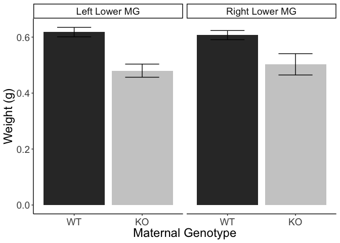
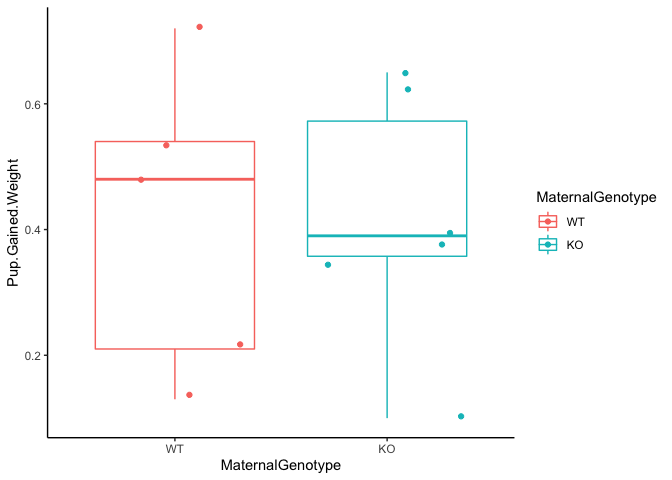
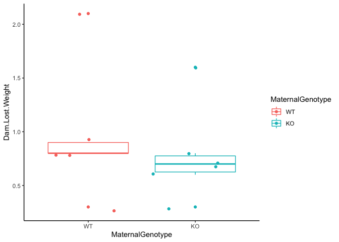
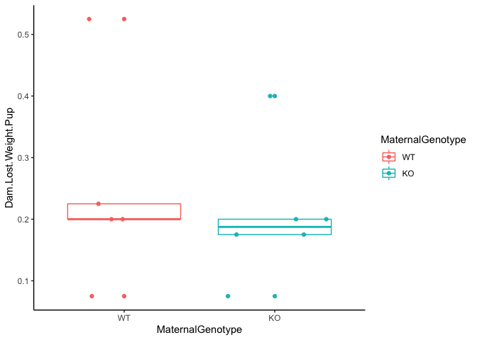
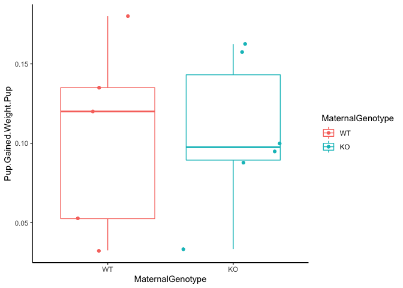
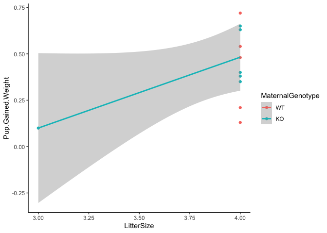
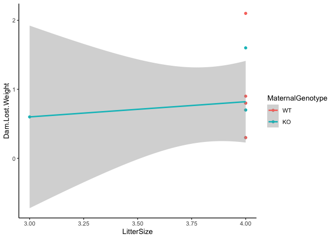
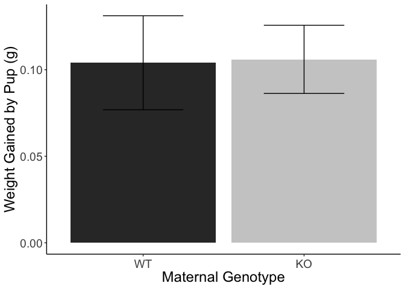
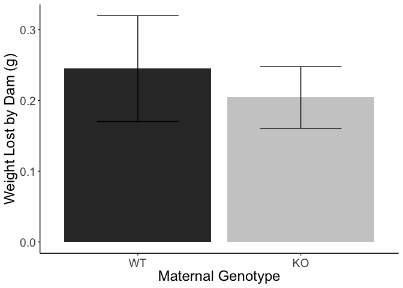

# Raw Data


Table: Average Mammary Gland Weights across Genotypes

   ID  Genotype    Weight   RMGland   LMGland  D16       X7   X8   Notes                AverageRMGWeight   AverageLMGWeight   Average.Weights
-----  ---------  -------  --------  --------  --------  ---  ---  ------------------  -----------------  -----------------  ----------------
 8161  KO            25.4     0.465     0.454  6/22/19   NA   NA   Exp done at 9am                 0.503              0.480              27.6
 7983  KO            28.3     0.512     0.531  6/23/19   NA   NA   Exp done at 9am                 0.503              0.480              27.6
 7981  KO            26.9     0.500     0.495  6/24/19   NA   NA   Exp done at 1:30                0.503              0.480              27.6
 7984  KO            25.6     0.354     0.376  6/25/19   NA   NA   Exp done at 1:30                0.503              0.480              27.6
 8466  KO            29.6     0.549     0.502  7/19/19   NA   NA   Exp done at 10                  0.503              0.480              27.6
 8444  WT            26.7     0.559     0.610  7/21/19   NA   NA   Exp done at 10:30               0.607              0.618              27.8
 8467  WT            28.9     0.615     0.594  7/22/19   NA   NA   Exp done at 10                  0.607              0.618              27.8
 8445  WT            27.0     0.630     0.668  7/22/19   NA   NA   Exp done at 10                  0.607              0.618              27.8
 8465  KO            30.0     0.636     0.523  7/24/19   NA   NA                                   0.503              0.480              27.6
 8446  WT            28.6     0.624     0.600  7/24/19   NA   NA                                   0.607              0.618              27.8

<!-- --><!-- --><!-- --><!-- --><!-- -->

Table: Welch's t-test for effects of genotype on right mammary gland weights

 estimate   estimate1   estimate2   statistic   p.value   parameter   conf.low   conf.high  method                    alternative 
---------  ----------  ----------  ----------  --------  ----------  ---------  ----------  ------------------------  ------------
    0.104       0.607       0.503        2.52     0.042        6.64      0.005       0.204  Welch Two Sample t-test   two.sided   


Table: Welch's t-test for effects of maternal on left mammary gland weights

 estimate   estimate1   estimate2   statistic   p.value   parameter   conf.low   conf.high  method                    alternative 
---------  ----------  ----------  ----------  --------  ----------  ---------  ----------  ------------------------  ------------
    0.138       0.618        0.48        4.77     0.001        7.96      0.071       0.205  Welch Two Sample t-test   two.sided   

<!-- --><!-- --><!-- --><!-- --><!-- --><!-- --><!-- --><!-- --><!-- -->

```
## 
## Call:
## lm(formula = Pup.Gained.Weight ~ LitterSize + MaternalGenotype, 
##     data = milk.weights)
## 
## Residuals:
##    Min     1Q Median     3Q    Max 
## -0.286 -0.117  0.000  0.136  0.304 
## 
## Coefficients:
##                    Estimate Std. Error t value Pr(>|t|)
## (Intercept)          -1.112      0.882   -1.26     0.24
## LitterSize            0.382      0.219    1.74     0.12
## MaternalGenotypeKO    0.066      0.127    0.52     0.62
## 
## Residual standard error: 0.2 on 8 degrees of freedom
## Multiple R-squared:  0.275,	Adjusted R-squared:  0.0936 
## F-statistic: 1.52 on 2 and 8 DF,  p-value: 0.276
```

```
## 
## Call:
## lm(formula = Dam.Lost.Weight ~ LitterSize + MaternalGenotype, 
##     data = milk.weights)
## 
## Residuals:
##    Min     1Q Median     3Q    Max 
##  -0.68  -0.18  -0.12  -0.01   1.12 
## 
## Coefficients:
##                    Estimate Std. Error t value Pr(>|t|)
## (Intercept)           0.100      2.557    0.04     0.97
## LitterSize            0.220      0.636    0.35     0.74
## MaternalGenotypeKO   -0.160      0.367   -0.44     0.67
## 
## Residual standard error: 0.581 on 8 degrees of freedom
## Multiple R-squared:  0.0513,	Adjusted R-squared:  -0.186 
## F-statistic: 0.216 on 2 and 8 DF,  p-value: 0.81
```


Table: Average Pup and Dam Weights at T=0, After 2h Separation, and After 1h Nursing

 MaternalID  D10       MaternalGenotype    DamWeight   DamWeightSeparated   DamWeightNursing   LitterSize   PupWeight   PupWeightSeparated   PupWeightNursing   DataEntry   Pup.Gained.Weight   Dam.Lost.Weight   Dam.Lost.Weight.Pup   Pup.Gained.Weight.Pup   AverageDamWeightLoss   SE.AverageDamWeightLoss   AveragePupWeightGain   SE.AveragePupWeightGain
-----------  --------  -----------------  ----------  -------------------  -----------------  -----------  ----------  -------------------  -----------------  ----------  ------------------  ----------------  --------------------  ----------------------  ---------------------  ------------------------  ---------------------  ------------------------
       8162  6/15/19   WT                       25.8                 25.0               24.2            4        21.8                 21.7               22.2           1                0.48               0.8                 0.200                   0.120                    0.8                        NA                   0.48                        NA
       8161  6/16/19   KO                       26.9                 25.7               25.0            4        22.7                 22.6               23.2           1                0.65               0.7                 0.175                   0.162                    0.7                        NA                   0.65                        NA
       7983  6/17/19   KO                       29.1                 27.6               27.0            3        18.7                 18.6               18.7           1                0.10               0.6                 0.200                   0.033                    0.6                        NA                   0.10                        NA
       7981  6/18/19   KO                       28.6                 27.5               26.8            4        24.2                 24.1               24.5           1                0.38               0.7                 0.175                   0.095                    0.7                        NA                   0.38                        NA
       7984  6/19/19   KO                       29.6                 28.5               27.7            4        22.6                 22.4               22.8           1                0.40               0.8                 0.200                   0.100                    0.8                        NA                   0.40                        NA
       8466  7/13/19   KO                       29.0                 28.9               28.6            4        25.1                 25.0               25.3           1                0.35               0.3                 0.075                   0.088                    0.3                        NA                   0.35                        NA
       8444  7/15/19   WT                       28.2                 26.8               26.0            4        23.2                 23.1               23.7           1                0.54               0.8                 0.200                   0.135                    0.8                        NA                   0.54                        NA
       8467  7/16/19   WT                       27.1                 26.4               26.1            4        21.6                 21.5               21.7           1                0.13               0.3                 0.075                   0.032                    0.3                        NA                   0.13                        NA
       8445  7/16/19   WT                       28.4                 27.2               26.3            4        22.9                 22.8               23.0           1                0.21               0.9                 0.225                   0.053                    0.9                        NA                   0.21                        NA
       8465  7/18/19   KO                       31.2                 29.9               28.3            4        23.3                 23.2               23.9           1                0.63               1.6                 0.400                   0.158                    1.6                        NA                   0.63                        NA
       8446  7/18/19   WT                       30.5                 29.5               27.4            4        23.4                 23.3               24.0           1                0.72               2.1                 0.525                   0.180                    2.1                        NA                   0.72                        NA


term                df   sumsq   meansq   statistic   p.value
-----------------  ---  ------  -------  ----------  --------
MaternalGenotype     1   0.000    0.000           0     0.987
Residuals            9   0.442    0.049          NA        NA


term                df   sumsq   meansq   statistic   p.value
-----------------  ---  ------  -------  ----------  --------
MaternalGenotype     1   0.105    0.105       0.347      0.57
Residuals            9   2.736    0.304          NA        NA

<!-- -->

Table: Welch's t-test for effects of genotype on milk production

 estimate   estimate1   estimate2   statistic   p.value   parameter   conf.low   conf.high  method                    alternative 
---------  ----------  ----------  ----------  --------  ----------  ---------  ----------  ------------------------  ------------
   -0.002       0.104       0.106      -0.059     0.955        7.62      -0.08       0.076  Welch Two Sample t-test   two.sided   


Table: Welch's t-test for effects of genotype on milk production

 estimate   estimate1   estimate2   statistic   p.value   parameter   conf.low   conf.high  method                    alternative 
---------  ----------  ----------  ----------  --------  ----------  ---------  ----------  ------------------------  ------------
    0.197        0.98       0.783       0.565      0.59        6.66     -0.634        1.03  Welch Two Sample t-test   two.sided   

<!-- -->
