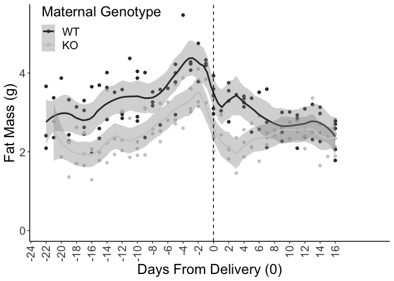

# Raw Data


Analysis

<!-- --><!-- -->

```
## Linear mixed model fit by REML. t-tests use Satterthwaite's method [
## lmerModLmerTest]
## Formula: BW.Lact ~ DayfromDelivery * MaternalGenotype + (1 | ID)
##    Data: deltaBWchangefromdelivery
## 
## REML criterion at convergence: 284
## 
## Scaled residuals: 
##    Min     1Q Median     3Q    Max 
## -3.170 -0.673  0.128  0.608  2.017 
## 
## Random effects:
##  Groups   Name        Variance Std.Dev.
##  ID       (Intercept) 0.519    0.720   
##  Residual             0.929    0.964   
## Number of obs: 93, groups:  ID, 12
## 
## Fixed effects:
##                                    Estimate Std. Error      df t value Pr(>|t|)
## (Intercept)                          0.3426     0.3880 19.7164    0.88     0.39
## DayfromDelivery                      0.2307     0.0284 83.2214    8.13  3.5e-12
## MaternalGenotypeKO                  -0.1123     0.5446 19.1796   -0.21     0.84
## DayfromDelivery:MaternalGenotypeKO   0.0481     0.0380 81.6266    1.27     0.21
##                                       
## (Intercept)                           
## DayfromDelivery                    ***
## MaternalGenotypeKO                    
## DayfromDelivery:MaternalGenotypeKO    
## ---
## Signif. codes:  0 '***' 0.001 '**' 0.01 '*' 0.05 '.' 0.1 ' ' 1
## 
## Correlation of Fixed Effects:
##             (Intr) DyfrmD MtrGKO
## DayfrmDlvry -0.518              
## MtrnlGntyKO -0.712  0.369       
## DyfrmD:MGKO  0.387 -0.746 -0.523
```

```
## DayfromDelivery:MaternalGenotypeKO 
##                             -0.183
```

```
## Linear mixed model fit by REML. t-tests use Satterthwaite's method [
## lmerModLmerTest]
## Formula: BW.Lact ~ DayfromDelivery * MaternalGenotype + (1 | ID)
##    Data: deltaBWchangefromdelivery
## 
## REML criterion at convergence: 284
## 
## Scaled residuals: 
##    Min     1Q Median     3Q    Max 
## -3.170 -0.673  0.128  0.608  2.017 
## 
## Random effects:
##  Groups   Name        Variance Std.Dev.
##  ID       (Intercept) 0.519    0.720   
##  Residual             0.929    0.964   
## Number of obs: 93, groups:  ID, 12
## 
## Fixed effects:
##                                    Estimate Std. Error      df t value Pr(>|t|)
## (Intercept)                          0.3426     0.3880 19.7164    0.88     0.39
## DayfromDelivery                      0.2307     0.0284 83.2214    8.13  3.5e-12
## MaternalGenotypeKO                  -0.1123     0.5446 19.1796   -0.21     0.84
## DayfromDelivery:MaternalGenotypeKO   0.0481     0.0380 81.6266    1.27     0.21
##                                       
## (Intercept)                           
## DayfromDelivery                    ***
## MaternalGenotypeKO                    
## DayfromDelivery:MaternalGenotypeKO    
## ---
## Signif. codes:  0 '***' 0.001 '**' 0.01 '*' 0.05 '.' 0.1 ' ' 1
## 
## Correlation of Fixed Effects:
##             (Intr) DyfrmD MtrGKO
## DayfrmDlvry -0.518              
## MtrnlGntyKO -0.712  0.369       
## DyfrmD:MGKO  0.387 -0.746 -0.523
```

```
## [1] 1.92
```
<!-- --><!-- -->

### Postnatal fat mass change statistics


```
## DayfromDelivery:MaternalGenotypeKO 
##                              0.136
```

```
## Linear mixed model fit by REML. t-tests use Satterthwaite's method [
## lmerModLmerTest]
## Formula: Fat.Lact ~ DayfromDelivery * MaternalGenotype + (1 | ID)
##    Data: deltaFatchangefromdelivery
## 
## REML criterion at convergence: 94.5
## 
## Scaled residuals: 
##     Min      1Q  Median      3Q     Max 
## -2.9297 -0.4376  0.0859  0.7079  1.8563 
## 
## Random effects:
##  Groups   Name        Variance Std.Dev.
##  ID       (Intercept) 0.115    0.339   
##  Residual             0.103    0.321   
## Number of obs: 93, groups:  ID, 12
## 
## Fixed effects:
##                                    Estimate Std. Error      df t value Pr(>|t|)
## (Intercept)                         -0.0190     0.1621 15.0533   -0.12     0.91
## DayfromDelivery                     -0.0633     0.0095 81.9143   -6.66  2.9e-09
## MaternalGenotypeKO                  -0.0829     0.2282 14.7820   -0.36     0.72
## DayfromDelivery:MaternalGenotypeKO   0.0727     0.0127 80.7854    5.73  1.7e-07
##                                       
## (Intercept)                           
## DayfromDelivery                    ***
## MaternalGenotypeKO                    
## DayfromDelivery:MaternalGenotypeKO ***
## ---
## Signif. codes:  0 '***' 0.001 '**' 0.01 '*' 0.05 '.' 0.1 ' ' 1
## 
## Correlation of Fixed Effects:
##             (Intr) DyfrmD MtrGKO
## DayfrmDlvry -0.411              
## MtrnlGntyKO -0.710  0.292       
## DyfrmD:MGKO  0.307 -0.748 -0.414
```

```
## [1] -1.05
```

```
## [1] 2.11
```

```
## [1] 0.0485
```

```
## [1] -1.08
```

<!-- --><!-- -->


```
## DayfromDelivery:MaternalGenotypeKO 
##                             -0.245
```

```
## Linear mixed model fit by REML. t-tests use Satterthwaite's method [
## lmerModLmerTest]
## Formula: Lean.Lact ~ DayfromDelivery * MaternalGenotype + (1 | ID)
##    Data: deltaLeanchangefromdelivery
## 
## REML criterion at convergence: 239
## 
## Scaled residuals: 
##     Min      1Q  Median      3Q     Max 
## -2.5532 -0.4930  0.0978  0.7283  1.7699 
## 
## Random effects:
##  Groups   Name        Variance Std.Dev.
##  ID       (Intercept) 0.291    0.539   
##  Residual             0.562    0.749   
## Number of obs: 93, groups:  ID, 12
## 
## Fixed effects:
##                                    Estimate Std. Error       df t value
## (Intercept)                         0.61229    0.29529 20.18922    2.07
## DayfromDelivery                     0.24025    0.02204 83.28448   10.90
## MaternalGenotypeKO                 -0.29606    0.41435 19.61718   -0.71
## DayfromDelivery:MaternalGenotypeKO -0.00524    0.02955 81.62314   -0.18
##                                    Pr(>|t|)    
## (Intercept)                           0.051 .  
## DayfromDelivery                      <2e-16 ***
## MaternalGenotypeKO                    0.483    
## DayfromDelivery:MaternalGenotypeKO    0.860    
## ---
## Signif. codes:  0 '***' 0.001 '**' 0.01 '*' 0.05 '.' 0.1 ' ' 1
## 
## Correlation of Fixed Effects:
##             (Intr) DyfrmD MtrGKO
## DayfrmDlvry -0.530              
## MtrnlGntyKO -0.713  0.378       
## DyfrmD:MGKO  0.395 -0.746 -0.535
```

<!-- -->
<!-- -->
<!-- --><!-- -->

```
## DayfromDelivery:MaternalGenotypeKO 
##                              -5.26
```

```
## Linear mixed model fit by REML. t-tests use Satterthwaite's method [
## lmerModLmerTest]
## Formula: FoodIntake ~ DayfromDelivery * MaternalGenotype + (1 | ID)
##    Data: foodintakefromdelivery
## 
## REML criterion at convergence: 363
## 
## Scaled residuals: 
##    Min     1Q Median     3Q    Max 
## -2.008 -0.606 -0.108  0.527  1.904 
## 
## Random effects:
##  Groups   Name        Variance Std.Dev.
##  ID       (Intercept) 198      14.1    
##  Residual             319      17.9    
## Number of obs: 43, groups:  ID, 10
## 
## Fixed effects:
##                                    Estimate Std. Error     df t value Pr(>|t|)
## (Intercept)                          17.974     10.037 12.092    1.79    0.098
## DayfromDelivery                       2.489      0.958 31.074    2.60    0.014
## MaternalGenotypeKO                   30.738     13.601 13.791    2.26    0.041
## DayfromDelivery:MaternalGenotypeKO   -2.772      1.257 30.826   -2.21    0.035
##                                     
## (Intercept)                        .
## DayfromDelivery                    *
## MaternalGenotypeKO                 *
## DayfromDelivery:MaternalGenotypeKO *
## ---
## Signif. codes:  0 '***' 0.001 '**' 0.01 '*' 0.05 '.' 0.1 ' ' 1
## 
## Correlation of Fixed Effects:
##             (Intr) DyfrmD MtrGKO
## DayfrmDlvry -0.590              
## MtrnlGntyKO -0.738  0.435       
## DyfrmD:MGKO  0.449 -0.762 -0.604
```

```
## [1] 57.8
```

```
## [1] 44.2
```


<!-- --><!-- -->
