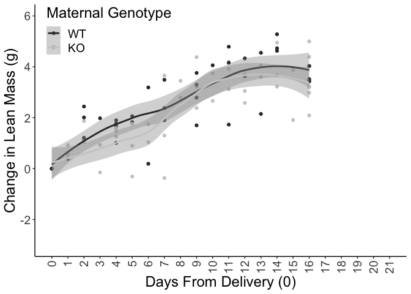
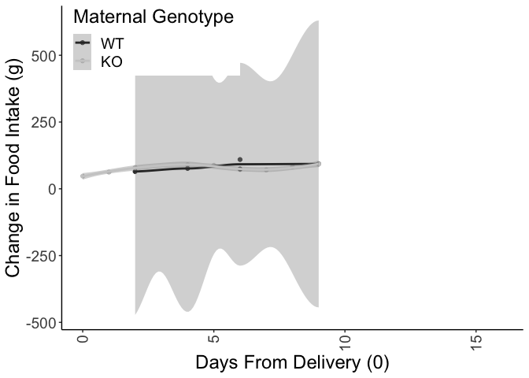

# Raw Data


Analysis

<!-- --><!-- -->

```
## Linear mixed model fit by REML. t-tests use Satterthwaite's method [
## lmerModLmerTest]
## Formula: BW.Lact ~ DayfromDelivery * MaternalGenotype + (1 | ID)
##    Data: deltaBWchangefromdelivery
## 
## REML criterion at convergence: 284
## 
## Scaled residuals: 
##    Min     1Q Median     3Q    Max 
## -3.170 -0.673  0.128  0.608  2.017 
## 
## Random effects:
##  Groups   Name        Variance Std.Dev.
##  ID       (Intercept) 0.519    0.720   
##  Residual             0.929    0.964   
## Number of obs: 93, groups:  ID, 12
## 
## Fixed effects:
##                                    Estimate Std. Error      df t value Pr(>|t|)
## (Intercept)                          0.3426     0.3880 19.7164    0.88     0.39
## DayfromDelivery                      0.2307     0.0284 83.2214    8.13  3.5e-12
## MaternalGenotypeKO                  -0.1123     0.5446 19.1796   -0.21     0.84
## DayfromDelivery:MaternalGenotypeKO   0.0481     0.0380 81.6266    1.27     0.21
##                                       
## (Intercept)                           
## DayfromDelivery                    ***
## MaternalGenotypeKO                    
## DayfromDelivery:MaternalGenotypeKO    
## ---
## Signif. codes:  0 '***' 0.001 '**' 0.01 '*' 0.05 '.' 0.1 ' ' 1
## 
## Correlation of Fixed Effects:
##             (Intr) DyfrmD MtrGKO
## DayfrmDlvry -0.518              
## MtrnlGntyKO -0.712  0.369       
## DyfrmD:MGKO  0.387 -0.746 -0.523
```

```
## DayfromDelivery:MaternalGenotypeKO 
##                             -0.183
```

```
## Linear mixed model fit by REML. t-tests use Satterthwaite's method [
## lmerModLmerTest]
## Formula: BW.Lact ~ DayfromDelivery * MaternalGenotype + (1 | ID)
##    Data: deltaBWchangefromdelivery
## 
## REML criterion at convergence: 284
## 
## Scaled residuals: 
##    Min     1Q Median     3Q    Max 
## -3.170 -0.673  0.128  0.608  2.017 
## 
## Random effects:
##  Groups   Name        Variance Std.Dev.
##  ID       (Intercept) 0.519    0.720   
##  Residual             0.929    0.964   
## Number of obs: 93, groups:  ID, 12
## 
## Fixed effects:
##                                    Estimate Std. Error      df t value Pr(>|t|)
## (Intercept)                          0.3426     0.3880 19.7164    0.88     0.39
## DayfromDelivery                      0.2307     0.0284 83.2214    8.13  3.5e-12
## MaternalGenotypeKO                  -0.1123     0.5446 19.1796   -0.21     0.84
## DayfromDelivery:MaternalGenotypeKO   0.0481     0.0380 81.6266    1.27     0.21
##                                       
## (Intercept)                           
## DayfromDelivery                    ***
## MaternalGenotypeKO                    
## DayfromDelivery:MaternalGenotypeKO    
## ---
## Signif. codes:  0 '***' 0.001 '**' 0.01 '*' 0.05 '.' 0.1 ' ' 1
## 
## Correlation of Fixed Effects:
##             (Intr) DyfrmD MtrGKO
## DayfrmDlvry -0.518              
## MtrnlGntyKO -0.712  0.369       
## DyfrmD:MGKO  0.387 -0.746 -0.523
```
<!-- --><!-- -->

### Postnatal fat mass change statistics


```
## DayfromDelivery:MaternalGenotypeKO 
##                              0.136
```

```
## Linear mixed model fit by REML. t-tests use Satterthwaite's method [
## lmerModLmerTest]
## Formula: Fat.Lact ~ DayfromDelivery * MaternalGenotype + (1 | ID)
##    Data: deltaFatchangefromdelivery
## 
## REML criterion at convergence: 94.5
## 
## Scaled residuals: 
##     Min      1Q  Median      3Q     Max 
## -2.9297 -0.4376  0.0859  0.7079  1.8563 
## 
## Random effects:
##  Groups   Name        Variance Std.Dev.
##  ID       (Intercept) 0.115    0.339   
##  Residual             0.103    0.321   
## Number of obs: 93, groups:  ID, 12
## 
## Fixed effects:
##                                    Estimate Std. Error      df t value Pr(>|t|)
## (Intercept)                         -0.0190     0.1621 15.0533   -0.12     0.91
## DayfromDelivery                     -0.0633     0.0095 81.9143   -6.66  2.9e-09
## MaternalGenotypeKO                  -0.0829     0.2282 14.7820   -0.36     0.72
## DayfromDelivery:MaternalGenotypeKO   0.0727     0.0127 80.7854    5.73  1.7e-07
##                                       
## (Intercept)                           
## DayfromDelivery                    ***
## MaternalGenotypeKO                    
## DayfromDelivery:MaternalGenotypeKO ***
## ---
## Signif. codes:  0 '***' 0.001 '**' 0.01 '*' 0.05 '.' 0.1 ' ' 1
## 
## Correlation of Fixed Effects:
##             (Intr) DyfrmD MtrGKO
## DayfrmDlvry -0.411              
## MtrnlGntyKO -0.710  0.292       
## DyfrmD:MGKO  0.307 -0.748 -0.414
```

```
##    1 
## 0.45
```

```
##     1 
## -0.63
```

```
## [1] 1.08
```

```
## [1] 1.71
```

<!-- --><!-- -->


```
## DayfromDelivery:MaternalGenotypeKO 
##                             -0.245
```

```
## Linear mixed model fit by REML. t-tests use Satterthwaite's method [
## lmerModLmerTest]
## Formula: Lean.Lact ~ DayfromDelivery * MaternalGenotype + (1 | ID)
##    Data: deltaLeanchangefromdelivery
## 
## REML criterion at convergence: 239
## 
## Scaled residuals: 
##     Min      1Q  Median      3Q     Max 
## -2.5532 -0.4930  0.0978  0.7283  1.7699 
## 
## Random effects:
##  Groups   Name        Variance Std.Dev.
##  ID       (Intercept) 0.291    0.539   
##  Residual             0.562    0.749   
## Number of obs: 93, groups:  ID, 12
## 
## Fixed effects:
##                                    Estimate Std. Error       df t value
## (Intercept)                         0.61229    0.29529 20.18922    2.07
## DayfromDelivery                     0.24025    0.02204 83.28448   10.90
## MaternalGenotypeKO                 -0.29606    0.41435 19.61718   -0.71
## DayfromDelivery:MaternalGenotypeKO -0.00524    0.02955 81.62314   -0.18
##                                    Pr(>|t|)    
## (Intercept)                           0.051 .  
## DayfromDelivery                      <2e-16 ***
## MaternalGenotypeKO                    0.483    
## DayfromDelivery:MaternalGenotypeKO    0.860    
## ---
## Signif. codes:  0 '***' 0.001 '**' 0.01 '*' 0.05 '.' 0.1 ' ' 1
## 
## Correlation of Fixed Effects:
##             (Intr) DyfrmD MtrGKO
## DayfrmDlvry -0.530              
## MtrnlGntyKO -0.713  0.378       
## DyfrmD:MGKO  0.395 -0.746 -0.535
```

<!-- -->
<!-- -->
<!-- --><!-- -->

```
## DayfromDelivery:MaternalGenotypeKO 
##                              -5.48
```

```
## Linear mixed model fit by REML. t-tests use Satterthwaite's method [
## lmerModLmerTest]
## Formula: FoodIntake ~ DayfromDelivery * MaternalGenotype + (1 | ID)
##    Data: foodintakefromdelivery
## 
## REML criterion at convergence: 88.4
## 
## Scaled residuals: 
##    Min     1Q Median     3Q    Max 
## -0.734 -0.255 -0.055  0.288  0.867 
## 
## Random effects:
##  Groups   Name        Variance Std.Dev.
##  ID       (Intercept) 157.6    12.56   
##  Residual              15.3     3.91   
## Number of obs: 14, groups:  ID, 10
## 
## Fixed effects:
##                                    Estimate Std. Error     df t value Pr(>|t|)
## (Intercept)                          62.785      7.783  9.435    8.07 0.000016
## DayfromDelivery                       4.075      0.786  1.954    5.19    0.037
## MaternalGenotypeKO                    2.301      9.665  9.901    0.24    0.817
## DayfromDelivery:MaternalGenotypeKO   -1.405      0.908  1.950   -1.55    0.265
##                                       
## (Intercept)                        ***
## DayfromDelivery                    *  
## MaternalGenotypeKO                    
## DayfromDelivery:MaternalGenotypeKO    
## ---
## Signif. codes:  0 '***' 0.001 '**' 0.01 '*' 0.05 '.' 0.1 ' ' 1
## 
## Correlation of Fixed Effects:
##             (Intr) DyfrmD MtrGKO
## DayfrmDlvry -0.543              
## MtrnlGntyKO -0.805  0.437       
## DyfrmD:MGKO  0.470 -0.866 -0.490
```


<!-- --><!-- -->

#Session Information

```
## R version 4.0.2 (2020-06-22)
## Platform: x86_64-apple-darwin17.0 (64-bit)
## Running under: macOS  10.16
## 
## Matrix products: default
## BLAS:   /Library/Frameworks/R.framework/Versions/4.0/Resources/lib/libRblas.dylib
## LAPACK: /Library/Frameworks/R.framework/Versions/4.0/Resources/lib/libRlapack.dylib
## 
## locale:
## [1] en_US.UTF-8/en_US.UTF-8/en_US.UTF-8/C/en_US.UTF-8/en_US.UTF-8
## 
## attached base packages:
## [1] stats     graphics  grDevices utils     datasets  methods   base     
## 
## other attached packages:
##  [1] lmerTest_3.1-3 lme4_1.1-25    Matrix_1.2-18  plotrix_3.7-8  ggplot2_3.3.2 
##  [6] readr_1.4.0    broom_0.7.2    dplyr_1.0.2    tidyr_1.1.2    knitr_1.30    
## 
## loaded via a namespace (and not attached):
##  [1] Rcpp_1.0.5          nloptr_1.2.2.2      pillar_1.4.6       
##  [4] compiler_4.0.2      tools_4.0.2         boot_1.3-25        
##  [7] statmod_1.4.35      digest_0.6.27       lattice_0.20-41    
## [10] nlme_3.1-150        evaluate_0.14       lifecycle_0.2.0    
## [13] tibble_3.0.4        gtable_0.3.0        mgcv_1.8-33        
## [16] pkgconfig_2.0.3     rlang_0.4.8         cli_2.1.0          
## [19] rstudioapi_0.12     yaml_2.2.1          xfun_0.19          
## [22] withr_2.3.0         stringr_1.4.0       generics_0.1.0     
## [25] vctrs_0.3.4         hms_0.5.3           grid_4.0.2         
## [28] tidyselect_1.1.0    glue_1.4.2          R6_2.5.0           
## [31] fansi_0.4.1         rmarkdown_2.5       minqa_1.2.4        
## [34] farver_2.0.3        purrr_0.3.4         magrittr_1.5       
## [37] MASS_7.3-53         splines_4.0.2       backports_1.2.0    
## [40] scales_1.1.1        ellipsis_0.3.1      htmltools_0.5.0    
## [43] assertthat_0.2.1    colorspace_2.0-0    numDeriv_2016.8-1.1
## [46] labeling_0.4.2      stringi_1.5.3       munsell_0.5.0      
## [49] crayon_1.3.4
```
