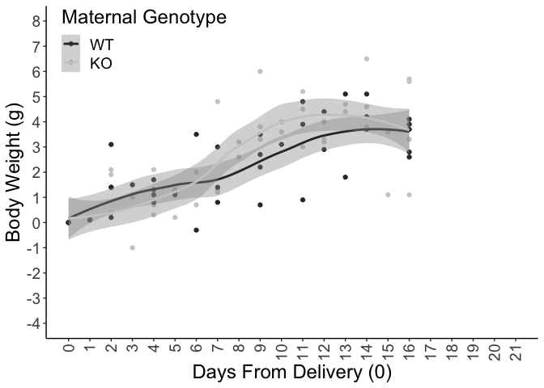
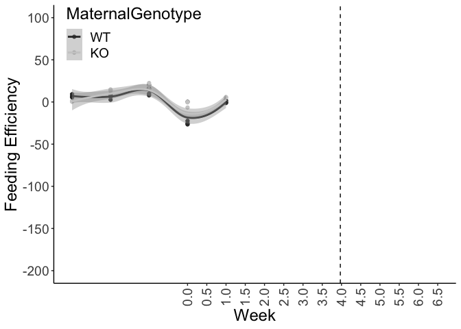

# Raw Data


Analysis

<!-- --><!-- -->

```
## DayfromDelivery:MaternalGenotypeKO 
##                             -0.102
```

```
## Linear mixed model fit by REML. t-tests use Satterthwaite's method [
## lmerModLmerTest]
## Formula: BW.Lact ~ DayfromDelivery * MaternalGenotype + (1 | ID)
##    Data: deltaBWchangefromdelivery
## 
## REML criterion at convergence: 322
## 
## Scaled residuals: 
##    Min     1Q Median     3Q    Max 
## -5.019 -0.423  0.074  0.650  1.761 
## 
## Random effects:
##  Groups   Name        Variance Std.Dev.
##  ID       (Intercept) 0.446    0.668   
##  Residual             1.439    1.200   
## Number of obs: 94, groups:  ID, 12
## 
## Fixed effects:
##                                    Estimate Std. Error      df t value Pr(>|t|)
## (Intercept)                          0.5037     0.4157 25.7456    1.21    0.237
## DayfromDelivery                      0.1900     0.0342 85.5296    5.55  3.1e-07
## MaternalGenotypeKO                  -0.2731     0.5827 24.9833   -0.47    0.643
## DayfromDelivery:MaternalGenotypeKO   0.0884     0.0465 83.4098    1.90    0.061
##                                       
## (Intercept)                           
## DayfromDelivery                    ***
## MaternalGenotypeKO                    
## DayfromDelivery:MaternalGenotypeKO .  
## ---
## Signif. codes:  0 '***' 0.001 '**' 0.01 '*' 0.05 '.' 0.1 ' ' 1
## 
## Correlation of Fixed Effects:
##             (Intr) DyfrmD MtrGKO
## DayfrmDlvry -0.604              
## MtrnlGntyKO -0.713  0.431       
## DyfrmD:MGKO  0.445 -0.736 -0.610
```
<!-- --><!-- -->

### Postnatal fat mass change statistics


```
## DayfromDelivery:MaternalGenotypeKO 
##                              0.125
```

```
## Linear mixed model fit by REML. t-tests use Satterthwaite's method [
## lmerModLmerTest]
## Formula: Fat.Lact ~ DayfromDelivery * MaternalGenotype + (1 | ID)
##    Data: deltaFatchangefromdelivery
## 
## REML criterion at convergence: 101
## 
## Scaled residuals: 
##     Min      1Q  Median      3Q     Max 
## -2.8331 -0.5386  0.0634  0.6734  2.3893 
## 
## Random effects:
##  Groups   Name        Variance Std.Dev.
##  ID       (Intercept) 0.119    0.345   
##  Residual             0.110    0.332   
## Number of obs: 94, groups:  ID, 12
## 
## Fixed effects:
##                                    Estimate Std. Error      df t value Pr(>|t|)
## (Intercept)                         -0.0399     0.1655 15.1709   -0.24     0.81
## DayfromDelivery                     -0.0579     0.0096 83.1584   -6.03  4.4e-08
## MaternalGenotypeKO                  -0.0619     0.2330 14.9259   -0.27     0.79
## DayfromDelivery:MaternalGenotypeKO   0.0673     0.0130 81.8964    5.19  1.5e-06
##                                       
## (Intercept)                           
## DayfromDelivery                    ***
## MaternalGenotypeKO                    
## DayfromDelivery:MaternalGenotypeKO ***
## ---
## Signif. codes:  0 '***' 0.001 '**' 0.01 '*' 0.05 '.' 0.1 ' ' 1
## 
## Correlation of Fixed Effects:
##             (Intr) DyfrmD MtrGKO
## DayfrmDlvry -0.416              
## MtrnlGntyKO -0.710  0.295       
## DyfrmD:MGKO  0.308 -0.740 -0.420
```

<!-- --><!-- -->


```
## DayfromDelivery:MaternalGenotypeKO 
##                             -0.167
```

```
## Linear mixed model fit by REML. t-tests use Satterthwaite's method [
## lmerModLmerTest]
## Formula: Lean.Lact ~ DayfromDelivery * MaternalGenotype + (1 | ID)
##    Data: deltaLeanchangefromdelivery
## 
## REML criterion at convergence: 293
## 
## Scaled residuals: 
##    Min     1Q Median     3Q    Max 
## -5.811 -0.352  0.032  0.550  1.366 
## 
## Random effects:
##  Groups   Name        Variance Std.Dev.
##  ID       (Intercept) 0.212    0.46    
##  Residual             1.077    1.04    
## Number of obs: 94, groups:  ID, 12
## 
## Fixed effects:
##                                    Estimate Std. Error      df t value Pr(>|t|)
## (Intercept)                          0.7718     0.3300 31.4022    2.34    0.026
## DayfromDelivery                      0.2008     0.0294 86.0307    6.82  1.2e-09
## MaternalGenotypeKO                  -0.4508     0.4619 30.3782   -0.98    0.337
## DayfromDelivery:MaternalGenotypeKO   0.0336     0.0401 83.6703    0.84    0.404
##                                       
## (Intercept)                        *  
## DayfromDelivery                    ***
## MaternalGenotypeKO                    
## DayfromDelivery:MaternalGenotypeKO    
## ---
## Signif. codes:  0 '***' 0.001 '**' 0.01 '*' 0.05 '.' 0.1 ' ' 1
## 
## Correlation of Fixed Effects:
##             (Intr) DyfrmD MtrGKO
## DayfrmDlvry -0.661              
## MtrnlGntyKO -0.714  0.472       
## DyfrmD:MGKO  0.485 -0.734 -0.667
```

<!-- -->
<!-- -->
<!-- --><!-- -->

```
## DayfromDelivery:MaternalGenotypeKO 
##                              -6.34
```

```
## Linear mixed model fit by REML. t-tests use Satterthwaite's method [
## lmerModLmerTest]
## Formula: FoodIntake ~ DayfromDelivery * MaternalGenotype + (1 | ID)
##    Data: foodintakefromdelivery
## 
## REML criterion at convergence: 383
## 
## Scaled residuals: 
##     Min      1Q  Median      3Q     Max 
## -2.0086 -0.6949 -0.0838  0.5130  1.7704 
## 
## Random effects:
##  Groups   Name        Variance Std.Dev.
##  ID       (Intercept) 212      14.6    
##  Residual             329      18.1    
## Number of obs: 45, groups:  ID, 10
## 
## Fixed effects:
##                                    Estimate Std. Error     df t value Pr(>|t|)
## (Intercept)                          15.990     10.237 13.643    1.56   0.1412
## DayfromDelivery                       3.052      0.923 34.043    3.30   0.0022
## MaternalGenotypeKO                   32.888     13.896 15.634    2.37   0.0312
## DayfromDelivery:MaternalGenotypeKO   -3.288      1.227 33.732   -2.68   0.0113
##                                      
## (Intercept)                          
## DayfromDelivery                    **
## MaternalGenotypeKO                 * 
## DayfromDelivery:MaternalGenotypeKO * 
## ---
## Signif. codes:  0 '***' 0.001 '**' 0.01 '*' 0.05 '.' 0.1 ' ' 1
## 
## Correlation of Fixed Effects:
##             (Intr) DyfrmD MtrGKO
## DayfrmDlvry -0.583              
## MtrnlGntyKO -0.737  0.430       
## DyfrmD:MGKO  0.439 -0.753 -0.608
```


<!-- --><!-- -->
