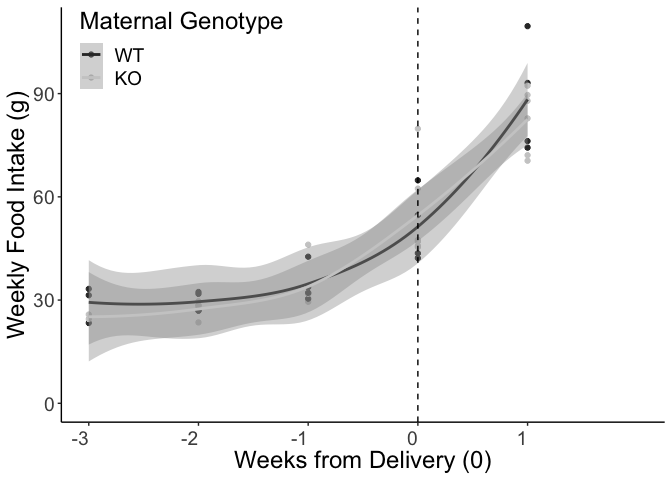

# Raw Data


Analysis

<!-- --><!-- -->
<!-- --><!-- -->

### Postnatal fat mass change statistics


```
## DayfromDelivery:MaternalGenotypeKO 
##                              0.125
```

```
## Linear mixed model fit by REML. t-tests use Satterthwaite's method [
## lmerModLmerTest]
## Formula: Fat.Lact ~ DayfromDelivery * MaternalGenotype + (1 | ID)
##    Data: deltaFatchangefromdelivery
## 
## REML criterion at convergence: 101
## 
## Scaled residuals: 
##     Min      1Q  Median      3Q     Max 
## -2.8331 -0.5386  0.0634  0.6734  2.3893 
## 
## Random effects:
##  Groups   Name        Variance Std.Dev.
##  ID       (Intercept) 0.119    0.345   
##  Residual             0.110    0.332   
## Number of obs: 94, groups:  ID, 12
## 
## Fixed effects:
##                                    Estimate Std. Error      df t value Pr(>|t|)
## (Intercept)                         -0.0399     0.1655 15.1709   -0.24     0.81
## DayfromDelivery                     -0.0579     0.0096 83.1584   -6.03  4.4e-08
## MaternalGenotypeKO                  -0.0619     0.2330 14.9259   -0.27     0.79
## DayfromDelivery:MaternalGenotypeKO   0.0673     0.0130 81.8964    5.19  1.5e-06
##                                       
## (Intercept)                           
## DayfromDelivery                    ***
## MaternalGenotypeKO                    
## DayfromDelivery:MaternalGenotypeKO ***
## ---
## Signif. codes:  0 '***' 0.001 '**' 0.01 '*' 0.05 '.' 0.1 ' ' 1
## 
## Correlation of Fixed Effects:
##             (Intr) DyfrmD MtrGKO
## DayfrmDlvry -0.416              
## MtrnlGntyKO -0.710  0.295       
## DyfrmD:MGKO  0.308 -0.740 -0.420
```

<!-- --><!-- -->
<!-- -->
<!-- -->
<!-- -->


<!-- --><!-- -->
