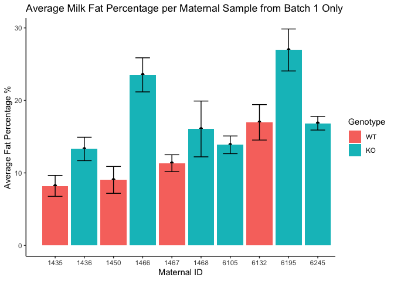
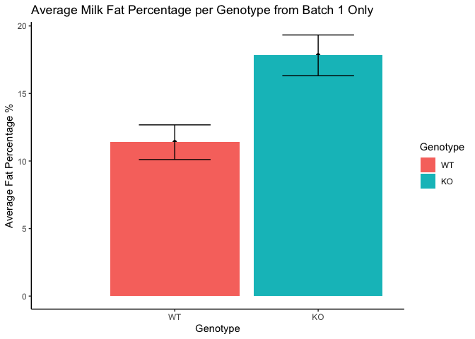
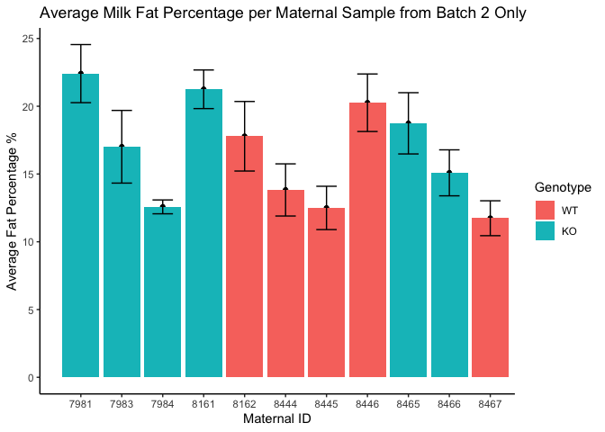
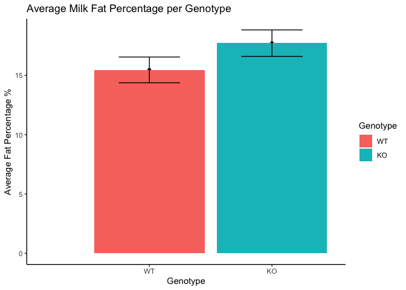
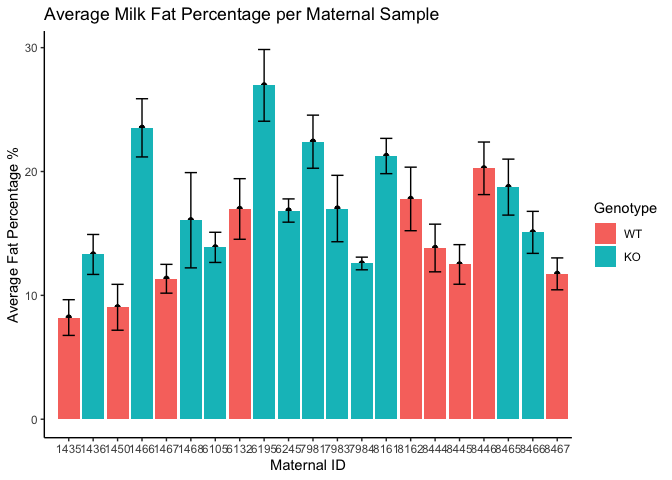

# Raw Data

The raw data file, atsc R Data, shows the cage number, maternal genotype, pup weight (g), pup eartag number, pup sex, birth date, number of deaths and the death date, pup genotype, and the parity number.


# Analysis

Describe the analysis as you intersperse code chunks


Table: Average Milk Fat Content per Sample from Batch 1

Genotype      ID   Batch   Average.Fat.Percent   SE.Average.Fat.Percent
---------  -----  ------  --------------------  -----------------------
WT          1435       1                  8.21                    1.442
WT          1450       1                  9.04                    1.853
WT          1467       1                 11.34                    1.163
WT          6132       1                 16.98                    2.446
KO          1436       1                 13.30                    1.613
KO          1466       1                 23.53                    2.350
KO          1468       1                 16.07                    3.847
KO          6105       1                 13.88                    1.218
KO          6195       1                 26.95                    2.895
KO          6245       1                 16.85                    0.939


Table: Average Milk Fat Content per Sample from Batch 1

Genotype    Batch   Average.Fat.Percent   SE.Average.Fat.Percent
---------  ------  --------------------  -----------------------
WT              1                  11.4                     1.28
KO              1                  17.8                     1.51


Table: Average Milk Fat Content per Sample from Batch 2

Genotype      ID   Batch   Average.Fat.Percent   SE.Average.Fat.Percent
---------  -----  ------  --------------------  -----------------------
WT          8162       2                  17.8                    2.566
WT          8444       2                  13.8                    1.924
WT          8445       2                  12.5                    1.598
WT          8446       2                  20.3                    2.122
WT          8467       2                  11.7                    1.288
KO          7981       2                  22.4                    2.144
KO          7983       2                  17.0                    2.681
KO          7984       2                  12.6                    0.511
KO          8161       2                  21.3                    1.425
KO          8465       2                  18.7                    2.260
KO          8466       2                  15.1                    1.696


Table: Average Milk Fat Content per Sample from Batch 2

Genotype    Batch   Average.Fat.Percent   SE.Average.Fat.Percent
---------  ------  --------------------  -----------------------
WT              2                  15.5                     1.08
KO              2                  17.7                     1.12


Table: Average Milk Fat Content per Sample from Batches 1 and 2

Genotype      ID   Batch   Average.Fat.Percent   SE.Average.Fat.Percent
---------  -----  ------  --------------------  -----------------------
WT          1435       1                  8.21                    1.442
WT          1450       1                  9.04                    1.853
WT          1467       1                 11.34                    1.163
WT          6132       1                 16.98                    2.446
WT          8162       2                 17.79                    2.566
WT          8444       2                 13.82                    1.924
WT          8445       2                 12.50                    1.598
WT          8446       2                 20.26                    2.122
WT          8467       2                 11.74                    1.288
KO          1436       1                 13.30                    1.613
KO          1466       1                 23.53                    2.350
KO          1468       1                 16.07                    3.847
KO          6105       1                 13.88                    1.218
KO          6195       1                 26.95                    2.895
KO          6245       1                 16.85                    0.939
KO          7981       2                 22.41                    2.144
KO          7983       2                 17.01                    2.681
KO          7984       2                 12.57                    0.511
KO          8161       2                 21.25                    1.425
KO          8465       2                 18.74                    2.260
KO          8466       2                 15.09                    1.696


Table: Average Milk Fat Percentage per Genotype from Batches 1 and 2

Genotype    Average.Fat   SE.Average.Fat
---------  ------------  ---------------
WT                 13.5             1.36
KO                 18.1             1.30

<!-- --><!-- --><!-- --><!-- --><!-- --><!-- -->


Table: Welch's t-test for effects of genotype on milk production from batches 1 and 2

 estimate   estimate1   estimate2   statistic   p.value   parameter   conf.low   conf.high  method                    alternative 
---------  ----------  ----------  ----------  --------  ----------  ---------  ----------  ------------------------  ------------
    -4.62        13.5        18.1       -2.45     0.024        18.3      -8.57      -0.668  Welch Two Sample t-test   two.sided   


Table: Welch's t-test for effects of genotype on milk production from batch 1 only

 estimate   estimate1   estimate2   statistic   p.value   parameter   conf.low   conf.high  method                    alternative 
---------  ----------  ----------  ----------  --------  ----------  ---------  ----------  ------------------------  ------------
    -7.04        11.4        18.4       -2.34     0.048        7.89        -14      -0.092  Welch Two Sample t-test   two.sided   


Table: Welch's t-test for effects of genotype on milk production from batch 2 only

 estimate   estimate1   estimate2   statistic   p.value   parameter   conf.low   conf.high  method                    alternative 
---------  ----------  ----------  ----------  --------  ----------  ---------  ----------  ------------------------  ------------
    -2.62        15.2        17.8       -1.18     0.271         8.7       -7.7        2.45  Welch Two Sample t-test   two.sided   

```
## 
## Call:
## lm(formula = Average.Fat.Percent ~ Genotype + as.factor(Batch), 
##     data = milk.fat.averagepersample)
## 
## Residuals:
##    Min     1Q Median     3Q    Max 
##  -6.21  -3.61  -1.43   3.62   9.46 
## 
## Coefficients:
##                   Estimate Std. Error t value  Pr(>|t|)    
## (Intercept)          12.80       1.81    7.05 0.0000014 ***
## GenotypeKO            4.69       1.94    2.41     0.027 *  
## as.factor(Batch)2     1.29       1.92    0.67     0.510    
## ---
## Signif. codes:  0 '***' 0.001 '**' 0.01 '*' 0.05 '.' 0.1 ' ' 1
## 
## Residual standard error: 4.4 on 18 degrees of freedom
## Multiple R-squared:  0.254,	Adjusted R-squared:  0.171 
## F-statistic: 3.06 on 2 and 18 DF,  p-value: 0.0717
```

# Interpretation


# Session Information


```r
sessionInfo()
```

```
## R version 4.0.0 (2020-04-24)
## Platform: x86_64-apple-darwin17.0 (64-bit)
## Running under: macOS Catalina 10.15.4
## 
## Matrix products: default
## BLAS:   /Library/Frameworks/R.framework/Versions/4.0/Resources/lib/libRblas.dylib
## LAPACK: /Library/Frameworks/R.framework/Versions/4.0/Resources/lib/libRlapack.dylib
## 
## locale:
## [1] en_US.UTF-8/en_US.UTF-8/en_US.UTF-8/C/en_US.UTF-8/en_US.UTF-8
## 
## attached base packages:
## [1] stats     graphics  grDevices utils     datasets  methods   base     
## 
## other attached packages:
## [1] ggplot2_3.3.0 readr_1.3.1   broom_0.5.6   dplyr_0.8.5   tidyr_1.0.2  
## [6] knitr_1.28   
## 
## loaded via a namespace (and not attached):
##  [1] Rcpp_1.0.4.6     pillar_1.4.4     compiler_4.0.0   highr_0.8       
##  [5] tools_4.0.0      digest_0.6.25    evaluate_0.14    lifecycle_0.2.0 
##  [9] tibble_3.0.1     nlme_3.1-147     gtable_0.3.0     lattice_0.20-41 
## [13] pkgconfig_2.0.3  rlang_0.4.6      yaml_2.2.1       xfun_0.13       
## [17] withr_2.2.0      stringr_1.4.0    generics_0.0.2   vctrs_0.2.4     
## [21] hms_0.5.3        grid_4.0.0       tidyselect_1.0.0 glue_1.4.0      
## [25] R6_2.4.1         rmarkdown_2.1    farver_2.0.3     purrr_0.3.4     
## [29] magrittr_1.5     backports_1.1.6  scales_1.1.0     ellipsis_0.3.0  
## [33] htmltools_0.4.0  assertthat_0.2.1 colorspace_1.4-1 labeling_0.3    
## [37] stringi_1.4.6    munsell_0.5.0    crayon_1.3.4
```

# References

If needed, using Rmarkdown citation tools (see this link for more information: http://rmarkdown.rstudio.com/authoring_bibliographies_and_citations.html)
