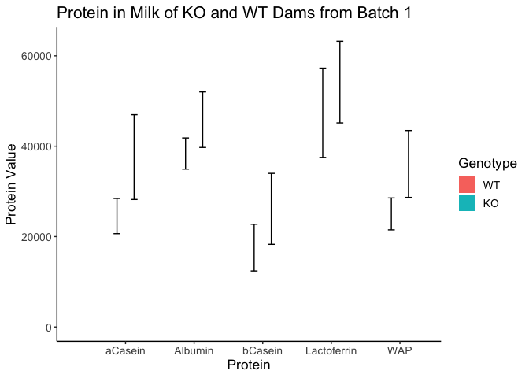
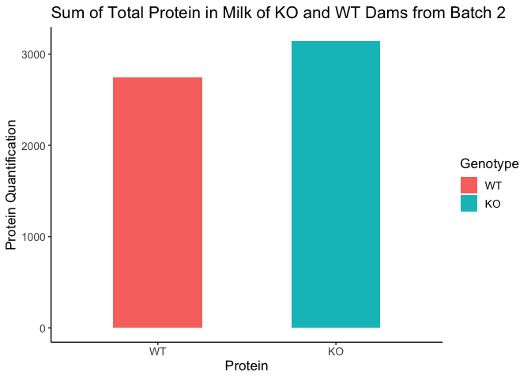
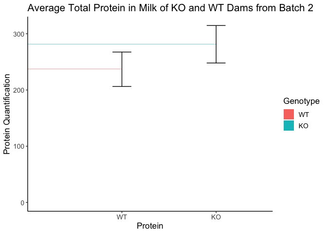

# Raw Data

Genotype   Protein        Average.Protein   SE.Average.Protein
---------  ------------  ----------------  -------------------
WT         aCasein                  24543                 3898
WT         Albumin                  38382                 3448
WT         bCasein                  17559                 5169
WT         Lactoferrin              47397                 9869
WT         WAP                      25020                 3533
KO         aCasein                  37594                 9383
KO         Albumin                  45872                 6150
KO         bCasein                  26135                 7854
KO         Lactoferrin              54190                 9033
KO         WAP                      36074                 7401

<!-- -->

Table: Welch's t-test for effects of maternal genotype on aCasein milk composition

 estimate   estimate1   estimate2   statistic   p.value   parameter   conf.low   conf.high  method                    alternative 
---------  ----------  ----------  ----------  --------  ----------  ---------  ----------  ------------------------  ------------
    -0.47       0.831         1.3       -1.31     0.236         6.2      -1.34         0.4  Welch Two Sample t-test   two.sided   

Table: Welch's t-test for effects of maternal genotype on bCasein milk composition

 estimate   estimate1   estimate2   statistic   p.value   parameter   conf.low   conf.high  method                    alternative 
---------  ----------  ----------  ----------  --------  ----------  ---------  ----------  ------------------------  ------------
    -0.52       0.825        1.34       -1.05     0.326        7.15      -1.68       0.642  Welch Two Sample t-test   two.sided   

Table: Welch's t-test for effects of maternal genotype on WAP milk composition

 estimate   estimate1   estimate2   statistic   p.value   parameter   conf.low   conf.high  method                    alternative 
---------  ----------  ----------  ----------  --------  ----------  ---------  ----------  ------------------------  ------------
   -0.392       0.855        1.25       -1.35      0.22        6.63      -1.08         0.3  Welch Two Sample t-test   two.sided   

Table: Welch's t-test for effects of maternal genotype on Lactoferrin milk composition

 estimate   estimate1   estimate2   statistic   p.value   parameter   conf.low   conf.high  method                    alternative 
---------  ----------  ----------  ----------  --------  ----------  ---------  ----------  ------------------------  ------------
   -0.144        1.01        1.15      -0.672     0.525        6.26     -0.661       0.374  Welch Two Sample t-test   two.sided   

Table: Welch's t-test for effects of maternal genotype on Albumin milk composition

 estimate   estimate1   estimate2   statistic   p.value   parameter   conf.low   conf.high  method                    alternative 
---------  ----------  ----------  ----------  --------  ----------  ---------  ----------  ------------------------  ------------
   -0.188       0.969        1.16       -1.19      0.27        7.67     -0.555       0.179  Welch Two Sample t-test   two.sided   

Genotype   Protein        Average.Protein   SE.Average.Protein
---------  ------------  ----------------  -------------------
WT         aCasein                  219.8                36.26
WT         Albumin                  613.2                54.64
WT         Band1                    186.8                59.68
WT         Band2                     46.0                15.51
WT         Band6                     73.1                14.37
WT         Band8                     78.2                 6.57
WT         bCasein                   96.1                16.58
WT         Lactoferrin              495.2                40.72
WT         WAP                      323.8                31.15
KO         aCasein                  281.8                32.85
KO         Albumin                  756.3                69.35
KO         Band1                    191.3                32.85
KO         Band2                     55.4                 9.07
KO         Band6                     95.2                11.31
KO         Band8                     95.5                 6.87
KO         bCasein                  120.0                15.24
KO         Lactoferrin              580.8                55.39
KO         WAP                      355.7                23.48

<!-- -->

Table: Welch's t-test for effects of maternal genotype on aCasein milk composition

 estimate   estimate1   estimate2   statistic   p.value   parameter   conf.low   conf.high  method                    alternative 
---------  ----------  ----------  ----------  --------  ----------  ---------  ----------  ------------------------  ------------
      -62         220         282       -1.27     0.238        8.62       -173        49.4  Welch Two Sample t-test   two.sided   

Table: Welch's t-test for effects of maternal genotype on bCasein milk composition

 estimate   estimate1   estimate2   statistic   p.value   parameter   conf.low   conf.high  method                    alternative 
---------  ----------  ----------  ----------  --------  ----------  ---------  ----------  ------------------------  ------------
      -24        96.1         120       -1.06     0.315        8.66      -75.2        27.2  Welch Two Sample t-test   two.sided   

Table: Welch's t-test for effects of maternal genotype on WAP milk composition

 estimate   estimate1   estimate2   statistic   p.value   parameter   conf.low   conf.high  method                    alternative 
---------  ----------  ----------  ----------  --------  ----------  ---------  ----------  ------------------------  ------------
    -31.9         324         356      -0.817     0.438        7.82       -122        58.5  Welch Two Sample t-test   two.sided   

Table: Welch's t-test for effects of maternal genotype on Lactoferrin milk composition

 estimate   estimate1   estimate2   statistic   p.value   parameter   conf.low   conf.high  method                    alternative 
---------  ----------  ----------  ----------  --------  ----------  ---------  ----------  ------------------------  ------------
    -85.6         495         581       -1.25     0.245        8.69       -242        70.7  Welch Two Sample t-test   two.sided   

Table: Welch's t-test for effects of maternal genotype on Albumin milk composition

 estimate   estimate1   estimate2   statistic   p.value   parameter   conf.low   conf.high  method                    alternative 
---------  ----------  ----------  ----------  --------  ----------  ---------  ----------  ------------------------  ------------
     -143         613         756       -1.62      0.14        8.86       -343        57.1  Welch Two Sample t-test   two.sided   

Table: Welch's t-test for effects of maternal genotype on Albumin milk composition

 estimate   estimate1   estimate2   statistic   p.value   parameter   conf.low   conf.high  method                    alternative 
---------  ----------  ----------  ----------  --------  ----------  ---------  ----------  ------------------------  ------------
    -4.53         187         191      -0.067     0.949        6.33       -169         160  Welch Two Sample t-test   two.sided   

Table: Welch's t-test for effects of maternal genotype on Albumin milk composition

 estimate   estimate1   estimate2   statistic   p.value   parameter   conf.low   conf.high  method                    alternative 
---------  ----------  ----------  ----------  --------  ----------  ---------  ----------  ------------------------  ------------
     -9.4          46        55.4      -0.523     0.618        6.59      -52.4        33.6  Welch Two Sample t-test   two.sided   

Table: Welch's t-test for effects of maternal genotype on Albumin milk composition

 estimate   estimate1   estimate2   statistic   p.value   parameter   conf.low   conf.high  method                    alternative 
---------  ----------  ----------  ----------  --------  ----------  ---------  ----------  ------------------------  ------------
    -22.1        73.1        95.2       -1.21     0.261        8.03      -64.3          20  Welch Two Sample t-test   two.sided   

Table: Welch's t-test for effects of maternal genotype on Albumin milk composition

 estimate   estimate1   estimate2   statistic   p.value   parameter   conf.low   conf.high  method                    alternative 
---------  ----------  ----------  ----------  --------  ----------  ---------  ----------  ------------------------  ------------
    -17.2        78.2        95.5       -1.81     0.103        8.96      -38.8        4.26  Welch Two Sample t-test   two.sided   

Protein       Genotype      ID    Value   Total
------------  ---------  -----  -------  ------
aCasein       KO          8466    225.0    2256
aCasein       WT          8162    167.0    1717
aCasein       KO          8161    293.0    2438
aCasein       WT          8445    184.0    2041
aCasein       KO          7983    179.0    2064
aCasein       WT          8444    324.0    2741
aCasein       KO          7981    249.0    3030
aCasein       WT          8446    287.0    2282
aCasein       KO          7984    351.0    2265
aCasein       WT          8467    137.0    1881
aCasein       KO          8465    394.0    3139
bCasein       KO          8466    116.0    2256
bCasein       WT          8162     60.1    1717
bCasein       KO          8161    153.0    2438
bCasein       WT          8445     96.6    2041
bCasein       KO          7983     81.3    2064
bCasein       WT          8444    124.0    2741
bCasein       KO          7981     76.0    3030
bCasein       WT          8446    141.0    2282
bCasein       KO          7984    125.0    2265
bCasein       WT          8467     58.6    1881
bCasein       KO          8465    169.0    3139
WAP           KO          8466    285.0    2256
WAP           WT          8162    311.0    1717
WAP           KO          8161    397.0    2438
WAP           WT          8445    308.0    2041
WAP           KO          7983    371.0    2064
WAP           WT          8444    397.0    2741
WAP           KO          7981    440.0    3030
WAP           WT          8446    381.0    2282
WAP           KO          7984    323.0    2265
WAP           WT          8467    222.0    1881
WAP           KO          8465    318.0    3139
Lactoferrin   KO          8466    602.0    2256
Lactoferrin   WT          8162    455.0    1717
Lactoferrin   KO          8161    518.0    2438
Lactoferrin   WT          8445    518.0    2041
Lactoferrin   KO          7983    512.0    2064
Lactoferrin   WT          8444    407.0    2741
Lactoferrin   KO          7981    601.0    3030
Lactoferrin   WT          8446    454.0    2282
Lactoferrin   KO          7984    428.0    2265
Lactoferrin   WT          8467    642.0    1881
Lactoferrin   KO          8465    824.0    3139
Albumin       KO          8466    711.0    2256
Albumin       WT          8162    460.0    1717
Albumin       KO          8161    675.0    2438
Albumin       WT          8445    671.0    2041
Albumin       KO          7983    575.0    2064
Albumin       WT          8444    759.0    2741
Albumin       KO          7981   1060.0    3030
Albumin       WT          8446    660.0    2282
Albumin       KO          7984    686.0    2265
Albumin       WT          8467    516.0    1881
Albumin       KO          8465    831.0    3139
Band1         KO          8466    128.0    2256
Band1         WT          8162    117.0    1717
Band1         KO          8161    127.0    2438
Band1         WT          8445    114.0    2041
Band1         KO          7983    160.0    2064
Band1         WT          8444    423.0    2741
Band1         KO          7981    296.0    3030
Band1         WT          8446    119.0    2282
Band1         KO          7984    145.0    2265
Band1         WT          8467    161.0    1881
Band1         KO          8465    292.0    3139
Band2         KO          8466     27.7    2256
Band2         WT          8162     27.2    1717
Band2         KO          8161     64.3    2438
Band2         WT          8445     19.7    2041
Band2         KO          7983     39.8    2064
Band2         WT          8444    106.0    2741
Band2         KO          7981     88.2    3030
Band2         WT          8446     43.7    2282
Band2         KO          7984     43.9    2265
Band2         WT          8467     33.3    1881
Band2         KO          8465     68.4    3139
Band6         KO          8466     60.6    2256
Band6         WT          8162     56.6    1717
Band6         KO          8161    115.0    2438
Band6         WT          8445     47.5    2041
Band6         KO          7983     64.0    2064
Band6         WT          8444    116.0    2741
Band6         KO          7981    116.0    3030
Band6         WT          8446     98.8    2282
Band6         KO          7984     91.7    2265
Band6         WT          8467     46.6    1881
Band6         KO          8465    124.0    3139
Band8         KO          8466    101.0    2256
Band8         WT          8162     62.8    1717
Band8         KO          8161     95.6    2438
Band8         WT          8445     82.0    2041
Band8         KO          7983     81.6    2064
Band8         WT          8444     84.7    2741
Band8         KO          7981    104.0    3030
Band8         WT          8446     97.5    2282
Band8         KO          7984     71.7    2265
Band8         WT          8467     64.2    1881
Band8         KO          8465    119.0    3139

<!-- -->

Protein       Genotype      ID    Value   Total
------------  ---------  -----  -------  ------
aCasein       KO          8466    225.0   15193
aCasein       WT          8162    167.0   10661
aCasein       KO          8161    293.0   15193
aCasein       WT          8445    184.0   10661
aCasein       KO          7983    179.0   15193
aCasein       WT          8444    324.0   10661
aCasein       KO          7981    249.0   15193
aCasein       WT          8446    287.0   10661
aCasein       KO          7984    351.0   15193
aCasein       WT          8467    137.0   10661
aCasein       KO          8465    394.0   15193
bCasein       KO          8466    116.0   15193
bCasein       WT          8162     60.1   10661
bCasein       KO          8161    153.0   15193
bCasein       WT          8445     96.6   10661
bCasein       KO          7983     81.3   15193
bCasein       WT          8444    124.0   10661
bCasein       KO          7981     76.0   15193
bCasein       WT          8446    141.0   10661
bCasein       KO          7984    125.0   15193
bCasein       WT          8467     58.6   10661
bCasein       KO          8465    169.0   15193
WAP           KO          8466    285.0   15193
WAP           WT          8162    311.0   10661
WAP           KO          8161    397.0   15193
WAP           WT          8445    308.0   10661
WAP           KO          7983    371.0   15193
WAP           WT          8444    397.0   10661
WAP           KO          7981    440.0   15193
WAP           WT          8446    381.0   10661
WAP           KO          7984    323.0   15193
WAP           WT          8467    222.0   10661
WAP           KO          8465    318.0   15193
Lactoferrin   KO          8466    602.0   15193
Lactoferrin   WT          8162    455.0   10661
Lactoferrin   KO          8161    518.0   15193
Lactoferrin   WT          8445    518.0   10661
Lactoferrin   KO          7983    512.0   15193
Lactoferrin   WT          8444    407.0   10661
Lactoferrin   KO          7981    601.0   15193
Lactoferrin   WT          8446    454.0   10661
Lactoferrin   KO          7984    428.0   15193
Lactoferrin   WT          8467    642.0   10661
Lactoferrin   KO          8465    824.0   15193
Albumin       KO          8466    711.0   15193
Albumin       WT          8162    460.0   10661
Albumin       KO          8161    675.0   15193
Albumin       WT          8445    671.0   10661
Albumin       KO          7983    575.0   15193
Albumin       WT          8444    759.0   10661
Albumin       KO          7981   1060.0   15193
Albumin       WT          8446    660.0   10661
Albumin       KO          7984    686.0   15193
Albumin       WT          8467    516.0   10661
Albumin       KO          8465    831.0   15193
Band1         KO          8466    128.0   15193
Band1         WT          8162    117.0   10661
Band1         KO          8161    127.0   15193
Band1         WT          8445    114.0   10661
Band1         KO          7983    160.0   15193
Band1         WT          8444    423.0   10661
Band1         KO          7981    296.0   15193
Band1         WT          8446    119.0   10661
Band1         KO          7984    145.0   15193
Band1         WT          8467    161.0   10661
Band1         KO          8465    292.0   15193
Band2         KO          8466     27.7   15193
Band2         WT          8162     27.2   10661
Band2         KO          8161     64.3   15193
Band2         WT          8445     19.7   10661
Band2         KO          7983     39.8   15193
Band2         WT          8444    106.0   10661
Band2         KO          7981     88.2   15193
Band2         WT          8446     43.7   10661
Band2         KO          7984     43.9   15193
Band2         WT          8467     33.3   10661
Band2         KO          8465     68.4   15193
Band6         KO          8466     60.6   15193
Band6         WT          8162     56.6   10661
Band6         KO          8161    115.0   15193
Band6         WT          8445     47.5   10661
Band6         KO          7983     64.0   15193
Band6         WT          8444    116.0   10661
Band6         KO          7981    116.0   15193
Band6         WT          8446     98.8   10661
Band6         KO          7984     91.7   15193
Band6         WT          8467     46.6   10661
Band6         KO          8465    124.0   15193
Band8         KO          8466    101.0   15193
Band8         WT          8162     62.8   10661
Band8         KO          8161     95.6   15193
Band8         WT          8445     82.0   10661
Band8         KO          7983     81.6   15193
Band8         WT          8444     84.7   10661
Band8         KO          7981    104.0   15193
Band8         WT          8446     97.5   10661
Band8         KO          7984     71.7   15193
Band8         WT          8467     64.2   10661
Band8         KO          8465    119.0   15193

<!-- -->

Genotype    Average.Protein   SE.Average.Protein
---------  ----------------  -------------------
WT                      237                 30.6
KO                      281                 33.4

<!-- -->

