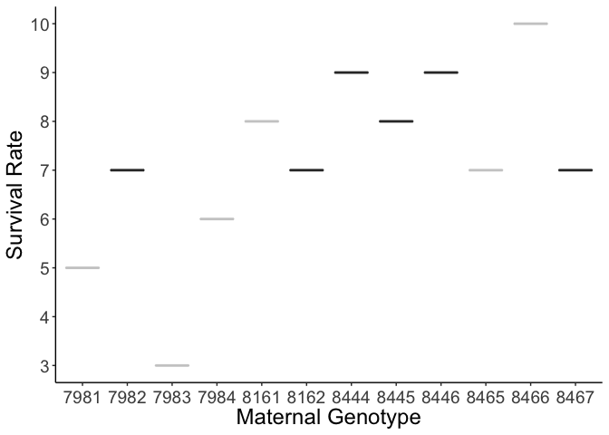
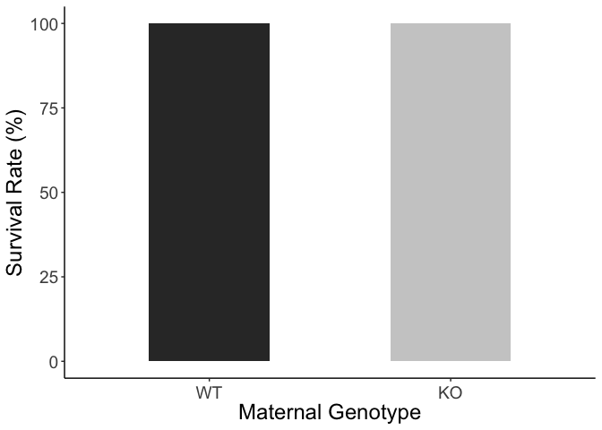
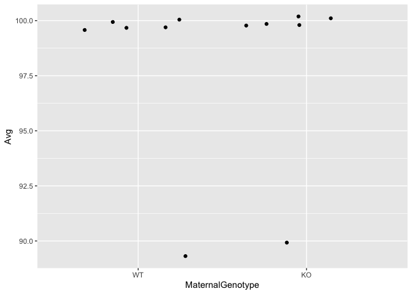
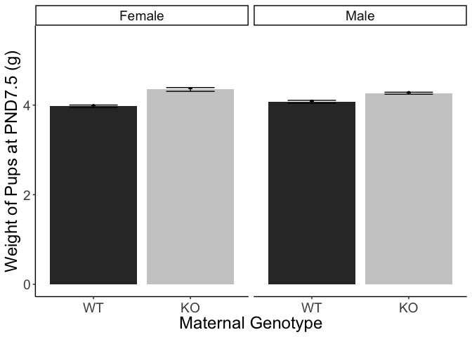
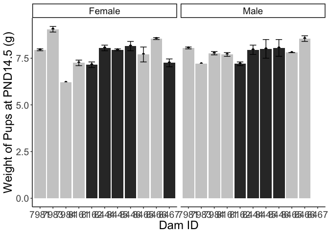
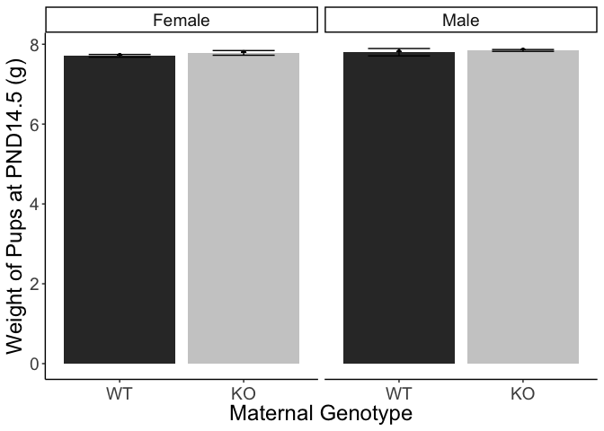
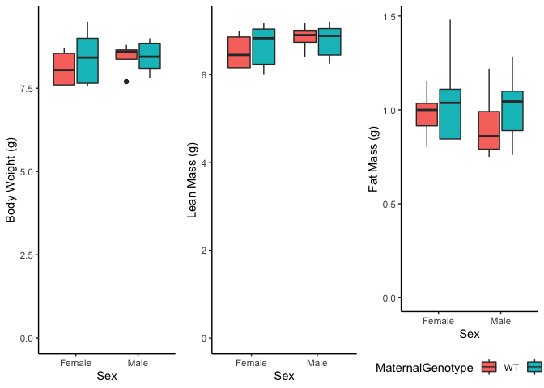

# Raw Data


Table: Average Births and Survival Rates per Cage

| MaternalID|MaternalGenotype |BirthDate | Dead|na.rm | Total|is.na | Litter| Alive| alive.percent| survival.rate| Average.Births.Per.Litter|
|----------:|:----------------|:---------|----:|:-----|-----:|:-----|------:|-----:|-------------:|-------------:|-------------------------:|
|       7981|KO               |6/8/19    |    0|TRUE  |     5|NA    |      1|     5|         100.0|         1.000|                         5|
|       7982|WT               |6/20/19   |    0|TRUE  |     7|NA    |      1|     7|         100.0|         1.000|                         7|
|       7983|KO               |6/7/19    |    0|TRUE  |     3|NA    |      1|     3|         100.0|         1.000|                         3|
|       7984|KO               |6/9/19    |    0|TRUE  |     6|NA    |      1|     6|         100.0|         1.000|                         6|
|       8161|KO               |6/6/19    |    0|TRUE  |     8|NA    |      1|     8|         100.0|         1.000|                         8|
|       8162|WT               |6/5/19    |    0|TRUE  |     7|NA    |      1|     7|         100.0|         1.000|                         7|
|       8444|WT               |7/5/19    |    1|TRUE  |     9|NA    |      1|     8|          88.9|         0.889|                         9|
|       8445|WT               |7/6/19    |    0|TRUE  |     8|NA    |      1|     8|         100.0|         1.000|                         8|
|       8446|WT               |7/8/19    |    0|TRUE  |     9|NA    |      1|     9|         100.0|         1.000|                         9|
|       8465|KO               |7/8/19    |    0|TRUE  |     7|NA    |      1|     7|         100.0|         1.000|                         7|
|       8466|KO               |7/3/19    |    1|TRUE  |    10|NA    |      1|     9|          90.0|         0.900|                        10|
|       8467|WT               |7/6/19    |    0|TRUE  |     7|NA    |      1|     7|         100.0|         1.000|                         7|


Table: Average Survival per Genotype

|MaternalGenotype | Average.Survival| SE.Average.Survival| Number|
|:----------------|----------------:|-------------------:|------:|
|WT               |             98.1|                1.85|      6|
|KO               |             98.3|                1.67|      6|

<!-- -->

Table: Welch's t-test for effects of maternal genotype on survival rate

| estimate| estimate1| estimate2| statistic| p.value| parameter| conf.low| conf.high|method                  |alternative |
|--------:|---------:|---------:|---------:|-------:|---------:|--------:|---------:|:-----------------------|:-----------|
|     1.33|      7.67|      6.33|      1.41|   0.204|       6.4|   -0.939|      3.61|Welch Two Sample t-test |two.sided   |

<!-- --><!-- -->

Table: Welch's t-test for effects of maternal genotype on births

| estimate| estimate1| estimate2| statistic| p.value| parameter| conf.low| conf.high|method                  |alternative |
|--------:|---------:|---------:|---------:|-------:|---------:|--------:|---------:|:-----------------------|:-----------|
|     1.33|      7.83|       6.5|      1.25|   0.255|       6.6|    -1.23|       3.9|Welch Two Sample t-test |two.sided   |

<!-- --><!-- --><!-- -->


| MaternalID|MaternalGenotype | Average.Weight| SE.Average.Weight| Average.size| Total|is.na |
|----------:|:----------------|--------------:|-----------------:|------------:|-----:|:-----|
|       7981|KO               |           1.44|             0.016|            5|     5|NA    |
|       7982|WT               |           1.33|             0.026|            7|     7|NA    |
|       7983|KO               |           1.47|             0.058|            3|     3|NA    |
|       7984|KO               |           1.35|             0.021|            6|     6|NA    |
|       8161|KO               |           1.23|             0.025|            8|     8|NA    |
|       8162|WT               |           1.29|             0.045|            7|     7|NA    |
|       8444|WT               |           1.32|             0.017|            8|     8|NA    |
|       8445|WT               |           1.26|             0.021|            8|     8|NA    |
|       8446|WT               |           1.24|             0.024|            9|     9|NA    |
|       8465|KO               |           1.38|             0.024|            7|     7|NA    |
|       8466|KO               |           1.31|             0.030|            9|     9|NA    |
|       8467|WT               |           1.28|             0.033|            7|     7|NA    |


|MaternalGenotype | Average.Weight| SE.Average.Weight| Average.size| Total|is.na |
|:----------------|--------------:|-----------------:|------------:|-----:|:-----|
|WT               |           1.29|             0.004|            1|     1|NA    |
|KO               |           1.36|             0.006|            1|     1|NA    |


|term             | df| sumsq| meansq| statistic| p.value|
|:----------------|--:|-----:|------:|---------:|-------:|
|MaternalGenotype |  1| 0.018|  0.018|      3.97|   0.074|
|Residuals        | 10| 0.045|  0.005|        NA|      NA|


|term               | estimate| std.error| statistic| p.value|
|:------------------|--------:|---------:|---------:|-------:|
|(Intercept)        |    1.286|     0.028|     46.75|   0.000|
|MaternalGenotypeKO |    0.078|     0.039|      1.99|   0.074|


| MaternalID|MaternalGenotype |Sex    | Average.Weight| SE.Average.Weight| Average.size| Total|is.na |
|----------:|:----------------|:------|--------------:|-----------------:|------------:|-----:|:-----|
|       7981|KO               |Female |           4.20|             0.000|            2|     2|NA    |
|       7981|KO               |Male   |           4.25|             0.150|            2|     2|NA    |
|       7983|KO               |Female |           4.70|             0.100|            2|     2|NA    |
|       7983|KO               |Male   |           4.30|                NA|            1|     1|NA    |
|       7984|KO               |Female |           4.40|                NA|            1|     1|NA    |
|       7984|KO               |Male   |           4.10|             0.058|            3|     3|NA    |
|       8161|KO               |Female |           3.95|             0.050|            2|     2|NA    |
|       8161|KO               |Male   |           4.15|             0.050|            2|     2|NA    |
|       8162|WT               |Female |           3.65|             0.050|            2|     2|NA    |
|       8162|WT               |Male   |           3.90|             0.100|            2|     2|NA    |
|       8444|WT               |Female |           4.10|             0.000|            2|     2|NA    |
|       8444|WT               |Male   |           4.10|             0.000|            2|     2|NA    |
|       8445|WT               |Female |           4.00|             0.100|            2|     2|NA    |
|       8445|WT               |Male   |           4.05|             0.050|            2|     2|NA    |
|       8446|WT               |Female |           4.35|             0.150|            2|     2|NA    |
|       8446|WT               |Male   |           4.25|             0.150|            2|     2|NA    |
|       8465|KO               |Female |           4.35|             0.250|            2|     2|NA    |
|       8465|KO               |Male   |           4.15|             0.150|            2|     2|NA    |
|       8466|KO               |Female |           4.50|             0.000|            2|     2|NA    |
|       8466|KO               |Male   |           4.65|             0.050|            2|     2|NA    |
|       8467|WT               |Female |           3.77|             0.131|            4|     4|NA    |


|MaternalGenotype |Sex    | Average.Weight| SE.Average.Weight| Average.size| Total|is.na |
|:----------------|:------|--------------:|-----------------:|------------:|-----:|:-----|
|WT               |Female |           3.98|             0.027|            1|     1|NA    |
|WT               |Male   |           4.08|             0.032|            1|     1|NA    |
|KO               |Female |           4.35|             0.042|            1|     1|NA    |
|KO               |Male   |           4.27|             0.022|            1|     1|NA    |


Table: Welch's t-test for effects of maternal genotype on PND7 weights in males

| estimate| estimate1| estimate2| statistic| p.value| parameter| conf.low| conf.high|method                  |alternative |
|--------:|---------:|---------:|---------:|-------:|---------:|--------:|---------:|:-----------------------|:-----------|
|   -0.175|      4.08|      4.25|        -2|   0.061|      17.7|   -0.359|     0.009|Welch Two Sample t-test |two.sided   |


Table: Welch's t-test for effects of maternal genotype on PND7 weights in males

| estimate| estimate1| estimate2| statistic| p.value| parameter| conf.low| conf.high|method                  |alternative |
|--------:|---------:|---------:|---------:|-------:|---------:|--------:|---------:|:-----------------------|:-----------|
|   -0.404|      3.94|      4.34|     -3.35|   0.003|      20.9|   -0.655|    -0.153|Welch Two Sample t-test |two.sided   |


|term             | df| sumsq| meansq| statistic| p.value|
|:----------------|--:|-----:|------:|---------:|-------:|
|MaternalGenotype |  1| 0.429|  0.429|     8.208|   0.010|
|Sex              |  1| 0.000|  0.000|     0.003|   0.958|
|Residuals        | 18| 0.941|  0.052|        NA|      NA|


|term               | estimate| std.error| statistic| p.value|
|:------------------|--------:|---------:|---------:|-------:|
|(Intercept)        |    4.022|     0.088|    45.573|   0.000|
|MaternalGenotypeKO |    0.289|     0.101|     2.864|   0.010|
|SexMale            |   -0.005|     0.100|    -0.053|   0.958|


Table: Test for sex-modification, not significant

|term                 | df| sumsq| meansq| statistic| p.value|
|:--------------------|--:|-----:|------:|---------:|-------:|
|MaternalGenotype     |  1| 0.429|  0.429|     8.122|   0.011|
|Sex                  |  1| 0.000|  0.000|     0.003|   0.958|
|MaternalGenotype:Sex |  1| 0.043|  0.043|     0.812|   0.380|
|Residuals            | 17| 0.898|  0.053|        NA|      NA|


| MaternalID|MaternalGenotype |Sex    | Average.Weight| SE.Average.Weight| Average.size| Total|is.na |
|----------:|:----------------|:------|--------------:|-----------------:|------------:|-----:|:-----|
|       7981|KO               |Female |           7.95|             0.050|            2|     2|NA    |
|       7981|KO               |Male   |           8.05|             0.050|            2|     2|NA    |
|       7983|KO               |Female |           9.05|             0.150|            2|     2|NA    |
|       7983|KO               |Male   |           7.20|                NA|            1|     1|NA    |
|       7984|KO               |Female |           6.20|                NA|            1|     1|NA    |
|       7984|KO               |Male   |           7.77|             0.088|            3|     3|NA    |
|       8161|KO               |Female |           7.25|             0.150|            2|     2|NA    |
|       8161|KO               |Male   |           7.70|             0.100|            2|     2|NA    |
|       8162|WT               |Female |           7.15|             0.150|            2|     2|NA    |
|       8162|WT               |Male   |           7.20|             0.100|            2|     2|NA    |
|       8444|WT               |Female |           8.05|             0.150|            2|     2|NA    |
|       8444|WT               |Male   |           7.95|             0.250|            2|     2|NA    |
|       8445|WT               |Female |           7.95|             0.050|            2|     2|NA    |
|       8445|WT               |Male   |           8.00|             0.500|            2|     2|NA    |
|       8446|WT               |Female |           8.15|             0.250|            2|     2|NA    |
|       8446|WT               |Male   |           8.05|             0.450|            2|     2|NA    |
|       8465|KO               |Female |           7.70|             0.400|            2|     2|NA    |
|       8465|KO               |Male   |           7.80|             0.000|            2|     2|NA    |
|       8466|KO               |Female |           8.55|             0.050|            2|     2|NA    |
|       8466|KO               |Male   |           8.55|             0.150|            2|     2|NA    |
|       8467|WT               |Female |           7.25|             0.210|            4|     4|NA    |


|MaternalGenotype |Sex    | Average.Weight| SE.Average.Weight| Average.size| Total|is.na |
|:----------------|:------|--------------:|-----------------:|------------:|-----:|:-----|
|WT               |Female |           7.71|             0.034|            1|     1|NA    |
|WT               |Male   |           7.80|             0.092|            1|     1|NA    |
|KO               |Female |           7.78|             0.058|            1|     1|NA    |
|KO               |Male   |           7.84|             0.023|            1|     1|NA    |


|term             | df| sumsq| meansq| statistic| p.value|
|:----------------|--:|-----:|------:|---------:|-------:|
|MaternalGenotype |  1| 0.021|  0.021|     0.051|   0.824|
|Sex              |  1| 0.028|  0.028|     0.069|   0.796|
|Residuals        | 18| 7.381|  0.410|        NA|      NA|


|term                 | df| sumsq| meansq| statistic| p.value|
|:--------------------|--:|-----:|------:|---------:|-------:|
|MaternalGenotype     |  1| 0.021|  0.021|     0.048|   0.829|
|Sex                  |  1| 0.028|  0.028|     0.065|   0.802|
|MaternalGenotype:Sex |  1| 0.001|  0.001|     0.002|   0.961|
|Residuals            | 17| 7.380|  0.434|        NA|      NA|


| MaternalID|MaternalGenotype |Sex    | Average.Weight| SE.Average.Weight| Average.size| Total|is.na |
|----------:|:----------------|:------|--------------:|-----------------:|------------:|-----:|:-----|
|       7981|KO               |Female |           8.60|             0.100|            2|     2|NA    |
|       7981|KO               |Male   |           8.85|             0.050|            2|     2|NA    |
|       7983|KO               |Female |           9.50|             0.500|            2|     2|NA    |
|       7983|KO               |Male   |           7.80|                NA|            1|     1|NA    |
|       7984|KO               |Female |           6.90|                NA|            1|     1|NA    |
|       7984|KO               |Male   |           8.10|             0.058|            3|     3|NA    |
|       8161|KO               |Female |           7.65|             0.150|            2|     2|NA    |
|       8161|KO               |Male   |           8.15|             0.050|            2|     2|NA    |
|       8162|WT               |Female |           7.65|             0.150|            2|     2|NA    |
|       8162|WT               |Male   |           7.70|             0.100|            2|     2|NA    |
|       8444|WT               |Female |           8.55|             0.050|            2|     2|NA    |
|       8444|WT               |Male   |           8.60|             0.200|            2|     2|NA    |
|       8445|WT               |Female |           8.45|             0.050|            2|     2|NA    |
|       8445|WT               |Male   |           8.60|             0.500|            2|     2|NA    |
|       8446|WT               |Female |           8.70|             0.100|            2|     2|NA    |
|       8446|WT               |Male   |           8.80|             0.500|            2|     2|NA    |
|       8465|KO               |Female |           8.25|             0.350|            2|     2|NA    |
|       8465|KO               |Male   |           8.45|             0.050|            2|     2|NA    |
|       8466|KO               |Female |           9.00|             0.100|            2|     2|NA    |
|       8466|KO               |Male   |           9.00|             0.000|            2|     2|NA    |
|       8467|WT               |Female |           7.60|             0.248|            4|     4|NA    |


|MaternalGenotype |Sex    | Average.Weight| SE.Average.Weight| Average.size| Total|is.na |
|:----------------|:------|--------------:|-----------------:|------------:|-----:|:-----|
|WT               |Female |           8.19|             0.037|            1|     1|NA    |
|WT               |Male   |           8.43|             0.103|            1|     1|NA    |
|KO               |Female |           8.32|             0.073|            1|     1|NA    |
|KO               |Male   |           8.39|             0.010|            1|     1|NA    |


|term             | df| sumsq| meansq| statistic| p.value|
|:----------------|--:|-----:|------:|---------:|-------:|
|MaternalGenotype |  1| 0.018|  0.018|     0.045|   0.834|
|Sex              |  1| 0.107|  0.107|     0.262|   0.615|
|Residuals        | 18| 7.338|  0.408|        NA|      NA|


|term                 | df| sumsq| meansq| statistic| p.value|
|:--------------------|--:|-----:|------:|---------:|-------:|
|MaternalGenotype     |  1| 0.018|  0.018|     0.043|   0.839|
|Sex                  |  1| 0.107|  0.107|     0.249|   0.624|
|MaternalGenotype:Sex |  1| 0.033|  0.033|     0.076|   0.786|
|Residuals            | 17| 7.305|  0.430|        NA|      NA|

<!-- --><!-- -->

Table: Welch's t-test for effects of maternal genotype on PND1 weights

| estimate| estimate1| estimate2| statistic| p.value| parameter| conf.low| conf.high|method                  |alternative |
|--------:|---------:|---------:|---------:|-------:|---------:|--------:|---------:|:-----------------------|:-----------|
|   -0.078|      1.29|      1.36|     -1.99|    0.09|      6.43|   -0.171|     0.016|Welch Two Sample t-test |two.sided   |

```
## [1] 0.39
```


Table: Welch's t-test for effects of maternal genotype on PND1 weights on offspring, not separated by sex

|term  | df| statistic| p.value|
|:-----|--:|---------:|-------:|
|group |  1|      4.31|   0.065|
|      | 10|        NA|      NA|


Table: Pup weight at PND1

|term             | df| sumsq| meansq| statistic| p.value|
|:----------------|--:|-----:|------:|---------:|-------:|
|MaternalGenotype |  1| 0.018|  0.018|      3.97|   0.074|
|Residuals        | 10| 0.045|  0.005|        NA|      NA|


Table: Pup weight at PND1

|term               | estimate| std.error| statistic| p.value|
|:------------------|--------:|---------:|---------:|-------:|
|(Intercept)        |    1.286|     0.028|     46.75|   0.000|
|MaternalGenotypeKO |    0.078|     0.039|      1.99|   0.074|


Table: Welch's t-test for effects of maternal genotype on PND1 weights in offspring

| estimate| estimate1| estimate2| statistic| p.value| parameter| conf.low| conf.high|method            |alternative |
|--------:|---------:|---------:|---------:|-------:|---------:|--------:|---------:|:-----------------|:-----------|
|   -0.078|      1.29|      1.36|     -1.99|   0.074|        10|   -0.164|     0.009|Two Sample t-test |two.sided   |

<!-- --><!-- -->

Table: Shapiro tests for PND7 pup weights aggregated by cage

|Sex    |MaternalGenotype | Shapiro|
|:------|:----------------|-------:|
|Female |WT               |   0.919|
|Female |KO               |   0.982|
|Male   |WT               |   0.962|
|Male   |KO               |   0.065|


Table: Welch's t-test for effects of maternal genotype on PND7 weights in males

|term  | df| statistic| p.value|
|:-----|--:|---------:|-------:|
|group |  1|     0.146|   0.712|
|      |  8|        NA|      NA|


Table: Welch's t-test for effects of maternal genotype on PND7 weights in females

|term  | df| statistic| p.value|
|:-----|--:|---------:|-------:|
|group |  1|     0.051|   0.827|
|      |  9|        NA|      NA|


Table: Pup weight at PND7, including moderation by sex

|term                 | df| sumsq| meansq| statistic| p.value|
|:--------------------|--:|-----:|------:|---------:|-------:|
|MaternalGenotype     |  1| 0.429|  0.429|     8.122|   0.011|
|Sex                  |  1| 0.000|  0.000|     0.003|   0.958|
|MaternalGenotype:Sex |  1| 0.043|  0.043|     0.812|   0.380|
|Residuals            | 17| 0.898|  0.053|        NA|      NA|


Table: Pup weight at PND7, including adjustment by sex

|term               | estimate| std.error| statistic| p.value|
|:------------------|--------:|---------:|---------:|-------:|
|(Intercept)        |    4.022|     0.088|    45.573|   0.000|
|MaternalGenotypeKO |    0.289|     0.101|     2.864|   0.010|
|SexMale            |   -0.005|     0.100|    -0.053|   0.958|


Table: Welch's t-test for effects of maternal genotype on PND7 weights in males

| estimate| estimate1| estimate2| statistic| p.value| parameter| conf.low| conf.high|method            |alternative |
|--------:|---------:|---------:|---------:|-------:|---------:|--------:|---------:|:-----------------|:-----------|
|   -0.192|      4.08|      4.27|     -1.63|   0.142|         8|   -0.463|      0.08|Two Sample t-test |two.sided   |


Table: Welch's t-test for effects of maternal genotype on PND7 weights in females

| estimate| estimate1| estimate2| statistic| p.value| parameter| conf.low| conf.high|method            |alternative |
|--------:|---------:|---------:|---------:|-------:|---------:|--------:|---------:|:-----------------|:-----------|
|   -0.375|      3.98|      4.35|     -2.34|   0.044|         9|   -0.738|    -0.012|Two Sample t-test |two.sided   |

<!-- --><!-- -->

Table: Welch's t-test for effects of maternal genotype on PND14 weights in males

| estimate| estimate1| estimate2| statistic| p.value| parameter| conf.low| conf.high|method                  |alternative |
|--------:|---------:|---------:|---------:|-------:|---------:|--------:|---------:|:-----------------------|:-----------|
|   -0.044|       7.8|      7.84|    -0.164|   0.874|      7.06|   -0.683|     0.594|Welch Two Sample t-test |two.sided   |


Table: Welch's t-test for effects of maternal genotype on PND14 weights in females

| estimate| estimate1| estimate2| statistic| p.value| parameter| conf.low| conf.high|method                  |alternative |
|--------:|---------:|---------:|---------:|-------:|---------:|--------:|---------:|:-----------------------|:-----------|
|   -0.073|      7.71|      7.78|    -0.159|   0.878|      7.37|    -1.15|         1|Welch Two Sample t-test |two.sided   |
<!-- --><!-- -->

Table: Welch's t-test for effects of maternal genotype on PND16 weights in males

| estimate| estimate1| estimate2| statistic| p.value| parameter| conf.low| conf.high|method                  |alternative |
|--------:|---------:|---------:|---------:|-------:|---------:|--------:|---------:|:-----------------------|:-----------|
|    0.033|      8.43|      8.39|     0.107|   0.918|      6.28|   -0.719|     0.785|Welch Two Sample t-test |two.sided   |


Table: Welch's t-test for effects of maternal genotype on PND16 weights in females

| estimate| estimate1| estimate2| statistic| p.value| parameter| conf.low| conf.high|method                  |alternative |
|--------:|---------:|---------:|---------:|-------:|---------:|--------:|---------:|:-----------------------|:-----------|
|   -0.127|      8.19|      8.32|    -0.282|   0.785|      8.03|    -1.16|     0.908|Welch Two Sample t-test |two.sided   |

<!-- -->

<!-- -->

| estimate| estimate1| estimate2| statistic| p.value| parameter| conf.low| conf.high|method                  |alternative |
|--------:|---------:|---------:|---------:|-------:|---------:|--------:|---------:|:-----------------------|:-----------|
|   -0.011|      8.43|      8.44|    -0.045|   0.965|        12|   -0.556|     0.534|Welch Two Sample t-test |two.sided   |


| estimate| estimate1| estimate2| statistic| p.value| parameter| conf.low| conf.high|method                  |alternative |
|--------:|---------:|---------:|---------:|-------:|---------:|--------:|---------:|:-----------------------|:-----------|
|   -0.333|      8.09|      8.43|     -1.15|   0.264|      19.6|   -0.939|     0.272|Welch Two Sample t-test |two.sided   |


| estimate| estimate1| estimate2| statistic| p.value| parameter| conf.low| conf.high|method                  |alternative |
|--------:|---------:|---------:|---------:|-------:|---------:|--------:|---------:|:-----------------------|:-----------|
|   -0.094|     0.922|      1.02|    -0.683|   0.511|      9.68|   -0.401|     0.214|Welch Two Sample t-test |two.sided   |


| estimate| estimate1| estimate2| statistic| p.value| parameter| conf.low| conf.high|method                  |alternative |
|--------:|---------:|---------:|---------:|-------:|---------:|--------:|---------:|:-----------------------|:-----------|
|   -0.074|     0.985|      1.06|    -0.863|     0.4|      16.9|   -0.256|     0.107|Welch Two Sample t-test |two.sided   |


| estimate| estimate1| estimate2| statistic| p.value| parameter| conf.low| conf.high|method                  |alternative |
|--------:|---------:|---------:|---------:|-------:|---------:|--------:|---------:|:-----------------------|:-----------|
|    0.089|      6.84|      6.75|     0.506|    0.62|      15.3|   -0.286|     0.464|Welch Two Sample t-test |two.sided   |


| estimate| estimate1| estimate2| statistic| p.value| parameter| conf.low| conf.high|method                  |alternative |
|--------:|---------:|---------:|---------:|-------:|---------:|--------:|---------:|:-----------------------|:-----------|
|   -0.171|      6.51|      6.68|    -0.875|   0.391|      21.7|   -0.576|     0.234|Welch Two Sample t-test |two.sided   |

```
## # A tibble: 43 x 17
## # Groups:   MaternalGenotype [2]
##    MaternalGenotype MaternalID Sex      BW   Fat  Lean FreeWater TotalWater
##    <fct>                 <dbl> <chr> <dbl> <dbl> <dbl>     <dbl>      <dbl>
##  1 WT                     8162 Male    7.6  0.74  6.23     0           5.95
##  2 WT                     8162 Male    7.8  0.76  6.58     1.46        4.27
##  3 WT                     8162 Fema…   7.5  0.94  5.91     0.19        5.66
##  4 WT                     8162 Fema…   7.8  0.67  6.5      0           5.27
##  5 KO                     8161 Male    8.1  0.95  6.42     0.580       6.73
##  6 KO                     8161 Male    8.2  0.98  6.74     0.88        6.13
##  7 KO                     8161 Fema…   7.8  1.01  6.22     1.22        7.23
##  8 KO                     8161 Fema…   7.5  0.68  6.25     0.33        5.93
##  9 KO                     7983 Male    7.8  0.76  6.25     0.04        5.86
## 10 KO                     7983 Fema…  10    1.57  7.4      0.18        6.72
## # … with 33 more rows, and 9 more variables: DateofBirth <chr>,
## #   DateofMRI <chr>, Notes <lgl>, AverageBW <dbl>, AverageFat <dbl>,
## #   AverageLean <dbl>, AverageBWpermaternalgenotype <dbl>,
## #   AverageLeanpermaternalgenotype <dbl>, AverageFatpermaternalgenotype <dbl>
```

<!-- -->

| estimate| estimate1| estimate2| statistic| p.value| parameter| conf.low| conf.high|method                  |alternative |
|--------:|---------:|---------:|---------:|-------:|---------:|--------:|---------:|:-----------------------|:-----------|
|   -0.205|      8.22|      8.43|     -1.08|   0.286|      40.9|   -0.589|     0.178|Welch Two Sample t-test |two.sided   |


| estimate| estimate1| estimate2| statistic| p.value| parameter| conf.low| conf.high|method                  |alternative |
|--------:|---------:|---------:|---------:|-------:|---------:|--------:|---------:|:-----------------------|:-----------|
|   -0.079|      0.96|      1.04|      -1.1|   0.279|        39|   -0.224|     0.066|Welch Two Sample t-test |two.sided   |


| estimate| estimate1| estimate2| statistic| p.value| parameter| conf.low| conf.high|method                  |alternative |
|--------:|---------:|---------:|---------:|-------:|---------:|--------:|---------:|:-----------------------|:-----------|
|   -0.073|      6.64|      6.72|    -0.535|   0.595|      40.2|   -0.346|     0.201|Welch Two Sample t-test |two.sided   |
