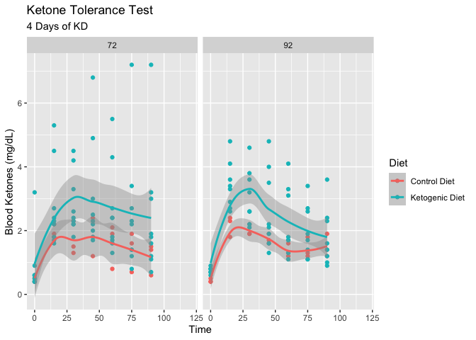
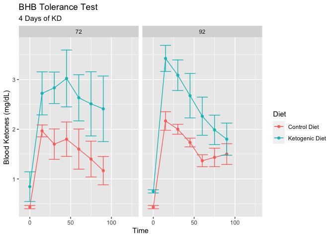

This script was most recently run on Fri Aug  4 10:18:13 2023 and can be found in /Users/davebrid/Documents/GitHub/TissueSpecificTscKnockouts/Mouse Data/AJ Ketogenic Diet.

# Purpose


# Experimental Details

Beta hydroxybutyrate was injected at 1g/kg into fed mice around 14:00 PM, ketone levels were assessed via tail vein injection using strips.

# Raw Data


```r
library(readr)

raw_data_file <- "AJ Ketone Tolerance Data.csv"
kd.mouseids <- scan('KD Mouse IDs.txt')
library(readr) 
measurement.data <- read_csv(raw_data_file)

library(lubridate)
measurement.data$parsed.experiment.date <- ymd(measurement.data$experiment.date)

genotype.problems <- c() #animals where we are unsure about the genotype/treatment

ketone.data <- 
  filter(measurement.data, assay=='Plasma Glucose') %>%
  mutate(Diet = as.factor(if_else(animal.id %in% kd.mouseids, "Ketogenic Diet", "Control Diet"))) %>% 
  separate(values, sep=',', into=paste0("t",seq(0,120, by=15))) %>%
  select(age,Genotype,t0:t120,Diet,animal.id,MouseID) %>%
  mutate(ITT = if_else(is.na(t15), "No","Yes")) %>%
  mutate(FK = as.numeric(t0)/10) %>%
  mutate_at(.vars=3:11, .funs=funs(as.numeric(.)/10))

ketone.data <- 
  ketone.data %>% 
  mutate(AUC = rowSums(across(t0:t90)),
         AOC = rowSums(across(t0:t90))-(t0*7))

ketone.data.norm <-
  ketone.data %>%
  filter(ITT=="Yes") %>%
  filter(!(MouseID %in% genotype.problems)) %>% #removed animals with incorrect genotype
  mutate(t15=t15/t0*100,
         t30=t30/t0*100,
         t45=t45/t0*100,
         t60=t60/t0*100,
         t75=t75/t0*100,
         t90=t90/t0*100,
         t105=t105/t0*100,
         t120=t120/t0*100,
         t0=t0/t0*100) 

ketone.data.norm.abs <-
  ketone.data %>%
  filter(ITT=="Yes") %>%
  filter(!(MouseID %in% genotype.problems)) %>% #removed animals with incorrect genotype
  mutate(t15=t15-t0,
         t30=t30-t0,
         t45=t45-t0,
         t60=t60-t0,
         t75=t75-t0,
         t90=t90-t0,
         t105=t105-t0,
         t120=t120-t0,
         t0=t0-t0) 

ketone.data.norm.pk <-
  ketone.data %>%
  filter(ITT=="Yes") %>%
  filter(!(MouseID %in% genotype.problems)) %>% #removed animals with incorrect genotype
  mutate(t0=t0/t15*100,
         t30=t30/t15*100,
         t45=t45/t15*100,
         t60=t60/t15*100,
         t75=t75/t15*100,
         t90=t90/t15*100,
         t105=t105/t15*100,
         t120=t120/t15*100,
         t15=t15/t15*100) 


kable(ketone.data %>% 
        filter(ITT=="Yes") %>% 
        select(MouseID, Diet, FK,age) %>%
        arrange(age,MouseID, Diet),caption="Animals who underwent an KTT")
```


Table: Animals who underwent an KTT

| MouseID|Diet           |  FK| age|
|-------:|:--------------|---:|---:|
|    8063|Control Diet   | 0.5|  72|
|    8064|Control Diet   | 0.4|  72|
|    8065|Control Diet   | 0.4|  72|
|    8066|Ketogenic Diet | 0.6|  72|
|    8067|Ketogenic Diet | 3.2|  72|
|    8068|Ketogenic Diet | 0.5|  72|
|    8069|Ketogenic Diet | 0.4|  72|
|    8070|Ketogenic Diet | 0.4|  72|
|    8071|Ketogenic Diet | 0.4|  72|
|    8072|Ketogenic Diet | 0.6|  72|
|    8073|Ketogenic Diet | 0.9|  72|
|    8074|Ketogenic Diet | 0.6|  72|
|    8063|Control Diet   | 0.4|  92|
|    8064|Control Diet   | 0.4|  92|
|    8065|Control Diet   | 0.5|  92|
|    8066|Ketogenic Diet | 0.6|  92|
|    8068|Ketogenic Diet | 0.8|  92|
|    8069|Ketogenic Diet | 0.7|  92|
|    8070|Ketogenic Diet | 0.9|  92|
|    8071|Ketogenic Diet | 0.8|  92|
|    8072|Ketogenic Diet | 0.7|  92|
|    8073|Ketogenic Diet | 0.8|  92|
|    8074|Ketogenic Diet | 0.7|  92|

```r
ketone.data %>%
  filter(ITT=="Yes") %>% 
  group_by(Diet,age) %>%
  count %>%
  kable(caption="Animals evaluated by KTT in each group")
```


Table: Animals evaluated by KTT in each group

|Diet           | age|  n|
|:--------------|---:|--:|
|Control Diet   |  72|  3|
|Control Diet   |  92|  3|
|Ketogenic Diet |  72|  9|
|Ketogenic Diet |  92|  8|


# Analysis


```r
ketone.summary <-
  ketone.data %>%
  group_by(Diet,age) %>%
  summarize(FK.mean = mean(FK, na.rm=T),
            FK.se = se(FK),
            N = length(FK))
```

## Fed Ketone Levels


```r
library(ggplot2)
ggplot(filter(ketone.data, ITT=="Yes"),
            aes(y=FK, x=Diet)) +
  geom_boxplot() +
  facet_grid(.~age) +
  labs(title="Fed Ketones",
       y="Ketones (mg/dL)",
       x="Diet")
```


```r
ggplot(ketone.summary,
       aes(y=FK.mean,
           ymin = FK.mean - FK.se,
           ymax = FK.mean + FK.se,
           x = Diet)) +
  facet_grid(.~age) +
  geom_bar(stat='identity', position='dodge', width=0.75) +
  geom_errorbar(position=position_dodge(width=0.75), width=0.5) +
  labs(y='Fed Blood Ketones (mg/dL)',
       x='')
```


### Fed ketone Statistics


```r
library(broom)

ketone.data %>% 
  filter(age=='92') %>%
  group_by(Diet) %>%
  summarize_at(.vars='t0',.funs=list(mean=~mean(.),
                             se=~se(.),
                             sd=~sd(.),
                             n=~length(.),
                             shapiro=~shapiro.test(.)$p.value)) %>%
  mutate(Pct.change=(mean-mean[Diet=='Control Diet'])/mean[Diet=='Control Diet']*100) -> fed.ketone.summary
  
kable(fed.ketone.summary, caption="Summary statistics for fed ketone levels")
```


Table: Summary statistics for fed ketone levels

|Diet           |  mean|    se|    sd|  n| shapiro| Pct.change|
|:--------------|-----:|-----:|-----:|--:|-------:|----------:|
|Control Diet   | 0.433| 0.033| 0.058|  3|   0.000|        0.0|
|Ketogenic Diet | 0.750| 0.033| 0.093|  8|   0.522|       73.1|

```r
wilcox.test(t0~Diet,data=ketone.data %>% 
  filter(age=='92')) %>% 
  tidy %>%
  kable(caption="Mann Whitney test for modifying effects of effects of diet on fed ketones at 3 weeks")
```


Table: Mann Whitney test for modifying effects of effects of diet on fed ketones at 3 weeks

| statistic| p.value|method                                            |alternative |
|---------:|-------:|:-------------------------------------------------|:-----------|
|         0|   0.017|Wilcoxon rank sum test with continuity correction |two.sided   |

```r
fk.aov <- aov(FK~Diet*age, data=ketone.data)
tidy(fk.aov) %>% kable(caption="ANOVA for modifying effects of effects of fed ketones")
```


Table: ANOVA for modifying effects of effects of fed ketones

|term      | df| sumsq| meansq| statistic| p.value|
|:---------|--:|-----:|------:|---------:|-------:|
|Diet      |  1| 0.596|  0.596|     1.739|   0.203|
|age       |  1| 0.028|  0.028|     0.081|   0.779|
|Diet:age  |  1| 0.010|  0.010|     0.029|   0.867|
|Residuals | 19| 6.516|  0.343|        NA|      NA|

## Ketone Tolerance Test


```r
time <- seq(0,120,by=15)
ktt.data.long <- 
  ketone.data %>%
  filter(ITT=="Yes") %>%
  group_by(Diet,animal.id) %>%
  gather(`t0`:`t120`,key='TimeStamp', value="ketone") %>%
  separate(TimeStamp, sep="t", into=c("Letter","Time")) %>%
  mutate(ketone = as.numeric(ketone)) %>%
  mutate(Time = as.numeric(Time))

ktt.data.long.norm <- 
  ketone.data.norm %>%
  filter(ITT=="Yes") %>%
  group_by(animal.id,Diet) %>%
  gather(`t0`:`t120`,key='TimeStamp', value="ketone") %>%
  separate(TimeStamp, sep="t", into=c("Letter","Time")) %>%
  mutate(ketone = as.numeric(ketone)) %>%
  mutate(Time = as.numeric(Time))

ktt.data.long.norm.pk <- 
  ketone.data.norm.pk %>%
  filter(ITT=="Yes") %>%
  group_by(animal.id,Diet) %>%
  gather(`t0`:`t120`,key='TimeStamp', value="ketone") %>%
  separate(TimeStamp, sep="t", into=c("Letter","Time")) %>%
  mutate(ketone = as.numeric(ketone)) %>%
  mutate(Time = as.numeric(Time))

ktt.data.long.norm.abs <- 
  ketone.data.norm.abs %>%
  filter(ITT=="Yes") %>%
  group_by(animal.id,Diet) %>%
  gather(`t0`:`t120`,key='TimeStamp', value="ketone") %>%
  separate(TimeStamp, sep="t", into=c("Letter","Time")) %>%
  mutate(ketone = as.numeric(ketone)) %>%
  mutate(Time = as.numeric(Time))

ggplot(ktt.data.long,
            aes(y=ketone, x=Time, col=Diet)) +
  geom_point() +
  facet_grid(.~age) +
  geom_smooth(method="loess") +
  labs(title="Ketone Tolerance Test",
       subtitle="4 Days of KD",
       y="Blood Ketones (mg/dL)") 
```



```r
ggplot(ktt.data.long,
            aes(y=ketone, x=Time, col=Diet)) +
  geom_point() +
  geom_smooth(method="loess") +
  labs(title="BHB Tolerance Test",
       y="Blood Ketones (mg/dL)") 
```


```r
ggplot(ktt.data.long.norm,
            aes(y=ketone, x=Time, col=Diet)) +
  geom_point() +
  facet_grid(.~age) +
  geom_smooth(method="loess") +
  labs(title="Ketone Tolerance Test",
       subtitle="4 Days of KD",
       y="Blood Ketones (% of Initial)") 
```


```r
ggplot(ktt.data.long.norm.pk,
            aes(y=ketone, x=Time, col=Diet)) +
  geom_point() +
  facet_grid(.~age) +
  geom_smooth(method="loess") +
  labs(title="Ketone Tolerance Test",
       subtitle="4 Days of KD",
       y="Blood Ketones (% of Peak)") 
```


```r
ktt.data.long %>%
  group_by(Time,Diet,age) %>%
  summarize(Average = mean(ketone),
            Error = se(ketone)) %>%
ggplot(aes(y=Average,
           ymax=Average+Error,
           ymin=Average-Error,
           x=Time, col=Diet)) +
  geom_point() +
  geom_line() +
  facet_grid(.~age) +
  geom_errorbar() +
  labs(title="BHB Tolerance Test",
       subtitle="4 Days of KD",
       y="Blood Ketones (mg/dL)") 
```

<!-- -->

```r
ktt.data.long %>%
  group_by(Time,Diet,age) %>%
  summarize(Average = mean(ketone),
            Error = se(ketone)) %>%
  filter(age=='92'&Time<100) %>%
ggplot(aes(y=Average,
           ymax=Average+Error,
           ymin=Average-Error,
           x=Time, lty=Diet)) +
  geom_point() +
  geom_line() +
  geom_errorbar() +
  labs(title="BHB Tolerance Test",
       y="Blood Ketone Bodies (mg/dL)") +
  theme_classic() +
  theme(text=element_text(size=16),
        legend.position=c(0.9,0.8))
```

<!-- -->

```r
ktt.data.long.norm.abs %>%
  group_by(Time,Diet,age) %>%
  summarize(Average = mean(ketone),
            Error = se(ketone)) %>%
  filter(age=='92'&Time<100) %>%
ggplot(aes(y=Average,
           ymax=Average+Error,
           ymin=Average-Error,
           x=Time, lty=Diet)) +
  geom_point() +
  geom_line() +
  geom_errorbar() +
  labs(title="BHB Tolerance Test - Baseline Subtracted",
       y="Blood Ketone Bodies (mg/dL)") +
  theme_classic() +
  theme(text=element_text(size=16),
        legend.position=c(0.9,0.8))
```

<!-- -->

## Area Under the Curve


```r
ketone.data %>%
  group_by(Diet,age) %>%
  summarize(mean=mean(AUC),
            se=se(AUC)) -> ktt.auc.summary

ktt.auc.summary %>%
  ggplot(aes(y=mean,
             ymin=mean-se,
             ymax=mean+se,
             x=Diet)) +
  geom_bar(stat='identity') +
  geom_errorbar(width=0.5) +
  facet_grid(~age) +
  labs(y="Area Under the Curve")
```

<!-- -->

## Normalized Area Under the Curve


```r
ketone.data %>%
  group_by(Diet,age) %>%
  summarize(mean=mean(AOC),
            se=se(AOC)) -> ktt.auc.summary

ktt.auc.summary %>%
  ggplot(aes(y=mean,
             ymin=mean-se,
             ymax=mean+se,
             x=Diet)) +
  geom_bar(stat='identity') +
  geom_errorbar(width=0.5) +
  facet_grid(~age) +
  labs(y="Area Under the Curve (Baseline Subtracted)")
```

<!-- -->

```r
ktt.auc.summary %>%
  filter(age=='92') %>%
  ggplot(aes(y=mean,
             ymin=mean-se,
             ymax=mean+se,
             x=Diet)) +
  geom_bar(stat='identity') +
  geom_errorbar(width=0.5) +
  labs(title="BHB Tolerance Test", 
       subtitle="Baseline Subtracted",
       x="",
       y="Area Under the Curve") +
  theme_classic()+
  theme(text=element_text(size=16))
```

<!-- -->


## Normalized to fasting ketone levels (percent change)


```r
ktt.data.long.norm %>%
  filter(!(animal.id %in% c('23224','23225'))) %>%
  group_by(Time,Diet,age) %>%
  summarize(Average = mean(ketone),
            Error = se(ketone)) %>%
ggplot(aes(y=Average,
           ymax=Average+Error,
           ymin=Average-Error,
           x=Time, col=Diet)) +
  geom_point() +
  geom_line() +
  facet_grid(.~age) +
  geom_errorbar() +
  labs(title="Ketone Tolerance Test",
       subtitle="4 Days of KD",
       y="Blood Ketones (% of initial)") 
```

<!-- -->

```r
ktt.data.long.norm %>%
  filter(!(animal.id %in% c('23224','23225'))) %>%
  filter(age == '92') %>%
  group_by(Time,Diet,age) %>%
  summarize(Average = mean(ketone),
            Error = se(ketone)) %>%
ggplot(aes(y=Average,
           ymax=Average+Error,
           ymin=Average-Error,
           x=Time, col=Diet)) +
  geom_point() +
  geom_line() +
  geom_errorbar() +
  scale_color_manual(values=color.scheme, labels=c('Control Diet','LCHF Diet'), name="") +
  labs(title="Ketone Tolerance Test",
       subtitle="3 Weeks of LCHF",
       y="Blood Ketones (% of Basal)") +
  xlim(0,95) +
  theme_classic() +
  theme(text = element_text(size=18),
        legend.position = c(0.75,0.75))
```

<!-- -->


## Normalized to fasting ketone levels (absolute change)


```r
ktt.data.long.norm.abs %>%
  filter(!(animal.id %in% c('23224','23225'))) %>%
  group_by(Time,Diet,age) %>%
  summarize(Average = mean(ketone),
            Error = se(ketone)) %>%
ggplot(aes(y=Average,
           ymax=Average+Error,
           ymin=Average-Error,
           x=Time, col=Diet)) +
  geom_point() +
  geom_line() +
  facet_grid(.~age) +
  geom_errorbar() +
  labs(title="Ketone Tolerance Test",
       subtitle="4 Days of KD",
       y="Blood Ketones (% of initial)") 
```

<!-- -->

```r
ktt.data.long.norm.abs %>%
  filter(!(animal.id %in% c('23224','23225'))) %>%
  filter(age == '92') %>%
  group_by(Time,Diet,age) %>%
  summarize(Average = mean(ketone),
            Error = se(ketone)) %>%
ggplot(aes(y=Average,
           ymax=Average+Error,
           ymin=Average-Error,
           x=Time, col=Diet)) +
  geom_point() +
  geom_line() +
  geom_errorbar() +
  scale_color_manual(values=color.scheme, labels=c('Control Diet','LCHF Diet'), name="") +
  labs(title="Ketone Tolerance Test",
       subtitle="3 Weeks of LCHF",
       y="Blood Ketones (Above Basal)") +
  xlim(0,95) +
  theme_classic() +
  theme(text = element_text(size=18),
        legend.position = c(0.75,0.75))
```

<!-- -->


## Normlized to the Peak of Ketone levels


```r
ktt.data.long.norm.pk %>%
  group_by(Time,Diet,age) %>%
  summarize(Average = mean(ketone),
            Error = se(ketone)) %>%
ggplot(aes(y=Average,
           ymax=Average+Error,
           ymin=Average-Error,
           x=Time, col=Diet)) +
  geom_point() +
  geom_line() +
  facet_grid(.~age) +
  geom_errorbar() +
  labs(title="Ketone Tolerance Test",
       subtitle="4 Days and 3 Weeks of KD",
       y="Blood Ketones (% of Peak)") 
```

<!-- -->

## KTT Statistics


### Linear Models


```r
library(lme4)
library(lmerTest)
ktt.lme <- lmer(ketone ~ as.factor(Time) + as.factor(age) + Diet + age:Diet + (1|animal.id),
                data=ktt.data.long)

ktt.lme.92d <- lmer(ketone ~ as.factor(Time) * Diet + (1|animal.id),
                data=ktt.data.long.norm %>% filter (age==92))

ktt.lme.92d.fil <- lmer(ketone ~ as.factor(Time) * Diet + (1|animal.id),
                data=ktt.data.long.norm %>% filter (age==92) %>%
                  filter(!(animal.id %in% c('23224','23225'))))

ktt.lme.92d.fil.null <- lmer(ketone ~ as.factor(Time) + (1|animal.id),
                data=ktt.data.long.norm %>% filter (age==92) %>%
                  filter(!(animal.id %in% c('23224','23225'))))
                
                

anova(ktt.lme) %>% tidy %>% kable(caption="Mixed linear model for KTT")
```


Table: Mixed linear model for KTT

|term            |  sumsq| meansq| NumDF| DenDF| statistic| p.value|
|:---------------|------:|------:|-----:|-----:|---------:|-------:|
|as.factor(Time) | 69.398| 11.566|     6|   141|    30.300|   0.000|
|as.factor(age)  |  1.744|  1.744|     1|   141|     4.568|   0.034|
|Diet            |  0.038|  0.038|     1|    46|     0.098|   0.755|
|Diet:age        |  0.217|  0.217|     1|   141|     0.567|   0.453|

```r
anova(ktt.lme.92d) %>% tidy %>% kable(caption="Mixed linear model for KTT at 3 weeks")
```


Table: Mixed linear model for KTT at 3 weeks

|term                 |  sumsq| meansq| NumDF| DenDF| statistic| p.value|
|:--------------------|------:|------:|-----:|-----:|---------:|-------:|
|as.factor(Time)      | 808831| 134805|     6|    54|    36.164|   0.000|
|Diet                 |   2525|   2525|     1|     9|     0.677|   0.432|
|as.factor(Time):Diet |  15014|   2502|     6|    54|     0.671|   0.673|

```r
anova(ktt.lme.92d.fil,ktt.lme.92d.fil.null) %>% tidy %>% kable(caption="Mixed linear model for KTT at 3 weeks")
```


Table: Mixed linear model for KTT at 3 weeks

|term                 | npar| AIC| BIC| logLik| deviance| statistic| df| p.value|
|:--------------------|----:|---:|---:|------:|--------:|---------:|--:|-------:|
|ktt.lme.92d.fil.null |    9| 689| 708|   -335|      671|        NA| NA|      NA|
|ktt.lme.92d.fil      |   16| 674| 708|   -321|      642|      28.6|  7|       0|

```r
fixef(ktt.lme.92d) %>% tidy %>% kable(caption="Mixed linear model for KTT at 3 weeks")
```


Table: Mixed linear model for KTT at 3 weeks

|names                                |      x|
|:------------------------------------|------:|
|(Intercept)                          |  100.0|
|as.factor(Time)15                    |  403.3|
|as.factor(Time)30                    |  363.3|
|as.factor(Time)45                    |  301.7|
|as.factor(Time)60                    |  215.0|
|as.factor(Time)75                    |  228.3|
|as.factor(Time)90                    |  243.3|
|DietKetogenic Diet                   |    0.0|
|as.factor(Time)15:DietKetogenic Diet |  -45.6|
|as.factor(Time)30:DietKetogenic Diet |  -50.7|
|as.factor(Time)45:DietKetogenic Diet |  -47.2|
|as.factor(Time)60:DietKetogenic Diet |  -15.5|
|as.factor(Time)75:DietKetogenic Diet |  -64.3|
|as.factor(Time)90:DietKetogenic Diet | -105.0|

# Interpretation

# References

