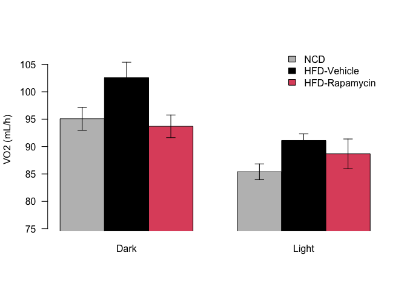
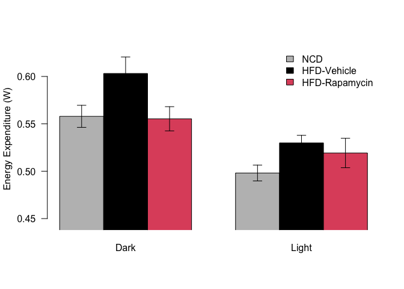

```r
#drug/diet treatment started at interval 125
drug_start <- 0
diet_start <- 88
library(tidyr)
library(readxl)
mri_data_file <- '2015-10-07-C57BL6J-Rapa-HFD-PreCLAMSEchoMRI.XLSX'
mri_data <- read_excel(mri_data_file, sheet="ExtractedScans")
mri_data$Treatment <- relevel(as.factor(mri_data$Treatment), ref='Vehicle')
mri_data$Lean <- as.numeric(as.character(mri_data$Lean))
mri_data$Fat <- as.numeric(as.character(mri_data$Fat))
mri_data$Weight <- as.numeric(as.character(mri_data$Weight))
mri_data$Label <- as.factor(mri_data$Label)

clams_data_file_1 <- '2015-10-07-C57BL6J-Rapa-HFD-OxymaxDataFile1.csv'
clams_data_file_2 <- '2015-10-07-C57BL6J-Rapa-HFD-OxymaxDataFile2.csv'
clams_data_file_3 <- '2015-10-07-C57BL6J-Rapa-HFD-OxymaxDataFile3.csv'

data.1 <- read.csv(clams_data_file_1)
end.interval <- max(data.1$Interval)
data.2 <- read.csv(clams_data_file_2)
data.2$Interval <- data.2$Interval + end.interval
end.interval.2 <- max(data.2$Interval)
data.3 <- read.csv(clams_data_file_3)
data.3$Interval <- data.3$Interval + end.interval.2

all.data <- rbind(data.1, data.2,data.3)

all.data$Subject <- as.factor(all.data$Subject)
remove.intervals <- 20
remove.mice <- c(4572)
all.data.clean <- subset(all.data, Interval>remove.intervals)
all.data.clean <- subset(all.data.clean, Event.Log=='')

#remve runted mice
all.data.clean <- subset(all.data.clean, !(Subject %in% remove.mice))

#remove bad data, this was an injection that ran through two intervals
bad.intervals <- c()
all.data.clean <- subset(all.data.clean, !(Interval %in% bad.intervals))

library(dplyr)
merged_data <- 
  all.data.clean %>%
  inner_join(mri_data, by=c('Subject'='Label')) %>%
  rename(Heat.kcal = Heat) %>%
  mutate(Total.Weight = Lean + Fat,
         VO2 = Volume.O2 * Total.Weight/1000,
         Heat = Heat.kcal*1.163, #heat is in kCal/h originally, converted to Watts
         Percent.Fat.Mass = Fat/Total.Weight*100,
         Total.Activity = X.Ambulatory+Y.Ambulatory)

merged_data$Subject <- as.factor(merged_data$Subject)
#merged_data$Time <- sapply(strsplit(as.character(merged_data$Date.Time), " "), "[[", 2)
library(lubridate)
#merged_data$Time <- hms(merged_data$Time)
#merged_data$Time.Interval <- merged_data$Time$hour
merged_data$Date.Time <- mdy_hms(as.character(merged_data$Date.Time))
merged_data$Time <- hour(merged_data$Date.Time)
#calculate time for one interval
interval_time <- as.numeric( difftime(merged_data$Date.Time[2], merged_data$Date.Time[1], units="hours"))

merged_data$Exp.Time <- (merged_data$Interval - drug_start)*interval_time
merged_data <- droplevels(merged_data)
```

After having been acclimitized in the CLAMS at the normal temperature (25C) for 2 days then treatment and diet started simulataneously. 


The input files were 2015-10-07-C57BL6J-Rapa-HFD-PreCLAMSEchoMRI.XLSX for the echoMRI data and 2015-10-07-C57BL6J-Rapa-HFD-OxymaxDataFile1.csv  and 2015-10-07-C57BL6J-Rapa-HFD-OxymaxDataFile2.csv for the CLAMS data.  These data can be found in /Users/davebrid/Documents/GitHub/TissueSpecificTscKnockouts/Mouse Data/CLAMS B6-HFD-Rapamycin.  This script was most recently updated on Sun Feb 27 13:22:49 2022 and includes the following number of animals:


```r
mri_table <- 
  mri_data %>%
  distinct(Label, .keep_all = T) %>%
  dplyr::select(Label,Treatment) %>%
  group_by(Treatment) %>%
  summarise(Males = length(Treatment))

summary_table <- 
  merged_data %>%
  dplyr::select(Subject,Treatment) %>%
  distinct(Subject, .keep_all = T) %>%
  group_by(Treatment) %>%
  summarise(Males = length(Treatment))
kable(summary_table)
```


|Treatment | Males|
|:---------|-----:|
|Vehicle   |     5|
|Rapamycin |     6|

This study was done coincident with diet/drug treatment, using male mice only.  The first day was on NCD then animals were switched to HFD and randomized into drug/vehicle.

# Effects of the Drug at 25C


```r
se <- function(x) sd(x)/sqrt(length(x))

animal.time.course <-
  merged_data %>%
  group_by(Treatment,Interval, Time, Light.Dark) %>%
  summarize(VO2 = mean(VO2),
            RER = mean(RER),
            HEAT = mean(Heat),
            HEAT.SE = se(Heat),
            Total.Activity = mean(Total.Activity),
            Lean.Mass = mean(Lean),
            Fat.Mass = mean(Fat),
            Percent.Fat.Mass = mean(Percent.Fat.Mass),
            Body.Weight = mean(Total.Weight)) %>%
  mutate(Time.Elapsed = Interval*interval_time)

merged_data$HFD <- merged_data$Interval > diet_start
animal.summary <-
  merged_data %>%
  group_by(Subject,HFD, Treatment,Light.Dark) %>%
  summarize(VO2 = mean(VO2),
            RER = mean(RER),
            Heat = mean(Heat),
            Total.Activity = mean(Total.Activity),
            Lean.Mass = mean(Lean),
            Fat.Mass = mean(Fat),
            Percent.Fat.Mass = mean(Percent.Fat.Mass),
            Body.Weight = mean(Total.Weight))
write.csv(animal.summary, "Animal Summary Data.csv")

grouped.summary <-
  animal.summary %>%
  group_by(HFD, Treatment,Light.Dark) %>%
  summarize(VO2 = mean(VO2),
            RER = mean(RER),
            Heat = mean(Heat),
            Total.Activity = mean(Total.Activity),
            Lean.Mass = mean(Lean.Mass),
            Fat.Mass = mean(Fat.Mass),
            Percent.Fat.Mass = mean(Percent.Fat.Mass),
            Body.Weight = mean(Body.Weight)) %>%
  rename(Light.Dark=Light.Dark)

grouped.summary.se <-
  animal.summary %>%
  group_by(HFD, Treatment,Light.Dark) %>%
  summarize(VO2 = se(VO2),
            RER = se(RER),
            Heat = se(Heat),
            Total.Activity = se(Total.Activity),
            Lean.Mass = se(Lean.Mass),
            Fat.Mass = se(Fat.Mass),
            Percent.Fat.Mass = se(Percent.Fat.Mass),
            Body.Weight = se(Body.Weight)) %>%
  rename(Light.Dark=Light.Dark)
```

## Resting Metabolic Rate

The proxy for energy consumption is the volume of oxygen consumed.  This is best presented in proportion to the amount of lean body mass, since fat mass does not appreciably consume oxygen.  Resting metabolic rate should be high in the evening (when mice are active) and low during the day.  The interpretation of changes in VO2 also requires looking at the levels of physical activity, since more physically active animals will consume more oxygen.

The VO2 levels were first merged to average over light and dark cycles, removing the first 20 measurements.  


```r
library(lme4)
vo2.lme <- lmer(VO2 ~ Light.Dark + 
                  Lean + 
                  Exp.Time + 
                  Treatment + 
                  HFD +
                  Treatment:HFD + 
                  (1|Subject), data=subset(merged_data, Exp.Time>=0), REML=F)

vo2.lme.null <- lmer(VO2 ~ Light.Dark + 
                       Lean + 
                       Exp.Time + 
                       HFD + 
                       (1|Subject), data=subset(merged_data, Exp.Time>=0), REML=F)
```

We first checked whether normality was maintained in the residuals from the ANCOVA.  These results are summarized below:


```r
with(subset(animal.time.course, Treatment==levels(merged_data$Treatment)[1]), plot(Time.Elapsed,VO2, type="l", ylab="VO2 (mL/h)", xlab="Time (hours)", las=1, ylim=c(min(animal.time.course$VO2), max(animal.time.course$VO2))))
with(subset(animal.time.course, Treatment==levels(merged_data$Treatment)[2]), lines(Time.Elapsed,VO2, col=palette()[2]))
legend("topleft", levels(animal.time.course$Treatment), bty="n", lty=1, col=palette()[1:2])
```


```r
library(ggplot2)
animal.time.course %>%
  mutate(Time.HFD = Time.Elapsed-diet_start) %>%
  filter(Time.HFD>-48,Time.HFD<72) %>%
  ggplot(aes(y=HEAT,x=Time.HFD, col=Treatment)) +
  #geom_point() +
  geom_line() +
  # geom_errorbar(aes(ymin=HEAT-HEAT.SE,
  #                   ymax=HEAT+HEAT.SE)) +
  labs(y="Energy Expenditure (W)",
       x="Time From HFD (h)") +
  theme_classic() +
  scale_color_manual(name="",values=c("black","red")) +
  theme(text=element_text(size=18),
        legend.position=c(0.8,0.18))
```


This data was averaged for the VO2 before the HFD switch and after the HFD switch


```r
superpose.eb <- function (x, y, ebl, ebu = ebl, length = 0.08, ...)
  arrows(x, y + ebu, x, y - ebl, angle = 90, code = 3,
  length = length, ...)

ylimits <- c(min(grouped.summary$VO2) - max(grouped.summary.se$VO2), max(grouped.summary$VO2) + max(grouped.summary.se$VO2))

plot.data <- grouped.summary %>% filter(HFD==T) %>% dplyr::select(Treatment, Light.Dark, VO2) %>% spread(Light.Dark,VO2)
plot.data.se <- grouped.summary.se %>% filter(HFD==T) %>% dplyr::select(Treatment, Light.Dark, VO2) %>% spread(Light.Dark,VO2)

ncd.data <- 
  animal.summary %>%
  group_by(Light.Dark) %>%
  summarize(VO2.mean = mean(VO2),
            VO2.se = se(VO2))

tmp <- list(HFD=FALSE,Treatment="None", Dark=ncd.data$VO2.mean[1], Light=ncd.data$VO2.mean[2])
plotted.data <- data.frame(rbind(tmp, plot.data)[,3:4])
plotted.data$Dark <- as.numeric(plotted.data$Dark)
plotted.data$Light <- as.numeric(plotted.data$Light)

tmp <- list(HFD=FALSE,Treatment="None", Dark=ncd.data$VO2.se[1], Light=ncd.data$VO2.se[2])
plotted.data.se <- data.frame(rbind(tmp, plot.data.se)[,3:4])
plotted.data.se$Dark <- as.numeric(plotted.data.se$Dark)
plotted.data.se$Light <- as.numeric(plotted.data.se$Light)

plot <- barplot(as.matrix(plotted.data), 
                beside=T, ylim=ylimits, 
                ylab="VO2 (mL/h)",
                col=c("grey", palette()[1:2]), xpd=F, las=1)
superpose.eb(plot,
             as.matrix(plotted.data),
             as.matrix(plotted.data.se))
legend("topright", c("NCD", "HFD-Vehicle", "HFD-Rapamycin"), bty="n", fill=c("grey",palette()[1:2]))
```




## VO2 Statistics

For the vehicle treated animals we noted a 7.887% increase in the volume of oxygen consumed during the dark phase, and a 6.702% increase in the light phase.

Alternatively we used a mixed linear model, with non-interacting covariates for the Light cycle, the lean mass and the treatment  A Chi-squared test comparing a model with or without the Treatment term yielded a p-value of 1.24e-05 for the mice.  This analysis excluded the chow fed animals, and only compares HFD vehicle to HFD drug.

The model coefficients are:


```r
library(arm)
library(car)
kable(data.frame(Coefficent=fixef(vo2.lme), SE = se.fixef(vo2.lme)), caption="Model Coefficients for VO2 Mixed Linear Model")
```


Table: Model Coefficients for VO2 Mixed Linear Model

|                           | Coefficent|    SE|
|:--------------------------|----------:|-----:|
|(Intercept)                |    135.408| 8.672|
|Light.DarkLight            |     -8.756| 0.571|
|Lean                       |     -1.839| 0.342|
|Exp.Time                   |      0.095| 0.007|
|TreatmentRapamycin         |     -4.506| 1.786|
|HFDTRUE                    |     -0.092| 1.259|
|TreatmentRapamycin:HFDTRUE |     -3.959| 1.440|

```r
coefs <- data.frame(coef(summary(vo2.lme)))
coefs$p.z <- 2 * (1 - pnorm(abs(coefs$t.value)))
kable(coefs, caption="Estimates and p-values from mixed linear models.")
```


Table: Estimates and p-values from mixed linear models.

|                           | Estimate| Std..Error| t.value|   p.z|
|:--------------------------|--------:|----------:|-------:|-----:|
|(Intercept)                |  135.408|      8.672|  15.615| 0.000|
|Light.DarkLight            |   -8.756|      0.571| -15.335| 0.000|
|Lean                       |   -1.839|      0.342|  -5.380| 0.000|
|Exp.Time                   |    0.095|      0.007|  13.934| 0.000|
|TreatmentRapamycin         |   -4.506|      1.786|  -2.522| 0.012|
|HFDTRUE                    |   -0.092|      1.259|  -0.073| 0.942|
|TreatmentRapamycin:HFDTRUE |   -3.959|      1.440|  -2.750| 0.006|

## Heat


```r
ylimits <- c(min(grouped.summary$Heat) - max(grouped.summary.se$Heat), max(grouped.summary$Heat) + max(grouped.summary.se$Heat))

plot.data <- grouped.summary %>% filter(HFD==T) %>% dplyr::select(Treatment, Light.Dark, Heat) %>% spread(Light.Dark,Heat)
plot.data.se <- grouped.summary.se %>% filter(HFD==T) %>% dplyr::select(Treatment, Light.Dark, Heat) %>% spread(Light.Dark,Heat)

ncd.data <- 
  animal.summary %>%
  group_by(Light.Dark) %>%
  summarize(Heat.mean = mean(Heat),
            Heat.se = se(Heat))

tmp <- list(HFD=FALSE,Treatment="None", Dark=ncd.data$Heat.mean[1], Light=ncd.data$Heat.mean[2])
plotted.data <- data.frame(rbind(tmp, plot.data)[,3:4])
plotted.data$Dark <- as.numeric(plotted.data$Dark)
plotted.data$Light <- as.numeric(plotted.data$Light)

tmp <- list(HFD=FALSE,Treatment="None", Dark=ncd.data$Heat.se[1], Light=ncd.data$Heat.se[2])
plotted.data.se <- data.frame(rbind(tmp, plot.data.se)[,3:4])
plotted.data.se$Dark <- as.numeric(plotted.data.se$Dark)
plotted.data.se$Light <- as.numeric(plotted.data.se$Light)

plot <- barplot(as.matrix(plotted.data), 
                beside=T, ylim=ylimits, 
                ylab="Energy Expenditure (W)",
                col=c("grey", palette()[1:2]), xpd=F, las=1)
superpose.eb(plot,
             as.matrix(plotted.data),
             as.matrix(plotted.data.se))
legend("topright", c("NCD", "HFD-Vehicle", "HFD-Rapamycin"), bty="n", fill=c("grey",palette()[1:2]))
```



```r
means <- plotted.data %>% 
  mutate(Treatment=c("NCD","HFD-Vehicle","HFD-Rapamycin")) %>%
  pivot_longer(-Treatment, names_to="Cycle",values_to="Mean")

se <- plotted.data.se %>% 
  mutate(Treatment=c("NCD","HFD-Vehicle","HFD-Rapamycin")) %>%
  pivot_longer(-Treatment, names_to="Cycle",values_to="SE")

full_join(means,se,by=c("Cycle","Treatment")) %>%
  ggplot(aes(y=Mean,ymin=Mean-SE,ymax=Mean+SE,fill=Treatment,x=Cycle)) +
  geom_bar(stat='identity',position='dodge',width=0.75) +
  geom_errorbar(position=position_dodge(width=0.75), width=0.5) +
  coord_cartesian(ylim=c(0.47,0.62)) +
  labs(y="Energy Expenditure (W)",
       x="") +
  scale_fill_manual(values=c('grey','black','red')) +
    theme_classic() +
  theme(text=element_text(size=18),
        legend.position = c(0.8,0.8))
```


```r
heat.lme <- lmer(Heat ~ Light.Dark + 
                  Lean + 
                  Exp.Time + 
                  Treatment + 
                  HFD +
                  Treatment:HFD + 
                  (1|Subject), data=subset(merged_data, Exp.Time>=0), REML=F)

heat.lme.null <- lmer(Heat ~ Light.Dark + 
                       Lean + 
                       Exp.Time + 
                       HFD + 
                       (1|Subject), data=subset(merged_data, Exp.Time>=0), REML=F)
```

## Heat Statistics

For the vehicle treated animals we noted a 8.106% increase in the heat produced during the dark phase, and a 6.389% increase in the light phase.

Alternatively we used a mixed linear model, with non-interacting covariates for the Light cycle, the lean mass and the treatment  A Chi-squared test comparing a model with or without the Treatment term yielded a p-value of 2.05e-04 for the mice.  This analysis excluded the chow fed animals, and only compares HFD vehicle to HFD drug.

The model coefficients are:


```r
library(arm)
library(car)
kable(data.frame(Coefficent=fixef(heat.lme), SE = se.fixef(heat.lme)), caption="Model Coefficients for VO2 Mixed Linear Model")
```


Table: Model Coefficients for VO2 Mixed Linear Model

|                           | Coefficent|    SE|
|:--------------------------|----------:|-----:|
|(Intercept)                |      0.781| 0.059|
|Light.DarkLight            |     -0.056| 0.003|
|Lean                       |     -0.010| 0.002|
|Exp.Time                   |      0.001| 0.000|
|TreatmentRapamycin         |     -0.025| 0.012|
|HFDTRUE                    |      0.007| 0.007|
|TreatmentRapamycin:HFDTRUE |     -0.020| 0.008|

```r
coefs <- data.frame(coef(summary(heat.lme)))
coefs$p.z <- 2 * (1 - pnorm(abs(coefs$t.value)))
kable(coefs, caption="Estimates and p-values from mixed linear models for heat production.")
```


Table: Estimates and p-values from mixed linear models for heat production.

|                           | Estimate| Std..Error| t.value|   p.z|
|:--------------------------|--------:|----------:|-------:|-----:|
|(Intercept)                |    0.781|      0.059|  13.167| 0.000|
|Light.DarkLight            |   -0.056|      0.003| -16.849| 0.000|
|Lean                       |   -0.010|      0.002|  -4.373| 0.000|
|Exp.Time                   |    0.001|      0.000|  12.649| 0.000|
|TreatmentRapamycin         |   -0.025|      0.012|  -2.145| 0.032|
|HFDTRUE                    |    0.007|      0.007|   0.895| 0.371|
|TreatmentRapamycin:HFDTRUE |   -0.020|      0.008|  -2.404| 0.016|

## Respiratory Exchange Rate

The respiratory exchange ratio is an indicator of substrate preference.  A high RER indicates preferential utilization of carbohydrates for energy, while a low RER indicates preferential use of lipids.  The normal range of these values are 0.7 (nearly exclusivley lipid) to 1.0 (nearly exclusively carbohydrate).  Lipid utilization (low RER) is increased during sleep (day cycle for mice).


```r
with(subset(animal.time.course, Treatment==levels(merged_data$Treatment)[1]), plot(Time.Elapsed,RER, type="l", xlab="Time (h)", las=1, ylim=c(0.7,1)))
with(subset(animal.time.course, Treatment==levels(merged_data$Treatment)[2]), lines(Time.Elapsed,RER, col=palette()[2]))
with(subset(animal.time.course, Treatment==levels(merged_data$Treatment)[3]), lines(Time.Elapsed,RER, col=palette()[3]))
legend("topright", levels(merged_data$Treatment), bty="n", lty=1, col=palette()[1:2])
```


```r
animal.time.course %>%
  mutate(Time.HFD = Time.Elapsed-diet_start) %>%
  filter(Time.HFD>-24,Time.HFD<48) %>%
  ggplot(aes(y=RER,x=Time.HFD, col=Treatment)) +
  geom_point() +
  geom_line() +
  # geom_errorbar(aes(ymin=HEAT-HEAT.SE,
  #                   ymax=HEAT+HEAT.SE)) +
  labs(y="Respiratory Exchange Ratio",
       x="Time From HFD")
```


```r
rer.lme <- lmer(RER~Light.Dark  + Exp.Time + Treatment + Treatment:Exp.Time + (1|Subject), data=subset(merged_data, Exp.Time>=0), REML=F)
rer.lme.null <- lmer(RER~Light.Dark + Exp.Time + Treatment + (1|Subject), data=subset(merged_data, Exp.Time>=0), REML=F)

par(mfrow=c(1,3))
infl <- influence(rer.lme, group='Subject')
barplot(cooks.distance(infl), main="Cook's Distance", 
        beside=T, col='grey',las=2, names.arg=rownames(cooks.distance(infl)))
plot(density(residuals(rer.lme)), main="Residuals")
plot(fitted(rer.lme), residuals(rer.lme), xlab="Predicted RER", ylab="Residuals", main="Residuals vs Predicted")
```


We used a mixed linear model, with non-interacting covariates for the Light cycle and the treatment.  A Chi-squared test comparing a model with or without the treatment term yielded a p-value of 1.41e-02 for the mice.  This only is comparing the differnce between HFD and HFD + Drug mice.


```r
kable(data.frame(Coefficent=fixef(rer.lme), SE = se.fixef(rer.lme)), caption="Model Coefficients for RER Mixed Linear Model", digits=6)
```


Table: Model Coefficients for RER Mixed Linear Model

|                            | Coefficent|       SE|
|:---------------------------|----------:|--------:|
|(Intercept)                 |   0.907155| 0.010300|
|Light.DarkLight             |  -0.042227| 0.001862|
|Exp.Time                    |  -0.000140| 0.000024|
|TreatmentRapamycin          |  -0.010411| 0.013888|
|Exp.Time:TreatmentRapamycin |   0.000081| 0.000033|


## Activity Data

Physical activity is determined via the number of beam brakes in the X or Y direction (not vertically).  These numbers are high when the mice are awake (dark cycle) and low during the light cycle.  The beam breaks are converted into ambulatory counts based on consecutive breaks of beams, indicating movement.  These counts data are not normally distributed and as such are typically analysed with generalized linear models.


```r
activity.lme <- glmer(Total.Activity~Light.Dark + Lean + Exp.Time + Treatment + Treatment:Exp.Time + (1|Subject), data=subset(merged_data, Exp.Time>=0), family='poisson')
activity.lme.null <- glmer(Total.Activity~Light.Dark + Lean + Exp.Time + Treatment + Treatment:Exp.Time + (1|Subject), data=subset(merged_data, Exp.Time>=0), family='poisson')

par(mfrow=c(1,3))
infl <- influence(activity.lme, group='Subject')
barplot(cooks.distance(infl), main="Cook's Distance", 
        beside=T, col='grey',las=2, names.arg=rownames(cooks.distance(infl)))
plot(density(residuals(activity.lme)), main="Residuals")
plot(fitted(activity.lme), residuals(activity.lme), xlab="Predicted Activity", ylab="Residuals", main="Residuals vs Predicted")
```


We used a generalized mixed linear model, with non-interacting covariates for the Light cycle and the treatment  A Chi-squared test comparing a model with or without the Genotype term yielded a p-value of NA for the mice.  This analysis used a generalized mixed linear model (Poission) and only compares HFD to HFD + Drug.


```r
with(subset(animal.time.course, Treatment==levels(merged_data$Treatment)[1]), plot(Time.Elapsed,Total.Activity, type="l", 
                                                                                   ylab="Ambulatory Activity (Beam Breaks)", xlab="Time (h)", las=1))
with(subset(animal.time.course, Treatment==levels(merged_data$Treatment)[2]), lines(Time.Elapsed,Total.Activity, col=palette()[2]))

legend("topright", levels(merged_data$Treatment), bty="n", lty=1, col=palette()[1:2])
```


```r
se <- function(x) sd(x)/sqrt(length(x))
ylimits <- c(min(grouped.summary$Total.Activity) - max(grouped.summary.se$Total.Activity), max(grouped.summary$Total.Activity) + max(grouped.summary.se$Total.Activity))

select <- dplyr::select
plot.data <- grouped.summary %>% filter(HFD==T) %>% dplyr::select(Treatment, Light.Dark, Total.Activity) %>% spread(Light.Dark,Total.Activity)
plot.data.se <- grouped.summary.se %>% filter(HFD==T) %>% dplyr::select(Treatment, Light.Dark, Total.Activity) %>% spread(Light.Dark,Total.Activity)
ncd.data <- 
  animal.summary %>%
  group_by(Light.Dark) %>%
  summarize(Total.Activity.mean = mean(Total.Activity),
            Total.Activity.se = se(Total.Activity))

tmp <- list(HFD=FALSE,Treatment="None", Dark=ncd.data$Total.Activity.mean[1], Light=ncd.data$Total.Activity.mean[2])
plotted.data <- data.frame(rbind(tmp, plot.data)[,3:4])
plotted.data$Dark <- as.numeric(plotted.data$Dark)
plotted.data$Light <- as.numeric(plotted.data$Light)

tmp <- list(HFD=FALSE,Treatment="None", Dark=ncd.data$Total.Activity.se[1], Light=ncd.data$Total.Activity.se[2])
plotted.data.se <- data.frame(rbind(tmp, plot.data.se)[,3:4])
plotted.data.se$Dark <- as.numeric(plotted.data.se$Dark)
plotted.data.se$Light <- as.numeric(plotted.data.se$Light)

plot <- barplot(as.matrix(plotted.data), 
                beside=T, ylim=ylimits, 
                ylab="Ambulatory Activity (beam breaks)",
                col=c("grey", palette()[1:2]), las=1)
superpose.eb(plot,
             as.matrix(plotted.data),
             as.matrix(plotted.data.se))
legend("topright", c("NCD", "HFD-Vehicle", "HFD-Rapamycin"), bty="n", fill=c("grey",palette()[1:2]))
```


```r
means <- plotted.data %>% 
  mutate(Treatment=c("NCD","HFD-Vehicle","HFD-Rapamycin")) %>%
  pivot_longer(-Treatment, names_to="Cycle",values_to="Mean")

se <- plotted.data.se %>% 
  mutate(Treatment=c("NCD","HFD-Vehicle","HFD-Rapamycin")) %>%
  pivot_longer(-Treatment, names_to="Cycle",values_to="SE")

full_join(means,se,by=c("Cycle","Treatment")) %>%
  ggplot(aes(y=Mean,ymin=Mean-SE,ymax=Mean+SE,fill=Treatment,x=Cycle)) +
  geom_bar(stat='identity',position='dodge',width=0.75) +
  geom_errorbar(position=position_dodge(width=0.75), width=0.5) +
  #coord_cartesian(ylim=c(0.47,0.62)) +
  labs(y="Ambulatory Activity",
       x="") +
  scale_fill_manual(values=c('grey','black','red')) +
    theme_classic() +
  theme(text=element_text(size=18),
        legend.position = c(0.8,0.8))
```


# Substrate Use

Equations from Frayn (1983) J Appl Physiol Respir Environ Exerc Physiol. and assume negligible protein oxidation

Fat oxidation: (1.695 g/L * VO2 L/min) - (1.701 g/L * VCO2 L/min) = FA ox in g/min

CHO oxidation is (4.585 * VCO2) - (3.226 * VO2)


# Session Information


```
## R version 4.0.2 (2020-06-22)
## Platform: x86_64-apple-darwin17.0 (64-bit)
## Running under: macOS  10.16
## 
## Matrix products: default
## BLAS:   /Library/Frameworks/R.framework/Versions/4.0/Resources/lib/libRblas.dylib
## LAPACK: /Library/Frameworks/R.framework/Versions/4.0/Resources/lib/libRlapack.dylib
## 
## locale:
## [1] en_US.UTF-8/en_US.UTF-8/en_US.UTF-8/C/en_US.UTF-8/en_US.UTF-8
## 
## attached base packages:
## [1] stats     graphics  grDevices utils     datasets  methods   base     
## 
## other attached packages:
##  [1] car_3.0-12      carData_3.0-5   arm_1.12-2      MASS_7.3-54    
##  [5] ggplot2_3.3.5   lme4_1.1-27.1   Matrix_1.4-0    lubridate_1.8.0
##  [9] dplyr_1.0.7     readxl_1.3.1    tidyr_1.1.4     knitr_1.37     
## 
## loaded via a namespace (and not attached):
##  [1] tidyselect_1.1.1 xfun_0.29        bslib_0.3.1      purrr_0.3.4     
##  [5] splines_4.0.2    lattice_0.20-45  colorspace_2.0-2 vctrs_0.3.8     
##  [9] generics_0.1.1   htmltools_0.5.2  yaml_2.2.1       utf8_1.2.2      
## [13] rlang_0.4.12     jquerylib_0.1.4  pillar_1.6.4     nloptr_1.2.2.3  
## [17] glue_1.6.0       withr_2.4.3      DBI_1.1.2        lifecycle_1.0.1 
## [21] stringr_1.4.0    munsell_0.5.0    gtable_0.3.0     cellranger_1.1.0
## [25] coda_0.19-4      evaluate_0.14    labeling_0.4.2   fastmap_1.1.0   
## [29] fansi_1.0.0      highr_0.9        Rcpp_1.0.7       scales_1.1.1    
## [33] jsonlite_1.7.2   abind_1.4-5      farver_2.1.0     digest_0.6.29   
## [37] stringi_1.7.6    grid_4.0.2       tools_4.0.2      magrittr_2.0.1  
## [41] sass_0.4.0       tibble_3.1.6     crayon_1.4.2     pkgconfig_2.0.3 
## [45] ellipsis_0.3.2   assertthat_0.2.1 minqa_1.2.4      rmarkdown_2.11  
## [49] R6_2.5.1         boot_1.3-28      nlme_3.1-153     compiler_4.0.2
```
