This script can be found in /Users/davebrid/Documents/GitHub/TissueSpecificTscKnockouts/Mouse Data/Ketogenic Diets and was most recently run on Thu Jan  7 10:16:29 2021.


# Data Entry


```r
col.types <- cols(
  age = col_double(),
  animal.id = col_factor(level=NULL),
  MouseID = col_factor(level=NULL),
  Sex = col_factor(level=NULL),
  Genotype = col_character(),
  values = col_double(),
  assay = col_factor(level=NULL),
  experiment.date = col_date(format = ""),
  Cohort = col_factor(levels=NULL),
  Mass = col_double()
)

filename <- 'Combined Body Composition Data.csv'
sick.mice <- c(4099,	8067)
exp.data <- read_csv(filename, col_types = col.types) %>%
  filter(diet.time<4) %>% #remove data on fourth week
  filter(!(MouseID %in% sick.mice)) # removed sick mice
```

This script pulled in a total of 868 observations.  This includes the following number of animals in each treatment group. 

# Enrolled Animals

This is for animals where wer have any body composition data.


```r
exp.data %>%
  group_by(Sex,Diet) %>%
  distinct(animal.id, .keep_all = T) %>%
  count %>%
  kable(caption="Animals in each group of this cohort")
```


Table: Animals in each group of this cohort

|Sex |Diet           |  n|
|:---|:--------------|--:|
|M   |Control Diet   | 15|
|M   |Ketogenic Diet | 27|
|F   |Control Diet   |  8|
|F   |Ketogenic Diet |  8|

```r
exp.data %>%
  group_by(Sex,Diet) %>%
  distinct(animal.id, .keep_all = T) %>%
  arrange(Sex,Diet) %>%
  select(MouseID,Sex,Diet) %>%
  kable(caption="Animals in each group of this cohort")
```


Table: Animals in each group of this cohort

|MouseID |Sex |Diet           |
|:-------|:---|:--------------|
|4086    |M   |Control Diet   |
|4087    |M   |Control Diet   |
|4088    |M   |Control Diet   |
|4089    |M   |Control Diet   |
|4094    |M   |Control Diet   |
|4095    |M   |Control Diet   |
|4096    |M   |Control Diet   |
|4097    |M   |Control Diet   |
|1738    |M   |Control Diet   |
|1745    |M   |Control Diet   |
|1749    |M   |Control Diet   |
|1750    |M   |Control Diet   |
|8063    |M   |Control Diet   |
|8064    |M   |Control Diet   |
|8065    |M   |Control Diet   |
|4090    |M   |Ketogenic Diet |
|4091    |M   |Ketogenic Diet |
|4092    |M   |Ketogenic Diet |
|4093    |M   |Ketogenic Diet |
|4098    |M   |Ketogenic Diet |
|4100    |M   |Ketogenic Diet |
|4101    |M   |Ketogenic Diet |
|1739    |M   |Ketogenic Diet |
|1740    |M   |Ketogenic Diet |
|1741    |M   |Ketogenic Diet |
|1742    |M   |Ketogenic Diet |
|1743    |M   |Ketogenic Diet |
|1744    |M   |Ketogenic Diet |
|1746    |M   |Ketogenic Diet |
|1747    |M   |Ketogenic Diet |
|1748    |M   |Ketogenic Diet |
|1751    |M   |Ketogenic Diet |
|1752    |M   |Ketogenic Diet |
|1753    |M   |Ketogenic Diet |
|8066    |M   |Ketogenic Diet |
|8068    |M   |Ketogenic Diet |
|8069    |M   |Ketogenic Diet |
|8070    |M   |Ketogenic Diet |
|8071    |M   |Ketogenic Diet |
|8072    |M   |Ketogenic Diet |
|8073    |M   |Ketogenic Diet |
|8074    |M   |Ketogenic Diet |
|4106    |F   |Control Diet   |
|4107    |F   |Control Diet   |
|4108    |F   |Control Diet   |
|4109    |F   |Control Diet   |
|4114    |F   |Control Diet   |
|4115    |F   |Control Diet   |
|4116    |F   |Control Diet   |
|4117    |F   |Control Diet   |
|4102    |F   |Ketogenic Diet |
|4103    |F   |Ketogenic Diet |
|4104    |F   |Ketogenic Diet |
|4105    |F   |Ketogenic Diet |
|4110    |F   |Ketogenic Diet |
|4111    |F   |Ketogenic Diet |
|4112    |F   |Ketogenic Diet |
|4113    |F   |Ketogenic Diet |

# Body Weight


```r
library(ggplot2)

exp.data %>%
  filter(assay=='Body Weight') %>%
  ggplot(aes(y=Mass,x=diet.time,col=Diet)) +
  geom_point() +
    facet_grid(.~Sex) +
  stat_smooth() +
  labs(title="Body Weight",
       x="Time on Diet (Weeks)",
       y="Body Weight (g)")
```

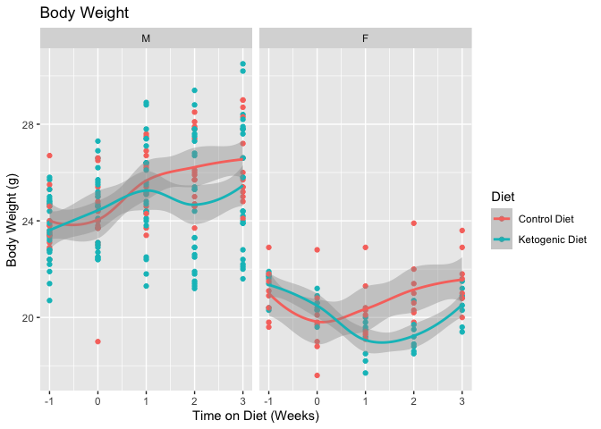


```r
exp.data %>%
  filter(assay=='Body Weight') %>%
  ggplot(aes(y=Mass,x=diet.time,col=Diet,group=animal.id)) +
  geom_line() +
  geom_point() +
  facet_grid(.~Sex) +
  labs(title="Body Weight",
       subtitle="Individual Trajectories",
       x="Time on Diet (Weeks)",
       y="Body Weight (g)") 
```

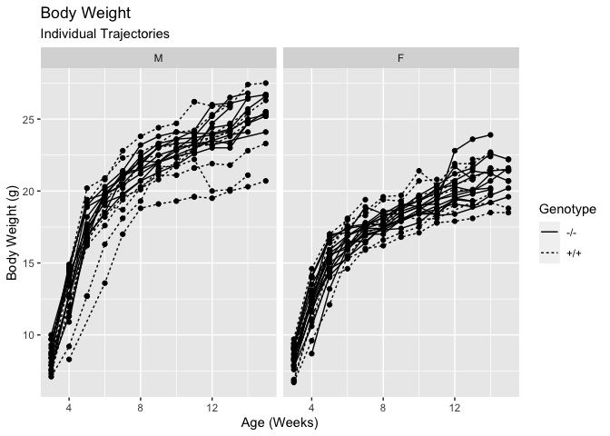


```r
exp.data %>%
  filter(assay=='Body Weight') %>%
  group_by(Diet,Sex,diet.time) %>%
  summarize(Average = mean(Mass),
            SE = se(Mass)) %>%
  ggplot(aes(y=Average,
             ymin=Average-SE,
             ymax=Average+SE,
             x=diet.time,col=Diet)) +
  geom_errorbar(width=0.5) +
  geom_line() +
    facet_grid(.~Sex) +
  labs(title="Body Weight",
       x="Time on Diet (Weeks)",
       y="Body Weight (g)")
```

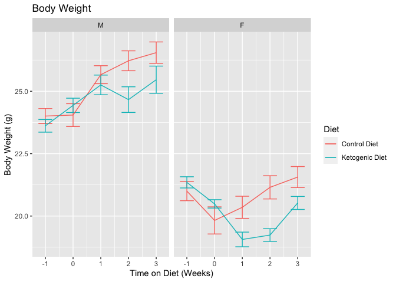

```r
exp.data %>%
  filter(assay=='Body Weight') %>%
  group_by(Diet,Sex,diet.time) %>%
  summarize(Average = mean(Mass),
            SE = se(Mass)) %>%
  ggplot(aes(y=Average,
             ymin=Average-SE,
             ymax=Average+SE,
             x=diet.time,col=Diet)) +
  geom_errorbar(width=0.5) +
  geom_line() +
    facet_grid(.~Sex) +
  labs(title="",
       x="Time on Diet (Weeks)",
       y="Body Weight (g)") +
  scale_color_grey() +
  theme_classic() +
    theme(text=element_text(size=18),
          legend.position = c(0.75,0.75))
```

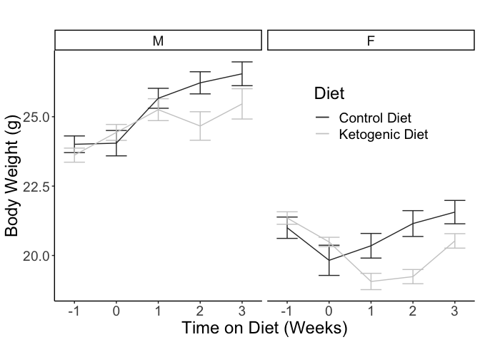

## Body Weight Statistics


```r
library(lme4)
library(lmerTest)
male.lme.weight.null <- lmer(Mass ~ diet.time + (1|animal.id), data=filter(exp.data, assay=='Body Weight'&diet.time>=0&Sex=="M"))
male.lme.weight <- lmer(Mass ~ diet.time*Diet + (1|animal.id), data=filter(exp.data, assay=='Body Weight'&diet.time>=0&Sex=="M"))
anova(male.lme.weight,male.lme.weight.null) %>% kable(caption="Male weight stats")
```


Table: Male weight stats

|                     | npar| AIC| BIC| logLik| deviance| Chisq| Df| Pr(>Chisq)|
|:--------------------|----:|---:|---:|------:|--------:|-----:|--:|----------:|
|male.lme.weight.null |    4| 586| 598|   -289|      578|    NA| NA|         NA|
|male.lme.weight      |    6| 573| 591|   -280|      561|  17.1|  2|          0|

```r
female.lme.weight.null <- lmer(Mass ~ diet.time + (1|animal.id), data=filter(exp.data, assay=='Body Weight'&diet.time>=0&Sex=="F"))
female.lme.weight <- lmer(Mass ~ diet.time*Diet + (1|animal.id), data=filter(exp.data, assay=='Body Weight'&diet.time>=0&Sex=="F"))
anova(female.lme.weight,female.lme.weight.null) %>% kable(caption="Female weight stats")
```


Table: Female weight stats

|                       | npar| AIC| BIC| logLik| deviance| Chisq| Df| Pr(>Chisq)|
|:----------------------|----:|---:|---:|------:|--------:|-----:|--:|----------:|
|female.lme.weight.null |    4| 196| 205|  -94.1|      188|    NA| NA|         NA|
|female.lme.weight      |    6| 187| 200|  -87.3|      175|  13.6|  2|      0.001|

```r
lmer(Mass ~ diet.time*Diet*Sex + (1|animal.id), data=filter(exp.data, assay=='Body Weight'&diet.time>=0)) %>% summary %>% coef%>% kable(caption="Interaction of sex on body weight")
```


Table: Interaction of sex on body weight

|                                  | Estimate| Std. Error|    df| t value| Pr(>&#124;t&#124;)|
|:---------------------------------|--------:|----------:|-----:|-------:|------------------:|
|(Intercept)                       |   24.309|      0.465|  69.0|  52.268|              0.000|
|diet.time                         |    0.807|      0.111| 162.6|   7.289|              0.000|
|DietKetogenic Diet                |    0.308|      0.584|  68.8|   0.527|              0.600|
|SexF                              |   -4.489|      0.787|  68.6|  -5.702|              0.000|
|diet.time:DietKetogenic Diet      |   -0.613|      0.140| 162.7|  -4.375|              0.000|
|diet.time:SexF                    |   -0.206|      0.187| 162.6|  -1.100|              0.273|
|DietKetogenic Diet:SexF           |   -0.343|      1.071|  68.5|  -0.320|              0.750|
|diet.time:DietKetogenic Diet:SexF |    0.041|      0.256| 162.6|   0.159|              0.874|


```r
exp.data %>%
  filter(assay=='Body Weight') %>%
  group_by(Diet,Sex,diet.time) %>%
  summarize(Average = mean(Mass.Change, na.rm=T),
            SE = se(Mass.Change)) %>%
  ggplot(aes(y=Average,
             ymin=Average-SE,
             ymax=Average+SE,
             x=diet.time,col=Diet)) +
  geom_errorbar(width=0.5) +
  geom_line() +
    facet_grid(.~Sex) +
  labs(title="Body Weight",
       x="Time on Diet (Weeks)",
       y="Change in Body Weight (g)")
```

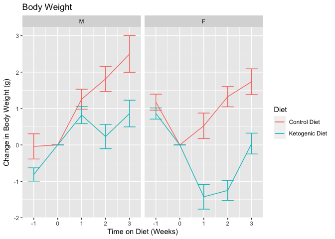

# Lean Mass


```r
exp.data %>%
  filter(assay=='Lean Mass') %>%
  ggplot(aes(y=Mass,x=diet.time,col=Diet)) +
  geom_point() +
  facet_grid(.~Sex) +
  stat_smooth() +
  labs(title="Lean Mass",
       x="Time on Diet (Weeks)",
       y="Lean Mass (g)")
```

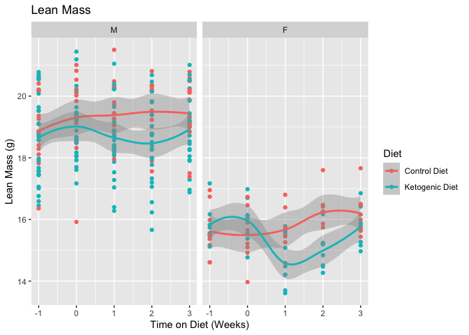


```r
exp.data %>%
  filter(assay=='Lean Mass') %>%
  group_by(Diet,Sex,diet.time) %>%
  summarize(Average = mean(Mass, na.rm=T),
            SE = se(Mass)) %>%
  ggplot(aes(y=Average,
             ymin=Average-SE,
             ymax=Average+SE,
             x=diet.time,col=Diet)) +
  geom_errorbar(width=0.5) +
  geom_line() +
    facet_grid(.~Sex) +
  labs(title="Lean Mass",
       x="Time on Diet (Weeks)",
       y="Lean Mass (g)") 
```

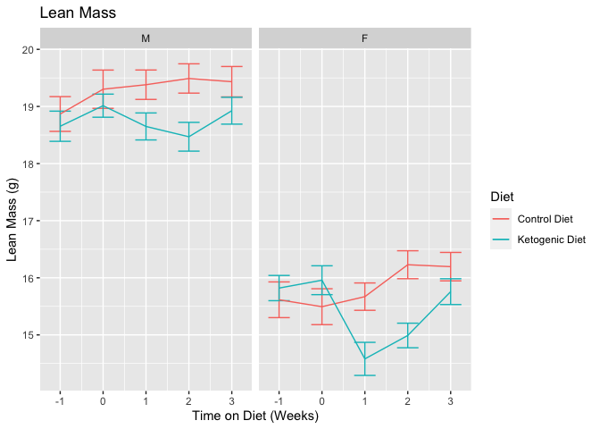

```r
exp.data %>%
  filter(assay=='Lean Mass') %>%
  group_by(Diet,Sex,diet.time) %>%
  summarize(Average = mean(Mass, na.rm=T),
            SE = se(Mass)) %>%
  ggplot(aes(y=Average,
             ymin=Average-SE,
             ymax=Average+SE,
             x=diet.time,col=Diet)) +
  geom_errorbar(width=0.5) +
  geom_line() +
    facet_grid(.~Sex) +
  labs(title="",
       x="Time on Diet (Weeks)",
       y="Lean Mass (g)") +
  scale_color_grey() +
  theme_classic() +
    theme(text=element_text(size=18),
          legend.position = c(0.75,0.75))
```

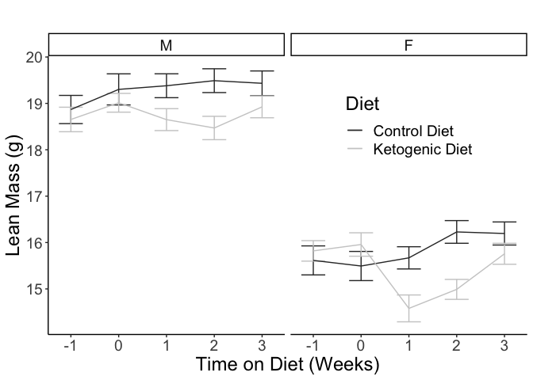

## Lean Mass Statistics


```r
male.lme.lean.null <- lmer(Mass ~ diet.time + (1|animal.id), data=filter(exp.data, assay=='Lean Mass'&diet.time>=0&Sex=="M"))
male.lme.lean <- lmer(Mass ~ diet.time*Diet + (1|animal.id), data=filter(exp.data, assay=='Lean Mass'&diet.time>=0&Sex=="M"))
anova(male.lme.lean,male.lme.lean.null) %>% kable(caption="Male lean mass stats")
```


Table: Male lean mass stats

|                   | npar| AIC| BIC| logLik| deviance| Chisq| Df| Pr(>Chisq)|
|:------------------|----:|---:|---:|------:|--------:|-----:|--:|----------:|
|male.lme.lean.null |    4| 388| 400|   -190|      380|    NA| NA|         NA|
|male.lme.lean      |    6| 387| 405|   -187|      375|  5.49|  2|      0.064|

```r
female.lme.lean.null <- lmer(Mass ~ diet.time + (1|animal.id), data=filter(exp.data, assay=='Lean Mass'&diet.time>=0&Sex=="F"))
female.lme.lean <- lmer(Mass ~ diet.time*Diet + (1|animal.id), data=filter(exp.data, assay=='Lean Mass'&diet.time>=0&Sex=="F"))
anova(female.lme.lean,female.lme.lean.null) %>% kable(caption="Female lean mass stats")
```


Table: Female lean mass stats

|                     | npar| AIC| BIC| logLik| deviance| Chisq| Df| Pr(>Chisq)|
|:--------------------|----:|---:|---:|------:|--------:|-----:|--:|----------:|
|female.lme.lean.null |    4| 154| 162|  -72.8|      146|    NA| NA|         NA|
|female.lme.lean      |    6| 150| 163|  -69.0|      138|  7.71|  2|      0.021|

```r
lmer(Mass ~ diet.time*Diet*Sex + (1|animal.id), data=filter(exp.data, assay=='Lean Mass'&diet.time>=0)) %>% summary %>% coef%>% kable(caption="Interaction of sex on lean mass")
```


Table: Interaction of sex on lean mass

|                                  | Estimate| Std. Error|    df| t value| Pr(>&#124;t&#124;)|
|:---------------------------------|--------:|----------:|-----:|-------:|------------------:|
|(Intercept)                       |   19.273|      0.268|  70.9|  71.788|              0.000|
|diet.time                         |    0.050|      0.067| 162.5|   0.744|              0.458|
|DietKetogenic Diet                |   -0.420|      0.337|  70.7|  -1.248|              0.216|
|SexF                              |   -3.775|      0.454|  70.4|  -8.308|              0.000|
|diet.time:DietKetogenic Diet      |   -0.126|      0.085| 162.6|  -1.478|              0.141|
|diet.time:SexF                    |    0.216|      0.114| 162.5|   1.904|              0.059|
|DietKetogenic Diet:SexF           |    0.273|      0.618|  70.3|   0.441|              0.660|
|diet.time:DietKetogenic Diet:SexF |   -0.160|      0.155| 162.5|  -1.031|              0.304|


```r
exp.data %>%
  filter(assay=='Lean Mass') %>%
  group_by(Diet,Sex,diet.time) %>%
  summarize(Average = mean(Mass.Change, na.rm=T),
            SE = se(Mass.Change)) %>%
  ggplot(aes(y=Average,
             ymin=Average-SE,
             ymax=Average+SE,
             x=diet.time,col=Diet)) +
  geom_errorbar(width=0.5) +
  geom_line() +
    facet_grid(.~Sex) +
  labs(title="Lean Mass",
       x="Time on Diet (Weeks)",
       y="Change in Lean Mass (g)") 
```

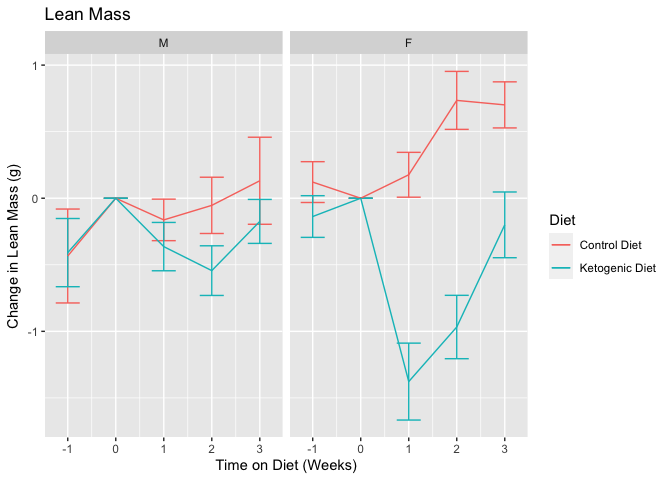

# Fat Mass


```r
exp.data %>%
  filter(assay=='Total Fat Mass') %>%
  ggplot(aes(y=Mass,x=diet.time,col=Diet)) +
  geom_point() +
  facet_grid(.~Sex) +
  stat_smooth() +
  labs(title="Fat Mass",
       x="Time on Diet (Weeks)",
       y="Fat Mass (g)")
```

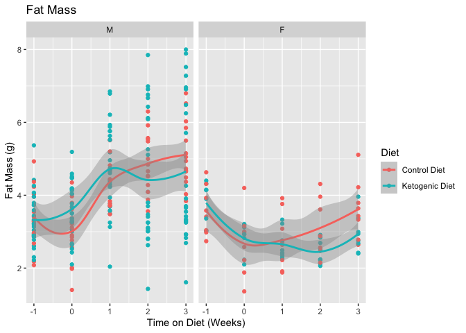


```r
exp.data %>%
  filter(assay=='Total Fat Mass') %>%
  group_by(Diet,Sex,diet.time) %>%
  summarize(Average = mean(Mass,na.rm=T),
            SE = se(Mass)) %>%
  ggplot(aes(y=Average,
             ymin=Average-SE,
             ymax=Average+SE,
             x=diet.time,col=Diet)) +
  geom_errorbar(width=0.5) +
  geom_line() +
    facet_grid(.~Sex) +
  labs(title="Fat Mass",
       x="Time on Diet (Weeks)",
       y="Fat Mass (g)") 
```

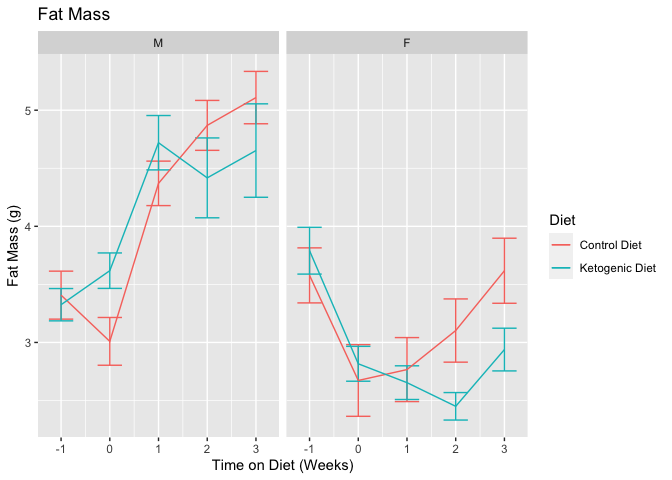

```r
exp.data %>%
  filter(assay=='Total Fat Mass') %>%
  group_by(Diet,Sex,diet.time) %>%
  summarize(Average = mean(Mass,na.rm=T),
            SE = se(Mass)) %>%
  ggplot(aes(y=Average,
             ymin=Average-SE,
             ymax=Average+SE,
             x=diet.time,col=Diet)) +
  geom_errorbar(width=0.5) +
  geom_line() +
    facet_grid(.~Sex) +
  labs(title="",
       x="Time on Diet (Weeks)",
       y="Fat Mass (g)") +
  scale_color_grey() +
  theme_classic() +
    theme(text=element_text(size=18),
          legend.position = c(0.75,0.75))
```

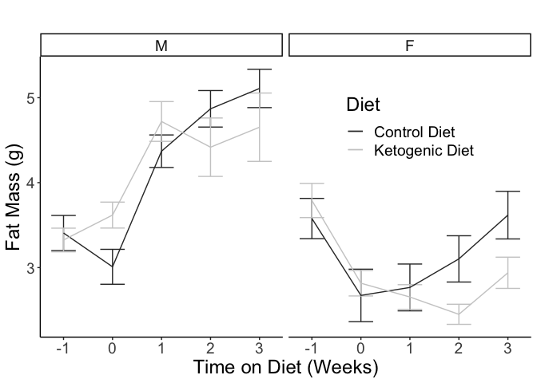


## Fat Mass Statistics


```r
male.lme.weight.null <- lmer(Mass ~ diet.time + (1|animal.id), data=filter(exp.data, assay=='Total Fat Mass'&diet.time>=0&Sex=="M"))
male.lme.weight <- lmer(Mass ~ diet.time*Diet + (1|animal.id), data=filter(exp.data, assay=='Total Fat Mass'&diet.time>=0&Sex=="M"))
anova(male.lme.weight,male.lme.weight.null) %>% kable(caption="Male fat mass stats")
```


Table: Male fat mass stats

|                     | npar| AIC| BIC| logLik| deviance| Chisq| Df| Pr(>Chisq)|
|:--------------------|----:|---:|---:|------:|--------:|-----:|--:|----------:|
|male.lme.weight.null |    4| 480| 493|   -236|      472|    NA| NA|         NA|
|male.lme.weight      |    6| 472| 490|   -230|      460|  12.7|  2|      0.002|

```r
female.lme.weight.null <- lmer(Mass ~ diet.time + (1|animal.id), data=filter(exp.data, assay=='Total Fat Mass'&diet.time>=0&Sex=="F"))
female.lme.weight <- lmer(Mass ~ diet.time*Diet + (1|animal.id), data=filter(exp.data, assay=='Total Fat Mass'&diet.time>=0&Sex=="F"))
anova(female.lme.weight,female.lme.weight.null) %>% kable(caption="Female fat mass stats")
```


Table: Female fat mass stats

|                       | npar| AIC| BIC| logLik| deviance| Chisq| Df| Pr(>Chisq)|
|:----------------------|----:|---:|---:|------:|--------:|-----:|--:|----------:|
|female.lme.weight.null |    4| 110| 118|  -50.9|    101.8|    NA| NA|         NA|
|female.lme.weight      |    6| 101| 114|  -44.4|     88.8|  12.9|  2|      0.002|

```r
lmer(Mass ~ diet.time*Diet*Sex + (1|animal.id), data=filter(exp.data, assay=='Total Fat Mass'&diet.time>=0)) %>% summary %>% coef%>% kable(caption="Interaction of sex on fat mass")
```


Table: Interaction of sex on fat mass

|                                  | Estimate| Std. Error|    df| t value| Pr(>&#124;t&#124;)|
|:---------------------------------|--------:|----------:|-----:|-------:|------------------:|
|(Intercept)                       |    3.278|      0.288|  77.7|  11.378|              0.000|
|diet.time                         |    0.681|      0.081| 162.9|   8.393|              0.000|
|DietKetogenic Diet                |    0.668|      0.361|  77.4|   1.848|              0.068|
|SexF                              |   -0.714|      0.487|  77.1|  -1.464|              0.147|
|diet.time:DietKetogenic Diet      |   -0.422|      0.103| 163.1|  -4.108|              0.000|
|diet.time:SexF                    |   -0.364|      0.137| 162.9|  -2.651|              0.009|
|DietKetogenic Diet:SexF           |   -0.542|      0.663|  77.0|  -0.817|              0.416|
|diet.time:DietKetogenic Diet:SexF |    0.121|      0.187| 163.0|   0.645|              0.520|


```r
exp.data %>%
  filter(assay=='Total Fat Mass') %>%
  group_by(Diet,Sex,diet.time) %>%
  summarize(Average = mean(Mass.Change,na.rm=T),
            SE = se(Mass.Change)) %>%
  ggplot(aes(y=Average,
             ymin=Average-SE,
             ymax=Average+SE,
             x=diet.time,col=Diet)) +
  geom_errorbar(width=0.5) +
  geom_line() +
    facet_grid(.~Sex) +
  labs(title="Fat Mass",
       x="Time on Diet (Weeks)",
       y="Change in Fat Mass (g)") 
```


# Summary of Changes


```r
exp.data %>%
  filter(diet.time %in% c(1,3)) %>%
  arrange(diet.time) %>%
  filter(assay!='Plasma Glucose') %>%
  group_by(assay,MouseID,Diet,Sex) %>%
  summarize(Difference = (Mass[2]-Mass[1])/Mass[1]*100,
            Start=Mass[1]) %>%
  group_by(assay,Diet,Sex) %>%
  summarize(Mean.Difference = mean(Difference, na.rm=T)) %>%
  pivot_wider(names_from=Diet, values_from=Mean.Difference) %>%
  mutate(Difference = `Control Diet` - `Ketogenic Diet`) %>%
  kable(caption="Percent changes in body composition over the diets")
```


Table: Percent changes in body composition over the diets

|assay          |Sex | Control Diet| Ketogenic Diet| Difference|
|:--------------|:---|------------:|--------------:|----------:|
|Body Weight    |M   |        3.615|         -0.147|      3.761|
|Body Weight    |F   |        6.062|          7.773|     -1.711|
|Total Fat Mass |M   |       18.104|         -5.002|     23.107|
|Total Fat Mass |F   |       34.725|         11.196|     23.529|
|Lean Mass      |M   |        0.424|          1.048|     -0.624|
|Lean Mass      |F   |        3.388|          8.243|     -4.855|

# Session Information


```r
sessionInfo()
```

```
## R version 4.0.2 (2020-06-22)
## Platform: x86_64-apple-darwin17.0 (64-bit)
## Running under: macOS  10.16
## 
## Matrix products: default
## BLAS:   /Library/Frameworks/R.framework/Versions/4.0/Resources/lib/libRblas.dylib
## LAPACK: /Library/Frameworks/R.framework/Versions/4.0/Resources/lib/libRlapack.dylib
## 
## locale:
## [1] en_US.UTF-8/en_US.UTF-8/en_US.UTF-8/C/en_US.UTF-8/en_US.UTF-8
## 
## attached base packages:
## [1] stats     graphics  grDevices utils     datasets  methods   base     
## 
## other attached packages:
## [1] lmerTest_3.1-3 lme4_1.1-26    Matrix_1.3-0   ggplot2_3.3.3  readr_1.4.0   
## [6] dplyr_1.0.2    tidyr_1.1.2    knitr_1.30    
## 
## loaded via a namespace (and not attached):
##  [1] Rcpp_1.0.5          nloptr_1.2.2.2      pillar_1.4.7       
##  [4] compiler_4.0.2      highr_0.8           tools_4.0.2        
##  [7] boot_1.3-25         statmod_1.4.35      digest_0.6.27      
## [10] evaluate_0.14       lifecycle_0.2.0     tibble_3.0.4       
## [13] gtable_0.3.0        nlme_3.1-151        lattice_0.20-41    
## [16] mgcv_1.8-33         pkgconfig_2.0.3     rlang_0.4.10       
## [19] yaml_2.2.1          xfun_0.19           withr_2.3.0        
## [22] stringr_1.4.0       generics_0.1.0      vctrs_0.3.6        
## [25] hms_0.5.3           grid_4.0.2          tidyselect_1.1.0   
## [28] glue_1.4.2          R6_2.5.0            rmarkdown_2.6      
## [31] minqa_1.2.4         purrr_0.3.4         farver_2.0.3       
## [34] magrittr_2.0.1      MASS_7.3-53         scales_1.1.1       
## [37] ellipsis_0.3.1      htmltools_0.5.0     splines_4.0.2      
## [40] colorspace_2.0-0    numDeriv_2016.8-1.1 labeling_0.4.2     
## [43] stringi_1.5.3       munsell_0.5.0       crayon_1.3.4
```
