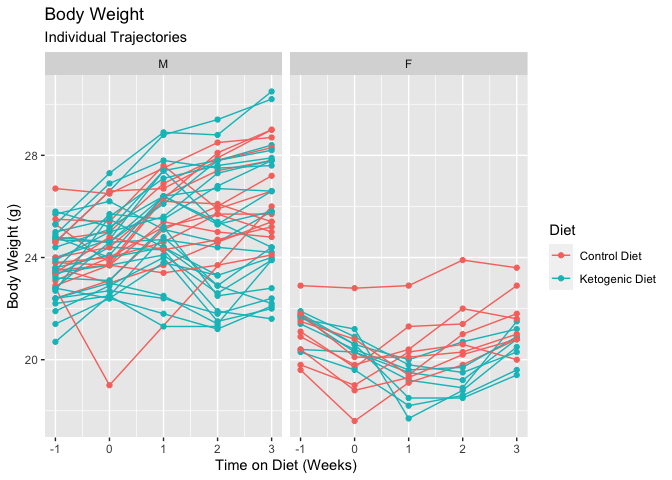
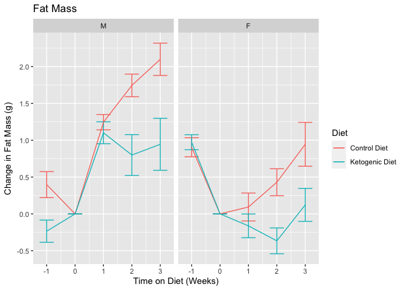

This script can be found in /Users/davebrid/Documents/GitHub/TissueSpecificTscKnockouts/Mouse Data/Ketogenic Diets and was most recently run on Mon Mar 30 16:10:10 2020.


# Data Entry


```r
col.types <- cols(
  age = col_double(),
  animal.id = col_factor(level=NULL),
  MouseID = col_factor(level=NULL),
  Sex = col_factor(level=NULL),
  Genotype = col_character(),
  values = col_double(),
  assay = col_factor(level=NULL),
  experiment.date = col_date(format = ""),
  Cohort = col_factor(levels=NULL),
  Mass = col_double()
)

filename <- 'Combined Body Composition Data.csv'
sick.mice <- c(4099,	8067)
exp.data <- read_csv(filename, col_types = col.types) %>%
  filter(diet.time<4) %>% #remove data on fourth week
  filter(!(MouseID %in% sick.mice)) # removed sick mice
```

This script pulled in a total of 868 observations.  This includes the following number of animals in each treatment group. 

# Enrolled Animals

This is for animals where wer have any body composition data.


```r
exp.data %>%
  group_by(Sex,Diet) %>%
  distinct(animal.id, .keep_all = T) %>%
  count %>%
  kable(caption="Animals in each group of this cohort")
```


Table: Animals in each group of this cohort

Sex   Diet               n
----  ---------------  ---
M     Control Diet      15
M     Ketogenic Diet    27
F     Control Diet       8
F     Ketogenic Diet     8

```r
exp.data %>%
  group_by(Sex,Diet) %>%
  distinct(animal.id, .keep_all = T) %>%
  arrange(Sex,Diet) %>%
  select(MouseID,Sex,Diet) %>%
  kable(caption="Animals in each group of this cohort")
```


Table: Animals in each group of this cohort

MouseID   Sex   Diet           
--------  ----  ---------------
4086      M     Control Diet   
4087      M     Control Diet   
4088      M     Control Diet   
4089      M     Control Diet   
4094      M     Control Diet   
4095      M     Control Diet   
4096      M     Control Diet   
4097      M     Control Diet   
1738      M     Control Diet   
1745      M     Control Diet   
1749      M     Control Diet   
1750      M     Control Diet   
8063      M     Control Diet   
8064      M     Control Diet   
8065      M     Control Diet   
4090      M     Ketogenic Diet 
4091      M     Ketogenic Diet 
4092      M     Ketogenic Diet 
4093      M     Ketogenic Diet 
4098      M     Ketogenic Diet 
4100      M     Ketogenic Diet 
4101      M     Ketogenic Diet 
1739      M     Ketogenic Diet 
1740      M     Ketogenic Diet 
1741      M     Ketogenic Diet 
1742      M     Ketogenic Diet 
1743      M     Ketogenic Diet 
1744      M     Ketogenic Diet 
1746      M     Ketogenic Diet 
1747      M     Ketogenic Diet 
1748      M     Ketogenic Diet 
1751      M     Ketogenic Diet 
1752      M     Ketogenic Diet 
1753      M     Ketogenic Diet 
8066      M     Ketogenic Diet 
8068      M     Ketogenic Diet 
8069      M     Ketogenic Diet 
8070      M     Ketogenic Diet 
8071      M     Ketogenic Diet 
8072      M     Ketogenic Diet 
8073      M     Ketogenic Diet 
8074      M     Ketogenic Diet 
4106      F     Control Diet   
4107      F     Control Diet   
4108      F     Control Diet   
4109      F     Control Diet   
4114      F     Control Diet   
4115      F     Control Diet   
4116      F     Control Diet   
4117      F     Control Diet   
4102      F     Ketogenic Diet 
4103      F     Ketogenic Diet 
4104      F     Ketogenic Diet 
4105      F     Ketogenic Diet 
4110      F     Ketogenic Diet 
4111      F     Ketogenic Diet 
4112      F     Ketogenic Diet 
4113      F     Ketogenic Diet 

# Body Weight


```r
library(ggplot2)

exp.data %>%
  filter(assay=='Body Weight') %>%
  ggplot(aes(y=Mass,x=diet.time,col=Diet)) +
  geom_point() +
    facet_grid(.~Sex) +
  stat_smooth() +
  labs(title="Body Weight",
       x="Time on Diet (Weeks)",
       y="Body Weight (g)")
```


```r
exp.data %>%
  filter(assay=='Body Weight') %>%
  ggplot(aes(y=Mass,x=diet.time,col=Diet,group=animal.id)) +
  geom_line() +
  geom_point() +
  facet_grid(.~Sex) +
  labs(title="Body Weight",
       subtitle="Individual Trajectories",
       x="Time on Diet (Weeks)",
       y="Body Weight (g)") 
```




```r
exp.data %>%
  filter(assay=='Body Weight') %>%
  group_by(Diet,Sex,diet.time) %>%
  summarize(Average = mean(Mass),
            SE = se(Mass)) %>%
  ggplot(aes(y=Average,
             ymin=Average-SE,
             ymax=Average+SE,
             x=diet.time,col=Diet)) +
  geom_errorbar(width=0.5) +
  geom_line() +
    facet_grid(.~Sex) +
  labs(title="Body Weight",
       x="Time on Diet (Weeks)",
       y="Body Weight (g)")
```


```r
exp.data %>%
  filter(assay=='Body Weight') %>%
  group_by(Diet,Sex,diet.time) %>%
  summarize(Average = mean(Mass.Change, na.rm=T),
            SE = se(Mass.Change)) %>%
  ggplot(aes(y=Average,
             ymin=Average-SE,
             ymax=Average+SE,
             x=diet.time,col=Diet)) +
  geom_errorbar(width=0.5) +
  geom_line() +
    facet_grid(.~Sex) +
  labs(title="Body Weight",
       x="Time on Diet (Weeks)",
       y="Change in Body Weight (g)")
```


# Lean Mass


```r
exp.data %>%
  filter(assay=='Lean Mass') %>%
  ggplot(aes(y=Mass,x=diet.time,col=Diet)) +
  geom_point() +
  facet_grid(.~Sex) +
  stat_smooth() +
  labs(title="Lean Mass",
       x="Time on Diet (Weeks)",
       y="Lean Mass (g)")
```


```r
exp.data %>%
  filter(assay=='Lean Mass') %>%
  group_by(Diet,Sex,diet.time) %>%
  summarize(Average = mean(Mass, na.rm=T),
            SE = se(Mass)) %>%
  ggplot(aes(y=Average,
             ymin=Average-SE,
             ymax=Average+SE,
             x=diet.time,col=Diet)) +
  geom_errorbar(width=0.5) +
  geom_line() +
    facet_grid(.~Sex) +
  labs(title="Lean Mass",
       x="Time on Diet (Weeks)",
       y="Lean Mass (g)") 
```


```r
exp.data %>%
  filter(assay=='Lean Mass') %>%
  group_by(Diet,Sex,diet.time) %>%
  summarize(Average = mean(Mass.Change, na.rm=T),
            SE = se(Mass.Change)) %>%
  ggplot(aes(y=Average,
             ymin=Average-SE,
             ymax=Average+SE,
             x=diet.time,col=Diet)) +
  geom_errorbar(width=0.5) +
  geom_line() +
    facet_grid(.~Sex) +
  labs(title="Lean Mass",
       x="Time on Diet (Weeks)",
       y="Change in Lean Mass (g)") 
```


# Fat Mass


```r
exp.data %>%
  filter(assay=='Total Fat Mass') %>%
  ggplot(aes(y=Mass,x=diet.time,col=Diet)) +
  geom_point() +
  facet_grid(.~Sex) +
  stat_smooth() +
  labs(title="Fat Mass",
       x="Time on Diet (Weeks)",
       y="Fat Mass (g)")
```


```r
exp.data %>%
  filter(assay=='Total Fat Mass') %>%
  group_by(Diet,Sex,diet.time) %>%
  summarize(Average = mean(Mass,na.rm=T),
            SE = se(Mass)) %>%
  ggplot(aes(y=Average,
             ymin=Average-SE,
             ymax=Average+SE,
             x=diet.time,col=Diet)) +
  geom_errorbar(width=0.5) +
  geom_line() +
    facet_grid(.~Sex) +
  labs(title="Fat Mass",
       x="Time on Diet (Weeks)",
       y="Fat Mass (g)") 
```


```r
exp.data %>%
  filter(assay=='Total Fat Mass') %>%
  group_by(Diet,Sex,diet.time) %>%
  summarize(Average = mean(Mass.Change,na.rm=T),
            SE = se(Mass.Change)) %>%
  ggplot(aes(y=Average,
             ymin=Average-SE,
             ymax=Average+SE,
             x=diet.time,col=Diet)) +
  geom_errorbar(width=0.5) +
  geom_line() +
    facet_grid(.~Sex) +
  labs(title="Fat Mass",
       x="Time on Diet (Weeks)",
       y="Change in Fat Mass (g)") 
```


