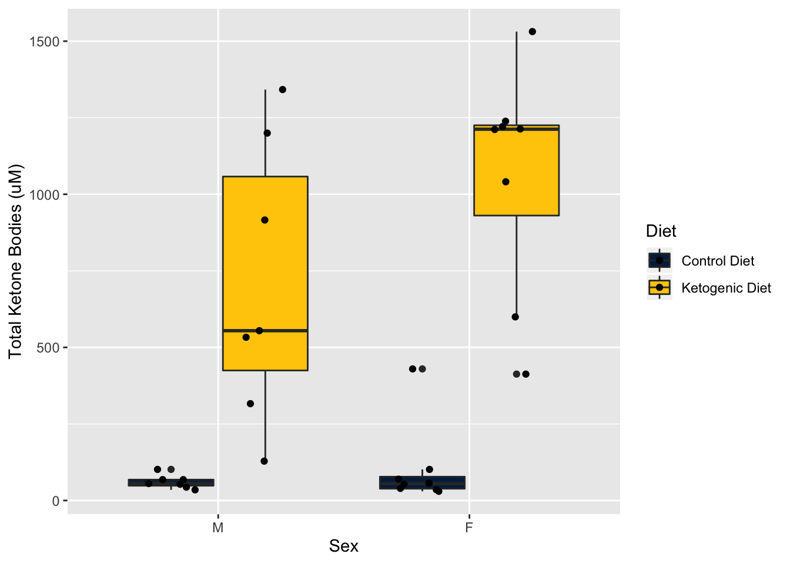
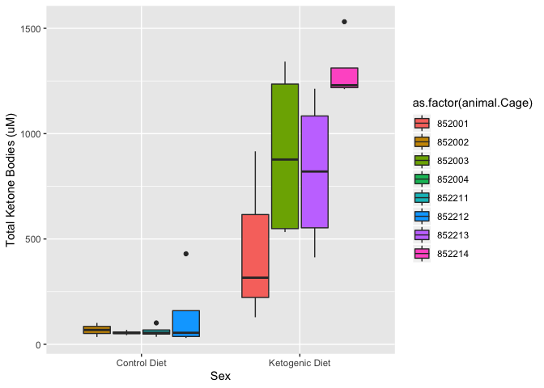
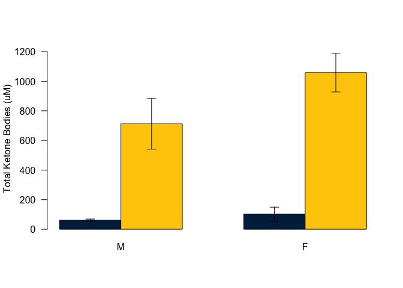
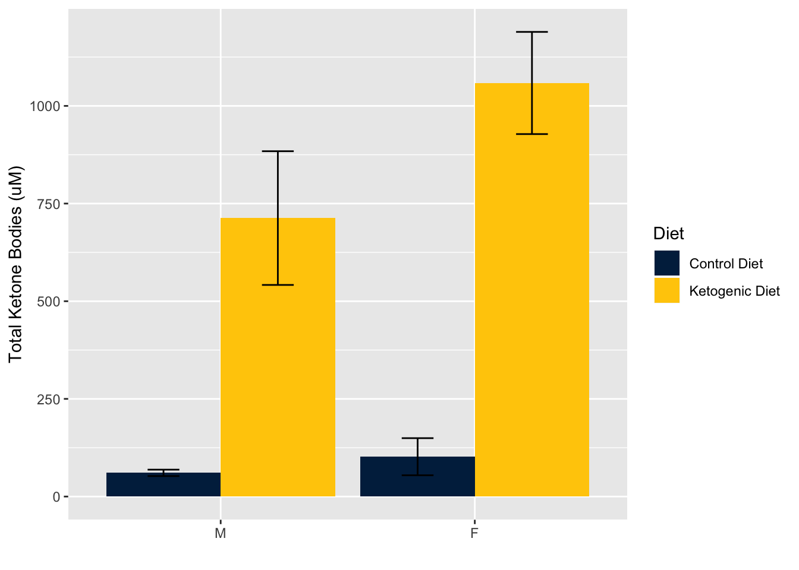
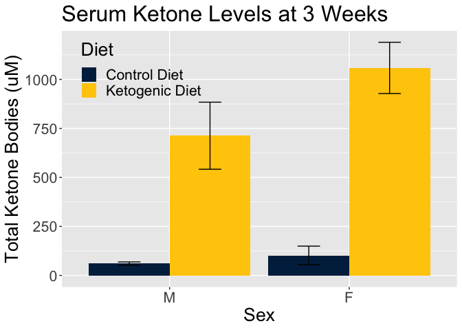
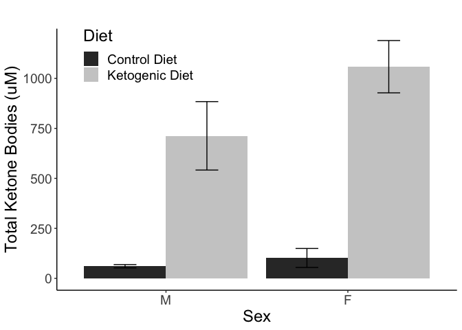

# Purpose

# Experimental Details

Mice retained access to food.  Blood was drawn by retro-orbital bleed and stored at -80 at about 3 PM (ZT8).

* Protocol for blood preparation is at http://bridgeslab.sph.umich.edu/protocols/index.php?title=Measuring_Fasting_Insulin&oldid=206
* Protocol for BHB assay is at http://bridgeslab.sph.umich.edu/protocols/index.php?title=BHB_Assay&oldid=1360

# Raw Data


These data can be found in /Users/davebrid/Documents/GitHub/TissueSpecificTscKnockouts/Mouse Data/Ketogenic Diets.  This script was most recently updated on Wed Feb 12 11:39:04 2020.

The standard curve is in the file bhb-standard-curve.csv and bhb-standard-curve.csv  The mouse data is in a file bhb-data.csv and bhb-data-second-run.csv.  The mapping file is in Body Composition Data.csv.

# Analysis

## Standard Curve

For the first batch the standard curve was:

<!-- -->

The standard curve paramaeters are shown below.  The curve had an R2 value of 0.995.:


term           estimate   std.error   statistic   p.value
------------  ---------  ----------  ----------  --------
(Intercept)       -4.26       8.912      -0.478     0.644
Rate              22.26       0.536      41.512     0.000

The standard curve was well below the highest samples which will need to be re-analysed.  The highest rate on the standard curve ws 39.571.  The animals that need to be re-analyzed included:


Table: Samples with assay rates higher than the standard curve

 Mouse    Rate
------  ------
  4110   115.9
  4112   106.6
  4099   104.7
  4111    42.7
  4102   106.4
  4113    65.3
  4103   126.9
  4098    57.0
  4104   127.3
  4105   148.4
  4093   123.7
  4091    64.4
  4090   128.1
  4092    58.7

For the second batch of samples the standard curve was:

<!-- -->

The standard curve paramaeters are shown below.  The curve had an R2 value of 0.987.:


Table: Second batch standard curve data.

term           estimate   std.error   statistic   p.value
------------  ---------  ----------  ----------  --------
(Intercept)      -172.3       48.91       -3.52     0.006
Rate               29.5        1.05       28.06     0.000

BHB levels were determined by extrapolating from the standard curves.

For the first batch:


for the second batch


We then combined the assay data and filtered to override with the second BHB value rather than the first


The combined data was written to the file Analysed BHB Data.csv.

The data was then summarized after combining.

# Sample Size


Table: Number of animals in each group

animal.Gender   Diet               n
--------------  ---------------  ---
M               Control Diet       7
M               Ketogenic Diet     7
F               Control Diet       8
F               Ketogenic Diet     8


Table: Summary Data

animal.Gender   Diet              BHB.mean   BHB.se   BHB.sd    n   Shapiro
--------------  ---------------  ---------  -------  -------  ---  --------
M               Control Diet          60.6     8.21     21.7    7     0.513
M               Ketogenic Diet       712.8   171.16    452.9    7     0.678
F               Control Diet         102.0    47.50    134.3    8     0.000
F               Ketogenic Diet      1058.6   130.77    369.9    8     0.137

<!-- -->

<!-- -->

<!-- --><!-- --><!-- --><!-- -->

### Statistics

A two-way anova between Sex and Diet with an interaction yielded a significant effect of diet but no significant effect of gender.


term                  df     sumsq    meansq   statistic   p.value
-------------------  ---  --------  --------  ----------  --------
Diet                   1   4976796   4976796       55.84     0.000
animal.Gender          1    279796    279796        3.14     0.088
Diet:animal.Gender     1    173008    173008        1.94     0.175
Residuals             26   2317342     89129          NA        NA

The main effect of diet was p=6.202&times; 10^-8^.  There was a 11.762 fold increase in males and a 10.383 fold increase in females.

# Interpretation

Clear elevations in ketone bodies in semi-fasted animals after 3 weeks on ketogenic diet.  Need to confirm whether these levels represent physiologically relevant amounts of ketosis.  There is a trend toward a  differences between males and females, with females having higher baseline and KD-induced total ketone levels.

# Session Information


```r
sessionInfo()
```

```
## R version 3.6.2 (2019-12-12)
## Platform: x86_64-apple-darwin15.6.0 (64-bit)
## Running under: macOS Catalina 10.15.3
## 
## Matrix products: default
## BLAS:   /Library/Frameworks/R.framework/Versions/3.6/Resources/lib/libRblas.0.dylib
## LAPACK: /Library/Frameworks/R.framework/Versions/3.6/Resources/lib/libRlapack.dylib
## 
## locale:
## [1] en_US.UTF-8/en_US.UTF-8/en_US.UTF-8/C/en_US.UTF-8/en_US.UTF-8
## 
## attached base packages:
## [1] stats     graphics  grDevices utils     datasets  methods   base     
## 
## other attached packages:
## [1] ggplot2_3.2.1 broom_0.5.4   readr_1.3.1   dplyr_0.8.3   tidyr_1.0.2  
## [6] knitr_1.27   
## 
## loaded via a namespace (and not attached):
##  [1] Rcpp_1.0.3       plyr_1.8.5       pillar_1.4.3     compiler_3.6.2  
##  [5] highr_0.8        tools_3.6.2      digest_0.6.23    evaluate_0.14   
##  [9] lifecycle_0.1.0  tibble_2.1.3     nlme_3.1-143     gtable_0.3.0    
## [13] lattice_0.20-38  pkgconfig_2.0.3  rlang_0.4.4      yaml_2.2.0      
## [17] xfun_0.12        withr_2.1.2      stringr_1.4.0    generics_0.0.2  
## [21] vctrs_0.2.2      hms_0.5.3        grid_3.6.2       tidyselect_1.0.0
## [25] glue_1.3.1       R6_2.4.1         rmarkdown_2.1    farver_2.0.3    
## [29] purrr_0.3.3      magrittr_1.5     backports_1.1.5  scales_1.1.0    
## [33] htmltools_0.4.0  assertthat_0.2.1 colorspace_1.4-1 labeling_0.3    
## [37] stringi_1.4.5    lazyeval_0.2.2   munsell_0.5.0    crayon_1.3.4
```
