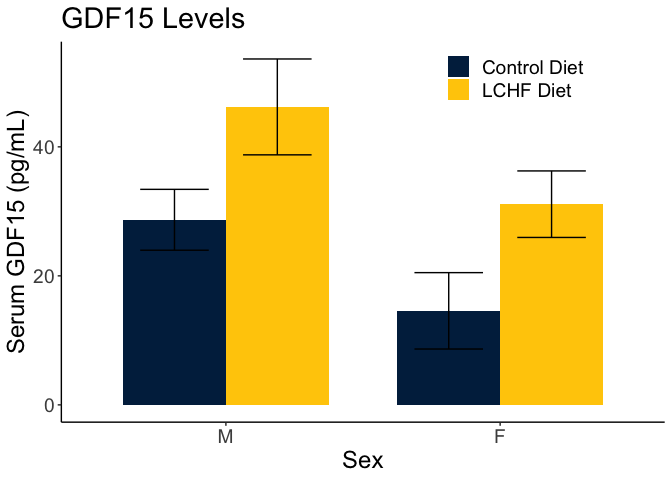
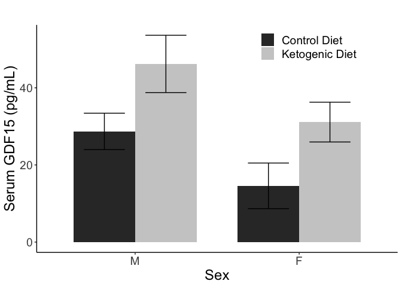
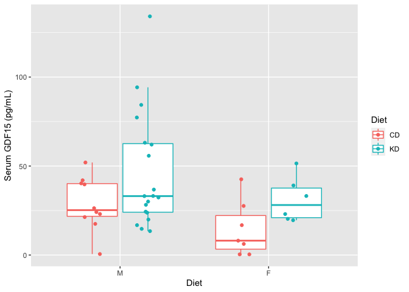
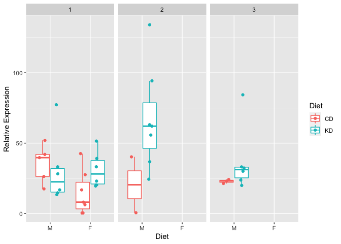

# Purpose

To determine the levels of GDF15 from either ketogenic diet or dexamethasone treatments.

# Experimental Details

Used the Quantikine kit, used 15 uL serum rather than 50 uL.

# Raw Data

The input data is calculated from MyAssays from a four parameter logistic regression calculation (https://www.myassays.com/) and annotated with cohort, sex and groups.  The equation (solved for concentration) is:

$$ Concentration = c\left ( \frac{a-d}{y-d} -1 \right )^{\frac{1}{b}} $$


```r
library(readr) #loads the readr package
filename <- 'GDF15 ELISA Results.csv' 

#this loads whatever the file is into a dataframe called exp.data if it exists
exp.data <- read_csv(filename, skip=30,
                       na = '< Curve',
                       col_types=cols(Mouse = col_factor(levels=NULL),
                                      Diet = col_factor(levels=NULL),
                                      Sex = col_factor(levels=NULL),
                                      Cohort = col_factor(levels=NULL),
                                      Treatment = col_factor(levels=NULL),
                                      Conc= col_double()))
```

These data can be found in **/Users/davebrid/Documents/GitHub/TissueSpecificTscKnockouts/Mouse Data/Ketogenic Diets** in a file named **GDF15 ELISA Results.csv**.  This script was most recently updated on **Mon Apr  6 14:34:54 2020**.

# Analysis

## Ketogenic Diets

We had serum from the two cohorts of ketogenic mice, some with males and females


```r
library(forcats)
exp.data <-
  exp.data %>%
  mutate(Concentration = Conc.*50/Volume) 

summary.data <- 
  exp.data %>%
  group_by(Diet,Sex,Cohort) %>%
  summarize(GDF15 = mean(Concentration, na.rm=T),
            Error = se(Concentration),
            N = length(Concentration)) 

summary.data.no.cht <- 
  exp.data %>%
  group_by(Diet,Sex) %>%
  summarize(GDF15 = mean(Concentration, na.rm=T),
            Error = se(Concentration),
            N = length(Concentration))


kd.data <- exp.data %>% filter(Diet %in% c("CD",'KD')) %>% select(Diet,Sex, Concentration)

library(car)
#for female mice
library(broom)
shapiro.test(log(subset(kd.data, Sex=="F"&Diet=="CD")$Concentration))
```

```
## 
## 	Shapiro-Wilk normality test
## 
## data:  log(subset(kd.data, Sex == "F" & Diet == "CD")$Concentration)
## W = 0.9, p-value = 0.1
```

```r
wilcox.test(Concentration ~ Diet, filter(kd.data, Sex=="F")) 
```

```
## 
## 	Wilcoxon rank sum test with continuity correction
## 
## data:  Concentration by Diet
## W = 8, p-value = 0.07
## alternative hypothesis: true location shift is not equal to 0
```

```r
shapiro.test(subset(kd.data, Sex=="F"&Diet=="CD")$Concentration)
```

```
## 
## 	Shapiro-Wilk normality test
## 
## data:  subset(kd.data, Sex == "F" & Diet == "CD")$Concentration
## W = 0.9, p-value = 0.2
```

```r
shapiro.test(subset(kd.data, Sex=="F"&Diet=="KD")$Concentration)
```

```
## 
## 	Shapiro-Wilk normality test
## 
## data:  subset(kd.data, Sex == "F" & Diet == "KD")$Concentration
## W = 0.9, p-value = 0.3
```

```r
#since neither can be presumed to NOT be normally distributed we can go ahead with a t-test, if fails then wilocox
leveneTest(Concentration ~ Diet, filter(kd.data, Sex=="F")) #to test for equal variance
```

```
## Levene's Test for Homogeneity of Variance (center = median)
##       Df F value Pr(>F)
## group  1    0.05   0.82
##       11
```

```r
t.test(Concentration ~ Diet, filter(kd.data, Sex=="F"), var.equal=T) %>%
  tidy %>% kable(caption="Female t-test")#Welch vs Student is var.equal=T/F
```


Table: Female t-test

 estimate1   estimate2   statistic   p.value   parameter   conf.low   conf.high  method              alternative 
----------  ----------  ----------  --------  ----------  ---------  ----------  ------------------  ------------
      14.6        31.1       -2.07     0.063          11      -34.1        1.06  Two Sample t-test   two.sided   

```r
#for male mice
shapiro.test(subset(kd.data, Sex=="M"&Diet=="CD")$Concentration)
```

```
## 
## 	Shapiro-Wilk normality test
## 
## data:  subset(kd.data, Sex == "M" & Diet == "CD")$Concentration
## W = 1, p-value = 0.7
```

```r
shapiro.test(subset(kd.data, Sex=="M"&Diet=="KD")$Concentration)
```

```
## 
## 	Shapiro-Wilk normality test
## 
## data:  subset(kd.data, Sex == "M" & Diet == "KD")$Concentration
## W = 0.9, p-value = 0.008
```

```r
#since neither can be presumed to NOT be normally distributed we can go ahead with a t-test
leveneTest(Concentration ~ Diet, filter(kd.data, Sex=="M")) #to test for equal variance
```

```
## Levene's Test for Homogeneity of Variance (center = median)
##       Df F value Pr(>F)
## group  1    1.86   0.18
##       27
```

```r
t.test(Concentration ~ Diet, filter(kd.data, Sex=="M"), var.equal=T) %>%
  tidy %>% kable(caption="Male t-test")#Welch vs Student is var.equal=T/F
```


Table: Male t-test

 estimate1   estimate2   statistic   p.value   parameter   conf.low   conf.high  method              alternative 
----------  ----------  ----------  --------  ----------  ---------  ----------  ------------------  ------------
      28.7        46.2       -1.61     0.119          27      -39.8         4.8  Two Sample t-test   two.sided   

```r
summary.data.no.cht %>% filter(Diet %in% c('CD','KD')) %>%  kable(caption="Summary statistics for effects of a ketogenic diet")
```


Table: Summary statistics for effects of a ketogenic diet

Diet   Sex    GDF15   Error    N
-----  ----  ------  ------  ---
CD     M       28.7    4.72   10
CD     F       14.6    5.92    7
KD     M       46.2    7.43   19
KD     F       31.1    5.16    6

```r
library(broom)
gdf15.lm <- lm(Concentration ~ Sex + Diet,exp.data %>% filter(Diet %in% c('CD','KD')))

gdf15.lm%>%
  tidy %>% 
  kable(caption="ANOVA for effects of sex and ketogenic diet on GDF15 levels")
```


Table: ANOVA for effects of sex and ketogenic diet on GDF15 levels

term           estimate   std.error   statistic   p.value
------------  ---------  ----------  ----------  --------
(Intercept)        28.9        6.82        4.24     0.000
SexF              -14.6        8.27       -1.77     0.085
DietKD             17.2        7.79        2.21     0.033

```r
lm(Concentration ~ Sex * Diet,
    exp.data %>% filter(Diet %in% c('CD','KD'))) %>%
  tidy %>% 
  kable(caption="ANOVA for interacti g effects of sex and ketogenic diet on GDF15 levels")
```


Table: ANOVA for interacti g effects of sex and ketogenic diet on GDF15 levels

term           estimate   std.error   statistic   p.value
------------  ---------  ----------  ----------  --------
(Intercept)      28.692        7.81       3.675     0.001
SexF            -14.114       12.17      -1.160     0.253
DietKD           17.498        9.64       1.814     0.078
SexF:DietKD      -0.966       16.78      -0.058     0.954

There was a 59.44% sex adjusted increase in GDF15 levels.


```r
library(ggplot2)
ggplot(data=summary.data.no.cht %>% filter(Diet %in% c('CD','KD')),
       aes(y=GDF15,
           ymin=GDF15-Error,
           ymax=GDF15+Error,
           x=Sex,
           fill=Diet)) +
  geom_bar(stat='identity', position='dodge', width=0.75) +
  geom_errorbar(position=position_dodge(width=0.75),aes(group=Diet), width=0.5) +
  expand_limits(y=0) +
  labs(title="GDF15 Levels in Serum",
       y="Serum GDF15 (pg/mL)") +
  scale_fill_manual(values=color.scheme)
```


```r
ggplot(data=summary.data.no.cht %>% filter(Diet %in% c('CD','KD')),
       aes(y=GDF15,
           ymin=GDF15-Error,
           ymax=GDF15+Error,
           x=Sex,
           fill=Diet)) +
  geom_bar(stat='identity', position='dodge', width=0.75) +
  geom_errorbar(position=position_dodge(width=0.75),aes(group=Diet), width=0.5) +
  expand_limits(y=0) +
  labs(title="GDF15 Levels",
       y="Serum GDF15 (pg/mL)") +
  scale_fill_manual(values=color.scheme, labels=c("Control Diet","LCHF Diet"), name="") +
  theme_classic() +
  theme(text=element_text(size=18),
        legend.position=c(0.75,0.95))
```



```r
ggplot(data=summary.data.no.cht %>% filter(Diet %in% c('CD','KD')),
       aes(y=GDF15,
           ymin=GDF15-Error,
           ymax=GDF15+Error,
           x=Sex,
           fill=Diet)) +
  geom_bar(stat='identity', position='dodge', width=0.75) +
  geom_errorbar(position=position_dodge(width=0.75),aes(group=Diet), width=0.5) +
  expand_limits(y=0) +
  labs(title="",
       y="Serum GDF15 (pg/mL)") +
  scale_fill_grey(labels=c("Control Diet","Ketogenic Diet"), name="") +
  theme_classic() +
  theme(text=element_text(size=18),
        legend.position=c(0.75,0.95))
```



We also separated the samples by cohort


```r
ggplot(data=summary.data %>% filter(Diet %in% c('CD','KD')),
       aes(y=GDF15,
           ymin=GDF15-Error,
           ymax=GDF15+Error,
           x=Sex,
           fill=Diet)) +
  geom_bar(stat='identity', position='dodge', width=0.75) +
  geom_errorbar(position=position_dodge(width=0.75),aes(group=Diet), width=0.5) +
  expand_limits(y=0) +
  facet_grid(~Cohort) +
  labs(title="GDF15 Levels in Serum by Cohort",
       y="Serum GDF15 (pg/mL)") 
```


```r
ggplot(exp.data %>% filter(Diet %in% c('CD','KD')),
       aes(y=Concentration, x=Sex, color=Diet)) + 
  geom_boxplot(outlier.shape = NA) +
  geom_point(position = position_jitterdodge()) +
  labs(y="Serum GDF15 (pg/mL)",x="Diet")
```



```r
ggplot(exp.data %>% filter(Diet %in% c('CD','KD')),
       aes(y=Concentration, x=Sex, color=Diet)) + 
  geom_boxplot(outlier.shape = NA) +
  geom_point(position = position_jitterdodge()) +
  facet_grid(~Cohort) +
  labs(y="Relative Expression",x="Diet")
```




# Interpretation

There was a modest increase in serum GDF15 levels in the ketogenic diets for both sexes, inline with the liver RNAseq data. There is no clear effect of fasting on the GDF15 levels across both sexes, diets, and cohorts.


# Session Information


```r
sessionInfo()
```

```
## R version 3.6.3 (2020-02-29)
## Platform: x86_64-apple-darwin15.6.0 (64-bit)
## Running under: macOS Catalina 10.15.3
## 
## Matrix products: default
## BLAS:   /Library/Frameworks/R.framework/Versions/3.6/Resources/lib/libRblas.0.dylib
## LAPACK: /Library/Frameworks/R.framework/Versions/3.6/Resources/lib/libRlapack.dylib
## 
## locale:
## [1] en_US.UTF-8/en_US.UTF-8/en_US.UTF-8/C/en_US.UTF-8/en_US.UTF-8
## 
## attached base packages:
## [1] stats     graphics  grDevices utils     datasets  methods   base     
## 
## other attached packages:
## [1] ggplot2_3.3.0.9000 broom_0.5.5        car_3.0-7          carData_3.0-3     
## [5] forcats_0.5.0      readr_1.3.1        dplyr_0.8.5        tidyr_1.0.2       
## [9] knitr_1.28        
## 
## loaded via a namespace (and not attached):
##  [1] zip_2.0.4         Rcpp_1.0.4        highr_0.8         pillar_1.4.3     
##  [5] compiler_3.6.3    cellranger_1.1.0  tools_3.6.3       digest_0.6.25    
##  [9] gtable_0.3.0      lattice_0.20-38   nlme_3.1-144      evaluate_0.14    
## [13] lifecycle_0.2.0   tibble_2.1.3      pkgconfig_2.0.3   rlang_0.4.5      
## [17] openxlsx_4.1.4    curl_4.3          yaml_2.2.1        haven_2.2.0      
## [21] xfun_0.12         rio_0.5.16        withr_2.1.2       stringr_1.4.0    
## [25] generics_0.0.2    vctrs_0.2.4       hms_0.5.3         grid_3.6.3       
## [29] tidyselect_1.0.0  glue_1.3.2        data.table_1.12.8 R6_2.4.1         
## [33] readxl_1.3.1      foreign_0.8-75    rmarkdown_2.1     farver_2.0.3     
## [37] purrr_0.3.3       magrittr_1.5      scales_1.1.0      backports_1.1.5  
## [41] htmltools_0.4.0   assertthat_0.2.1  abind_1.4-5       colorspace_1.4-1 
## [45] labeling_0.3      stringi_1.4.6     munsell_0.5.0     crayon_1.3.4
```
