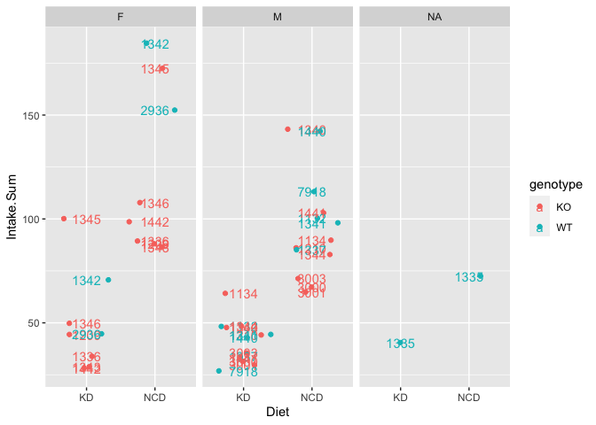

This script was most recently run on Thu Jul 29 12:58:35 2021 and can be found in /Users/davebrid/Documents/GitHub/TissueSpecificTscKnockouts/Mouse Data/Ketogenic Diets.

# Purpose

To determine food intake levels of wild-type and GDF15 knockout mice.

# Experimental Details

Mice were kept on NCD to 10 weeks then transfered to KD for three weeks

# Raw Data


The raw data can be found in GDF15-KO experiment - Food Intake.csv in the folder /Users/davebrid/Documents/GitHub/TissueSpecificTscKnockouts/Mouse Data/Ketogenic Diets.  This script was most recently updated on Thu Jul 29 12:58:36 2021.

# Analysis

<!-- --><!-- -->

```
## # A tibble: 8 x 8
##    cage genotype sex   Exp.Week `food intake (total g)` Cage.Number Intake Diet 
##   <dbl> <chr>    <chr>    <dbl>                   <dbl>       <dbl>  <dbl> <chr>
## 1  1340 KO       M        -3                      142.            2  71.0  NCD  
## 2  1340 KO       M        -2                       71.5           2  35.8  NCD  
## 3  1340 KO       M        -1                       72.8           2  36.4  NCD  
## 4  1340 KO       M         0                       28.8           2  14.4  KD   
## 5  1340 KO       M         1.29                    23.1           2  11.6  KD   
## 6  1340 KO       M         2                       18.5           2   9.25 KD   
## 7  1340 KO       M         3                       25.1           2  12.6  KD   
## 8  1340 KO       M         4                       25.7           2  12.8  KD
```

<!-- -->

# Interpretation

There was a sex-specific reduction in fasting blood glucose, but no significant difference in glucose levels during the insulin tolerance test

# Session Information


```
## R version 4.1.0 (2021-05-18)
## Platform: x86_64-apple-darwin17.0 (64-bit)
## Running under: macOS Big Sur 10.16
## 
## Matrix products: default
## BLAS:   /Library/Frameworks/R.framework/Versions/4.1/Resources/lib/libRblas.dylib
## LAPACK: /Library/Frameworks/R.framework/Versions/4.1/Resources/lib/libRlapack.dylib
## 
## locale:
## [1] en_US.UTF-8/en_US.UTF-8/en_US.UTF-8/C/en_US.UTF-8/en_US.UTF-8
## 
## attached base packages:
## [1] stats     graphics  grDevices utils     datasets  methods   base     
## 
## other attached packages:
## [1] ggplot2_3.3.3    lubridate_1.7.10 readr_1.4.0      dplyr_1.0.6     
## [5] tidyr_1.1.3      knitr_1.33      
## 
## loaded via a namespace (and not attached):
##  [1] Rcpp_1.0.6        highr_0.9         pillar_1.6.1      bslib_0.2.5.1    
##  [5] compiler_4.1.0    jquerylib_0.1.4   tools_4.1.0       digest_0.6.27    
##  [9] gtable_0.3.0      jsonlite_1.7.2    evaluate_0.14     lifecycle_1.0.0  
## [13] tibble_3.1.2      pkgconfig_2.0.3   rlang_0.4.11      DBI_1.1.1        
## [17] cli_2.5.0         rstudioapi_0.13   yaml_2.2.1        xfun_0.23        
## [21] withr_2.4.2       stringr_1.4.0     generics_0.1.0    vctrs_0.3.8      
## [25] sass_0.4.0        hms_1.1.0         grid_4.1.0        tidyselect_1.1.1 
## [29] glue_1.4.2        R6_2.5.0          fansi_0.5.0       rmarkdown_2.8    
## [33] farver_2.1.0      purrr_0.3.4       magrittr_2.0.1    scales_1.1.1     
## [37] ellipsis_0.3.2    htmltools_0.5.1.1 assertthat_0.2.1  colorspace_2.0-1 
## [41] labeling_0.4.2    utf8_1.2.1        stringi_1.6.2     munsell_0.5.0    
## [45] crayon_1.4.1
```
