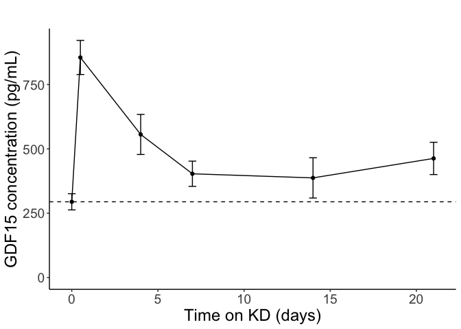

# Data Entry

```r
#Enters results from Dilution Factor = 5
my.assays.GDF15.data <- read_csv("GDF15 Time Course ELISA 1.csv",
                           col_types = cols(
                            Sample = col_character(),
                            Dilution = col_double(),
                             Well = col_factor(levels = NULL),
                            raw = col_double(),
                            Conc. = col_double()
                           ))
                   
mapping.data <-read_csv("GDF15 Time Course ELISA Mapping 1.csv",
                        col_types = cols(
                          well =	col_factor(levels = NULL),
                          ID = col_factor(levels = NULL),
                          diet	= col_factor(levels = NULL),
                          time	= col_double(),
                          study = col_factor(levels = NULL)
                        ))

full.data <- merge(mapping.data, my.assays.GDF15.data, by = "Well")%>%
  select(ID, Well, study, time, diet, study, Conc.,Raw)
non.ID<-c("blank", "pos.control")
```


# Analysis


```r
#make dataset for time course study
time.course.data<-full.data%>%
  filter(study == "time.course")%>%
  group_by(time)%>%
  summarize(average.GDF15 = mean(Conc.),
            error.GDF15 = se(Conc.),
            shapiro.GDF15 = shapiro.test(Conc.)$p.value)

time.course.data %>% filter(time=='0') %>% pull(average.GDF15) -> baseline.gdf15

#Plot of time course study- averaged
ggplot(time.course.data, aes(time, average.GDF15))+
  geom_point(col = "dodgerblue")+
  geom_errorbar(aes(ymin = average.GDF15 - error.GDF15, ymax = average.GDF15 + error.GDF15), col = "dodgerblue")+
  geom_line(col = "dodgerblue")+
  labs(title = "GDF15 in Ketogenic Diets", y= "GDF15 concentration (pg/mL)", x = "Time (days)")+
  expand_limits(x = 0, y = 0)+
  geom_hline(yintercept=baseline.gdf15, linetype = "dotdash")
```

<!-- -->

```r
ggplot(time.course.data %>% filter(!(time %in% c(1,2))),
       aes(time, average.GDF15))+
  geom_point()+
  geom_errorbar(aes(ymin = average.GDF15 - error.GDF15, 
                    ymax = average.GDF15 + error.GDF15))+
  geom_line()+
  labs(title = "", y= "GDF15 concentration (pg/mL)", x = "Time on KD (days)")+
  expand_limits(x = 0, y = 0)+
  geom_hline(yintercept=baseline.gdf15, lty = 2) +
  theme_classic() +
  theme(text=element_text(size=18))
```

<!-- -->

```r
# time course study-Individual plots
time.course.ID.data<-full.data%>%
  filter(study=="time.course")
ggplot(time.course.ID.data, aes(time, `Conc.`, col = ID))+
  geom_point(aes(col = ID))+
  #geom_errorbar(aes(ymin = average.GDF15 - error.GDF15, ymax = average.GDF15 + error.GDF15), col = "dodgerblue")+
  geom_line(aes(col = ID))+
  labs(title = "GDF15 in Ketogenic Diets", y= "GDF15 concentration (pg/mL)", x = "Time (days)")
```

<!-- -->

## Statistics


```r
gdf15.stats <-
  full.data%>%
  filter(study == "time.course") %>%
  group_by(time) %>%
  summarize(T.Test=t.test(Conc., mu=baseline.gdf15)$p.value,
            Wilcox.Test = wilcox.test(Conc., mu=baseline.gdf15)$p.value)

time.course.data %>%
  full_join(gdf15.stats) %>%
  mutate(Fold.Change=average.GDF15/baseline.gdf15) %>%
  kable(caption="Summary statistics for GDF15 time course")
```


Table: Summary statistics for GDF15 time course

| time| average.GDF15| error.GDF15| shapiro.GDF15| T.Test| Wilcox.Test| Fold.Change|
|----:|-------------:|-----------:|-------------:|------:|-----------:|-----------:|
|  0.0|           294|        31.5|         0.554|  1.000|       1.000|        1.00|
|  0.5|           855|        66.3|         0.715|  0.000|       0.031|        2.91|
|  1.0|           495|        52.1|         0.417|  0.018|       0.062|        1.68|
|  2.0|           376|        33.8|         0.465|  0.072|       0.125|        1.28|
|  4.0|           556|        77.9|         0.455|  0.028|       0.062|        1.89|
|  7.0|           403|        49.1|         0.803|  0.090|       0.125|        1.37|
| 14.0|           387|        78.4|         0.006|  0.301|       0.188|        1.32|
| 21.0|           463|        62.7|         0.231|  0.075|       0.125|        1.57|
