This script can be found in /Users/davebrid/Documents/GitHub/TissueSpecificTscKnockouts/Mouse Data/Ketogenic Diets and was most recently run on Mon Apr  6 15:01:03 2020.


# Data Entry


```r
raw_data_file <- "KD GDF15 Knockout Raw MRI Data.csv"


exp.data <- read_csv(raw_data_file, col_types = 
                       cols(
  age = col_double(),
  MouseID = col_factor(levels=NULL),
  Sex = col_factor(levels=NULL),
  values = col_double(),
  assay = col_factor(levels=NULL),
  Diet = col_factor(levels=NULL),
  experiment.date = col_date(format = "")
)) %>%
  arrange(experiment.date) %>%
  group_by(MouseID) 
```

This script pulled in a total of 1595 observations.  This includes the following number of animals in each treatment group.

# Enrolled Animals

This is for animals where wer have any body composition data.


```r
exp.data %>%
  group_by(Sex,Diet, Genotype) %>%
  distinct(animal.id, .keep_all = T) %>%
  count %>%
  kable(caption="Animals in each group of this cohort")
```


Table: Animals in each group of this cohort

Sex   Diet   Genotype     n
----  -----  ---------  ---
M     NA     -/-         10
M     NA     +/+          9
F     NA     -/-         14
F     NA     +/+          8

```r
exp.data %>%
  filter(age.weeks>=10) %>%
  group_by(Sex,Diet, Genotype) %>%
  distinct(animal.id, .keep_all = T) %>%
  count %>%
  kable(caption="Animals in each group of this cohort that have been put on KD")
```


Table: Animals in each group of this cohort that have been put on KD

Sex   Diet   Genotype     n
----  -----  ---------  ---
M     NA     -/-         10
M     NA     +/+          9
F     NA     -/-         14
F     NA     +/+          7

```r
exp.data %>%
  group_by(Sex,Diet, Genotype) %>%
  distinct(animal.id, .keep_all = T) %>%
  arrange(Sex,Diet,Genotype) %>%
  select(MouseID,Sex,Diet,Genotype) %>%
  kable(caption="Animals in each group of this cohort")
```


Table: Animals in each group of this cohort

MouseID   Sex   Diet   Genotype 
--------  ----  -----  ---------
8651      M     NA     -/-      
8652      M     NA     -/-      
8653      M     NA     -/-      
8661      M     NA     -/-      
8662      M     NA     -/-      
9153      M     NA     -/-      
9156      M     NA     -/-      
9185      M     NA     -/-      
9337      M     NA     -/-      
9400      M     NA     -/-      
8905      M     NA     +/+      
8903      M     NA     +/+      
8904      M     NA     +/+      
8901      M     NA     +/+      
9154      M     NA     +/+      
9184      M     NA     +/+      
9329      M     NA     +/+      
9401      M     NA     +/+      
9402      M     NA     +/+      
8655      F     NA     -/-      
8656      F     NA     -/-      
8659      F     NA     -/-      
8907      F     NA     -/-      
8908      F     NA     -/-      
9159      F     NA     -/-      
9186      F     NA     -/-      
9189      F     NA     -/-      
9190      F     NA     -/-      
9191      F     NA     -/-      
9336      F     NA     -/-      
9403      F     NA     -/-      
9404      F     NA     -/-      
9405      F     NA     -/-      
8654      F     NA     +/+      
8902      F     NA     +/+      
8906      F     NA     +/+      
8981      F     NA     +/+      
9158      F     NA     +/+      
9160      F     NA     +/+      
9188      F     NA     +/+      
9335      F     NA     +/+      

# Body Weight


```r
library(ggplot2)

exp.data %>%
  filter(assay=='Body Weight') %>%
  ggplot(aes(y=Mass,x=age.weeks,lty=Genotype)) + #add col=Diet once diets are assessed
  geom_point() +
  facet_grid(.~Sex) +
  stat_smooth() +
  labs(title="Body Weight",
       x="Age (Weeks)",
       y="Body Weight (g)")
```

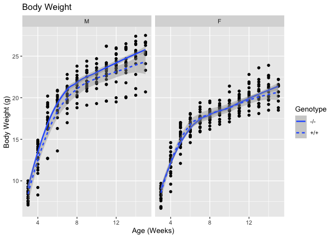


```r
exp.data %>%
  filter(assay=='Body Weight') %>%
  ggplot(aes(y=Mass,x=age.weeks,group=animal.id,lty=Genotype)) + #add col=Diet once diets are assessed
  geom_line() +
  geom_point() +
  facet_grid(.~Sex) +
  labs(title="Body Weight",
       subtitle="Individual Trajectories",
       x="Age (Weeks)",
       y="Body Weight (g)") 
```

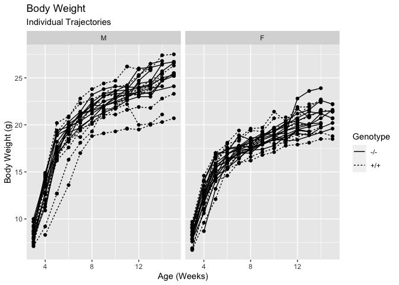


```r
exp.data %>%
  filter(assay=='Body Weight') %>%
  group_by(Diet,Sex,Genotype,age.weeks) %>%
  summarize(Average = mean(Mass),
            SE = se(Mass)) %>%
  ggplot(aes(y=Average,
             ymin=Average-SE,
             ymax=Average+SE,
             x=age.weeks,lty=Genotype)) + #add col=Diet once diets are assessed
  geom_errorbar(width=0.5) +
  geom_line() +
    facet_grid(.~Sex) +
  labs(title="Body Weight",
       x="Age (Weeks)",
       y="Body Weight (g)")
```

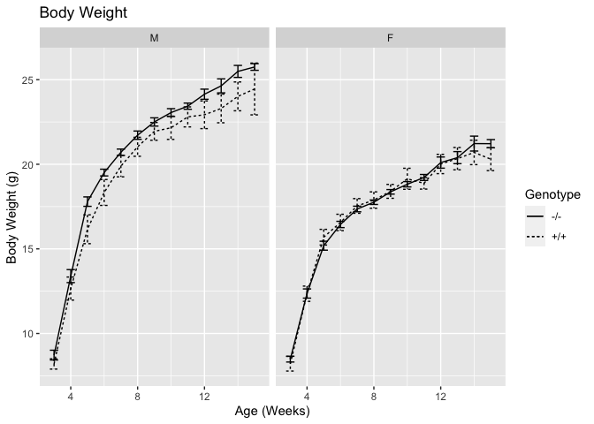

```r
exp.data %>%
  filter(assay=='Body Weight') %>%
  group_by(Diet,Sex,Genotype,age.weeks) %>%
  summarize(Average = mean(Mass),
            SE = se(Mass)) %>%
  ggplot(aes(y=Average,
             ymin=Average-SE,
             ymax=Average+SE,
             x=age.weeks,lty=Genotype)) + #add col=Diet once diets are assessed
  geom_errorbar(width=0.5) +
  geom_line() +
    facet_grid(.~Sex) +
  labs(title="",
       x="Age (Weeks)",
       y="Body Weight (g)") +
  geom_vline(xintercept=10,lty=2) +
  theme_classic() +
  theme(text=element_text(size=18),
        legend.position = c(0.75,0.25))
```

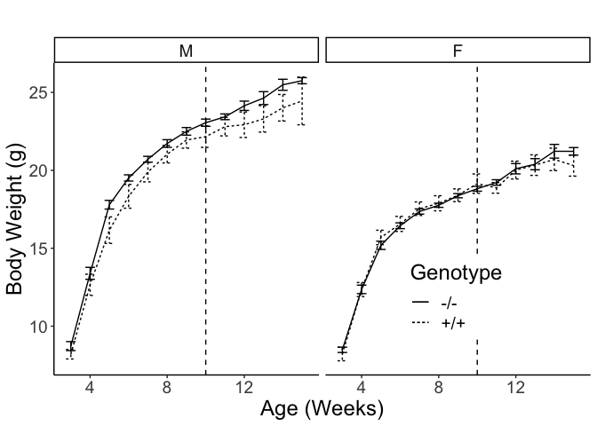

# Lean Mass


```r
exp.data %>%
  filter(assay=='Lean Mass') %>%
  ggplot(aes(y=Mass,x=age.weeks,lty=Genotype)) + #add col=Diet once diets are assessed
  geom_point() +
  facet_grid(.~Sex) +
  stat_smooth() +
  labs(title="Lean Mass",
       x="Age (Weeks)",
       y="Lean Mass (g)")
```

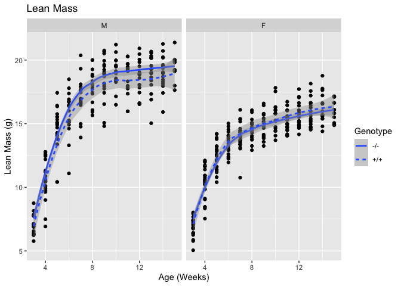


```r
exp.data %>%
  filter(assay=='Lean Mass') %>%
  group_by(Diet,Sex,Genotype,age.weeks) %>%
  summarize(Average = mean(Mass),
            SE = se(Mass)) %>%
  ggplot(aes(y=Average,
             ymin=Average-SE,
             ymax=Average+SE,
             x=age.weeks,lty=Genotype)) + #add col=Diet once diets are assessed
  geom_errorbar(width=0.5) +
  geom_line() +
    facet_grid(.~Sex) +
  labs(title="Lean Mass",
       x="Age (Weeks)",
       y="Lean Mass (g)") 
```

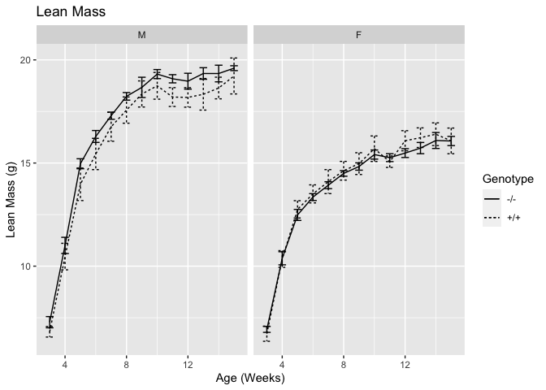

```r
exp.data %>%
  filter(assay=='Lean Mass') %>%
  group_by(Diet,Sex,Genotype,age.weeks) %>%
  summarize(Average = mean(Mass),
            SE = se(Mass)) %>%
  ggplot(aes(y=Average,
             ymin=Average-SE,
             ymax=Average+SE,
             x=age.weeks,lty=Genotype)) + #add col=Diet once diets are assessed
  geom_errorbar(width=0.5) +
  geom_line() +
    facet_grid(.~Sex) +
  labs(title="",
       x="Age (Weeks)",
       y="Lean Mass (g)") +
  geom_vline(xintercept=10,lty=2) +
  theme_classic() +
  theme(text=element_text(size=18),
        legend.position = c(0.75,0.25))
```

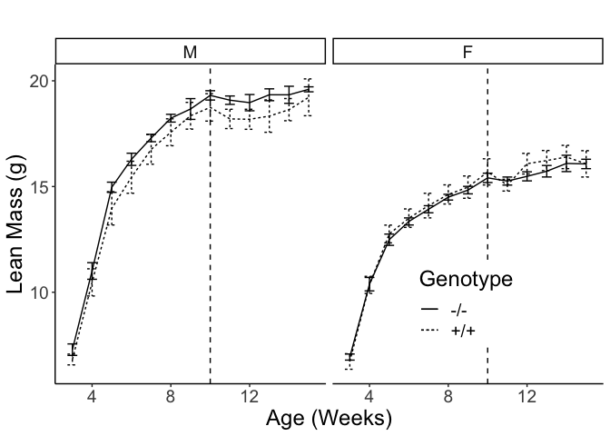

# Fat Mass


```r
exp.data %>%
  filter(assay=='Total Fat Mass') %>%
  ggplot(aes(y=Mass,x=age.weeks,lty=Genotype, shape=Genotype)) + #add col=Diet once diets are assessed
  geom_point() +
  facet_grid(.~Sex) +
  stat_smooth() +
  labs(title="Fat Mass",
       x="Age (Weeks)",
       y="Fat Mass (g)")
```

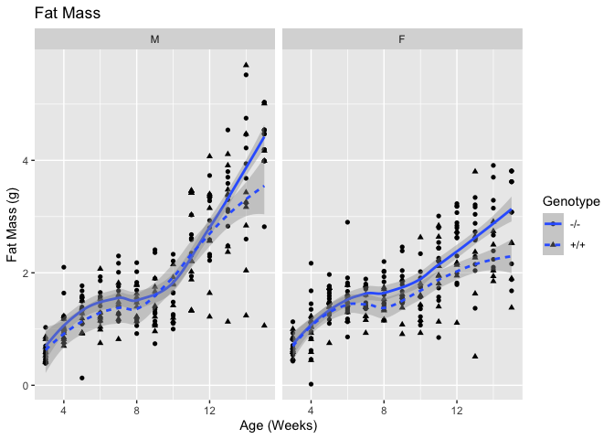

```r
exp.data %>%
  filter(assay=='Total Fat Mass') %>%
  ggplot(aes(y=Mass,x=age.weeks,lty=Genotype, group=animal.id)) + #add col=Diet once diets are assessed
  geom_line() +
  facet_grid(.~Sex) +
  stat_smooth() +
  labs(title="Fat Mass",
       x="Age (Weeks)",
       y="Fat Mass (g)")
```

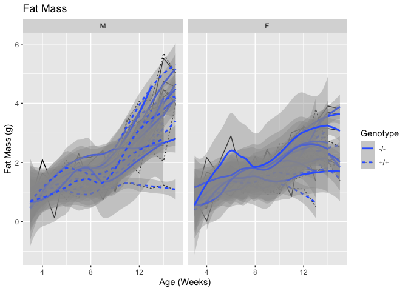


```r
exp.data %>%
  filter(assay=='Total Fat Mass') %>%
  group_by(Diet,Sex,Genotype,age.weeks) %>%
  summarize(Average = mean(Mass),
            SE = se(Mass)) %>%
  ggplot(aes(y=Average,
             ymin=Average-SE,
             ymax=Average+SE,
             x=age.weeks,lty=Genotype)) + #add col=Diet once diets are assessed
  geom_errorbar(width=0.5) +
  geom_line() +
    facet_grid(.~Sex) +
  labs(title="Fat Mass",
       x="Age (Weeks)",
       y="Fat Mass (g)") 
```

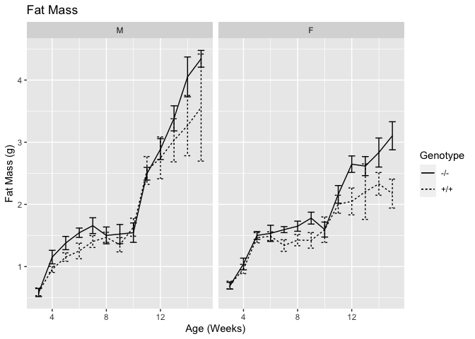

```r
exp.data %>%
  filter(assay=='Total Fat Mass') %>%
  group_by(Diet,Sex,Genotype,age.weeks) %>%
  summarize(Average = mean(Mass),
            SE = se(Mass)) %>%
  ggplot(aes(y=Average,
             ymin=Average-SE,
             ymax=Average+SE,
             x=age.weeks,lty=Genotype)) + #add col=Diet once diets are assessed
  geom_errorbar(width=0.5) +
  geom_line() +
    facet_grid(.~Sex) +
  labs(title="",
       x="Age (Weeks)",
       y="Fat Mass (g)") +
  geom_vline(xintercept=10, lty=2) +
  theme_classic() +
  theme(text = element_text(size=18),
        legend.position=c(0.15,0.75))
```

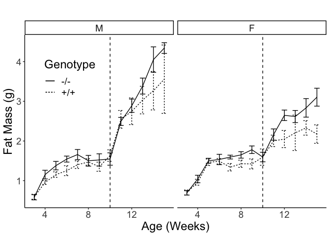

```r
exp.data %>%
  filter(assay=='Total Fat Mass'&Sex=="F") %>%
  group_by(Diet,Sex,Genotype,age.weeks) %>%
  summarize(Average = mean(Mass),
            SE = se(Mass)) %>%
  ggplot(aes(y=Average,
             ymin=Average-SE,
             ymax=Average+SE,
             x=age.weeks,lty=Genotype)) + #add col=Diet once diets are assessed
  geom_errorbar(width=0.5) +
  geom_line() +
  labs(title="Fat Mass",
       x="Age (Weeks)",
       y="Fat Mass (g)") +
  theme_classic() +
  theme(text = element_text(size=18),
        legend.position=c(0.15,0.75))
```

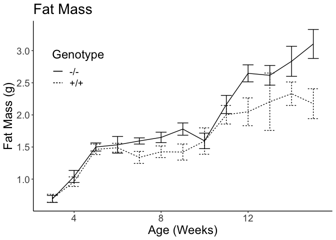

## Fat Mass Linear Models


```r
diet.data <-
  exp.data %>%
  filter(age.weeks>=10) %>%
  filter(assay=='Total Fat Mass') %>%
  mutate(Diet.Weeks = age.weeks-10)

library(lme4)
library(lmerTest)
male.fat.lm <- lmer(Mass ~ Genotype*Diet.Weeks + (1|animal.id), data = diet.data %>% filter(Sex=="M"), REML=F)
male.fat.lm.null <- lmer(Mass ~ Diet.Weeks + (1|animal.id), data = diet.data %>% filter(Sex=="M"), REML=F)
female.fat.lm <- lmer(Mass ~ Genotype*Diet.Weeks + (1|animal.id), data = diet.data %>% filter(Sex=="F"), REML=F)
female.fat.lm.null <- lmer(Mass ~ Diet.Weeks + (1|animal.id), data = diet.data %>% filter(Sex=="F"), REML=F)

coef(summary(male.fat.lm)) %>% kable(caption="Mixed linear models for fat mass changes on diet for males")
```


Table: Mixed linear models for fat mass changes on diet for males

                          Estimate   Std. Error     df   t value   Pr(>|t|)
-----------------------  ---------  -----------  -----  --------  ---------
(Intercept)                  1.702        0.215   30.2     7.899      0.000
Genotype+/+                  0.311        0.314   30.4     0.992      0.329
Diet.Weeks                   0.548        0.038   95.2    14.594      0.000
Genotype+/+:Diet.Weeks      -0.216        0.060   94.8    -3.583      0.001

```r
coef(summary(female.fat.lm))%>% kable(caption="Mixed linear models for fat mass changes on diet for females")
```


Table: Mixed linear models for fat mass changes on diet for females

                          Estimate   Std. Error      df   t value   Pr(>|t|)
-----------------------  ---------  -----------  ------  --------  ---------
(Intercept)                  1.939        0.142    41.6    13.671      0.000
Genotype+/+                 -0.148        0.236    36.7    -0.629      0.533
Diet.Weeks                   0.211        0.035   100.3     6.072      0.000
Genotype+/+:Diet.Weeks      -0.110        0.057    98.0    -1.909      0.059

```r
anova(male.fat.lm, male.fat.lm.null) %>% kable(caption="Chi-squared test between models with and without the genotype term and interaction for male mice")
```


Table: Chi-squared test between models with and without the genotype term and interaction for male mice

                    Df   AIC   BIC   logLik   deviance   Chisq   Chi Df   Pr(>Chisq)
-----------------  ---  ----  ----  -------  ---------  ------  -------  -----------
male.fat.lm.null     4   221   232     -107        213      NA       NA           NA
male.fat.lm          6   213   229     -100        201    12.5        2        0.002

```r
anova(female.fat.lm, female.fat.lm.null) %>% kable(caption="Chi-squared test between models with and without the genotype term and interaction for female mice")
```


Table: Chi-squared test between models with and without the genotype term and interaction for female mice

                      Df   AIC   BIC   logLik   deviance   Chisq   Chi Df   Pr(>Chisq)
-------------------  ---  ----  ----  -------  ---------  ------  -------  -----------
female.fat.lm.null     4   197   208    -94.5        189      NA       NA           NA
female.fat.lm          6   194   211    -91.0        182    6.95        2        0.031

### Summary of Fat Mass Accretion


```r
diet.data %>%
  filter(Diet.Weeks %in% c(0,5)) %>%
  select(animal.id,Sex,Genotype,Mass, Diet.Weeks) %>%
  pivot_wider(names_from=Diet.Weeks, 
              values_from = Mass, 
              id_cols=c(Sex,Genotype,animal.id), 
              values_fn = list(Mass = mean)) %>%
  rename(First=`0`,
         Last=`5`) %>%
  mutate(Change = Last-First) %>%
  mutate(Pct.Change = Change/First*100) %>%
  group_by(Sex,Genotype) %>%
  summarize_at(.vars=vars(Change,Pct.Change),
               .funs=list(~mean(.,na.rm=T),~se(.))) %>%
  kable(caption="Change in fat mass by sex and genotype")
```


Table: Change in fat mass by sex and genotype

Sex   Genotype    Change_mean   Pct.Change_mean   Change_se   Pct.Change_se
----  ---------  ------------  ----------------  ----------  --------------
M     -/-                2.66             203.3       0.394            37.9
M     +/+                2.04             133.1       0.562            41.1
F     -/-                1.34             100.4       0.257            19.7
F     +/+                0.49              55.7       0.389            38.9

### Modifying Effect of Sex on Fat Mass Changes


```r
sex.fat.lm <- lmer(Mass ~ Genotype*Diet.Weeks*Sex + (1|animal.id), data = diet.data, REML=F)
sex.fat.lm.null <- lmer(Mass ~ Genotype*Diet.Weeks + (1|animal.id), data = diet.data, REML=F)
sex.fat.lm.geno <- lmer(Mass ~ Diet.Weeks*Sex + (1|animal.id), data = diet.data, REML=F)

coef(summary(sex.fat.lm)) %>% kable(caption="Mixed linear models for fat mass changes on diet including interaction variable")
```


Table: Mixed linear models for fat mass changes on diet including interaction variable

                               Estimate   Std. Error      df   t value   Pr(>|t|)
----------------------------  ---------  -----------  ------  --------  ---------
(Intercept)                       1.705        0.191    67.8     8.937      0.000
Genotype+/+                       0.308        0.278    68.0     1.107      0.272
Diet.Weeks                        0.547        0.036   193.2    15.134      0.000
SexF                              0.244        0.252    69.8     0.966      0.337
Genotype+/+:Diet.Weeks           -0.215        0.058   192.2    -3.706      0.000
Genotype+/+:SexF                 -0.466        0.392    66.6    -1.187      0.239
Diet.Weeks:SexF                  -0.341        0.051   195.1    -6.653      0.000
Genotype+/+:Diet.Weeks:SexF       0.109        0.083   193.0     1.306      0.193

```r
anova(sex.fat.lm, sex.fat.lm.null) %>% kable(caption="Chi-squared test between full models with and without the inclusion of sex", digits=15)
```


Table: Chi-squared test between full models with and without the inclusion of sex

                   Df   AIC   BIC   logLik   deviance   Chisq   Chi Df   Pr(>Chisq)
----------------  ---  ----  ----  -------  ---------  ------  -------  -----------
sex.fat.lm.null     6   460   481     -224        448      NA       NA           NA
sex.fat.lm         10   406   440     -193        386    62.2        4        1e-12

```r
anova(sex.fat.lm, sex.fat.lm.geno) %>% kable(caption="Chi-squared test betweenn models with and without the genotype term, accounting for the modifying effects of sex", digits=5)
```


Table: Chi-squared test betweenn models with and without the genotype term, accounting for the modifying effects of sex

                   Df   AIC   BIC   logLik   deviance   Chisq   Chi Df   Pr(>Chisq)
----------------  ---  ----  ----  -------  ---------  ------  -------  -----------
sex.fat.lm.geno     6   417   438     -203        405      NA       NA           NA
sex.fat.lm         10   406   440     -193        386    19.3        4      0.00068

### Modifying Effect of Sex Independent of Genotype


```r
sex.fat.wt.lm <- lmer(Mass ~ Diet.Weeks*Sex + (1|animal.id), 
                   data = diet.data %>% filter(Genotype=='+/+'), REML=F)
sex.fat.wt.lm.null <- lmer(Mass ~ Diet.Weeks + (1|animal.id), 
                        data = diet.data %>% filter(Genotype=='+/+'), REML=F)


coef(summary(sex.fat.wt.lm)) %>% kable(caption="Mixed linear models for fat mass changes of wild-type mice on diet, including moderation by sex")
```


Table: Mixed linear models for fat mass changes of wild-type mice on diet, including moderation by sex

                   Estimate   Std. Error     df   t value   Pr(>|t|)
----------------  ---------  -----------  -----  --------  ---------
(Intercept)           2.013        0.242   24.7     8.323      0.000
Diet.Weeks            0.332        0.048   77.1     6.966      0.000
SexF                 -0.222        0.360   23.5    -0.615      0.545
Diet.Weeks:SexF      -0.233        0.069   77.1    -3.388      0.001

```r
anova(sex.fat.wt.lm, sex.fat.wt.lm.null) %>% kable(caption="Chi-squared test between wild-type models with and without the inclusion of sex")
```


Table: Chi-squared test between wild-type models with and without the inclusion of sex

                      Df   AIC   BIC   logLik   deviance   Chisq   Chi Df   Pr(>Chisq)
-------------------  ---  ----  ----  -------  ---------  ------  -------  -----------
sex.fat.wt.lm.null     4   192   202    -91.8        184      NA       NA           NA
sex.fat.wt.lm          6   181   196    -84.3        169    14.9        2        0.001
