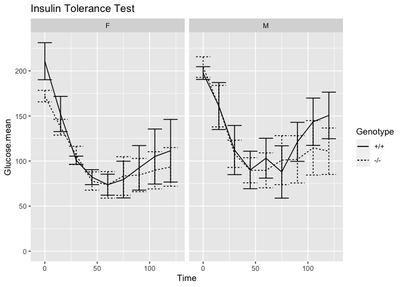
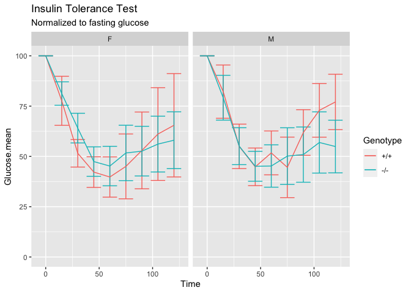

This script was most recently run on Wed Feb 12 11:39:10 2020 and can be found in /Users/davebrid/Documents/GitHub/TissueSpecificTscKnockouts/Mouse Data/Ketogenic Diets.

# Purpose

To determine insulin responsiveness of wild-type and GDF15 knockout mice.

# Experimental Details

These were all ITTs done around 2PM after a 6h fast.

# Raw Data

The raw data can be found in KD GDF15 Knockout Raw Glucose Data.csv in the folder /Users/davebrid/Documents/GitHub/TissueSpecificTscKnockouts/Mouse Data/Ketogenic Diets.  This script was most recently updated on Wed Feb 12 11:39:11 2020.

# Analysis

## Fasting Glucose Levels

### From a 6h Fast

### Fasting Glucose Stats

Table: 2x2 ANOVA with interaction between genotype and sex for fasting glucose

term            df   sumsq   meansq   statistic   p.value
-------------  ---  ------  -------  ----------  --------
Genotype         1    3045     3045        2.80     0.103
Sex              1    1460     1460        1.34     0.254
Genotype:Sex     1    4770     4770        4.39     0.043
Residuals       35   38027     1086          NA        NA

## Insulin Tolerance Test

### ITT Stats

Used mixed linear models to analyze ITT's

Table: Mixed linear models for effects on ITT

                     Sum Sq   Mean Sq   NumDF   DenDF   F value   Pr(>F)
----------------  ---------  --------  ------  ------  --------  -------
as.factor(Time)    415812.0   51976.5       8   292.1    32.374    0.000
Genotype               78.8      78.8       1    33.9     0.049    0.826
Sex                   779.2     779.2       1    33.9     0.485    0.491
Genotype:Sex          209.5     209.5       1    33.9     0.131    0.720

## Normalized ITT Data

<!-- -->

# Interpretation

# References

