This script can be found in /Users/davebrid/Documents/GitHub/TissueSpecificTscKnockouts/Mouse Data/Liver AMPK Ketogenic Diet/All Figures/Body Composition and was most recently run on Tue Jun  9 11:18:41 2020.

# Experimental Details

The notes about the design of this cohort can be found at

# Data Entry

This script pulled in a total of 1278 observations pulled from AMPK KD MRI Data.csv.  This includes the following number of animals in each treatment group.

Modified the genotypes based on the western blot data, this data filters out mice that we are not confident of their knockout status.

# Enrolled Animals

This is for animals where we have any body composition data.  This may include animals that did not make it to the end of the study.

Table: Animals in each group of this cohort

Sex   Diet             Injection     n
----  ---------------  ----------  ---
F     Control Diet     AAV-Cre      10
F     Control Diet     AAV-GFP      12
F     Ketogenic Diet   AAV-Cre       8
F     Ketogenic Diet   AAV-GFP       7
M     Control Diet     AAV-Cre      11
M     Control Diet     AAV-GFP      10
M     Ketogenic Diet   AAV-Cre       7
M     Ketogenic Diet   AAV-GFP       9

Table: Animals in each group of this cohort

 MouseID  Sex   Diet             Injection 
--------  ----  ---------------  ----------
    8195  F     Control Diet     AAV-Cre   
    8265  F     Control Diet     AAV-Cre   
    8266  F     Control Diet     AAV-Cre   
    8475  F     Control Diet     AAV-Cre   
    8476  F     Control Diet     AAV-Cre   
    8477  F     Control Diet     AAV-Cre   
    8563  F     Control Diet     AAV-Cre   
    8564  F     Control Diet     AAV-Cre   
    8565  F     Control Diet     AAV-Cre   
    8566  F     Control Diet     AAV-Cre   
    8347  F     Control Diet     AAV-GFP   
    8348  F     Control Diet     AAV-GFP   
    8349  F     Control Diet     AAV-GFP   
    8560  F     Control Diet     AAV-GFP   
    8561  F     Control Diet     AAV-GFP   
    8562  F     Control Diet     AAV-GFP   
    8788  F     Control Diet     AAV-GFP   
    8789  F     Control Diet     AAV-GFP   
    8790  F     Control Diet     AAV-GFP   
    8832  F     Control Diet     AAV-GFP   
    8833  F     Control Diet     AAV-GFP   
    8834  F     Control Diet     AAV-GFP   
    8286  F     Ketogenic Diet   AAV-Cre   
    8287  F     Ketogenic Diet   AAV-Cre   
    8288  F     Ketogenic Diet   AAV-Cre   
    8289  F     Ketogenic Diet   AAV-Cre   
    8290  F     Ketogenic Diet   AAV-Cre   
    8713  F     Ketogenic Diet   AAV-Cre   
    8714  F     Ketogenic Diet   AAV-Cre   
    8720  F     Ketogenic Diet   AAV-Cre   
    8151  F     Ketogenic Diet   AAV-GFP   
    8152  F     Ketogenic Diet   AAV-GFP   
    8153  F     Ketogenic Diet   AAV-GFP   
    8154  F     Ketogenic Diet   AAV-GFP   
    8827  F     Ketogenic Diet   AAV-GFP   
    8828  F     Ketogenic Diet   AAV-GFP   
    8829  F     Ketogenic Diet   AAV-GFP   
    8186  M     Control Diet     AAV-Cre   
    8191  M     Control Diet     AAV-Cre   
    8192  M     Control Diet     AAV-Cre   
    8193  M     Control Diet     AAV-Cre   
    8194  M     Control Diet     AAV-Cre   
    8556  M     Control Diet     AAV-Cre   
    8557  M     Control Diet     AAV-Cre   
    8558  M     Control Diet     AAV-Cre   
    8559  M     Control Diet     AAV-Cre   
    8785  M     Control Diet     AAV-Cre   
    8787  M     Control Diet     AAV-Cre   
    8148  M     Control Diet     AAV-GFP   
    8149  M     Control Diet     AAV-GFP   
    8263  M     Control Diet     AAV-GFP   
    8264  M     Control Diet     AAV-GFP   
    8457  M     Control Diet     AAV-GFP   
    8708  M     Control Diet     AAV-GFP   
    8710  M     Control Diet     AAV-GFP   
    8709  M     Control Diet     AAV-GFP   
    8711  M     Control Diet     AAV-GFP   
    8712  M     Control Diet     AAV-GFP   
    8285  M     Ketogenic Diet   AAV-Cre   
    8344  M     Ketogenic Diet   AAV-Cre   
    8345  M     Ketogenic Diet   AAV-Cre   
    8346  M     Ketogenic Diet   AAV-Cre   
    8825  M     Ketogenic Diet   AAV-Cre   
    8826  M     Ketogenic Diet   AAV-Cre   
    8831  M     Ketogenic Diet   AAV-Cre   
    8187  M     Ketogenic Diet   AAV-GFP   
    8188  M     Ketogenic Diet   AAV-GFP   
    8190  M     Ketogenic Diet   AAV-GFP   
    8473  M     Ketogenic Diet   AAV-GFP   
    8474  M     Ketogenic Diet   AAV-GFP   
    8821  M     Ketogenic Diet   AAV-GFP   
    8822  M     Ketogenic Diet   AAV-GFP   
    8823  M     Ketogenic Diet   AAV-GFP   
    8824  M     Ketogenic Diet   AAV-GFP   

# Body Weight

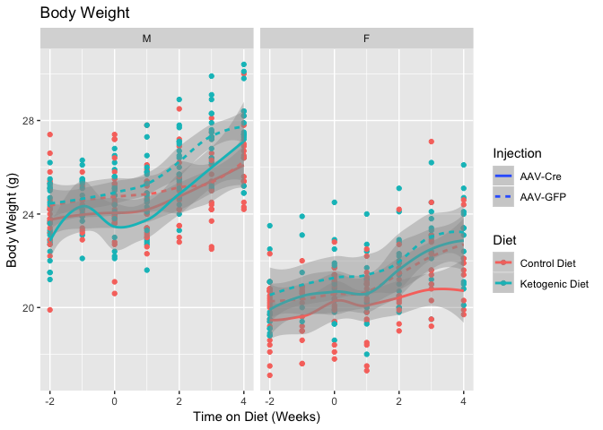

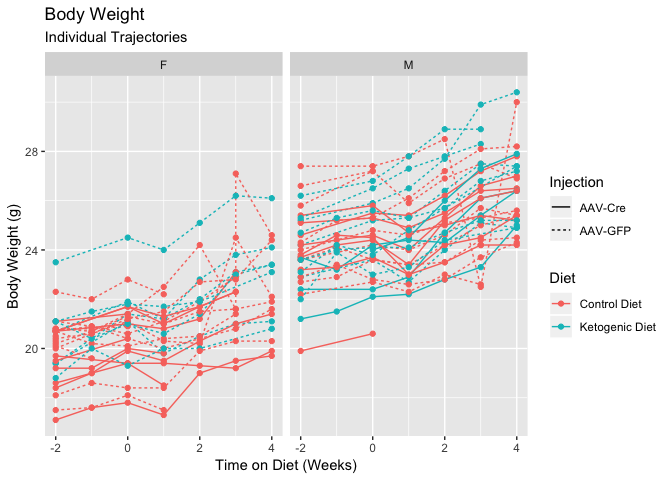

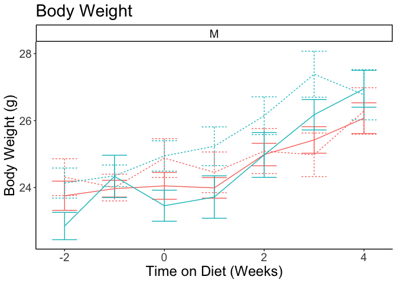

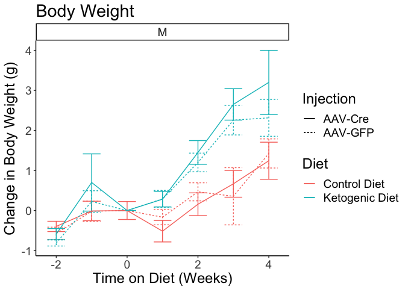

# Lean Mass

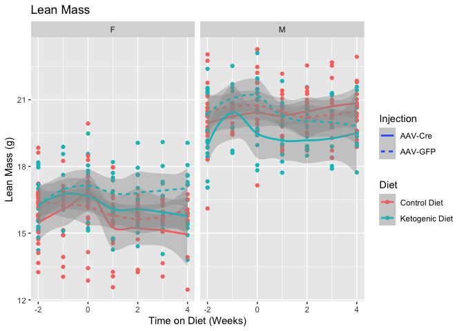

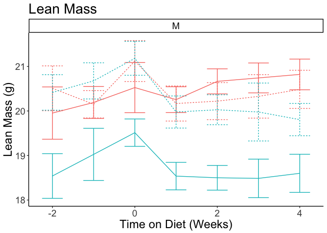

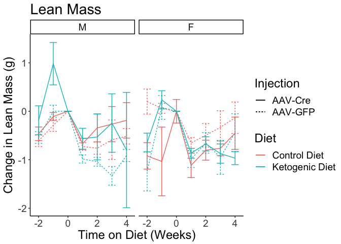

# Fat Mass

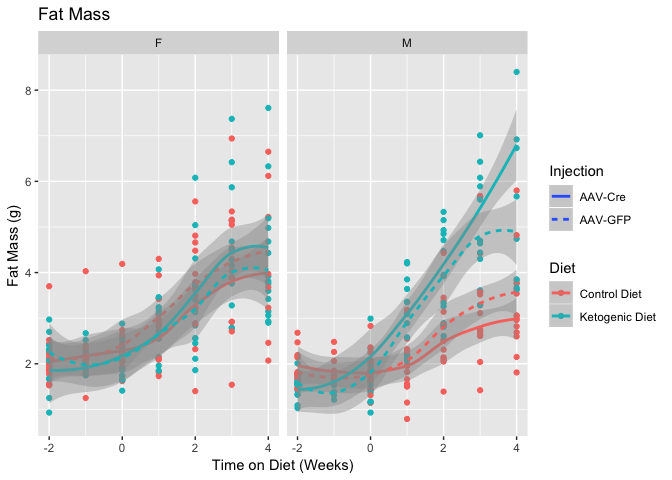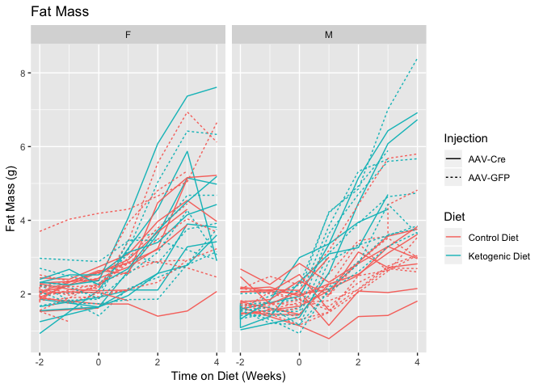

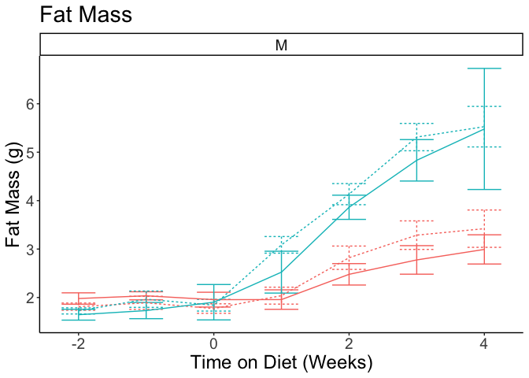

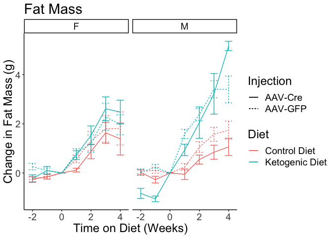
