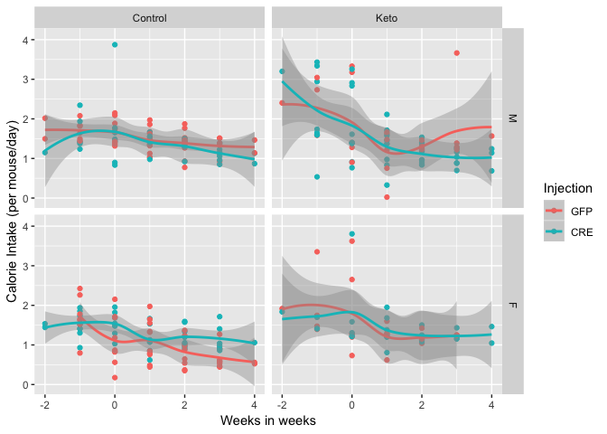
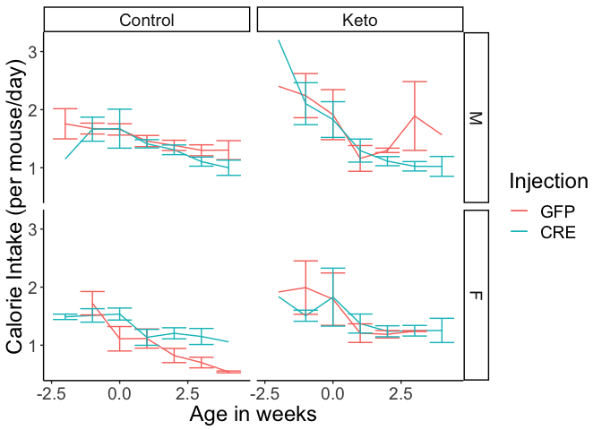
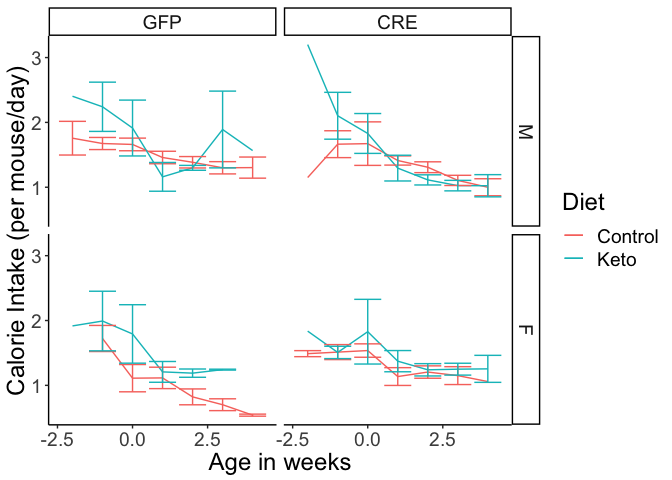

# Raw Data


These data can be found in **/Users/katherinekistler/Documents/GitHub/TissueSpecificTscKnockouts/Mouse Data/Liver AMPK Ketogenic Diet/All Figures/Food Intake** in a file named **AMPK KO Experiment - Food Intake.csv**, which was downloaded from https://docs.google.com/spreadsheets/d/e/2PACX-1vSth-DS9iN3peHkt9-C8vz2pNWKSw2Y_rSCNCLq-7DIbzMZ_8rjLITffQjLT3jw7lEUFfacXQeakkEB/pub?gid=97441873&single=true&output=csv.  These were mapped to cages using the file AMPK KO Experiment - Cage Mapping.csv downloaded from https://docs.google.com/spreadsheets/d/e/2PACX-1vSth-DS9iN3peHkt9-C8vz2pNWKSw2Y_rSCNCLq-7DIbzMZ_8rjLITffQjLT3jw7lEUFfacXQeakkEB/pub?gid=801187280&single=true&output=csv.  This script was most recently updated on **Thu May 28 10:45:20 2020**.


# Sample Size


Table: Number of cages in the study

Diet      Sex   Injection     n
--------  ----  ----------  ---
Control   M     GFP           4
Control   M     CRE           3
Control   F     GFP           4
Control   F     CRE           4
Keto      M     GFP           3
Keto      M     CRE           4
Keto      F     GFP           2
Keto      F     CRE           2

# Analysis





# Session Information


```r
sessionInfo()
```

```
## R version 3.5.1 (2018-07-02)
## Platform: x86_64-apple-darwin15.6.0 (64-bit)
## Running under: macOS High Sierra 10.13.6
## 
## Matrix products: default
## BLAS: /Library/Frameworks/R.framework/Versions/3.5/Resources/lib/libRblas.0.dylib
## LAPACK: /Library/Frameworks/R.framework/Versions/3.5/Resources/lib/libRlapack.dylib
## 
## locale:
## [1] en_US.UTF-8/en_US.UTF-8/en_US.UTF-8/C/en_US.UTF-8/en_US.UTF-8
## 
## attached base packages:
## [1] stats     graphics  grDevices utils     datasets  methods   base     
## 
## other attached packages:
## [1] ggplot2_3.1.0   lubridate_1.7.4 readr_1.3.1     dplyr_0.8.1    
## [5] tidyr_0.8.2     knitr_1.20     
## 
## loaded via a namespace (and not attached):
##  [1] Rcpp_1.0.1       magrittr_1.5     hms_0.4.2        munsell_0.5.0   
##  [5] tidyselect_0.2.5 colorspace_1.3-2 R6_2.4.0         rlang_0.3.4     
##  [9] plyr_1.8.4       highr_0.7        stringr_1.3.1    tools_3.5.1     
## [13] grid_3.5.1       gtable_0.2.0     withr_2.1.2      htmltools_0.3.6 
## [17] lazyeval_0.2.1   yaml_2.2.0       rprojroot_1.3-2  digest_0.6.16   
## [21] assertthat_0.2.1 tibble_2.1.3     crayon_1.3.4     reshape2_1.4.3  
## [25] purrr_0.2.5      glue_1.3.1       evaluate_0.11    rmarkdown_1.10  
## [29] labeling_0.3     stringi_1.2.4    compiler_3.5.1   pillar_1.4.1    
## [33] scales_1.0.0     backports_1.1.2  pkgconfig_2.0.2
```
