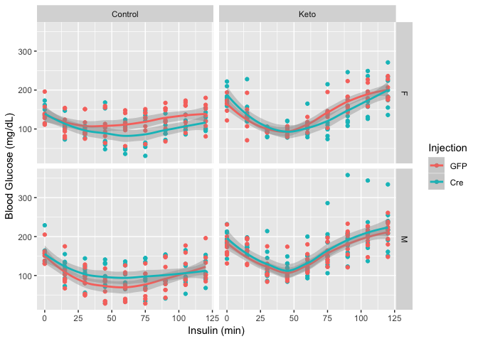
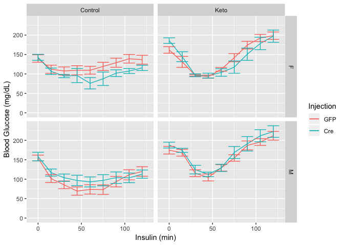
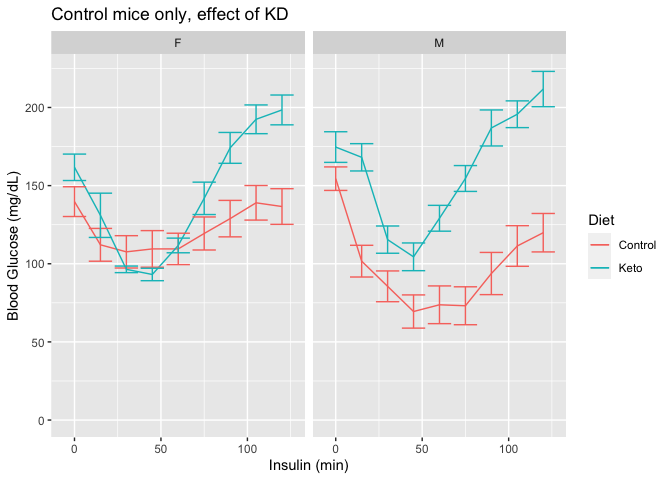
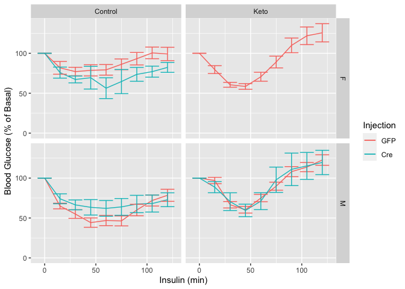
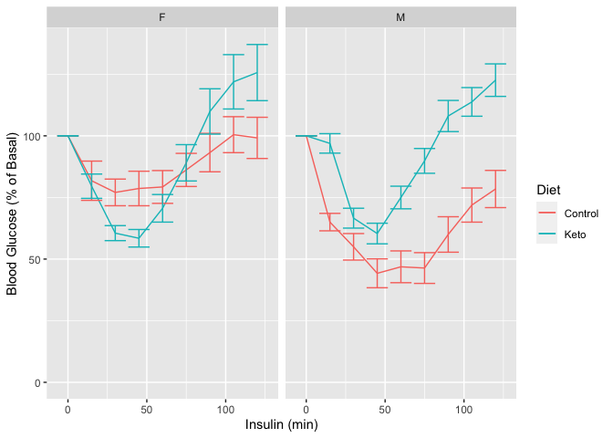
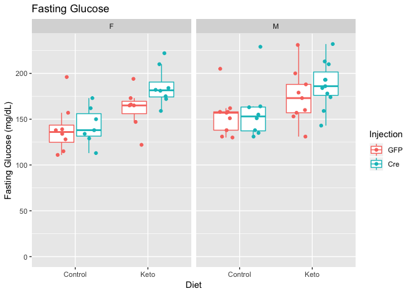
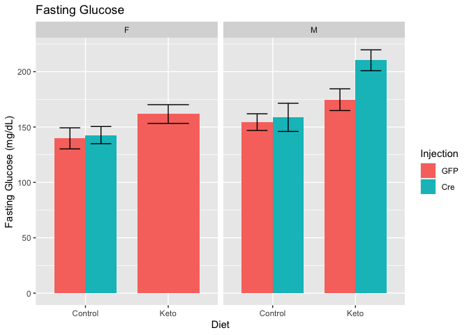
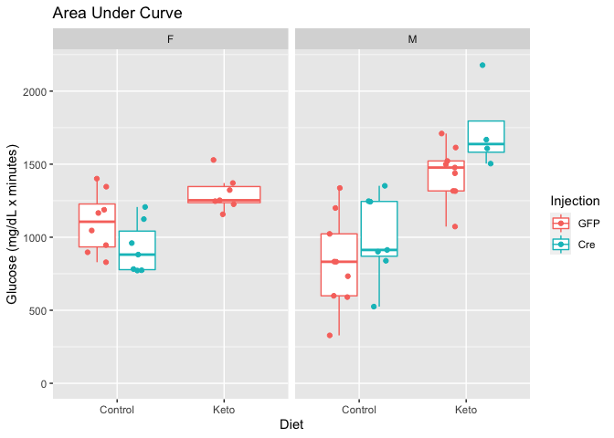
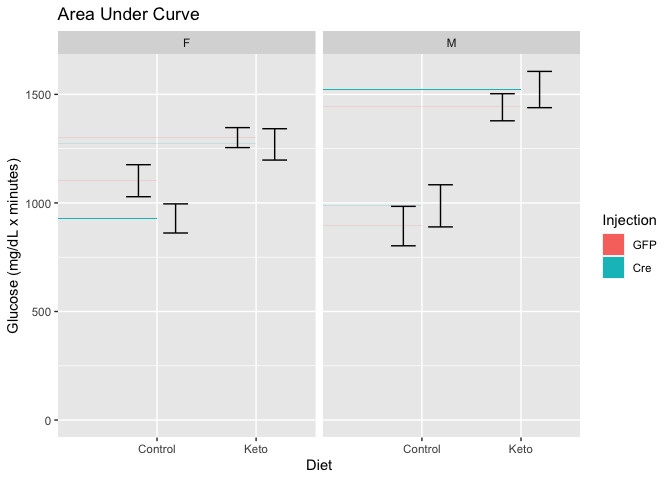

# Purpose

# Experimental Details

Injected 0.75 mU/g of lean body mass to animals fasted for 6h after 2 weeks of KD/CD (or four weeks after the injection)

# Raw Data


```r
library(readxl) #loads the readr package

data.filename <- 'ITT 19-06-19.xlsx' #make this a separate line, you can use any variable you want
not.ko <- scan('../Non-Knockout Mice.txt')
exp.data <- read_excel(data.filename) %>% filter(!(Mouse %in% not.ko)) #removed mice that are not ko

mapping.filename <- 'mapping.csv'
#this loads whatever the file is into a dataframe called exp.data if it exists
exp.data <- read_excel(data.filename, sheet='Sheet2') %>%
  select(Group:`120`) %>%
  filter(!(Group %in% c("Average","SE",NA))) %>% # removed calculated averages and errors
  separate(Group,
           into=c("Sex","Diet","Injection"), # broke group down into sex, diet and injection 
           sep=" ") %>%
  tibble::rowid_to_column("ID") %>% #index an ID column
  mutate(ID = as.factor(ID)) %>%
  mutate(Injection = relevel(as.factor(Injection), ref="GFP")) %>%
  filter(!(Mouse %in% not.ko)) # removes mice that are not knockouts, but should have been

data.long <-
  exp.data %>%
  group_by(Sex,Diet,Injection) %>%
  gather(key=Time,value=Glucose, -Sex, -Diet, -Injection, -ID,-Mouse) %>%
  mutate(Time = as.integer(Time),
         Glucose = as.integer(Glucose))

summary.data <-
  data.long %>%
  group_by(Sex,Diet,Injection, Time) %>%
  mutate(Mouse = as.factor(Mouse)) %>%
  summarize_if(is.numeric, .funs=funs(mean=mean(., na.rm = TRUE),
                                      se=se))
```

These data can be found in **/Users/davebrid/Documents/GitHub/TissueSpecificTscKnockouts/Mouse Data/Liver AMPK Ketogenic Diet/All Figures/ITT** in a file named **ITT 19-06-19.xlsx** and **mapping.csv**.  This script was most recently updated on **Tue Nov  3 14:22:24 2020**.

# Number of Mice


```r
exp.data %>%
  group_by(Sex,Diet,Injection) %>%
  distinct(ID, .keep_all = T) %>%
  count %>%
  kable(caption="Animals in each group of this cohort")
```


Table: Animals in each group of this cohort

|Sex |Diet    |Injection |  n|
|:---|:-------|:---------|--:|
|F   |Control |GFP       |  8|
|F   |Control |Cre       |  7|
|F   |Keto    |GFP       |  7|
|M   |Control |GFP       |  9|
|M   |Control |Cre       |  7|
|M   |Keto    |GFP       |  9|
|M   |Keto    |Cre       |  4|

# Analysis


```r
library(ggplot2)

ggplot(data.long, aes(y=Glucose,
                      x=Time,
                      col=Injection)) +
  geom_point() +
  geom_smooth() +
  facet_grid(Sex~Diet) +
  labs(y="Blood Glucose (mg/dL)",
       x="Insulin (min)")
```




```r
data.long %>%
  group_by(Sex,Diet,Injection,Time) %>%
  summarize(Mean = mean(Glucose,na.rm=T),
            Error = se(Glucose)) %>%
  ggplot(aes(y=Mean,
             x=Time,
             col=Injection)) +
  geom_line() +
  geom_errorbar(aes(ymin=Mean-Error,
             ymax=Mean+Error)) +
  expand_limits(y=0) +
  facet_grid(Sex~Diet) +
  labs(y="Blood Glucose (mg/dL)",
       x="Insulin (min)")
```




```r
data.long %>%
  filter(Sex=="M") %>%
  group_by(Sex,Diet,Injection,Time) %>%
  summarize(Mean = mean(Glucose,na.rm=T),
            Error = se(Glucose)) %>%
  ggplot(aes(y=Mean,
             x=Time,
             ymin=Mean-Error,
             ymax=Mean+Error,
             col=Injection)) +
  geom_line() +
  geom_errorbar() +
  expand_limits(y=0) +
  scale_color_brewer(palette = "Set2",
                     name="", 
                     labels=c("AAV-Tbg-GFP",
                              "AAV-Tbg-Cre")) +
  facet_grid(~Diet) +
  labs(y="Blood Glucose (mg/dL)",
       x="Insulin (min)",
       title="Hepatic AMPK Knockout Mice") +
  theme_classic() +
  theme(
    text = element_text(size=24),
    legend.position = c(0.25,0.85),
    legend.key = element_blank(),
    legend.background = element_blank())
```


```r
data.long %>%
  filter(Injection=="GFP") %>%
  group_by(Sex,Diet,Time) %>%
  summarize(Mean = mean(Glucose,na.rm=T),
            Error = se(Glucose)) %>%
  ggplot(aes(y=Mean,
             x=Time,
             ymin=Mean-Error,
             ymax=Mean+Error,
             col=Diet)) +
  geom_line() +
  geom_errorbar() +
  expand_limits(y=0) +
  facet_grid(~Sex) +
  labs(y="Blood Glucose (mg/dL)",
       x="Insulin (min)",
       title="Control mice only, effect of KD")
```



### ITT Statistics


```r
library(lme4)
library(broom)
library(lmerTest)
itt.lme <- lmer(Glucose~as.factor(Time)+Diet+Sex+Injection+(1|ID), data=data.long)
itt.lme.null <- lmer(Glucose~as.factor(Time)+Diet+Sex+(1|ID), data=data.long)

summary(itt.lme)
```

```
## Linear mixed model fit by REML. t-tests use Satterthwaite's method [
## lmerModLmerTest]
## Formula: Glucose ~ as.factor(Time) + Diet + Sex + Injection + (1 | ID)
##    Data: data.long
## 
## REML criterion at convergence: 4323
## 
## Scaled residuals: 
##    Min     1Q Median     3Q    Max 
## -3.407 -0.704 -0.005  0.600  4.157 
## 
## Random effects:
##  Groups   Name        Variance Std.Dev.
##  ID       (Intercept) 653      25.5    
##  Residual             734      27.1    
## Number of obs: 454, groups:  ID, 51
## 
## Fixed effects:
##                    Estimate Std. Error     df t value Pr(>|t|)    
## (Intercept)          133.61       7.96  73.07   16.78  < 2e-16 ***
## as.factor(Time)15    -31.80       5.36 395.14   -5.93  6.6e-09 ***
## as.factor(Time)30    -55.51       5.36 395.14  -10.35  < 2e-16 ***
## as.factor(Time)45    -62.88       5.36 395.14  -11.72  < 2e-16 ***
## as.factor(Time)60    -56.58       5.40 395.50  -10.48  < 2e-16 ***
## as.factor(Time)75    -39.70       5.40 395.50   -7.36  1.1e-12 ***
## as.factor(Time)90    -19.40       5.40 395.50   -3.59  0.00037 ***
## as.factor(Time)105    -9.46       5.40 395.50   -1.75  0.08049 .  
## as.factor(Time)120    -1.82       5.40 395.50   -0.34  0.73669    
## DietKeto              54.77       8.15  47.20    6.72  2.1e-08 ***
## SexM                   2.67       7.78  47.16    0.34  0.73344    
## InjectionCre           9.79       8.27  47.15    1.18  0.24237    
## ---
## Signif. codes:  0 '***' 0.001 '**' 0.01 '*' 0.05 '.' 0.1 ' ' 1
## 
## Correlation of Fixed Effects:
##             (Intr) a.(T)15 a.(T)3 a.(T)4 a.(T)6 a.(T)7 a.(T)9 a.(T)10 a.(T)12
## as.fct(T)15 -0.337                                                           
## as.fct(T)30 -0.337  0.500                                                    
## as.fct(T)45 -0.337  0.500   0.500                                            
## as.fct(T)60 -0.334  0.497   0.497  0.497                                     
## as.fct(T)75 -0.334  0.497   0.497  0.497  0.496                              
## as.fct(T)90 -0.334  0.497   0.497  0.497  0.496  0.496                       
## as.fc(T)105 -0.334  0.497   0.497  0.497  0.496  0.496  0.496                
## as.fc(T)120 -0.334  0.497   0.497  0.497  0.496  0.496  0.496  0.496         
## DietKeto    -0.414  0.000   0.000  0.000 -0.004 -0.004 -0.004 -0.004  -0.004 
## SexM        -0.455  0.000   0.000  0.000  0.003  0.003  0.003  0.003   0.003 
## InjectionCr -0.417  0.000   0.000  0.000 -0.003 -0.003 -0.003 -0.003  -0.003 
##             DietKt SexM  
## as.fct(T)15              
## as.fct(T)30              
## as.fct(T)45              
## as.fct(T)60              
## as.fct(T)75              
## as.fct(T)90              
## as.fc(T)105              
## as.fc(T)120              
## DietKeto                 
## SexM        -0.156       
## InjectionCr  0.271 -0.104
```

```r
anova(itt.lme) %>% 
  tidy %>% 
  kable(caption="Type III Analysis of Variance Table with Satterthwaite's method for ITT mixed linear model.")
```


Table: Type III Analysis of Variance Table with Satterthwaite's method for ITT mixed linear model.

|term            |    sumsq|  meansq| NumDF| DenDF| statistic| p.value|
|:---------------|--------:|-------:|-----:|-----:|---------:|-------:|
|as.factor(Time) | 240382.2| 30047.8|     8| 395.3|    40.953|   0.000|
|Diet            |  33119.4| 33119.4|     1|  47.2|    45.140|   0.000|
|Sex             |     86.1|    86.1|     1|  47.2|     0.117|   0.733|
|Injection       |   1028.4|  1028.4|     1|  47.2|     1.402|   0.242|

```r
anova(itt.lme,itt.lme.null) %>% 
  tidy %>%
  kable(caption="Chi-squared test for effects of AAV injection on ITT.")
```


Table: Chi-squared test for effects of AAV injection on ITT.

|term         | npar|  AIC|  BIC| logLik| deviance| statistic| df| p.value|
|:------------|----:|----:|----:|------:|--------:|---------:|--:|-------:|
|itt.lme.null |   13| 4411| 4464|  -2192|     4385|        NA| NA|      NA|
|itt.lme      |   14| 4411| 4469|  -2192|     4383|       1.5|  1|   0.221|

## Normalized ITT


```r
data.long.norm <-
  data.long %>%
  group_by(ID) %>%
  mutate(Glucose.norm = Glucose/Glucose[Time==0]*100)

data.long.norm %>%
  group_by(Sex,Diet,Injection,Time) %>%
  summarize(Mean = mean(Glucose.norm,na.rm=T),
            Error = se(Glucose.norm)) %>%
  ggplot(aes(y=Mean,
             x=Time,
             ymin=Mean-Error,
             ymax=Mean+Error,
             col=Injection)) +
  geom_line() +
  geom_errorbar() +
  expand_limits(y=0) +
  facet_grid(Sex~Diet) +
  labs(y="Blood Glucose (% of Basal)",
       x="Insulin (min)")
```




```r
data.long.norm %>%
  filter(Injection=="GFP") %>%
  group_by(Sex,Diet,Injection,Time) %>%
  summarize(Mean = mean(Glucose.norm,na.rm=T),
            Error = se(Glucose.norm)) %>%
  ggplot(aes(y=Mean,
             x=Time,
             ymin=Mean-Error,
             ymax=Mean+Error,
             col=Diet)) +
  geom_line() +
  geom_errorbar() +
  expand_limits(y=0) +
  facet_grid(~Sex) +
  labs(y="Blood Glucose (% of Basal)",
       x="Insulin (min)")
```



## Fasting Glucose


```r
ggplot(data.long.norm %>% filter(Time==0),
       aes(y=Glucose,x=Diet,
           col=Injection)) +
  geom_boxplot(outlier.shape = NA) +
  geom_point(position = position_jitterdodge()) +
  expand_limits(y=0) +
  facet_grid(.~Sex) +
  labs(y="Fasting Glucose (mg/dL)",
       title="Fasting Glucose")
```




```r
data.long %>% 
  filter(Time==0) %>%
  group_by(Injection,Sex,Diet) %>%
  summarize(Mean = mean(Glucose,na.rm=T),
            Error = se(Glucose)) %>%
  ggplot(aes(y=Mean,
             x=Diet,
             fill=Injection)) +
  geom_bar(stat='identity', position='dodge', width=0.75) +
  geom_errorbar(position=position_dodge(width=0.75),aes(group=Injection,
                                                        ymin=Mean-Error,
                                                        ymax=Mean+Error), width=0.5) +
  expand_limits(y=0) +
  facet_grid(.~Sex) +
  labs(y="Fasting Glucose (mg/dL)",
       title="Fasting Glucose")
```



### Fasting Glucose Statistics


```r
lm(Glucose ~ Diet + Sex + Injection, data = data.long %>% filter(Time==0)) %>%
  tidy %>%
  kable(caption="Linear model for effects on fasting glucose levels.")
```


Table: Linear model for effects on fasting glucose levels.

|term         | estimate| std.error| statistic| p.value|
|:------------|--------:|---------:|---------:|-------:|
|(Intercept)  |    134.4|      6.81|     19.74|   0.000|
|DietKeto     |     29.1|      7.79|      3.74|   0.000|
|SexM         |     17.2|      7.43|      2.31|   0.025|
|InjectionCre |     12.5|      7.90|      1.58|   0.120|

## Area Under the Curve


```r
data.long %>%
  group_by(ID, Diet, Sex, Injection) %>%
  summarize(AUC = sum(Glucose,na.rm=T)) %>%
ggplot(aes(y=AUC,x=Diet,
           col=Injection)) +
  geom_boxplot(outlier.shape = NA) +
  geom_point(position = position_jitterdodge()) +
  expand_limits(y=0) +
  facet_grid(.~Sex) +
  labs(y="Glucose (mg/dL x minutes)",
       title="Area Under Curve")
```




```r
data.long %>%
  group_by(ID, Diet, Sex, Injection) %>%
  summarize(AUC = sum(Glucose)) %>%
    group_by(Diet, Sex, Injection) %>%
  summarize(Mean = mean(AUC,na.rm=T),
            Error = se(AUC)) %>%
  ggplot(aes(y=Mean,
             x=Diet,
             fill=Injection)) +
  geom_bar(stat='identity', position='dodge', width=0.75) +
  geom_errorbar(position=position_dodge(width=0.75),aes(group=Injection,
                                                        ymin=Mean-Error,
                                                        ymax=Mean+Error), width=0.5) +
  expand_limits(y=0) +
  facet_grid(.~Sex) +
  labs(y="Glucose (mg/dL x minutes)",
       title="Area Under Curve")
```



### AUC Statistics


```r
lm(AUC ~ Diet + Sex + Injection, 
   data = data.long %>% 
     group_by(ID, Diet, Sex, Injection) %>%
     summarize(AUC = sum(Glucose))) %>% 
  tidy %>%
  kable(caption="Linear model for effects on ITT area under curve.")
```


Table: Linear model for effects on ITT area under curve.

|term         | estimate| std.error| statistic| p.value|
|:------------|--------:|---------:|---------:|-------:|
|(Intercept)  |    929.7|      64.9|    14.324|   0.000|
|DietKeto     |    485.8|      74.8|     6.497|   0.000|
|SexM         |     30.2|      71.2|     0.425|   0.673|
|InjectionCre |     81.5|      75.7|     1.077|   0.287|

# Interpretation

A brief summary of what the interpretation of these results were

# Session Information


```r
sessionInfo()
```

```
## R version 4.0.2 (2020-06-22)
## Platform: x86_64-apple-darwin17.0 (64-bit)
## Running under: macOS Catalina 10.15.7
## 
## Matrix products: default
## BLAS:   /Library/Frameworks/R.framework/Versions/4.0/Resources/lib/libRblas.dylib
## LAPACK: /Library/Frameworks/R.framework/Versions/4.0/Resources/lib/libRlapack.dylib
## 
## locale:
## [1] en_US.UTF-8/en_US.UTF-8/en_US.UTF-8/C/en_US.UTF-8/en_US.UTF-8
## 
## attached base packages:
## [1] stats     graphics  grDevices utils     datasets  methods   base     
## 
## other attached packages:
## [1] lmerTest_3.1-2 broom_0.7.0    lme4_1.1-23    Matrix_1.2-18  ggplot2_3.3.2 
## [6] readxl_1.3.1   dplyr_1.0.2    tidyr_1.1.2    knitr_1.29    
## 
## loaded via a namespace (and not attached):
##  [1] Rcpp_1.0.5          nloptr_1.2.2.2      RColorBrewer_1.1-2 
##  [4] cellranger_1.1.0    pillar_1.4.6        compiler_4.0.2     
##  [7] highr_0.8           tools_4.0.2         boot_1.3-25        
## [10] statmod_1.4.34      digest_0.6.25       evaluate_0.14      
## [13] lifecycle_0.2.0     tibble_3.0.3        gtable_0.3.0       
## [16] nlme_3.1-149        lattice_0.20-41     mgcv_1.8-31        
## [19] pkgconfig_2.0.3     rlang_0.4.7         yaml_2.2.1         
## [22] xfun_0.16           withr_2.2.0         stringr_1.4.0      
## [25] generics_0.0.2      vctrs_0.3.4         grid_4.0.2         
## [28] tidyselect_1.1.0    glue_1.4.2          R6_2.4.1           
## [31] rmarkdown_2.3       minqa_1.2.4         farver_2.0.3       
## [34] purrr_0.3.4         magrittr_1.5        backports_1.1.9    
## [37] MASS_7.3-52         scales_1.1.1        ellipsis_0.3.1     
## [40] htmltools_0.5.0     splines_4.0.2       colorspace_1.4-1   
## [43] numDeriv_2016.8-1.1 labeling_0.3        stringi_1.4.6      
## [46] munsell_0.5.0       crayon_1.3.4
```

