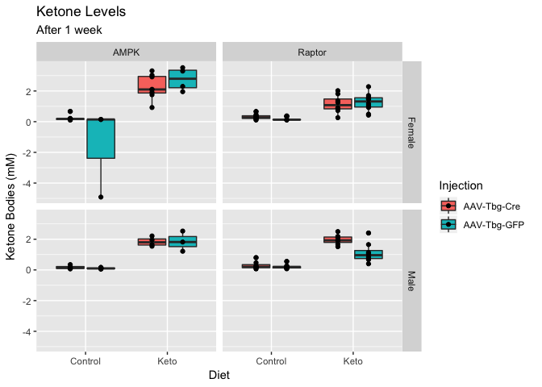
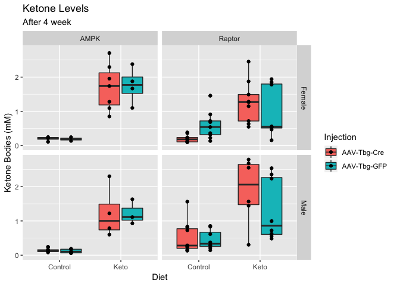
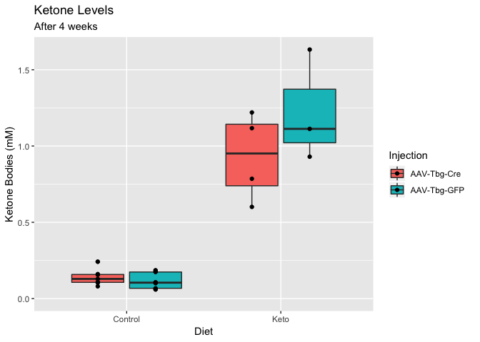
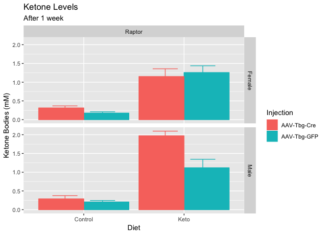
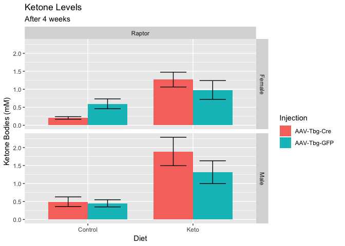

# Purpose

# Experimental Details

Link to the protocol used (permalink preferred) for the experiment and include any notes relevant to your analysis.  This might include specifics not in the general protocol such as cell lines, treatment doses etc.

# Raw Data

Describe your raw data files, including what the columns mean (and what units they are in).


These data can be found in **/Users/katherinekistler/Documents/GitHub/TissueSpecificTscKnockouts/Mouse Data/Liver AMPK Ketogenic Diet/All Figures/Ketone Assay** in a file named **2019-07-18 BHB Assay.xlsx**.  This script was most recently updated on **Mon Jun 22 11:01:32 2020**.

# Analysis


Table: Animals in each group of this cohort

 Week  Sex      Diet      Injection       n
-----  -------  --------  ------------  ---
    1  Female   Control   AAV-Tbg-Cre    17
    1  Female   Control   AAV-Tbg-GFP    11
    1  Female   Keto      AAV-Tbg-Cre    16
    1  Female   Keto      AAV-Tbg-GFP    14
    1  Male     Control   AAV-Tbg-Cre    12
    1  Male     Control   AAV-Tbg-GFP    18
    1  Male     Keto      AAV-Tbg-Cre    11
    1  Male     Keto      AAV-Tbg-GFP    11
    4  Female   Control   AAV-Tbg-Cre    13
    4  Female   Control   AAV-Tbg-GFP    11
    4  Female   Keto      AAV-Tbg-Cre    17
    4  Female   Keto      AAV-Tbg-GFP    12
    4  Male     Control   AAV-Tbg-Cre    18
    4  Male     Control   AAV-Tbg-GFP    17
    4  Male     Keto      AAV-Tbg-Cre    10
    4  Male     Keto      AAV-Tbg-GFP    11

## Boxplots






## Barplots





Table: Effects of diet/sex on  ketone levels in Rptor liver knockouts.  Includes interaction between diet and genotype

term               df    sumsq   meansq   statistic   p.value
---------------  ----  -------  -------  ----------  --------
Sex                 1    0.612    0.612        2.30     0.132
Diet                1   35.018   35.018      131.71     0.000
Injection           1    0.896    0.896        3.37     0.069
Diet:Injection      1    1.176    1.176        4.42     0.037
Residuals         134   35.628    0.266          NA        NA


Table: Effects of diet/sex on  ketone levels in Rptor liver knockouts.  No interaction between diet and genotype

term          df    sumsq   meansq   statistic   p.value
----------  ----  -------  -------  ----------  --------
Sex            1    0.612    0.612        2.25     0.136
Diet           1   35.018   35.018      128.45     0.000
Injection      1    0.896    0.896        3.29     0.072
Residuals    135   36.804    0.273          NA        NA


Table: Effects of diet/sex on  ketone levels in AMPK liver knockouts.  Includes interaction between diet and genotype

term              df    sumsq   meansq   statistic   p.value
---------------  ---  -------  -------  ----------  --------
Sex                1   13.552   13.552      55.699     0.000
Diet               1   48.050   48.050     197.490     0.000
Injection          1    0.230    0.230       0.943     0.334
Diet:Injection     1    0.083    0.083       0.341     0.561
Residuals         77   18.734    0.243          NA        NA


Table: Effects of diet/sex on  ketone levels in AMPK liver knockouts.  No interaction between diet and genotype

term         df   sumsq   meansq   statistic   p.value
----------  ---  ------  -------  ----------  --------
Sex           1   13.55   13.552      56.173     0.000
Diet          1   48.05   48.050     199.172     0.000
Injection     1    0.23    0.230       0.951     0.332
Residuals    78   18.82    0.241          NA        NA


Table: Summary of average ketone levels

Sex    Genotype   Injection     Diet        Mean   Error
-----  ---------  ------------  --------  ------  ------
Male   AMPK       AAV-Tbg-GFP   Control    0.116   0.017
Male   AMPK       AAV-Tbg-GFP   Keto       1.225   0.210
Male   AMPK       AAV-Tbg-Cre   Control    0.140   0.020
Male   AMPK       AAV-Tbg-Cre   Keto       0.931   0.144

# Interpretation

A brief summary of what the interpretation of these results were

# Session Information


```r
sessionInfo()
```

```
## R version 3.5.1 (2018-07-02)
## Platform: x86_64-apple-darwin15.6.0 (64-bit)
## Running under: macOS High Sierra 10.13.6
## 
## Matrix products: default
## BLAS: /Library/Frameworks/R.framework/Versions/3.5/Resources/lib/libRblas.0.dylib
## LAPACK: /Library/Frameworks/R.framework/Versions/3.5/Resources/lib/libRlapack.dylib
## 
## locale:
## [1] en_US.UTF-8/en_US.UTF-8/en_US.UTF-8/C/en_US.UTF-8/en_US.UTF-8
## 
## attached base packages:
## [1] stats     graphics  grDevices utils     datasets  methods   base     
## 
## other attached packages:
## [1] broom_0.5.2   ggplot2_3.1.0 forcats_0.4.0 readxl_1.3.1  dplyr_0.8.1  
## [6] tidyr_0.8.2   knitr_1.20   
## 
## loaded via a namespace (and not attached):
##  [1] Rcpp_1.0.1       pillar_1.4.1     compiler_3.5.1   cellranger_1.1.0
##  [5] highr_0.7        plyr_1.8.4       tools_3.5.1      digest_0.6.16   
##  [9] lattice_0.20-35  nlme_3.1-137     evaluate_0.11    tibble_2.1.3    
## [13] gtable_0.2.0     pkgconfig_2.0.2  rlang_0.3.4      cli_1.0.0       
## [17] yaml_2.2.0       withr_2.1.2      stringr_1.3.1    generics_0.0.2  
## [21] rprojroot_1.3-2  grid_3.5.1       tidyselect_0.2.5 glue_1.3.1      
## [25] R6_2.4.0         rmarkdown_1.10   purrr_0.2.5      reshape2_1.4.3  
## [29] magrittr_1.5     backports_1.1.2  scales_1.0.0     htmltools_0.3.6 
## [33] assertthat_0.2.1 colorspace_1.3-2 labeling_0.3     stringi_1.2.4   
## [37] lazyeval_0.2.1   munsell_0.5.0    crayon_1.3.4
```

