# Purpose

# Experimental Details

Animals were sacrificed at approximately 2PM in the fed state

# Raw Data

Data are downloaded from a google doc and saved in this folder.


These data can be found in **/Users/katherinekistler/Documents/GitHub/TissueSpecificTscKnockouts/Mouse Data/Liver AMPK Ketogenic Diet/All Figures/Sacrifice Data** in a file named **Sacrifice Data.csv**, which was downloaded from a google sheet found at https://docs.google.com/spreadsheets/d/e/2PACX-1vSth-DS9iN3peHkt9-C8vz2pNWKSw2Y_rSCNCLq-7DIbzMZ_8rjLITffQjLT3jw7lEUFfacXQeakkEB/pub?gid=158703896&single=true&output=csv.  This script was most recently updated on **Thu May 28 11:04:15 2020**.

# Analysis

# Sacrificed Animals

This is for animals where we have any sacrifice data.


Table: Animals in each group of this cohort

Sex   Diet      Injection     n
----  --------  ----------  ---
F     Control   Cre           7
F     Control   GFP           8
F     Keto      Cre           8
F     Keto      GFP           7
M     Control   Cre           7
M     Control   GFP          10
M     Keto      Cre           6
M     Keto      GFP          14

## Serum Levels

Serum was collected via retro-orbital bleed in the fed state.  Both glucose and ketone body levels were assessed by stick assays.

### Fed Blood Glucose

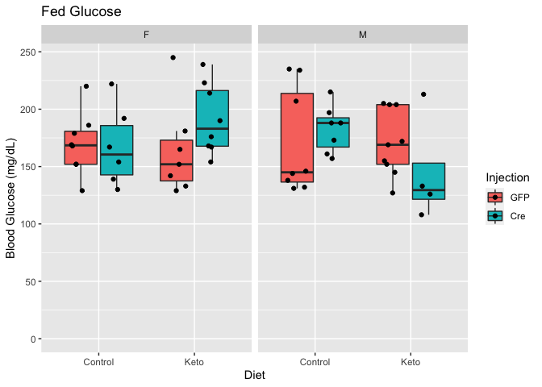


Table: Fed glucose levels

term            estimate   std.error   statistic   p.value
-------------  ---------  ----------  ----------  --------
(Intercept)       176.93        8.97      19.731     0.000
SexM               -1.96        8.70      -0.226     0.822
DietKeto           -3.12        8.61      -0.362     0.718
InjectionGFP       -3.15        8.77      -0.359     0.720

### Fed Ketone Bodies

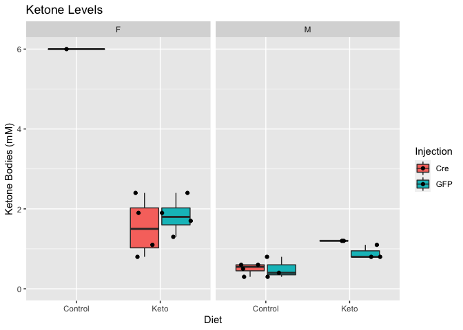

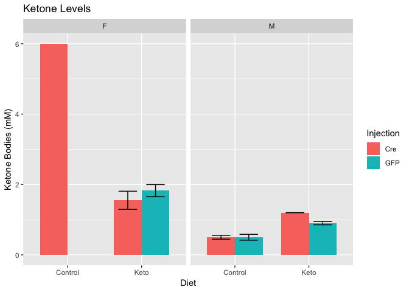


Table: Inguinal adipose tissue weights

term            estimate   std.error   statistic   p.value
-------------  ---------  ----------  ----------  --------
(Intercept)        2.748       0.598       4.593     0.000
SexM              -1.707       0.531      -3.214     0.005
DietKeto          -0.564       0.547      -1.031     0.317
InjectionGFP      -0.179       0.467      -0.383     0.707

## Fat Pad Weights

### Inguinal Adipose Tissue

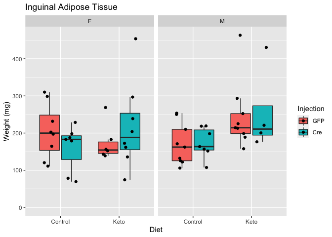

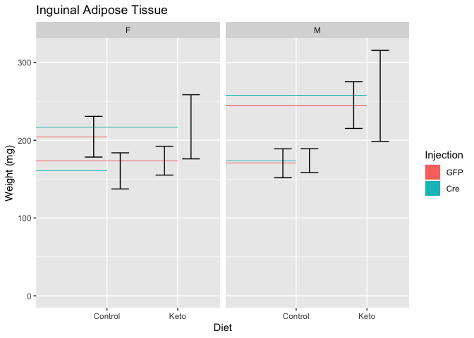


Table: Inguinal adipose tissue weights

term            estimate   std.error   statistic   p.value
-------------  ---------  ----------  ----------  --------
(Intercept)       175.49        19.4       9.036     0.000
SexM               10.38        19.5       0.533     0.596
DietKeto           39.65        19.1       2.078     0.042
InjectionGFP       -7.46        19.5      -0.382     0.704

### Gonadal Adipose Tissue

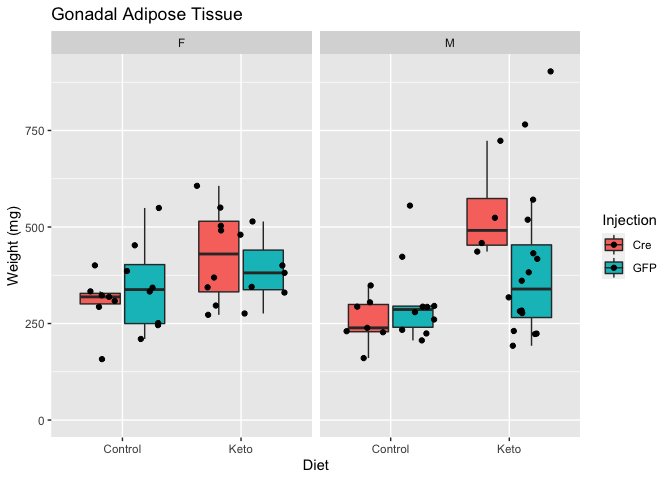

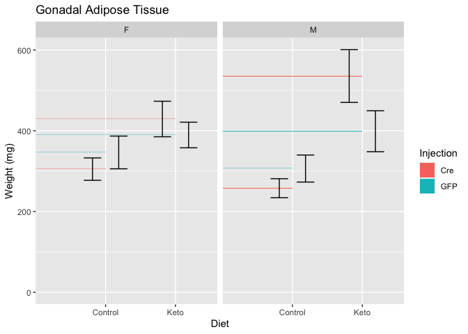


Table: Gonadal adipose tissue weights

term            estimate   std.error   statistic   p.value
-------------  ---------  ----------  ----------  --------
(Intercept)       327.40        33.8       9.673     0.000
SexM               -6.75        33.5      -0.201     0.841
DietKeto          115.56        33.0       3.500     0.001
InjectionGFP      -32.63        33.8      -0.966     0.338


## Muscle Weights

### Gastrocnemius

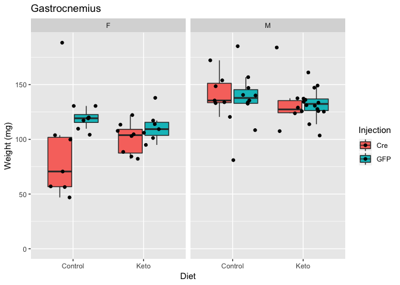

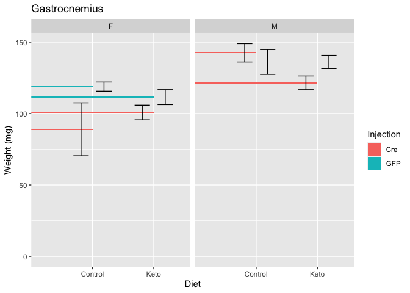


Table: Inguinal adipose tissue weights

term            estimate   std.error   statistic   p.value
-------------  ---------  ----------  ----------  --------
(Intercept)       103.25        5.96      17.319     0.000
SexM               29.48        5.90       4.994     0.000
DietKeto           -2.89        5.82      -0.496     0.621
InjectionGFP        7.05        5.95       1.185     0.241

### Quadriceps

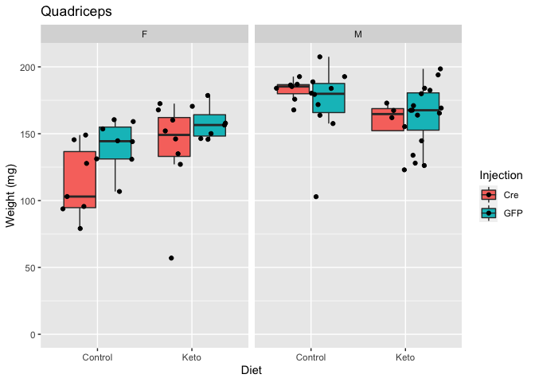

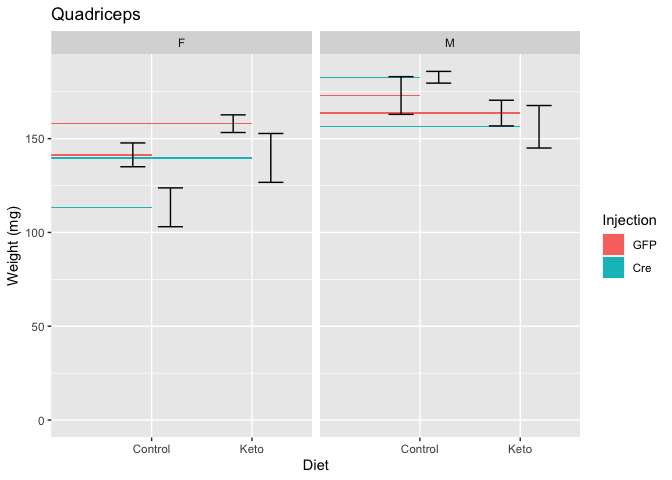


Table: Quadricep weights

term            estimate   std.error   statistic   p.value
-------------  ---------  ----------  ----------  --------
(Intercept)      132.817        6.45      20.581     0.000
SexM              29.509        6.39       4.618     0.000
DietKeto           0.886        6.29       0.141     0.888
InjectionGFP      10.034        6.44       1.557     0.124


# Session Information


```r
sessionInfo()
```

```
## R version 3.5.1 (2018-07-02)
## Platform: x86_64-apple-darwin15.6.0 (64-bit)
## Running under: macOS High Sierra 10.13.6
## 
## Matrix products: default
## BLAS: /Library/Frameworks/R.framework/Versions/3.5/Resources/lib/libRblas.0.dylib
## LAPACK: /Library/Frameworks/R.framework/Versions/3.5/Resources/lib/libRlapack.dylib
## 
## locale:
## [1] en_US.UTF-8/en_US.UTF-8/en_US.UTF-8/C/en_US.UTF-8/en_US.UTF-8
## 
## attached base packages:
## [1] stats     graphics  grDevices utils     datasets  methods   base     
## 
## other attached packages:
## [1] broom_0.5.2     ggplot2_3.1.0   forcats_0.4.0   lubridate_1.7.4
## [5] readr_1.3.1     dplyr_0.8.1     tidyr_0.8.2     knitr_1.20     
## 
## loaded via a namespace (and not attached):
##  [1] Rcpp_1.0.1       pillar_1.4.1     compiler_3.5.1   highr_0.7       
##  [5] plyr_1.8.4       tools_3.5.1      digest_0.6.16    lattice_0.20-35 
##  [9] nlme_3.1-137     evaluate_0.11    tibble_2.1.3     gtable_0.2.0    
## [13] pkgconfig_2.0.2  rlang_0.3.4      yaml_2.2.0       withr_2.1.2     
## [17] stringr_1.3.1    generics_0.0.2   hms_0.4.2        rprojroot_1.3-2 
## [21] grid_3.5.1       tidyselect_0.2.5 glue_1.3.1       R6_2.4.0        
## [25] rmarkdown_1.10   purrr_0.2.5      reshape2_1.4.3   magrittr_1.5    
## [29] backports_1.1.2  scales_1.0.0     htmltools_0.3.6  assertthat_0.2.1
## [33] colorspace_1.3-2 labeling_0.3     stringi_1.2.4    lazyeval_0.2.1  
## [37] munsell_0.5.0    crayon_1.3.4
```
