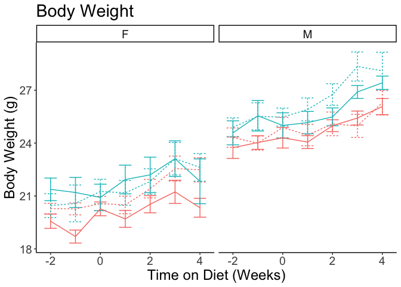
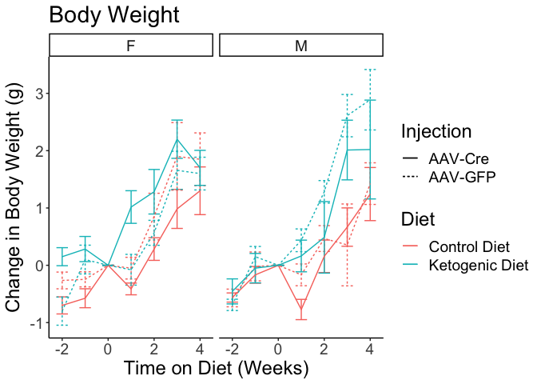
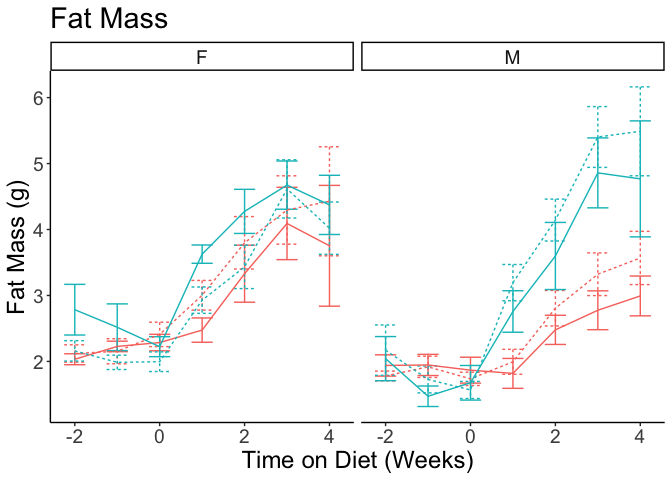

This script can be found in /Users/davebrid/Documents/GitHub/TissueSpecificTscKnockouts/Mouse Data/Liver AMPK Ketogenic Diet/Body Composition and was most recently run on Tue Apr 13 16:54:28 2021.

# Experimental Details

The notes about the design of this cohort can be found at

# Data Entry

This script pulled in a total of 1344 observations pulled from AMPK KD MRI Data.csv.  This includes the following number of animals in each treatment group.

Modified the genotypes based on the western blot data, this data filters out mice that we are not confident of their knockout status.

# Enrolled Animals

This is for animals where we have any body composition data.  This may include animals that did not make it to the end of the study.

Table: Animals in each group of this cohort

|Sex |Diet           |Injection |  n|
|:---|:--------------|:---------|--:|
|F   |Control Diet   |AAV-Cre   | 10|
|F   |Control Diet   |AAV-GFP   | 12|
|F   |Ketogenic Diet |AAV-Cre   |  9|
|F   |Ketogenic Diet |AAV-GFP   |  9|
|M   |Control Diet   |AAV-Cre   |  8|
|M   |Control Diet   |AAV-GFP   | 10|
|M   |Ketogenic Diet |AAV-Cre   | 10|
|M   |Ketogenic Diet |AAV-GFP   | 12|

# Body Weight

# Lean Mass

# Fat Mass

