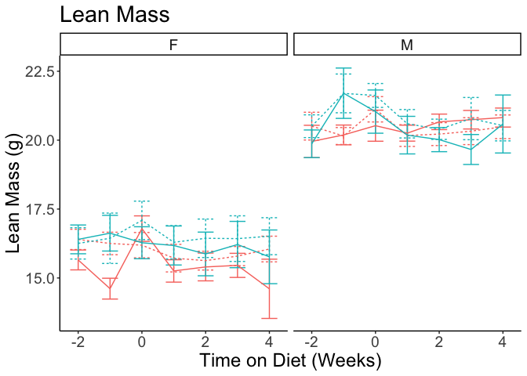

This script can be found in /Users/davebrid/Documents/GitHub/TissueSpecificTscKnockouts/Mouse Data/Liver AMPK Ketogenic Diet/Body Composition and was most recently run on Tue Apr 13 17:34:46 2021.

# Experimental Details

The notes about the design of this cohort can be found at

# Data Entry

This script pulled in a total of 1344 observations pulled from AMPK KD MRI Data.csv.  This includes the following number of animals in each treatment group.

Modified the genotypes based on the western blot data, this data filters out mice that we are not confident of their knockout status.

# Enrolled Animals

This is for animals where we have any body composition data.  This may include animals that did not make it to the end of the study.

Table: Animals in each group of this cohort

|Sex |Diet           |Injection |  n|
|:---|:--------------|:---------|--:|
|F   |Control Diet   |AAV-Cre   | 10|
|F   |Control Diet   |AAV-GFP   | 12|
|F   |Ketogenic Diet |AAV-Cre   |  9|
|F   |Ketogenic Diet |AAV-GFP   |  9|
|M   |Control Diet   |AAV-Cre   |  8|
|M   |Control Diet   |AAV-GFP   | 10|
|M   |Ketogenic Diet |AAV-Cre   | 10|
|M   |Ketogenic Diet |AAV-GFP   | 12|

# Body Weight

# Lean Mass

# Fat Mass

## Fat Mass Statistics

Used mixed linear modelling to analyze changes in fat mass after diet start

Table: ANOVA for null mixed linear model for AAV-GFP controls only, wktith all interactions

|                                  | Estimate| Std. Error|   df| t value| Pr(>&#124;t&#124;)|
|:---------------------------------|--------:|----------:|----:|-------:|------------------:|
|(Intercept)                       |    2.489|      0.144| 40.8|  17.332|              0.000|
|diet.time                         |    0.497|      0.123| 39.1|   4.046|              0.000|
|DietKetogenic Diet                |   -0.282|      0.210| 38.2|  -1.344|              0.187|
|SexM                              |   -0.782|      0.206| 39.1|  -3.801|              0.000|
|diet.time:DietKetogenic Diet      |    0.088|      0.170| 36.1|   0.515|              0.609|
|diet.time:SexM                    |   -0.028|      0.170| 35.9|  -0.165|              0.870|
|DietKetogenic Diet:SexM           |    0.453|      0.292| 37.6|   1.553|              0.129|
|diet.time:DietKetogenic Diet:SexM |    0.505|      0.233| 34.7|   2.163|              0.038|

This involved a complicated mixed linear model.  First, looking at AAV-GFP mice with a random uncorrelated slopes and intercepts intercept for time on diet, and only filtering for values after the diet change, we found significant three way interaction between sex, diet and time (p=0.038).  Based on this we constructed separate models for each sex.

### Fat Mass Models for Male Mice

Table: ANOVA for full mixed linear model for male controls only

|                                              | Estimate| Std. Error|   df| t value| Pr(>&#124;t&#124;)|
|:---------------------------------------------|--------:|----------:|----:|-------:|------------------:|
|(Intercept)                                   |    1.747|      0.193| 34.7|   9.049|              0.000|
|diet.time                                     |    0.313|      0.141| 30.9|   2.228|              0.033|
|DietKetogenic Diet                            |    0.014|      0.273| 34.8|   0.050|              0.960|
|InjectionAAV-GFP                              |   -0.046|      0.259| 34.8|  -0.176|              0.862|
|diet.time:DietKetogenic Diet                  |    0.629|      0.195| 32.2|   3.231|              0.003|
|diet.time:InjectionAAV-GFP                    |    0.162|      0.188| 31.2|   0.863|              0.394|
|DietKetogenic Diet:InjectionAAV-GFP           |    0.167|      0.362| 34.6|   0.461|              0.648|
|diet.time:DietKetogenic Diet:InjectionAAV-GFP |   -0.048|      0.258| 32.1|  -0.188|              0.852|

Table: ANOVA for reduced mixed linear model for male controls only

|                             | Estimate| Std. Error|   df| t value| Pr(>&#124;t&#124;)|
|:----------------------------|--------:|----------:|----:|-------:|------------------:|
|(Intercept)                  |    1.722|      0.126| 37.0|  13.684|              0.000|
|diet.time                    |    0.404|      0.093| 33.3|   4.356|              0.000|
|DietKetogenic Diet           |    0.108|      0.175| 36.8|   0.617|              0.541|
|diet.time:DietKetogenic Diet |    0.605|      0.127| 34.2|   4.774|              0.000|

Table: ANOVA for mixed linear model for male mice, looking at effect of injection

|                             | Estimate| Std. Error|   df| t value| Pr(>&#124;t&#124;)|
|:----------------------------|--------:|----------:|----:|-------:|------------------:|
|(Intercept)                  |    1.700|      0.162| 35.8|  10.505|              0.000|
|diet.time                    |    0.327|      0.116| 32.4|   2.813|              0.008|
|DietKetogenic Diet           |    0.109|      0.178| 35.7|   0.611|              0.545|
|InjectionAAV-GFP             |    0.040|      0.179| 35.7|   0.223|              0.825|
|diet.time:DietKetogenic Diet |    0.602|      0.126| 33.1|   4.781|              0.000|
|diet.time:InjectionAAV-GFP   |    0.137|      0.127| 33.3|   1.083|              0.287|

Table: Chi squared test for overall effect of knockout in male mice

|term               | npar| AIC| BIC| logLik| deviance| statistic| df| p.value|
|:------------------|----:|---:|---:|------:|--------:|---------:|--:|-------:|
|fat.mass.lm.m.null |    7| 349| 371|   -167|      335|        NA| NA|      NA|
|fat.mass.lm.m.geno |    9| 351| 380|   -167|      333|      1.47|  2|   0.479|

For male mice, there was a significant effect of diet (increases fat mass gain), but hte efect of knockout was not significant, though it trended towards less fat mass gain.

### Fat Mass Models for Female Mice

Table: ANOVA for full mixed linear model for female controls only

|                                              | Estimate| Std. Error|   df| t value| Pr(>&#124;t&#124;)|
|:---------------------------------------------|--------:|----------:|----:|-------:|------------------:|
|(Intercept)                                   |    2.196|      0.167| 39.1|  13.122|              0.000|
|diet.time                                     |    0.468|      0.145| 31.7|   3.225|              0.003|
|DietKetogenic Diet                            |    0.420|      0.267| 36.3|   1.572|              0.125|
|InjectionAAV-GFP                              |    0.279|      0.229| 38.0|   1.219|              0.230|
|diet.time:DietKetogenic Diet                  |    0.215|      0.211| 30.1|   1.019|              0.316|
|diet.time:InjectionAAV-GFP                    |    0.060|      0.193| 31.0|   0.310|              0.759|
|DietKetogenic Diet:InjectionAAV-GFP           |   -0.695|      0.352| 35.6|  -1.971|              0.057|
|diet.time:DietKetogenic Diet:InjectionAAV-GFP |   -0.152|      0.274| 29.3|  -0.556|              0.583|

Table: ANOVA for reduced mixed linear model for female controls only

|                             | Estimate| Std. Error|   df| t value| Pr(>&#124;t&#124;)|
|:----------------------------|--------:|----------:|----:|-------:|------------------:|
|(Intercept)                  |    2.343|      0.119| 39.4|  19.697|              0.000|
|diet.time                    |    0.505|      0.093| 32.4|   5.417|              0.000|
|DietKetogenic Diet           |    0.024|      0.181| 37.0|   0.134|              0.894|
|diet.time:DietKetogenic Diet |    0.123|      0.131| 30.5|   0.940|              0.355|

Table: ANOVA for mixed linear model for female mice, looking at effect of injection

|                             | Estimate| Std. Error|   df| t value| Pr(>&#124;t&#124;)|
|:----------------------------|--------:|----------:|----:|-------:|------------------:|
|(Intercept)                  |    2.347|      0.155| 38.4|  15.157|              0.000|
|diet.time                    |    0.515|      0.122| 31.2|   4.223|              0.000|
|DietKetogenic Diet           |    0.024|      0.184| 35.8|   0.133|              0.895|
|InjectionAAV-GFP             |   -0.008|      0.183| 36.6|  -0.045|              0.965|
|diet.time:DietKetogenic Diet |    0.125|      0.133| 29.4|   0.938|              0.356|
|diet.time:InjectionAAV-GFP   |   -0.019|      0.135| 29.8|  -0.139|              0.890|

Table: Chi squared test for overall effect of knockout in female mice

|term               | npar| AIC| BIC| logLik| deviance| statistic| df| p.value|
|:------------------|----:|---:|---:|------:|--------:|---------:|--:|-------:|
|fat.mass.lm.f.null |    7| 298| 319|   -142|      284|        NA| NA|      NA|
|fat.mass.lm.f.geno |    9| 302| 329|   -142|      284|     0.034|  2|   0.983|

For female mice there was neither a significant effect of diet or genotype.
