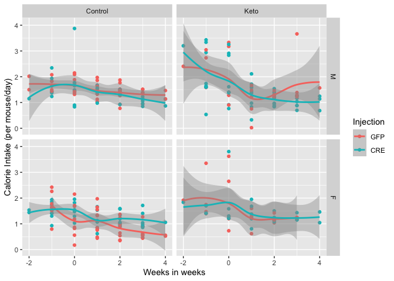
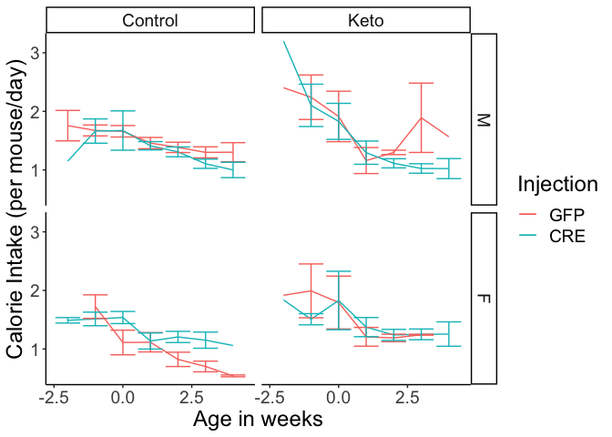
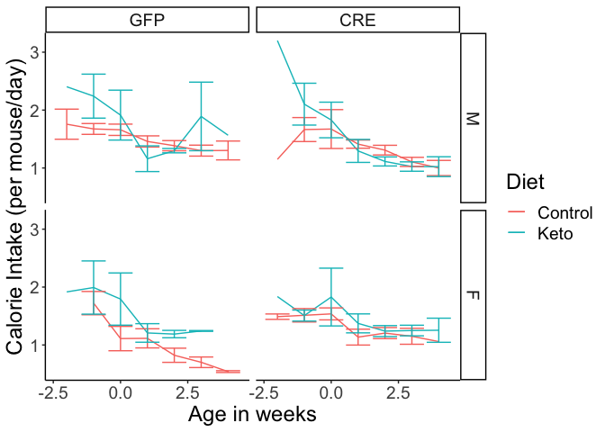

# Raw Data


These data can be found in **/Users/davebrid/Documents/GitHub/TissueSpecificTscKnockouts/Mouse Data/Liver AMPK Ketogenic Diet/All Figures/Food Intake** in a file named **AMPK KO Experiment - Food Intake.csv**.  These were mapped to cages using the file AMPK KO Experiment - Cage Mapping.csv.  This script was most recently updated on **Wed Jun 10 10:23:07 2020**.


# Sample Size


Table: Number of cages in the study

Diet      Sex   Injection     n
--------  ----  ----------  ---
Control   M     GFP           4
Control   M     CRE           3
Control   F     GFP           4
Control   F     CRE           4
Keto      M     GFP           3
Keto      M     CRE           4
Keto      F     GFP           2
Keto      F     CRE           2

# Analysis





# Session Information


```r
sessionInfo()
```

```
## R version 4.0.0 (2020-04-24)
## Platform: x86_64-apple-darwin17.0 (64-bit)
## Running under: macOS Catalina 10.15.5
## 
## Matrix products: default
## BLAS:   /Library/Frameworks/R.framework/Versions/4.0/Resources/lib/libRblas.dylib
## LAPACK: /Library/Frameworks/R.framework/Versions/4.0/Resources/lib/libRlapack.dylib
## 
## locale:
## [1] en_US.UTF-8/en_US.UTF-8/en_US.UTF-8/C/en_US.UTF-8/en_US.UTF-8
## 
## attached base packages:
## [1] stats     graphics  grDevices utils     datasets  methods   base     
## 
## other attached packages:
## [1] ggplot2_3.3.0   lubridate_1.7.8 readr_1.3.1     dplyr_0.8.5    
## [5] tidyr_1.0.3     knitr_1.28     
## 
## loaded via a namespace (and not attached):
##  [1] Rcpp_1.0.4.6     pillar_1.4.4     compiler_4.0.0   highr_0.8       
##  [5] tools_4.0.0      digest_0.6.25    lattice_0.20-41  evaluate_0.14   
##  [9] lifecycle_0.2.0  tibble_3.0.1     gtable_0.3.0     nlme_3.1-147    
## [13] mgcv_1.8-31      pkgconfig_2.0.3  rlang_0.4.6      Matrix_1.2-18   
## [17] yaml_2.2.1       xfun_0.13        withr_2.2.0      stringr_1.4.0   
## [21] generics_0.0.2   vctrs_0.2.4      hms_0.5.3        grid_4.0.0      
## [25] tidyselect_1.0.0 glue_1.4.0       R6_2.4.1         rmarkdown_2.1   
## [29] farver_2.0.3     purrr_0.3.4      magrittr_1.5     scales_1.1.0    
## [33] ellipsis_0.3.0   htmltools_0.4.0  splines_4.0.0    assertthat_0.2.1
## [37] colorspace_1.4-1 labeling_0.3     stringi_1.4.6    munsell_0.5.0   
## [41] crayon_1.3.4
```
