# Purpose

# Experimental Details

Injected 0.75 mU/g of lean body mass to animals fasted for 6h after 2 weeks of KD/CD (or four weeks after the injection)

# Raw Data


```r
library(readxl) #loads the readr package

data.filename <- 'ITT Data.xlsx' #make this a separate line, you can use any variable you want
not.ko <- scan('../Non-Knockout Mice.txt')
exp.data <- read_excel(data.filename) %>% filter(!(Mouse %in% not.ko)) #removed mice that are not ko

mapping.filename <- 'mapping.csv'
#this loads whatever the file is into a dataframe called exp.data if it exists
exp.data <- read_excel(data.filename, sheet='Sheet2') %>%
  select(Group:`120`) %>%
  filter(!(Group %in% c("Average","SE",NA))) %>% # removed calculated averages and errors
  separate(Group,
           into=c("Sex","Diet","Injection"), # broke group down into sex, diet and injection 
           sep=" ") %>%
  tibble::rowid_to_column("ID") %>% #index an ID column
  mutate(ID = as.factor(ID)) %>%
  mutate(Injection = relevel(as.factor(Injection), ref="GFP")) %>%
  filter(!(Mouse %in% not.ko)) # removes mice that are not knockouts, but should have been

data.long <-
  exp.data %>%
  group_by(Sex,Diet,Injection) %>%
  gather(key=Time,value=Glucose, -Sex, -Diet, -Injection, -ID,-Mouse) %>%
  mutate(Time = as.integer(Time),
         Glucose = as.integer(Glucose))

summary.data <-
  data.long %>%
  group_by(Sex,Diet,Injection, Time) %>%
  mutate(Mouse = as.factor(Mouse)) %>%
  summarize_if(is.numeric, .funs=funs(mean=mean(., na.rm = TRUE),
                                      se=se))
```

These data can be found in **/Users/davebrid/Documents/GitHub/TissueSpecificTscKnockouts/Mouse Data/Liver AMPK Ketogenic Diet/ITT** in a file named **ITT Data.xlsx** and **mapping.csv**.  This script was most recently updated on **Thu Apr  1 10:29:55 2021**.

# Number of Mice


```r
exp.data %>%
  group_by(Sex,Diet,Injection) %>%
  distinct(ID, .keep_all = T) %>%
  count %>%
  kable(caption="Animals in each group of this cohort")
```


Table: Animals in each group of this cohort

|Sex |Diet    |Injection |  n|
|:---|:-------|:---------|--:|
|F   |Control |GFP       |  8|
|F   |Control |Cre       |  7|
|F   |Keto    |GFP       |  9|
|F   |Keto    |Cre       |  9|
|M   |Control |GFP       |  9|
|M   |Control |Cre       |  7|
|M   |Keto    |GFP       | 12|
|M   |Keto    |Cre       | 11|

# Analysis


```r
library(ggplot2)

ggplot(data.long, aes(y=Glucose,
                      x=Time,
                      col=Injection)) +
  geom_point() +
  geom_smooth() +
  facet_grid(Sex~Diet) +
  labs(y="Blood Glucose (mg/dL)",
       x="Insulin (min)")
```

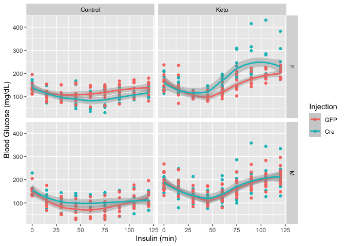


```r
data.long %>%
  group_by(Sex,Diet,Injection,Time) %>%
  summarize(Mean = mean(Glucose,na.rm=T),
            Error = se(Glucose)) %>%
  ggplot(aes(y=Mean,
             x=Time,
             col=Injection)) +
  geom_line() +
  geom_errorbar(aes(ymin=Mean-Error,
             ymax=Mean+Error)) +
  expand_limits(y=0) +
  facet_grid(Sex~Diet) +
  labs(y="Blood Glucose (mg/dL)",
       x="Insulin (min)")
```

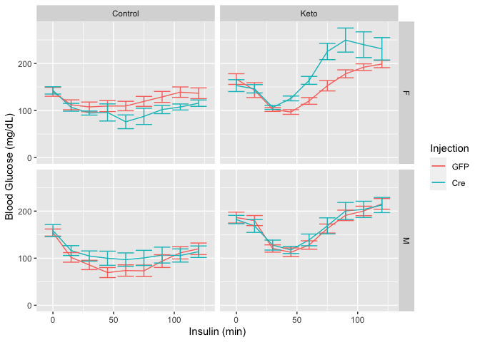


```r
data.long %>%
  filter(Sex=="M") %>%
  group_by(Sex,Diet,Injection,Time) %>%
  summarize(Mean = mean(Glucose,na.rm=T),
            Error = se(Glucose)) %>%
  ggplot(aes(y=Mean,
             x=Time,
             ymin=Mean-Error,
             ymax=Mean+Error,
             col=Injection)) +
  geom_line() +
  geom_errorbar() +
  expand_limits(y=0) +
  scale_color_brewer(palette = "Set2",
                     name="", 
                     labels=c("AAV-Tbg-GFP",
                              "AAV-Tbg-Cre")) +
  facet_grid(~Diet) +
  labs(y="Blood Glucose (mg/dL)",
       x="Insulin (min)",
       title="Hepatic AMPK Knockout Mice") +
  theme_classic() +
  theme(
    text = element_text(size=24),
    legend.position = c(0.25,0.85),
    legend.key = element_blank(),
    legend.background = element_blank())
```

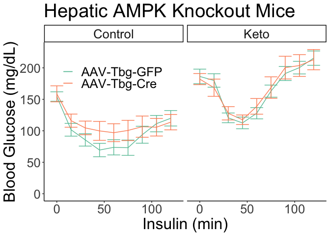


```r
data.long %>%
  filter(Injection=="GFP") %>%
  group_by(Sex,Diet,Time) %>%
  summarize(Mean = mean(Glucose,na.rm=T),
            Error = se(Glucose)) %>%
  ggplot(aes(y=Mean,
             x=Time,
             ymin=Mean-Error,
             ymax=Mean+Error,
             col=Diet)) +
  geom_line() +
  geom_errorbar() +
  expand_limits(y=0) +
  facet_grid(~Sex) +
  labs(y="Blood Glucose (mg/dL)",
       x="Insulin (min)",
       title="Control mice only, effect of KD")
```

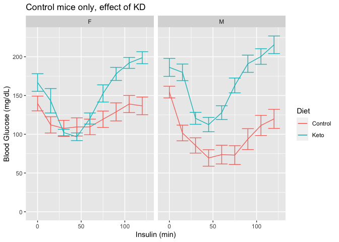

### ITT Statistics


```r
library(lme4)
library(broom)
library(lmerTest)
itt.lme <- lmer(Glucose~as.factor(Time)+Diet+Sex+Injection+(1|ID), data=data.long)
itt.lme.null <- lmer(Glucose~as.factor(Time)+Diet+Sex+(1|ID), data=data.long)

summary(itt.lme)
```

```
## Linear mixed model fit by REML. t-tests use Satterthwaite's method [
## lmerModLmerTest]
## Formula: Glucose ~ as.factor(Time) + Diet + Sex + Injection + (1 | ID)
##    Data: data.long
## 
## REML criterion at convergence: 6372
## 
## Scaled residuals: 
##    Min     1Q Median     3Q    Max 
## -4.252 -0.588 -0.042  0.565  5.281 
## 
## Random effects:
##  Groups   Name        Variance Std.Dev.
##  ID       (Intercept)  714     26.7    
##  Residual             1059     32.5    
## Number of obs: 643, groups:  ID, 72
## 
## Fixed effects:
##                    Estimate Std. Error      df t value Pr(>|t|)    
## (Intercept)         127.914      7.899 107.945   16.19  < 2e-16 ***
## as.factor(Time)15   -24.236      5.423 563.249   -4.47  9.5e-06 ***
## as.factor(Time)30   -55.236      5.423 563.249  -10.19  < 2e-16 ***
## as.factor(Time)45   -58.583      5.423 563.249  -10.80  < 2e-16 ***
## as.factor(Time)60   -46.721      5.446 563.686   -8.58  < 2e-16 ***
## as.factor(Time)75   -21.763      5.446 563.686   -4.00  7.3e-05 ***
## as.factor(Time)90    -0.425      5.446 563.686   -0.08     0.94    
## as.factor(Time)105    5.786      5.446 563.686    1.06     0.29    
## as.factor(Time)120   11.814      5.446 563.686    2.17     0.03 *  
## DietKeto             58.029      6.887  68.293    8.43  3.6e-12 ***
## SexM                 -2.965      6.838  68.183   -0.43     0.67    
## InjectionCre          7.667      6.821  68.152    1.12     0.27    
## ---
## Signif. codes:  0 '***' 0.001 '**' 0.01 '*' 0.05 '.' 0.1 ' ' 1
## 
## Correlation of Fixed Effects:
##             (Intr) a.(T)15 a.(T)3 a.(T)4 a.(T)6 a.(T)7 a.(T)9 a.(T)10 a.(T)12
## as.fct(T)15 -0.343                                                           
## as.fct(T)30 -0.343  0.500                                                    
## as.fct(T)45 -0.343  0.500   0.500                                            
## as.fct(T)60 -0.341  0.498   0.498  0.498                                     
## as.fct(T)75 -0.341  0.498   0.498  0.498  0.497                              
## as.fct(T)90 -0.341  0.498   0.498  0.498  0.497  0.497                       
## as.fc(T)105 -0.341  0.498   0.498  0.498  0.497  0.497  0.497                
## as.fc(T)120 -0.341  0.498   0.498  0.498  0.497  0.497  0.497  0.497         
## DietKeto    -0.460  0.000   0.000  0.000 -0.003 -0.003 -0.003 -0.003  -0.003 
## SexM        -0.455  0.000   0.000  0.000  0.002  0.002  0.002  0.002   0.002 
## InjectionCr -0.401  0.000   0.000  0.000 -0.002 -0.002 -0.002 -0.002  -0.002 
##             DietKt SexM  
## as.fct(T)15              
## as.fct(T)30              
## as.fct(T)45              
## as.fct(T)60              
## as.fct(T)75              
## as.fct(T)90              
## as.fc(T)105              
## as.fc(T)120              
## DietKeto                 
## SexM        -0.048       
## InjectionCr -0.035  0.023
```

```r
anova(itt.lme) %>% 
  tidy %>% 
  kable(caption="Type III Analysis of Variance Table with Satterthwaite's method for ITT mixed linear model.")
```


Table: Type III Analysis of Variance Table with Satterthwaite's method for ITT mixed linear model.

|term            |  sumsq| meansq| NumDF| DenDF| statistic| p.value|
|:---------------|------:|------:|-----:|-----:|---------:|-------:|
|as.factor(Time) | 422514|  52814|     8| 563.5|    49.885|   0.000|
|Diet            |  75170|  75170|     1|  68.3|    71.001|   0.000|
|Sex             |    199|    199|     1|  68.2|     0.188|   0.666|
|Injection       |   1337|   1337|     1|  68.2|     1.263|   0.265|

```r
anova(itt.lme,itt.lme.null) %>% 
  tidy %>%
  kable(caption="Chi-squared test for effects of AAV injection on ITT.")
```


Table: Chi-squared test for effects of AAV injection on ITT.

|term         | npar|  AIC|  BIC| logLik| deviance| statistic| df| p.value|
|:------------|----:|----:|----:|------:|--------:|---------:|--:|-------:|
|itt.lme.null |   13| 6458| 6517|  -3216|     6432|        NA| NA|      NA|
|itt.lme      |   14| 6459| 6522|  -3216|     6431|      1.32|  1|    0.25|

## Normalized ITT


```r
data.long.norm <-
  data.long %>%
  group_by(ID) %>%
  mutate(Glucose.norm = Glucose/Glucose[Time==0]*100)

data.long.norm %>%
  group_by(Sex,Diet,Injection,Time) %>%
  summarize(Mean = mean(Glucose.norm,na.rm=T),
            Error = se(Glucose.norm)) %>%
  ggplot(aes(y=Mean,
             x=Time,
             ymin=Mean-Error,
             ymax=Mean+Error,
             col=Injection)) +
  geom_line() +
  geom_errorbar() +
  expand_limits(y=0) +
  facet_grid(Sex~Diet) +
  labs(y="Blood Glucose (% of Basal)",
       x="Insulin (min)")
```

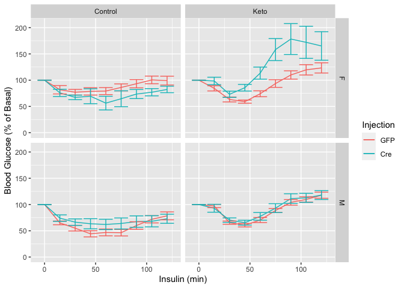

```r
library(forcats)

data.long.norm %>%
      mutate(Sex = fct_recode(Sex,
                                "Female"="F",
                                "Male"="M")) %>%
      mutate(Diet = fct_recode(Diet,
                                "Ketogenic Diet"="Keto",
                                "Control Diet"="Control")) %>%
      mutate(Injection = fct_recode(Injection,
                                "AAV-Tbg-GFP"="GFP",
                                "AAV-Tbg-Cre"="Cre")) %>%
  group_by(Sex,Diet,Injection,Time) %>%
  summarize(Mean = mean(Glucose.norm,na.rm=T),
            Error = se(Glucose.norm)) %>%
  ggplot(aes(y=Mean,
             x=Time,
             ymin=Mean-Error,
             ymax=Mean+Error,
             col=Injection)) +
  geom_line() +
  geom_errorbar() +
  expand_limits(y=0) +
  geom_hline(yintercept=100, lty=2)+
  facet_grid(Diet~Sex) +
  labs(y="Blood Glucose (% of Basal)",
       x="Insulin (min)") +
  theme_classic() +
  scale_color_grey() +
  theme(text=element_text(size=16),
        legend.position=c(0.15,0.90),
        legend.background = element_rect(fill = "transparent"),
        legend.title=element_blank())
```

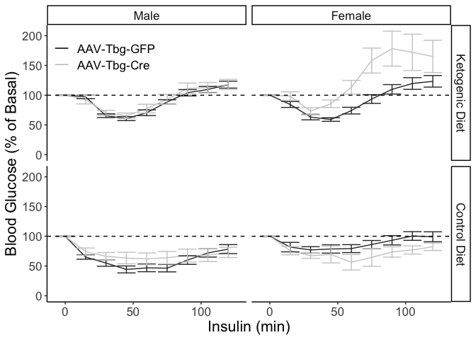

### Analysis at the 60 Minute Time Point


```r
data.long.norm %>%
  filter(Time==60) %>%
  group_by(Sex,Diet,Injection) %>%
  summarize(Glucose.1h = mean(Glucose, na.rm=T),
            Glucose.1h.SE = se(Glucose),
            n = length(Glucose)) %>%
  mutate(Delta.GFP = Glucose.1h/Glucose.1h[Injection=="GFP"]) %>%
  kable(caption="Summary of glucose levels at the 60 minute time point")
```


Table: Summary of glucose levels at the 60 minute time point

|Sex |Diet    |Injection | Glucose.1h| Glucose.1h.SE|  n| Delta.GFP|
|:---|:-------|:---------|----------:|-------------:|--:|---------:|
|F   |Control |GFP       |      109.5|         10.04|  8|     1.000|
|F   |Control |Cre       |       76.0|         14.58|  7|     0.694|
|F   |Keto    |GFP       |      120.3|          7.15|  9|     1.000|
|F   |Keto    |Cre       |      164.0|          8.43|  9|     1.363|
|M   |Control |GFP       |       73.8|         12.07|  9|     1.000|
|M   |Control |Cre       |       97.0|         14.20|  7|     1.315|
|M   |Keto    |GFP       |      127.9|          8.92| 12|     1.000|
|M   |Keto    |Cre       |      138.8|         12.46| 11|     1.085|

```r
data.long.norm %>%
  filter(Time==60) %>%
  filter(Sex=="F") %>%
  lm(Glucose~Diet*Injection, data=.) %>%
  summary %>% tidy %>% kable(caption="Effect modification by knockout on diet in female mice.")
```


Table: Effect modification by knockout on diet in female mice.

|term                  | estimate| std.error| statistic| p.value|
|:---------------------|--------:|---------:|---------:|-------:|
|(Intercept)           |    109.5|      10.0|    10.909|   0.000|
|DietKeto              |     10.8|      13.8|     0.785|   0.439|
|InjectionCre          |    -33.5|      14.7|    -2.280|   0.030|
|DietKeto:InjectionCre |     77.2|      19.9|     3.882|   0.001|

```r
data.long.norm %>%
  filter(Time==60) %>%
  filter(Sex=="M") %>%
  lm(Glucose~Diet*Injection, data=.) %>%
  summary %>% tidy %>% kable(caption="Effect modification by knockout on diet in male mice.")
```


Table: Effect modification by knockout on diet in male mice.

|term                  | estimate| std.error| statistic| p.value|
|:---------------------|--------:|---------:|---------:|-------:|
|(Intercept)           |     73.8|      12.9|     5.719|   0.000|
|DietKeto              |     54.2|      16.6|     3.254|   0.003|
|InjectionCre          |     23.2|      18.9|     1.232|   0.227|
|DietKeto:InjectionCre |    -12.3|      24.3|    -0.509|   0.614|


```r
data.long.norm %>%
  filter(Injection=="GFP") %>%
  group_by(Sex,Diet,Injection,Time) %>%
  summarize(Mean = mean(Glucose.norm,na.rm=T),
            Error = se(Glucose.norm)) %>%
  ggplot(aes(y=Mean,
             x=Time,
             ymin=Mean-Error,
             ymax=Mean+Error,
             col=Diet)) +
  geom_line() +
  geom_errorbar() +
  expand_limits(y=0) +
  facet_grid(~Sex) +
  labs(y="Blood Glucose (% of Basal)",
       x="Insulin (min)")
```

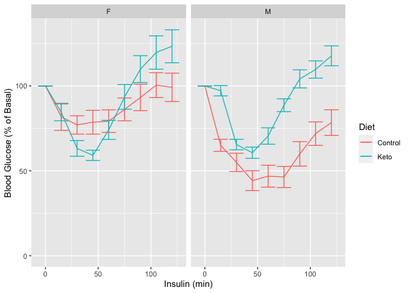

## Fasting Glucose


```r
ggplot(data.long.norm %>% filter(Time==0),
       aes(y=Glucose,x=Diet,
           col=Injection)) +
  geom_boxplot(outlier.shape = NA) +
  geom_point(position = position_jitterdodge()) +
  expand_limits(y=0) +
  facet_grid(.~Sex) +
  labs(y="Fasting Glucose (mg/dL)",
       title="Fasting Glucose")
```

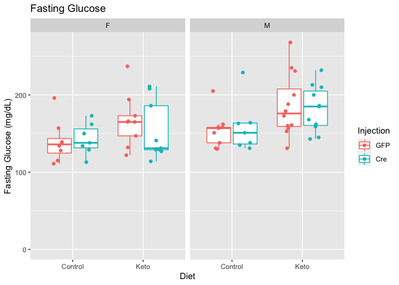


```r
library(forcats)
data.long %>% 
  filter(Time==0) %>%
  group_by(Injection,Sex,Diet) %>%
  summarize(Mean = mean(Glucose,na.rm=T),
            Error = se(Glucose)) %>%
  ggplot(aes(y=Mean,
             x=Diet,
             fill=Injection)) +
  geom_bar(stat='identity', position='dodge', width=0.75) +
  geom_errorbar(position=position_dodge(width=0.75),aes(group=Injection,
                                                        ymin=Mean-Error,
                                                        ymax=Mean+Error), width=0.5) +
  expand_limits(y=0) +
  facet_grid(.~Sex) +
  labs(y="Fasting Glucose (mg/dL)",
       title="Fasting Glucose")
```

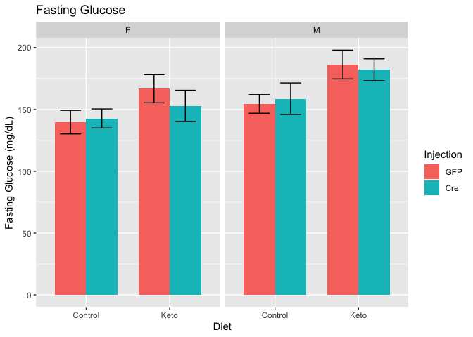

```r
data.long %>% 
  filter(Time==0) %>%
  group_by(Injection,Sex,Diet) %>%
    mutate(Sex = fct_recode(Sex,
                                "Female"="F",
                                "Male"="M")) %>%
      mutate(Diet = fct_recode(Diet,
                                "Ketogenic Diet"="Keto",
                                "Control Diet"="Control")) %>%
      mutate(Injection = fct_recode(Injection,
                                "AAV-Tbg-GFP"="GFP",
                                "AAV-Tbg-Cre"="Cre")) %>%
  summarize(Mean = mean(Glucose,na.rm=T),
            Error = se(Glucose)) %>%
  ggplot(aes(y=Mean,
             x=Diet,
             fill=Injection)) +
  geom_bar(stat='identity', position='dodge', width=0.75) +
  geom_errorbar(position=position_dodge(width=0.75),aes(group=Injection,
                                                        ymin=Mean-Error,
                                                        ymax=Mean+Error), width=0.5) +
  expand_limits(y=0) +
  facet_grid(.~Sex) +
  labs(y="Fasting Glucose (mg/dL)",
       x="") +
  theme_classic() +
  scale_fill_grey() +
  theme(text=element_text(size=16),
        legend.position=c(0.15,0.90),
        legend.background = element_rect(fill = "transparent"),
        legend.title=element_blank())
```

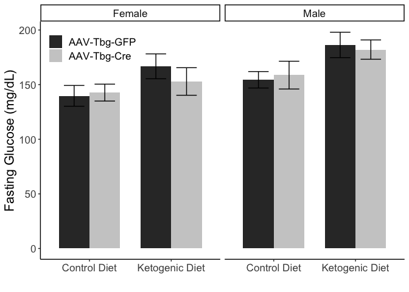

### Fasting Glucose Statistics


```r
fg.summary <- 
  data.long %>% 
  filter(Time==0) %>%
  group_by(Injection,Sex,Diet) %>%
  summarize(Mean = mean(Glucose,na.rm=T),
            Error = se(Glucose)) 

lm(Glucose ~ Diet + Sex + Injection + Sex:Diet, data = data.long %>% filter(Time==0)) %>%
  tidy %>%
  kable(caption="Linear model for effects on fasting glucose levels, tests for diet modification by sex.")
```


Table: Linear model for effects on fasting glucose levels, tests for diet modification by sex.

|term          | estimate| std.error| statistic| p.value|
|:-------------|--------:|---------:|---------:|-------:|
|(Intercept)   |   142.67|      8.85|    16.123|   0.000|
|DietKeto      |    18.81|     11.02|     1.707|   0.093|
|SexM          |    15.08|     11.33|     1.331|   0.188|
|InjectionCre  |    -3.29|      7.45|    -0.442|   0.660|
|DietKeto:SexM |     9.32|     15.06|     0.619|   0.538|

```r
lm(Glucose ~ Diet + Sex + Injection + Sex:Injection, data = data.long %>% filter(Time==0)) %>%
  tidy %>%
  kable(caption="Linear model for effects on fasting glucose levels, tests for knockout modification by sex.")
```


Table: Linear model for effects on fasting glucose levels, tests for knockout modification by sex.

|term              | estimate| std.error| statistic| p.value|
|:-----------------|--------:|---------:|---------:|-------:|
|(Intercept)       |   141.47|      8.63|    16.388|   0.000|
|DietKeto          |    23.79|      7.53|     3.160|   0.002|
|SexM              |    17.61|     10.31|     1.709|   0.092|
|InjectionCre      |    -6.41|     11.00|    -0.583|   0.562|
|SexM:InjectionCre |     5.80|     14.96|     0.388|   0.700|

```r
lm(Glucose ~ Diet + Sex + Injection, data = data.long %>% filter(Time==0)) %>%
  tidy %>%
    mutate(Percent.Increase = estimate/estimate[1]*100) %>%
  kable(caption="Linear model for effects on fasting glucose levels.")
```


Table: Linear model for effects on fasting glucose levels.

|term         | estimate| std.error| statistic| p.value| Percent.Increase|
|:------------|--------:|---------:|---------:|-------:|----------------:|
|(Intercept)  |   139.94|      7.64|    18.326|   0.000|           100.00|
|DietKeto     |    23.80|      7.48|     3.182|   0.002|            17.01|
|SexM         |    20.36|      7.43|     2.740|   0.008|            14.55|
|InjectionCre |    -3.28|      7.41|    -0.442|   0.660|            -2.34|

## Area Under the Curve


```r
data.long %>%
  group_by(ID, Diet, Sex, Injection) %>%
  summarize(AUC = sum(Glucose,na.rm=T)) %>%
ggplot(aes(y=AUC,x=Diet,
           col=Injection)) +
  geom_boxplot(outlier.shape = NA) +
  geom_point(position = position_jitterdodge()) +
  expand_limits(y=0) +
  facet_grid(.~Sex) +
  labs(y="Glucose (mg/dL x minutes)",
       title="Area Under Curve")
```

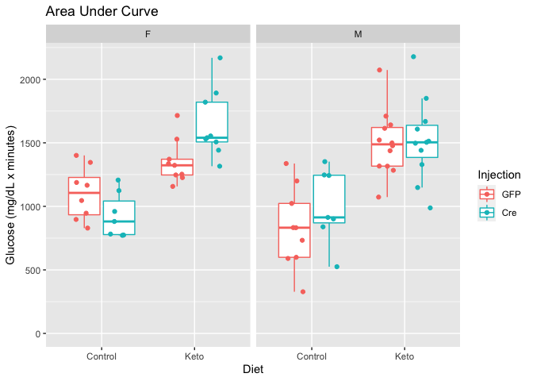


```r
data.long %>%
  group_by(ID, Diet, Sex, Injection) %>%
  summarize(AUC = sum(Glucose)) %>%
    group_by(Diet, Sex, Injection) %>%
  summarize(Mean = mean(AUC,na.rm=T),
            Error = se(AUC)) %>%
  ggplot(aes(y=Mean,
             x=Diet,
             fill=Injection)) +
  geom_bar(stat='identity', position='dodge', width=0.75) +
  geom_errorbar(position=position_dodge(width=0.75),aes(group=Injection,
                                                        ymin=Mean-Error,
                                                        ymax=Mean+Error), width=0.5) +
  expand_limits(y=0) +
  facet_grid(.~Sex) +
  labs(y="Glucose (mg/dL x minutes)",
       title="Area Under Curve")
```

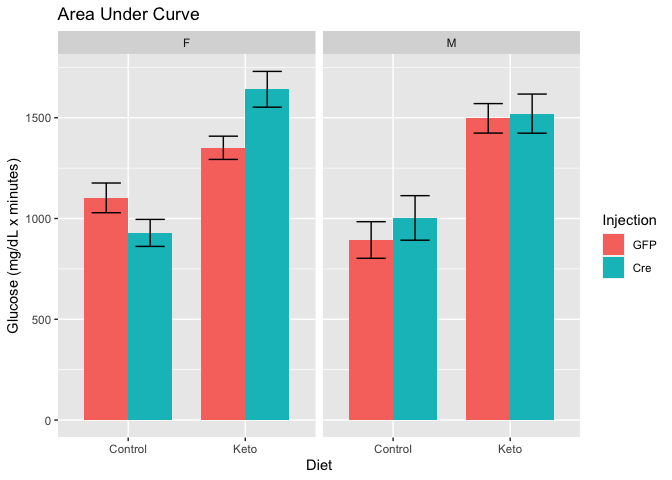

### AUC Statistics


```r
lm(AUC ~ Diet + Sex + Injection, 
   data = data.long %>% 
     group_by(ID, Diet, Sex, Injection) %>%
     summarize(AUC = sum(Glucose))) %>% 
  tidy %>%
  kable(caption="Linear model for effects on ITT area under curve.")
```


Table: Linear model for effects on ITT area under curve.

|term         | estimate| std.error| statistic| p.value|
|:------------|--------:|---------:|---------:|-------:|
|(Intercept)  |    963.9|      64.1|     15.05|   0.000|
|DietKeto     |    520.0|      62.9|      8.27|   0.000|
|SexM         |    -24.9|      62.3|     -0.40|   0.691|
|InjectionCre |     67.3|      62.1|      1.08|   0.282|

# Interpretation

A brief summary of what the interpretation of these results were

# Session Information


```r
sessionInfo()
```

```
## R version 4.0.2 (2020-06-22)
## Platform: x86_64-apple-darwin17.0 (64-bit)
## Running under: macOS  10.16
## 
## Matrix products: default
## BLAS:   /Library/Frameworks/R.framework/Versions/4.0/Resources/lib/libRblas.dylib
## LAPACK: /Library/Frameworks/R.framework/Versions/4.0/Resources/lib/libRlapack.dylib
## 
## locale:
## [1] en_US.UTF-8/en_US.UTF-8/en_US.UTF-8/C/en_US.UTF-8/en_US.UTF-8
## 
## attached base packages:
## [1] stats     graphics  grDevices utils     datasets  methods   base     
## 
## other attached packages:
##  [1] forcats_0.5.1  lmerTest_3.1-3 broom_0.7.5    lme4_1.1-26    Matrix_1.3-2  
##  [6] ggplot2_3.3.3  readxl_1.3.1   dplyr_1.0.5    tidyr_1.1.3    knitr_1.31    
## 
## loaded via a namespace (and not attached):
##  [1] statmod_1.4.35      tidyselect_1.1.0    xfun_0.22          
##  [4] bslib_0.2.4         purrr_0.3.4         splines_4.0.2      
##  [7] lattice_0.20-41     colorspace_2.0-0    vctrs_0.3.6        
## [10] generics_0.1.0      htmltools_0.5.1.1   yaml_2.2.1         
## [13] mgcv_1.8-34         utf8_1.2.1          rlang_0.4.10       
## [16] jquerylib_0.1.3     pillar_1.5.1        nloptr_1.2.2.2     
## [19] glue_1.4.2          withr_2.4.1         DBI_1.1.1          
## [22] RColorBrewer_1.1-2  lifecycle_1.0.0     stringr_1.4.0      
## [25] munsell_0.5.0       gtable_0.3.0        cellranger_1.1.0   
## [28] evaluate_0.14       labeling_0.4.2      fansi_0.4.2        
## [31] highr_0.8           Rcpp_1.0.6          backports_1.2.1    
## [34] scales_1.1.1        jsonlite_1.7.2      farver_2.1.0       
## [37] digest_0.6.27       stringi_1.5.3       numDeriv_2016.8-1.1
## [40] grid_4.0.2          cli_2.3.1           tools_4.0.2        
## [43] magrittr_2.0.1      sass_0.3.1          tibble_3.1.0       
## [46] crayon_1.4.1        pkgconfig_2.0.3     ellipsis_0.3.1     
## [49] MASS_7.3-53.1       assertthat_0.2.1    minqa_1.2.4        
## [52] rmarkdown_2.7       R6_2.5.0            boot_1.3-27        
## [55] nlme_3.1-152        compiler_4.0.2
```

