# Purpose

# Experimental Details

Animals were sacrificed at approximately 2PM in the fed state

# Raw Data


These data can be found in **/Users/katherinekistler/Documents/GitHub/TissueSpecificTscKnockouts/Mouse Data/Liver AMPK Ketogenic Diet/All Figures/Sacrifice Data** in a file named **AMPK KD Sacrifice Data.csv**.  This script was most recently updated on **Tue Jul 14 10:54:52 2020**.

# Analysis

# Sacrificed Animals

This is for animals where we have any sacrifice data.


Table: Animals in each group of this cohort

Sex   Diet      Injection     n
----  --------  ----------  ---
F     Control   GFP           8
F     Control   Cre           7
F     Keto      GFP           7
F     Keto      Cre           8
M     Control   GFP           9
M     Control   Cre           7
M     Keto      GFP           9
M     Keto      Cre           4

## Serum Levels

Serum was collected via retro-orbital bleed in the fed state.  Both glucose and ketone body levels were assessed by stick assays.

### Fed Blood Glucose

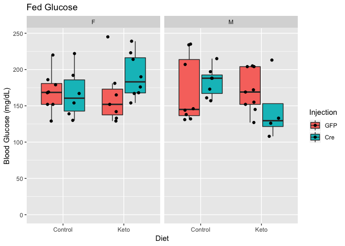

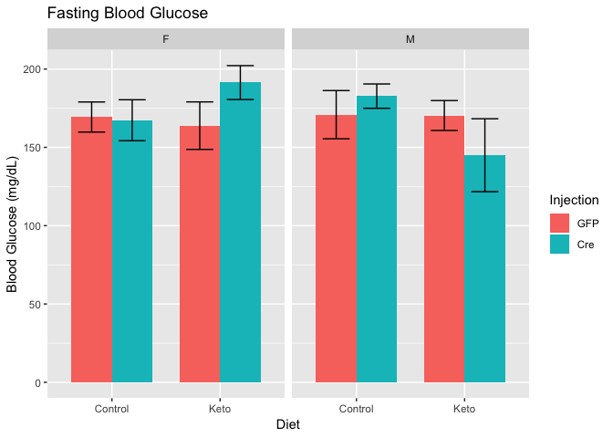


Table: Fed glucose levels

term            estimate   std.error   statistic   p.value
-------------  ---------  ----------  ----------  --------
(Intercept)       171.28        9.29      18.440     0.000
SexM               -3.21        9.29      -0.346     0.731
DietKeto           -1.52        9.25      -0.164     0.870
InjectionCre        6.62        9.35       0.709     0.482

### Fed Ketone Bodies

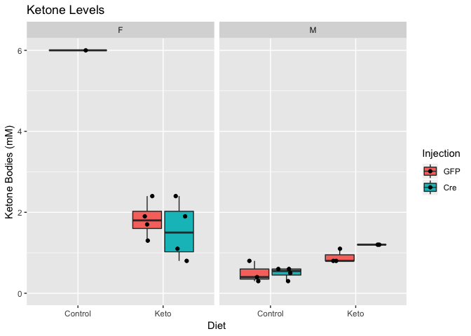

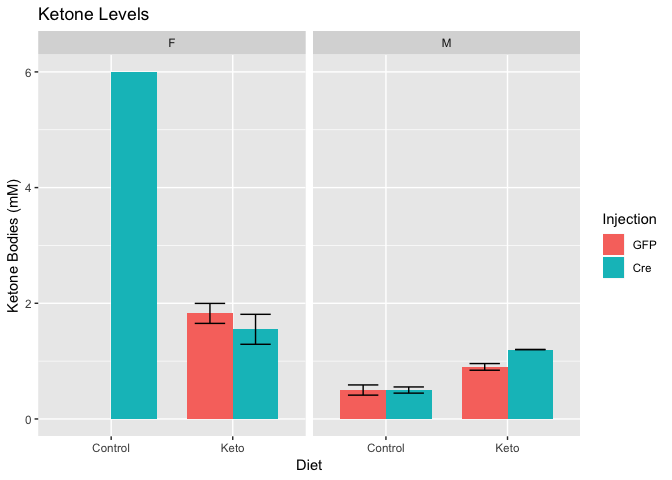


Table: Inguinal adipose tissue weights

term            estimate   std.error   statistic   p.value
-------------  ---------  ----------  ----------  --------
(Intercept)        2.569       0.692       3.714     0.002
SexM              -1.707       0.531      -3.214     0.005
DietKeto          -0.564       0.547      -1.031     0.317
InjectionCre       0.179       0.467       0.383     0.707

## Fat Pad Weights

### Inguinal Adipose Tissue

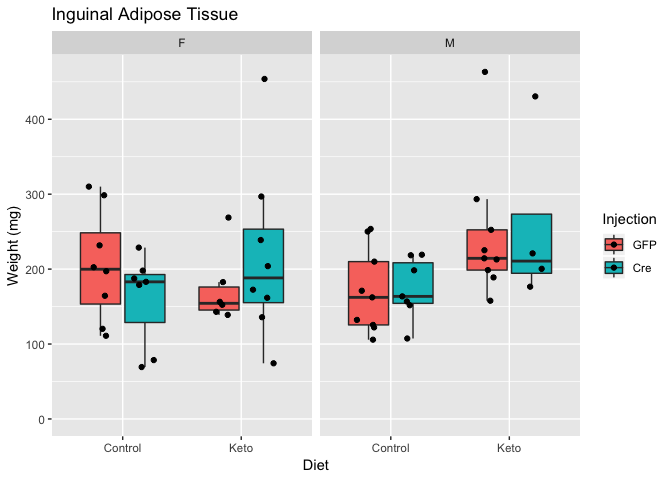

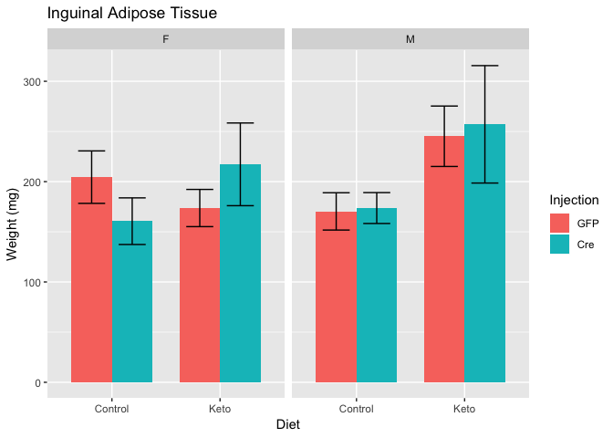


Table: Inguinal adipose tissue weights

term            estimate   std.error   statistic   p.value
-------------  ---------  ----------  ----------  --------
(Intercept)       169.76        20.9       8.112     0.000
SexM               16.68        21.0       0.795     0.430
DietKeto           45.66        20.8       2.193     0.033
InjectionCre       -1.52        21.1      -0.072     0.943

### Gonadal Adipose Tissue

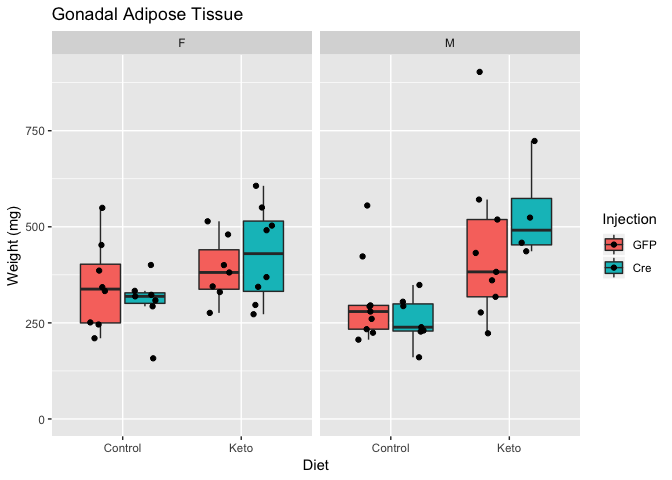

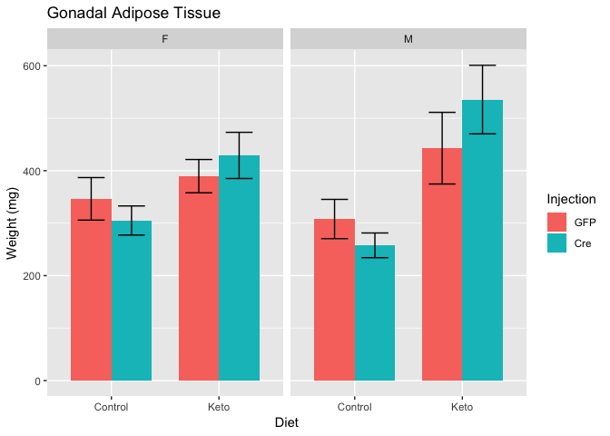


Table: Gonadal adipose tissue weights

term            estimate   std.error   statistic   p.value
-------------  ---------  ----------  ----------  --------
(Intercept)       302.93        33.0       9.177     0.000
SexM                6.93        33.0       0.210     0.835
DietKeto          133.34        32.8       4.059     0.000
InjectionCre       -1.46        33.2      -0.044     0.965


## Muscle Weights

### Gastrocnemius

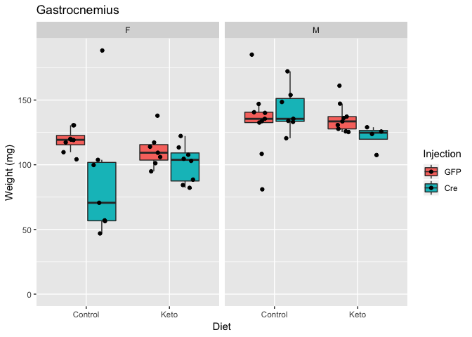

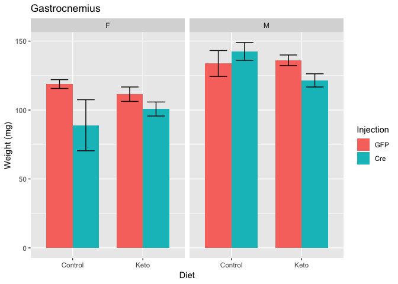


Table: Inguinal adipose tissue weights

term            estimate   std.error   statistic   p.value
-------------  ---------  ----------  ----------  --------
(Intercept)       112.07        6.15       18.22     0.000
SexM               28.14        6.16        4.57     0.000
DietKeto           -2.82        6.12       -0.46     0.647
InjectionCre      -10.66        6.19       -1.72     0.091

### Quadriceps

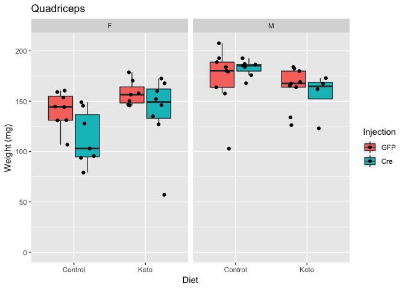

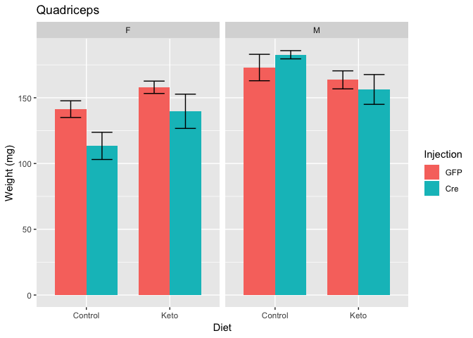


Table: Quadricep weights

term            estimate   std.error   statistic   p.value
-------------  ---------  ----------  ----------  --------
(Intercept)       141.69        6.90      20.540     0.000
SexM               30.88        6.91       4.471     0.000
DietKeto            2.17        6.87       0.315     0.754
InjectionCre       -8.99        6.95      -1.294     0.201


# Session Information


```r
sessionInfo()
```

```
## R version 3.5.1 (2018-07-02)
## Platform: x86_64-apple-darwin15.6.0 (64-bit)
## Running under: macOS High Sierra 10.13.6
## 
## Matrix products: default
## BLAS: /Library/Frameworks/R.framework/Versions/3.5/Resources/lib/libRblas.0.dylib
## LAPACK: /Library/Frameworks/R.framework/Versions/3.5/Resources/lib/libRlapack.dylib
## 
## locale:
## [1] en_US.UTF-8/en_US.UTF-8/en_US.UTF-8/C/en_US.UTF-8/en_US.UTF-8
## 
## attached base packages:
## [1] stats     graphics  grDevices utils     datasets  methods   base     
## 
## other attached packages:
## [1] broom_0.5.2     ggplot2_3.1.0   forcats_0.4.0   lubridate_1.7.4
## [5] readr_1.3.1     dplyr_0.8.1     tidyr_0.8.2     knitr_1.20     
## 
## loaded via a namespace (and not attached):
##  [1] Rcpp_1.0.1       pillar_1.4.1     compiler_3.5.1   highr_0.7       
##  [5] plyr_1.8.4       tools_3.5.1      digest_0.6.25    lattice_0.20-35 
##  [9] nlme_3.1-137     evaluate_0.11    tibble_2.1.3     gtable_0.2.0    
## [13] pkgconfig_2.0.2  rlang_0.4.7      yaml_2.2.0       withr_2.1.2     
## [17] stringr_1.3.1    generics_0.0.2   hms_0.4.2        rprojroot_1.3-2 
## [21] grid_3.5.1       tidyselect_0.2.5 glue_1.4.1       R6_2.4.0        
## [25] rmarkdown_1.10   purrr_0.3.4      reshape2_1.4.3   magrittr_1.5    
## [29] backports_1.1.2  scales_1.0.0     htmltools_0.3.6  assertthat_0.2.1
## [33] colorspace_1.3-2 labeling_0.3     stringi_1.2.4    lazyeval_0.2.1  
## [37] munsell_0.5.0    crayon_1.3.4
```
