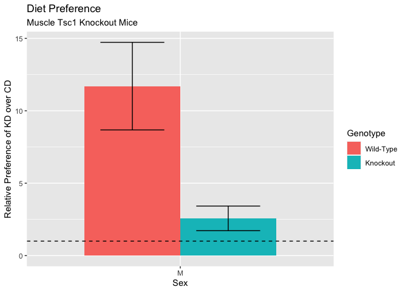
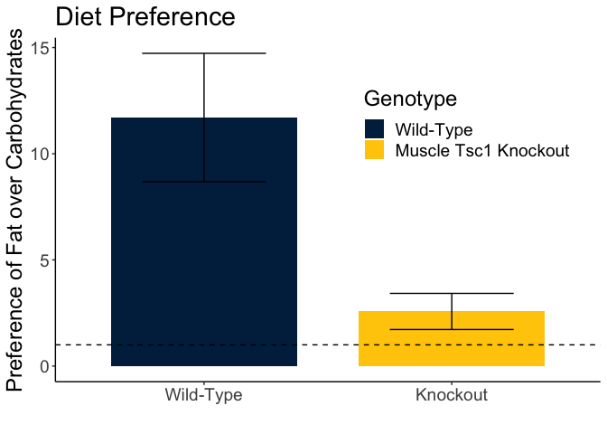
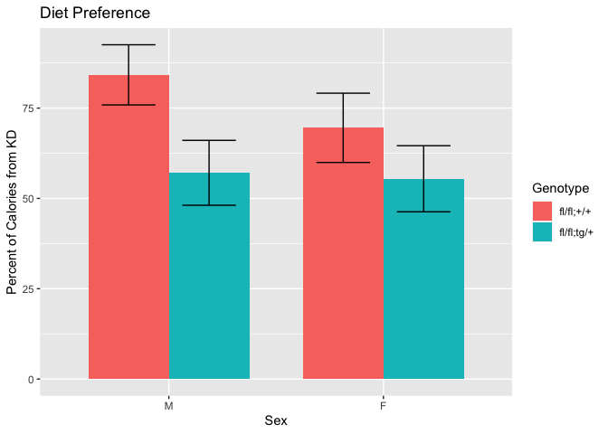
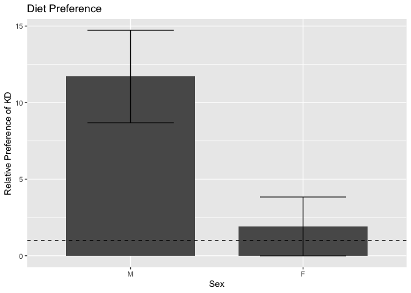

These data can be found in **/Users/davebrid/Documents/GitHub/TissueSpecificTscKnockouts/Mouse Data/Muscle Tsc1 Knockout** in a file named **mTSC Macronutrient Preference.csv**.  This script was most recently updated on **Mon Mar 30 13:15:49 2020**.

# Analysis


Table: Animals enrolled in this study

Sex   Genotype       n
----  -----------  ---
M     fl/fl;+/+      6
M     fl/fl;tg/+     9
F     fl/fl;+/+     11
F     fl/fl;tg/+     9


Table: Calculated data for each cage.

 ear.tag  Sex   Genotype       KDC    KD   Total   KD.Pref   KD.Pct
--------  ----  -----------  -----  ----  ------  --------  -------
    7454  M     fl/fl;+/+      0.2   2.2     2.4    11.000     91.7
    7461  M     fl/fl;+/+      0.1   1.9     2.0    19.000     95.0
    7462  M     fl/fl;+/+      0.1   2.1     2.2    21.000     95.5
    7766  M     fl/fl;+/+      6.4   4.8    11.2     0.750     42.9
    7928  M     fl/fl;+/+      0.9   7.4     8.3     8.222     89.2
    7929  M     fl/fl;+/+      0.4   4.1     4.5    10.250     91.1
    7428  F     fl/fl;+/+      0.6   6.6     7.2    11.000     91.7
    7429  F     fl/fl;+/+      0.5   7.6     8.1    15.200     93.8
    7431  F     fl/fl;+/+      3.6   4.8     8.4     1.333     57.1
    7896  F     fl/fl;+/+      8.6   4.2    12.8     0.488     32.8
    7931  F     fl/fl;+/+      7.0   6.4    13.4     0.914     47.8
    7932  F     fl/fl;+/+      5.4   6.9    12.3     1.278     56.1
    8336  F     fl/fl;+/+     -1.1   6.0     4.9    -5.455    122.4
    8337  F     fl/fl;+/+      2.4   5.7     8.1     2.375     70.4
    8338  F     fl/fl;+/+     -0.8   5.9     5.1    -7.375    115.7
    8339  F     fl/fl;+/+      7.5   5.5    13.0     0.733     42.3
    8379  F     fl/fl;+/+      8.6   4.6    13.2     0.535     34.8
    7425  M     fl/fl;tg/+      NA   3.1      NA        NA       NA
    7426  M     fl/fl;tg/+     7.5   2.7    10.2     0.360     26.5
    7427  M     fl/fl;tg/+     1.5   9.1    10.6     6.067     85.8
    7455  M     fl/fl;tg/+      NA   0.1      NA        NA       NA
    7456  M     fl/fl;tg/+     0.5   2.7     3.2     5.400     84.4
    7555  M     fl/fl;tg/+     3.3    NA      NA        NA       NA
    7893  M     fl/fl;tg/+     3.7   8.3    12.0     2.243     69.2
    7894  M     fl/fl;tg/+     6.5   6.5    13.0     1.000     50.0
    7927  M     fl/fl;tg/+     6.6   2.4     9.0     0.364     26.7
    7457  F     fl/fl;tg/+     0.9   2.8     3.7     3.111     75.7
    7460  F     fl/fl;tg/+     2.3   1.2     3.5     0.522     34.3
    7464  F     fl/fl;tg/+     0.4   1.6     2.0     4.000     80.0
    7466  F     fl/fl;tg/+     1.2   2.4     3.6     2.000     66.7
    7467  F     fl/fl;tg/+     0.4   2.3     2.7     5.750     85.2
    7897  F     fl/fl;tg/+     1.9   8.1    10.0     4.263     81.0
    7898  F     fl/fl;tg/+    17.5   6.3    23.8     0.360     26.5
    7899  F     fl/fl;tg/+    14.1   7.5    21.6     0.532     34.7
    8380  F     fl/fl;tg/+    23.7   4.2    27.9     0.177     15.1


Sex   Genotype      Preference   Preference.Error   PReference.SD   Percent   Percent.Error    N
----  -----------  -----------  -----------------  --------------  --------  --------------  ---
M     fl/fl;+/+          11.70              3.024            7.41      84.2            8.33    6
M     fl/fl;tg/+          2.57              0.851              NA      57.1            8.98    9
F     fl/fl;+/+           1.91              1.923            6.38      69.5            9.59   11
F     fl/fl;tg/+          2.30              0.687            2.06      55.5            9.15    9

## Statistics


Table: Genotype and Sex Dependent Effects on Relative Preference.

term                  estimate   std.error   statistic   p.value
-------------------  ---------  ----------  ----------  --------
(Intercept)               8.74        1.91        4.59     0.000
SexF                     -5.21        2.06       -2.54     0.017
Genotypefl/fl;tg/+       -3.20        2.00       -1.61     0.119


Table: Genotype and Sex Dependent Effects on Relative Preference.  Model with moderating effect of sex on genotype.

term                       estimate   std.error   statistic   p.value
------------------------  ---------  ----------  ----------  --------
(Intercept)                   11.70        2.11        5.55     0.000
SexF                          -9.79        2.62       -3.73     0.001
Genotypefl/fl;tg/+            -9.13        2.98       -3.06     0.005
SexF:Genotypefl/fl;tg/+        9.52        3.78        2.52     0.018


Table: Sex Dependent Effects on Relative Preference, wild-type only.

term           estimate   std.error   statistic   p.value
------------  ---------  ----------  ----------  --------
(Intercept)       11.70        2.75        4.25     0.001
SexF              -9.79        3.42       -2.86     0.012

## Boxplots

<!-- -->

<!-- -->


## Barplots








# Interpretation

There is a preference towards control diet over the ketogenic diet.

# Session Information


```r
sessionInfo()
```

```
## R version 3.6.3 (2020-02-29)
## Platform: x86_64-apple-darwin15.6.0 (64-bit)
## Running under: macOS Catalina 10.15.3
## 
## Matrix products: default
## BLAS:   /Library/Frameworks/R.framework/Versions/3.6/Resources/lib/libRblas.0.dylib
## LAPACK: /Library/Frameworks/R.framework/Versions/3.6/Resources/lib/libRlapack.dylib
## 
## locale:
## [1] en_US.UTF-8/en_US.UTF-8/en_US.UTF-8/C/en_US.UTF-8/en_US.UTF-8
## 
## attached base packages:
## [1] stats     graphics  grDevices utils     datasets  methods   base     
## 
## other attached packages:
## [1] forcats_0.5.0      ggplot2_3.3.0.9000 broom_0.5.5        readr_1.3.1       
## [5] dplyr_0.8.5        tidyr_1.0.2        knitr_1.28        
## 
## loaded via a namespace (and not attached):
##  [1] Rcpp_1.0.4       pillar_1.4.3     compiler_3.6.3   highr_0.8       
##  [5] tools_3.6.3      digest_0.6.25    evaluate_0.14    lifecycle_0.2.0 
##  [9] tibble_2.1.3     nlme_3.1-144     gtable_0.3.0     lattice_0.20-38 
## [13] pkgconfig_2.0.3  rlang_0.4.5      yaml_2.2.1       xfun_0.12       
## [17] withr_2.1.2      stringr_1.4.0    generics_0.0.2   vctrs_0.2.4     
## [21] hms_0.5.3        grid_3.6.3       tidyselect_1.0.0 glue_1.3.2      
## [25] R6_2.4.1         rmarkdown_2.1    farver_2.0.3     purrr_0.3.3     
## [29] magrittr_1.5     backports_1.1.5  scales_1.1.0     htmltools_0.4.0 
## [33] assertthat_0.2.1 colorspace_1.4-1 labeling_0.3     stringi_1.4.6   
## [37] munsell_0.5.0    crayon_1.3.4
```
