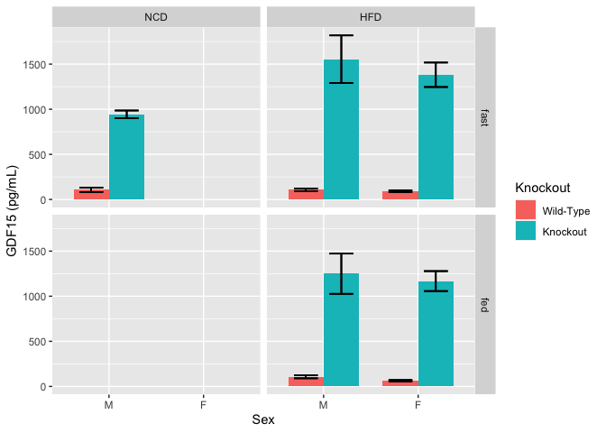
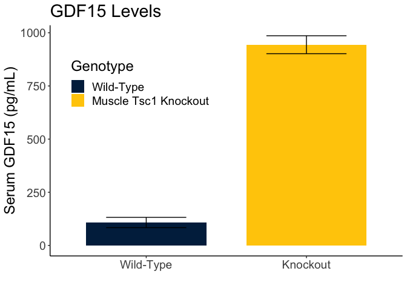
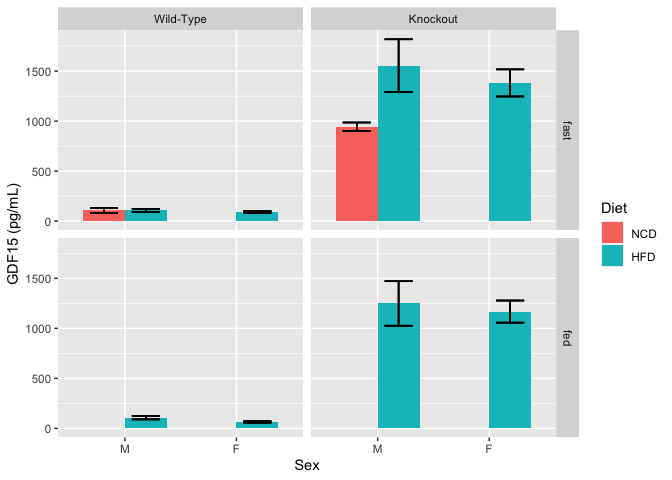
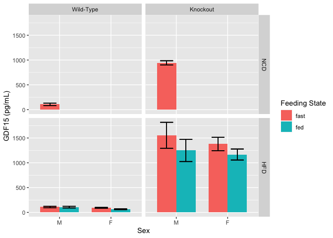

# Purpose

# Experimental Details

Used Quantikine ELISA Assay (catalog number MGD150), following manufacturers instructions available at https://resources.rndsystems.com/pdfs/datasheets/mgd150.pdf.  Used 15 uL of frozen serum in each case unless otherwise noted in the datasheet.

# Raw Data

The absorbance values were converted to amounts of serum GDF15 using the MyAssays webtool at https://www.myassays.com/.  


These data can be found in **/Users/davebrid/Documents/GitHub/TissueSpecificTscKnockouts/Mouse Data/Muscle Tsc1 Knockout** in a file named **mTSC GDF15 ELISA.csv**.  This script was most recently updated on **Fri Mar 27 09:30:51 2020**.

# Analysis

First we summarized the data by feeding state, sex, diet and genotype.


Table: Summary of GDF15 by group

Diet   Sex   Feeding State   Knockout      GDF15   GDF15.se   GDF15.n   GDF15.shapiro
-----  ----  --------------  ----------  -------  ---------  --------  --------------
NCD    M     fast            Wild-Type     108.0      24.21         4           0.045
NCD    M     fast            Knockout      943.8      42.17         2              NA
HFD    M     fast            Wild-Type     109.0      14.95        11           0.086
HFD    M     fast            Knockout     1553.9     263.43         4           0.014
HFD    M     fed             Wild-Type     107.5      17.79        11           0.518
HFD    M     fed             Knockout     1248.8     221.71         6           0.133
HFD    F     fast            Wild-Type      90.6       9.32        11           0.168
HFD    F     fast            Knockout     1381.5     135.32        12           0.322
HFD    F     fed             Wild-Type      64.0       6.72        12           0.498
HFD    F     fed             Knockout     1168.0     110.39        13           0.839

Normality could not be assumed for the following groups:


Table: Groups wherin GDF15 normality cannot be assumed

Diet   Sex   Feeding State   Knockout     GDF15   GDF15.se   GDF15.n   GDF15.shapiro
-----  ----  --------------  ----------  ------  ---------  --------  --------------
NCD    M     fast            Wild-Type      108       24.2         4           0.045
HFD    M     fast            Knockout      1554      263.4         4           0.014

## Lack of Normality Visualizations


The only groups that were not normally distributed was a small group (n=4) with a single outlier.  These were the HFD, M, fasted, knockout group and the NCD, M, fasted, wild-type group.  Any comparasons to using these groups would use the Mann-Whitney non-parametric test.

Here are the respective pairwise tests


Table: Pairwise tests for effects of knockout in each group, unadjusted

Diet   Sex   Feeding State    Fold.Increase   Mann.Whitney   Levene      Welch    Student
-----  ----  --------------  --------------  -------------  -------  ---------  ---------
NCD    M     fast                       7.7       1.33e-01    0.699   6.51e-03   4.75e-05
HFD    M     fast                      13.3       1.47e-03    0.104   1.18e-02   2.76e-07
HFD    M     fed                       10.6       1.08e-03    0.025   3.54e-03   3.69e-06
HFD    F     fast                      14.2       5.52e-05    0.001   1.13e-06   1.00e-08
HFD    F     fed                       17.2       3.85e-07    0.000   3.43e-07   2.00e-09

Graphed these as barplots, looking at effects of knockout, diet and sex.





    
    






# Interpretation

There was a dramatic approximately 10 fold increase in GDF15 levels accross all conditions.  All the effects were significant between wild-type and knockouts.  There was only modest effects of diet, which could be confounded by the different ages of the animals and no apparent effects of sex.  Being in the fed state slightly, but not significantly reduced GDF15 levels.

# Session Information


```r
sessionInfo()
```

```
## R version 3.6.3 (2020-02-29)
## Platform: x86_64-apple-darwin15.6.0 (64-bit)
## Running under: macOS Catalina 10.15.3
## 
## Matrix products: default
## BLAS:   /Library/Frameworks/R.framework/Versions/3.6/Resources/lib/libRblas.0.dylib
## LAPACK: /Library/Frameworks/R.framework/Versions/3.6/Resources/lib/libRlapack.dylib
## 
## locale:
## [1] en_US.UTF-8/en_US.UTF-8/en_US.UTF-8/C/en_US.UTF-8/en_US.UTF-8
## 
## attached base packages:
## [1] stats     graphics  grDevices utils     datasets  methods   base     
## 
## other attached packages:
## [1] car_3.0-7          carData_3.0-3      ggplot2_3.3.0.9000 readr_1.3.1       
## [5] dplyr_0.8.5        tidyr_1.0.2        knitr_1.28        
## 
## loaded via a namespace (and not attached):
##  [1] zip_2.0.4         Rcpp_1.0.4        cellranger_1.1.0  pillar_1.4.3     
##  [5] compiler_3.6.3    highr_0.8         forcats_0.5.0     tools_3.6.3      
##  [9] digest_0.6.25     evaluate_0.14     lifecycle_0.2.0   tibble_2.1.3     
## [13] gtable_0.3.0      pkgconfig_2.0.3   rlang_0.4.5       openxlsx_4.1.4   
## [17] curl_4.3          yaml_2.2.1        haven_2.2.0       xfun_0.12        
## [21] rio_0.5.16        withr_2.1.2       stringr_1.4.0     vctrs_0.2.4      
## [25] hms_0.5.3         grid_3.6.3        tidyselect_1.0.0  data.table_1.12.8
## [29] glue_1.3.2        R6_2.4.1          readxl_1.3.1      foreign_0.8-75   
## [33] rmarkdown_2.1     purrr_0.3.3       farver_2.0.3      magrittr_1.5     
## [37] ellipsis_0.3.0    scales_1.1.0      htmltools_0.4.0   abind_1.4-5      
## [41] assertthat_0.2.1  colorspace_1.4-1  labeling_0.3      stringi_1.4.6    
## [45] munsell_0.5.0     crayon_1.3.4
```
