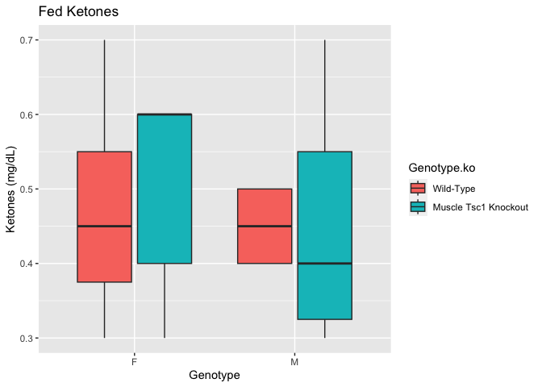
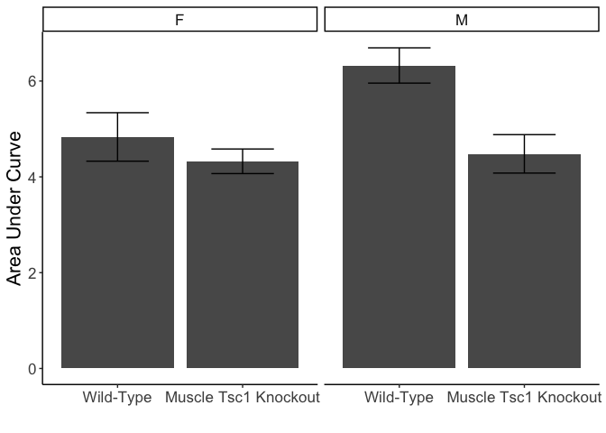

This script was most recently run on Fri Jun  2 10:13:06 2023 and can be found in /Users/davebrid/Documents/GitHub/TissueSpecificTscKnockouts/Mouse Data/Muscle Tsc1 Knockout/Ketone Tolerance.

# Purpose


# Experimental Details

Beta hydroxybutyrate was injected at 1g/kg into fed mice around 14:00 PM, ketone levels were assessed via tail vein injection using strips.

# Raw Data


```r
raw_data_file <- "Muscle TSC Ketone Tolerance Data.csv"


library(readr) 
measurement.data <- read_csv(raw_data_file)

library(lubridate)
measurement.data$parsed.experiment.date <- ymd(measurement.data$experiment.date)

genotype.problems <- c() #animals where we are unsure about the genotype/treatment

ketone.data <- 
  filter(measurement.data, assay=='Ketone Bodies') %>%
  separate(values, sep=',', into=paste0("t",seq(0,120, by=15))) %>%
  select(age,Genotype,t0:t120,Genotype,animal.id,MouseID,Sex) %>%
  mutate(ITT = if_else(is.na(t15), "No","Yes")) %>%
  mutate(FK = as.numeric(t0)/10) %>%
  mutate_at(.vars=3:11, .funs=funs(as.numeric(.)/10)) %>%
  mutate(Genotype.ko = case_when(Genotype=='fl/fl; Tg/+'~"Muscle Tsc1 Knockout",
                                 TRUE~"Wild-Type")) %>%
  mutate(Genotype.ko = relevel(as.factor(Genotype.ko), ref="Wild-Type"))

ketone.data <- 
  ketone.data %>% 
  mutate(AUC = rowSums(ketone.data[3:7]))

ketone.data.norm <-
  ketone.data %>%
  filter(ITT=="Yes") %>%
  filter(!(MouseID %in% genotype.problems)) %>% #removed animals with incorrect genotype
  mutate(t15=t15/t0*100,
         t30=t30/t0*100,
         t45=t45/t0*100,
         t60=t60/t0*100,
         t75=t75/t0*100,
         t90=t90/t0*100,
         t105=t105/t0*100,
         t120=t120/t0*100,
         t0=t0/t0*100) 


kable(ketone.data %>% 
        filter(ITT=="Yes") %>% 
        select(MouseID, Genotype, Sex, FK) %>%
        arrange(MouseID, Genotype),caption="Animals who underwent an KTT")
```


Table: Animals who underwent an KTT

| MouseID|Genotype    |Sex |  FK|
|-------:|:-----------|:---|---:|
|    8609|fl/fl; Tg/+ |M   | 0.3|
|    8610|fl/fl; +/+  |F   | 0.3|
|    8611|fl/fl; +/+  |F   | 0.5|
|    8612|fl/fl; Tg/+ |F   | 0.6|
|    8613|fl/fl; +/+  |F   | 0.4|
|    8614|fl/fl; Tg/+ |F   | 0.3|
|    8943|fl/fl; Tg/+ |M   | 0.3|
|    8944|fl/fl; Tg/+ |M   | 0.4|
|    8945|fl/fl; Tg/+ |M   | 0.4|
|    8946|fl/fl; Tg/+ |M   | 0.4|
|    8947|fl/fl; Tg/+ |M   | 0.3|
|    8948|fl/fl; Tg/+ |F   | 0.4|
|    8949|fl/fl; Tg/+ |F   | 0.6|
|    8950|fl/fl; Tg/+ |F   | 0.6|
|    8951|fl/fl; +/+  |F   | 0.7|
|    9235|fl/fl; Tg/+ |M   | 0.7|
|    9238|fl/fl; +/+  |M   | 0.5|
|    9239|fl/fl; +/+  |M   | 0.5|
|    9240|fl/fl; Tg/+ |M   | 0.6|
|    9241|fl/fl; +/+  |M   | 0.4|
|    9309|fl/fl; Tg/+ |M   | 0.4|
|    9314|fl/fl; Tg/+ |M   | 0.7|
|    9315|fl/fl; +/+  |M   | 0.4|

```r
ketone.data %>%
  filter(ITT=="Yes") %>% 
  group_by(Genotype,Sex) %>%
  count %>%
  kable(caption="Animals evaluated by KTT in each group")
```


Table: Animals evaluated by KTT in each group

|Genotype    |Sex |  n|
|:-----------|:---|--:|
|fl/fl; +/+  |F   |  4|
|fl/fl; +/+  |M   |  4|
|fl/fl; Tg/+ |F   |  5|
|fl/fl; Tg/+ |M   | 10|


# Analysis


```r
ketone.summary <-
  ketone.data %>%
  group_by(Genotype.ko, Sex) %>%
  summarize(FK.mean = mean(FK, na.rm=T),
            FK.se = se(FK),
            FK.sd = sd(FK,na.rm=T),
            N = length(FK))

kable(ketone.summary, caption="Summary statistics for analysis of fasting ketone levels")
```


Table: Summary statistics for analysis of fasting ketone levels

|Genotype.ko          |Sex | FK.mean| FK.se| FK.sd|  N|
|:--------------------|:---|-------:|-----:|-----:|--:|
|Wild-Type            |F   |   0.475| 0.085| 0.171|  4|
|Wild-Type            |M   |   0.450| 0.029| 0.058|  4|
|Muscle Tsc1 Knockout |F   |   0.500| 0.063| 0.141|  5|
|Muscle Tsc1 Knockout |M   |   0.450| 0.050| 0.158| 10|

```r
ketone.summary.auc <-
  ketone.data %>%
  group_by(Genotype.ko, Sex) %>%
  summarize(AUC.mean = mean(AUC, na.rm=T),
            AUC.se = se(AUC),
            AUC.sd = sd(AUC,na.rm=T),
            N = length(AUC))

kable(ketone.summary.auc, caption="Summary statistics for analysis of ketone levels (area under the curve)")
```


Table: Summary statistics for analysis of ketone levels (area under the curve)

|Genotype.ko          |Sex | AUC.mean| AUC.se| AUC.sd|  N|
|:--------------------|:---|--------:|------:|------:|--:|
|Wild-Type            |F   |     4.83|  0.506|  1.012|  4|
|Wild-Type            |M   |     6.33|  0.368|  0.737|  4|
|Muscle Tsc1 Knockout |F   |     4.33|  0.257|  0.574|  5|
|Muscle Tsc1 Knockout |M   |     4.48|  0.401|  1.269| 10|

## Fed Ketone Levels


```r
library(ggplot2)
ggplot(filter(ketone.data, ITT=="Yes"),
            aes(y=FK, x=Sex, fill=Genotype.ko)) +
  geom_boxplot() +
  labs(title="Fed Ketones",
       y="Ketones (mg/dL)",
       x="Genotype")
```




```r
ggplot(ketone.summary,
       aes(y=FK.mean,
           ymin = FK.mean - FK.se,
           ymax = FK.mean + FK.se,
           x = Sex,
           fill= Genotype.ko)) +
  geom_bar(stat='identity', position='dodge', width=0.75) +
  geom_errorbar(position=position_dodge(width=0.75), width=0.5) +
  labs(y='Fed Blood Ketones (mg/dL)',
       x='')
```


### Fasting ketone Statistics


```r
library(broom)
fk.aov <- aov(FK~Sex+Genotype, data=ketone.data)
tidy(fk.aov) %>% kable(caption="ANOVA for effects of fasting ketone")
```


Table: ANOVA for effects of fasting ketone

|term      | df| sumsq| meansq| statistic| p.value|
|:---------|--:|-----:|------:|---------:|-------:|
|Sex       |  1| 0.008|  0.008|     0.411|   0.529|
|Genotype  |  1| 0.001|  0.001|     0.030|   0.864|
|Residuals | 20| 0.403|  0.020|        NA|      NA|

## Ketone Tolerance Test


```r
time <- seq(0,120,by=15)
ktt.data.long <- 
  ketone.data %>%
  filter(ITT=="Yes") %>%
  select(-age) %>%
  group_by(Genotype, Sex,animal.id) %>%
  gather(`t0`:`t120`,key='TimeStamp', value="ketone") %>%
  separate(TimeStamp, sep="t", into=c("Letter","Time")) %>%
  mutate(ketone = as.numeric(ketone)) %>%
  mutate(Time = as.numeric(Time))

ktt.data.long.norm <- 
  ketone.data.norm %>%
  filter(ITT=="Yes") %>%
  select(-age) %>%
  group_by(animal.id,Genotype, Sex) %>%
  gather(`t0`:`t120`,key='TimeStamp', value="ketone") %>%
  separate(TimeStamp, sep="t", into=c("Letter","Time")) %>%
  mutate(ketone = as.numeric(ketone)) %>%
  mutate(Time = as.numeric(Time))

ggplot(ktt.data.long,
            aes(y=ketone, x=Time, col=Genotype)) +
  geom_point() +
  facet_grid(.~Sex) +
  geom_smooth(method="loess") +
  labs(title="Ketone Tolerance Test",
       subtitle="4 Days of KD",
       y="Blood Ketones (mg/dL)") 
```


```r
ggplot(ktt.data.long.norm,
            aes(y=ketone, x=Time, col=Genotype)) +
  geom_point() +
    facet_grid(.~Sex) +
  geom_smooth(method="loess") +
  labs(title="Ketone Tolerance Test",
       subtitle="4 Days of KD",
       y="Blood Ketones (% of Initial)") 
```


```r
ktt.data.long %>%
  group_by(Time,Genotype.ko, Sex) %>%
  summarize(Average = mean(ketone, na.rm=T),
            Error = se(ketone)) %>%
ggplot(aes(y=Average,
           ymax=Average+Error,
           ymin=Average-Error,
           x=Time, col=Genotype.ko)) +
  geom_point() +
  geom_line() +
  facet_grid(.~Sex) +
  geom_errorbar() +
  labs(title="Ketone Tolerance Test",
       y="Blood Ketones (mg/dL)") 
```

<!-- -->

```r
ktt.data.long %>%
  filter(Time<=60) %>%
  group_by(Time,Genotype.ko, Sex) %>%
  summarize(Average = mean(ketone, na.rm=T),
            Error = se(ketone)) %>%
ggplot(aes(y=Average,
           ymax=Average+Error,
           ymin=Average-Error,
           x=Time, lty=Genotype.ko)) +
  geom_point() +
  geom_line() +
  facet_grid(.~Sex) +
  geom_errorbar() +
  labs(title="BHB Tolerance Test",
       y="Blood Ketones (mg/dL)",
       x="Time (min)") +
  theme_classic() +
  theme(text=element_text(size=16),
        legend.position=c(0.4,0.85),
        legend.title=element_blank())
```

<!-- -->

```r
ktt.data.long.norm %>%
  group_by(Time,Genotype,Sex) %>%
  summarize(Average = mean(ketone),
            Error = se(ketone)) %>%
ggplot(aes(y=Average,
           ymax=Average+Error,
           ymin=Average-Error,
           x=Time, col=Genotype)) +
  facet_grid(.~Sex) +
  geom_point() +
  geom_line() +
  geom_errorbar() +
  labs(title="Ketone Tolerance Test",
       y="Blood Ketones (% of initial)") 
```

<!-- -->


```r
ktt.data.long %>%
  group_by(Time,Genotype, Sex) %>%
  summarize(Average = mean(ketone),
            Error = se(ketone)) %>%
ggplot(aes(y=Average,
           ymax=Average+Error,
           ymin=Average-Error,
           x=Time, col=Genotype)) +
  geom_point() +
  geom_line() +
    facet_grid(.~Sex) +
  geom_errorbar() +
  labs(title="Ketone Tolerance Test",
       y="Blood Ketones (mg/dL)") + 
  theme_classic() + # to get the overall layout
  theme(text = element_text(size=18)) # to increase font
```

<!-- -->


```r
ktt.data.long %>%
  filter(Sex=="F", Time<=60) %>%
  group_by(Time,Genotype) %>%
  summarize(Average = mean(ketone),
            Error = se(ketone)) %>%
ggplot(aes(y=Average,
           ymax=Average+Error,
           ymin=Average-Error,
           x=Time, col=Genotype)) +
  geom_point() +
  geom_line() +
  geom_errorbar() +
  labs(title="Ketone Tolerance Test",
       y="Blood Ketones (mg/dL)") +
  scale_color_manual(values=color.scheme,
                     labels=c("Wild-Type","Muscle Tsc1 Knockout")) +
  theme_classic() +
  theme(legend.position=c(0.75,0.75),
        text=element_text(size=18))
```


### Calculated based on AUC


```r
ggplot(ketone.summary.auc,
       aes(y=AUC.mean,
           ymin=AUC.mean-AUC.se,
           ymax=AUC.mean+AUC.se,
           x=Genotype.ko)) +
  geom_bar(stat='identity') +
  geom_errorbar(width=0.5) +
  facet_grid(~Sex) +
  labs(y='Area Under Curve',
       x="") +
  theme_classic() +
  theme(text=element_text(size=16))
```

<!-- -->

```r
lm(AUC~Sex+Genotype.ko,data=ketone.data) %>% tidy %>%
  kable(caption="2x2 ANOVA for sex and genotype for AUC")
```


Table: 2x2 ANOVA for sex and genotype for AUC

|term                            | estimate| std.error| statistic| p.value|
|:-------------------------------|--------:|---------:|---------:|-------:|
|(Intercept)                     |    5.311|     0.501|     10.60|   0.000|
|SexM                            |    0.656|     0.506|      1.30|   0.211|
|Genotype.koMuscle Tsc1 Knockout |   -1.344|     0.506|     -2.65|   0.016|

```r
lm(AUC~Sex+Genotype.ko+Sex:Genotype.ko,data=ketone.data) %>% tidy %>%
  kable(caption="2x2 ANOVA for sex and genotype for AUC, including interaction")
```


Table: 2x2 ANOVA for sex and genotype for AUC, including interaction

|term                                 | estimate| std.error| statistic| p.value|
|:------------------------------------|--------:|---------:|---------:|-------:|
|(Intercept)                          |    4.833|     0.613|     7.886|   0.000|
|SexM                                 |    1.492|     0.811|     1.840|   0.083|
|Genotype.koMuscle Tsc1 Knockout      |   -0.508|     0.811|    -0.627|   0.539|
|SexM:Genotype.koMuscle Tsc1 Knockout |   -1.337|     1.026|    -1.303|   0.210|

## KTT Statistics

### Male Mixed Linear Models


```r
library(lme4)
library(lmerTest)
lme.geno <- lmer(ketone ~ as.factor(Time) + Genotype.ko + (1|animal.id), data= ktt.data.long %>% 
       filter(Sex=="M"))
lme.null <- lmer(ketone ~ as.factor(Time) + (1|animal.id), data= ktt.data.long %>% 
       filter(Sex=="M"))

anova(lme.geno, lme.null) %>% tidy %>% kable(caption="Comparason of mixed linear models with or without a genotype term for male mice only")
```


Table: Comparason of mixed linear models with or without a genotype term for male mice only

|term     | npar|  AIC|  BIC| logLik| deviance| statistic| df| p.value|
|:--------|----:|----:|----:|------:|--------:|---------:|--:|-------:|
|lme.null |    9| 49.6| 71.9|  -15.8|     31.6|        NA| NA|      NA|
|lme.geno |   10| 44.9| 69.7|  -12.5|     24.9|      6.64|  1|    0.01|

```r
#anova(lme.geno) %>% tidy %>% kable(caption="Model terms for mixed linear model, male mice only")
fixef(lme.geno) %>% tidy %>% kable(caption="Effect sizes for mixed linear model, female mice only")
```


Table: Effect sizes for mixed linear model, female mice only

|names                           |      x|
|:-------------------------------|------:|
|(Intercept)                     |  0.680|
|as.factor(Time)15               |  1.500|
|as.factor(Time)30               |  0.807|
|as.factor(Time)45               |  0.279|
|as.factor(Time)60               |  0.171|
|as.factor(Time)75               | -0.066|
|as.factor(Time)90               | -0.155|
|Genotype.koMuscle Tsc1 Knockout | -0.323|

```r
ktt.summary.male <-
  ktt.data.long %>% 
  filter(Sex=="M", Time<=60) %>%
  group_by(Time) %>%
  summarize(WT.KB = mean(ketone[Genotype=="fl/fl; +/+"],na.rm=T),
            KO.KB = mean(ketone[Genotype=="fl/fl; Tg/+"], na.rm=T),
            p.val = t.test(ketone~Genotype, var.equal=T)$p.value) %>%
  mutate(Pct.Difference = (WT.KB-KO.KB)/WT.KB*100) 

ktt.summary.male %>%
  kable(caption="Student's t-tests at each time point, males only")
```


Table: Student's t-tests at each time point, males only

| Time| WT.KB| KO.KB| p.val| Pct.Difference|
|----:|-----:|-----:|-----:|--------------:|
|    0| 0.450|  0.45| 1.000|            0.0|
|   15| 2.250|  1.83| 0.183|           18.7|
|   30| 1.875|  1.01| 0.001|           46.1|
|   45| 0.975|  0.63| 0.020|           35.4|
|   60| 0.775|  0.56| 0.133|           27.7|


The male mice had lower ketone levels during the Ketone tolerance test (p=0.01).  On average ketone levels were 33.395% lower in the male knockout mice.

### Female Mixed Linear Models


```r
lme.geno <- lmer(ketone ~ as.factor(Time) + Genotype + (1|animal.id), data= ktt.data.long %>% 
       filter(Sex=="F"))
lme.null <- lmer(ketone ~ as.factor(Time) + (1|animal.id), data= ktt.data.long %>% 
       filter(Sex=="F"))

anova(lme.geno, lme.null) %>% tidy %>% kable(caption="Comparason of mixed linear models with or without a genotype term for female mice only")
```


Table: Comparason of mixed linear models with or without a genotype term for female mice only

|term     | npar|  AIC|  BIC| logLik| deviance| statistic| df| p.value|
|:--------|----:|----:|----:|------:|--------:|---------:|--:|-------:|
|lme.null |    9| 35.7| 52.9|  -8.83|     17.7|        NA| NA|      NA|
|lme.geno |   10| 35.0| 54.1|  -7.50|     15.0|      2.66|  1|   0.103|

```r
#anova(lme.geno) %>% tidy %>% kable(caption="Model terms for mixed linear model, female mice only")
fixef(lme.geno) %>% tidy %>% kable(caption="Effect sizes for mixed linear model, female mice only")
```


Table: Effect sizes for mixed linear model, female mice only

|names               |      x|
|:-------------------|------:|
|(Intercept)         |  0.607|
|as.factor(Time)15   |  1.311|
|as.factor(Time)30   |  0.567|
|as.factor(Time)45   |  0.256|
|as.factor(Time)60   |  0.052|
|as.factor(Time)75   | -0.066|
|as.factor(Time)90   | -0.178|
|Genotypefl/fl; Tg/+ | -0.212|

```r
ktt.summary.female <-
  ktt.data.long %>% 
  filter(Sex=="F", Time<=60) %>%
  group_by(Time) %>%
  summarize(WT.KB = mean(ketone[Genotype=="fl/fl; +/+"],na.rm=T),
            KO.KB = mean(ketone[Genotype=="fl/fl; Tg/+"], na.rm=T),
            p.val = t.test(ketone~Genotype, var.equal=T)$p.value) %>%
  mutate(Pct.Difference = (WT.KB-KO.KB)/WT.KB*100) 

ktt.summary.female %>%
  kable(caption="Student's t-tests at each time point, females only")
```


Table: Student's t-tests at each time point, females only

| Time| WT.KB| KO.KB| p.val| Pct.Difference|
|----:|-----:|-----:|-----:|--------------:|
|    0| 0.475| 0.500| 0.817|          -5.26|
|   15| 2.200| 1.480| 0.054|          32.73|
|   30| 1.375| 0.800| 0.018|          41.82|
|   45| 0.825| 0.680| 0.190|          17.58|
|   60| 0.333| 0.675| 0.008|        -102.50|

The female mice had lower ketone levels during the Ketone tolerance test (p=0.103).  On average ketone levels were 30.707% lower in the female knockout mice.

### Mixed Linear Models - Both Sexes Combined


```r
lme.geno <- lmer(ketone ~ as.factor(Time) + Genotype + (1|animal.id), data= ktt.data.long %>% 
       filter(Time<=60))
lme.null <- lmer(ketone ~ as.factor(Time) + (1|animal.id), data= ktt.data.long %>% 
       filter(Time<=60))

anova(lme.geno, lme.null) %>% tidy %>% kable(caption="Comparason of mixed linear models with or without a genotype term for all mice")
```


Table: Comparason of mixed linear models with or without a genotype term for all mice

|term     | npar|  AIC|  BIC| logLik| deviance| statistic| df| p.value|
|:--------|----:|----:|----:|------:|--------:|---------:|--:|-------:|
|lme.null |    7| 72.4| 91.5|  -29.2|     58.4|        NA| NA|      NA|
|lme.geno |    8| 66.0| 87.8|  -25.0|     50.0|      8.45|  1|   0.004|

```r
#anova(lme.geno) %>% tidy %>% kable(caption="Model terms for mixed linear model, female mice only")
fixef(lme.geno) %>% tidy %>% kable(caption="Effect sizes for mixed linear model, female mice only")
```


Table: Effect sizes for mixed linear model, female mice only

|names               |      x|
|:-------------------|------:|
|(Intercept)         |  0.661|
|as.factor(Time)15   |  1.426|
|as.factor(Time)30   |  0.713|
|as.factor(Time)45   |  0.270|
|as.factor(Time)60   |  0.128|
|Genotypefl/fl; Tg/+ | -0.301|

```r
#is there an effect of sex
lme.sex <- lmer(ketone ~ as.factor(Time) + Sex + Genotype + (1|animal.id), data= ktt.data.long %>% 
       filter(Time<=60))
lme.null.sex <- lmer(ketone ~ as.factor(Time) + Sex + (1|animal.id), data= ktt.data.long %>% 
       filter(Time<=60))
lme.sex.int <- lmer(ketone ~ as.factor(Time) + Sex + as.factor(Time):Sex  + Genotype + (1|animal.id), data= ktt.data.long %>% 
       filter(Time<=60))
anova(lme.sex,lme.geno) %>% tidy %>% kable(caption="Chi-squared test for the moderating effect of sex on ketone body levels during the KTT")
```


Table: Chi-squared test for the moderating effect of sex on ketone body levels during the KTT

|term     | npar|  AIC|  BIC| logLik| deviance| statistic| df| p.value|
|:--------|----:|----:|----:|------:|--------:|---------:|--:|-------:|
|lme.geno |    8| 66.0| 87.8|  -25.0|     50.0|        NA| NA|      NA|
|lme.sex  |    9| 66.1| 90.6|  -24.1|     48.1|       1.9|  1|   0.168|

```r
anova(lme.geno) %>% kable(caption="Model coefficients for the model not including sex")
```


Table: Model coefficients for the model not including sex

|                | Sum Sq| Mean Sq| NumDF| DenDF| F value| Pr(>F)|
|:---------------|------:|-------:|-----:|-----:|-------:|------:|
|as.factor(Time) | 30.580|   7.645|     4|  86.2|  101.27|  0.000|
|Genotype        |  0.699|   0.699|     1|  20.9|    9.27|  0.006|

```r
anova(lme.sex) %>% kable(caption="Model coefficients for the model including sex as a moderator")
```


Table: Model coefficients for the model including sex as a moderator

|                | Sum Sq| Mean Sq| NumDF| DenDF| F value| Pr(>F)|
|:---------------|------:|-------:|-----:|-----:|-------:|------:|
|as.factor(Time) | 30.618|   7.654|     4|  86.1|  101.39|  0.000|
|Sex             |  0.130|   0.130|     1|  20.0|    1.72|  0.205|
|Genotype        |  0.805|   0.805|     1|  19.9|   10.67|  0.004|

```r
ktt.summary.all <-
  ktt.data.long %>% 
  filter(Time<=60) %>%
  group_by(Time,Sex) %>%
  summarize(WT.KB = mean(ketone[Genotype=="fl/fl; +/+"],na.rm=T),
            KO.KB = mean(ketone[Genotype=="fl/fl; Tg/+"], na.rm=T),
            p.val = t.test(ketone~Genotype, var.equal=T)$p.value) %>%
  mutate(Pct.Difference = (WT.KB-KO.KB)/WT.KB*100) 

ktt.summary.all %>%
  kable(caption="Student's t-tests at each time point, all mice combined")
```


Table: Student's t-tests at each time point, all mice combined

| Time|Sex | WT.KB| KO.KB| p.val| Pct.Difference|
|----:|:---|-----:|-----:|-----:|--------------:|
|    0|F   | 0.475| 0.500| 0.817|          -5.26|
|    0|M   | 0.450| 0.450| 1.000|           0.00|
|   15|F   | 2.200| 1.480| 0.054|          32.73|
|   15|M   | 2.250| 1.830| 0.183|          18.67|
|   30|F   | 1.375| 0.800| 0.018|          41.82|
|   30|M   | 1.875| 1.010| 0.001|          46.13|
|   45|F   | 0.825| 0.680| 0.190|          17.58|
|   45|M   | 0.975| 0.630| 0.020|          35.38|
|   60|F   | 0.333| 0.675| 0.008|        -102.50|
|   60|M   | 0.775| 0.560| 0.133|          27.74|

The mice had lower ketone levels during the Ketone tolerance test (p=0.004).  On average ketone levels were 17.131% lower in the knockout mice.  There was no signficant moderating (p=0.168) effect of sex on the ketone levels during the KTT, but even including sex as a covariate the effects of muscle *Tsc1* knockout was still significant (p=0.002).

Calculated the area under the curve for each mouse otget a summed example

# Session Information


```r
sessionInfo()
```

```
## R version 4.2.2 (2022-10-31)
## Platform: x86_64-apple-darwin17.0 (64-bit)
## Running under: macOS Big Sur ... 10.16
## 
## Matrix products: default
## BLAS:   /Library/Frameworks/R.framework/Versions/4.2/Resources/lib/libRblas.0.dylib
## LAPACK: /Library/Frameworks/R.framework/Versions/4.2/Resources/lib/libRlapack.dylib
## 
## locale:
## [1] en_US.UTF-8/en_US.UTF-8/en_US.UTF-8/C/en_US.UTF-8/en_US.UTF-8
## 
## attached base packages:
## [1] stats     graphics  grDevices utils     datasets  methods   base     
## 
## other attached packages:
##  [1] lmerTest_3.1-3   lme4_1.1-31      Matrix_1.5-3     broom_1.0.2     
##  [5] ggplot2_3.4.2    lubridate_1.9.0  timechange_0.1.1 readr_2.1.3     
##  [9] dplyr_1.1.2      tidyr_1.3.0      knitr_1.43      
## 
## loaded via a namespace (and not attached):
##  [1] Rcpp_1.0.10         lattice_0.20-45     digest_0.6.31      
##  [4] utf8_1.2.3          R6_2.5.1            backports_1.4.1    
##  [7] evaluate_0.21       highr_0.10          pillar_1.9.0       
## [10] rlang_1.1.1         rstudioapi_0.14     minqa_1.2.5        
## [13] jquerylib_0.1.4     nloptr_2.0.3        rmarkdown_2.21     
## [16] labeling_0.4.2      splines_4.2.2       stringr_1.5.0      
## [19] bit_4.0.5           munsell_0.5.0       numDeriv_2016.8-1.1
## [22] compiler_4.2.2      xfun_0.39           pkgconfig_2.0.3    
## [25] mgcv_1.8-41         htmltools_0.5.5     tidyselect_1.2.0   
## [28] tibble_3.2.1        fansi_1.0.4         crayon_1.5.2       
## [31] tzdb_0.3.0          withr_2.5.0         MASS_7.3-58.1      
## [34] grid_4.2.2          nlme_3.1-161        jsonlite_1.8.4     
## [37] gtable_0.3.3        lifecycle_1.0.3     magrittr_2.0.3     
## [40] scales_1.2.1        cli_3.6.1           stringi_1.7.12     
## [43] vroom_1.6.0         cachem_1.0.8        farver_2.1.1       
## [46] bslib_0.4.2         ellipsis_0.3.2      generics_0.1.3     
## [49] vctrs_0.6.2         boot_1.3-28.1       tools_4.2.2        
## [52] bit64_4.0.5         glue_1.6.2          purrr_1.0.1        
## [55] hms_1.1.2           parallel_4.2.2      fastmap_1.1.1      
## [58] yaml_2.3.7          colorspace_2.1-0    sass_0.4.6
```

