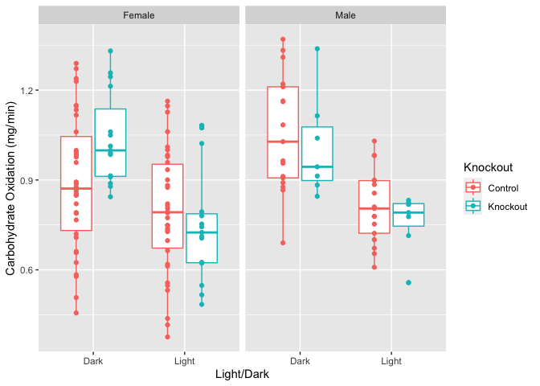

# Purpose

To evaluate energy expenditure and other parameters in muscle _Tsc1_ knockout mice.  This script was most recently updated on **Mon Mar 28 12:23:39 2022**.

# Experimental Details

Mice were run in the CLAMS in several batches, and combined.

# Raw Data

## Sample Key


```r
library(readxl) #loads the readr package
key.filename <- 'mTSC-HFD_CLAMS_Experiment_Key.xlsx' #make this a separate line, you can use any variable you want
key.data <- read_excel(key.filename, sheet = 'Sheet1') %>%
  mutate(Knockout = if_else(Genotype=='fl/fl; Tg/+', 'Knockout','Control')) %>%
  mutate(Mouse = as.factor(Mouse))
```

## Oxymax Input

There are two batches of data, baseline and after 3 months of diet.

### Baseline Data


```r
baseline.folder <- "Oxymax/Oxymax files by time period/Baseline"
baseline.files <- list.files(path=baseline.folder, pattern="*.csv", full.names=T)

mri.folder <- "EchoMRI"
mri.files <- list.files(path=mri.folder, pattern="*.xlsx", full.names=T)

library(readr)
library(lubridate)
library(readxl)

mri.data <- read_excel(mri.files[1]) %>% mutate(Label = as.factor(Label))
for (file in mri.files[2:length(mri.files)]) {
  mri.data <- bind_rows(mri.data, read_excel(file) %>% mutate(Label = as.factor(Label)))
}

#remove repeated mri measurements
mri.data.unique <-
  mri.data %>%
  distinct(Label, .keep_all = T) %>%
  dplyr::select(Label,Fat,Lean,Weight)

read_csv_quiet <-
  function(x) {read_csv(x, show_col_types = F,
                        col_types = cols(Subject=col_factor(levels = NULL)))}

baseline.data <-  
  lapply(baseline.files, read_csv_quiet) %>% 
  #mutate(Subject = as.factor(as.character(Subject))) %>%
  bind_rows() %>%
  dplyr::select(Subject, Interval, `Date/Time`, `Light/Dark`, `Volume O2`, RER, `X Ambulatory`, `Y Ambulatory`,`Volume CO2`,Heat) %>%
  right_join(key.data, by=c('Subject'='Mouse'))  %>% #merged with annotation file %>%
  filter(!Subject %in% c(4791)) %>% #no MRI data for 4791
  mutate(Date.Time = mdy_hms(`Date/Time`)) %>% #parsed datetime
  mutate(Time = hour(Date.Time)) %>% #extracted the hour 
  mutate(Zeitgeber.Time = Time-7) %>% # converted to ZT
  mutate(Activity = `X Ambulatory` + `Y Ambulatory`) %>%
  mutate(Subject = as.factor(Subject)) %>%
  rename(Heat.kw = Heat) %>% #heat is originally in Kcal/h
  mutate(Heat = Heat.kw*1.163) %>% #heat is in kCal/h originally, converted to Watts)
  full_join(mri.data.unique, by=c('Subject'='Label')) %>% #merged in mri data
  mutate(Weight = if_else(Weight == 0, Fat+Lean, Weight)) %>%
  mutate(`Volume O2` = `Volume O2`*(Weight/1000),
         `Volume CO2` = `Volume CO2`*(Weight/1000)) #initially Volume O2 and CO2 is in mL/kg/h, converted to mL/h

baseline.data %>%
  group_by(Genotype,Sex) %>%
  distinct(Subject,.keep_all=T) %>%
  count %>%
  kable(caption="Total animals tested by genotype")
```


Table: Total animals tested by genotype

|Genotype    |Sex    |  n|
|:-----------|:------|--:|
|+/+; +/+    |Female | 16|
|+/+; +/+    |Male   | 16|
|+/+; Tg/+   |Female | 11|
|+/+; Tg/+   |Male   |  8|
|fl/fl; +/+  |Female | 17|
|fl/fl; +/+  |Male   |  8|
|fl/fl; Tg/+ |Female | 18|
|fl/fl; Tg/+ |Male   | 11|
|NA          |NA     |  7|

```r
baseline.data %>%
  group_by(Knockout,Sex) %>%
  distinct(Subject,.keep_all=T) %>%
  count %>%
  kable(caption="Total animals tested by knockout")
```


Table: Total animals tested by knockout

|Knockout |Sex    |  n|
|:--------|:------|--:|
|Control  |Female | 44|
|Control  |Male   | 32|
|Knockout |Female | 18|
|Knockout |Male   | 11|
|NA       |NA     |  7|

```r
#wrote out the census data, showing one line for each animals
baseline.data %>%
  distinct(Subject,Sex,Genotype, .keep_all = T) %>%
  dplyr::select(Subject,Sex,Genotype,Date.Time,Lean,Fat,`Volume O2`) %>%
  arrange(-Lean) %>%
  write_csv("Baseline Data.csv")
```

The baseline raw data files can be found in Oxymax/Oxymax files by time period/Baseline.  The MRI data can be found in EchoMRI.

## VO2 Analysis


```r
animal.data.ld <-
  baseline.data %>%
  filter(Interval>100) %>% #removed first 20 intervals
  filter(RER>0.65) %>%
  filter(RER<1.1) %>% #removed biologically implausible values
  filter(Subject!='4762') %>% #removed outlier sample
  mutate(CHO.Ox = (4.585 * (`Volume CO2`/60)) - (3.226 * (`Volume O2`/60))) %>% #converted gas rates from mL/h to mL/min to get this in mg/min
  mutate(Lipid.Ox = (1.695 * (`Volume O2`/60)) - (1.701 * (`Volume CO2`/60))) %>% #converted gas rates from mL/h to mL/min to get this in mg/min
  group_by(Subject,Genotype,Knockout,Sex, `Light/Dark`) %>% #calculated average hour/animal level data
  summarize(RER = mean(RER,na.rm=T),
            VO2 = mean((`Volume O2`/1000)*60,na.rm=T), #mL/h to L/min
            VCO2 = mean((`Volume CO2`/1000)*60, na.rm=T), #mL/h to L/min
            Activity = mean(Activity, na.rm=T),
            CHO.Oxidation = mean(CHO.Ox, na.rm=T),
            Lipid.Oxidation = mean(Lipid.Ox, na.rm=T),
            Heat = mean(Heat,na.rm=T)) 

animal.data.ld.summary <-
  animal.data.ld %>%
  group_by(Knockout,Sex,`Light/Dark`) %>%
  summarize_if(is.numeric, .funs=funs(mean(.,na.rm=T),se))


animal.data.summary <-
  animal.data.ld %>%
  group_by(Knockout,Sex) %>%
  summarize_if(is.numeric, .funs=funs(mean(.,na.rm=T),se))

library(ggplot2)

ggplot(animal.data.ld.summary,
       aes(y=VO2_mean,
           ymin=VO2_mean-VO2_se,
           ymax=VO2_mean+VO2_se,
           x=`Light/Dark`,
           fill=`Knockout`)) +
  geom_bar(stat='identity', position='dodge', width=0.75) +
  geom_errorbar(position=position_dodge(width=0.75),aes(group=Knockout), width=0.5) +
  labs(y="Oxygen Consumption (L/h)",
       x="Time") +
  facet_grid(~Sex)
```


```r
library(ggplot2)

ggplot(animal.data.ld,
       aes(y=VO2,x=`Light/Dark`,
           col=Knockout)) +
  geom_boxplot(width=0.75) +
  geom_jitter(position=position_dodge(width=0.75)) +
  facet_grid(~Sex)
```


```r
animal.data <-
  baseline.data %>%
  filter(Interval>100) %>% #removed first 100 intervals
  filter(RER>0.65) %>%
  filter(RER<1.1) %>% #removed biologically implausible values
  filter(Subject!='4762') %>% #removed outlier sample
  group_by(Subject,Genotype,Knockout,Sex, Zeitgeber.Time,`Light/Dark`) %>% #calculated average hour/animal level data
  mutate(CHO.Ox = (4.585 * (`Volume CO2`/60)) - (3.226 * (`Volume O2`/60))) %>% #converted gas rates from mL/h to L/min to get this in g/min
  mutate(Lipid.Ox = (1.695 *(`Volume O2`/60)) - (1.701 * (`Volume CO2`/60))) %>% #converted gas rates from mL/h to L/min to get this in g/min
  summarize(RER = mean(RER,na.rm=T),
            Activity = mean(Activity, na.rm=T),
            VO2 = mean(`Volume O2`, na.rm=T),
            VCO2 = mean(`Volume CO2`, na.rm=T),
            Heat = mean(Heat,na.rm=T),
            Lean = mean(Lean,na.rm=T),
            CHO.Oxidation = mean(CHO.Ox, na.rm=T),
            Lipid.Oxidation = mean(Lipid.Ox, na.rm=T))

ggplot(animal.data,
       aes(y=VO2, x=Zeitgeber.Time,
           group=Subject,
           col=Knockout)) +
  geom_line() +
  facet_grid(Sex~Subject=='4762'|Subject=='4387')
```

<!-- -->

### VO2 Summary Data


```r
summary.data <-
  animal.data %>%
  ungroup %>%
  dplyr::select(-Subject, -Genotype) %>% #removed subject column
  group_by(Knockout,Sex,Zeitgeber.Time) %>%
  summarize_all(.funs=funs(mean(.,na.rm=T),se))
  
ggplot(summary.data,
       aes(y=VO2_mean,
           ymin=VO2_mean-VO2_se,
           ymax=VO2_mean+VO2_se,
           x=Zeitgeber.Time,
           col=Sex,
           lty=Knockout)) +
  geom_line() +
  geom_errorbar() +
  labs(y="VO2", x="Zeitgeber Time") 
```


```r
ggplot(summary.data,
       aes(y=VO2_mean,
           ymin=VO2_mean-VO2_se,
           ymax=VO2_mean+VO2_se,
           x=Zeitgeber.Time,
           col=Knockout)) +
  geom_line() +
  geom_errorbar() +
  facet_grid(~Sex) +
  theme_classic() +
  scale_color_manual(labels = c("Wild-Type", "Knockout"), values=c("#fa8072","#00ced1")) +
  labs(y="Volume O2 Consumed (mL/h)", x="Zeitgeber Time") +
  theme(legend.position = c(0.15, 0.9),
        legend.background = element_rect(fill=alpha(0.1)),
        legend.text=element_text(size=14),
        axis.text=element_text(size=14),
        axis.title=element_text(size=14),
        legend.title=element_blank())
```


## VCO2 Analysis


```r
animal.data.ld <-
  baseline.data %>%
  filter(Interval>100) %>% #removed first 20 intervals
  filter(RER>0.65) %>%
  filter(RER<1.1) %>% #removed biologically implausible values
  filter(Subject!='4762') %>% #removed outlier sample
  mutate(CHO.Ox = (4.585 * (`Volume CO2`/60)) - (3.226 * (`Volume O2`/60))) %>% #converted gas rates from mL/h to mL/min to get this in mg/min
  mutate(Lipid.Ox = (1.695 * (`Volume O2`/60)) - (1.701 * (`Volume CO2`/60))) %>% #converted gas rates from mL/h to mL/min to get this in mg/min
  group_by(Subject,Genotype,Knockout,Sex, `Light/Dark`) %>% #calculated average hour/animal level data
  summarize(RER = mean(RER,na.rm=T),
            VO2 = mean((`Volume O2`/1000)*60,na.rm=T), #mL/h to L/min
            VCO2 = mean((`Volume CO2`/1000)*60, na.rm=T), #mL/h to L/min
            Activity = mean(Activity, na.rm=T),
            CHO.Oxidation = mean(CHO.Ox, na.rm=T),
            Lipid.Oxidation = mean(Lipid.Ox, na.rm=T),
            Heat = mean(Heat,na.rm=T),
            Lean = mean(Lean,na.rm=T)) 

animal.data.ld.summary <-
  animal.data.ld %>%
  group_by(Knockout,Sex,`Light/Dark`) %>%
  summarize_if(is.numeric, .funs=funs(mean(.,na.rm=T),se))

library(ggplot2)

ggplot(animal.data.ld.summary,
       aes(y=VCO2_mean,
           ymin=VCO2_mean-VO2_se,
           ymax=VCO2_mean+VO2_se,
           x=`Light/Dark`,
           fill=`Knockout`)) +
  geom_bar(stat='identity', position='dodge', width=0.75) +
  geom_errorbar(position=position_dodge(width=0.75),aes(group=Knockout), width=0.5) +
  labs(y="CO2 Production (L/h)",
       x="Time") +
  facet_grid(~Sex)
```


```r
library(ggplot2)

ggplot(animal.data.ld,
       aes(y=VCO2,x=`Light/Dark`,
           col=Knockout)) +
  geom_boxplot(width=0.75) +
  geom_jitter(position=position_dodge(width=0.75)) +
  facet_grid(~Sex)
```


```r
animal.data <-
  baseline.data %>%
  filter(Interval>100) %>% #removed first 100 intervals
  filter(RER>0.65) %>%
  filter(RER<1.1) %>% #removed biologically implausible values
  filter(Subject!='4762') %>% #removed outlier sample
  group_by(Subject,Genotype,Knockout,Sex, Zeitgeber.Time,`Light/Dark`) %>% #calculated average hour/animal level data
  mutate(CHO.Ox = (4.585 * (`Volume CO2`/60)) - (3.226 * (`Volume O2`/60))) %>% #converted gas rates from mL/h to L/min to get this in g/min
  mutate(Lipid.Ox = (1.695 *(`Volume O2`/60)) - (1.701 * (`Volume CO2`/60))) %>% #converted gas rates from mL/h to L/min to get this in g/min
  summarize(RER = mean(RER,na.rm=T),
            Activity = mean(Activity, na.rm=T),
            VO2 = mean(`Volume O2`, na.rm=T),
            VCO2 = mean(`Volume CO2`, na.rm=T),
            Heat = mean(Heat,na.rm=T),
            Lean = mean(Lean,na.rm=T),
            CHO.Oxidation = mean(CHO.Ox, na.rm=T),
            Lipid.Oxidation = mean(Lipid.Ox, na.rm=T))

ggplot(animal.data,
       aes(y=VCO2, x=Zeitgeber.Time,
           group=Subject,
           col=Knockout)) +
  geom_line() +
  facet_grid(Sex~Subject=='4762'|Subject=='4387')
```

<!-- -->

### VCO2 Summary Data

```r
summary.data <-
  animal.data %>%
  ungroup %>%
  dplyr::select(-Subject, -Genotype) %>% #removed subject column
  group_by(Knockout,Sex,Zeitgeber.Time) %>%
  summarize_all(.funs=funs(mean(.,na.rm=T),se))
  
ggplot(summary.data,
       aes(y=VCO2_mean,
           ymin=VCO2_mean-VCO2_se,
           ymax=VCO2_mean+VCO2_se,
           x=Zeitgeber.Time,
           col=Sex,
           lty=Knockout)) +
  geom_line() +
  geom_errorbar() +
  labs(y="VCO2", x="Zeitgeber Time") 
```


```r
ggplot(summary.data,
       aes(y=VCO2_mean,
           ymin=VCO2_mean-VCO2_se,
           ymax=VCO2_mean+VCO2_se,
           x=Zeitgeber.Time,
           col=Knockout)) +
  geom_line() +
  geom_errorbar() +
  facet_grid(~Sex) +
  theme_classic() +
  scale_color_manual(labels = c("Wild-Type", "Knockout"), values=c("#fa8072","#00ced1")) +
  labs(y="Volume CO2 Consumed (mL/h)", x="Zeitgeber Time") +
  theme(legend.position = c(0.15, 0.9),
        legend.background = element_rect(fill=alpha(0.1)),
        legend.text=element_text(size=14),
        axis.text=element_text(size=14),
        axis.title=element_text(size=14),
        legend.title=element_blank())
```


# Heat Production

Another way to present these data is to evaluate this by heat instead of VO2. We calculated this manually from VO2 data.  The equation for Heat production from the CLAMS is the Lusk Equation:

$$(3.815 + 1.232 * RER)*VO2$$


```r
ggplot(summary.data,
       aes(y=Heat_mean,
           ymin=Heat_mean-Heat_se,
           ymax=Heat_mean+Heat_se,
           x=Zeitgeber.Time,
           col=Sex,
           lty=Knockout)) +
  geom_line() +
  geom_errorbar() +
  labs(y="Heat (W)", x="Zeitgeber Time") 
```


```r
ggplot(summary.data,
       aes(y=Heat_mean,
           ymin=Heat_mean-Heat_se,
           ymax=Heat_mean+Heat_se,
           x=Zeitgeber.Time,
           col=Knockout)) +
  geom_line() +
  geom_errorbar() +
  theme_classic() +
  scale_color_manual(labels = c("Wild-Type", "Knockout"), values=c("#fa8072","#00ced1")) +
  facet_grid(~Sex) +
  labs(y="Heat (W)", x="Zeitgeber Time") +
  theme(legend.position = c(0.15, 0.9),
        legend.background = element_rect(fill=alpha(0.1)),
        legend.text=element_text(size=14),
        axis.text=element_text(size=14),
        axis.title=element_text(size=14),
        legend.title=element_blank())
```


```r
heat.lm.ko <- lm(Heat ~ Lean + Sex + `Light/Dark` + Knockout + Knockout:`Light/Dark`, data=animal.data.ld) 
heat.lm.ko.null <- lm(Heat ~ Lean + Sex + `Light/Dark`, data=animal.data.ld) 

library(broom)
heat.lm.ko %>% tidy %>% kable(caption="Model including sex and lean mass as covariates testing for the interaction betwteen knockout and light cycle")
```


Table: Model including sex and lean mass as covariates testing for the interaction betwteen knockout and light cycle

|term                               | estimate| std.error| statistic| p.value|
|:----------------------------------|--------:|---------:|---------:|-------:|
|(Intercept)                        |    0.350|     0.044|      7.95|   0.000|
|Lean                               |    0.007|     0.002|      2.79|   0.006|
|SexMale                            |   -0.044|     0.015|     -2.91|   0.004|
|`Light/Dark`Light                  |   -0.032|     0.011|     -2.78|   0.006|
|KnockoutKnockout                   |    0.013|     0.015|      0.90|   0.369|
|`Light/Dark`Light:KnockoutKnockout |   -0.032|     0.021|     -1.51|   0.134|

```r
animal.data.ld %>%
  ggplot(aes(y=Heat,
             x=Lean,
             col=Knockout)) +
  geom_point() +
  geom_smooth(method='lm', mapping=aes(y=predict(heat.lm.ko,animal.data.ld))) +
  facet_grid(`Light/Dark`~Sex)
```

<!-- -->

At the level of light vs dark there is no sigificant difference of genotype .

## Heat Statistics


```r
library(lme4)
# basic model
heat.lme.base <- lmer(Heat ~ as.factor(Zeitgeber.Time) + (1|Subject), data=animal.data %>% filter(!is.na(Lean)), REML=F)

# added lean mass as a covariate
heat.lme.lean <- lmer(Heat ~ as.factor(Zeitgeber.Time) + Lean + (1|Subject), data=animal.data %>% filter(!is.na(Lean)), REML=F)

# added light/dark cycle
heat.lme.ld <- lmer(Heat ~ as.factor(Zeitgeber.Time) + Lean + `Light/Dark` + (1|Subject), data=animal.data%>% filter(!is.na(Lean)), REML=F)

# is there a additive effect of sex
heat.lme.sex <- lmer(Heat ~ as.factor(Zeitgeber.Time) + Lean + Sex  + (1|Subject), data=animal.data%>% filter(!is.na(Lean)), REML=F)
heat.lme.ko <- lmer(Heat ~ as.factor(Zeitgeber.Time) + Lean + Sex + Knockout + (1|Subject), data=animal.data%>% filter(!is.na(Lean)), REML=F)

heat.lme.ko.sex.int <- lmer(Heat ~ as.factor(Zeitgeber.Time) + Lean + Sex + Knockout + Knockout:Sex + (1|Subject), data=animal.data%>% filter(!is.na(Lean)), REML=F)

heat.lme.ko.lc <- lmer(Heat ~ as.factor(Zeitgeber.Time) + Lean + Sex + `Light/Dark` + Knockout + Knockout:`Light/Dark` + (1|Subject), data=animal.data%>% filter(!is.na(Lean)), REML=F)
heat.lme.ko.lc.null <- lmer(Heat ~ as.factor(Zeitgeber.Time) + Lean + Sex + `Light/Dark` + (1|Subject), data=animal.data%>% filter(!is.na(Lean)), REML=F)

heat.lme <- heat.lme.ko.lc
heat.lme.null <- heat.lme.ko.lc.null

animal.data.ld.summary %>% 
  dplyr::select(Knockout,Sex,`Light/Dark`,Heat_mean) %>% 
  spread(key=Knockout,value=Heat_mean) %>%
  mutate(Change = Knockout - Control,
         Pct.Change = Change/Control*100) %>%
  kable(caption="Average changes in heat production comparing wt to knockout")
```


Table: Average changes in heat production comparing wt to knockout

|Sex    |Light/Dark | Control| Knockout| Change| Pct.Change|
|:------|:----------|-------:|--------:|------:|----------:|
|Female |Dark       |   0.470|    0.504|  0.034|      7.221|
|Female |Light      |   0.434|    0.433| -0.001|     -0.173|
|Male   |Dark       |   0.474|    0.504|  0.030|      6.395|
|Male   |Light      |   0.437|    0.439|  0.003|      0.581|

To test whether these groups are different we constructed a linear model with the following formula:

Heat ~ as.factor(Zeitgeber.Time) + Lean + Sex + `Light/Dark` + Knockout + Knockout:`Light/Dark` + (1 | Subject).  

We used this model because the base model was that Heat production changes over the day.  We asked if lean mass modified the time dependent effect, and it did (p=0.544).  After adjusting for lean mass, we asked if there was any additional benefit to including the light/dark cycle in addition to the time of day, and found that there was no significant effect, so that was not included in the model (p=NA).  we added sex as a covariate which had no significant effect 0.03. We chose to keep sex in the model though as it was borderline significant.  We next added knockout to the model and found no significant effect 0.891.  Finally we asked if Sex modified the effect of the knockout and found no significant effect 0.463.

Since it appears from the figures that the elevation in energy expenditure is restricted to the awake cycle, we next asked if there was an *interaction* between genotype and the Light/Dark cycle.  Adding this interaction was highly significant 3.411&times; 10^-13^.  

The full results are shown below:


```r
library(multcomp)
#glht(heat.lme, infct=mcp(Particulate.Treatment='Dunnett')) %>% summary


coefs <- data.frame(coef(summary(heat.lme)))
coefs$p.z <- 2 * (1 - pnorm(abs(coefs$t.value)))
kable(coefs[25:28,], caption="Estimates and p-values from mixed linear models, excluding time of day.")
```


Table: Estimates and p-values from mixed linear models, excluding time of day.

|                                   | Estimate| Std..Error| t.value|   p.z|
|:----------------------------------|--------:|----------:|-------:|-----:|
|Lean                               |    0.007|      0.003|   2.057| 0.040|
|SexMale                            |   -0.045|      0.020|  -2.212| 0.027|
|KnockoutKnockout                   |    0.014|      0.014|   0.992| 0.321|
|`Light/Dark`Light:KnockoutKnockout |   -0.032|      0.004|  -7.641| 0.000|

### How would this relate to energy balance?


```r
heat.summary <- 
  animal.data.summary %>% 
  dplyr::select(Knockout,Sex,Heat_mean) %>% 
  spread(key=Knockout,value=Heat_mean) %>%
  mutate(Change = Knockout - Control,
         Pct.Change = Change/Control*100)
kable(heat.summary, caption="Average changes in heat production comparing wt to knockout")
```


Table: Average changes in heat production comparing wt to knockout

|Sex    | Control| Knockout| Change| Pct.Change|
|:------|-------:|--------:|------:|----------:|
|Female |   0.452|    0.469|  0.017|       3.67|
|Male   |   0.455|    0.472|  0.016|       3.61|

```r
daily.kcal.increase <- heat.summary$Change %>% mean * 60 * 60 * 24 * 0.000239006
```

Based on these calculations, we detected a 16.512mW increase in energy expenditure.  This corresponds to 0.341kcal increase in calories consumed per day.  Over the course of 30 weeks (the NCD study) this accumulates to 71.605kcal which converts to 7.956g of fat mass if there are no other adaptations.  We observed a 1.98 difference in fat mass at endpoint, much less than predicted by energy expenditure alone, suggesting other adaptations to increased energy expenditure (*e.g.* increased appetite,  decreased absorption or increased energy expenditure as wild-type mice gain more fat mass).

For the HFD studies, this corresponds to a decrease over 11 weeks of 26.255kcal which converts to 2.917g of fat mass.  Given the well established adaptations to weight gain, we did not model this effect.

# RER Analysis


```r
ggplot(animal.data.ld,
       aes(y=RER,x=`Light/Dark`,
           col=Knockout)) +
  geom_boxplot(width=0.75) +
  geom_jitter(position=position_dodge(width=0.75)) +
  facet_grid(~Sex)
```


```r
ggplot(animal.data,
       aes(y=RER, x=Zeitgeber.Time,
           group=Subject,
           col=Knockout)) +
  geom_line() +
  facet_grid(~Sex)
```

<!-- -->

### RER Summary Data


```r
ggplot(summary.data,
       aes(y=RER_mean,
           ymin=RER_mean-RER_se,
           ymax=RER_mean+RER_se,
           x=Zeitgeber.Time,
           col=Sex,
           lty=Knockout)) +
  geom_line() +
  geom_errorbar() +
  labs(y="Respiratory Exchange Ratio", x="Zeitgeber Time") 
```


```r
ggplot(summary.data,
       aes(y=RER_mean,
           ymin=RER_mean-RER_se,
           ymax=RER_mean+RER_se,
           x=Zeitgeber.Time,
           col=Knockout)) +
  geom_line() +
  geom_errorbar() +
  labs(y="Respiratory Exchange Ratio", x="Zeitgeber Time") +
  facet_grid(~Sex) +
  theme_classic() +
  scale_color_manual(labels = c("Wild-Type", "Knockout"), values=c("#fa8072","#00ced1")) +
  theme(legend.position = c(0.15, 0.9),
        legend.background = element_rect(fill=alpha(0.1)),
        legend.text=element_text(size=14),
        axis.text=element_text(size=14),
        axis.title=element_text(size=14),
        legend.title=element_blank())
```


# Carbohydrate Oxidation Analysis

Calculated as $Carbohydrate\ oxidation = (4.585 * vCO_2) - (3.226 * vO_2)$ where both units are in L/min and the output is in g/min


```r
ggplot(animal.data.ld,
       aes(y=CHO.Oxidation,x=`Light/Dark`,
           col=Knockout)) +
  geom_boxplot(width=0.75) +
  geom_jitter(position=position_dodge(width=0.75)) +
  facet_grid(~Sex) +
  labs(y='Carbohydrate Oxidation (mg/min)')
```




```r
ggplot(animal.data,
       aes(y=CHO.Oxidation, x=Zeitgeber.Time,
           group=Subject,
           col=Knockout)) +
  geom_line() +
  facet_grid(~Sex) +
  labs(y='Carbohydrate Oxidation (mg/min)')
```

<!-- -->

### Carbohydrate Oxidation Summary Data


```r
ggplot(summary.data,
       aes(y=CHO.Oxidation_mean,
           ymin=CHO.Oxidation_mean-CHO.Oxidation_se,
           ymax=CHO.Oxidation_mean+CHO.Oxidation_se,
           x=Zeitgeber.Time,
           col=Sex,
           lty=Knockout)) +
  geom_line() +
  geom_errorbar()  +
  labs(y='Carbohydrate Oxidation (g/min)')
```


```r
ggplot(summary.data,
       aes(y=CHO.Oxidation_mean,
           ymin=CHO.Oxidation_mean-CHO.Oxidation_se,
           ymax=CHO.Oxidation_mean+CHO.Oxidation_se,
           x=Zeitgeber.Time,
           col=Knockout)) +
  geom_line() +
  geom_errorbar() +
  labs(y='Carbohydrate Oxidation (mg/min)', x='Zeitgeber Time') +
  facet_grid(~Sex) +
  theme_classic() +
  scale_color_manual(labels = c("Wild-Type", "Knockout"), values=c("#fa8072","#00ced1")) +
  theme(legend.position = c(0.15, 0.9),
        legend.background = element_rect(fill=alpha(0.1)),
        legend.text=element_text(size=14),
        axis.text=element_text(size=14),
        axis.title=element_text(size=14),
        legend.title=element_blank()) 
```


### Carbohydrate Oxidation Statistics


```r
#basic model
cho.ox.lme.base <- lmer(CHO.Oxidation ~ as.factor(Zeitgeber.Time) + (1|Subject), data=animal.data, REML=F)

# added lean mass as a covariate
cho.ox.lme.lean <- lmer(CHO.Oxidation ~ as.factor(Zeitgeber.Time) + Lean + (1|Subject), data=animal.data, REML=F)

# added light/dark cycle
cho.ox.lme.ld <- lmer(CHO.Oxidation ~ as.factor(Zeitgeber.Time) + Lean + `Light/Dark` + (1|Subject), data=animal.data, REML=F) #no effect of including light dark in addition to time of day

# is there a additive effect of sex
cho.ox.lme.sex <- lmer(CHO.Oxidation ~ as.factor(Zeitgeber.Time) + Lean + Sex  + (1|Subject), data=animal.data, REML=F) #no sex effects so kept in the model
cho.ox.lme.ko <- lmer(CHO.Oxidation ~ as.factor(Zeitgeber.Time) + Lean + Sex + Knockout + (1|Subject), data=animal.data, REML=F)

cho.ox.lme.ko.sex.int <- lmer(CHO.Oxidation ~ as.factor(Zeitgeber.Time) + Lean + Sex + Knockout + Knockout:Sex + (1|Subject), data=animal.data, REML=F) #sex moderation of knockout effect

cho.ox.lme.ko.lc <- lmer(CHO.Oxidation ~ as.factor(Zeitgeber.Time) + Lean + Sex + `Light/Dark` + Knockout + Knockout:`Light/Dark` + (1|Subject), data=animal.data, REML=F) #including light/dark
cho.ox.lme.ko.lc.null <- lmer(CHO.Oxidation ~ as.factor(Zeitgeber.Time) + Lean + Sex + `Light/Dark` + (1|Subject), data=animal.data, REML=F) #excluding light/dark

cho.ox.lme <- cho.ox.lme.ko.lc
cho.ox.lme.null <- cho.ox.lme.ko.lc.null

animal.data.ld.summary %>% 
  dplyr::select(Knockout,Sex,`Light/Dark`,CHO.Oxidation_mean) %>% 
  spread(key=Knockout,value=CHO.Oxidation_mean) %>%
  mutate(Change = Knockout - Control,
         Pct.Change = Change/Control*100) %>%
  kable(caption="Average changes in carbohydrate oxidation comparing wt to knockout")
```


Table: Average changes in carbohydrate oxidation comparing wt to knockout

|Sex    |Light/Dark | Control| Knockout| Change| Pct.Change|
|:------|:----------|-------:|--------:|------:|----------:|
|Female |Dark       |   0.891|    1.039|  0.148|      16.58|
|Female |Light      |   0.793|    0.746| -0.047|      -5.98|
|Male   |Dark       |   1.056|    1.011| -0.044|      -4.21|
|Male   |Light      |   0.813|    0.759| -0.053|      -6.57|

To test whether these groups are different we constructed a linear model with the following formula:

CHO Oxidation ~ as.factor(Zeitgeber.Time) + Lean + Sex + `Light/Dark` + Knockout + Knockout:`Light/Dark` + (1 | Subject).  

We used this model because the base model was that carbohydrate oxidation changes over the day.  We asked if lean mass modified the time dependent effect, and it did (p=0.058).  After adjusting for lean mass, we asked if there was any additional benefit to including the light/dark cycle in addition to the time of day, and found that there was no significant effect, so that was not included in the model (p=NA).  We added sex as a covariate which had no significant effect 0.945. We chose to keep sex in the model though.  We next added knockout to the model and found no significant effect 0.693.  Finally we asked if Sex modified the effect of the knockout and found no significant effect 0.352.

Since it appears from the figures that the elevation in energy expenditure is restricted to the awake cycle, we next asked if there was an *interaction* between genotype and the Light/Dark cycle.  Adding this interaction was highly significant 8.225&times; 10^-12^.  

The full results are shown below:


```r
library(multcomp)
#glht(cho.ox.lme, infct=mcp(Particulate.Treatment='Dunnett')) %>% summary


coefs <- data.frame(coef(summary(cho.ox.lme)))
coefs$p.z <- 2 * (1 - pnorm(abs(coefs$t.value)))
kable(coefs[25:28,], caption="Estimates and p-values from mixed linear models, excluding time of day.")
```


Table: Estimates and p-values from mixed linear models, excluding time of day.

|                                   | Estimate| Std..Error| t.value|   p.z|
|:----------------------------------|--------:|----------:|-------:|-----:|
|Lean                               |    0.013|      0.010|   1.303| 0.193|
|SexMale                            |   -0.002|      0.063|  -0.038| 0.970|
|KnockoutKnockout                   |    0.085|      0.044|   1.924| 0.054|
|`Light/Dark`Light:KnockoutKnockout |   -0.136|      0.019|  -7.188| 0.000|

# Lipid Oxidation Analysis

Calculated as $Lipid\ oxidation = (1.695 * vO_2) - (1.701 * vCO_2)$ where both units are in L/min and the output is in g/min


```r
ggplot(animal.data.ld,
       aes(y=Lipid.Oxidation,x=`Light/Dark`,
           col=Knockout)) +
  geom_boxplot(width=0.75) +
  geom_jitter(position=position_dodge(width=0.75)) +
  facet_grid(~Sex) +
  labs(y='Lipid Oxidation (mg/min)')
```


```r
ggplot(animal.data,
       aes(y=Lipid.Oxidation, x=Zeitgeber.Time,
           group=Subject,
           col=Knockout)) +
  geom_line() +
  facet_grid(~Sex) +
  labs(y='Lipid Oxidation (mg/min)')
```

<!-- -->

### Lipid Oxidation Summary Data


```r
ggplot(summary.data,
       aes(y=Lipid.Oxidation_mean,
           ymin=Lipid.Oxidation_mean-Lipid.Oxidation_se,
           ymax=Lipid.Oxidation_mean+Lipid.Oxidation_se,
           x=Zeitgeber.Time,
           col=Sex,
           lty=Knockout)) +
  geom_line() +
  geom_errorbar()  +
  labs(y='Lipid Oxidation (g/min)')
```


```r
ggplot(summary.data,
       aes(y=Lipid.Oxidation_mean,
           ymin=Lipid.Oxidation_mean-Lipid.Oxidation_se,
           ymax=Lipid.Oxidation_mean+Lipid.Oxidation_se,
           x=Zeitgeber.Time,
           col=Knockout)) +
  geom_line() +
  geom_errorbar() +
  labs(y="Lipid Oxidation (mg/min)", x="Zeitgeber Time") +
  facet_grid(~Sex) +
  theme_classic() +
  scale_color_manual(labels = c("Wild-Type", "Knockout"), values=c("#fa8072","#00ced1")) +
  theme(legend.position = c(0.15, 0.9),
        legend.background = element_rect(fill=alpha(0.1)),
        legend.text=element_text(size=14),
        axis.text=element_text(size=14),
        axis.title=element_text(size=14),
        legend.title=element_blank()) 
```


### Lipid Oxidation Statistics


```r
#basic model
lipid.ox.lme.base <- lmer(Lipid.Oxidation ~ as.factor(Zeitgeber.Time) + (1|Subject), data=animal.data, REML=F)

# added lean mass as a covariate
lipid.ox.lme.lean <- lmer(Lipid.Oxidation ~ as.factor(Zeitgeber.Time) + Lean + (1|Subject), data=animal.data, REML=F)

# added light/dark cycle
lipid.ox.lme.ld <- lmer(Lipid.Oxidation ~ as.factor(Zeitgeber.Time) + Lean + `Light/Dark` + (1|Subject), data=animal.data, REML=F) #no effect of including light dark in addition to time of day

# is there a additive effect of sex
lipid.ox.lme.sex <- lmer(Lipid.Oxidation ~ as.factor(Zeitgeber.Time) + Lean + Sex  + (1|Subject), data=animal.data, REML=F) #no sex effects so kept in the model
lipid.ox.lme.ko <- lmer(Lipid.Oxidation ~ as.factor(Zeitgeber.Time) + Lean + Sex + Knockout + (1|Subject), data=animal.data, REML=F)

lipid.ox.lme.ko.sex.int <- lmer(Lipid.Oxidation ~ as.factor(Zeitgeber.Time) + Lean + Sex + Knockout + Knockout:Sex + (1|Subject), data=animal.data, REML=F) #sex moderation of knockout effect

lipid.ox.lme.ko.lc <- lmer(Lipid.Oxidation ~ as.factor(Zeitgeber.Time) + Lean + Sex + `Light/Dark` + Knockout + Knockout:`Light/Dark` + (1|Subject), data=animal.data, REML=F) #including light/dark
lipid.ox.lme.ko.lc.null <- lmer(Lipid.Oxidation ~ as.factor(Zeitgeber.Time) + Lean + Sex + `Light/Dark` + (1|Subject), data=animal.data, REML=F) #excluding light/dark

lipid.ox.lme <- lipid.ox.lme.ko.lc
lipid.ox.lme.null <- lipid.ox.lme.ko.lc.null

animal.data.ld.summary %>% 
  dplyr::select(Knockout,Sex,`Light/Dark`,Lipid.Oxidation_mean) %>% 
  spread(key=Knockout,value=Lipid.Oxidation_mean) %>%
  mutate(Change = Knockout - Control,
         Pct.Change = Change/Control*100) %>%
  kable(caption="Average changes in lipid oxidation comparing wt to knockout")
```


Table: Average changes in lipid oxidation comparing wt to knockout

|Sex    |Light/Dark | Control| Knockout| Change| Pct.Change|
|:------|:----------|-------:|--------:|------:|----------:|
|Female |Dark       |   0.389|    0.375| -0.015|      -3.80|
|Female |Light      |   0.377|    0.382|  0.006|       1.46|
|Male   |Dark       |   0.318|    0.309| -0.009|      -2.77|
|Male   |Light      |   0.370|    0.328| -0.041|     -11.15|

To test whether these groups are different we constructed a linear model with the following formula:

Lipid Oxidation ~ as.factor(Zeitgeber.Time) + Lean + Sex + `Light/Dark` + Knockout + Knockout:`Light/Dark` + (1 | Subject).  

We used this model because the base model was that lipid oxidation changes over the day.  We asked if lean mass modified the time dependent effect, but it did not (p=0.984).  We kept it in the model to be consistent with the carbohydrate oxidation.  After adjusting for lean mass, we asked if there was any additional benefit to including the light/dark cycle in addition to the time of day, and found that there was no significant effect, so that was not included in the initial model (p=NA).  We added sex as a covariate which had a highly significant effect 0. We next added knockout to the model and found no significant effect 0.378.  Finally we asked if Sex modified the effect of the knockout and found no significant effect 0.832.

The full results are shown below:


```r
library(multcomp)
#glht(lipid.ox.lme, infct=mcp(Particulate.Treatment='Dunnett')) %>% summary


coefs <- data.frame(coef(summary(lipid.ox.lme)))
coefs$p.z <- 2 * (1 - pnorm(abs(coefs$t.value)))
kable(coefs[25:28,], caption="Estimates and p-values from mixed linear models, excluding time of day.")
```


Table: Estimates and p-values from mixed linear models, excluding time of day.

|                                   | Estimate| Std..Error| t.value|   p.z|
|:----------------------------------|--------:|----------:|-------:|-----:|
|Lean                               |    0.012|      0.004|   2.781| 0.005|
|SexMale                            |   -0.102|      0.027|  -3.710| 0.000|
|KnockoutKnockout                   |   -0.018|      0.019|  -0.936| 0.349|
|`Light/Dark`Light:KnockoutKnockout |    0.002|      0.006|   0.415| 0.678|

### Lipid versus CHO Oxidation


```r
ggplot(animal.data.ld %>% filter(Knockout=="Control"),
       aes(y=CHO.Oxidation, x=Lipid.Oxidation, col=Sex)) +
  geom_point() +
  geom_smooth(method="lm") +
  facet_grid(~`Light/Dark`) +
  labs(title="Relationship between fat and lipid oxidation",
       y="Carbohydrate oxidation (mg/min)",
       x="Lipid oxidation (mg/min)")
```


## Activity Analysis


```r
ggplot(animal.data.ld,
       aes(y=Activity,x=`Light/Dark`,
           col=Knockout)) +
  geom_boxplot(width=0.75) +
  geom_jitter(position=position_dodge(width=0.75)) +
  facet_grid(~Sex)
```


```r
ggplot(animal.data,
       aes(y=Activity, x=Zeitgeber.Time,
           group=Subject,
           col=Knockout)) +
  geom_line() +
  facet_grid(~Sex)
```

<!-- -->

### Activity Summary Data


```r
ggplot(summary.data,
       aes(y=Activity_mean,
           ymin=Activity_mean-Activity_se,
           ymax=Activity_mean+Activity_se,
           x=Zeitgeber.Time,
           col=Sex,
           lty=Knockout)) +
  geom_line() +
  geom_errorbar() +
  labs(y="Ambulatory Movement", x="Zeitgeber Time") 
```


```r
ggplot(summary.data,
       aes(y=Activity_mean,
           ymin=Activity_mean-Activity_se,
           ymax=Activity_mean+Activity_se,
           x=Zeitgeber.Time,
           col=Knockout)) +
  geom_line() +
  geom_errorbar() +
  labs(y="Ambulatory Activity (beam breaks)", x="Zeitgeber Time") +
  facet_grid(~Sex) +
  theme_classic() +
  scale_color_manual(labels = c("Wild-Type", "Knockout"), values=c("#fa8072","#00ced1")) +
  theme(legend.position = c(0.15, 0.9),
        legend.background = element_rect(fill=alpha(0.1)),
        legend.text=element_text(size=14),
        axis.text=element_text(size=14),
        axis.title=element_text(size=14),
        legend.title=element_blank())
```


# Interpretation

A brief summary of what the interpretation of these results were

# Session Information


```r
sessionInfo()
```

```
## R version 4.0.2 (2020-06-22)
## Platform: x86_64-apple-darwin17.0 (64-bit)
## Running under: macOS  10.16
## 
## Matrix products: default
## BLAS:   /Library/Frameworks/R.framework/Versions/4.0/Resources/lib/libRblas.dylib
## LAPACK: /Library/Frameworks/R.framework/Versions/4.0/Resources/lib/libRlapack.dylib
## 
## locale:
## [1] en_US.UTF-8/en_US.UTF-8/en_US.UTF-8/C/en_US.UTF-8/en_US.UTF-8
## 
## attached base packages:
## [1] stats     graphics  grDevices utils     datasets  methods   base     
## 
## other attached packages:
##  [1] multcomp_1.4-18 TH.data_1.1-0   MASS_7.3-54     survival_3.2-13
##  [5] mvtnorm_1.1-3   lme4_1.1-27.1   Matrix_1.4-0    broom_0.7.11   
##  [9] ggplot2_3.3.5   lubridate_1.8.0 readr_2.1.1     readxl_1.3.1   
## [13] dplyr_1.0.7     tidyr_1.1.4     knitr_1.37     
## 
## loaded via a namespace (and not attached):
##  [1] Rcpp_1.0.7       lattice_0.20-45  zoo_1.8-9        assertthat_0.2.1
##  [5] digest_0.6.29    utf8_1.2.2       R6_2.5.1         cellranger_1.1.0
##  [9] backports_1.4.1  evaluate_0.14    highr_0.9        pillar_1.6.4    
## [13] rlang_0.4.12     minqa_1.2.4      jquerylib_0.1.4  nloptr_1.2.2.3  
## [17] rmarkdown_2.11   labeling_0.4.2   splines_4.0.2    stringr_1.4.0   
## [21] bit_4.0.4        munsell_0.5.0    compiler_4.0.2   xfun_0.29       
## [25] pkgconfig_2.0.3  mgcv_1.8-38      htmltools_0.5.2  tidyselect_1.1.1
## [29] tibble_3.1.6     codetools_0.2-18 fansi_1.0.0      crayon_1.4.2    
## [33] tzdb_0.2.0       withr_2.4.3      grid_4.0.2       nlme_3.1-153    
## [37] jsonlite_1.7.2   gtable_0.3.0     lifecycle_1.0.1  DBI_1.1.2       
## [41] magrittr_2.0.1   scales_1.1.1     stringi_1.7.6    vroom_1.5.7     
## [45] farver_2.1.0     bslib_0.3.1      ellipsis_0.3.2   generics_0.1.1  
## [49] vctrs_0.3.8      sandwich_3.0-1   boot_1.3-28      tools_4.0.2     
## [53] bit64_4.0.5      glue_1.6.0       purrr_0.3.4      hms_1.1.1       
## [57] parallel_4.0.2   fastmap_1.1.0    yaml_2.2.1       colorspace_2.0-2
## [61] sass_0.4.0
```
