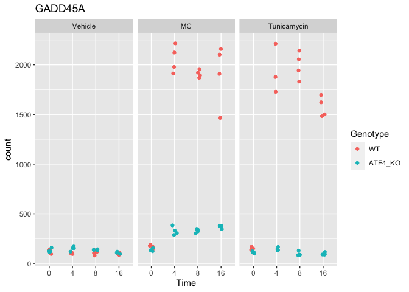
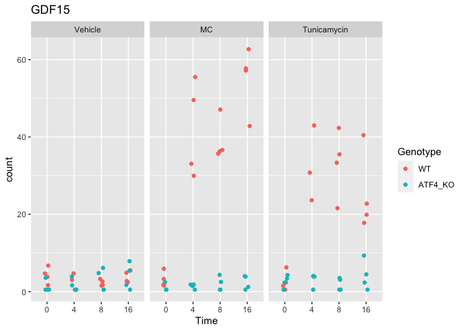
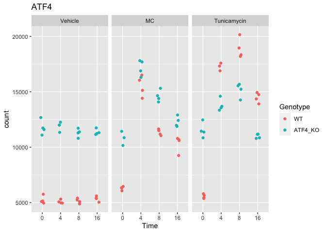
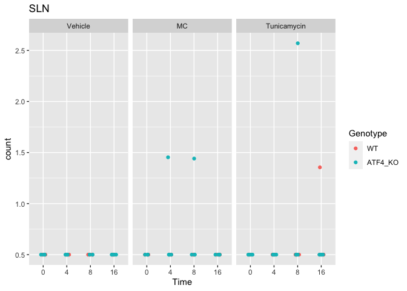

This is based on the Torrence *et al.* paper which did RNAseq on TSC knockotu cells treated with tunicamycin, insulin or rapamycirapamycin https://www.ncbi.nlm.nih.gov/pubmed/33646118.  This script was most recently run on Wed Jan 12 14:30:10 2022.


```r
library(readr)
counts.file <- "GSE158605_Tm_counts.csv.gz"
counts.data <- read_csv(counts.file) %>%
    tibble::column_to_rownames('geneID')

mapping.data <- counts.data %>%
  colnames %>% 
  data.frame() %>%
  rename_at(1,~"Sample") %>%
  mutate(Genotype = case_when(grepl('^WT',Sample) ~ "WT",
                              grepl('^KO',Sample) ~ "ATF4_KO")) %>%
  mutate(Treatment = case_when(grepl('Tu',Sample) ~ 'Tunicamycin',
                               grepl('MC',Sample) ~ 'MC',
                               TRUE~'Vehicle')) %>%
  mutate(Time = case_when(grepl('4h',Sample)~4,
                          grepl('8h',Sample)~8,
                          grepl('16h',Sample)~16,
                          TRUE~0)) %>%
  mutate_all(.funs=factor) %>%
  mutate(Genotype = relevel(Genotype,ref="WT"),
         Treatment = relevel(Treatment, ref="Vehicle")) #left time as a factor
```

Reanalyzed from counts file at GSE158605_Tm_counts.csv.gz.

# DESeq Analysis


```r
library(DESeq2)

dds <- DESeqDataSetFromMatrix(countData = counts.data,
                              colData = mapping.data,
                              design = ~ Treatment+Time+Genotype+Treatment:Genotype)

dds <- DESeq(dds)
res <- results(dds)
```

# Analysis


```r
plotCounts(dds, gene='ENSMUSG00000042045', intgroup=c('Treatment','Time','Genotype'),main="SLN") #SLN
```

<!-- -->

```r
plotCounts(dds, gene='ENSMUSG00000042406', intgroup=c('Treatment','Time','Genotype'),main="ATF4") #ATF4
```

<!-- -->

```r
plotCounts(dds, gene='ENSMUSG00000038508', intgroup=c('Treatment','Genotype'),main="GDF15") #GDF15
```

<!-- -->

```r
plotCounts(dds, gene='ENSMUSG00000036390', intgroup=c('Genotype'),main="GADD45A") #GADD45A
```

<!-- -->

```r
library(ggplot2)
plotCounts(dds, gene="ENSMUSG00000036390", 
           intgroup=c('Treatment','Time','Genotype'),
          returnData=TRUE) %>% 
  ggplot(aes(x = Time, y = count, color = Genotype)) + 
  geom_point(position=position_jitter(w = 0.1,h = 0)) +
  labs(title="GADD45A") +
  facet_grid(.~Treatment)
```

<!-- -->

```r
plotCounts(dds, gene="ENSMUSG00000038508", 
           intgroup=c('Treatment','Time','Genotype'),
          returnData=TRUE) %>% 
  ggplot(aes(x = Time, y = count, color = Genotype)) + 
  geom_point(position=position_jitter(w = 0.1,h = 0)) +
  labs(title="GDF15") +
  facet_grid(.~Treatment)
```

<!-- -->

```r
plotCounts(dds, gene="ENSMUSG00000042406", 
           intgroup=c('Treatment','Time','Genotype'),
          returnData=TRUE) %>% 
  ggplot(aes(x = Time, y = count, color = Genotype)) + 
  geom_point(position=position_jitter(w = 0.1,h = 0)) +
  labs(title="ATF4") +
  facet_grid(.~Treatment)
```

<!-- -->

```r
plotCounts(dds, gene="ENSMUSG00000042045", 
           intgroup=c('Treatment','Time','Genotype'),
          returnData=TRUE) %>% 
  ggplot(aes(x = Time, y = count, color = Genotype)) + 
  geom_point(position=position_jitter(w = 0.1,h = 0)) +
  labs(title="SLN") +
  facet_grid(.~Treatment)
```

<!-- -->

```r
sessionInfo()
```

```
## R version 4.0.2 (2020-06-22)
## Platform: x86_64-apple-darwin17.0 (64-bit)
## Running under: macOS  10.16
## 
## Matrix products: default
## BLAS:   /Library/Frameworks/R.framework/Versions/4.0/Resources/lib/libRblas.dylib
## LAPACK: /Library/Frameworks/R.framework/Versions/4.0/Resources/lib/libRlapack.dylib
## 
## locale:
## [1] en_US.UTF-8/en_US.UTF-8/en_US.UTF-8/C/en_US.UTF-8/en_US.UTF-8
## 
## attached base packages:
## [1] parallel  stats4    stats     graphics  grDevices utils     datasets 
## [8] methods   base     
## 
## other attached packages:
##  [1] ggplot2_3.3.5               DESeq2_1.30.1              
##  [3] SummarizedExperiment_1.20.0 Biobase_2.50.0             
##  [5] MatrixGenerics_1.2.1        matrixStats_0.61.0         
##  [7] GenomicRanges_1.42.0        GenomeInfoDb_1.26.7        
##  [9] IRanges_2.24.1              S4Vectors_0.28.1           
## [11] BiocGenerics_0.36.1         readr_2.1.1                
## [13] broom_0.7.11                dplyr_1.0.7                
## [15] tidyr_1.1.4                 knitr_1.37                 
## 
## loaded via a namespace (and not attached):
##  [1] httr_1.4.2             sass_0.4.0             bit64_4.0.5           
##  [4] vroom_1.5.7            jsonlite_1.7.2         splines_4.0.2         
##  [7] bslib_0.3.1            assertthat_0.2.1       highr_0.9             
## [10] blob_1.2.2             GenomeInfoDbData_1.2.4 yaml_2.2.1            
## [13] pillar_1.6.4           RSQLite_2.2.9          backports_1.4.1       
## [16] lattice_0.20-45        glue_1.6.0             digest_0.6.29         
## [19] RColorBrewer_1.1-2     XVector_0.30.0         colorspace_2.0-2      
## [22] htmltools_0.5.2        Matrix_1.4-0           XML_3.99-0.8          
## [25] pkgconfig_2.0.3        genefilter_1.72.1      zlibbioc_1.36.0       
## [28] purrr_0.3.4            xtable_1.8-4           scales_1.1.1          
## [31] tzdb_0.2.0             BiocParallel_1.24.1    tibble_3.1.6          
## [34] annotate_1.68.0        farver_2.1.0           generics_0.1.1        
## [37] ellipsis_0.3.2         withr_2.4.3            cachem_1.0.6          
## [40] cli_3.1.0              survival_3.2-13        magrittr_2.0.1        
## [43] crayon_1.4.2           memoise_2.0.1          evaluate_0.14         
## [46] fansi_1.0.0            tools_4.0.2            hms_1.1.1             
## [49] lifecycle_1.0.1        stringr_1.4.0          locfit_1.5-9.4        
## [52] munsell_0.5.0          DelayedArray_0.16.3    AnnotationDbi_1.52.0  
## [55] compiler_4.0.2         jquerylib_0.1.4        rlang_0.4.12          
## [58] grid_4.0.2             RCurl_1.98-1.5         rstudioapi_0.13       
## [61] labeling_0.4.2         bitops_1.0-7           rmarkdown_2.11        
## [64] gtable_0.3.0           DBI_1.1.2              R6_2.5.1              
## [67] fastmap_1.1.0          bit_4.0.4              utf8_1.2.2            
## [70] stringi_1.7.6          Rcpp_1.0.7             vctrs_0.3.8           
## [73] geneplotter_1.68.0     tidyselect_1.1.1       xfun_0.29
```
