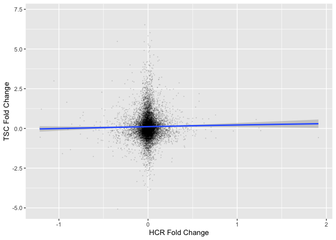

This is generated via GEO2R based on the Kivela *et al.* paper which did microarrays on gastroc muscles from LCR vs HCR rats.


Duvel et al identified 178 significantly differentially expressed genes in their analysis out of a total of 13635 genes assessed.  Of these differentially expressed genes. 62 genes overlapped with our 4403 significantly different genes from *Tsc1* knockout mice quadriceps.  This is not a significant level of overlap (p=0.597).

<!-- -->

```
##   external_gene_name log2FoldChange   pvalue     padj   logFC P.Value adj.P.Val
## 1               Cd36          0.416 2.52e-02 8.02e-02  0.2512   0.116     0.602
## 2              Oxct1          0.604 1.14e-06 1.54e-05      NA      NA        NA
## 3              Fabp3          1.081 7.42e-06 8.25e-05  0.3102   0.214     0.725
## 4            Slc16a1          1.764 3.68e-12 1.56e-10 -0.0707   0.624     0.924
## 5              Gdf15          5.534 1.56e-13 8.24e-12  0.0395   0.192     0.708
## 6               Bdh1          1.103 2.31e-03 1.17e-02  0.1393   0.243     0.748
```

<!-- -->


```
## R version 4.0.0 (2020-04-24)
## Platform: x86_64-apple-darwin17.0 (64-bit)
## Running under: macOS Catalina 10.15.4
## 
## Matrix products: default
## BLAS:   /Library/Frameworks/R.framework/Versions/4.0/Resources/lib/libRblas.dylib
## LAPACK: /Library/Frameworks/R.framework/Versions/4.0/Resources/lib/libRlapack.dylib
## 
## locale:
## [1] en_US.UTF-8/en_US.UTF-8/en_US.UTF-8/C/en_US.UTF-8/en_US.UTF-8
## 
## attached base packages:
## [1] parallel  stats     graphics  grDevices utils     datasets  methods  
## [8] base     
## 
## other attached packages:
##  [1] venneuler_1.1-0     rJava_0.9-12        ggplot2_3.3.0      
##  [4] limma_3.44.1        GEOquery_2.56.0     Biobase_2.48.0     
##  [7] BiocGenerics_0.34.0 broom_0.5.6         dplyr_0.8.5        
## [10] tidyr_1.0.3         knitr_1.28         
## 
## loaded via a namespace (and not attached):
##  [1] Rcpp_1.0.4.6     pillar_1.4.4     compiler_4.0.0   tools_4.0.0     
##  [5] digest_0.6.25    gtable_0.3.0     evaluate_0.14    lifecycle_0.2.0 
##  [9] tibble_3.0.1     nlme_3.1-147     lattice_0.20-41  pkgconfig_2.0.3 
## [13] rlang_0.4.6      curl_4.3         yaml_2.2.1       xfun_0.13       
## [17] withr_2.2.0      stringr_1.4.0    xml2_1.3.2       generics_0.0.2  
## [21] vctrs_0.2.4      hms_0.5.3        grid_4.0.0       tidyselect_1.0.0
## [25] glue_1.4.0       R6_2.4.1         rmarkdown_2.1    farver_2.0.3    
## [29] purrr_0.3.4      readr_1.3.1      magrittr_1.5     scales_1.1.0    
## [33] backports_1.1.6  ellipsis_0.3.0   htmltools_0.4.0  assertthat_0.2.1
## [37] colorspace_1.4-1 labeling_0.3     stringi_1.4.6    munsell_0.5.0   
## [41] crayon_1.3.4
```
