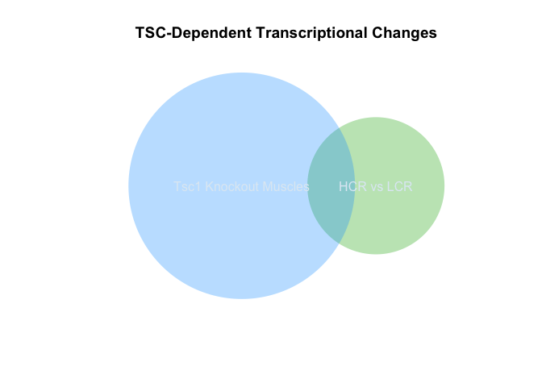

This is generated via GEO2R based on the Kivela *et al.* paper which did microarrays on gastroc muscles from LCR vs HCR rats.


```r
# Version info: R 3.2.3, Biobase 2.30.0, GEOquery 2.40.0, limma 3.26.8
# R scripts generated  Mon May 11 11:42:23 EDT 2020

################################################################
#   Differential expression analysis with limma
library(Biobase)
library(GEOquery)
library(limma)

# load series and platform data from GEO

gset <- getGEO("GSE17190", GSEMatrix =TRUE, AnnotGPL=TRUE)
if (length(gset) > 1) idx <- grep("GPL6101", attr(gset, "names")) else idx <- 1
gset <- gset[[idx]]

# make proper column names to match toptable 
fvarLabels(gset) <- make.names(fvarLabels(gset))

# group names for all samples
gsms <- "110000110011001100110011"
sml <- c()
for (i in 1:nchar(gsms)) { sml[i] <- substr(gsms,i,i) }

# log2 transform
ex <- exprs(gset)
qx <- as.numeric(quantile(ex, c(0., 0.25, 0.5, 0.75, 0.99, 1.0), na.rm=T))
LogC <- (qx[5] > 100) ||
          (qx[6]-qx[1] > 50 && qx[2] > 0) ||
          (qx[2] > 0 && qx[2] < 1 && qx[4] > 1 && qx[4] < 2)
if (LogC) { ex[which(ex <= 0)] <- NaN
  exprs(gset) <- log2(ex) }

# set up the data and proceed with analysis
sml <- paste("G", sml, sep="")    # set group names
fl <- as.factor(sml)
gset$description <- fl
design <- model.matrix(~ description + 0, gset)
colnames(design) <- levels(fl)
fit <- lmFit(gset, design)
cont.matrix <- makeContrasts(G1-G0, levels=design)
fit2 <- contrasts.fit(fit, cont.matrix)
fit2 <- eBayes(fit2, 0.01)
tT <- topTable(fit2, adjust="fdr", sort.by="B", number=250)

tT <- subset(tT, select=c("ID","adj.P.Val","P.Value","t","B","logFC","Gene.symbol","Gene.title"))
#write.table(tT, file=stdout(), row.names=F, sep="\t")


################################################################
#   Boxplot for selected GEO samples
library(Biobase)
library(GEOquery)

# load series and platform data from GEO

gset <- getGEO("GSE17190", GSEMatrix =TRUE, getGPL=FALSE)
if (length(gset) > 1) idx <- grep("GPL6101", attr(gset, "names")) else idx <- 1
gset <- gset[[idx]]

# group names for all samples in a series
gsms <- "110000110011001100110011"
sml <- c()
for (i in 1:nchar(gsms)) { sml[i] <- substr(gsms,i,i) }
sml <- paste("G", sml, sep="")  # set group names

# order samples by group
ex <- exprs(gset)[ , order(sml)]
sml <- sml[order(sml)]
fl <- as.factor(sml)
labels <- c("LCR","HCR")

# set parameters and draw the plot
palette(c("#dfeaf4","#f4dfdf", "#AABBCC"))
dev.new(width=4+dim(gset)[[2]]/5, height=6)
par(mar=c(2+round(max(nchar(sampleNames(gset)))/2),4,2,1))
title <- paste ("GSE17190", '/', annotation(gset), " selected samples", sep ='')
boxplot(ex, boxwex=0.6, notch=T, main=title, outline=FALSE, las=2, col=fl)
legend("topleft", labels, fill=palette(), bty="n")


#write to output file
output_file <- 'GSE1790 Analysis.csv'
write.fit(fit2, file=output_file, adjust='BH')

hcr.results <- droplevels(topTable(fit2, n=Inf, adjust.method="BH")) %>%
  select(Gene.symbol,logFC,P.Value,adj.P.Val) %>%
  distinct(Gene.symbol, .keep_all=T)
#annotate the probes
sig.hcr.results <- hcr.results %>% filter(P.Value<0.05)
sig.hcr.genes <- sig.hcr.results$Gene.symbol

mTsc.datafile <- '../RNAseq/data/processed/Binary DESeq Results.csv'
mtsc.data <- read.csv(mTsc.datafile)
sig.mtsc.data <- droplevels(subset(mtsc.data, pvalue<0.05))

sig.mtsc.genes <- sig.mtsc.data$external_gene_name
sig.overlap <- intersect(sig.hcr.genes, sig.mtsc.genes)

fisher.table <-
  matrix(c(dim(sig.mtsc.data)[1],
           length(sig.overlap), 
           length(unique(fit2$genes$Gene.symbol)),
           length(unique(sig.hcr.genes))),
       nrow = 2,
       dimnames = list(Genes = c("Tested", "Sig"),
                       Significance = c("Overlap", "HCR")))
```

Duvel et al identified 1762 significantly differentially expressed genes in their analysis out of a total of 13635 genes assessed.  Of these differentially expressed genes. 600 genes overlapped with our 5840 significantly different genes from *Tsc1* knockout mice quadriceps.  This is not a significant level of overlap (p=3.145&times; 10^-6^).


```r
combined.genes <-
  mtsc.data %>%
  select(external_gene_name,log2FoldChange,pvalue,padj) %>%
  left_join(hcr.results, by=c('external_gene_name'='Gene.symbol')) %>%
  rename("log2FC_TSC"="log2FoldChange",
         "pval_TSC"='pvalue',
         "padj_TSC"='padj',
         "log2FC_HCR"="logFC",
         'pval_HCR'="P.Value",
         'padj_HCR'='adj.P.Val')

with(combined.genes, lm(log2FC_TSC~log2FC_HCR))  %>% tidy %>% kable(caption="Linear model for association between HCR fold change and TSC fold change")
```


Table: Linear model for association between HCR fold change and TSC fold change

term           estimate   std.error   statistic   p.value
------------  ---------  ----------  ----------  --------
(Intercept)       0.113       0.008       14.58     0.000
log2FC_HCR        0.145       0.071        2.04     0.041

```r
library(ggplot2)
combined.genes %>%
  ggplot(aes(y=log2FC_TSC,x=log2FC_HCR)) +
  geom_point(size=0.1, alpha=0.1) +
  labs(y="TSC Fold Change",x="HCR Fold Change") +
  geom_smooth(se=T)
```

<!-- -->

```r
interesting.genes <- c('Slc16a1','Oxct1','Bdh1','Gdf15','Fabp3','Cd36')
combined.genes %>%
  filter(external_gene_name %in% interesting.genes)
```

```
##   external_gene_name log2FC_TSC pval_TSC padj_TSC log2FC_HCR pval_HCR padj_HCR
## 1               Cd36      0.416 2.52e-02 8.02e-02     0.2512    0.116    0.602
## 2              Oxct1      0.604 1.14e-06 1.54e-05         NA       NA       NA
## 3              Fabp3      1.081 7.42e-06 8.25e-05     0.3102    0.214    0.725
## 4            Slc16a1      1.764 3.68e-12 1.56e-10    -0.0707    0.624    0.924
## 5              Gdf15      5.534 1.56e-13 8.24e-12     0.0395    0.192    0.708
## 6               Bdh1      1.103 2.31e-03 1.17e-02     0.1393    0.243    0.748
```


```r
require(venneuler)
v.diseases <- venneuler(c("HCR vs LCR"=length(sig.hcr.genes), 
                 "Tsc1 Knockout Muscles"=length(sig.mtsc.genes),
                 "HCR vs LCR&Tsc1 Knockout Muscles"=length(intersect(sig.hcr.genes, sig.mtsc.genes))))

plot(v.diseases, main="TSC-Dependent Transcriptional Changes")
```

<!-- -->

```r
# library(Vennerable)
# v.list <- list(`Tsc2 Knockout MEFs` = sig.duvel.genes, `Tsc1 Knockout Muscles` = sig.mtsc.genes)
# v.data <- Venn(v.list)
# plot(v.data)
```


```r
sessionInfo()
```

```
## R version 4.0.0 (2020-04-24)
## Platform: x86_64-apple-darwin17.0 (64-bit)
## Running under: macOS Catalina 10.15.4
## 
## Matrix products: default
## BLAS:   /Library/Frameworks/R.framework/Versions/4.0/Resources/lib/libRblas.dylib
## LAPACK: /Library/Frameworks/R.framework/Versions/4.0/Resources/lib/libRlapack.dylib
## 
## locale:
## [1] en_US.UTF-8/en_US.UTF-8/en_US.UTF-8/C/en_US.UTF-8/en_US.UTF-8
## 
## attached base packages:
## [1] parallel  stats     graphics  grDevices utils     datasets  methods  
## [8] base     
## 
## other attached packages:
##  [1] venneuler_1.1-0     rJava_0.9-12        ggplot2_3.3.0      
##  [4] limma_3.44.1        GEOquery_2.56.0     Biobase_2.48.0     
##  [7] BiocGenerics_0.34.0 broom_0.5.6         dplyr_0.8.5        
## [10] tidyr_1.0.3         knitr_1.28         
## 
## loaded via a namespace (and not attached):
##  [1] Rcpp_1.0.4.6     highr_0.8        pillar_1.4.4     compiler_4.0.0  
##  [5] tools_4.0.0      digest_0.6.25    gtable_0.3.0     evaluate_0.14   
##  [9] lifecycle_0.2.0  tibble_3.0.1     nlme_3.1-147     lattice_0.20-41 
## [13] mgcv_1.8-31      pkgconfig_2.0.3  rlang_0.4.6      Matrix_1.2-18   
## [17] curl_4.3         yaml_2.2.1       xfun_0.13        withr_2.2.0     
## [21] stringr_1.4.0    xml2_1.3.2       generics_0.0.2   vctrs_0.2.4     
## [25] hms_0.5.3        grid_4.0.0       tidyselect_1.0.0 glue_1.4.0      
## [29] R6_2.4.1         rmarkdown_2.1    farver_2.0.3     purrr_0.3.4     
## [33] readr_1.3.1      magrittr_1.5     splines_4.0.0    scales_1.1.0    
## [37] backports_1.1.6  ellipsis_0.3.0   htmltools_0.4.0  assertthat_0.2.1
## [41] colorspace_1.4-1 labeling_0.3     stringi_1.4.6    munsell_0.5.0   
## [45] crayon_1.3.4
```
