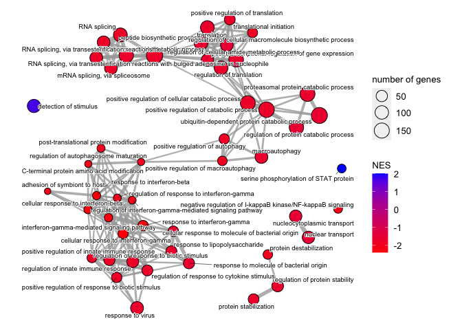
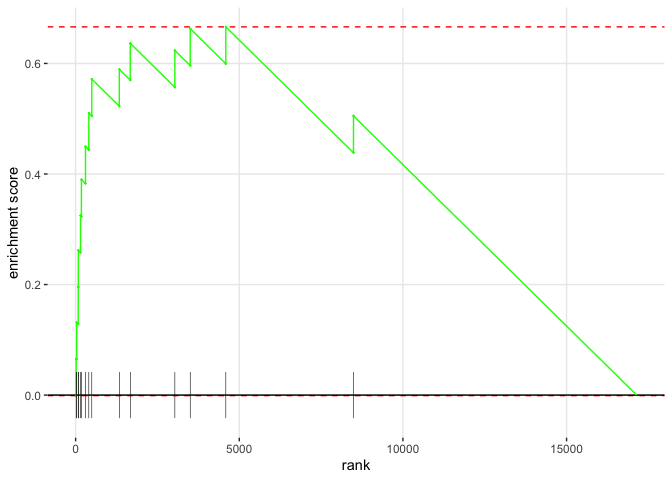

This is generated via GEO2R.  Ignored fed and fasted mice


```r
# Version info: R 3.2.3, Biobase 2.30.0, GEOquery 2.40.0, limma 3.26.8
################################################################
#   Differential expression analysis with limma
library(GEOquery)
library(limma)
library(umap)

# load series and platform data from GEO

gset <- getGEO("GSE20104", GSEMatrix =TRUE, AnnotGPL=FALSE)
if (length(gset) > 1) idx <- grep("GPL6096", attr(gset, "names")) else idx <- 1
gset <- gset[[idx]]

# make proper column names to match toptable 
fvarLabels(gset) <- make.names(fvarLabels(gset))

# group membership for all samples
gsms <- "01010101XXXXXXXX"
sml <- strsplit(gsms, split="")[[1]]

# filter out excluded samples (marked as "X")
sel <- which(sml != "X")
sml <- sml[sel]
gset <- gset[ ,sel]

# log2 transformation
ex <- exprs(gset)
qx <- as.numeric(quantile(ex, c(0., 0.25, 0.5, 0.75, 0.99, 1.0), na.rm=T))
LogC <- (qx[5] > 100) ||
          (qx[6]-qx[1] > 50 && qx[2] > 0)
if (LogC) { ex[which(ex <= 0)] <- NaN
  exprs(gset) <- log2(ex) }

# assign samples to groups and set up design matrix
gs <- factor(sml)
groups <- make.names(c("Control","ATF4 OE"))
levels(gs) <- groups
gset$group <- gs
gs <- relevel(gs, ref="Control")
design <- model.matrix(~group + 0, gset)
colnames(design) <- levels(gs)

fit <- lmFit(gset, design)  # fit linear model

# set up contrasts of interest and recalculate model coefficients
cts <- paste(groups[2], groups[1], sep="-")
cont.matrix <- makeContrasts(contrasts=cts, levels=design)
fit2 <- contrasts.fit(fit, cont.matrix)

# compute statistics and table of top significant genes
fit2 <- eBayes(fit2, 0.01)
tT <- topTable(fit2, adjust="fdr", sort.by="B", number=250)

tT <- subset(tT, select=c("ID","adj.P.Val","P.Value","t","B","logFC","GB_LIST","SPOT_ID","RANGE_GB","RANGE_STRAND","RANGE_START"))
#write.table(tT, file=stdout(), row.names=F, sep="\t")

# Visualize and quality control test results.
# Build histogram of P-values for all genes. Normal test
# assumption is that most genes are not differentially expressed.
tT2 <- topTable(fit2, adjust="fdr", sort.by="B", number=Inf) %>%
  separate(gene_assignment, into=c('Genbank','Gene.symbol','Gene Name','Other'),
           sep=" // ",
           extra="merge")
hist(tT2$adj.P.Val, col = "grey", border = "white", xlab = "P-adj",
  ylab = "Number of genes", main = "P-adj value distribution")
```

<!-- -->

```r
# summarize test results as "up", "down" or "not expressed"
dT <- decideTests(fit2, adjust.method="fdr", p.value=0.05)

# Venn diagram of results
vennDiagram(dT, circle.col=palette())
```

<!-- -->

```r
# create Q-Q plot for t-statistic
t.good <- which(!is.na(fit2$F)) # filter out bad probes
qqt(fit2$t[t.good], fit2$df.total[t.good], main="Moderated t statistic")
```

<!-- -->

```r
# volcano plot (log P-value vs log fold change)
colnames(fit2) # list contrast names
```

[1] "ATF4.OE-Control"

```r
ct <- 1        # choose contrast of interest
volcanoplot(fit2, coef=ct, main=colnames(fit2)[ct], pch=20,
  highlight=length(which(dT[,ct]!=0)), names=rep('+', nrow(fit2)))
```

<!-- -->

```r
# MD plot (log fold change vs mean log expression)
# highlight statistically significant (p-adj < 0.05) probes
plotMD(fit2, column=ct, status=dT[,ct], legend=F, pch=20, cex=1)
abline(h=0)
```

<!-- -->

```r
################################################################
# General expression data analysis
ex <- exprs(gset)

# box-and-whisker plot
ord <- order(gs)  # order samples by group
palette(c("#1B9E77", "#7570B3", "#E7298A", "#E6AB02", "#D95F02",
          "#66A61E", "#A6761D", "#B32424", "#B324B3", "#666666"))
par(mar=c(7,4,2,1))
title <- paste ("GSE20104", "/", annotation(gset), sep ="")
boxplot(ex[,ord], boxwex=0.6, notch=T, main=title, outline=FALSE, las=2, col=gs[ord])
legend("topleft", groups, fill=palette(), bty="n")
```

<!-- -->

```r
# expression value distribution
par(mar=c(4,4,2,1))
title <- paste ("GSE20104", "/", annotation(gset), " value distribution", sep ="")
plotDensities(ex, group=gs, main=title, legend ="topright")
```

<!-- -->

```r
# UMAP plot (dimensionality reduction)
ex <- na.omit(ex) # eliminate rows with NAs
ex <- ex[!duplicated(ex), ]  # remove duplicates
ump <- umap(t(ex), n_neighbors = 4, random_state = 123)
par(mar=c(3,3,2,6), xpd=TRUE)
plot(ump$layout, main="UMAP plot, nbrs=4", xlab="", ylab="", col=gs, pch=20, cex=1.5)
legend("topright", inset=c(-0.15,0), legend=levels(gs), pch=20,
col=1:nlevels(gs), title="Group", pt.cex=1.5)
library("maptools")  # point labels without overlaps
pointLabel(ump$layout, labels = rownames(ump$layout), method="SANN", cex=0.6)
```

<!-- -->

```r
# mean-variance trend, helps to see if precision weights are needed
plotSA(fit2, main="Mean variance trend, GSE20104")
```

<!-- -->

```r
#write to output file
output_file <- 'GSE20104 Analysis.csv'
write.fit(fit2, file=output_file, adjust='BH')

atf4.oe.results <- droplevels(topTable(fit2, n=Inf, adjust.method="BH")) %>%
  separate(gene_assignment, into=c('Genbank','Gene.symbol','Gene Name','Other'),
           sep=" // ",
           extra="merge") %>%
  select(Gene.symbol,logFC,P.Value,adj.P.Val) %>%
  distinct(Gene.symbol, .keep_all=T)
#annotate the probes
sig.atf4.oe.results <- atf4.oe.results %>% filter(P.Value<0.05)
sig.atf4.oe.genes <- sig.atf4.oe.results$Gene.symbol#used nominal p value, nothing sig after FDR

sig.atf4.oe.results.up <- atf4.oe.results %>% filter(P.Value<0.05&logFC>0)#used nominal p value, nothing sig after FDR
sig.atf4.oe.genes.up <- sig.atf4.oe.results.up$Gene.symbol

sig.atf4.oe.results.down <- atf4.oe.results %>% filter(P.Value<0.05&logFC<0)#used nominal p value, nothing sig after FDR
sig.atf4.oe.genes.down <- sig.atf4.oe.results.down$Gene.symbol

mTsc.datafile <- '../RNAseq/Muscle Tsc1 Knockout/data/processed/Binary DESeq Results.csv'
mtsc.data <- read.csv(mTsc.datafile)

sig.mtsc.data <- droplevels(subset(mtsc.data, padj<0.05))
sig.mtsc.data.up <- droplevels(subset(mtsc.data, padj<0.05&log2FoldChange>0))
sig.mtsc.data.down <- droplevels(subset(mtsc.data, padj<0.05&log2FoldChange<0))

sig.mtsc.genes <- sig.mtsc.data$external_gene_name
sig.mtsc.genes.up <- sig.mtsc.data.up$external_gene_name
sig.mtsc.genes.down <- sig.mtsc.data.down$external_gene_name

sig.overlap <- intersect(sig.atf4.oe.genes, sig.mtsc.genes)
sig.overlap.up <- intersect(sig.atf4.oe.genes.up, sig.mtsc.genes.up)
sig.overlap.down <- intersect(sig.atf4.oe.genes.down, sig.mtsc.genes.down)

fisher.table <-
  matrix(c(length(unique(sig.atf4.oe.genes)),
           length(unique(atf4.oe.results$Gene.symbol)), 
           length(sig.overlap),
           dim(sig.mtsc.data)[1]),
       nrow = 2,
       dimnames = list(KD.Sig = c("Sig", "Total"),
                       mTSC.Sig = c("ATF4", "mTSC")))

kable(fisher.table, caption="Contingency table for comparason of ATF4 and mTSC, all genes")
```


Table: Contingency table for comparason of ATF4 and mTSC, all genes

|      |  ATF4| mTSC|
|:-----|-----:|----:|
|Sig   |   598|  153|
|Total | 16481| 4403|

```r
fisher.table.up <-
  matrix(c(length(unique(sig.atf4.oe.genes.up)),
           length(unique(atf4.oe.results$Gene.symbol)), 
           length(sig.overlap.up),
           dim(sig.mtsc.data)[1]),
       nrow = 2,
       dimnames = list(KD.Sig = c("Sig", "Total"),
                       mTSC.Sig = c("ATF4", "mTSC")))

kable(fisher.table.up, caption="Contingency table for comparason of ATF4 and mTSC, up-regulated genes")
```


Table: Contingency table for comparason of ATF4 and mTSC, up-regulated genes

|      |  ATF4| mTSC|
|:-----|-----:|----:|
|Sig   |   352|   69|
|Total | 16481| 4403|

```r
fisher.table.down <-
  matrix(c(length(unique(sig.atf4.oe.genes.down)),
           length(unique(atf4.oe.results$Gene.symbol)), 
           length(sig.overlap.down),
           dim(sig.mtsc.data)[1]),
       nrow = 2,
       dimnames = list(KD.Sig = c("Sig", "Total"),
                       mTSC.Sig = c("ATF4", "mTSC")))

kable(fisher.table.down, caption="Contingency table for comparason of ATF4 and mTSC, down-regulated genes")
```


Table: Contingency table for comparason of ATF4 and mTSC, down-regulated genes

|      |  ATF4| mTSC|
|:-----|-----:|----:|
|Sig   |   246|   57|
|Total | 16481| 4403|

This identified 598 significantly differentially expressed genes in their analysis out of a total of 16481 genes assessed.  Of these differentially expressed genes. 153 genes overlapped with our 4403 significantly different genes from *Tsc1* knockout mice quadriceps.  This is an insignificant level of overlap (1.044 fold enrichment; p=0.682).

Focusing specifically on directionality, this is a significant level of overlap for up (1.363 times more likely; p=0.018) and dowregulated genes (1.153 times more likely; p=0.357).  

For upregulation this represents 352 ATF4 dependent genes out of 16481 genes assessed.  Of these differentially expressed genes. 69 genes overlapped with our 4403 significantly upregulated genes from *Tsc1* knockout mice quadriceps.  

For downregulation this represents 246 ATF4 dependent genes out of 16481 genes assessed.  Of these differentially expressed genes. 57 genes overlapped with our 4403 significantly downregulated genes from *Tsc1* knockout mice quadriceps.  


```r
combined.genes <-
  mtsc.data %>%
  select(external_gene_name,log2FoldChange,pvalue,padj) %>%
  left_join(atf4.oe.results, by=c('external_gene_name'='Gene.symbol')) %>%
  rename("log2FC_TSC"="log2FoldChange",
         "pval_TSC"='pvalue',
         "padj_TSC"='padj',
         "log2FC_KD"="logFC",
         'pval_KD'="P.Value",
         'padj_KD'='adj.P.Val')

with(combined.genes, lm(log2FC_TSC~log2FC_KD))  %>% tidy %>% kable(caption="Linear model for association between ATF4 fold change and TSC fold change")
```


Table: Linear model for association between ATF4 fold change and TSC fold change

|term        | estimate| std.error| statistic| p.value|
|:-----------|--------:|---------:|---------:|-------:|
|(Intercept) |    0.113|     0.007|      15.3|       0|
|log2FC_KD   |    0.688|     0.039|      17.6|       0|

```r
library(ggplot2)
combined.genes %>%
  ggplot(aes(y=log2FC_TSC,x=log2FC_KD)) +
  geom_point(size=0.1, alpha=0.1) +
  labs(y="TSC Fold Change",x="KD Fold Change") +
  geom_smooth(se=T)
```

<!-- -->

```r
interesting.genes <- c('Sln','Gdf15') #
combined.genes %>%
  filter(external_gene_name %in% interesting.genes) %>%
  kable(caption="Selected genes")
```


Table: Selected genes

|external_gene_name | log2FC_TSC| pval_TSC| padj_TSC| log2FC_KD| pval_KD| padj_KD|
|:------------------|----------:|--------:|--------:|---------:|-------:|-------:|
|Gdf15              |       5.53|        0|        0|     0.195|   0.457|   1.000|
|Sln                |       4.25|        0|        0|     1.375|   0.001|   0.707|

```r
combined.genes %>%
  filter(external_gene_name %in% interesting.genes) %>%
  select(external_gene_name, log2FC_KD, log2FC_TSC) %>%
  group_by(external_gene_name) %>%
  pivot_longer(names_to = 'Experiment', values_to = 'Log2FC', cols=log2FC_KD:log2FC_TSC) %>%
  ggplot(aes(y=Log2FC,x=external_gene_name,
             fill=Experiment)) +
    geom_bar(stat='identity', position='dodge')
```

<!-- -->


```r
require(venneuler)
v.diseases <- venneuler(c("ATF4"=length(sig.atf4.oe.genes), 
                 "Tsc1 Knockout Muscles"=length(sig.mtsc.genes),
                 "ATF4&Tsc1 Knockout Muscles"=length(intersect(sig.atf4.oe.genes, sig.mtsc.genes))))

v.diseases.up <- venneuler(c("ATF4"=length(sig.atf4.oe.genes.up), 
                 "Tsc1 Knockout Muscles"=length(sig.mtsc.genes.up),
                 "ATF4&Tsc1 Knockout Muscles"=length(intersect(sig.atf4.oe.genes.up, sig.mtsc.genes.up))))
v.diseases.down <- venneuler(c("ATF4"=length(sig.atf4.oe.genes.down), 
                 "Tsc1 Knockout Muscles"=length(sig.mtsc.genes.down),
                 "ATF4&Tsc1 Knockout Muscles"=length(intersect(sig.atf4.oe.genes.down, sig.mtsc.genes.down))))

plot(v.diseases, main="TSC-Dependent Transcriptional Changes")
```

<!-- -->

```r
plot(v.diseases.up, main="TSC-Dependent and ATF4 Upregulation")
```

<!-- -->

```r
plot(v.diseases, main="TSC-Dependent and ATF4 Downregulation")
```

<!-- -->

```r
# library(Vennerable)
# v.list <- list(`Tsc2 Knockout MEFs` = sig.duvel.genes, `Tsc1 Knockout Muscles` = sig.mtsc.genes)
# v.data <- Venn(v.list)
# plot(v.data)
```

# Pathway Analysis


```r
library(clusterProfiler)
library(org.Mm.eg.db)
db.db.logfc <- 
  tT2 %>% 
  arrange(-logFC) %>%
  dplyr::select(logFC, Gene.symbol) 

db.db.list <- as.numeric(db.db.logfc$logFC)
names(db.db.list) <- db.db.logfc$Gene.symbol
gsea.bp <- gseGO(db.db.list, 
             ont ="BP", 
             keyType = "SYMBOL", 
             OrgDb = org.Mm.eg.db)
library(enrichplot)
upsetplot(gsea.bp)
```

<!-- -->

```r
dotplot(gsea.bp, orderBy="NES")
```

<!-- -->

```r
gsea.bp <- pairwise_termsim(gsea.bp, method="JC")
emapplot(gsea.bp,
         cex_label_category=0.5,
         showCategory = 50,
         color="NES",
         min_edge=0.1)
```

<!-- -->

```r
gsea.bp %>% as.data.frame %>% dplyr::select(NES,pvalue,p.adjust,Description, core_enrichment) %>% arrange(-NES) %>% filter(p.adjust<0.05) %>% kable(caption="Significant GO-BP pathways")
```


Table: Significant GO-BP pathways

|           |   NES| pvalue| p.adjust|Description                                                                          |core_enrichment                                                                                                                                                                                                                                                                                                                                                                                                                                                                                                                                                                                                                                                                                                                                                                                                                                                                                                                                                                                                                                                                                                                                                                                                                  |
|:----------|-----:|------:|--------:|:------------------------------------------------------------------------------------|:--------------------------------------------------------------------------------------------------------------------------------------------------------------------------------------------------------------------------------------------------------------------------------------------------------------------------------------------------------------------------------------------------------------------------------------------------------------------------------------------------------------------------------------------------------------------------------------------------------------------------------------------------------------------------------------------------------------------------------------------------------------------------------------------------------------------------------------------------------------------------------------------------------------------------------------------------------------------------------------------------------------------------------------------------------------------------------------------------------------------------------------------------------------------------------------------------------------------------------|
|GO:0042501 |  2.01|  0.000|    0.016|serine phosphorylation of STAT protein                                               |Ifnz/Ifna14/Gadd45a/Ifna13/Ifna2/Ifnb1/Ifna11/Ifna9/Ifna12/Gfra2/Il24/Ifng/Ifna4                                                                                                                                                                                                                                                                                                                                                                                                                                                                                                                                                                                                                                                                                                                                                                                                                                                                                                                                                                                                                                                                                                                                                 |
|GO:0033139 |  2.00|  0.000|    0.028|regulation of peptidyl-serine phosphorylation of STAT protein                        |Ifnz/Ifna14/Gadd45a/Ifna13/Ifna2/Ifnb1/Ifna11/Ifna9/Ifna12/Gfra2                                                                                                                                                                                                                                                                                                                                                                                                                                                                                                                                                                                                                                                                                                                                                                                                                                                                                                                                                                                                                                                                                                                                                                 |
|GO:0033141 |  1.98|  0.000|    0.031|positive regulation of peptidyl-serine phosphorylation of STAT protein               |Ifnz/Ifna14/Ifna13/Ifna2/Ifnb1/Ifna11/Ifna9/Ifna12/Gfra2/Ifng/Ifna4/Ifna6                                                                                                                                                                                                                                                                                                                                                                                                                                                                                                                                                                                                                                                                                                                                                                                                                                                                                                                                                                                                                                                                                                                                                        |
|GO:0003009 |  1.96|  0.000|    0.028|skeletal muscle contraction                                                          |Tnni1/Tnnc1/Chrna1/Chrnb1/Chrnd/Cav3/Chrng                                                                                                                                                                                                                                                                                                                                                                                                                                                                                                                                                                                                                                                                                                                                                                                                                                                                                                                                                                                                                                                                                                                                                                                       |
|GO:0071294 |  1.96|  0.001|    0.043|cellular response to zinc ion                                                        |Mt1/Gabrb3/Glra2/Gpr39/Mt4/Mt3                                                                                                                                                                                                                                                                                                                                                                                                                                                                                                                                                                                                                                                                                                                                                                                                                                                                                                                                                                                                                                                                                                                                                                                                   |
|GO:0034377 |  1.95|  0.000|    0.022|plasma lipoprotein particle assembly                                                 |Apoe/Abca1/Arf1/Soat1/Apoa4/Apoa2                                                                                                                                                                                                                                                                                                                                                                                                                                                                                                                                                                                                                                                                                                                                                                                                                                                                                                                                                                                                                                                                                                                                                                                                |
|GO:0071514 |  1.94|  0.001|    0.046|genomic imprinting                                                                   |H19/Zfp42/Cdkn1c/Meg3/Dppa3/a/Ndn                                                                                                                                                                                                                                                                                                                                                                                                                                                                                                                                                                                                                                                                                                                                                                                                                                                                                                                                                                                                                                                                                                                                                                                                |
|GO:0051606 |  1.69|  0.000|    0.011|detection of stimulus                                                                |Tas2r140/Tas2r105/Csrp3/Olfr15/Tas2r143/Tas2r106/Reep6/Tas2r124/Tas2r134/Olfr527/Olfr1408/Olfr432/Cxcr4/Pkdrej/Tas2r107/Tas2r109/Pak1/Pip/Prrxl1/Cav3/Rtp2/Pglyrp3/Ntsr1/Gck/Opn5/Tac4/Kit/Tas2r136/Grin2b/Ly96/Tas1r3/Grm8/Dach1/Olfr1507/Arrb2/Olfr1437/Olfr420/Tas2r108/Whrn/Fap/Pcp2/Tmc1/Itgav/Gpr88/Strc/Tas2r102/Best1/Olfr262/Olfr398/Adora1/Cabp4/Tas2r125/Olfr103/Cep250/Clec4n/Rest/Opn1mw/Pde6d/Car6/Olfr109/Tspo/Arrb1/Kcnq1/Olfr1404/Olfr427/Pcdh15/P2rx2/Aipl1/Casr/Kcnmb4/Naip2/Sema5b/Pdzd7/Olfr1508/Olfr211/Tas2r120/Kcnmb2/Trpa1/Pkd1l3/Rpe65/Olfr218/Olfr430/Crb1/Trem2/Olfr1509/Cacna1f/Pigr/Rdh11/Grk1/Slc24a4/Pkd2l1/Nox3/Tas2r113/Pkd2/Tas1r2                                                                                                                                                                                                                                                                                                                                                                                                                                                                                                                                                            |
|GO:0030198 |  1.58|  0.000|    0.021|extracellular matrix organization                                                    |Grem1/Col14a1/Fn1/Mmp12/Wnt3a/Adamts5/Lgals3/Sh3pxd2b/Postn/Fkbp10/Smpd3/Il6/Dpt/Adamts20/Mmp1b/Ambn/Fbln5/Spint1/Adamts10/Tpsb2/Col5a2/Col9a3/Smoc1/Npnt/Adamts12/Lum/Gfap/Mmp11/Adamts8/Col4a5/Bcl3/Phldb1/Fap/Col24a1/Has2/Efemp2/Mmp2/Adamts7/Mmp1a/Foxc2/Col3a1/Ctss/Cyp1b1/Mmp3/Qsox1/Adamts4/Serpinf2/Mmp23/Tnfrsf1b/Fshr/Tfip11/Ntng1/Klk4/Ramp2/Gfod2/Lamc1/Emilin1/Ccdc80/Ltbp3/Csgalnact1/Nid1/Mpv17/Col8a1/Itih1/Impg1/Fbln1/Col5a1/Adamts18/Pbxip1/Mfap4/Mmp21/Olfml2a/Mmp20/Kif9/Fgfr4/Col4a2/Loxl2/Adamtsl2/Tgfbr1/Nfkb2/Col15a1/Tmem38b/Col17a1/Ltbp4/Papln/Mpzl3/Mmp17/Smad3/Hspg2/Tgfb1/Ntng2/Fscn1/Col4a1/Tpsb2/Tnr/Apbb1/Adamts2/Col5a3/Lmx1b/Hsd17b12/Loxl1/Nphp3/Sulf2/Col19a1/Tnxb/Adamts13/Lamb3/Col11a2/Ext1/Antxr1/Itgb3/Eln/Col4a4/Thsd4/Wt1/Col13a1/Col16a1/App/Loxl4/Col10a1/Myf5/Col4a6/Gpm6b/Dmp1/Atp7a/Cma1/Col25a1/Plod3/Mmp19/Sfrp2/Itgb1/Adamtsl4/Mmp10/Mmp15                                                                                                                                                                                                                                                                                                                                 |
|GO:0043062 |  1.58|  0.000|    0.036|extracellular structure organization                                                 |Grem1/Col14a1/Fn1/Mmp12/Wnt3a/Adamts5/Lgals3/Sh3pxd2b/Postn/Fkbp10/Smpd3/Il6/Dpt/Adamts20/Mmp1b/Ambn/Fbln5/Spint1/Adamts10/Tpsb2/Col5a2/Col9a3/Smoc1/Npnt/Adamts12/Lum/Gfap/Mmp11/Adamts8/Col4a5/Bcl3/Phldb1/Fap/Col24a1/Has2/Efemp2/Mmp2/Adamts7/Mmp1a/Foxc2/Col3a1/Ctss/Cyp1b1/Mmp3/Qsox1/Adamts4/Serpinf2/Mmp23/Tnfrsf1b/Fshr/Tfip11/Ntng1/Klk4/Ramp2/Gfod2/Lamc1/Emilin1/Ccdc80/Ltbp3/Csgalnact1/Nid1/Mpv17/Col8a1/Itih1/Impg1/Fbln1/Col5a1/Adamts18/Pbxip1/Mfap4/Mmp21/Olfml2a/Mmp20/Kif9/Fgfr4/Col4a2/Loxl2/Adamtsl2/Tgfbr1/Nfkb2/Col15a1/Tmem38b/Col17a1/Ltbp4/Papln/Mpzl3/Mmp17/Smad3/Hspg2/Tgfb1/Ntng2/Fscn1/Col4a1/Tpsb2/Tnr/Apbb1/Adamts2/Col5a3/Lmx1b/Hsd17b12/Loxl1/Nphp3/Sulf2/Col19a1/Tnxb/Adamts13/Lamb3/Col11a2/Ext1/Antxr1/Itgb3/Eln/Col4a4/Thsd4/Wt1/Col13a1/Col16a1/App/Loxl4/Col10a1/Myf5/Col4a6/Gpm6b/Dmp1/Atp7a/Cma1/Col25a1/Plod3/Mmp19/Sfrp2/Itgb1/Adamtsl4/Mmp10/Mmp15                                                                                                                                                                                                                                                                                                                                 |
|GO:0045229 |  1.55|  0.000|    0.036|external encapsulating structure organization                                        |Grem1/Col14a1/Fn1/Mmp12/Wnt3a/Adamts5/Lgals3/Sh3pxd2b/Postn/Fkbp10/Smpd3/Il6/Dpt/Adamts20/Mmp1b/Ambn/Fbln5/Spint1/Adamts10/Tpsb2/Col5a2/Col9a3/Smoc1/Npnt/Adamts12/Lum/Gfap/Mmp11/Adamts8/Col4a5/Bcl3/Phldb1/Fap/Col24a1/Has2/Efemp2/Mmp2/Adamts7/Mmp1a/Foxc2/Col3a1/Ctss/Cyp1b1/Mmp3/Qsox1/Adamts4/Serpinf2/Mmp23/Tnfrsf1b/Fshr/Tfip11/Ntng1/Klk4/Ramp2/Gfod2/Lamc1/Emilin1/Ccdc80/Ltbp3/Csgalnact1/Nid1/Mpv17/Col8a1/Itih1/Impg1/Fbln1/Col5a1/Adamts18/Pbxip1/Mfap4/Mmp21/Olfml2a/Mmp20/Kif9/Fgfr4/Col4a2/Loxl2/Adamtsl2/Tgfbr1/Nfkb2/Col15a1/Tmem38b/Col17a1/Ltbp4/Papln/Mpzl3/Mmp17/Smad3/Hspg2/Tgfb1/Ntng2/Fscn1/Col4a1/Tpsb2/Tnr/Apbb1/Tgm3/Adamts2/Col5a3/Lmx1b/Hsd17b12/Loxl1/Nphp3/Sulf2/Col19a1/Tnxb/Adamts13/Lamb3/Col11a2/Ext1/Antxr1/Itgb3/Eln/Col4a4/Thsd4/Wt1/Col13a1/Col16a1/App/Loxl4/Col10a1/Myf5/Col4a6/Gpm6b/Dmp1/Atp7a/Cma1/Col25a1/Plod3/Mmp19                                                                                                                                                                                                                                                                                                                                                             |
|GO:0006281 | -1.44|  0.000|    0.032|DNA repair                                                                           |Hus1/Poli/Aplf/Ruvbl2/Pold2/Rif1/Fh1/Parp1/Fignl1/Ppp4r2/Nipbl/Ino80e/Polr2i/Ing3/Atrx/Recql/Cbx8/Atm/Brcc3/Mms19/Gtf2h1/Etaa1/Ddx1/Sirt6/Dclre1b/Lig4/Ube2v2/Polb/Wdhd1/Smc4/Huwe1/Neil2/Brd8/Klhl15/Wrn/Dmc1/Setx/Rmi1/Actl6a/Cdc5l/Hsf1/Xrcc4/Otub2/Smc5/Mre11a/Herc2/Rad51/Ube2a/Usp47/Epc2/Pot1a/Ercc5/Dek/Pogz/Prmt6/Rpa2/Polk/Ascc1/Zmpste24/Ttc5/Palb2/Mlh3/Parp2/Tex264/Ubqln4/Fam168a/Rnf8/Xrcc6/Usp1/Gins4/Kin/Pds5a/Rad21/Xpa/Usp45/Aptx/Fus/Rad23b/Sirt1/Vcpip1/Fen1/Rfc3/Smchd1/Pms2/Kat5/Gtf2h2/Rev3l/Suv39h1/Rrm1/Ier3/Smc6/Xrcc2/Ttc5/Pds5b/Yy1/Wdr48/Xrn2/Pttg1/Trrap/Smc3/Ascc3/Apex2/Taok1/Nbn/Gtf2h4/Morf4l1/Msh6/Msh2/Zbtb7a/Nsmce2/Fancb/Sycp3/Mnat1/Mcm6/Fbxo6/Rpain/Dhx9/Rrm2b/Uchl5/Actr8/Rfwd3/Jmy/Asf1a/Dtx3l/Nucks1/Msh3/Parp9/Rbx1/Uhrf1/Actr2/Usp10/Wdr70/Ubr5/Hmgb1/Rev1/Tdg/Bccip/Ube2n/Rfc1/Ube2b/Usp7/Psme4/Ube2d3/Eepd1/Hspa1a/Samhd1                                                                                                                                                                                                                                                                                                                                                        |
|GO:0034660 | -1.46|  0.000|    0.038|ncRNA metabolic process                                                              |Rpl10a/Osgepl1/Trmt11/Grsf1/Exosc9/Mybl1/Thumpd3/Nol11/Rpp30/Tyw3/Frg1/Top1/Pop5/Elp2/Elp4/Zmpste24/Dis3/Larp7/Riok1/Ell/Nsun2/Srfbp1/Rpp38/Kri1/Pes1/Gtpbp4/Rpl7l1/Yars2/Mphosph10/Polr3k/Nop10/Tdrd7/Nfkb1/Rpap2/Adat1/Emg1/Dtwd1/Gar1/Rps24/Osgep/Ncor1/Pus3/Qrsl1/Dph3/Ddx52/Mak16/Lage3/Zfp143/Dicer1/Rpl35a/Ripk1/Suv39h1/Bms1/Rpusd4/Ints6/Yars/Exosc7/Snapc3/C1d/Zc3h8/Clp1/Spin1/Tarsl2/Rrp15/Dedd/Mdn1/Ddx3x/Pum2/Imp3/Mettl6/Ints9/Mrto4/Alkbh8/Trnt1/Exosc5/Gatc/Pwp1/Exosc3/Trpt1/Rnf113a1/Ints12/Las1l/Slfn8/Mrpl1/Stat3/Ell2/Chd7/Cdkal1/Uspl1/Mepce/Exosc8/Thumpd1/Ankrd16/Ddx10/Kat2b/Ddx5/Rnf113a2/Snapc5/Wars/Hnrnpa2b1/Dimt1/Rbm7/Tsen15                                                                                                                                                                                                                                                                                                                                                                                                                                                                                                                                                                     |
|GO:0043161 | -1.49|  0.000|    0.033|proteasome-mediated ubiquitin-dependent protein catabolic process                    |Fbxo45/Styx/Rnf19a/Hace1/Rchy1/Nkd2/Rnf126/Fbxo31/Chfr/Fbxw11/Sirt6/Mtm1/Klhdc1/Hspa5/Ube2v2/Psmc2/Sumo2/Bfar/Huwe1/Atxn3/Rnf4/Rnf144b/Klhl15/Wac/Siah2/Mapk8/Ctnnb1/Glmn/Cdc27/Usp14/Herc2/Eif2ak3/Rnf14/Dnajb2/Ube2a/Bbs7/Fbxl5/Hecw2/Tlk2/Psmd7/Cul1/Ube2k/Anapc4/Erlin2/Cdc16/Xpo1/Fbxw5/Csnk1d/Dnajc10/Sgta/Cav1/Psmc6/Crbn/Ubqln4/Itch/Faf1/Dda1/Psen2/Derl2/Det1/Arih1/Rbck1/Gclc/Ubr3/Appbp2/Cd2ap/Rad23b/Sirt1/Psmd2/Ube2g1/Fbxl3/Kat5/Sec61b/Hectd3/Nedd4l/Hsp90b1/Fbxl12/Sdcbp/Cul2/Ubxn2b/Siah1b/Fbxl15/Arih2/Ascc3/Fbxl4/Ppp2r5c/Ubr2/Ubr3/Taf9/Trim39/Topors/Tdpoz1/Ubr1/Epm2a/Fbxo6/Uchl5/Anapc11/Peli1/Cul3/Bag5/Ifi27/Fem1a/Rbx1/N4bp1/Spop/Fbxl20/Rmnd5a/Ube2b/Usp7/Cul5/Anapc5/Ube2d3/Mapk9/Smurf2/Sumo1/Taf9/Clu/Hspa1a/Trim13/Socs4/Nub1                                                                                                                                                                                                                                                                                                                                                                                                                                                                    |
|GO:0048872 | -1.50|  0.000|    0.019|homeostasis of number of cells                                                       |Smarca2/Rb1/Vhl/Inhba/Ezh1/Csf1/Ppp2r3c/Il2ra/Ccnb2/Pla2g10/Exoc6/Sp3/Rhag/Ikbkg/Rps24/Ncor1/Itgam/Ccr2/Cdk5rap3/Ccr7/Lyn/Prdx5/Bcl6/Id2/Wdr48/Prdx2/Ptpn2/Pde4b/Tmod3/Acvr2a/Sfxn1/Zbtb7a/Zc3h8/Sos1/Vps54/Slc40a1/Dnaja3/Cfh/Sox6/Epas1/Sp1/B2m/Fas/Cyld/Napepld/Mtch2/Stat5b/Alas2/Hoxa5/Stat3/Hmgb1/Acvr1b/Kras/Ezh2/Ccl2/Myct1/Cd24a/Bmi1/Hspa1a/Jak2/Ppp3cb/Prdx1/G6pd2/Ccr4/Siva1/Stat1/Hamp/Hbb-b1                                                                                                                                                                                                                                                                                                                                                                                                                                                                                                                                                                                                                                                                                                                                                                                                                       |
|GO:0022613 | -1.53|  0.000|    0.028|ribonucleoprotein complex biogenesis                                                 |Clns1a/Rsl1d1/Prpf8/Mbnl1/Pten/Utp20/Eif2a/Atm/Sdad1/Ddx47/Eif2s3x/Ncl/Pak1ip1/Nvl/Pa2g4/Ptbp2/Rbm5/Krr1/Srpk2/Setx/Gnl2/Tsr2/Isy1/Prpf6/Eif3a/Rrp7a/Nop14/Rpl10a/Exosc9/Nmd3/Nol11/Rpp30/Frg1/Xpo1/Pop5/Traf7/Dis3/Surf6/Riok1/Srfbp1/Rpp38/Kri1/Pes1/Gtpbp4/Rpl7l1/Sf3b1/Mphosph10/Rpl3l/Eif4b/Luc7l2/Nop10/Emg1/Cdc73/Eif5/Gar1/Srpk1/Rps24/Tsc1/Sf3a3/Ythdc1/Nup88/Ddx52/Glul/Crnkl1/Mak16/Ipo4/Rpl35a/Strap/Suv39h1/Rps27l/Bms1/Heatr3/Rpusd4/Hsp90aa1/Exosc7/C1d/Prpf18/Fastkd2/Rrp15/Mdn1/Rpsa/C1qbp/Ddx3x/Taf9/Imp3/Ptges3/Mrto4/Sf3a2/Dhx9/Exosc5/D1Pas1/Pwp1/Exosc3/Smn1/Prmt5/Eif3d/Las1l/Ddx20/Mrpl1/Gpatch4/Eif2s2/Abce1/Mcts1/Chd7/Ltv1/Exosc8/Ddx10/Taf9/Isg20l2/Rbmx/Kat2b/Dimt1/Snrpd1                                                                                                                                                                                                                                                                                                                                                                                                                                                                                                                          |
|GO:2000112 | -1.53|  0.000|    0.011|regulation of cellular macromolecule biosynthetic process                            |Nck1/Qk/Il15/Ppp1r15b/Bzw1/Eif5a/Tmem59/Mrpl13/Eif5/Etf1/Tsc1/Inpp5k/Hbs1l/Dph3/Rock1/Ccr7/Ddx6/Rps27l/Rpusd4/Ythdf1/Enc1/Eif4g1/Fmr1/Otud6b/Csde1/Nck2/Syncrip/Exosc7/Rock2/Fastkd2/Bzw2/Ppp1r3c/Rabl3/C1qbp/Cnot7/Ddx3x/Insr/Pum2/Eif4e3/Ppp1r3a/Cnot6/Cpeb1/Uhmk1/Paip2b/Dhx9/Ppp1cb/Fastkd3/Exosc5/D1Pas1/Exosc3/Gspt1/Eif3e/Cnot1/Serp1/Larp1/Eif3d/Eif5b/Mapk1/Usp16/Pink1/Cnot8/Dapk3/Eif1/Eif4e/Abce1/Hnrnpd/Prg3/Exosc8/Rnf139/Cd36/Larp4/Lsm14a/Eif2ak2/Rb1cc1/Paip1/Rmnd1/Ppp1r3b/Gzmb/Hbb-b1/S100a9                                                                                                                                                                                                                                                                                                                                                                                                                                                                                                                                                                                                                                                                                                                  |
|GO:1903362 | -1.55|  0.001|    0.043|regulation of cellular protein catabolic process                                     |Vps35/Rgn/Pias1/Egf/Nfe2l1/Styx/Kcne2/Rnf19a/Pten/Rchy1/Nkd2/Chfr/Sirt6/Mtm1/Ube2v2/Sumo2/Ptk2b/Rnf144b/Wac/Mapk8/Glmn/Usp14/Rnf14/Dnajb2/Bbs7/Fbxl5/Rdx/Aqp11/Psmf1/Tlk2/Efna1/Ube2k/Alad/Xpo1/Csnk1d/Sgta/Cav1/Ubqln4/Ptk2/Faf1/Dda1/Psen2/Det1/Arih1/Gclc/Rnft1/Rad23b/Cdk5rap3/Ctsc/Csnk2a1/Sdcbp/Hsp90aa1/Fmr1/Arih2/Usp13/Bag2/Usp25/Agtpbp1/Taf9/Trim39/Epm2a/Wnt1/Mylip/Uchl5/Psme1/Psme3/Bag5/Psme2/Rbx1/N4bp1/Nell1/Usp7/Rnf139/Mapk9/Psme2/Gabarapl2/Sumo1/Taf9/Clu/Hspa1a/Socs4/Nub1/Hamp                                                                                                                                                                                                                                                                                                                                                                                                                                                                                                                                                                                                                                                                                                                            |
|GO:0006913 | -1.55|  0.000|    0.013|nucleocytoplasmic transport                                                          |Kpna4/Ranbp2/Efcab7/Xpo1/Ptgs2/Rab23/Nup160/Nup155/Pkia/Anp32a/Nsun2/Nup98/Nup50/Txnip/Ei24/Ywhae/Appl1/4931428L18Rik/Ipo7/Apod/Prkcq/Tsc1/Ctdspl2/Ythdc1/Nup88/Ipo11/Ipo4/Rab18/Ier3/Heatr3/Kpna3/Kpna1/Stradb/Fyttd1/Atf2/Sfn/Tmco6/Dusp16/Dnajc27/Camk4/Thoc7/Rbm15b/Epm2a/Stk4/Rpain/Uhmk1/Dhx9/Ppm1a/Nupl2/Inpp4b/Sp100/Tnpo3/Ifi27/Cse1l/Mapk1/Snupn/Nup153/Pik3r1/Stat3/Tek/Abce1/Ubr5/Mlxip/Ltv1/Cd36/Angpt1/Rsrc1/Sumo1/Jak2/Nutf2/Ddx5/Hnrnpa2b1/Uaca/Gbp4                                                                                                                                                                                                                                                                                                                                                                                                                                                                                                                                                                                                                                                                                                                                                             |
|GO:0051169 | -1.55|  0.000|    0.013|nuclear transport                                                                    |Kpna4/Ranbp2/Efcab7/Xpo1/Ptgs2/Rab23/Nup160/Nup155/Pkia/Anp32a/Nsun2/Nup98/Nup50/Txnip/Ei24/Ywhae/Appl1/4931428L18Rik/Ipo7/Apod/Prkcq/Tsc1/Ctdspl2/Ythdc1/Nup88/Ipo11/Ipo4/Rab18/Ier3/Heatr3/Kpna3/Kpna1/Stradb/Fyttd1/Atf2/Sfn/Tmco6/Dusp16/Dnajc27/Camk4/Thoc7/Rbm15b/Epm2a/Stk4/Rpain/Uhmk1/Dhx9/Ppm1a/Nupl2/Inpp4b/Sp100/Tnpo3/Ifi27/Cse1l/Mapk1/Snupn/Nup153/Pik3r1/Stat3/Tek/Abce1/Ubr5/Mlxip/Ltv1/Cd36/Angpt1/Rsrc1/Sumo1/Jak2/Nutf2/Ddx5/Hnrnpa2b1/Uaca/Gbp4                                                                                                                                                                                                                                                                                                                                                                                                                                                                                                                                                                                                                                                                                                                                                             |
|GO:0042176 | -1.56|  0.000|    0.012|regulation of protein catabolic process                                              |Ophn1/Foxo1/Snx9/Arntl/Vps35/Rgn/Pias1/Sec22b/Egf/Nfe2l1/Styx/Kcne2/Rnf19a/Pten/Hace1/Rchy1/Nkd2/Chfr/Nsf/Sirt6/Mtm1/Ube2v2/Sumo2/Huwe1/Ptk2b/Rnf144b/Mdm4/Wac/Oaz1/Trim32/Mapk8/Glmn/Oaz2/Serpinb1b/Stx5a/Usp14/Mycbp2/Rnf14/Dnajb2/Bbs7/C4bp/Fbxl5/Rdx/Aqp11/Psmf1/Fam83d/Hecw2/Tlk2/Efna1/Sorl1/Ube2k/Alad/Xpo1/Csnk1d/Atg4b/Rhbdd1/Vhl/Sgta/Cav1/Adam9/Ubqln4/Itch/Ptk2/Faf1/Dda1/Psen2/Det1/Arih1/Cyp51/Gclc/Rnft1/Rad23b/Timp1/Psmd2/Asb5/Timp3/Sox17/Nedd4l/Cdk5rap3/Vps28/Ctsc/Csnk2a1/Ier3/Sdcbp/Nrd1/Hsp90aa1/Smad4/Fmr1/Arih2/Usp13/Snca/Bag2/Usp25/Agtpbp1/Dedd/Taf9/Trim39/Epm2a/Wnt1/Mylip/Asb11/Uchl5/Psme1/Snf8/Psme3/Snx33/Tiparp/Bag5/Psme2/Rbx1/N4bp1/Nell1/Samd9l/Fbxl20/Usp7/Rnf139/Mapk9/Smurf2/Psme2/Gabarapl2/Sumo1/Taf9/Clu/Hspa1a/Socs4/Nub1/Egln1/Serpine2/Hamp                                                                                                                                                                                                                                                                                                                                                                                                                                       |
|GO:0043043 | -1.57|  0.000|    0.002|peptide biosynthetic process                                                         |Nck1/Yars2/Qk/Gclc/Eif4b/Ppp1r15b/Bzw1/Eif5a/Mrpl13/Eif5/Etf1/Rps24/Mrpl15/Tsc1/Hbs1l/Eif4a2/Qrsl1/Mrps18c/Dph3/Rpl8/Rock1/Ddx6/Rpl35a/Mrpl52/Rps27l/Mrps14/Rpusd4/Rpl4/Ythdf1/Mtrf1l/Mrpl21/Enc1/Eif4g1/Mtif2/Fmr1/Otud6b/Mrps9/Csde1/Gfm2/Nck2/Syncrip/Yars/Exosc7/Ascc3/Rpl29/Rock2/Fastkd2/Mrpl32/Tarsl2/Bzw2/Rpsa/C1qbp/Cnot7/Ddx3x/Mmp7/Pum2/Eif4e3/Drg1/Cnot6/Cpeb1/Gfm1/Uhmk1/Paip2b/Dhx9/Mrps18b/Fastkd3/Exosc5/Gatc/D1Pas1/Exosc3/Gspt1/Eif3e/Cnot1/Serp1/Larp1/Eif3d/Eif5b/Rps18/Mapk1/Usp16/Pink1/Mrps17/Cnot8/Mrpl1/Dapk3/Eif1/Eif4e/Eif2s2/Mrpl16/Abce1/Mcts1/Hnrnpd/Prg3/Eif3f/Cdkal1/Mrpl51/Exosc8/Rnf139/Larp4/Lsm14a/Eif2ak2/Paip1/Rmnd1/Wars/Rpl31/Gzmb/Rpl21/Slbp/Rpl37/Hbb-b1/S100a9                                                                                                                                                                                                                                                                                                                                                                                                                                                                                                                        |
|GO:0006511 | -1.60|  0.000|    0.001|ubiquitin-dependent protein catabolic process                                        |Rnf19a/Pten/Hace1/Rchy1/Rnf114/Nkd2/Rnf126/Fbxo31/Chfr/Fbxw11/Psma1/Sirt6/Mtm1/Klhdc1/Hspa5/Ube2v2/Psmc2/Sumo2/Bfar/Huwe1/Ate1/Vps4a/Atxn3/Herc3/Rnf4/Ube2l3/Ptk2b/Rnf144b/Klhl15/Wac/Siah2/Trim32/Mapk8/Cnot4/Ctnnb1/Glmn/Cdc27/Herc4/Uba6/Usp33/Usp14/Chmp7/Usp37/2610002M06Rik/Herc2/Eif2ak3/Keap1/Rnf14/Usp24/Dnajb2/Ube2a/Mib1/Bbs7/Usp47/Usp9x/Fbxl5/Rnf6/Psmd11/Psmf1/Rbbp6/Chmp5/Hecw2/Tlk2/Psmd7/Cul1/Ube3b/Ube2k/Anapc4/Erlin2/Ube2r2/Cdc16/Xpo1/Ubap1/Fbxw5/Rnf20/Csnk1d/Dnajc10/Sgta/Cav1/Psmc6/Crbn/Psmd13/Ubqln4/Rnf8/Itch/Ptk2/Faf1/Dda1/Usp1/Psen2/Derl2/Tollip/Det1/Arih1/Rbck1/Gclc/Ubr3/Usp45/Appbp2/Cd2ap/Rad23b/Sirt1/Ube2l6/Psmd2/Ube2g1/Fbxl3/Cul7/Kat5/Sec61b/Hectd3/Nedd4l/Vps28/Hsp90b1/Fbxl12/Csnk2a1/Sdcbp/Cul2/Ubxn2b/Rnf7/Siah1b/Ubl7/Fbxl15/Arih2/Usp13/Ascc3/Fbxl4/Usp25/Ppp2r5c/Agtpbp1/Ubr2/Ubr3/Taf9/Trim39/Topors/Tdpoz1/Ubr1/Epm2a/Fbxo6/Wnt1/Mylip/Usp15/Uchl5/Cyld/Anapc11/Zranb1/Peli1/Snf8/Cul3/Ntan1/Bag5/Cops3/Ifi27/Dtx3l/Fbxo8/Usp16/Fem1a/Rbx1/Uhrf1/Rnf213/N4bp1/Usp10/Spop/Vps37a/Fbxl20/Ube2n/Rmnd5a/Ube2b/Usp7/Cul5/Anapc5/Ube2d3/Rnf139/Mapk9/Smurf2/Sumo1/Kctd6/Taf9/Clu/Hspa1a/Chmp1b/Trim13/Socs4/Nub1/Ubd/Psma3/Rnf146                                                    |
|GO:0034248 | -1.60|  0.000|    0.005|regulation of cellular amide metabolic process                                       |Ppp1r15b/Bzw1/Eif5a/Mrpl13/Eif5/Etf1/Tsc1/Hbs1l/Pdk4/Dph3/Rock1/Ddx6/Pdk2/Rps27l/Rpusd4/Ythdf1/Enc1/Eif4g1/Fmr1/Otud6b/Csde1/Nck2/Syncrip/Exosc7/Snca/Rock2/Fastkd2/Bzw2/C1qbp/Cnot7/Ddx3x/Pum2/Eif4e3/Cnot6/Cpeb1/Sp1/Uhmk1/Paip2b/Dhx9/Fastkd3/Exosc5/D1Pas1/Exosc3/Nr1h4/Gspt1/Eif3e/Cnot1/Serp1/Larp1/Eif3d/Eif5b/Mapk1/Usp16/Pink1/Cnot8/Dapk3/Eif1/Eif4e/Abce1/Hnrnpd/Prg3/Exosc8/Rnf139/Larp4/Lsm14a/Eif2ak2/Paip1/Clu/Rmnd1/Gzmb/Ormdl2/Hbb-b1/S100a9                                                                                                                                                                                                                                                                                                                                                                                                                                                                                                                                                                                                                                                                                                                                                                    |
|GO:0010608 | -1.61|  0.000|    0.003|post-transcriptional regulation of gene expression                                   |Tnrc6a/Aco1/Ilf3/Itga2/Xpo5/Mettl5/Dhx36/Ireb2/Prkca/Per2/Mex3d/Ddx25/Eif2a/Pnpt1/Qk/Eif2s3x/Tpr/Ncl/Fxr1/Brf1/Ucn/Pa2g4/Ptk2b/Mecp2/Elavl1/Eif4g3/Magoh/Sepsecs/Cdk4/Tbrg4/Rps6kb1/Lsm14b/Xrn1/Nanos3/Tnrc6b/Barhl2/Eif2ak3/Pld1/Ikbke/Tial1/Pstk/Exosc9/Ptcd3/Zcchc13/Lrpprc/Traf5/Slc35a4/Cpeb4/Zmpste24/Zc3h12d/Cav1/Nsun2/Nck1/Qk/Ppp1r15b/Tdrd7/Nfkb1/Fus/Bzw1/Eif5a/Mrpl13/Eif5/Etf1/Tsc1/Ncor1/Hbs1l/Dph3/Ythdc1/Rock1/Zc3h14/Ddx6/Dicer1/Ripk1/Rps27l/Rpusd4/Myd88/Ythdf1/Enc1/Eif4g1/Fmr1/Otud6b/Csde1/Nck2/Syncrip/Exosc7/Rock2/Fastkd2/Bzw2/C1qbp/Cnot7/Ddx3x/Pum2/Eif4e3/Cnot6/Cpeb1/Uhmk1/Paip2b/Dhx9/Hnrnpm/Fastkd3/Exosc5/D1Pas1/Exosc3/Gspt1/Eif3e/Cnot1/Pcbp4/Serp1/Mapkapk2/Larp1/Eif3d/Eif5b/Mapk1/Usp16/Pink1/Parp9/Cnot8/Dapk3/Eif1/Eif4e/Stat3/Abce1/Hnrnpd/Prg3/Angel2/Exosc8/Rnf139/Larp4/Lsm14a/Eif2ak2/Paip1/Rmnd1/Ddx5/Hnrnpa2b1/Gzmb/Hbb-b1/S100a9                                                                                                                                                                                                                                                                                                                                                  |
|GO:0000209 | -1.62|  0.000|    0.025|protein polyubiquitination                                                           |Rnf19a/Hace1/Rnf114/Rnf126/Chfr/Fbxw11/Ube2q1/Rnf135/Trim44/Ube2v2/Bfar/Huwe1/Rnf4/Ube2l3/Rnf144b/Trim32/Ctnnb1/Cdc27/Otub2/Rnf14/Fbxo28/Ube2a/Rnf6/Birc3/Hecw2/Mul1/Cul1/Traf5/Ube3b/Ube2k/Anapc4/Wsb1/Ube2r2/Cdc16/Rnf20/Rnf8/Itch/Dda1/Arih1/Rbck1/Ube2l6/Ube2g1/Nedd4l/Ube2e1/Trim56/Arih2/Anapc13/Ddx3x/Topors/Tdpoz1/D1Pas1/Peli2/Anapc11/Peli1/Aktip/Cul3/Ifi27/Dtx3l/Rnf152/Rbx1/Rnf213/Spop/Ubr5/Ube2n/Ube2b/Anapc5/Ube2d3/Smurf2/Trim21/Magel2/Nmi/Rnf146/Ube2q2/Hamp                                                                                                                                                                                                                                                                                                                                                                                                                                                                                                                                                                                                                                                                                                                                                  |
|GO:0002262 | -1.63|  0.000|    0.033|myeloid cell homeostasis                                                             |Pla2g10/Exoc6/Sp3/Rhag/Rps24/Ncor1/Itgam/Ccr2/Cdk5rap3/Lyn/Bcl6/Id2/Ptpn2/Pde4b/Tmod3/Acvr2a/Sfxn1/Zbtb7a/Cfh/Sox6/Epas1/Sp1/B2m/Stat5b/Alas2/Hoxa5/Stat3/Hmgb1/Acvr1b/Ccl2/Cd24a/Hspa1a/Jak2/Prdx1/G6pd2/Stat1/Hamp/Hbb-b1                                                                                                                                                                                                                                                                                                                                                                                                                                                                                                                                                                                                                                                                                                                                                                                                                                                                                                                                                                                                      |
|GO:0010498 | -1.63|  0.000|    0.001|proteasomal protein catabolic process                                                |Kcne2/Rnf19a/Hace1/Rchy1/Nkd2/Rnf126/Fbxo31/Chfr/Fbxw11/Psma1/Sel1l/Sirt6/Mtm1/Klhdc1/Hspa5/Ube2v2/Psmc2/Sumo2/Bfar/Huwe1/Ate1/Atxn3/Rnf4/Rnf144b/Nr1d1/Klhl15/Wac/Siah2/Mapk8/Ctnnb1/Glmn/Cdc27/Usp14/Herc2/Eif2ak3/Rnf14/Dnajb2/Ube2a/Bbs7/Fbxl5/Aqp11/Psmf1/Hecw2/Tlk2/Psmd7/Cul1/Ube2k/Anapc4/Alad/Erlin2/Cdc16/Xpo1/Fbxw5/Csnk1d/Rhbdd1/Vhl/Dnajc10/Sgta/Cav1/Psmc6/Ddi2/Crbn/Ubqln4/Itch/Faf1/Dda1/Psen2/Derl2/Det1/Arih1/Rbck1/Gclc/Ubr3/Appbp2/Cd2ap/Rnft1/Rad23b/Sirt1/Psmd2/Ube2g1/Fbxl3/Kat5/Sec61b/Hectd3/Nedd4l/Hsp90b1/Fbxl12/Sdcbp/Cul2/Ubxn2b/Siah1b/Enc1/Fmr1/Fbxl15/Arih2/Usp13/Ascc3/Fbxl4/Bag2/Usp25/Ppp2r5c/Ubr2/Ubr3/Taf9/Trim39/Topors/Tdpoz1/Ubr1/Epm2a/Fbxo6/Psmb11/Uchl5/Anapc11/Peli1/Psme1/Psme3/Cul3/Bag5/Ifi27/Fem1a/Psme2/Rbx1/N4bp1/Spop/Fbxl20/Psmb10/Rmnd5a/Ube2b/Usp7/Cul5/Anapc5/Psme4/Ube2d3/Rnf139/Mapk9/Smurf2/Psme2/Gabarapl2/Sumo1/Taf9/Clu/Hspa1a/Trim13/Socs4/Nub1/Psma3/Psmb9/Psmb8                                                                                                                                                                                                                                                                                                  |
|GO:0009615 | -1.63|  0.000|    0.008|response to virus                                                                    |Oas1a/Bcl2l1/Ifnar2/Polr3f/Ikbke/Ifitm7/Smpd1/Hyal1/Cd40/Trim41/Mul1/Ripk3/Hif1a/Ttc4/Ifit1/Zmpste24/Crebzf/Polr3g/Ptprc/Itch/Ddx41/Cd86/Il15/Ddx60/Polr3k/Nfkb1/Pla2g10/Ifitm3/Apobec3/Abcf3/Mx2/Dicer1/Myd88/Tomm70a/Hsp90aa1/Nt5c3/Fmr1/Trim56/Oasl2/Atf2/Ifit2/Bst2/Ivns1abp/Tbk1/C1qbp/Cnot7/Ddx3x/Pum2/Il4/Zmynd11/Spn/Dhx9/Irf7/Mlkl/Usp15/Exosc5/D1Pas1/Tlr3/Ifi27/Tlr13/Dtx3l/Ifnk/Stat2/Parp9/Slfn8/Plscr1/Ccl5/Ifih1/Irf1/Lsm14a/Eif2ak2/Trim21/Xpr1/Ifi204/Bnip3l/Rtp4/Irf2/Fgl2/Zbp1/Nmi/Cxcl10/Samhd1/Stat1/Cxcl9/Gbp4/Irgm1/Igtp                                                                                                                                                                                                                                                                                                                                                                                                                                                                                                                                                                                                                                                                                  |
|GO:0006412 | -1.64|  0.000|    0.001|translation                                                                          |Nck1/Yars2/Qk/Eif4b/Ppp1r15b/Bzw1/Eif5a/Mrpl13/Eif5/Etf1/Rps24/Mrpl15/Tsc1/Hbs1l/Eif4a2/Qrsl1/Mrps18c/Dph3/Rpl8/Rock1/Ddx6/Rpl35a/Mrpl52/Rps27l/Mrps14/Rpusd4/Rpl4/Ythdf1/Mtrf1l/Mrpl21/Enc1/Eif4g1/Mtif2/Fmr1/Otud6b/Mrps9/Csde1/Gfm2/Nck2/Syncrip/Yars/Exosc7/Ascc3/Rpl29/Rock2/Fastkd2/Mrpl32/Tarsl2/Bzw2/Rpsa/C1qbp/Cnot7/Ddx3x/Pum2/Eif4e3/Drg1/Cnot6/Cpeb1/Gfm1/Uhmk1/Paip2b/Dhx9/Mrps18b/Fastkd3/Exosc5/Gatc/D1Pas1/Exosc3/Gspt1/Eif3e/Cnot1/Serp1/Larp1/Eif3d/Eif5b/Rps18/Mapk1/Usp16/Pink1/Mrps17/Cnot8/Mrpl1/Dapk3/Eif1/Eif4e/Eif2s2/Mrpl16/Abce1/Mcts1/Hnrnpd/Prg3/Eif3f/Cdkal1/Mrpl51/Exosc8/Rnf139/Larp4/Lsm14a/Eif2ak2/Paip1/Rmnd1/Wars/Rpl31/Gzmb/Rpl21/Slbp/Rpl37/Hbb-b1/S100a9                                                                                                                                                                                                                                                                                                                                                                                                                                                                                                                                  |
|GO:0071216 | -1.65|  0.000|    0.019|cellular response to biotic stimulus                                                 |Tlr2/Adam9/Txnip/Cd80/Cd86/Atg10/Ppp1r15b/Nfkb1/Cdc73/Casp1/Tmco1/Tbxa2r/Lyn/Map2k7/Nr1h3/Myd88/Tnip3/Pdcd4/Prdx2/Pde4b/Klrk1/Fcgr4/Ly86/Cfh/Cxcl13/Paf1/B2m/Nr1h4/Mapk1/Hmgb1/Plscr1/Ccl12/Ccl5/Ccl2/Cd36/Jak2/Cxcl11/Cxcl10/Stat1/Cxcl9/Cd274/Gbp6/Gbp2/Irgm1/Igtp                                                                                                                                                                                                                                                                                                                                                                                                                                                                                                                                                                                                                                                                                                                                                                                                                                                                                                                                                             |
|GO:0016236 | -1.66|  0.000|    0.012|macroautophagy                                                                       |Ift88/Bnip3/Fyco1/Tbc1d14/Snx14/Sec22b/Snap29/Sesn1/Trp53inp1/Vps16/Ulk2/Slc25a4/Mtm1/Rab19/Uba5/Huwe1/Ufm1/Wac/Vti1a/Snapin/Nod1/Sh3glb1/Chmp7/Atg9a/Vti1b/Wdr45/2610002M06Rik/Chmp5/Hif1a/Pik3c3/Rab23/Atg4b/Mtmr3/Tlr2/Tex264/Ubqln4/Fez2/Stx12/Ei24/Atg10/Sirt1/Smcr8/Gnai3/Ikbkg/Tsc1/Rab33b/Rab43/Lrba/Mfn2/Prkaa2/Pik3c2a/Ubxn2b/Rab1b/Pafah1b2/Scfd1/Map3k7/Map1lc3b/Tbk1/Pip4k2b/Vps41/Epm2a/Atg2b/Arl8b/Il4/Wdfy3/Atg3/Vdac1/Larp1/Optn/Pink1/Scoc/Rnf213/Npc1/Adrb2/Calcoco2/Rb1cc1/Gabarapl2/Chmp1b/Trim13/Bnip3l/Irgm1/Igtp                                                                                                                                                                                                                                                                                                                                                                                                                                                                                                                                                                                                                                                                                         |
|GO:0030218 | -1.66|  0.000|    0.031|erythrocyte differentiation                                                          |Pla2g10/Exoc6/Sp3/Rhag/Ncor1/Cdk5rap3/Lyn/Bcl6/Id2/Ptpn2/Tmod3/Acvr2a/Sfxn1/Zbtb7a/Sox6/Epas1/Sp1/B2m/Stat5b/Alas2/Hoxa5/Stat3/Acvr1b/Hspa1a/Jak2/G6pd2/Stat1/Hbb-b1                                                                                                                                                                                                                                                                                                                                                                                                                                                                                                                                                                                                                                                                                                                                                                                                                                                                                                                                                                                                                                                             |
|GO:0002237 | -1.67|  0.000|    0.007|response to molecule of bacterial origin                                             |Ccr7/Tbxa2r/Lyn/Map2k7/Nr1h3/Myd88/Tnip3/Pdcd4/Prdx2/Snca/Pde4b/Klrk1/Dusp10/Fcgr4/Prdx3/Ly86/Cfh/Cxcl13/Paf1/B2m/Nr1h4/Peli1/Stat5b/Mapkapk2/Ido1/Mapk1/Rps6ka3/Hmgb1/Plscr1/Ccl12/Ccl5/Ccl2/Cd24a/Cd36/Eif2ak2/Mgst1/Jak2/Cxcl11/Cxcl10/Stat1/Cxcl9/Cd274/Gbp6/Gbp2/S100a9/Irgm1/Igtp                                                                                                                                                                                                                                                                                                                                                                                                                                                                                                                                                                                                                                                                                                                                                                                                                                                                                                                                          |
|GO:0017148 | -1.67|  0.000|    0.036|negative regulation of translation                                                   |Mrpl13/Tsc1/Rock1/Ddx6/Ythdf1/Enc1/Fmr1/Otud6b/Csde1/Syncrip/Exosc7/Rock2/Cnot7/Ddx3x/Cnot6/Cpeb1/Paip2b/Dhx9/Exosc5/D1Pas1/Exosc3/Cnot1/Larp1/Cnot8/Dapk3/Eif4e/Hnrnpd/Prg3/Exosc8/Rnf139/Lsm14a/Eif2ak2/Paip1/Gzmb                                                                                                                                                                                                                                                                                                                                                                                                                                                                                                                                                                                                                                                                                                                                                                                                                                                                                                                                                                                                             |
|GO:0001959 | -1.67|  0.000|    0.030|regulation of cytokine-mediated signaling pathway                                    |Ikbke/Trim41/Mul1/Hpx/Ube2k/Hif1a/Padi2/Il7/Vrk2/Cav1/Ptprc/Csf1/Cd300lf/Casp1/Ripk1/Trim56/Ptpn2/Hipk1/Tbk1/Dnaja3/Cnot7/Irf7/Cyld/Nr1h4/Pafah1b1/Stat2/Parp9/Cd24a/Otop1/Lsm14a/Angpt1/Hspa1a/Adipoq/Zbp1/Samhd1/Parp14/Irgm1/Igtp                                                                                                                                                                                                                                                                                                                                                                                                                                                                                                                                                                                                                                                                                                                                                                                                                                                                                                                                                                                             |
|GO:0007030 | -1.68|  0.001|    0.039|Golgi organization                                                                   |Stx18/Yipf4/Tmed11/Lrrk2/Cog3/Arhgef7/Pde4dip/Dnm2/Sec22b/Cog1/Lman2/Hace1/Blzf1/Huwe1/Tmed10/Tmed4/Vti1a/Yipf7/Syne1/Stx5a/Vti1b/Prkd1/Vrk1/Cdc42/Csnk1d/Cltc/Tmed5/Gcc2/Golph3l/Vcpip1/Rab33b/Pde4dip/Rab43/Cog6/Lman1/Golga5/Ubxn2b/Akap9/Yipf5/Dnajc28/Vamp4/Prmt5/Bag5/Atl2/Vamp7/Clasp2/Optn/Mapk1/Bet1/Rab2a/Golph3/Dym/Hook1/Lysmd3/Pdcd10                                                                                                                                                                                                                                                                                                                                                                                                                                                                                                                                                                                                                                                                                                                                                                                                                                                                               |
|GO:0071219 | -1.69|  0.000|    0.012|cellular response to molecule of bacterial origin                                    |Tbxa2r/Lyn/Map2k7/Nr1h3/Myd88/Tnip3/Pdcd4/Prdx2/Pde4b/Klrk1/Fcgr4/Ly86/Cfh/Cxcl13/Paf1/B2m/Nr1h4/Mapk1/Hmgb1/Plscr1/Ccl12/Ccl5/Ccl2/Cd36/Jak2/Cxcl11/Cxcl10/Stat1/Cxcl9/Cd274/Gbp6/Gbp2/Irgm1/Igtp                                                                                                                                                                                                                                                                                                                                                                                                                                                                                                                                                                                                                                                                                                                                                                                                                                                                                                                                                                                                                               |
|GO:0034101 | -1.69|  0.000|    0.028|erythrocyte homeostasis                                                              |Pla2g10/Exoc6/Sp3/Rhag/Rps24/Ncor1/Cdk5rap3/Lyn/Bcl6/Id2/Ptpn2/Tmod3/Acvr2a/Sfxn1/Zbtb7a/Sox6/Epas1/Sp1/B2m/Stat5b/Alas2/Hoxa5/Stat3/Acvr1b/Cd24a/Hspa1a/Jak2/Prdx1/G6pd2/Stat1/Hbb-b1                                                                                                                                                                                                                                                                                                                                                                                                                                                                                                                                                                                                                                                                                                                                                                                                                                                                                                                                                                                                                                           |
|GO:0031647 | -1.69|  0.000|    0.003|regulation of protein stability                                                      |Gtpbp4/Taf9b/Lamp1/Stx12/Aptx/Sirt1/Cdc73/Fbxl3/Atp1b1/Tsc1/Ncor1/Qrsl1/Nf2/Sox17/Nedd4l/Gpihbp1/Mfsd1/Siah1b/Stxbp4/Hsp90aa1/Usp13/Atp1b3/Snca/Bag2/Ndc80/Ccnh/Rabl3/Bag4/Dnaja3/Taf9/Trim39/Dsc3/Trim24/Ptges3/Rab21/Stk4/Mylip/Pfn2/Cul3/Bag5/Pink1/Sav1/Pik3r1/Ubr5/Kras/Ifi30/Ube2b/Usp7/Rnf139/Trim21/Sumo1/Taf9/Clu/Hspa1a/Pdcd10/Irgm1/Igtp                                                                                                                                                                                                                                                                                                                                                                                                                                                                                                                                                                                                                                                                                                                                                                                                                                                                              |
|GO:0032496 | -1.70|  0.000|    0.005|response to lipopolysaccharide                                                       |Ccr7/Tbxa2r/Lyn/Map2k7/Nr1h3/Myd88/Tnip3/Pdcd4/Prdx2/Snca/Pde4b/Klrk1/Dusp10/Fcgr4/Prdx3/Ly86/Cfh/Cxcl13/Paf1/B2m/Nr1h4/Peli1/Stat5b/Mapkapk2/Ido1/Mapk1/Rps6ka3/Hmgb1/Plscr1/Ccl12/Ccl5/Ccl2/Cd36/Eif2ak2/Mgst1/Jak2/Cxcl11/Cxcl10/Stat1/Cxcl9/Cd274/Gbp6/Gbp2/S100a9/Irgm1/Igtp                                                                                                                                                                                                                                                                                                                                                                                                                                                                                                                                                                                                                                                                                                                                                                                                                                                                                                                                                |
|GO:0016241 | -1.70|  0.000|    0.036|regulation of macroautophagy                                                         |Tlr2/Ubqln4/Fez2/Sirt1/Smcr8/Gnai3/Ikbkg/Tsc1/Prkaa2/Pafah1b2/Scfd1/Map3k7/Tbk1/Pip4k2b/Epm2a/Il4/Vdac1/Larp1/Optn/Pink1/Scoc/Npc1/Adrb2/Calcoco2/Trim13/Bnip3l/Irgm1/Igtp                                                                                                                                                                                                                                                                                                                                                                                                                                                                                                                                                                                                                                                                                                                                                                                                                                                                                                                                                                                                                                                       |
|GO:0071222 | -1.70|  0.000|    0.019|cellular response to lipopolysaccharide                                              |Tbxa2r/Lyn/Map2k7/Nr1h3/Myd88/Tnip3/Pdcd4/Prdx2/Pde4b/Klrk1/Fcgr4/Ly86/Cfh/Cxcl13/Paf1/B2m/Nr1h4/Mapk1/Hmgb1/Plscr1/Ccl12/Ccl5/Ccl2/Cd36/Jak2/Cxcl11/Cxcl10/Stat1/Cxcl9/Cd274/Gbp6/Gbp2/Irgm1/Igtp                                                                                                                                                                                                                                                                                                                                                                                                                                                                                                                                                                                                                                                                                                                                                                                                                                                                                                                                                                                                                               |
|GO:0006417 | -1.72|  0.000|    0.001|regulation of translation                                                            |Tnrc6a/Aco1/Ilf3/Itga2/Mettl5/Dhx36/Ireb2/Prkca/Per2/Mex3d/Ddx25/Eif2a/Pnpt1/Qk/Eif2s3x/Tpr/Ncl/Fxr1/Ucn/Pa2g4/Ptk2b/Elavl1/Eif4g3/Magoh/Sepsecs/Cdk4/Rps6kb1/Lsm14b/Xrn1/Nanos3/Tnrc6b/Barhl2/Eif2ak3/Pld1/Pstk/Exosc9/Ptcd3/Zcchc13/Lrpprc/Slc35a4/Cpeb4/Zc3h12d/Nck1/Qk/Ppp1r15b/Bzw1/Eif5a/Mrpl13/Eif5/Etf1/Tsc1/Hbs1l/Dph3/Rock1/Ddx6/Rps27l/Rpusd4/Ythdf1/Enc1/Eif4g1/Fmr1/Otud6b/Csde1/Nck2/Syncrip/Exosc7/Rock2/Fastkd2/Bzw2/C1qbp/Cnot7/Ddx3x/Pum2/Eif4e3/Cnot6/Cpeb1/Uhmk1/Paip2b/Dhx9/Fastkd3/Exosc5/D1Pas1/Exosc3/Gspt1/Eif3e/Cnot1/Serp1/Larp1/Eif3d/Eif5b/Mapk1/Usp16/Pink1/Cnot8/Dapk3/Eif1/Eif4e/Abce1/Hnrnpd/Prg3/Exosc8/Rnf139/Larp4/Lsm14a/Eif2ak2/Paip1/Rmnd1/Gzmb/Hbb-b1/S100a9                                                                                                                                                                                                                                                                                                                                                                                                                                                                                                                             |
|GO:0006397 | -1.72|  0.000|    0.001|mRNA processing                                                                      |Clns1a/Snw1/Dhx36/Prpf8/Ddx23/Cdc40/Ppp4r2/Zcchc8/Ppie/Mbnl1/Pnpt1/Qk/Ddx47/Tut1/Ncl/Pnn/Rbm27/Ddx1/Fxr1/Cwc22/Ptbp2/Magoh/Rbm5/Dhx15/Srpk2/Tbrg4/Setx/Isy1/Tcerg1/Cdc5l/Hsf1/Prpf6/Wbp4/Cstf2t/Zmat2/Rngtt/Ubl5/Mfap1b/Grsf1/Prpf40a/Rbbp6/Sltm/Cpsf2/Phf5a/Frg1/Zcrb1/Ppwd1/Rnf20/Rbm6/Dyrk1a/Rnmt/Larp7/Rbm25/Nup98/Snrnp35/Sf3b1/Ddx41/Kin/Qk/Prdx6/Luc7l2/Raver2/Cdc73/Smu1/Cwf19l2/Srpk1/Prpf38a/Sf3a3/U2af1l4/Ythdc1/Zc3h14/Crnkl1/Ccnt1/Strap/Ddx46/Hnrnpk/Pcf11/Cd2bp2/Zrsr1/Rprd1b/Fmr1/Fam50a/Hnrnph1/Syncrip/Xrn2/Prpf18/Zbtb7a/Clp1/Rbm41/Rprd2/Thoc7/Lsm10/C1qbp/Rbm15b/Cpsf4l/Cwc22/Cpeb1/Dbr1/Magohb/Sf3a2/Zfp830/Dhx9/Paf1/Hnrnpm/Khdrbs3/Smn1/Ptcd2/Prmt5/Pcbp4/Sap18/Snrpb2/Ddx20/Tdrd3/Htatsf1/Snrpn/Rbmx2/Rnps1/Snrpa1/Lsm8/Rsrc1/Rbmx/Ddx5/Smndc1/Hnrnpa2b1/Dnajc17/Snrpd1/Rbm7/Tsen15/Slbp                                                                                                                                                                                                                                                                                                                                                                                                                |
|GO:0050821 | -1.73|  0.000|    0.011|protein stabilization                                                                |Gtpbp4/Taf9b/Lamp1/Stx12/Atp1b1/Tsc1/Ncor1/Sox17/Gpihbp1/Mfsd1/Stxbp4/Hsp90aa1/Usp13/Atp1b3/Bag2/Ccnh/Rabl3/Bag4/Dnaja3/Taf9/Trim39/Dsc3/Ptges3/Rab21/Stk4/Pfn2/Bag5/Pink1/Sav1/Pik3r1/Ifi30/Ube2b/Usp7/Sumo1/Taf9/Clu/Hspa1a/Pdcd10/Irgm1/Igtp                                                                                                                                                                                                                                                                                                                                                                                                                                                                                                                                                                                                                                                                                                                                                                                                                                                                                                                                                                                  |
|GO:0060759 | -1.73|  0.000|    0.013|regulation of response to cytokine stimulus                                          |Ikbke/Trim41/Mul1/Hpx/Ube2k/Hif1a/Padi2/Il7/Vrk2/Cav1/Tlr2/Ptprc/Csf1/Cd300lf/Casp1/Ripk1/Trim56/Ptpn2/Hipk1/Tbk1/Dnaja3/Cnot7/Taf9/Dhx9/Irf7/Cyld/Nr1h4/Pafah1b1/Stat2/Parp9/Ifih1/Cd24a/Otop1/Lsm14a/Angpt1/Taf9/Hspa1a/Adipoq/Zbp1/Samhd1/Parp14/Irgm1/Igtp                                                                                                                                                                                                                                                                                                                                                                                                                                                                                                                                                                                                                                                                                                                                                                                                                                                                                                                                                                   |
|GO:0009896 | -1.74|  0.000|    0.000|positive regulation of catabolic process                                             |Foxo1/Snx9/Fyco1/Tnrc6a/Vps35/Rgn/Pias1/Sec22b/Egf/Dhx36/Sesn1/Mex3d/Kcne2/Rnf19a/Pten/Hace1/Bcl2l11/Trp53inp1/Rchy1/Pnpt1/Nkd2/Atm/Qk/Chfr/Nsf/Prkce/Supv3l1/Ulk2/Slc25a4/Sirt6/Ube2v2/Sumo2/Huwe1/Ptk2b/Rnf144b/Wac/Oaz1/Trim32/Mapk8/Fabp1/Oaz2/Nod1/Hsf1/Sh3glb1/Stx5a/Nanos3/Tnrc6b/Wdr45/Rnf14/Dnajb2/Bbs7/C4bp/Fbxl5/Rdx/Grsf1/Exosc9/Prkd1/Hecw2/Sorl1/Hif1a/Acsl5/Csnk1d/Atg4b/Rhbdd1/Sgta/Zc3h12d/Ttc5/Cav1/Nnt/Tlr2/Adam9/Ptpn1/Itch/Ptk2/Faf1/Dda1/Psen2/Gapdhs/Det1/Arih1/Qk/Plekhf1/Gclc/Rnft1/Sirt1/Smcr8/Asb5/Gnai3/Tmem59/Ikbkg/Kat5/Tsc1/Slc4a4/Rock1/Sox17/Nedd4l/Vps28/Ctsc/Csnk2a1/Ier3/Pnpla2/Stk11/Prkaa2/Pik3c2a/Nrd1/Hsp90aa1/Ythdf1/Ttc5/Fmr1/Csde1/Syncrip/Pafah1b2/Exosc7/Arih2/Usp13/Snca/Rock2/Bag2/Agtpbp1/Map3k7/Tbk1/Pip4k2b/Cnot7/Insr/Epm2a/Cnot6/Il4/Dhx9/Mylip/Vdac1/Asb11/Exosc5/Exosc3/Snf8/Cnot1/Snx33/Tiparp/Dtx3l/Larp1/Optn/Pink1/Rnf152/Scoc/Cnot8/Rbx1/Adrb2/Hmgb1/Hnrnpd/Calcoco2/Exosc8/Rnf139/Mapk9/Rb1cc1/Smurf2/Trim21/Paip1/Abcd2/Sumo1/Clu/Hspa1a/Trim13/Bnip3l/Socs4/Nub1/Hamp/Irgm1/Igtp                                                                                                                                                                                   |
|GO:0031331 | -1.74|  0.000|    0.000|positive regulation of cellular catabolic process                                    |Foxo1/Snx9/Fyco1/Tnrc6a/Vps35/Rgn/Pias1/Egf/Dhx36/Sesn1/Mex3d/Kcne2/Rnf19a/Pten/Bcl2l11/Trp53inp1/Rchy1/Pnpt1/Nkd2/Atm/Qk/Chfr/Supv3l1/Ulk2/Slc25a4/Sirt6/Ube2v2/Sumo2/Ptk2b/Rnf144b/Wac/Trim32/Mapk8/Fabp1/Nod1/Hsf1/Sh3glb1/Nanos3/Tnrc6b/Wdr45/Rnf14/Dnajb2/Bbs7/Fbxl5/Rdx/Grsf1/Exosc9/Prkd1/Hif1a/Acsl5/Csnk1d/Sgta/Zc3h12d/Ttc5/Cav1/Nnt/Tlr2/Adam9/Ptpn1/Itch/Ptk2/Faf1/Dda1/Psen2/Gapdhs/Det1/Arih1/Qk/Plekhf1/Gclc/Rnft1/Sirt1/Smcr8/Gnai3/Tmem59/Ikbkg/Kat5/Tsc1/Slc4a4/Rock1/Ctsc/Pnpla2/Stk11/Prkaa2/Pik3c2a/Nrd1/Hsp90aa1/Ythdf1/Ttc5/Fmr1/Csde1/Syncrip/Pafah1b2/Exosc7/Arih2/Usp13/Snca/Rock2/Bag2/Agtpbp1/Map3k7/Tbk1/Pip4k2b/Cnot7/Insr/Epm2a/Cnot6/Il4/Dhx9/Vdac1/Exosc5/Exosc3/Cnot1/Snx33/Dtx3l/Larp1/Optn/Pink1/Rnf152/Scoc/Cnot8/Rbx1/Adrb2/Hmgb1/Hnrnpd/Calcoco2/Exosc8/Rnf139/Mapk9/Rb1cc1/Trim21/Paip1/Abcd2/Sumo1/Clu/Hspa1a/Trim13/Bnip3l/Socs4/Nub1/Hamp/Irgm1/Igtp                                                                                                                                                                                                                                                                                                                                  |
|GO:0002831 | -1.74|  0.000|    0.001|regulation of response to biotic stimulus                                            |Crk/Tomm70a/Hsp90aa1/Ap1g1/Trim56/Prdx2/Vsig4/Ptpn2/Ifi203/Klrk1/Dusp10/Klrb1c/Tbk1/Dnaja3/C1qbp/Cnot7/Pum2/Slamf8/Ly86/Cfh/Clec2d/Il4/Spn/Dhx9/Irf7/Usp15/Ffar2/Trafd1/Stat5b/Dtx3l/Stat2/Xcl1/Optn/Parp9/Pomc/N4bp1/Mmrn2/Serpinb9f/Hmgb1/Plscr1/Ccl5/Cd24a/Otop1/Irf1/Lsm14a/Tap1/Trem3/Trim21/Ifi204/Casp8/Ifi35/Fgl2/Zbp1/Nmi/Samhd1/Ifi205/Gbp5/Stat1/Parp14/Cd274/Gbp4/Irgm1/Igtp                                                                                                                                                                                                                                                                                                                                                                                                                                                                                                                                                                                                                                                                                                                                                                                                                                         |
|GO:0045089 | -1.76|  0.000|    0.012|positive regulation of innate immune response                                        |Tomm70a/Hsp90aa1/Ap1g1/Trim56/Ifi203/Klrk1/Klrb1c/Tbk1/Dhx9/Irf7/Ffar2/Stat5b/Xcl1/Parp9/Hmgb1/Plscr1/Lsm14a/Trem3/Ifi204/Ifi35/Zbp1/Nmi/Ifi205/Gbp5/Irgm1/Igtp                                                                                                                                                                                                                                                                                                                                                                                                                                                                                                                                                                                                                                                                                                                                                                                                                                                                                                                                                                                                                                                                  |
|GO:0016071 | -1.78|  0.000|    0.000|mRNA metabolic process                                                               |Clns1a/Thra/Snw1/Dhx36/Prpf8/Ddx23/Cdc40/Ppp4r2/Zcchc8/Polr2i/Mex3d/Ppie/Mbnl1/Pnpt1/Atm/Qk/Ddx47/Tut1/Ncl/Pnn/Supv3l1/Rbm27/Ddx1/Fxr1/Brf1/Cwc22/Ptbp2/Zhx2/Elavl1/Magoh/Rbm5/Dhx15/Srpk2/Tbrg4/Setx/Isy1/Tcerg1/Cdc5l/Hsf1/Prpf6/Wbp4/Xrn1/Nanos3/Tnrc6b/Taf6/Cstf2t/Zmat2/Ap3b1/Rngtt/Dnajb11/Ikbke/Ubl5/Mfap1b/Grsf1/Exosc9/Prpf40a/Rbbp6/Sltm/Cpsf2/Phf5a/Traf5/Frg1/Tbp/Zcrb1/Ppwd1/Rnf20/Rbm6/Zc3h12d/Ttc5/Dyrk1a/Rnmt/Larp7/Ncoa1/Rbm25/Nsun2/Nup98/Snrnp35/Atf1/Sf3b1/Ddx41/Kin/Qk/Prdx6/Luc7l2/Fus/Raver2/Cdc73/Smu1/Cwf19l2/Srpk1/Etf1/Prpf38a/Taf13/Sf3a3/U2af1l4/Pus3/Taf7/Ythdc1/Rock1/Zc3h14/Crnkl1/Ccnt1/Dicer1/Hipk3/Strap/Cbll1/Nr1h3/Ddx46/Hnrnpk/Pcf11/Myd88/Cd2bp2/Zrsr1/Ythdf1/Ttc5/Rprd1b/Fmr1/Fam50a/Hnrnph1/Csde1/Syncrip/Xrn2/Exosc7/Atf2/Rock2/Usp25/Prpf18/Hltf/Zbtb7a/Clp1/Fastkd2/Rbm41/Rprd2/Thoc7/Lsm10/C1qbp/Cnot7/Taf9/Pum2/Rbm15b/Mrto4/Epas1/Cpsf4l/Cnot6/Cwc22/Cpeb1/Dbr1/Sp1/Magohb/Sf3a2/Zfp830/Dhx9/Paf1/Hnrnpm/Fastkd3/Exosc5/Khdrbs3/Exosc3/Smn1/Gspt1/Ptcd2/Prmt5/Eif3e/Cnot1/Pcbp4/Mapkapk2/Larp1/Sap18/Snrpb2/Ddx20/Tdrd3/Cnot8/Htatsf1/Stat3/Snrpn/Hnrnpd/Angel2/Rbmx2/Exosc8/Rnps1/Snrpa1/Lsm8/Paip1/Rsrc1/Taf9/Hspa1a/Rbmx/Ddx5/Smndc1/Hnrnpa2b1/Dnajc17/Snrpd1/Rbm7/Tsen15/Slbp |
|GO:0000375 | -1.79|  0.000|    0.002|RNA splicing, via transesterification reactions                                      |Clns1a/Snw1/Prpf8/Ddx23/Cdc40/Ppie/Mbnl1/Qk/Ncl/Fxr1/Cwc22/Ptbp2/Magoh/Rbm5/Srpk2/Setx/Isy1/Cdc5l/Prpf6/Wbp4/Zmat2/Ubl5/Mfap1b/Prpf40a/Phf5a/Zcrb1/Rbm6/Dyrk1a/Larp7/Rbm25/Nup98/Snrnp35/Sf3b1/Ddx41/Qk/Prdx6/Luc7l2/Raver2/Smu1/Cwf19l2/Srpk1/Prpf38a/Sf3a3/U2af1l4/Ythdc1/Crnkl1/Strap/Ddx46/Hnrnpk/Zrsr1/Fmr1/Prpf18/Zbtb7a/Rbm41/C1qbp/Rbm15b/Cwc22/Dbr1/Magohb/Sf3a2/Dhx9/Hnrnpm/Khdrbs3/Smn1/Prmt5/Pcbp4/Sap18/Snrpb2/Ddx20/Htatsf1/Snrpn/Rbmx2/Rnps1/Snrpa1/Lsm8/Rsrc1/Rbmx/Ddx5/Hnrnpa2b1/Dnajc17/Snrpd1/Rbm7                                                                                                                                                                                                                                                                                                                                                                                                                                                                                                                                                                                                                                                                                                            |
|GO:0000377 | -1.79|  0.000|    0.002|RNA splicing, via transesterification reactions with bulged adenosine as nucleophile |Clns1a/Snw1/Prpf8/Ddx23/Cdc40/Ppie/Mbnl1/Qk/Ncl/Fxr1/Cwc22/Ptbp2/Magoh/Rbm5/Srpk2/Setx/Isy1/Cdc5l/Prpf6/Wbp4/Zmat2/Ubl5/Mfap1b/Prpf40a/Phf5a/Zcrb1/Rbm6/Dyrk1a/Larp7/Rbm25/Nup98/Snrnp35/Sf3b1/Ddx41/Qk/Prdx6/Luc7l2/Raver2/Smu1/Cwf19l2/Srpk1/Prpf38a/Sf3a3/U2af1l4/Ythdc1/Crnkl1/Strap/Ddx46/Hnrnpk/Zrsr1/Fmr1/Prpf18/Zbtb7a/Rbm41/C1qbp/Rbm15b/Cwc22/Dbr1/Magohb/Sf3a2/Dhx9/Hnrnpm/Khdrbs3/Smn1/Prmt5/Pcbp4/Sap18/Snrpb2/Ddx20/Htatsf1/Snrpn/Rbmx2/Rnps1/Snrpa1/Lsm8/Rsrc1/Rbmx/Ddx5/Hnrnpa2b1/Dnajc17/Snrpd1/Rbm7                                                                                                                                                                                                                                                                                                                                                                                                                                                                                                                                                                                                                                                                                                            |
|GO:0000398 | -1.79|  0.000|    0.002|mRNA splicing, via spliceosome                                                       |Clns1a/Snw1/Prpf8/Ddx23/Cdc40/Ppie/Mbnl1/Qk/Ncl/Fxr1/Cwc22/Ptbp2/Magoh/Rbm5/Srpk2/Setx/Isy1/Cdc5l/Prpf6/Wbp4/Zmat2/Ubl5/Mfap1b/Prpf40a/Phf5a/Zcrb1/Rbm6/Dyrk1a/Larp7/Rbm25/Nup98/Snrnp35/Sf3b1/Ddx41/Qk/Prdx6/Luc7l2/Raver2/Smu1/Cwf19l2/Srpk1/Prpf38a/Sf3a3/U2af1l4/Ythdc1/Crnkl1/Strap/Ddx46/Hnrnpk/Zrsr1/Fmr1/Prpf18/Zbtb7a/Rbm41/C1qbp/Rbm15b/Cwc22/Dbr1/Magohb/Sf3a2/Dhx9/Hnrnpm/Khdrbs3/Smn1/Prmt5/Pcbp4/Sap18/Snrpb2/Ddx20/Htatsf1/Snrpn/Rbmx2/Rnps1/Snrpa1/Lsm8/Rsrc1/Rbmx/Ddx5/Hnrnpa2b1/Dnajc17/Snrpd1/Rbm7                                                                                                                                                                                                                                                                                                                                                                                                                                                                                                                                                                                                                                                                                                            |
|GO:0008380 | -1.79|  0.000|    0.000|RNA splicing                                                                         |Clns1a/Snw1/Prpf8/Ddx23/Cdc40/Ppp4r2/Zcchc8/Ppie/Mbnl1/Qk/Ddx47/Ccnl1/Ncl/Pnn/Ddx1/Fxr1/Cwc22/Ptbp2/Magoh/Rbm5/Dhx15/Srpk2/Setx/Isy1/Tcerg1/Cdc5l/Prpf6/Wbp4/Zmat2/Ubl5/Mfap1b/Grsf1/Prpf40a/Phf5a/Frg1/Zcrb1/Ppwd1/Rbm6/Dyrk1a/Larp7/Rbm25/Nup98/Snrnp35/Sf3b1/Ddx41/Qk/Prdx6/Clk4/Luc7l2/Clk1/Fus/Raver2/Smu1/Cwf19l2/Srpk1/Prpf38a/Sf3a3/U2af1l4/Ythdc1/Crnkl1/Strap/Ddx46/Hnrnpk/Cd2bp2/Zrsr1/Fmr1/Fam50a/Hnrnph1/Syncrip/Prpf18/Zbtb7a/Clp1/Ivns1abp/Rbm41/Thoc7/Lsm10/C1qbp/Rbm15b/Cwc22/Dbr1/Magohb/Sf3a2/Zfp830/Dhx9/Hnrnpm/Khdrbs3/Trpt1/Smn1/Prmt5/Rnf113a1/Pcbp4/Sap18/Snrpb2/Ddx20/Htatsf1/Pik3r1/Snrpn/Rbmx2/Rnps1/Snrpa1/Lsm8/Rsrc1/Rbmx/Ddx5/Rnf113a2/Smndc1/Hnrnpa2b1/Dnajc17/Snrpd1/Rbm7/Tsen15                                                                                                                                                                                                                                                                                                                                                                                                                                                                                                                 |
|GO:0045727 | -1.80|  0.000|    0.013|positive regulation of translation                                                   |Fxr1/Ucn/Ptk2b/Elavl1/Eif4g3/Cdk4/Rps6kb1/Barhl2/Pld1/Zcchc13/Slc35a4/Nck1/Eif5a/Rps27l/Rpusd4/Ythdf1/Eif4g1/Fmr1/Otud6b/Csde1/Nck2/Syncrip/Fastkd2/C1qbp/Ddx3x/Cpeb1/Uhmk1/Dhx9/Fastkd3/D1Pas1/Eif3e/Serp1/Larp1/Eif3d/Mapk1/Usp16/Pink1/Hnrnpd/Larp4/Paip1/Rmnd1                                                                                                                                                                                                                                                                                                                                                                                                                                                                                                                                                                                                                                                                                                                                                                                                                                                                                                                                                               |
|GO:0045088 | -1.82|  0.000|    0.001|regulation of innate immune response                                                 |Crk/Tomm70a/Hsp90aa1/Ap1g1/Trim56/Vsig4/Ptpn2/Ifi203/Klrk1/Dusp10/Klrb1c/Tbk1/Dnaja3/Cnot7/Slamf8/Cfh/Clec2d/Dhx9/Irf7/Usp15/Ffar2/Trafd1/Stat5b/Stat2/Xcl1/Parp9/N4bp1/Serpinb9f/Hmgb1/Plscr1/Otop1/Irf1/Lsm14a/Tap1/Trem3/Trim21/Ifi204/Casp8/Ifi35/Zbp1/Nmi/Samhd1/Ifi205/Gbp5/Parp14/Irgm1/Igtp                                                                                                                                                                                                                                                                                                                                                                                                                                                                                                                                                                                                                                                                                                                                                                                                                                                                                                                              |
|GO:0002833 | -1.82|  0.000|    0.005|positive regulation of response to biotic stimulus                                   |Tomm70a/Hsp90aa1/Ap1g1/Trim56/Ifi203/Klrk1/Klrb1c/Tbk1/Pum2/Ly86/Dhx9/Irf7/Usp15/Ffar2/Stat5b/Xcl1/Parp9/Pomc/Mmrn2/Hmgb1/Plscr1/Cd24a/Lsm14a/Trem3/Ifi204/Ifi35/Zbp1/Nmi/Ifi205/Gbp5/Cd274/Irgm1/Igtp                                                                                                                                                                                                                                                                                                                                                                                                                                                                                                                                                                                                                                                                                                                                                                                                                                                                                                                                                                                                                           |
|GO:0070936 | -1.86|  0.000|    0.029|protein K48-linked ubiquitination                                                    |Hace1/Rnf126/Trim44/Bfar/Rnf4/Trim32/Ube2a/Rnf6/Cul1/Ube2k/Ube2r2/Rnf8/Itch/Ube2g1/Nedd4l/Ube2e1/Arih2/Topors/Peli1/Cul3/Ifi27/Dtx3l/Rnf152/Rbx1/Ubr5/Ube2b/Ube2d3/Nmi/Rnf146/Ube2q2                                                                                                                                                                                                                                                                                                                                                                                                                                                                                                                                                                                                                                                                                                                                                                                                                                                                                                                                                                                                                                             |
|GO:0010508 | -1.87|  0.000|    0.005|positive regulation of autophagy                                                     |Plekhf1/Sirt1/Smcr8/Gnai3/Tmem59/Ikbkg/Kat5/Tsc1/Rock1/Stk11/Prkaa2/Pik3c2a/Pafah1b2/Map3k7/Tbk1/Pip4k2b/Epm2a/Il4/Vdac1/Larp1/Optn/Pink1/Rnf152/Scoc/Adrb2/Hmgb1/Calcoco2/Rb1cc1/Trim21/Trim13/Bnip3l/Irgm1/Igtp                                                                                                                                                                                                                                                                                                                                                                                                                                                                                                                                                                                                                                                                                                                                                                                                                                                                                                                                                                                                                |
|GO:0060760 | -1.88|  0.000|    0.029|positive regulation of response to cytokine stimulus                                 |Ikbke/Trim41/Hpx/Ube2k/Hif1a/Il7/Tlr2/Csf1/Cd300lf/Casp1/Ripk1/Trim56/Tbk1/Taf9/Dhx9/Irf7/Pafah1b1/Parp9/Ifih1/Lsm14a/Taf9/Hspa1a/Zbp1/Parp14/Irgm1/Igtp                                                                                                                                                                                                                                                                                                                                                                                                                                                                                                                                                                                                                                                                                                                                                                                                                                                                                                                                                                                                                                                                         |
|GO:0016239 | -1.95|  0.000|    0.011|positive regulation of macroautophagy                                                |Sirt1/Smcr8/Gnai3/Ikbkg/Tsc1/Pafah1b2/Map3k7/Tbk1/Pip4k2b/Epm2a/Il4/Vdac1/Larp1/Optn/Pink1/Scoc/Adrb2/Calcoco2/Trim13/Bnip3l/Irgm1/Igtp                                                                                                                                                                                                                                                                                                                                                                                                                                                                                                                                                                                                                                                                                                                                                                                                                                                                                                                                                                                                                                                                                          |
|GO:0006413 | -1.95|  0.000|    0.005|translational initiation                                                             |Nck1/Eif4b/Ppp1r15b/Bzw1/Eif5/Eif4a2/Eif4g1/Mtif2/Fmr1/Nck2/Bzw2/Ddx3x/Eif4e3/Uhmk1/Paip2b/D1Pas1/Eif3e/Larp1/Eif3d/Eif5b/Eif1/Eif4e/Eif2s2/Abce1/Mcts1/Eif3f/Paip1/Slbp/Hbb-b1                                                                                                                                                                                                                                                                                                                                                                                                                                                                                                                                                                                                                                                                                                                                                                                                                                                                                                                                                                                                                                                  |
|GO:0016073 | -1.97|  0.000|    0.022|snRNA metabolic process                                                              |Larp7/Ell/Nop10/Rpap2/Zfp143/Ints6/Exosc7/Snapc3/Zc3h8/Ints9/Exosc5/Exosc3/Ints12/Ell2/Uspl1/Mepce/Exosc8/Snapc5/Rbm7                                                                                                                                                                                                                                                                                                                                                                                                                                                                                                                                                                                                                                                                                                                                                                                                                                                                                                                                                                                                                                                                                                            |
|GO:0031648 | -2.00|  0.000|    0.017|protein destabilization                                                              |Ep300/Vps35/Chfr/Fbxw11/Id1/Sirt6/Nr1d1/Gsn/Senp2/Mul1/Sirt1/Cdc73/Fbxl3/Sox17/Siah1b/Snca/Mylip/Cul3/Rnf139/Trim21/Irgm1/Igtp                                                                                                                                                                                                                                                                                                                                                                                                                                                                                                                                                                                                                                                                                                                                                                                                                                                                                                                                                                                                                                                                                                   |
|GO:0043687 | -2.02|  0.000|    0.014|post-translational protein modification                                              |Esco1/Lcmt1/Rhbdd1/Stt3a/Agtpbp1/Agbl1/Irgm1/Igtp                                                                                                                                                                                                                                                                                                                                                                                                                                                                                                                                                                                                                                                                                                                                                                                                                                                                                                                                                                                                                                                                                                                                                                                |
|GO:0033866 | -2.03|  0.000|    0.019|nucleoside bisphosphate biosynthetic process                                         |Ppcdc/Acsl5/Pdhx/Pank1/Pank4/Pank2/Acot7/Acsl1/Pdk4/Pdk2/Acacb/Dld/Snca/Acat1/Pdhb/Ppcs/Pank3                                                                                                                                                                                                                                                                                                                                                                                                                                                                                                                                                                                                                                                                                                                                                                                                                                                                                                                                                                                                                                                                                                                                    |
|GO:0034030 | -2.03|  0.000|    0.019|ribonucleoside bisphosphate biosynthetic process                                     |Ppcdc/Acsl5/Pdhx/Pank1/Pank4/Pank2/Acot7/Acsl1/Pdk4/Pdk2/Acacb/Dld/Snca/Acat1/Pdhb/Ppcs/Pank3                                                                                                                                                                                                                                                                                                                                                                                                                                                                                                                                                                                                                                                                                                                                                                                                                                                                                                                                                                                                                                                                                                                                    |
|GO:0034033 | -2.03|  0.000|    0.019|purine nucleoside bisphosphate biosynthetic process                                  |Ppcdc/Acsl5/Pdhx/Pank1/Pank4/Pank2/Acot7/Acsl1/Pdk4/Pdk2/Acacb/Dld/Snca/Acat1/Pdhb/Ppcs/Pank3                                                                                                                                                                                                                                                                                                                                                                                                                                                                                                                                                                                                                                                                                                                                                                                                                                                                                                                                                                                                                                                                                                                                    |
|GO:1901096 | -2.06|  0.000|    0.016|regulation of autophagosome maturation                                               |Adrb2/Calcoco2/Irgm1/Igtp                                                                                                                                                                                                                                                                                                                                                                                                                                                                                                                                                                                                                                                                                                                                                                                                                                                                                                                                                                                                                                                                                                                                                                                                        |
|GO:0099004 | -2.06|  0.000|    0.021|calmodulin dependent kinase signaling pathway                                        |Pcp4/Egln1/Irgm1/Igtp                                                                                                                                                                                                                                                                                                                                                                                                                                                                                                                                                                                                                                                                                                                                                                                                                                                                                                                                                                                                                                                                                                                                                                                                            |
|GO:1901623 | -2.07|  0.000|    0.018|regulation of lymphocyte chemotaxis                                                  |Padi2/Stk39/Ccr2/Ccr7/Oxsr1/Cxcl13/Xcl1/Ccl7/Ccl12/Ccl5/Ccl2/Cxcl10                                                                                                                                                                                                                                                                                                                                                                                                                                                                                                                                                                                                                                                                                                                                                                                                                                                                                                                                                                                                                                                                                                                                                              |
|GO:0044406 | -2.09|  0.000|    0.015|adhesion of symbiont to host                                                         |Gbp3/Gbp6/Gbp2                                                                                                                                                                                                                                                                                                                                                                                                                                                                                                                                                                                                                                                                                                                                                                                                                                                                                                                                                                                                                                                                                                                                                                                                                   |
|GO:0060330 | -2.12|  0.000|    0.013|regulation of response to interferon-gamma                                           |Ptpn2/Dnaja3/Parp9/Otop1/Parp14/Irgm1/Igtp                                                                                                                                                                                                                                                                                                                                                                                                                                                                                                                                                                                                                                                                                                                                                                                                                                                                                                                                                                                                                                                                                                                                                                                       |
|GO:0060334 | -2.12|  0.000|    0.013|regulation of interferon-gamma-mediated signaling pathway                            |Ptpn2/Dnaja3/Parp9/Otop1/Parp14/Irgm1/Igtp                                                                                                                                                                                                                                                                                                                                                                                                                                                                                                                                                                                                                                                                                                                                                                                                                                                                                                                                                                                                                                                                                                                                                                                       |
|GO:0018410 | -2.15|  0.000|    0.005|C-terminal protein amino acid modification                                           |Agtpbp1/Agbl1/Irgm1/Igtp                                                                                                                                                                                                                                                                                                                                                                                                                                                                                                                                                                                                                                                                                                                                                                                                                                                                                                                                                                                                                                                                                                                                                                                                         |
|GO:0043124 | -2.16|  0.000|    0.003|negative regulation of I-kappaB kinase/NF-kappaB signaling                           |Sirt1/Ripk1/Tnip3/Dnaja3/Trim39/Zmynd11/Ppm1a/Nr1h4/Optn/Rora/Usp10/Casp8/Adipoq/Stat1                                                                                                                                                                                                                                                                                                                                                                                                                                                                                                                                                                                                                                                                                                                                                                                                                                                                                                                                                                                                                                                                                                                                           |
|GO:0060333 | -2.27|  0.000|    0.001|interferon-gamma-mediated signaling pathway                                          |Ptpn2/Dnaja3/Parp9/Otop1/Irf1/Jak2/Nmi/Stat1/Parp14/Irgm1/Igtp                                                                                                                                                                                                                                                                                                                                                                                                                                                                                                                                                                                                                                                                                                                                                                                                                                                                                                                                                                                                                                                                                                                                                                   |
|GO:0035456 | -2.31|  0.000|    0.001|response to interferon-beta                                                          |Irf1/Ifi204/Ifi205/Stat1/Gbp3/Gbp6/Gbp2/Irgm1/Igtp                                                                                                                                                                                                                                                                                                                                                                                                                                                                                                                                                                                                                                                                                                                                                                                                                                                                                                                                                                                                                                                                                                                                                                               |
|GO:0034341 | -2.35|  0.000|    0.000|response to interferon-gamma                                                         |Stxbp4/Syncrip/Snca/Ptpn2/Bst2/Ccl11/Dnaja3/Vamp3/Stx8/Ccl8/Vamp4/Sp100/Xcl1/Parp9/Actr2/Ccl7/Dapk3/Ccl12/Ccl5/Ccl2/Calcoco2/Otop1/Irf1/Trim21/Jak2/Ubd/Nmi/Gbp5/Stat1/Gbp3/Parp14/Gbp6/Gbp2/Gbp4/Irgm1/Igtp                                                                                                                                                                                                                                                                                                                                                                                                                                                                                                                                                                                                                                                                                                                                                                                                                                                                                                                                                                                                                     |
|GO:0035458 | -2.36|  0.000|    0.000|cellular response to interferon-beta                                                 |Irf1/Ifi204/Ifi205/Stat1/Gbp3/Gbp6/Gbp2/Irgm1/Igtp                                                                                                                                                                                                                                                                                                                                                                                                                                                                                                                                                                                                                                                                                                                                                                                                                                                                                                                                                                                                                                                                                                                                                                               |
|GO:0071346 | -2.40|  0.000|    0.000|cellular response to interferon-gamma                                                |Stxbp4/Syncrip/Ptpn2/Ccl11/Dnaja3/Vamp3/Stx8/Ccl8/Vamp4/Xcl1/Parp9/Actr2/Ccl7/Dapk3/Ccl12/Ccl5/Ccl2/Otop1/Irf1/Jak2/Nmi/Gbp5/Stat1/Gbp3/Parp14/Gbp6/Gbp2/Gbp4/Irgm1/Igtp                                                                                                                                                                                                                                                                                                                                                                                                                                                                                                                                                                                                                                                                                                                                                                                                                                                                                                                                                                                                                                                         |

## Empirical Muscle ATF4 Gene Set


```r
list(ATF4q0.25 = tT2 %>% filter(adj.P.Val <0.25) %>% pull(Gene.symbol),
     ATF4p0.001 = tT2 %>% filter(P.Value <0.001) %>% pull(Gene.symbol),
     ATF4p0.01 = tT2 %>% filter(P.Value <0.01) %>% pull(Gene.symbol),
     ATF4p0.05 = tT2 %>% filter(P.Value <0.05) %>% pull(Gene.symbol)) -> atf4.gene.lists
library(fgsea)

mtsc.ranks <- pull(mtsc.data, log2FoldChange)
names(mtsc.ranks) <- mtsc.data$external_gene_name

mtsc.atf4.pathways <- fgsea(pathways = atf4.gene.lists, 
                  stats    = sort(mtsc.ranks,decreasing=T),
                  minSize  = 1,
                  maxSize  = 500)

mtsc.atf4.pathways %>% 
  arrange(-NES) %>%
  kable(caption="GSEA results for mTSC differential expression results compared to empirically determined ATF4 dependent changes in muscle")
```


Table: GSEA results for mTSC differential expression results compared to empirically determined ATF4 dependent changes in muscle

|pathway    |  pval|  padj| log2err|    ES|  NES| size|leadingEdge                                                                                                                                                                                                                                                                                                                                                                                                                                                                                                                                                                                                                                                                                                                                                                                                                                                                                                                                                                                                                                                                                                                                                                                                                                                                                                                                                                                                                                                                                                                                                                                                                                                                                                                                                                                                                                                                                  |
|:----------|-----:|-----:|-------:|-----:|----:|----:|:--------------------------------------------------------------------------------------------------------------------------------------------------------------------------------------------------------------------------------------------------------------------------------------------------------------------------------------------------------------------------------------------------------------------------------------------------------------------------------------------------------------------------------------------------------------------------------------------------------------------------------------------------------------------------------------------------------------------------------------------------------------------------------------------------------------------------------------------------------------------------------------------------------------------------------------------------------------------------------------------------------------------------------------------------------------------------------------------------------------------------------------------------------------------------------------------------------------------------------------------------------------------------------------------------------------------------------------------------------------------------------------------------------------------------------------------------------------------------------------------------------------------------------------------------------------------------------------------------------------------------------------------------------------------------------------------------------------------------------------------------------------------------------------------------------------------------------------------------------------------------------------------|
|ATF4p0.001 | 0.000| 0.000|   0.611| 0.855| 2.09|   15|Uchl1 , Sln   , Krt18 , Ankrd1, Myl4  , Tnnt2 , Slc7a5, Tnni1 , Asns  , Igf2  , Chrna1                                                                                                                                                                                                                                                                                                                                                                                                                                                                                                                                                                                                                                                                                                                                                                                                                                                                                                                                                                                                                                                                                                                                                                                                                                                                                                                                                                                                                                                                                                                                                                                                                                                                                                                                                                                                       |
|ATF4p0.01  | 0.000| 0.000|   0.675| 0.612| 2.05|   86|Uchl1  , Sln    , Krt18  , Ankrd1 , Myl4   , Tnnt2  , Zfp697 , Casq2  , Slc7a5 , Ncam1  , Tnni1  , Tnnc1  , Asns   , Chrnd  , Ptpn5  , Cyb5r3 , Maged2 , Nes    , Epor   , Slc7a3 , Olfr550, Hspb7  , Slpi   , Kcnn3  , Tmem37 , Slc7a11, Igf2   , Csrp3  , Gadd45a, Chrna1 , Dhrs9                                                                                                                                                                                                                                                                                                                                                                                                                                                                                                                                                                                                                                                                                                                                                                                                                                                                                                                                                                                                                                                                                                                                                                                                                                                                                                                                                                                                                                                                                                                                                                                                          |
|ATF4q0.25  | 0.001| 0.001|   0.477| 0.862| 1.82|    8|Uchl1 , Ankrd1, Myl4  , Tnnt2 , Tnni1 , Igf2                                                                                                                                                                                                                                                                                                                                                                                                                                                                                                                                                                                                                                                                                                                                                                                                                                                                                                                                                                                                                                                                                                                                                                                                                                                                                                                                                                                                                                                                                                                                                                                                                                                                                                                                                                                                                                                 |
|ATF4p0.05  | 0.000| 0.000|   0.557| 0.401| 1.53|  410|Uchl1        , Sln          , Nefm         , Psat1        , Krt18        , Ankrd1       , Pcbd1        , Grin3a       , Myl4         , Tnnt2        , Mustn1       , Txndc2       , Fam171b      , Zfp697       , Casq2        , C1qtnf3      , Slc7a5       , Tubb3        , Skint7       , Rab15        , Olfr1368     , Ncam1        , Tnni1        , Gck          , Nt5c2        , Gpr3         , Tnnc1        , Asns         , Chrnd        , Hspa2        , Carhsp1      , Ptpn5        , Cyb5r3       , Cd160        , Grb10        , Tal2         , Bbox1        , Kcnv2        , Maged2       , Nes          , Dclk1        , Fgf17        , Myo1h        , Uchl4        , Epor         , Slc7a3       , Nr2e3        , Olfr550      , Hspb7        , Slpi         , Pln          , 6430548M08Rik, Htatip2      , Kcnn3        , Tmem159      , Tmem37       , Slc7a11      , Lrrn1        , Cib1         , Igf2         , Xirp1        , Csrp3        , Iah1         , Gamt         , Ch25h        , Rassf3       , Gadd45a      , Lypd1        , Pomc         , Chrna1       , Dhrs9        , Rnf113a2     , Apol9b       , Slc16a12     , Rnd2         , Cdkn1a       , Myog         , Rassf5       , Dcun1d3      , Rgs9bp       , Zcchc3       , Napepld      , Cth          , Fetub        , Pdia6        , Cpxm2        , Hspa4l       , Ift122       , Igtp         , Usp11        , Slitrk6      , Peg12        , Mgst3        , Lyzl6        , Trem3        , Gars         , Meox1        , Tubb6        , Snap47       , Crybb3       , Ormdl2       , Ttf2         , Ahcy         , 2310002L09Rik, Apoe         , Zdhhc23      , Dusp6        , Cebpa        , Uck2         , Bin3         , Aven         , Dennd2d      , Rcan3        , Tceal5       , Angpt1       , Cdca4        , Saa3         , Col12a1      , Fgd2         , Pnmt         , Lysmd3       , Hmgb3 |

```r
plotEnrichment(atf4.gene.lists[["ATF4p0.001"]],
               !(is.na(sort(mtsc.ranks, decreasing=T))))

plotGseaTable(atf4.gene.lists, !(is.na(sort(mtsc.ranks,decreasing=T))), mtsc.atf4.pathways, 
              gseaParam=0.5)
```

<!-- -->

```r
plotEnrichment(atf4.gene.lists[["ATF4p0.01"]],
               !(is.na(sort(mtsc.ranks, decreasing=T)))) +
  labs(title="ATF4 Targets in Muscle Tsc1 Knockouts") +
  theme_classic() +
  theme(text=element_text(size=16))
```

<!-- -->

## Pathway Analysis of Dual TSC/ATF4 Genes

The co-regulated genes in TSC and ATF4 muscles were:

*Upregulated*: Tnni1, Myl4, Tnnt2, Ankrd1, Igf2, Uchl1, Apoe, Asns, Chrna1, Slc7a5, Krt18, Sln, Nes, Csrp3, Tmem37, Ncam1, Casq2, Kcnn3, Tnnc1, Chrnd, Cyb5r3, Cth, Zfp697, Gadd45a, Maged2, Hspb7, Txndc2, Carhsp1, Psat1, Chrnb1, Myog, Dclk1, Lypd1, Grb10, Gars, Cib1, Kcnv2, Pcbd1, Uck2, Gamt, Mustn1, Rnd2, Rassf3, Dusp6, C1qtnf3, Fam171b, Bin3, Rab15, Hspa2, Tal2, Lrrn1, Xirp1, Cdca4, Nt5c2, Snap47, Iah1, Ift122, Tubb6, Hspa4l, Nefm, Tubb3, Usp11, 6430548M08Rik, Meox1, Ttf2, Nol3, Htatip2, Gck, Tceal5

*Downregulated*:Asb14, Rbmx, Tubd1, Ppp1r1a, Serpine2, Bcap29, Ppp3cb, Ostn, Dcun1d2, Tmem56, Gbp4, March7, Ankrd46, Rgs5, Hnrnpa2b1, Eif3f, Smyd2, Rpap3, Tek, Hook1, Sdr39u1, Lpin1, Mapk9, Strbp, Chd7, Pptc7, Cdkal1, Sec62, Rpl21, Car14, Atp8a1, Usp10, Fmo2, Gpd2, Cd24a, Scn4b, Trim54, Fam118b, Zfp62, Gbp2, Cep350, Art3, Stat1, 4430402I18Rik, Zfp458, Eif1, Hist2h2be, Nub1, Cmbl, Fam161a, Chad, Kcnf1, Bmi1, Ube2b, Ddx5, Ahctf1, Ccdc91


```r
enrich.bp <- enrichGO(c(sig.overlap.up,sig.overlap.down), 
             ont ="BP", 
             keyType = "SYMBOL", 
             OrgDb = org.Mm.eg.db)
library(enrichplot)
#upsetplot(enrich.bp)
#dotplot(enrich.bp, orderBy="NES")
#enrich.bp <- pairwise_termsim(enrich.bp, method="JC")
# emapplot(enrich.bp,
#          cex_label_category=0.5,
#          showCategory = 50,
#          color="NES",
#          min_edge=0.1)

enrich.bp %>% as.data.frame %>% dplyr::select(GeneRatio,pvalue,p.adjust,Description) %>%  filter(p.adjust<0.05) %>% kable(caption="Significant GO-BP pathways for co-regulated genes")
```


Table: Significant GO-BP pathways for co-regulated genes

|           |GeneRatio | pvalue| p.adjust|Description                                                                             |
|:----------|:---------|------:|--------:|:---------------------------------------------------------------------------------------|
|GO:0006941 |10/119    |  0.000|    0.000|striated muscle contraction                                                             |
|GO:0060537 |14/119    |  0.000|    0.000|muscle tissue development                                                               |
|GO:0003012 |13/119    |  0.000|    0.000|muscle system process                                                                   |
|GO:0007517 |12/119    |  0.000|    0.000|muscle organ development                                                                |
|GO:0006936 |10/119    |  0.000|    0.000|muscle contraction                                                                      |
|GO:0003009 |5/119     |  0.000|    0.000|skeletal muscle contraction                                                             |
|GO:0060048 |7/119     |  0.000|    0.000|cardiac muscle contraction                                                              |
|GO:0055001 |8/119     |  0.000|    0.001|muscle cell development                                                                 |
|GO:0050879 |5/119     |  0.000|    0.001|multicellular organismal movement                                                       |
|GO:0050881 |5/119     |  0.000|    0.001|musculoskeletal movement                                                                |
|GO:0070296 |4/119     |  0.000|    0.002|sarcoplasmic reticulum calcium ion transport                                            |
|GO:0043462 |5/119     |  0.000|    0.002|regulation of ATP-dependent activity                                                    |
|GO:0055008 |5/119     |  0.000|    0.002|cardiac muscle tissue morphogenesis                                                     |
|GO:0042692 |10/119    |  0.000|    0.002|muscle cell differentiation                                                             |
|GO:0048630 |3/119     |  0.000|    0.002|skeletal muscle tissue growth                                                           |
|GO:0095500 |4/119     |  0.000|    0.002|acetylcholine receptor signaling pathway                                                |
|GO:0048738 |8/119     |  0.000|    0.002|cardiac muscle tissue development                                                       |
|GO:1905145 |4/119     |  0.000|    0.002|cellular response to acetylcholine                                                      |
|GO:0010563 |10/119    |  0.000|    0.002|negative regulation of phosphorus metabolic process                                     |
|GO:0045936 |10/119    |  0.000|    0.002|negative regulation of phosphate metabolic process                                      |
|GO:0007519 |7/119     |  0.000|    0.003|skeletal muscle tissue development                                                      |
|GO:1905144 |4/119     |  0.000|    0.003|response to acetylcholine                                                               |
|GO:0014706 |8/119     |  0.000|    0.003|striated muscle tissue development                                                      |
|GO:0060415 |5/119     |  0.000|    0.003|muscle tissue morphogenesis                                                             |
|GO:0060538 |7/119     |  0.000|    0.003|skeletal muscle organ development                                                       |
|GO:0042326 |9/119     |  0.000|    0.004|negative regulation of phosphorylation                                                  |
|GO:0019932 |8/119     |  0.000|    0.004|second-messenger-mediated signaling                                                     |
|GO:0048644 |5/119     |  0.000|    0.004|muscle organ morphogenesis                                                              |
|GO:0010677 |4/119     |  0.000|    0.004|negative regulation of cellular carbohydrate metabolic process                          |
|GO:0045214 |4/119     |  0.000|    0.004|sarcomere organization                                                                  |
|GO:0060047 |7/119     |  0.000|    0.005|heart contraction                                                                       |
|GO:0045912 |4/119     |  0.000|    0.005|negative regulation of carbohydrate metabolic process                                   |
|GO:0098926 |4/119     |  0.000|    0.005|postsynaptic signal transduction                                                        |
|GO:0055010 |4/119     |  0.000|    0.005|ventricular cardiac muscle tissue morphogenesis                                         |
|GO:0003015 |7/119     |  0.000|    0.006|heart process                                                                           |
|GO:0090257 |7/119     |  0.000|    0.006|regulation of muscle system process                                                     |
|GO:0010880 |3/119     |  0.000|    0.007|regulation of release of sequestered calcium ion into cytosol by sarcoplasmic reticulum |
|GO:0071356 |6/119     |  0.000|    0.007|cellular response to tumor necrosis factor                                              |
|GO:0014808 |3/119     |  0.000|    0.009|release of sequestered calcium ion into cytosol by sarcoplasmic reticulum               |
|GO:0003229 |4/119     |  0.000|    0.009|ventricular cardiac muscle tissue development                                           |
|GO:0062012 |8/119     |  0.000|    0.009|regulation of small molecule metabolic process                                          |
|GO:1903514 |3/119     |  0.000|    0.009|release of sequestered calcium ion into cytosol by endoplasmic reticulum                |
|GO:0030330 |4/119     |  0.000|    0.009|DNA damage response, signal transduction by p53 class mediator                          |
|GO:0050905 |6/119     |  0.000|    0.009|neuromuscular process                                                                   |
|GO:0003007 |7/119     |  0.000|    0.009|heart morphogenesis                                                                     |
|GO:0007274 |3/119     |  0.000|    0.009|neuromuscular synaptic transmission                                                     |
|GO:0034612 |6/119     |  0.000|    0.010|response to tumor necrosis factor                                                       |
|GO:0030239 |4/119     |  0.000|    0.010|myofibril assembly                                                                      |
|GO:0055002 |4/119     |  0.000|    0.010|striated muscle cell development                                                        |
|GO:0034765 |9/119     |  0.000|    0.010|regulation of ion transmembrane transport                                               |
|GO:0032869 |6/119     |  0.000|    0.010|cellular response to insulin stimulus                                                   |
|GO:0005979 |3/119     |  0.000|    0.011|regulation of glycogen biosynthetic process                                             |
|GO:0010962 |3/119     |  0.000|    0.011|regulation of glucan biosynthetic process                                               |
|GO:0048638 |8/119     |  0.000|    0.012|regulation of developmental growth                                                      |
|GO:0035094 |3/119     |  0.000|    0.012|response to nicotine                                                                    |
|GO:0005977 |4/119     |  0.000|    0.012|glycogen metabolic process                                                              |
|GO:0006073 |4/119     |  0.000|    0.012|cellular glucan metabolic process                                                       |
|GO:0044042 |4/119     |  0.000|    0.012|glucan metabolic process                                                                |
|GO:0003208 |4/119     |  0.000|    0.014|cardiac ventricle morphogenesis                                                         |
|GO:0009410 |7/119     |  0.000|    0.016|response to xenobiotic stimulus                                                         |
|GO:0003206 |5/119     |  0.000|    0.016|cardiac chamber morphogenesis                                                           |
|GO:0051146 |7/119     |  0.000|    0.016|striated muscle cell differentiation                                                    |
|GO:0006112 |4/119     |  0.000|    0.017|energy reserve metabolic process                                                        |
|GO:0043516 |3/119     |  0.000|    0.017|regulation of DNA damage response, signal transduction by p53 class mediator            |
|GO:0070873 |3/119     |  0.000|    0.017|regulation of glycogen metabolic process                                                |
|GO:0010959 |8/119     |  0.001|    0.019|regulation of metal ion transport                                                       |
|GO:0002931 |3/119     |  0.001|    0.019|response to ischemia                                                                    |
|GO:0032885 |3/119     |  0.001|    0.019|regulation of polysaccharide biosynthetic process                                       |
|GO:0032868 |6/119     |  0.001|    0.019|response to insulin                                                                     |
|GO:0050850 |3/119     |  0.001|    0.020|positive regulation of calcium-mediated signaling                                       |
|GO:0043535 |4/119     |  0.001|    0.020|regulation of blood vessel endothelial cell migration                                   |
|GO:0010675 |5/119     |  0.001|    0.020|regulation of cellular carbohydrate metabolic process                                   |
|GO:0045445 |4/119     |  0.001|    0.020|myoblast differentiation                                                                |
|GO:0001933 |7/119     |  0.001|    0.021|negative regulation of protein phosphorylation                                          |
|GO:0042770 |5/119     |  0.001|    0.021|signal transduction in response to DNA damage                                           |
|GO:0006520 |6/119     |  0.001|    0.021|cellular amino acid metabolic process                                                   |
|GO:0044264 |4/119     |  0.001|    0.021|cellular polysaccharide metabolic process                                               |
|GO:0062014 |4/119     |  0.001|    0.021|negative regulation of small molecule metabolic process                                 |
|GO:0070252 |4/119     |  0.001|    0.021|actin-mediated cell contraction                                                         |
|GO:0014883 |2/119     |  0.001|    0.021|transition between fast and slow fiber                                                  |
|GO:0030049 |2/119     |  0.001|    0.021|muscle filament sliding                                                                 |
|GO:0043434 |7/119     |  0.001|    0.021|response to peptide hormone                                                             |
|GO:0032781 |3/119     |  0.001|    0.021|positive regulation of ATP-dependent activity                                           |
|GO:0010594 |5/119     |  0.001|    0.021|regulation of endothelial cell migration                                                |
|GO:1903169 |5/119     |  0.001|    0.021|regulation of calcium ion transmembrane transport                                       |
|GO:0005978 |3/119     |  0.001|    0.021|glycogen biosynthetic process                                                           |
|GO:0009250 |3/119     |  0.001|    0.021|glucan biosynthetic process                                                             |
|GO:0043502 |4/119     |  0.001|    0.023|regulation of muscle adaptation                                                         |
|GO:0071375 |6/119     |  0.001|    0.023|cellular response to peptide hormone stimulus                                           |
|GO:0014889 |2/119     |  0.001|    0.023|muscle atrophy                                                                          |
|GO:0032881 |3/119     |  0.001|    0.023|regulation of polysaccharide metabolic process                                          |
|GO:1903115 |3/119     |  0.001|    0.023|regulation of actin filament-based movement                                             |
|GO:1901605 |5/119     |  0.001|    0.025|alpha-amino acid metabolic process                                                      |
|GO:0014874 |2/119     |  0.001|    0.026|response to stimulus involved in regulation of muscle adaptation                        |
|GO:0033275 |2/119     |  0.001|    0.026|actin-myosin filament sliding                                                           |
|GO:0090209 |2/119     |  0.001|    0.026|negative regulation of triglyceride metabolic process                                   |
|GO:1901894 |2/119     |  0.001|    0.026|regulation of ATPase-coupled calcium transmembrane transporter activity                 |
|GO:0043255 |4/119     |  0.001|    0.026|regulation of carbohydrate biosynthetic process                                         |
|GO:0005976 |4/119     |  0.001|    0.027|polysaccharide metabolic process                                                        |
|GO:0021794 |2/119     |  0.001|    0.029|thalamus development                                                                    |
|GO:0030949 |2/119     |  0.001|    0.029|positive regulation of vascular endothelial growth factor receptor signaling pathway    |
|GO:0014888 |3/119     |  0.001|    0.030|striated muscle adaptation                                                              |
|GO:0019722 |5/119     |  0.001|    0.030|calcium-mediated signaling                                                              |
|GO:0008016 |5/119     |  0.001|    0.030|regulation of heart contraction                                                         |
|GO:0043534 |4/119     |  0.001|    0.030|blood vessel endothelial cell migration                                                 |
|GO:0044262 |6/119     |  0.001|    0.030|cellular carbohydrate metabolic process                                                 |
|GO:0006109 |5/119     |  0.001|    0.030|regulation of carbohydrate metabolic process                                            |
|GO:0016051 |5/119     |  0.001|    0.031|carbohydrate biosynthetic process                                                       |
|GO:0003205 |5/119     |  0.001|    0.031|cardiac chamber development                                                             |
|GO:0043517 |2/119     |  0.001|    0.031|positive regulation of DNA damage response, signal transduction by p53 class mediator   |
|GO:2001140 |2/119     |  0.001|    0.031|positive regulation of phospholipid transport                                           |
|GO:0070588 |6/119     |  0.002|    0.032|calcium ion transmembrane transport                                                     |
|GO:0061383 |3/119     |  0.002|    0.034|trabecula morphogenesis                                                                 |
|GO:1901607 |3/119     |  0.002|    0.034|alpha-amino acid biosynthetic process                                                   |
|GO:2001138 |2/119     |  0.002|    0.034|regulation of phospholipid transport                                                    |
|GO:0010927 |4/119     |  0.002|    0.034|cellular component assembly involved in morphogenesis                                   |
|GO:1901652 |7/119     |  0.002|    0.036|response to peptide                                                                     |
|GO:1901653 |6/119     |  0.002|    0.037|cellular response to peptide                                                            |
|GO:0009070 |2/119     |  0.002|    0.037|serine family amino acid biosynthetic process                                           |
|GO:0010831 |2/119     |  0.002|    0.037|positive regulation of myotube differentiation                                          |
|GO:0014733 |2/119     |  0.002|    0.037|regulation of skeletal muscle adaptation                                                |
|GO:0030048 |4/119     |  0.002|    0.038|actin filament-based movement                                                           |
|GO:0043500 |4/119     |  0.002|    0.038|muscle adaptation                                                                       |
|GO:0016579 |4/119     |  0.002|    0.040|protein deubiquitination                                                                |
|GO:0008652 |3/119     |  0.002|    0.040|cellular amino acid biosynthetic process                                                |
|GO:0045725 |2/119     |  0.002|    0.040|positive regulation of glycogen biosynthetic process                                    |
|GO:0051222 |6/119     |  0.002|    0.040|positive regulation of protein transport                                                |
|GO:0010906 |4/119     |  0.002|    0.040|regulation of glucose metabolic process                                                 |
|GO:0048639 |5/119     |  0.002|    0.040|positive regulation of developmental growth                                             |
|GO:0045927 |6/119     |  0.002|    0.040|positive regulation of growth                                                           |
|GO:1903828 |5/119     |  0.002|    0.041|negative regulation of protein localization                                             |
|GO:0035264 |5/119     |  0.002|    0.041|multicellular organism growth                                                           |
|GO:0033692 |3/119     |  0.002|    0.041|cellular polysaccharide biosynthetic process                                            |
|GO:0006816 |7/119     |  0.002|    0.041|calcium ion transport                                                                   |
|GO:0006006 |5/119     |  0.003|    0.043|glucose metabolic process                                                               |
|GO:0043542 |5/119     |  0.003|    0.044|endothelial cell migration                                                              |
|GO:0034763 |4/119     |  0.003|    0.045|negative regulation of transmembrane transport                                          |
|GO:0010544 |2/119     |  0.003|    0.045|negative regulation of platelet activation                                              |
|GO:0034111 |2/119     |  0.003|    0.045|negative regulation of homotypic cell-cell adhesion                                     |
|GO:0045721 |2/119     |  0.003|    0.045|negative regulation of gluconeogenesis                                                  |
|GO:0070875 |2/119     |  0.003|    0.045|positive regulation of glycogen metabolic process                                       |
|GO:0090083 |2/119     |  0.003|    0.045|regulation of inclusion body assembly                                                   |
|GO:0032386 |6/119     |  0.003|    0.045|regulation of intracellular transport                                                   |
|GO:1904951 |6/119     |  0.003|    0.045|positive regulation of establishment of protein localization                            |

# Specific Genes

## Sarcolipin


```r
sln.id <- tT2 %>% filter(Gene.symbol=='Sln') %>% rownames()
sln.exprs <- exprs(gset)[sln.id,]

sln.data <- data.frame(sln.exprs, gs)

library(forcats)
sln.data %>%
  group_by(gs) %>%
  summarize(avg=mean(2^sln.exprs),
            error=se(2^sln.exprs)) %>%
  mutate(norm.mean = avg/avg[1],
         norm.error = error/avg[1]) %>%
  ggplot(aes(x=gs,
             y=norm.mean, 
             ymin=norm.mean-norm.error,
             ymax=norm.mean+norm.error)) +
  geom_bar(stat='identity', position='dodge') +
  geom_errorbar(width=0.5) +
  scale_x_discrete(labels=c("Control" = "Empty Vector", "ATF4.OE" = "ATF4")) +
  theme_classic() +
  theme(text=element_text(size=20)) +
  labs(y='Relative mRNA Expression',
       x='',
       title='Effects ATF4 Overexpression on Sarcolipin')
```

<!-- -->

## Ketolytic Genes

```{atf4-ketolytic-barplot}
genes.to.test <- c('Slc16a1','Bdh1','Hmgcs2')
kt.id <- tT2 %>% filter(Gene.symbol%in%genes.to.test) %>% rownames()
kt.exprs <- exprs(gset)[kt.id,] 
rownames(kt.exprs) <- genes.to.test

library(tibble)
kt.data <- as.data.frame(kt.exprs) %>%
  rownames_to_column(var="Gene") %>%
  pivot_longer(-Gene, names_to='Sample') %>%
  mutate(Treatment=rep(as.character(gs),3))


library(forcats)
kt.data %>%
  group_by(Gene,Treatment) %>%
  summarize(avg=mean(2^sln.exprs),
            error=se(2^sln.exprs),
            .groups='keep') %>% #not working here
  mutate(norm.mean = avg/avg[Treatment=='Control'],
         norm.error = error/avg[Treatment=='Control']) %>%
  ggplot(aes(x=Treatment,
             y=avg
             ymin=norm.mean-norm.error,
             ymax=norm.mean+norm.error)) +
  geom_bar(stat='identity', position='dodge') +
  geom_errorbar(width=0.5) +
  scale_x_discrete(labels=c("Control" = "Empty Vector", "ATF4.OE" = "ATF4")) +
  theme_classic() +
  theme(text=element_text(size=16)) +
  labs(y='Relative mRNA Expression',
       x='',
       title='Effects ATF4 Overexpression on Ketolysis Genes')
```

# Session Information


```r
sessionInfo()
```

```
## R version 4.2.0 (2022-04-22)
## Platform: x86_64-apple-darwin17.0 (64-bit)
## Running under: macOS Big Sur/Monterey 10.16
## 
## Matrix products: default
## BLAS:   /Library/Frameworks/R.framework/Versions/4.2/Resources/lib/libRblas.0.dylib
## LAPACK: /Library/Frameworks/R.framework/Versions/4.2/Resources/lib/libRlapack.dylib
## 
## locale:
## [1] en_US.UTF-8/en_US.UTF-8/en_US.UTF-8/C/en_US.UTF-8/en_US.UTF-8
## 
## attached base packages:
## [1] stats4    stats     graphics  grDevices utils     datasets  methods  
## [8] base     
## 
## other attached packages:
##  [1] forcats_0.5.2         fgsea_1.22.0          enrichplot_1.16.2    
##  [4] org.Mm.eg.db_3.15.0   AnnotationDbi_1.58.0  IRanges_2.30.1       
##  [7] S4Vectors_0.34.0      clusterProfiler_4.4.4 venneuler_1.1-3      
## [10] rJava_1.0-6           ggplot2_3.4.0         maptools_1.1-5       
## [13] sp_1.5-1              umap_0.2.9.0          limma_3.52.4         
## [16] GEOquery_2.64.2       Biobase_2.56.0        BiocGenerics_0.42.0  
## [19] broom_1.0.1           dplyr_1.0.10          tidyr_1.2.1          
## [22] knitr_1.40           
## 
## loaded via a namespace (and not attached):
##   [1] shadowtext_0.1.2       backports_1.4.1        fastmatch_1.1-3       
##   [4] plyr_1.8.7             igraph_1.3.5           lazyeval_0.2.2        
##   [7] splines_4.2.0          BiocParallel_1.30.4    GenomeInfoDb_1.32.4   
##  [10] digest_0.6.30          yulab.utils_0.0.5      htmltools_0.5.3       
##  [13] GOSemSim_2.22.0        viridis_0.6.2          GO.db_3.15.0          
##  [16] fansi_1.0.3            magrittr_2.0.3         memoise_2.0.1         
##  [19] tzdb_0.3.0             Biostrings_2.64.1      readr_2.1.3           
##  [22] graphlayouts_0.8.3     R.utils_2.12.1         askpass_1.1           
##  [25] colorspace_2.0-3       blob_1.2.3             ggrepel_0.9.2         
##  [28] xfun_0.34              crayon_1.5.2           RCurl_1.98-1.9        
##  [31] jsonlite_1.8.3         scatterpie_0.1.8       ape_5.6-2             
##  [34] glue_1.6.2             polyclip_1.10-4        gtable_0.3.1          
##  [37] zlibbioc_1.42.0        XVector_0.36.0         scales_1.2.1          
##  [40] DOSE_3.22.1            DBI_1.1.3              Rcpp_1.0.9            
##  [43] viridisLite_0.4.1      gridGraphics_0.5-1     tidytree_0.4.1        
##  [46] reticulate_1.26        foreign_0.8-83         bit_4.0.4             
##  [49] httr_1.4.4             RColorBrewer_1.1-3     ellipsis_0.3.2        
##  [52] pkgconfig_2.0.3        R.methodsS3_1.8.2      farver_2.1.1          
##  [55] sass_0.4.2             utf8_1.2.2             ggplotify_0.1.0       
##  [58] tidyselect_1.2.0       labeling_0.4.2         rlang_1.0.6           
##  [61] reshape2_1.4.4         munsell_0.5.0          tools_4.2.0           
##  [64] cachem_1.0.6           downloader_0.4         cli_3.4.1             
##  [67] generics_0.1.3         RSQLite_2.2.18         evaluate_0.18         
##  [70] stringr_1.4.1          fastmap_1.1.0          yaml_2.3.6            
##  [73] ggtree_3.4.4           bit64_4.0.5            tidygraph_1.2.2       
##  [76] purrr_0.3.5            KEGGREST_1.36.3        ggraph_2.1.0          
##  [79] nlme_3.1-160           R.oo_1.25.0            aplot_0.1.8           
##  [82] DO.db_2.9              xml2_1.3.3             compiler_4.2.0        
##  [85] rstudioapi_0.14        curl_4.3.3             png_0.1-7             
##  [88] treeio_1.20.2          tibble_3.1.8           tweenr_2.0.2          
##  [91] bslib_0.4.1            stringi_1.7.8          highr_0.9             
##  [94] RSpectra_0.16-1        lattice_0.20-45        Matrix_1.5-1          
##  [97] vctrs_0.5.0            pillar_1.8.1           lifecycle_1.0.3       
## [100] jquerylib_0.1.4        data.table_1.14.4      bitops_1.0-7          
## [103] patchwork_1.1.2        qvalue_2.28.0          R6_2.5.1              
## [106] gridExtra_2.3          codetools_0.2-18       MASS_7.3-58.1         
## [109] assertthat_0.2.1       openssl_2.0.4          withr_2.5.0           
## [112] GenomeInfoDbData_1.2.8 mgcv_1.8-41            parallel_4.2.0        
## [115] hms_1.1.2              ggupset_0.3.0          grid_4.2.0            
## [118] ggfun_0.0.8            rmarkdown_2.17         ggnewscale_0.4.8      
## [121] ggforce_0.4.1
```
