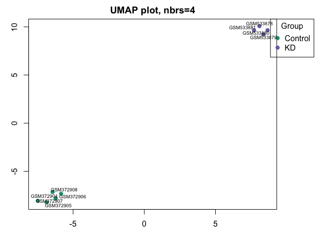
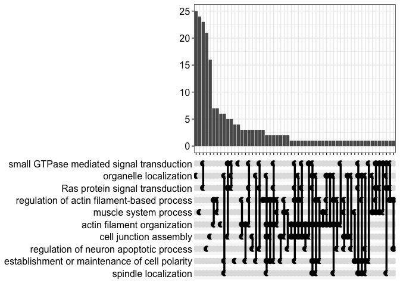
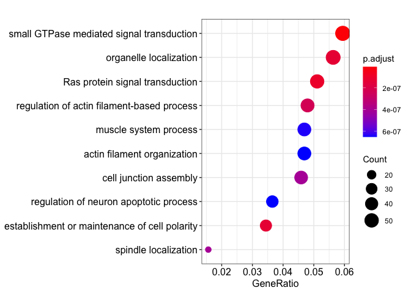
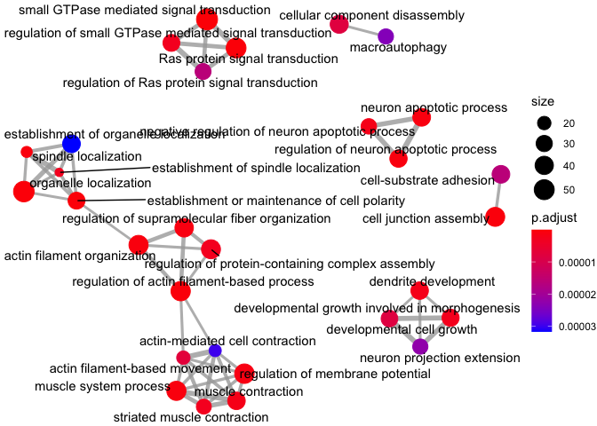
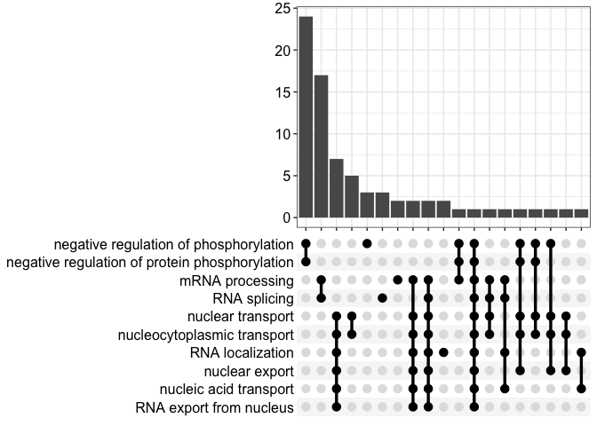
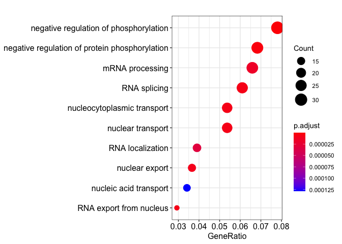
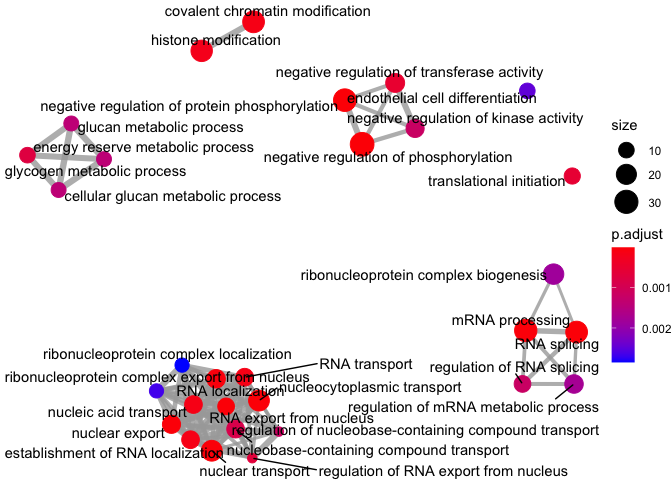

This is generated via GEO2R based on the Wentz *et al.* paper which did microarrays on hearts carb fed or kd fed mice


```r
# Version info: R 3.2.3, Biobase 2.30.0, GEOquery 2.40.0, limma 3.26.8
################################################################
#   Differential expression analysis with limma
library(GEOquery)
library(limma)
library(umap)

# load series and platform data from GEO

gset <- getGEO("GSE21368", GSEMatrix =TRUE, AnnotGPL=TRUE)
if (length(gset) > 1) idx <- grep("GPL1261", attr(gset, "names")) else idx <- 1
gset <- gset[[idx]]

# make proper column names to match toptable 
fvarLabels(gset) <- make.names(fvarLabels(gset))

# group membership for all samples
gsms <- "00000XXXXX1111"
sml <- strsplit(gsms, split="")[[1]]

# filter out excluded samples (marked as "X")
sel <- which(sml != "X")
sml <- sml[sel]
gset <- gset[ ,sel]

# log2 transformation
ex <- exprs(gset)
qx <- as.numeric(quantile(ex, c(0., 0.25, 0.5, 0.75, 0.99, 1.0), na.rm=T))
LogC <- (qx[5] > 100) ||
          (qx[6]-qx[1] > 50 && qx[2] > 0)
if (LogC) { ex[which(ex <= 0)] <- NaN
  exprs(gset) <- log2(ex) }

# assign samples to groups and set up design matrix
gs <- factor(sml)
groups <- make.names(c("Control","KD"))
levels(gs) <- groups
gset$group <- gs
design <- model.matrix(~group + 0, gset)
colnames(design) <- levels(gs)

fit <- lmFit(gset, design)  # fit linear model

# set up contrasts of interest and recalculate model coefficients
cts <- paste(groups[1], groups[2], sep="-")
cont.matrix <- makeContrasts(contrasts=cts, levels=design)
fit2 <- contrasts.fit(fit, cont.matrix)

# compute statistics and table of top significant genes
fit2 <- eBayes(fit2, 0.01)
tT <- topTable(fit2, adjust="fdr", sort.by="P", number=Inf)

tT <- subset(tT, select=c("ID","adj.P.Val","P.Value","t","B","logFC","Gene.symbol","Gene.title"))
kable(tT[1:50,], caption="Top differentially expressed genes by KD in heart")
```


Table: Top differentially expressed genes by KD in heart

|                    |ID                  | adj.P.Val| P.Value|     t|     B| logFC|Gene.symbol              |Gene.title                                                                 |
|:-------------------|:-------------------|---------:|-------:|-----:|-----:|-----:|:------------------------|:--------------------------------------------------------------------------|
|1460336_at          |1460336_at          |         0|       0| -28.7| 12.22| -3.29|Ppargc1a                 |peroxisome proliferative activated receptor, gamma, coactivator 1 alpha    |
|1451989_a_at        |1451989_a_at        |         0|       0| -26.2| 11.70| -2.95|Mapre2                   |microtubule-associated protein, RP/EB family, member 2                     |
|1429148_at          |1429148_at          |         0|       0|  24.1| 11.17|  3.53|Nfic                     |nuclear factor I/C                                                         |
|1422897_at          |1422897_at          |         0|       0|  22.4| 10.69|  3.94|Slc22a12                 |solute carrier family 22 (organic anion/cation transporter), member 12     |
|1416032_at          |1416032_at          |         0|       0|  22.2| 10.63|  2.41|Tmem109                  |transmembrane protein 109                                                  |
|AFFX-PheX-M_at      |AFFX-PheX-M_at      |         0|       0| -21.7| 10.50| -3.92|                         |                                                                           |
|1454954_at          |1454954_at          |         0|       0|  21.0| 10.28|  3.38|Wdr61                    |WD repeat domain 61                                                        |
|1456395_at          |1456395_at          |         0|       0| -19.8|  9.88| -3.43|Ppargc1a                 |peroxisome proliferative activated receptor, gamma, coactivator 1 alpha    |
|1438843_x_at        |1438843_x_at        |         0|       0| -19.8|  9.85| -2.56|Mtch2                    |mitochondrial carrier 2                                                    |
|AFFX-r2-Bs-dap-M_at |AFFX-r2-Bs-dap-M_at |         0|       0| -19.7|  9.84| -8.97|                         |                                                                           |
|1448755_at          |1448755_at          |         0|       0|  19.7|  9.83|  2.56|Col15a1                  |collagen, type XV, alpha 1                                                 |
|1418669_at          |1418669_at          |         0|       0|  19.5|  9.75|  2.95|Hspg2                    |perlecan (heparan sulfate proteoglycan 2)                                  |
|1435956_at          |1435956_at          |         0|       0| -18.9|  9.54| -2.55|Frmd5                    |FERM domain containing 5                                                   |
|1459909_at          |1459909_at          |         0|       0|  18.7|  9.45|  3.08|Nfix                     |nuclear factor I/X                                                         |
|1437733_at          |1437733_at          |         0|       0|  18.3|  9.31|  2.71|Eif4ebp2                 |eukaryotic translation initiation factor 4E binding protein 2              |
|1427965_at          |1427965_at          |         0|       0| -18.1|  9.22| -2.45|Ssbp1                    |single-stranded DNA binding protein 1                                      |
|1418468_at          |1418468_at          |         0|       0|  18.0|  9.19|  2.12|Gm2274///Gm2260///Anxa11 |predicted gene 2274///predicted gene 2260///annexin A11                    |
|1456341_a_at        |1456341_a_at        |         0|       0| -18.0|  9.17| -2.42|Klf9                     |Kruppel-like factor 9                                                      |
|1450903_at          |1450903_at          |         0|       0|  17.6|  9.04|  1.94|Rad23b                   |RAD23 homolog B, nucleotide excision repair protein                        |
|1437751_at          |1437751_at          |         0|       0| -17.6|  9.03| -3.23|Ppargc1a                 |peroxisome proliferative activated receptor, gamma, coactivator 1 alpha    |
|1448392_at          |1448392_at          |         0|       0|  17.5|  8.96|  2.28|Sparc                    |secreted acidic cysteine rich glycoprotein                                 |
|1428708_x_at        |1428708_x_at        |         0|       0|  17.4|  8.95|  1.96|Ptms                     |parathymosin                                                               |
|1450540_x_at        |1450540_x_at        |         0|       0|  17.3|  8.90|  2.50|Krtap5-1                 |keratin associated protein 5-1                                             |
|1438931_s_at        |1438931_s_at        |         0|       0| -17.2|  8.85| -2.43|Sesn1                    |sestrin 1                                                                  |
|1421964_at          |1421964_at          |         0|       0|  17.2|  8.83|  2.98|Notch3                   |notch 3                                                                    |
|1434100_x_at        |1434100_x_at        |         0|       0| -17.1|  8.82| -2.47|Ppargc1a                 |peroxisome proliferative activated receptor, gamma, coactivator 1 alpha    |
|1436032_at          |1436032_at          |         0|       0|  17.1|  8.81|  3.93|                         |                                                                           |
|1434202_a_at        |1434202_a_at        |         0|       0| -17.1|  8.81| -3.86|Fam107a                  |family with sequence similarity 107, member A                              |
|1451485_at          |1451485_at          |         0|       0| -17.1|  8.80| -2.17|Luc7l3                   |LUC7-like 3 (S. cerevisiae)                                                |
|1426873_s_at        |1426873_s_at        |         0|       0|  17.1|  8.80|  2.16|Jup                      |junction plakoglobin                                                       |
|1448909_a_at        |1448909_a_at        |         0|       0| -17.1|  8.79| -1.89|Mrpl39                   |mitochondrial ribosomal protein L39                                        |
|1428625_a_at        |1428625_a_at        |         0|       0| -17.0|  8.78| -2.81|Rmi1                     |RecQ mediated genome instability 1                                         |
|1426180_a_at        |1426180_a_at        |         0|       0|  17.0|  8.78|  3.84|Smr2                     |submaxillary gland androgen regulated protein 2                            |
|1437457_a_at        |1437457_a_at        |         0|       0| -17.0|  8.78| -1.77|Mtpn                     |myotrophin                                                                 |
|AFFX-r2-Bs-dap-3_at |AFFX-r2-Bs-dap-3_at |         0|       0| -16.9|  8.72| -8.94|                         |                                                                           |
|1421149_a_at        |1421149_a_at        |         0|       0|  16.9|  8.72|  1.71|Atn1                     |atrophin 1                                                                 |
|1456755_at          |1456755_at          |         0|       0|  16.9|  8.71|  2.02|Trak1                    |trafficking protein, kinesin binding 1                                     |
|1438657_x_at        |1438657_x_at        |         0|       0| -16.8|  8.68| -1.90|Gm13363///Ptp4a1         |predicted gene 13363///protein tyrosine phosphatase 4a1                    |
|1434944_at          |1434944_at          |         0|       0|  16.5|  8.56|  2.32|Dmpk                     |dystrophia myotonica-protein kinase                                        |
|1450576_a_at        |1450576_a_at        |         0|       0|  16.5|  8.56|  2.17|Sf3a2                    |splicing factor 3a, subunit 2                                              |
|1455116_at          |1455116_at          |         0|       0|  16.5|  8.53|  2.13|Relt                     |RELT tumor necrosis factor receptor                                        |
|1452485_at          |1452485_at          |         0|       0|  16.4|  8.52|  3.25|Zfp652///Phospho1        |zinc finger protein 652///phosphatase, orphan 1                            |
|1424880_at          |1424880_at          |         0|       0| -16.4|  8.52| -2.60|Trib1                    |tribbles pseudokinase 1                                                    |
|1455685_at          |1455685_at          |         0|       0|  16.4|  8.49|  2.41|Mical2                   |microtubule associated monooxygenase, calponin and LIM domain containing 2 |
|1415728_at          |1415728_at          |         0|       0|  16.4|  8.49|  2.46|Pabpn1                   |poly(A) binding protein, nuclear 1                                         |
|1441882_at          |1441882_at          |         0|       0|  16.3|  8.46|  3.08|                         |                                                                           |
|1434099_at          |1434099_at          |         0|       0| -16.3|  8.44| -2.39|Ppargc1a                 |peroxisome proliferative activated receptor, gamma, coactivator 1 alpha    |
|1425208_at          |1425208_at          |         0|       0|  16.2|  8.41|  3.32|Lbh                      |limb-bud and heart                                                         |
|1429177_x_at        |1429177_x_at        |         0|       0| -16.2|  8.41| -2.60|Sox17                    |SRY (sex determining region Y)-box 17                                      |
|1417765_a_at        |1417765_a_at        |         0|       0| -16.1|  8.34| -2.55|Amy1                     |amylase 1, salivary                                                        |

```r
# Visualize and quality control test results.
# Build histogram of P-values for all genes. Normal test
# assumption is that most genes are not differentially expressed.
tT2 <- topTable(fit2, adjust="fdr", sort.by="B", number=Inf)
hist(tT2$adj.P.Val, col = "grey", border = "white", xlab = "P-adj",
  ylab = "Number of genes", main = "P-adj value distribution")
```

<!-- -->

```r
# summarize test results as "up", "down" or "not expressed"
dT <- decideTests(fit2, adjust.method="fdr", p.value=0.05)

# Venn diagram of results
vennDiagram(dT, circle.col=palette())
```

<!-- -->

```r
# create Q-Q plot for t-statistic
t.good <- which(!is.na(fit2$F)) # filter out bad probes
qqt(fit2$t[t.good], fit2$df.total[t.good], main="Moderated t statistic")
```

<!-- -->

```r
# volcano plot (log P-value vs log fold change)
colnames(fit2) # list contrast names
```

[1] "Control-KD"

```r
ct <- 1        # choose contrast of interest
volcanoplot(fit2, coef=ct, main=colnames(fit2)[ct], pch=20,
  highlight=length(which(dT[,ct]!=0)), names=rep('+', nrow(fit2)))
```

<!-- -->

```r
# MD plot (log fold change vs mean log expression)
# highlight statistically significant (p-adj < 0.05) probes
plotMD(fit2, column=ct, status=dT[,ct], legend=F, pch=20, cex=1)
abline(h=0)
```

<!-- -->

```r
################################################################
# General expression data analysis
ex <- exprs(gset)

# box-and-whisker plot
ord <- order(gs)  # order samples by group
palette(c("#1B9E77", "#7570B3", "#E7298A", "#E6AB02", "#D95F02",
          "#66A61E", "#A6761D", "#B32424", "#B324B3", "#666666"))
par(mar=c(7,4,2,1))
title <- paste ("GSE21368", "/", annotation(gset), sep ="")
boxplot(ex[,ord], boxwex=0.6, notch=T, main=title, outline=FALSE, las=2, col=gs[ord])
legend("topleft", groups, fill=palette(), bty="n")
```

<!-- -->

```r
# expression value distribution
par(mar=c(4,4,2,1))
title <- paste ("GSE21368", "/", annotation(gset), " value distribution", sep ="")
plotDensities(ex, group=gs, main=title, legend ="topright")
```

<!-- -->

```r
# UMAP plot (dimensionality reduction)
ex <- na.omit(ex) # eliminate rows with NAs
ex <- ex[!duplicated(ex), ]  # remove duplicates
ump <- umap(t(ex), n_neighbors = 4, random_state = 123)
par(mar=c(3,3,2,6), xpd=TRUE)
plot(ump$layout, main="UMAP plot, nbrs=4", xlab="", ylab="", col=gs, pch=20, cex=1.5)
legend("topright", inset=c(-0.15,0), legend=levels(gs), pch=20,
col=1:nlevels(gs), title="Group", pt.cex=1.5)
library("maptools")  # point labels without overlaps
pointLabel(ump$layout, labels = rownames(ump$layout), method="SANN", cex=0.6)
```

<!-- -->

```r
# mean-variance trend, helps to see if precision weights are needed
plotSA(fit2, main="Mean variance trend, GSE21368")
```

<!-- -->

```r
#write to output file
output_file <- 'GSE21368 Analysis.csv'
write.fit(fit2, file=output_file, adjust='BH')

hcr.results <- droplevels(topTable(fit2, n=Inf, adjust.method="BH")) %>%
  select(Gene.symbol,logFC,P.Value,adj.P.Val) %>%
  distinct(Gene.symbol, .keep_all=T)
#annotate the probes
sig.hcr.results <- hcr.results %>% filter(adj.P.Val<0.05)
sig.hcr.genes <- sig.hcr.results$Gene.symbol

sig.hcr.results.up <- hcr.results %>% filter(adj.P.Val<0.05&logFC>0)
sig.hcr.genes.up <- sig.hcr.results.up$Gene.symbol

sig.hcr.results.down <- hcr.results %>% filter(adj.P.Val<0.05&logFC<0)
sig.hcr.genes.down <- sig.hcr.results.down$Gene.symbol

mTsc.datafile <- '../RNAseq/data/processed/Binary DESeq Results.csv'
mtsc.data <- read.csv(mTsc.datafile)

sig.mtsc.data <- droplevels(subset(mtsc.data, padj<0.05))
sig.mtsc.data.up <- droplevels(subset(mtsc.data, padj<0.05&log2FoldChange>0))
sig.mtsc.data.down <- droplevels(subset(mtsc.data, padj<0.05&log2FoldChange<0))

sig.mtsc.genes <- sig.mtsc.data$external_gene_name
sig.mtsc.genes.up <- sig.mtsc.data.up$external_gene_name
sig.mtsc.genes.down <- sig.mtsc.data.down$external_gene_name

sig.overlap <- intersect(sig.hcr.genes, sig.mtsc.genes)
sig.overlap.up <- intersect(sig.hcr.genes.up, sig.mtsc.genes.up)
sig.overlap.down <- intersect(sig.hcr.genes.down, sig.mtsc.genes.down)

fisher.table <-
  matrix(c(length(unique(sig.hcr.genes)),
           length(unique(fit2$genes$Gene.symbol)), 
           length(sig.overlap),
           dim(sig.mtsc.data)[1]),
       nrow = 2,
       dimnames = list(KD.Sig = c("Sig", "Total"),
                       mTSC.Sig = c("KD", "mTSC")))

kable(fisher.table, caption="Contingency table for comparason of KD and mTSC, all genes")
```


Table: Contingency table for comparason of KD and mTSC, all genes

|      |    KD| mTSC|
|:-----|-----:|----:|
|Sig   | 12290| 2689|
|Total | 21723| 4403|

```r
fisher.table.up <-
  matrix(c(length(unique(sig.hcr.genes.up)),
           length(unique(fit2$genes$Gene.symbol)), 
           length(sig.overlap.up),
           dim(sig.mtsc.data)[1]),
       nrow = 2,
       dimnames = list(KD.Sig = c("Sig", "Total"),
                       mTSC.Sig = c("KD", "mTSC")))

kable(fisher.table.up, caption="Contingency table for comparason of KD and mTSC, up-regulated genes")
```


Table: Contingency table for comparason of KD and mTSC, up-regulated genes

|      |    KD| mTSC|
|:-----|-----:|----:|
|Sig   |  9382|  999|
|Total | 21723| 4403|

```r
fisher.table.down <-
  matrix(c(length(unique(sig.hcr.genes.down)),
           length(unique(fit2$genes$Gene.symbol)), 
           length(sig.overlap.down),
           dim(sig.mtsc.data)[1]),
       nrow = 2,
       dimnames = list(KD.Sig = c("Sig", "Total"),
                       mTSC.Sig = c("KD", "mTSC")))

kable(fisher.table.down, caption="Contingency table for comparason of KD and mTSC, down-regulated genes")
```


Table: Contingency table for comparason of KD and mTSC, down-regulated genes

|      |    KD| mTSC|
|:-----|-----:|----:|
|Sig   |  2908|  426|
|Total | 21723| 4403|

Wentz et al identified 12290 significantly differentially expressed genes in their analysis out of a total of 21723 genes assessed.  Of these differentially expressed genes. 2689 genes overlapped with our 4403 significantly different genes from *Tsc1* knockout mice quadriceps.  This is a significant level of overlap (0.926 fold enrichment; p=0.005).

Focusing specifically on directionality, this is a significant level of overlap for up (1.903 times more likely; p=8.184&times; 10^-74^) and dowregulated genes (1.384 times more likely; p=8.123&times; 10^-10^)


```r
combined.genes <-
  mtsc.data %>%
  select(external_gene_name,log2FoldChange,pvalue,padj) %>%
  left_join(hcr.results, by=c('external_gene_name'='Gene.symbol')) %>%
  rename("log2FC_TSC"="log2FoldChange",
         "pval_TSC"='pvalue',
         "padj_TSC"='padj',
         "log2FC_KD"="logFC",
         'pval_KD'="P.Value",
         'padj_KD'='adj.P.Val')

with(combined.genes, lm(log2FC_TSC~log2FC_KD))  %>% tidy %>% kable(caption="Linear model for association between KD fold change and TSC fold change")
```


Table: Linear model for association between KD fold change and TSC fold change

|term        | estimate| std.error| statistic| p.value|
|:-----------|--------:|---------:|---------:|-------:|
|(Intercept) |    0.088|     0.008|     11.69|       0|
|log2FC_KD   |    0.032|     0.006|      5.72|       0|

```r
library(ggplot2)
combined.genes %>%
  ggplot(aes(y=log2FC_TSC,x=log2FC_KD)) +
  geom_point(size=0.1, alpha=0.1) +
  labs(y="TSC Fold Change",x="KD Fold Change") +
  geom_smooth(se=T)
```

<!-- -->

```r
interesting.genes <- c('Ppargc1a',"Slc16a1",'Slc16a2','Bdh1','Oxct1','Creb1','Atf4','Ddit3','Srsf7','Rbm15') #RBM15 and SRSF7 are predicted TF of SLC16A1 by MAGIC
combined.genes %>%
  filter(external_gene_name %in% interesting.genes) %>%
  kable(caption="Selected genes")
```


Table: Selected genes

|external_gene_name | log2FC_TSC| pval_TSC| padj_TSC| log2FC_KD| pval_KD| padj_KD|
|:------------------|----------:|--------:|--------:|---------:|-------:|-------:|
|Oxct1              |      0.604|    0.000|    0.000|     1.230|   0.000|   0.000|
|Srsf7              |     -0.344|    0.038|    0.111|    -1.003|   0.000|   0.001|
|Ddit3              |      1.142|    0.000|    0.000|    -1.966|   0.002|   0.009|
|Creb1              |     -0.430|    0.002|    0.010|    -0.782|   0.006|   0.021|
|Ppargc1a           |     -0.590|    0.003|    0.016|    -3.295|   0.000|   0.000|
|Slc16a1            |      1.764|    0.000|    0.000|    -1.038|   0.000|   0.000|
|Slc16a2            |      0.430|    0.039|    0.113|     1.380|   0.000|   0.002|
|Atf4               |      0.294|    0.077|    0.185|     1.864|   0.005|   0.019|
|Bdh1               |      1.103|    0.002|    0.012|    -1.331|   0.002|   0.010|
|Rbm15              |     -0.045|    0.835|    0.911|    -0.427|   0.057|   0.109|

```r
combined.genes %>%
  filter(external_gene_name %in% interesting.genes) %>%
  select(external_gene_name, log2FC_KD, log2FC_TSC) %>%
  group_by(external_gene_name) %>%
  pivot_longer(names_to = 'Experiment', values_to = 'Log2FC', cols=log2FC_KD:log2FC_TSC) %>%
  ggplot(aes(y=Log2FC,x=external_gene_name,
             fill=Experiment)) +
    geom_bar(stat='identity', position='dodge')
```

<!-- -->


```r
require(venneuler)
v.diseases <- venneuler(c("KD"=length(sig.hcr.genes), 
                 "Tsc1 Knockout Muscles"=length(sig.mtsc.genes),
                 "KD&Tsc1 Knockout Muscles"=length(intersect(sig.hcr.genes, sig.mtsc.genes))))

v.diseases.up <- venneuler(c("KD"=length(sig.hcr.genes.up), 
                 "Tsc1 Knockout Muscles"=length(sig.mtsc.genes.up),
                 "KD&Tsc1 Knockout Muscles"=length(intersect(sig.hcr.genes.up, sig.mtsc.genes.up))))
v.diseases.down <- venneuler(c("KD"=length(sig.hcr.genes.down), 
                 "Tsc1 Knockout Muscles"=length(sig.mtsc.genes.down),
                 "KD&Tsc1 Knockout Muscles"=length(intersect(sig.hcr.genes.down, sig.mtsc.genes.down))))

write(intersect(sig.hcr.genes.up, sig.mtsc.genes.up), "Genes Upregulated in both KD hearts and TSC.txt")
write(intersect(sig.hcr.genes.down, sig.mtsc.genes.down), "Genes Downregulated in both KD hearts and TSC.txt")


plot(v.diseases, main="TSC-Dependent Transcriptional Changes")
```

<!-- -->

```r
plot(v.diseases.up, main="TSC-Dependent and KD Upregulation")
```

<!-- -->

```r
plot(v.diseases, main="TSC-Dependent and KD Downregulatio ")
```

<!-- -->

```r
# library(Vennerable)
# v.list <- list(`Tsc2 Knockout MEFs` = sig.duvel.genes, `Tsc1 Knockout Muscles` = sig.mtsc.genes)
# v.data <- Venn(v.list)
# plot(v.data)
```


```r
combined.genes %>%
  filter(pval_TSC<0.05&pval_KD<0.05) %>%
  mutate(Ratio=log2FC_TSC/log2FC_KD) %>%
  filter(Ratio>0) %>%
  write.csv('Genes Significant in both KD hearts and TSC.csv')
```

# Pathway Analysis


```r
library(clusterProfiler)
library(org.Mm.eg.db)
go.enrich.up <- enrichGO(gene=intersect(sig.hcr.genes.up, sig.mtsc.genes.up), 
             ont ="BP", 
             keyType = "SYMBOL", 
             OrgDb = org.Mm.eg.db)
library(enrichplot)
upsetplot(go.enrich.up)
```

<!-- -->

```r
dotplot(go.enrich.up)
```

<!-- -->

```r
emapplot(go.enrich.up)
```

<!-- -->

```r
go.enrich.down <- enrichGO(gene=intersect(sig.hcr.genes.down, sig.mtsc.genes.down), 
             ont ="BP", 
             keyType = "SYMBOL", 
             OrgDb = org.Mm.eg.db)
upsetplot(go.enrich.down)
```

<!-- -->

```r
dotplot(go.enrich.down)
```

<!-- -->

```r
emapplot(go.enrich.down)
```

<!-- -->


```r
sessionInfo()
```

```
## R version 4.0.2 (2020-06-22)
## Platform: x86_64-apple-darwin17.0 (64-bit)
## Running under: macOS  10.16
## 
## Matrix products: default
## BLAS:   /Library/Frameworks/R.framework/Versions/4.0/Resources/lib/libRblas.dylib
## LAPACK: /Library/Frameworks/R.framework/Versions/4.0/Resources/lib/libRlapack.dylib
## 
## locale:
## [1] en_US.UTF-8/en_US.UTF-8/en_US.UTF-8/C/en_US.UTF-8/en_US.UTF-8
## 
## attached base packages:
## [1] stats4    parallel  stats     graphics  grDevices utils     datasets 
## [8] methods   base     
## 
## other attached packages:
##  [1] enrichplot_1.8.1       org.Mm.eg.db_3.11.4    AnnotationDbi_1.50.3  
##  [4] IRanges_2.22.2         S4Vectors_0.26.1       clusterProfiler_3.16.1
##  [7] venneuler_1.1-0        rJava_0.9-13           ggplot2_3.3.3         
## [10] maptools_1.1-1         sp_1.4-5               umap_0.2.7.0          
## [13] limma_3.44.3           GEOquery_2.56.0        Biobase_2.48.0        
## [16] BiocGenerics_0.34.0    broom_0.7.5            dplyr_1.0.5           
## [19] tidyr_1.1.3            knitr_1.31            
## 
## loaded via a namespace (and not attached):
##   [1] fgsea_1.14.0        colorspace_2.0-0    ggridges_0.5.3     
##   [4] ellipsis_0.3.1      qvalue_2.20.0       rstudioapi_0.13    
##   [7] farver_2.1.0        urltools_1.7.3      graphlayouts_0.7.1 
##  [10] ggrepel_0.9.1       bit64_4.0.5         scatterpie_0.1.5   
##  [13] RSpectra_0.16-0     fansi_0.4.2         xml2_1.3.2         
##  [16] splines_4.0.2       cachem_1.0.4        GOSemSim_2.14.2    
##  [19] polyclip_1.10-0     jsonlite_1.7.2      GO.db_3.11.4       
##  [22] ggforce_0.3.3       BiocManager_1.30.10 readr_1.4.0        
##  [25] compiler_4.0.2      httr_1.4.2          rvcheck_0.1.8      
##  [28] backports_1.2.1     assertthat_0.2.1    Matrix_1.3-2       
##  [31] fastmap_1.1.0       cli_2.3.1           tweenr_1.0.1       
##  [34] htmltools_0.5.1.1   prettyunits_1.1.1   tools_4.0.2        
##  [37] igraph_1.2.6        gtable_0.3.0        glue_1.4.2         
##  [40] reshape2_1.4.4      DO.db_2.9           fastmatch_1.1-0    
##  [43] Rcpp_1.0.6          jquerylib_0.1.3     vctrs_0.3.6        
##  [46] nlme_3.1-152        ggraph_2.0.5        xfun_0.22          
##  [49] stringr_1.4.0       lifecycle_1.0.0     DOSE_3.14.0        
##  [52] europepmc_0.4       MASS_7.3-53.1       scales_1.1.1       
##  [55] tidygraph_1.2.0     hms_1.0.0           ggupset_0.3.0      
##  [58] RColorBrewer_1.1-2  yaml_2.2.1          curl_4.3           
##  [61] memoise_2.0.0       reticulate_1.18     gridExtra_2.3      
##  [64] downloader_0.4      sass_0.3.1          triebeard_0.3.0    
##  [67] stringi_1.5.3       RSQLite_2.2.4       highr_0.8          
##  [70] BiocParallel_1.22.0 rlang_0.4.10        pkgconfig_2.0.3    
##  [73] evaluate_0.14       lattice_0.20-41     purrr_0.3.4        
##  [76] labeling_0.4.2      cowplot_1.1.1       bit_4.0.4          
##  [79] tidyselect_1.1.0    plyr_1.8.6          magrittr_2.0.1     
##  [82] R6_2.5.0            generics_0.1.0      DBI_1.1.1          
##  [85] pillar_1.5.1        foreign_0.8-81      withr_2.4.1        
##  [88] mgcv_1.8-34         tibble_3.1.0        crayon_1.4.1       
##  [91] utf8_1.2.1          rmarkdown_2.7       viridis_0.5.1      
##  [94] progress_1.2.2      grid_4.0.2          data.table_1.14.0  
##  [97] blob_1.2.1          digest_0.6.27       gridGraphics_0.5-1 
## [100] openssl_1.4.3       munsell_0.5.0       ggplotify_0.0.5    
## [103] viridisLite_0.3.0   bslib_0.2.4         askpass_1.1
```
