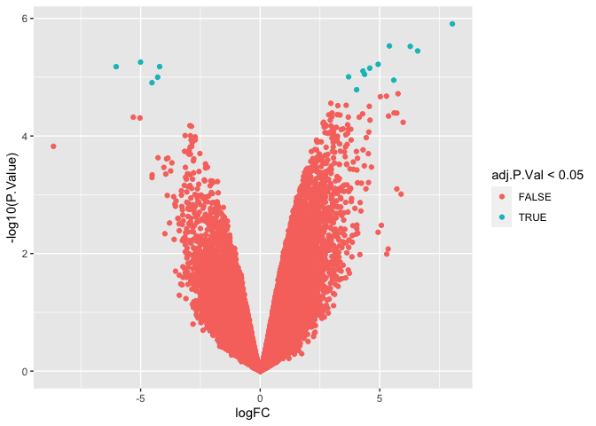

This is generated via GEO2R based on the Kennedy *et al.* paper which did microarrays on livers from NCD and KD fed mice.


```r
# Version info: R 3.2.3, Biobase 2.30.0, GEOquery 2.40.0, limma 3.26.8
# R scripts generated  Thu May 14 13:42:34 EDT 2020

################################################################
#   Differential expression analysis with limma
library(Biobase)
library(GEOquery)
library(limma)

# load series and platform data from GEO

gset <- getGEO("GSE7699", GSEMatrix =TRUE, AnnotGPL=TRUE)
if (length(gset) > 1) idx <- grep("GPL1261", attr(gset, "names")) else idx <- 1
gset <- gset[[idx]]

# make proper column names to match toptable 
fvarLabels(gset) <- make.names(fvarLabels(gset))

# group names for all samples
gsms <- "000111"
sml <- c()
for (i in 1:nchar(gsms)) { sml[i] <- substr(gsms,i,i) }

# log2 transform
ex <- exprs(gset)
qx <- as.numeric(quantile(ex, c(0., 0.25, 0.5, 0.75, 0.99, 1.0), na.rm=T))
LogC <- (qx[5] > 100) ||
          (qx[6]-qx[1] > 50 && qx[2] > 0) ||
          (qx[2] > 0 && qx[2] < 1 && qx[4] > 1 && qx[4] < 2)
if (LogC) { ex[which(ex <= 0)] <- NaN
  exprs(gset) <- log2(ex) }

# set up the data and proceed with analysis
sml <- paste("G", sml, sep="")    # set group names
fl <- as.factor(sml)
gset$description <- fl
design <- model.matrix(~ description + 0, gset)
colnames(design) <- levels(fl)
fit <- lmFit(gset, design)
cont.matrix <- makeContrasts(G1-G0, levels=design)
fit2 <- contrasts.fit(fit, cont.matrix)
fit2 <- eBayes(fit2, 0.01)
tT <- topTable(fit2, adjust="fdr", sort.by="B", number=250)

tT <- subset(tT, select=c("ID","adj.P.Val","P.Value","t","B","logFC","Gene.symbol","Gene.title"))
#write.table(tT, file=stdout(), row.names=F, sep="\t")


################################################################
#   Boxplot for selected GEO samples
library(Biobase)
library(GEOquery)

# load series and platform data from GEO

gset <- getGEO("GSE7699", GSEMatrix =TRUE, getGPL=FALSE)
if (length(gset) > 1) idx <- grep("GPL1261", attr(gset, "names")) else idx <- 1
gset <- gset[[idx]]

# group names for all samples in a series
gsms <- "000111"
sml <- c()
for (i in 1:nchar(gsms)) { sml[i] <- substr(gsms,i,i) }
sml <- paste("G", sml, sep="")  # set group names

# order samples by group
ex <- exprs(gset)[ , order(sml)]
sml <- sml[order(sml)]
fl <- as.factor(sml)
labels <- c("Control","Ketogenic")

# set parameters and draw the plot
palette(c("#dfeaf4","#f4dfdf", "#AABBCC"))
dev.new(width=4+dim(gset)[[2]]/5, height=6)
par(mar=c(2+round(max(nchar(sampleNames(gset)))/2),4,2,1))
title <- paste ("GSE17190", '/', annotation(gset), " selected samples", sep ='')
boxplot(ex, boxwex=0.6, notch=T, main=title, outline=FALSE, las=2, col=fl)
legend("topleft", labels, fill=palette(), bty="n")


#write to output file
output_file <- 'GSE7699 Analysis.csv'
write.fit(fit2, file=output_file, adjust='BH')

kd.results <- droplevels(topTable(fit2, n=Inf, adjust.method="BH")) %>%
  select(Gene.symbol,logFC,P.Value,adj.P.Val) %>%
  distinct(Gene.symbol, .keep_all=T)

kd.results %>%
  filter(adj.P.Val<0.05) %>%
  arrange(-logFC) %>%
  kable(caption="Significantly differentially expressed genes")
```


Table: Significantly differentially expressed genes

Gene.symbol       logFC   P.Value   adj.P.Val
---------------  ------  --------  ----------
Psat1              8.04         0       0.035
Gm8096///Phgdh     6.59         0       0.035
Mmp12              6.28         0       0.035
Epcam              5.59         0       0.036
Tnfrsf12a          5.41         0       0.035
Ccnb2              4.93         0       0.035
Lgals3             4.58         0       0.035
Ly6d               4.37         0       0.035
Smc2               4.30         0       0.035
Birc5              4.03         0       0.046
Coro1a             3.70         0       0.035
Pdzd3             -4.21         0       0.035
                  -4.29         0       0.035
9530034A14Rik     -4.53         0       0.037
Mup3              -5.00         0       0.035
Scd1              -6.02         0       0.035

```r
library(readr)
human_mouse_table_file <- 'http://www.informatics.jax.org/downloads/reports/HOM_MouseHumanSequence.rpt'
human_mouse_table <- read_tsv(human_mouse_table_file)
human.to.mouse <- 
  human_mouse_table %>%
  select(`Common Organism Name`, Symbol, `HomoloGene ID`) %>%
  distinct(`HomoloGene ID`,`Common Organism Name`, .keep_all = T) %>%
  spread(`Common Organism Name`, Symbol) %>%
  rename("mouse"="mouse, laboratory")

merged.data <- left_join(kd.results, human.to.mouse, by=c("Gene.symbol"="mouse")) %>% filter(!(is.na(human)))

gsea.output <- 'GSE7699.rnk'
merged.data %>%
  arrange(-logFC) %>%
  select(human, logFC) %>%
  write_tsv(gsea.output)
```

Wrote out ranked gene list after converting to human using http://www.informatics.jax.org/downloads/reports/HOM_MouseHumanSequence.rpt into the file GSE7699.rnk.


```r
library(ggplot2)
kd.results %>% 
  ggplot(aes(y=-log10(P.Value),
              x=logFC,
              col=adj.P.Val<0.05)) +
  geom_point()
```

<!-- -->


```r
interesting.genes <- c('Bdh1','Gdf15','Hmgcs2','Fas','Bhdh','Apob','Ldlr','Cyp7a1')
kd.results %>%
  filter(Gene.symbol %in% interesting.genes) %>%
  mutate(FC=2^logFC) %>%
  kable(caption="Selected genes")
```


Table: Selected genes

Gene.symbol     logFC   P.Value   adj.P.Val      FC
------------  -------  --------  ----------  ------
Bdh1            1.552     0.006       0.202   2.932
Gdf15           1.236     0.006       0.202   2.356
Apob            0.557     0.121       0.548   1.472
Fas             0.401     0.325       0.712   1.321
Hmgcs2          0.315     0.418       0.765   1.244
Ldlr           -0.167     0.661       0.883   0.891
Cyp7a1         -0.176     0.689       0.894   0.885


```r
sessionInfo()
```

```
## R version 4.0.0 (2020-04-24)
## Platform: x86_64-apple-darwin17.0 (64-bit)
## Running under: macOS Catalina 10.15.4
## 
## Matrix products: default
## BLAS:   /Library/Frameworks/R.framework/Versions/4.0/Resources/lib/libRblas.dylib
## LAPACK: /Library/Frameworks/R.framework/Versions/4.0/Resources/lib/libRlapack.dylib
## 
## locale:
## [1] en_US.UTF-8/en_US.UTF-8/en_US.UTF-8/C/en_US.UTF-8/en_US.UTF-8
## 
## attached base packages:
## [1] parallel  stats     graphics  grDevices utils     datasets  methods  
## [8] base     
## 
## other attached packages:
##  [1] ggplot2_3.3.0       readr_1.3.1         limma_3.44.1       
##  [4] GEOquery_2.56.0     Biobase_2.48.0      BiocGenerics_0.34.0
##  [7] broom_0.5.6         dplyr_0.8.5         tidyr_1.0.3        
## [10] knitr_1.28         
## 
## loaded via a namespace (and not attached):
##  [1] Rcpp_1.0.4.6     highr_0.8        pillar_1.4.4     compiler_4.0.0  
##  [5] tools_4.0.0      digest_0.6.25    gtable_0.3.0     evaluate_0.14   
##  [9] lifecycle_0.2.0  tibble_3.0.1     nlme_3.1-147     lattice_0.20-41 
## [13] pkgconfig_2.0.3  rlang_0.4.6      curl_4.3         yaml_2.2.1      
## [17] xfun_0.13        withr_2.2.0      stringr_1.4.0    xml2_1.3.2      
## [21] generics_0.0.2   vctrs_0.2.4      hms_0.5.3        grid_4.0.0      
## [25] tidyselect_1.0.0 glue_1.4.0       R6_2.4.1         rmarkdown_2.1   
## [29] farver_2.0.3     purrr_0.3.4      magrittr_1.5     scales_1.1.0    
## [33] backports_1.1.6  ellipsis_0.3.0   htmltools_0.4.0  assertthat_0.2.1
## [37] colorspace_1.4-1 labeling_0.3     stringi_1.4.6    munsell_0.5.0   
## [41] crayon_1.3.4
```
