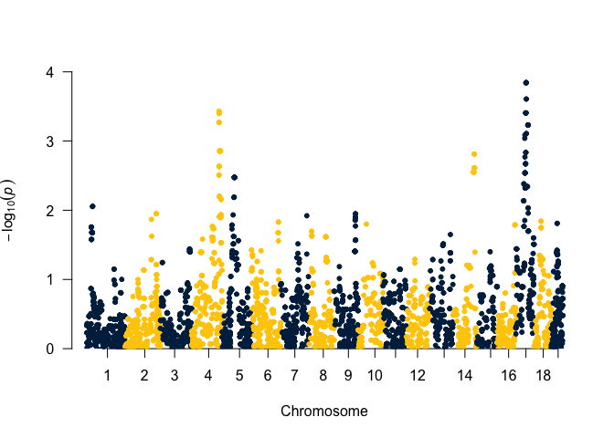
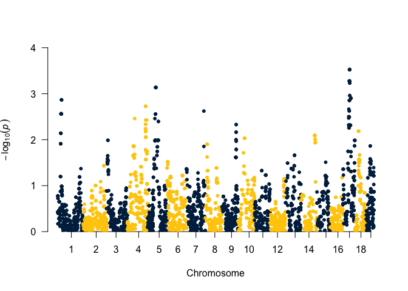

# Purpose

Use this file to generate bimbam files for GEMMA analyses

# Raw Data

Downloaded SNPs from GeneNetwork 


```r
bxd.genotypes <- 'BXD-geno_8-9-17.txt'
library(readr)
bxd.genotype.data <- read_tsv(bxd.genotypes, skip=20,
                              col_types = cols(
  .default = col_character(),
  Chr = col_factor(levels=NULL),
  cM = col_double(),
  Mb = col_double()
)) %>%  
  mutate(`5XFAD`='B') %>% #strain 5x FAD is set to homozygous B allele
  mutate(`D2Gpnmb`='D') %>% #strain 5x FAD is set to homozygous B allele
  mutate(`D2`='D')  #strain 5x FAD is set to homozygous B allele

phenotype.data <-  'Strain Level Energy Expenditure Data.csv'
ee.phenotype.data <- 
  read_csv(phenotype.data) %>%
  filter(!is.na(MR_W))
```

These data can be found in **/Users/davebrid/Documents/GitHub/TissueSpecificTscKnockouts/Other Published Data/Systems Biology**.  This script was most recently updated on **Mon Feb 14 10:59:02 2022**.

This analysis uses the BXD genotyping file at BXD-geno_8-9-17.txt which had 7320 markers for 205 strains of mice.

## Making Energy Expenditure Phenotype Files

The phenotype file must be in the order of the genotypes with that length.  Missing phenotypes should be denoted with NA


```r
strain.list <-
  bxd.genotype.data %>%
  mutate(`C57BL/6J`='B',
         `DBA/2J`='D') %>%
  select(ee.phenotype.data$Name) %>%
  colnames() %>%
  as.data.frame %>%
  rename("Strain"=1)

phenotype.table <-
  left_join(strain.list, ee.phenotype.data, by=c("Strain"="Name")) %>%
  select(Strain,MR_W, MR_adj) %>%
  arrange(Strain) 

phenotype.file <- 'ee_phenotype.csv'
phenotype.table %>% 
  select(MR_W) %>%
  write_csv(phenotype.file, col_names=F)


phenotype.file <- 'ee_adj_phenotype.csv'
phenotype.table %>% 
  select(MR_adj) %>%
  write_csv(phenotype.file, col_names=F)

ee.genotype.file <- 'bxd-ee-genotype.bimbam' 
bxd.genotype.data %>%
    mutate(`C57BL/6J`='B',
         `DBA/2J`='D') %>%
  select(-Chr,-cM) %>%
  mutate_at(.vars=vars(-("Locus")),
            .funs=funs(case_when(.=='B'~2,
                                            .=='D'~0))) %>%
  mutate(Major = 'B',
         Minor = 'D') %>%
  select(Locus,Major,Minor,strain.list$Strain) %>% 
  write_csv(ee.genotype.file, col_names=FALSE)

ee.phenotype.data[!(ee.phenotype.data$Name %in% phenotype.table$Strain),] %>%
  kable(caption="Strains without genotypes in genotype file")
```


Table: Strains without genotypes in genotype file

|Name | MR_W| MR_adj|
|:----|----:|------:|

Exported file with NA phenotypes.  This is based on 44 input phenotypes.  

# GEMMA Analysis

## Linear Mixed Models


```sh
#generate relatedness matrix (uses standard matrix)
gemma -g bxd-ee-genotype.bimbam -p ee_phenotype.csv -gk 1 -o ee
#perform eigen decomposition
gemma -g bxd-ee-genotype.bimbam -p ee_phenotype.csv -k output/ee.cXX.txt -eigen -o ee
#run mixed linear model for fat.gain mass
gemma -g bxd-ee-genotype.bimbam -p ee_phenotype.csv -a snp-annotation.bimbam -k output/ee.cXX.txt -lmm 1 -o ee


#generate relatedness matrix (uses standard matrix)
gemma -g bxd-ee-genotype.bimbam -p ee_adj_phenotype.csv -gk 1 -o ee.adj
#perform eigen decomposition
gemma -g bxd-ee-genotype.bimbam -p ee_adj_phenotype.csv -k output/ee.adj.cXX.txt -eigen -o ee.adj
#run mixed linear model for fat.gain mass
gemma -g bxd-ee-genotype.bimbam -p ee_adj_phenotype.csv -a snp-annotation.bimbam -k output/ee.adj.cXX.txt -lmm 1 -o ee.adj
```

```
## GEMMA 0.98.5 (2021-08-25) by Xiang Zhou, Pjotr Prins and team (C) 2012-2021
## Reading Files ... 
## ## number of total individuals = 44
## ## number of analyzed individuals = 44
## ## number of covariates = 1
## ## number of phenotypes = 1
## ## number of total SNPs/var        =     7320
## ## number of analyzed SNPs         =     7167
## Calculating Relatedness Matrix ... 
##                                                    0%
======                                             14%
=============                                      27%
====================                               41%
===========================                        55%
==================================                 68%
========================================           82%
===============================================    96%
================================================== 100%
## **** INFO: Done.
## GEMMA 0.98.5 (2021-08-25) by Xiang Zhou, Pjotr Prins and team (C) 2012-2021
## Reading Files ... 
## ## number of total individuals = 44
## ## number of analyzed individuals = 44
## ## number of covariates = 1
## ## number of phenotypes = 1
## ## number of total SNPs/var        =     7320
## ## number of analyzed SNPs         =     7167
## Start Eigen-Decomposition...
## **** INFO: Done.
## GEMMA 0.98.5 (2021-08-25) by Xiang Zhou, Pjotr Prins and team (C) 2012-2021
## Reading Files ... 
## ## number of total individuals = 44
## ## number of analyzed individuals = 44
## ## number of covariates = 1
## ## number of phenotypes = 1
## ## number of total SNPs/var        =     7320
## ## number of analyzed SNPs         =     7167
## Start Eigen-Decomposition...
## pve estimate =0.363116
## se(pve) =0.232776
##                                                    0%
======                                             14%
=============                                      27%
====================                               41%
===========================                        55%
==================================                 68%
========================================           82%
===============================================    96%
================================================== 100%
================================================== 100%
## **** INFO: Done.
## GEMMA 0.98.5 (2021-08-25) by Xiang Zhou, Pjotr Prins and team (C) 2012-2021
## Reading Files ... 
## ## number of total individuals = 44
## ## number of analyzed individuals = 44
## ## number of covariates = 1
## ## number of phenotypes = 1
## ## number of total SNPs/var        =     7320
## ## number of analyzed SNPs         =     7167
## Calculating Relatedness Matrix ... 
##                                                    0%
======                                             14%
=============                                      27%
====================                               41%
===========================                        55%
==================================                 68%
========================================           82%
===============================================    96%
================================================== 100%
## **** INFO: Done.
## GEMMA 0.98.5 (2021-08-25) by Xiang Zhou, Pjotr Prins and team (C) 2012-2021
## Reading Files ... 
## ## number of total individuals = 44
## ## number of analyzed individuals = 44
## ## number of covariates = 1
## ## number of phenotypes = 1
## ## number of total SNPs/var        =     7320
## ## number of analyzed SNPs         =     7167
## Start Eigen-Decomposition...
## **** INFO: Done.
## GEMMA 0.98.5 (2021-08-25) by Xiang Zhou, Pjotr Prins and team (C) 2012-2021
## Reading Files ... 
## ## number of total individuals = 44
## ## number of analyzed individuals = 44
## ## number of covariates = 1
## ## number of phenotypes = 1
## ## number of total SNPs/var        =     7320
## ## number of analyzed SNPs         =     7167
## Start Eigen-Decomposition...
## pve estimate =0.368725
## se(pve) =0.23959
##                                                    0%
======                                             14%
=============                                      27%
====================                               41%
===========================                        55%
==================================                 68%
========================================           82%
===============================================    96%
================================================== 100%
================================================== 100%
## **** INFO: Done.
```

## BSLMM Analyses


## EE QTL Analysis

### Lean Mass Adjusted Energy Expenditure


```r
ee.adj.lmm.filename <- 'output/ee.adj.assoc.txt'
ee.adj.lmm.results <- read.table(ee.adj.lmm.filename, sep='\t', header=T)
suggestive.pval <- 1E-5
gw.pval <- 5E-8

ee.adj.lmm.results %>%
  arrange(p_wald) %>% 
  filter(p_wald<gw.pval) %>%
  kable(caption="Genome-wide significant associations from mixed linear models for lean mass adjusted energy expenditure") 
```


Table: Genome-wide significant associations from mixed linear models for lean mass adjusted energy expenditure

|chr |rs | ps| n_miss|allele1 |allele0 | af| beta| se| logl_H1| l_remle| p_wald|
|:---|:--|--:|------:|:-------|:-------|--:|----:|--:|-------:|-------:|------:|

```r
ee.adj.lmm.results %>%
  arrange(p_wald) %>% 
  filter(p_wald<suggestive.pval) %>%
  kable(caption="Suggestive associations from mixed linear models for lean mass adjusted energy expenditure on NCD ") 
```


Table: Suggestive associations from mixed linear models for lean mass adjusted energy expenditure on NCD 

|chr |rs | ps| n_miss|allele1 |allele0 | af| beta| se| logl_H1| l_remle| p_wald|
|:---|:--|--:|------:|:-------|:-------|--:|----:|--:|-------:|-------:|------:|

```r
 ee.adj.lmm.results %>%
    arrange(p_wald) %>% 
    filter(p_wald<0.05) %>%
    head(10) %>%
    kable(caption="Top 10 nominal associations from mixed linear models for adjusted energy expenditure", digits=c(0,0,0,0,0,0,3,3,3,1,3,8)) 
```


Table: Top 10 nominal associations from mixed linear models for adjusted energy expenditure

|chr |rs          |        ps| n_miss|allele1 |allele0 |    af|   beta|    se| logl_H1| l_remle|   p_wald|
|:---|:-----------|---------:|------:|:-------|:-------|-----:|------:|-----:|-------:|-------:|--------:|
|17  |rs3701810   |  53671659|      0|B       |D       | 0.500| -0.044| 0.010|    53.5|   0.046| 0.000144|
|17  |rs33298619  |  53841887|      0|B       |D       | 0.500| -0.044| 0.010|    53.5|   0.046| 0.000144|
|17  |rs33350436  |  54042816|      0|B       |D       | 0.500| -0.044| 0.010|    53.5|   0.046| 0.000144|
|17  |rs29662941  |  55231419|      0|B       |D       | 0.500| -0.044| 0.010|    53.5|   0.046| 0.000144|
|17  |rs29658587  |  55264473|      0|B       |D       | 0.500| -0.044| 0.010|    53.5|   0.046| 0.000144|
|17  |rs3714226   |  55270112|      0|B       |D       | 0.500| -0.044| 0.010|    53.5|   0.046| 0.000144|
|17  |rs48234356  |  55293006|      0|B       |D       | 0.523| -0.043| 0.011|    53.2|   0.074| 0.000247|
|17  |rs49531041  |  55346551|      0|B       |D       | 0.523| -0.043| 0.011|    53.2|   0.074| 0.000247|
|4   |UNC8365581  | 140924595|      1|B       |D       | 0.488| -0.042| 0.011|    52.3|   0.019| 0.000372|
|4   |UNCHS013113 | 140951973|      1|B       |D       | 0.488| -0.042| 0.011|    52.3|   0.019| 0.000372|

```r
 ee.adj.lmm.results %>%
   arrange(p_wald) %>% 
    group_by(chr) %>%
   head(50) %>%
  mutate(Lead.SNP = first(rs),
         lead.pval = min(p_wald)) %>%
  group_by(chr) %>%
  summarize(Region.Start=min(ps),
         Region.End = max(ps),
         Pval=min(lead.pval)) %>%
  mutate(Region.Size=Region.End-Region.Start) %>%
  arrange(Pval) %>%
  kable(caption="Top loci assocated with unadjusted energy expenditure")
```


Table: Top loci assocated with unadjusted energy expenditure

|chr | Region.Start| Region.End|  Pval| Region.Size|
|:---|------------:|----------:|-----:|-----------:|
|17  |     47729473|   64397789| 0.000|    16668316|
|4   |    140924595|  148864403| 0.000|     7939808|
|X   |     59254162|   79295786| 0.001|    20041624|
|14  |    109589142|  110963485| 0.002|     1374343|

```r
library(qqman)
library(ggplot2) 

ee.adj.lmm.results %>%
  mutate(chr=as.numeric(as.character(chr))) %>%
  na.omit %>%
# Make the Manhattan plot on the gwasResults dataset
  manhattan(chr="chr", bp="ps", snp="rs", p="p_wald",col = color.scheme, 
            suggestiveline =-log10(suggestive.pval),
            genomewideline = -log10(gw.pval),
            cex.text=5) 
```

<!-- -->

### Unadjusted Energy Expenditure


```r
ee.lmm.filename <- 'output/ee.assoc.txt'
ee.lmm.results <- read.table(ee.lmm.filename, sep='\t', header=T)


ee.lmm.results %>%
  arrange(p_wald) %>% 
  filter(p_wald<gw.pval) %>%
  kable(caption="Genome-wide significant associations from mixed linear models for unadjusted energy expenditure") 
```


Table: Genome-wide significant associations from mixed linear models for unadjusted energy expenditure

|chr |rs | ps| n_miss|allele1 |allele0 | af| beta| se| logl_H1| l_remle| p_wald|
|:---|:--|--:|------:|:-------|:-------|--:|----:|--:|-------:|-------:|------:|

```r
ee.lmm.results %>%
  arrange(p_wald) %>% 
  filter(p_wald<suggestive.pval) %>%
  kable(caption="Suggestive associations from mixed linear models for unadjusted energy expenditure") 
```


Table: Suggestive associations from mixed linear models for unadjusted energy expenditure

|chr |rs | ps| n_miss|allele1 |allele0 | af| beta| se| logl_H1| l_remle| p_wald|
|:---|:--|--:|------:|:-------|:-------|--:|----:|--:|-------:|-------:|------:|

```r
ee.lmm.results %>%
   arrange(p_wald) %>% 
   head(10) %>%
   filter(p_wald<0.05) %>%
   kable(caption="Top 10 nominal associations from mixed linear models for unadjusted energy expenditure") 
```


Table: Top 10 nominal associations from mixed linear models for unadjusted energy expenditure

|chr |rs          |       ps| n_miss|allele1 |allele0 |    af|   beta|    se| logl_H1| l_remle| p_wald|
|:---|:-----------|--------:|------:|:-------|:-------|-----:|------:|-----:|-------:|-------:|------:|
|17  |rs3701810   | 53671659|      0|B       |D       | 0.500| -0.045| 0.011|    50.3|   0.088|  0.000|
|17  |rs33298619  | 53841887|      0|B       |D       | 0.500| -0.045| 0.011|    50.3|   0.088|  0.000|
|17  |rs33350436  | 54042816|      0|B       |D       | 0.500| -0.045| 0.011|    50.3|   0.088|  0.000|
|17  |rs29662941  | 55231419|      0|B       |D       | 0.500| -0.045| 0.011|    50.3|   0.088|  0.000|
|17  |rs29658587  | 55264473|      0|B       |D       | 0.500| -0.045| 0.011|    50.3|   0.088|  0.000|
|17  |rs3714226   | 55270112|      0|B       |D       | 0.500| -0.045| 0.011|    50.3|   0.088|  0.000|
|17  |rs108472693 | 52367518|      1|B       |D       | 0.512| -0.044| 0.012|    49.7|   0.077|  0.001|
|17  |rs107973496 | 52553706|      1|B       |D       | 0.512| -0.044| 0.012|    49.7|   0.077|  0.001|
|17  |rs49859441  | 52557274|      1|B       |D       | 0.512| -0.044| 0.012|    49.7|   0.077|  0.001|
|17  |rs48107437  | 52562116|      1|B       |D       | 0.512| -0.044| 0.012|    49.7|   0.077|  0.001|

```r
ee.lmm.results %>%
   arrange(p_wald) %>% 
    group_by(chr) %>%
   head(50) %>%
  mutate(Lead.SNP = first(rs),
         lead.pval = min(p_wald)) %>%
  group_by(chr) %>%
  summarize(Region.Start=min(ps),
         Region.End = max(ps),
         Pval=min(lead.pval)) %>%
  mutate(Region.Size=Region.End-Region.Start) %>%
    arrange(Pval) %>%
  kable(caption="Top loci assocated with unadjusted energy expenditure")
```


Table: Top loci assocated with unadjusted energy expenditure

|chr | Region.Start| Region.End|  Pval| Region.Size|
|:---|------------:|----------:|-----:|-----------:|
|17  |     48494979|   64397789| 0.000|    15902810|
|5   |     63428273|   66385793| 0.001|     2957520|
|X   |     21061933|   79295786| 0.001|    58233853|
|1   |     31659464|   32159236| 0.001|      499772|
|4   |    141050324|  141190751| 0.002|      140427|

```r
ee.lmm.results %>%
  mutate(chr=as.numeric(as.character(chr))) %>%
  na.omit %>%
# Make the Manhattan plot on the gwasResults dataset
  manhattan(chr="chr", bp="ps", snp="rs", p="p_wald",col = color.scheme, 
            suggestiveline =-log10(suggestive.pval),
            genomewideline = -log10(gw.pval))
```

<!-- -->

# Analysis of QTLs

```{ee-suggestive-snps}
sug.snps <- 
  ee.adj.lmm.results %>%
  arrange(p_wald) %>%
  distinct(chr, .keep_all=T) %>%
  filter(p_wald<suggestive.pval) %>%
  pull(rs)

sug.genotype.data <- bxd.genotype.data %>%
  filter(Locus %in% sug.snps) %>%
      mutate(`C57BL/6J`='B',
         `DBA/2J`='D') %>%
  select(Chr,Locus,ee.phenotype.data$Name)

snp.annotated.ee.adj.phenotype <- 
  sug.genotype.data %>% 
  pivot_longer(cols= -one_of('Chr','Locus','Name'), 
                                   names_to='Strain',
                                   values_to='Genotype') %>% 
  pivot_wider(names_from=c('Chr','Locus'),values_from='Genotype') %>%
  left_join(ee.phenotype.data,by =c("Strain"="Name"))
  

library(ggplot2)  
snp.annotated.ee.adj.phenotype %>% 
  group_by(`4_UNC8365581`) %>%
  summarize(ee.adj.Mean=mean(MR_adj,na.rm=T),
            ee.adj.SE=se(MR_adj)) %>%
  na.omit %>%
  ggplot(aes(y=ee.adj.Mean,
             x=`4_UNC8365581`,
             ymin=ee.adj.Mean-ee.adj.SE,
             ymax=ee.adj.Mean+ee.adj.SE)) +
  geom_bar(stat='identity') +
  geom_errorbar(width=0.5) +
  labs(title="Percent Fat Mass Gain",
       subtitle="Effect of UNC8365581 on Chr4",
       y="Adjusted Energy Expenditure (W)",
       x="Genotype") +
  theme(text=element_text(size=18))

snp.annotated.ee.adj.phenotype %>% 
  group_by(`14_rs4139535`) %>%
  summarize(ee.adj.Mean=mean(MR_adj,na.rm=T),
            ee.adj.SE=se(MR_adj)) %>%
  na.omit %>%
  ggplot(aes(y=ee.adj.Mean,
             x=`14_rs4139535`,
             ymin=ee.adj.Mean-ee.adj.SE,
             ymax=ee.adj.Mean+ee.adj.SE)) +
  geom_bar(stat='identity') +
  geom_errorbar(width=0.5) +
  labs(title="Percent Fat Mass Gain",
       subtitle="Effect of rs4139535 on Chr14",
       y="Adjusted Energy Expenditure (W)",
       x="Genotype") +
  theme_classic() +
  theme(text=element_text(size=18))

snp.annotated.ee.adj.phenotype %>% 
  group_by(`17_rs3701810`) %>%
  summarize(ee.adj.Mean=mean(MR_adj,na.rm=T),
            ee.adj.SE=se(MR_adj)) %>%
  na.omit %>%
  ggplot(aes(y=ee.adj.Mean,
             x=`17_rs3701810`,
             ymin=ee.adj.Mean-ee.adj.SE,
             ymax=ee.adj.Mean+ee.adj.SE)) +
  geom_bar(stat='identity') +
  geom_errorbar(width=0.5) +
  labs(title="Percent Fat Mass Gain",
       subtitle="Effect of rs3701810 on Chr17",
       y="Adjusted Energy Expenditure (W)",
       x="Genotype") +
  theme_classic() +
  theme(text=element_text(size=18))

snp.annotated.ee.adj.phenotype %>% 
  group_by(`X_rs48259763`) %>%
  summarize(ee.adj.Mean=mean(MR_adj,na.rm=T),
            ee.adj.SE=se(MR_adj)) %>%
  na.omit %>%
  ggplot(aes(y=ee.adj.Mean,
             x=`X_rs48259763`,
             ymin=ee.adj.Mean-ee.adj.SE,
             ymax=ee.adj.Mean+ee.adj.SE)) +
  geom_bar(stat='identity') +
  geom_errorbar(width=0.5) +
  labs(title="Percent Fat Mass Gain",
       subtitle="Effect of rs48259763 on ChrX",
       y="Adjusted Energy Expenditure (W)",
       x="Genotype") +
  theme_classic() +
  theme(text=element_text(size=18))
```

## BSLMM Analysis

### Adjusted for Lean Mass


```r
ee.adj.bslmm.results.file <- 'output/ee.adj.param.txt'
ee.adj.bslmm.results <- read_tsv(ee.adj.bslmm.results.file, 
                               col_types = cols(chr=col_factor(levels=NULL))) %>%
                                 mutate(eff.size = beta*gamma) %>%
                                 arrange(-abs(eff.size))
  
ee.adj.bslmm.results %>% arrange(-gamma) %>% head(5) %>% kable(captin="Variants with the most likely sparse effects for lean mass adjusted energy expenditure.")
```


|chr |rs         |        ps| n_miss| alpha|   beta| gamma| eff.size|
|:---|:----------|---------:|------:|-----:|------:|-----:|--------:|
|10  |rs48944778 | 116711414|      0|     0|  0.000| 0.018|        0|
|6   |rs47383618 |  85565650|      0|     0|  0.000| 0.016|        0|
|1   |rs48322183 | 184557995|      0|     0| -0.001| 0.015|        0|
|18  |rs29726468 |  21354599|      0|     0|  0.001| 0.015|        0|
|17  |rs48234356 |  55293006|      0|     0| -0.011| 0.014|        0|

```r
ee.adj.bslmm.hyp.file <- 'output/ee.adj.hyp.txt'
read_tsv(ee.adj.bslmm.hyp.file,
         col_types=cols(
           h = col_double(),
           pve = col_double(),
           rho = col_double(),
           pge = col_double(),
           pi = col_double(),
           n_gamma = col_integer()
)) %>%
  summarize_all(mean) %>%
  kable(caption="Mean hyperparameter estimates for lean mass adjusted energy expenditure.  Our snps explain some the variance (PVE), among these, some (n_gamma) SNPS explain a large amount amount of the variance explained by the SNPs (PGE).  Based on this, this phenotype is estimated to be about half of a BVSR model (rho)")
```


Table: Mean hyperparameter estimates for lean mass adjusted energy expenditure.  Our snps explain some the variance (PVE), among these, some (n_gamma) SNPS explain a large amount amount of the variance explained by the SNPs (PGE).  Based on this, this phenotype is estimated to be about half of a BVSR model (rho)

|     h|   pve|   rho|   pge|    pi| n_gamma|
|-----:|-----:|-----:|-----:|-----:|-------:|
| 0.417| 0.401| 0.481| 0.431| 0.006|      44|

### Unadjusted for Lean Mass


```r
ee.adj.bslmm.results.file <- 'output/ee.param.txt'
ee.adj.bslmm.results <- read_tsv(ee.adj.bslmm.results.file, 
                               col_types = cols(chr=col_factor(levels=NULL))) %>%
                                 mutate(eff.size = beta*gamma) %>%
                                 arrange(-abs(eff.size))
  
ee.adj.bslmm.results %>% arrange(-gamma) %>% head(5) %>% kable(captin="Variants with the most likely sparse effects for unadjusted analysis")
```


|chr |rs         |       ps| n_miss| alpha|   beta| gamma| eff.size|
|:---|:----------|--------:|------:|-----:|------:|-----:|--------:|
|17  |rs3701810  | 53671659|      0|     0| -0.015|  0.01|        0|
|17  |rs48234356 | 55293006|      0|     0| -0.019|  0.01|        0|
|17  |rs49531041 | 55346551|      0|     0| -0.016|  0.01|        0|
|17  |rs3714819  | 55350965|      0|     0| -0.014|  0.01|        0|
|17  |rs3714226  | 55270112|      0|     0| -0.018|  0.01|        0|

```r
ee.adj.bslmm.hyp.file <- 'output/ee.hyp.txt'
read_tsv(ee.adj.bslmm.hyp.file,
         col_types=cols(
           h = col_double(),
           pve = col_double(),
           rho = col_double(),
           pge = col_double(),
           pi = col_double(),
           n_gamma = col_integer()
)) %>%
  summarize_all(mean) %>%
  kable(caption="Mean hyperparameter estimates for unadjusted analysis.  Our snps explain some the variance (PVE), among these, some (n_gamma) SNPS explain a large amount amount of the variance explained by the SNPs (PGE).  Based on this, this phenotype is estimated to be about half of a BVSR model (rho)")
```


Table: Mean hyperparameter estimates for unadjusted analysis.  Our snps explain some the variance (PVE), among these, some (n_gamma) SNPS explain a large amount amount of the variance explained by the SNPs (PGE).  Based on this, this phenotype is estimated to be about half of a BVSR model (rho)

|     h|   pve|   rho|   pge|    pi| n_gamma|
|-----:|-----:|-----:|-----:|-----:|-------:|
| 0.418| 0.394| 0.475| 0.408| 0.003|    21.5|

# Session Information


```r
sessionInfo()
```

```
## R version 4.0.2 (2020-06-22)
## Platform: x86_64-apple-darwin17.0 (64-bit)
## Running under: macOS  10.16
## 
## Matrix products: default
## BLAS:   /Library/Frameworks/R.framework/Versions/4.0/Resources/lib/libRblas.dylib
## LAPACK: /Library/Frameworks/R.framework/Versions/4.0/Resources/lib/libRlapack.dylib
## 
## locale:
## [1] en_US.UTF-8/en_US.UTF-8/en_US.UTF-8/C/en_US.UTF-8/en_US.UTF-8
## 
## attached base packages:
## [1] stats     graphics  grDevices utils     datasets  methods   base     
## 
## other attached packages:
## [1] ggplot2_3.3.5 qqman_0.1.8   readr_2.1.1   dplyr_1.0.7   tidyr_1.1.4  
## [6] knitr_1.37   
## 
## loaded via a namespace (and not attached):
##  [1] highr_0.9        pillar_1.6.4     bslib_0.3.1      compiler_4.0.2  
##  [5] jquerylib_0.1.4  tools_4.0.2      bit_4.0.4        digest_0.6.29   
##  [9] gtable_0.3.0     jsonlite_1.7.2   evaluate_0.14    lifecycle_1.0.1 
## [13] tibble_3.1.6     pkgconfig_2.0.3  rlang_0.4.12     rstudioapi_0.13 
## [17] cli_3.1.0        DBI_1.1.2        parallel_4.0.2   yaml_2.2.1      
## [21] xfun_0.29        fastmap_1.1.0    withr_2.4.3      stringr_1.4.0   
## [25] generics_0.1.1   vctrs_0.3.8      sass_0.4.0       hms_1.1.1       
## [29] grid_4.0.2       bit64_4.0.5      tidyselect_1.1.1 calibrate_1.7.7 
## [33] glue_1.6.0       R6_2.5.1         fansi_1.0.0      vroom_1.5.7     
## [37] rmarkdown_2.11   purrr_0.3.4      tzdb_0.2.0       magrittr_2.0.1  
## [41] scales_1.1.1     MASS_7.3-54      ellipsis_0.3.2   htmltools_0.5.2 
## [45] assertthat_0.2.1 colorspace_2.0-2 utf8_1.2.2       stringi_1.7.6   
## [49] munsell_0.5.0    crayon_1.4.2
```
