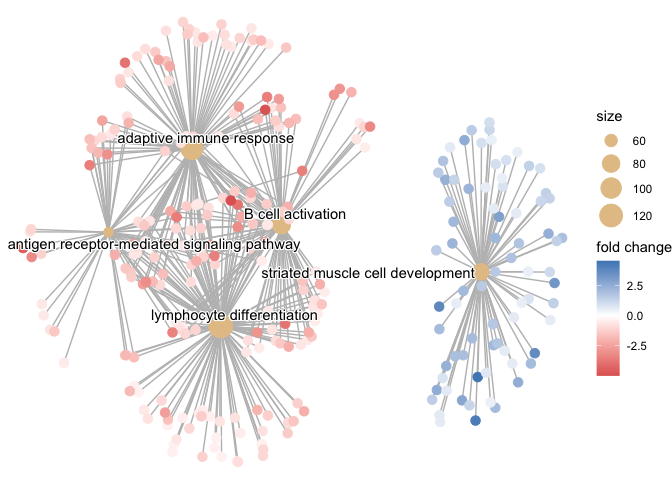
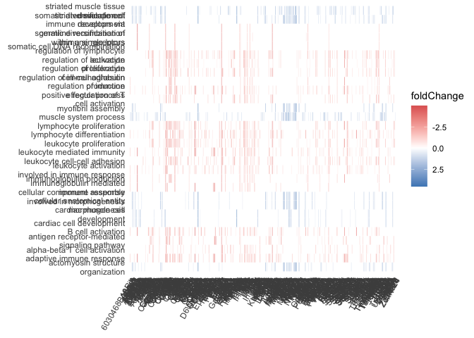
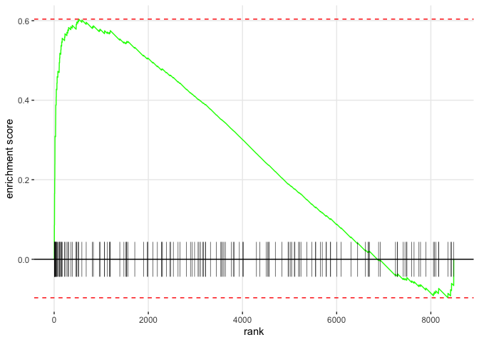

# Purpose

To use cluster profiler as part of DOSE to do gene set enrichments

# Raw Data

GSEA was run with folders put in this subfolder


# Gene Ontology


Table: Significant GO - BP Pathays

|           |ID         |Description                                                                                                               | pvalue| p.adjust|   NES|
|:----------|:----------|:-------------------------------------------------------------------------------------------------------------------------|------:|--------:|-----:|
|GO:0055002 |GO:0055002 |striated muscle cell development                                                                                          |  0.000|    0.000|  2.60|
|GO:0055001 |GO:0055001 |muscle cell development                                                                                                   |  0.000|    0.000|  2.54|
|GO:0061061 |GO:0061061 |muscle structure development                                                                                              |  0.000|    0.000|  2.08|
|GO:0060537 |GO:0060537 |muscle tissue development                                                                                                 |  0.000|    0.000|  2.18|
|GO:0030239 |GO:0030239 |myofibril assembly                                                                                                        |  0.000|    0.000|  2.55|
|GO:0003012 |GO:0003012 |muscle system process                                                                                                     |  0.000|    0.000|  2.22|
|GO:0014706 |GO:0014706 |striated muscle tissue development                                                                                        |  0.000|    0.000|  2.19|
|GO:0010927 |GO:0010927 |cellular component assembly involved in morphogenesis                                                                     |  0.000|    0.000|  2.50|
|GO:0032989 |GO:0032989 |cellular anatomical entity morphogenesis                                                                                  |  0.000|    0.000|  2.50|
|GO:0051146 |GO:0051146 |striated muscle cell differentiation                                                                                      |  0.000|    0.000|  2.21|
|GO:0006941 |GO:0006941 |striated muscle contraction                                                                                               |  0.000|    0.000|  2.40|
|GO:0006936 |GO:0006936 |muscle contraction                                                                                                        |  0.000|    0.000|  2.24|
|GO:0042692 |GO:0042692 |muscle cell differentiation                                                                                               |  0.000|    0.000|  2.07|
|GO:0002252 |GO:0002252 |immune effector process                                                                                                   |  0.000|    0.000| -2.02|
|GO:0007517 |GO:0007517 |muscle organ development                                                                                                  |  0.000|    0.000|  2.12|
|GO:0045214 |GO:0045214 |sarcomere organization                                                                                                    |  0.000|    0.000|  2.41|
|GO:0002250 |GO:0002250 |adaptive immune response                                                                                                  |  0.000|    0.000| -2.06|
|GO:0031032 |GO:0031032 |actomyosin structure organization                                                                                         |  0.000|    0.000|  2.19|
|GO:0009887 |GO:0009887 |animal organ morphogenesis                                                                                                |  0.000|    0.000|  1.77|
|GO:0070661 |GO:0070661 |leukocyte proliferation                                                                                                   |  0.000|    0.000| -2.08|
|GO:0046651 |GO:0046651 |lymphocyte proliferation                                                                                                  |  0.000|    0.000| -2.11|
|GO:0007519 |GO:0007519 |skeletal muscle tissue development                                                                                        |  0.000|    0.000|  2.18|
|GO:0032943 |GO:0032943 |mononuclear cell proliferation                                                                                            |  0.000|    0.000| -2.10|
|GO:0007507 |GO:0007507 |heart development                                                                                                         |  0.000|    0.000|  1.82|
|GO:0030029 |GO:0030029 |actin filament-based process                                                                                              |  0.000|    0.000|  1.73|
|GO:0042113 |GO:0042113 |B cell activation                                                                                                         |  0.000|    0.000| -2.09|
|GO:0016064 |GO:0016064 |immunoglobulin mediated immune response                                                                                   |  0.000|    0.000| -2.29|
|GO:0002449 |GO:0002449 |lymphocyte mediated immunity                                                                                              |  0.000|    0.000| -2.07|
|GO:0060538 |GO:0060538 |skeletal muscle organ development                                                                                         |  0.000|    0.000|  2.18|
|GO:0002443 |GO:0002443 |leukocyte mediated immunity                                                                                               |  0.000|    0.000| -2.01|
|GO:0019724 |GO:0019724 |B cell mediated immunity                                                                                                  |  0.000|    0.000| -2.29|
|GO:0046649 |GO:0046649 |lymphocyte activation                                                                                                     |  0.000|    0.000| -1.77|
|GO:0140694 |GO:0140694 |non-membrane-bounded organelle assembly                                                                                   |  0.000|    0.000|  1.83|
|GO:0044057 |GO:0044057 |regulation of system process                                                                                              |  0.000|    0.000|  1.86|
|GO:0042100 |GO:0042100 |B cell proliferation                                                                                                      |  0.000|    0.000| -2.30|
|GO:0030183 |GO:0030183 |B cell differentiation                                                                                                    |  0.000|    0.000| -2.12|
|GO:0002460 |GO:0002460 |adaptive immune response based on somatic recombination of immune receptors built from immunoglobulin superfamily domains |  0.000|    0.000| -1.91|
|GO:0030036 |GO:0030036 |actin cytoskeleton organization                                                                                           |  0.000|    0.001|  1.66|
|GO:0002455 |GO:0002455 |humoral immune response mediated by circulating immunoglobulin                                                            |  0.000|    0.001| -2.27|
|GO:0014904 |GO:0014904 |myotube cell development                                                                                                  |  0.000|    0.001|  2.14|
|GO:0060048 |GO:0060048 |cardiac muscle contraction                                                                                                |  0.000|    0.001|  2.12|
|GO:0070663 |GO:0070663 |regulation of leukocyte proliferation                                                                                     |  0.000|    0.002| -1.93|
|GO:0003007 |GO:0003007 |heart morphogenesis                                                                                                       |  0.000|    0.002|  1.90|
|GO:0003009 |GO:0003009 |skeletal muscle contraction                                                                                               |  0.000|    0.002|  2.13|
|GO:0048741 |GO:0048741 |skeletal muscle fiber development                                                                                         |  0.000|    0.002|  2.13|
|GO:0050853 |GO:0050853 |B cell receptor signaling pathway                                                                                         |  0.000|    0.002| -2.27|
|GO:0006942 |GO:0006942 |regulation of striated muscle contraction                                                                                 |  0.000|    0.002|  2.14|
|GO:0050864 |GO:0050864 |regulation of B cell activation                                                                                           |  0.000|    0.002| -2.06|
|GO:0034330 |GO:0034330 |cell junction organization                                                                                                |  0.000|    0.003|  1.60|
|GO:0002697 |GO:0002697 |regulation of immune effector process                                                                                     |  0.000|    0.003| -1.78|
|GO:0032944 |GO:0032944 |regulation of mononuclear cell proliferation                                                                              |  0.000|    0.003| -1.96|
|GO:0050670 |GO:0050670 |regulation of lymphocyte proliferation                                                                                    |  0.000|    0.003| -1.95|
|GO:0050776 |GO:0050776 |regulation of immune response                                                                                             |  0.000|    0.003| -1.57|
|GO:0090075 |GO:0090075 |relaxation of muscle                                                                                                      |  0.000|    0.003|  2.07|
|GO:0008202 |GO:0008202 |steroid metabolic process                                                                                                 |  0.000|    0.004|  1.84|
|GO:0050778 |GO:0050778 |positive regulation of immune response                                                                                    |  0.000|    0.004| -1.57|
|GO:1901615 |GO:1901615 |organic hydroxy compound metabolic process                                                                                |  0.000|    0.004|  1.71|
|GO:0006959 |GO:0006959 |humoral immune response                                                                                                   |  0.000|    0.004| -2.08|
|GO:0002699 |GO:0002699 |positive regulation of immune effector process                                                                            |  0.000|    0.004| -1.82|
|GO:0048589 |GO:0048589 |developmental growth                                                                                                      |  0.000|    0.004|  1.59|
|GO:0051249 |GO:0051249 |regulation of lymphocyte activation                                                                                       |  0.000|    0.005| -1.70|
|GO:0048738 |GO:0048738 |cardiac muscle tissue development                                                                                         |  0.000|    0.006|  1.82|
|GO:0001503 |GO:0001503 |ossification                                                                                                              |  0.000|    0.006|  1.71|
|GO:0033002 |GO:0033002 |muscle cell proliferation                                                                                                 |  0.000|    0.006|  1.82|
|GO:0002366 |GO:0002366 |leukocyte activation involved in immune response                                                                          |  0.000|    0.007| -1.77|
|GO:0071559 |GO:0071559 |response to transforming growth factor beta                                                                               |  0.000|    0.007|  1.76|
|GO:0043501 |GO:0043501 |skeletal muscle adaptation                                                                                                |  0.000|    0.007|  1.99|
|GO:0071560 |GO:0071560 |cellular response to transforming growth factor beta stimulus                                                             |  0.000|    0.007|  1.76|
|GO:0090257 |GO:0090257 |regulation of muscle system process                                                                                       |  0.000|    0.007|  1.81|
|GO:0050851 |GO:0050851 |antigen receptor-mediated signaling pathway                                                                               |  0.000|    0.008| -1.93|
|GO:0002263 |GO:0002263 |cell activation involved in immune response                                                                               |  0.000|    0.008| -1.77|
|GO:0050879 |GO:0050879 |multicellular organismal movement                                                                                         |  0.000|    0.009|  2.05|
|GO:0033273 |GO:0033273 |response to vitamin                                                                                                       |  0.000|    0.009|  1.99|
|GO:0050881 |GO:0050881 |musculoskeletal movement                                                                                                  |  0.000|    0.010|  2.06|
|GO:0050905 |GO:0050905 |neuromuscular process                                                                                                     |  0.000|    0.012|  1.91|
|GO:0002920 |GO:0002920 |regulation of humoral immune response                                                                                     |  0.000|    0.012| -2.10|
|GO:0035051 |GO:0035051 |cardiocyte differentiation                                                                                                |  0.000|    0.012|  1.90|
|GO:0055006 |GO:0055006 |cardiac cell development                                                                                                  |  0.000|    0.013|  1.91|
|GO:1901605 |GO:1901605 |alpha-amino acid metabolic process                                                                                        |  0.000|    0.013| -1.76|
|GO:1901607 |GO:1901607 |alpha-amino acid biosynthetic process                                                                                     |  0.000|    0.016| -1.96|
|GO:0002694 |GO:0002694 |regulation of leukocyte activation                                                                                        |  0.000|    0.016| -1.59|
|GO:0034329 |GO:0034329 |cell junction assembly                                                                                                    |  0.000|    0.017|  1.65|
|GO:0007159 |GO:0007159 |leukocyte cell-cell adhesion                                                                                              |  0.000|    0.017| -1.65|
|GO:0071407 |GO:0071407 |cellular response to organic cyclic compound                                                                              |  0.000|    0.018|  1.58|
|GO:0030098 |GO:0030098 |lymphocyte differentiation                                                                                                |  0.000|    0.018| -1.58|
|GO:0033280 |GO:0033280 |response to vitamin D                                                                                                     |  0.000|    0.018|  2.01|
|GO:0071604 |GO:0071604 |transforming growth factor beta production                                                                                |  0.000|    0.020|  1.96|
|GO:0048729 |GO:0048729 |tissue morphogenesis                                                                                                      |  0.000|    0.020|  1.54|
|GO:2000147 |GO:2000147 |positive regulation of cell motility                                                                                      |  0.000|    0.020|  1.54|
|GO:0002768 |GO:0002768 |immune response-regulating cell surface receptor signaling pathway                                                        |  0.000|    0.020| -1.71|
|GO:0010810 |GO:0010810 |regulation of cell-substrate adhesion                                                                                     |  0.000|    0.021|  1.71|
|GO:0001501 |GO:0001501 |skeletal system development                                                                                               |  0.000|    0.021|  1.63|
|GO:0007044 |GO:0007044 |cell-substrate junction assembly                                                                                          |  0.000|    0.021|  1.86|
|GO:0002637 |GO:0002637 |regulation of immunoglobulin production                                                                                   |  0.000|    0.022| -2.02|
|GO:0050854 |GO:0050854 |regulation of antigen receptor-mediated signaling pathway                                                                 |  0.000|    0.022| -1.93|
|GO:0008015 |GO:0008015 |blood circulation                                                                                                         |  0.000|    0.022|  1.62|
|GO:0050865 |GO:0050865 |regulation of cell activation                                                                                             |  0.000|    0.022| -1.53|
|GO:0014874 |GO:0014874 |response to stimulus involved in regulation of muscle adaptation                                                          |  0.000|    0.023|  1.92|
|GO:0170033 |GO:0170033 |L-amino acid metabolic process                                                                                            |  0.000|    0.024| -1.75|
|GO:0006937 |GO:0006937 |regulation of muscle contraction                                                                                          |  0.000|    0.024|  1.93|
|GO:0007179 |GO:0007179 |transforming growth factor beta receptor signaling pathway                                                                |  0.001|    0.024|  1.70|
|GO:0150115 |GO:0150115 |cell-substrate junction organization                                                                                      |  0.001|    0.026|  1.80|
|GO:0002429 |GO:0002429 |immune response-activating cell surface receptor signaling pathway                                                        |  0.001|    0.027| -1.71|
|GO:0042110 |GO:0042110 |T cell activation                                                                                                         |  0.001|    0.027| -1.51|
|GO:1903844 |GO:1903844 |regulation of cellular response to transforming growth factor beta stimulus                                               |  0.001|    0.028|  1.80|
|GO:0002335 |GO:0002335 |mature B cell differentiation                                                                                             |  0.001|    0.029| -2.06|
|GO:0030198 |GO:0030198 |extracellular matrix organization                                                                                         |  0.001|    0.029|  1.66|
|GO:0043062 |GO:0043062 |extracellular structure organization                                                                                      |  0.001|    0.029|  1.66|
|GO:0045229 |GO:0045229 |external encapsulating structure organization                                                                             |  0.001|    0.029|  1.66|
|GO:1903131 |GO:1903131 |mononuclear cell differentiation                                                                                          |  0.001|    0.029| -1.49|
|GO:0007169 |GO:0007169 |cell surface receptor protein tyrosine kinase signaling pathway                                                           |  0.001|    0.030|  1.52|
|GO:0030888 |GO:0030888 |regulation of B cell proliferation                                                                                        |  0.001|    0.031| -2.05|
|GO:0001952 |GO:0001952 |regulation of cell-matrix adhesion                                                                                        |  0.001|    0.031|  1.80|
|GO:0019058 |GO:0019058 |viral life cycle                                                                                                          |  0.001|    0.031|  1.62|
|GO:0007178 |GO:0007178 |cell surface receptor protein serine/threonine kinase signaling pathway                                                   |  0.001|    0.031|  1.61|
|GO:0042098 |GO:0042098 |T cell proliferation                                                                                                      |  0.001|    0.032| -1.72|
|GO:0006706 |GO:0006706 |steroid catabolic process                                                                                                 |  0.001|    0.032|  1.89|
|GO:0017015 |GO:0017015 |regulation of transforming growth factor beta receptor signaling pathway                                                  |  0.001|    0.033|  1.80|
|GO:0040017 |GO:0040017 |positive regulation of locomotion                                                                                         |  0.001|    0.034|  1.50|
|GO:0002703 |GO:0002703 |regulation of leukocyte mediated immunity                                                                                 |  0.001|    0.034| -1.68|
|GO:0030335 |GO:0030335 |positive regulation of cell migration                                                                                     |  0.001|    0.034|  1.51|
|GO:0002708 |GO:0002708 |positive regulation of lymphocyte mediated immunity                                                                       |  0.001|    0.035| -1.83|
|GO:0006958 |GO:0006958 |complement activation, classical pathway                                                                                  |  0.001|    0.036| -1.95|
|GO:0090092 |GO:0090092 |regulation of transmembrane receptor protein serine/threonine kinase signaling pathway                                    |  0.001|    0.038|  1.66|
|GO:0018198 |GO:0018198 |peptidyl-cysteine modification                                                                                            |  0.001|    0.038| -1.99|
|GO:0008652 |GO:0008652 |amino acid biosynthetic process                                                                                           |  0.001|    0.039| -1.88|
|GO:0002253 |GO:0002253 |activation of immune response                                                                                             |  0.001|    0.040| -1.51|
|GO:0002706 |GO:0002706 |regulation of lymphocyte mediated immunity                                                                                |  0.001|    0.041| -1.74|
|GO:0032409 |GO:0032409 |regulation of transporter activity                                                                                        |  0.001|    0.042|  1.73|
|GO:0042129 |GO:0042129 |regulation of T cell proliferation                                                                                        |  0.001|    0.042| -1.74|
|GO:0071248 |GO:0071248 |cellular response to metal ion                                                                                            |  0.001|    0.042|  1.73|
|GO:0048660 |GO:0048660 |regulation of smooth muscle cell proliferation                                                                            |  0.001|    0.043|  1.71|
|GO:0050855 |GO:0050855 |regulation of B cell receptor signaling pathway                                                                           |  0.001|    0.044| -1.90|
|GO:0055013 |GO:0055013 |cardiac muscle cell development                                                                                           |  0.001|    0.044|  1.88|
|GO:0048041 |GO:0048041 |focal adhesion assembly                                                                                                   |  0.001|    0.044|  1.82|
|GO:0045589 |GO:0045589 |regulation of regulatory T cell differentiation                                                                           |  0.001|    0.045| -1.92|
|GO:0002705 |GO:0002705 |positive regulation of leukocyte mediated immunity                                                                        |  0.001|    0.045| -1.78|
|GO:0045216 |GO:0045216 |cell-cell junction organization                                                                                           |  0.001|    0.045|  1.65|
|GO:0060627 |GO:0060627 |regulation of vesicle-mediated transport                                                                                  |  0.001|    0.046| -1.47|
|GO:0014823 |GO:0014823 |response to activity                                                                                                      |  0.001|    0.047|  1.87|
|GO:0048659 |GO:0048659 |smooth muscle cell proliferation                                                                                          |  0.001|    0.047|  1.70|
|GO:0048545 |GO:0048545 |response to steroid hormone                                                                                               |  0.001|    0.047|  1.62|
|GO:0071634 |GO:0071634 |regulation of transforming growth factor beta production                                                                  |  0.001|    0.048|  1.89|
|GO:0036293 |GO:0036293 |response to decreased oxygen levels                                                                                       |  0.001|    0.049|  1.57|
|GO:0007267 |GO:0007267 |cell-cell signaling                                                                                                       |  0.001|    0.049|  1.40|
|GO:0006956 |GO:0006956 |complement activation                                                                                                     |  0.002|    0.049| -1.97|



Table: Summary pf GO-BP pathways

|Significant |Direction     |  n|
|:-----------|:-------------|--:|
|Significant |Downregulated | 59|
|Significant |Upregulated   | 87|

# Wikipathways

From DisGeNET

```{ wp, fig.cap="Wikipathways enrichment plot"}
# need entrez ids
# 
# 
# mouse.gene.list.wp <- mouse.gene.list
# names(mouse.gene.list.wp) <- bitr(names(mouse.gene.list), fromType="SYMBOL", toType="ENTREZID", OrgDb="org.Mm.eg.db")$ENTREZID
# 
# wp <- gseWP(geneList = names(mouse.gene.list.wp), 
#              verbose=F,
#              organism="Mus musculus") 
# 
# wp %>% select(ID, Description, pvalue,p.adjust, NES ) %>% kable(caption="Significant Wikipathways")
# 
# wp.file <- 'GSEA Results - Wikipathways.csv'
# wp %>%
#   as.data.frame %>%
#   write_csv(file=wp.file)
# 
# gseaplot2(wp, geneSetID = 1:2)
```


# Cell Markers

```{ cell-markers, fig.cap="Cell markers enrichment plot"}
cell_marker_data <- vroom::vroom('http://bio-bigdata.hrbmu.edu.cn/CellMarker/download/Human_cell_markers.txt')

cells <- cell_marker_data %>%
    dplyr::select(cellName, geneID) %>%
    dplyr::mutate(geneID = strsplit(geneID, ', ')) %>%
    tidyr::unnest()
cm <- GSEA(genes, TERM2GENE = cells) 

cm %>% select(ID, Description, pvalue,p.adjust, NES ) %>% kable(caption="Significant cell types")

cm.file <- 'GSEA Results - Cell Marker.csv'
cm %>%
  as.data.frame %>%
  write_csv(file=cm.file)

cm <- pairwise_termsim(cm, method="JC")
emapplot(cm, color='NES')
upsetplot(cm)
ridgeplot(cm, fill="NES")
```

# Transcription Factors



# Session Information


``` r
sessionInfo()
```

```
## R version 4.4.2 (2024-10-31)
## Platform: aarch64-apple-darwin20
## Running under: macOS Sequoia 15.1.1
## 
## Matrix products: default
## BLAS:   /Library/Frameworks/R.framework/Versions/4.4-arm64/Resources/lib/libRblas.0.dylib 
## LAPACK: /Library/Frameworks/R.framework/Versions/4.4-arm64/Resources/lib/libRlapack.dylib;  LAPACK version 3.12.0
## 
## locale:
## [1] en_US.UTF-8/en_US.UTF-8/en_US.UTF-8/C/en_US.UTF-8/en_US.UTF-8
## 
## time zone: America/Detroit
## tzcode source: internal
## 
## attached base packages:
## [1] stats4    stats     graphics  grDevices utils     datasets  methods  
## [8] base     
## 
## other attached packages:
##  [1] msigdbr_7.5.1          fgsea_1.32.0           ggnewscale_0.5.0      
##  [4] enrichplot_1.26.2      org.Mm.eg.db_3.20.0    clusterProfiler_4.14.3
##  [7] org.Hs.eg.db_3.20.0    AnnotationDbi_1.68.0   IRanges_2.40.0        
## [10] S4Vectors_0.44.0       Biobase_2.66.0         BiocGenerics_0.52.0   
## [13] readr_2.1.5            dplyr_1.1.4            tidyr_1.3.1           
## [16] knitr_1.49            
## 
## loaded via a namespace (and not attached):
##  [1] DBI_1.2.3               gson_0.1.0              rlang_1.1.4            
##  [4] magrittr_2.0.3          DOSE_4.0.0              compiler_4.4.2         
##  [7] RSQLite_2.3.8           png_0.1-8               vctrs_0.6.5            
## [10] reshape2_1.4.4          stringr_1.5.1           pkgconfig_2.0.3        
## [13] crayon_1.5.3            fastmap_1.2.0           XVector_0.46.0         
## [16] labeling_0.4.3          utf8_1.2.4              rmarkdown_2.29         
## [19] tzdb_0.4.0              UCSC.utils_1.2.0        purrr_1.0.2            
## [22] bit_4.5.0               xfun_0.49               zlibbioc_1.52.0        
## [25] cachem_1.1.0            aplot_0.2.3             GenomeInfoDb_1.42.0    
## [28] jsonlite_1.8.9          blob_1.2.4              BiocParallel_1.40.0    
## [31] parallel_4.4.2          R6_2.5.1                bslib_0.8.0            
## [34] stringi_1.8.4           RColorBrewer_1.1-3      jquerylib_0.1.4        
## [37] GOSemSim_2.32.0         Rcpp_1.0.13-1           ggtangle_0.0.4         
## [40] R.utils_2.12.3          Matrix_1.7-1            splines_4.4.2          
## [43] igraph_2.1.1            tidyselect_1.2.1        qvalue_2.38.0          
## [46] yaml_2.3.10             codetools_0.2-20        lattice_0.22-6         
## [49] tibble_3.2.1            plyr_1.8.9              treeio_1.30.0          
## [52] withr_3.0.2             KEGGREST_1.46.0         evaluate_1.0.1         
## [55] gridGraphics_0.5-1      Biostrings_2.74.0       pillar_1.9.0           
## [58] ggtree_3.14.0           ggfun_0.1.7             generics_0.1.3         
## [61] vroom_1.6.5             hms_1.1.3               ggplot2_3.5.1          
## [64] munsell_0.5.1           scales_1.3.0            tidytree_0.4.6         
## [67] glue_1.8.0              lazyeval_0.2.2          tools_4.4.2            
## [70] data.table_1.16.2       babelgene_22.9          fs_1.6.5               
## [73] fastmatch_1.1-4         cowplot_1.1.3           grid_4.4.2             
## [76] ape_5.8                 colorspace_2.1-1        nlme_3.1-166           
## [79] GenomeInfoDbData_1.2.13 patchwork_1.3.0         cli_3.6.3              
## [82] fansi_1.0.6             gtable_0.3.6            R.methodsS3_1.8.2      
## [85] yulab.utils_0.1.8       sass_0.4.9              digest_0.6.37          
## [88] ggrepel_0.9.6           ggplotify_0.1.2         farver_2.1.2           
## [91] memoise_2.0.1           htmltools_0.5.8.1       R.oo_1.27.0            
## [94] lifecycle_1.0.4         httr_1.4.7              GO.db_3.20.0           
## [97] bit64_4.5.2
```
