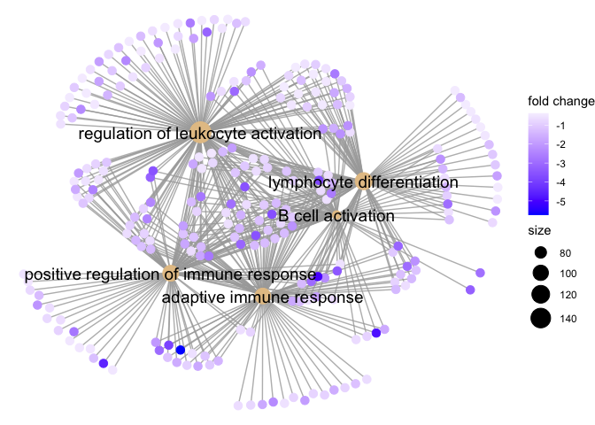
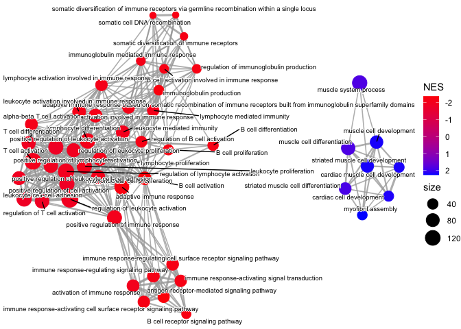
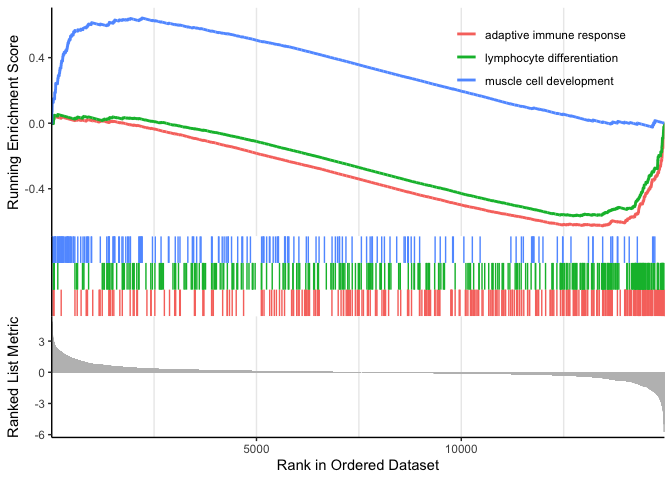
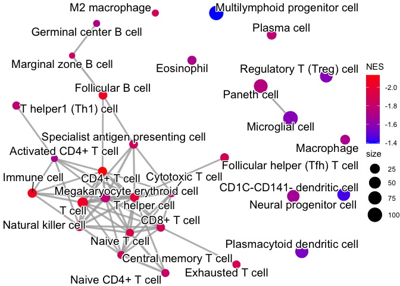
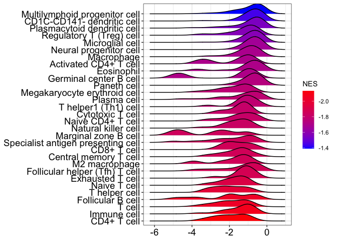

# Purpose

To use cluster profiler as part of DOSE to do gene set enrichments

# Raw Data

GSEA was run with folders put in this subfolder


# Gene Ontology


Table: Significant GO - BP Pathays

|           |ID         |Description                                                                                                                                      | pvalue| p.adjust|   NES|
|:----------|:----------|:------------------------------------------------------------------------------------------------------------------------------------------------|------:|--------:|-----:|
|GO:0002250 |GO:0002250 |adaptive immune response                                                                                                                         |  0.000|    0.000| -2.27|
|GO:0042113 |GO:0042113 |B cell activation                                                                                                                                |  0.000|    0.000| -2.38|
|GO:0050778 |GO:0050778 |positive regulation of immune response                                                                                                           |  0.000|    0.000| -2.03|
|GO:0042110 |GO:0042110 |T cell activation                                                                                                                                |  0.000|    0.000| -2.03|
|GO:0050851 |GO:0050851 |antigen receptor-mediated signaling pathway                                                                                                      |  0.000|    0.000| -2.35|
|GO:0002694 |GO:0002694 |regulation of leukocyte activation                                                                                                               |  0.000|    0.000| -1.93|
|GO:0030098 |GO:0030098 |lymphocyte differentiation                                                                                                                       |  0.000|    0.000| -2.05|
|GO:0055001 |GO:0055001 |muscle cell development                                                                                                                          |  0.000|    0.000|  2.21|
|GO:0055002 |GO:0055002 |striated muscle cell development                                                                                                                 |  0.000|    0.000|  2.21|
|GO:0051249 |GO:0051249 |regulation of lymphocyte activation                                                                                                              |  0.000|    0.000| -1.98|
|GO:0032943 |GO:0032943 |mononuclear cell proliferation                                                                                                                   |  0.000|    0.000| -2.07|
|GO:0002377 |GO:0002377 |immunoglobulin production                                                                                                                        |  0.000|    0.000| -2.32|
|GO:0002443 |GO:0002443 |leukocyte mediated immunity                                                                                                                      |  0.000|    0.000| -2.02|
|GO:0002460 |GO:0002460 |adaptive immune response based on somatic recombination of immune receptors built from immunoglobulin superfamily domains                        |  0.000|    0.000| -2.12|
|GO:0046651 |GO:0046651 |lymphocyte proliferation                                                                                                                         |  0.000|    0.000| -2.08|
|GO:0070661 |GO:0070661 |leukocyte proliferation                                                                                                                          |  0.000|    0.000| -2.04|
|GO:0002263 |GO:0002263 |cell activation involved in immune response                                                                                                      |  0.000|    0.000| -2.11|
|GO:0002768 |GO:0002768 |immune response-regulating cell surface receptor signaling pathway                                                                               |  0.000|    0.000| -2.18|
|GO:0002366 |GO:0002366 |leukocyte activation involved in immune response                                                                                                 |  0.000|    0.000| -2.12|
|GO:0002429 |GO:0002429 |immune response-activating cell surface receptor signaling pathway                                                                               |  0.000|    0.000| -2.18|
|GO:0002764 |GO:0002764 |immune response-regulating signaling pathway                                                                                                     |  0.000|    0.000| -2.17|
|GO:0002757 |GO:0002757 |immune response-activating signal transduction                                                                                                   |  0.000|    0.000| -2.18|
|GO:0002449 |GO:0002449 |lymphocyte mediated immunity                                                                                                                     |  0.000|    0.000| -2.06|
|GO:0002285 |GO:0002285 |lymphocyte activation involved in immune response                                                                                                |  0.000|    0.000| -2.11|
|GO:0051251 |GO:0051251 |positive regulation of lymphocyte activation                                                                                                     |  0.000|    0.000| -1.97|
|GO:0042692 |GO:0042692 |muscle cell differentiation                                                                                                                      |  0.000|    0.000|  1.87|
|GO:0003012 |GO:0003012 |muscle system process                                                                                                                            |  0.000|    0.000|  1.85|
|GO:0002253 |GO:0002253 |activation of immune response                                                                                                                    |  0.000|    0.000| -2.00|
|GO:0050864 |GO:0050864 |regulation of B cell activation                                                                                                                  |  0.000|    0.000| -2.17|
|GO:0042100 |GO:0042100 |B cell proliferation                                                                                                                             |  0.000|    0.000| -2.24|
|GO:0030183 |GO:0030183 |B cell differentiation                                                                                                                           |  0.000|    0.000| -2.15|
|GO:0051146 |GO:0051146 |striated muscle cell differentiation                                                                                                             |  0.000|    0.000|  1.90|
|GO:0002637 |GO:0002637 |regulation of immunoglobulin production                                                                                                          |  0.000|    0.000| -2.23|
|GO:0050853 |GO:0050853 |B cell receptor signaling pathway                                                                                                                |  0.000|    0.000| -2.23|
|GO:0002562 |GO:0002562 |somatic diversification of immune receptors via germline recombination within a single locus                                                     |  0.000|    0.000| -2.21|
|GO:0016444 |GO:0016444 |somatic cell DNA recombination                                                                                                                   |  0.000|    0.000| -2.21|
|GO:0046631 |GO:0046631 |alpha-beta T cell activation                                                                                                                     |  0.000|    0.000| -2.11|
|GO:0002312 |GO:0002312 |B cell activation involved in immune response                                                                                                    |  0.000|    0.000| -2.19|
|GO:0030239 |GO:0030239 |myofibril assembly                                                                                                                               |  0.000|    0.000|  2.26|
|GO:0050863 |GO:0050863 |regulation of T cell activation                                                                                                                  |  0.000|    0.000| -1.86|
|GO:0016064 |GO:0016064 |immunoglobulin mediated immune response                                                                                                          |  0.000|    0.000| -2.12|
|GO:0070663 |GO:0070663 |regulation of leukocyte proliferation                                                                                                            |  0.000|    0.000| -1.92|
|GO:0055013 |GO:0055013 |cardiac muscle cell development                                                                                                                  |  0.000|    0.000|  2.20|
|GO:0007159 |GO:0007159 |leukocyte cell-cell adhesion                                                                                                                     |  0.000|    0.000| -1.83|
|GO:0050867 |GO:0050867 |positive regulation of cell activation                                                                                                           |  0.000|    0.000| -1.82|
|GO:1903039 |GO:1903039 |positive regulation of leukocyte cell-cell adhesion                                                                                              |  0.000|    0.000| -1.93|
|GO:0055006 |GO:0055006 |cardiac cell development                                                                                                                         |  0.000|    0.000|  2.18|
|GO:0002696 |GO:0002696 |positive regulation of leukocyte activation                                                                                                      |  0.000|    0.000| -1.85|
|GO:0030217 |GO:0030217 |T cell differentiation                                                                                                                           |  0.000|    0.000| -1.89|
|GO:0002200 |GO:0002200 |somatic diversification of immune receptors                                                                                                      |  0.000|    0.000| -2.17|
|GO:0002697 |GO:0002697 |regulation of immune effector process                                                                                                            |  0.000|    0.000| -1.79|
|GO:0002381 |GO:0002381 |immunoglobulin production involved in immunoglobulin mediated immune response                                                                    |  0.000|    0.000| -2.17|
|GO:0019724 |GO:0019724 |B cell mediated immunity                                                                                                                         |  0.000|    0.000| -2.09|
|GO:0050670 |GO:0050670 |regulation of lymphocyte proliferation                                                                                                           |  0.000|    0.000| -1.93|
|GO:0014706 |GO:0014706 |striated muscle tissue development                                                                                                               |  0.000|    0.000|  1.75|
|GO:0032944 |GO:0032944 |regulation of mononuclear cell proliferation                                                                                                     |  0.000|    0.000| -1.92|
|GO:0002440 |GO:0002440 |production of molecular mediator of immune response                                                                                              |  0.000|    0.000| -1.92|
|GO:0050870 |GO:0050870 |positive regulation of T cell activation                                                                                                         |  0.000|    0.000| -1.94|
|GO:0032946 |GO:0032946 |positive regulation of mononuclear cell proliferation                                                                                            |  0.000|    0.000| -2.04|
|GO:0060537 |GO:0060537 |muscle tissue development                                                                                                                        |  0.000|    0.000|  1.73|
|GO:0002821 |GO:0002821 |positive regulation of adaptive immune response                                                                                                  |  0.000|    0.000| -2.05|
|GO:0032673 |GO:0032673 |regulation of interleukin-4 production                                                                                                           |  0.000|    0.000| -2.12|
|GO:0002703 |GO:0002703 |regulation of leukocyte mediated immunity                                                                                                        |  0.000|    0.000| -1.91|
|GO:0010927 |GO:0010927 |cellular component assembly involved in morphogenesis                                                                                            |  0.000|    0.000|  2.08|
|GO:0002699 |GO:0002699 |positive regulation of immune effector process                                                                                                   |  0.000|    0.000| -1.85|
|GO:0070665 |GO:0070665 |positive regulation of leukocyte proliferation                                                                                                   |  0.000|    0.000| -2.00|
|GO:0050671 |GO:0050671 |positive regulation of lymphocyte proliferation                                                                                                  |  0.000|    0.000| -2.04|
|GO:0048305 |GO:0048305 |immunoglobulin secretion                                                                                                                         |  0.000|    0.000| -2.12|
|GO:0022409 |GO:0022409 |positive regulation of cell-cell adhesion                                                                                                        |  0.000|    0.000| -1.80|
|GO:1903037 |GO:1903037 |regulation of leukocyte cell-cell adhesion                                                                                                       |  0.000|    0.000| -1.77|
|GO:0002819 |GO:0002819 |regulation of adaptive immune response                                                                                                           |  0.000|    0.000| -1.94|
|GO:0035710 |GO:0035710 |CD4-positive, alpha-beta T cell activation                                                                                                       |  0.000|    0.000| -2.07|
|GO:0002824 |GO:0002824 |positive regulation of adaptive immune response based on somatic recombination of immune receptors built from immunoglobulin superfamily domains |  0.000|    0.000| -2.03|
|GO:0002204 |GO:0002204 |somatic recombination of immunoglobulin genes involved in immune response                                                                        |  0.000|    0.000| -2.10|
|GO:0002208 |GO:0002208 |somatic diversification of immunoglobulins involved in immune response                                                                           |  0.000|    0.000| -2.10|
|GO:0045190 |GO:0045190 |isotype switching                                                                                                                                |  0.000|    0.000| -2.10|
|GO:0035051 |GO:0035051 |cardiocyte differentiation                                                                                                                       |  0.000|    0.000|  1.94|
|GO:0055007 |GO:0055007 |cardiac muscle cell differentiation                                                                                                              |  0.000|    0.000|  2.01|
|GO:0050852 |GO:0050852 |T cell receptor signaling pathway                                                                                                                |  0.000|    0.000| -2.00|
|GO:0050854 |GO:0050854 |regulation of antigen receptor-mediated signaling pathway                                                                                        |  0.000|    0.000| -2.11|
|GO:0016447 |GO:0016447 |somatic recombination of immunoglobulin gene segments                                                                                            |  0.000|    0.000| -2.10|
|GO:0006936 |GO:0006936 |muscle contraction                                                                                                                               |  0.000|    0.000|  1.74|
|GO:0002705 |GO:0002705 |positive regulation of leukocyte mediated immunity                                                                                               |  0.000|    0.000| -1.95|
|GO:0046632 |GO:0046632 |alpha-beta T cell differentiation                                                                                                                |  0.000|    0.000| -1.99|
|GO:0016445 |GO:0016445 |somatic diversification of immunoglobulins                                                                                                       |  0.000|    0.000| -2.04|
|GO:0032633 |GO:0032633 |interleukin-4 production                                                                                                                         |  0.000|    0.000| -2.08|
|GO:0048747 |GO:0048747 |muscle fiber development                                                                                                                         |  0.000|    0.000|  2.09|
|GO:0002706 |GO:0002706 |regulation of lymphocyte mediated immunity                                                                                                       |  0.000|    0.000| -1.91|
|GO:0045058 |GO:0045058 |T cell selection                                                                                                                                 |  0.000|    0.000| -2.09|
|GO:0042102 |GO:0042102 |positive regulation of T cell proliferation                                                                                                      |  0.000|    0.000| -2.00|
|GO:0043367 |GO:0043367 |CD4-positive, alpha-beta T cell differentiation                                                                                                  |  0.000|    0.000| -2.02|
|GO:0050871 |GO:0050871 |positive regulation of B cell activation                                                                                                         |  0.000|    0.000| -2.00|
|GO:0003009 |GO:0003009 |skeletal muscle contraction                                                                                                                      |  0.000|    0.000|  2.11|
|GO:0006941 |GO:0006941 |striated muscle contraction                                                                                                                      |  0.000|    0.000|  1.90|
|GO:0007517 |GO:0007517 |muscle organ development                                                                                                                         |  0.000|    0.000|  1.64|
|GO:0051023 |GO:0051023 |regulation of immunoglobulin secretion                                                                                                           |  0.000|    0.000| -2.02|
|GO:0022407 |GO:0022407 |regulation of cell-cell adhesion                                                                                                                 |  0.000|    0.000| -1.60|
|GO:0048738 |GO:0048738 |cardiac muscle tissue development                                                                                                                |  0.000|    0.000|  1.75|
|GO:0031032 |GO:0031032 |actomyosin structure organization                                                                                                                |  0.000|    0.000|  1.79|
|GO:0002274 |GO:0002274 |myeloid leukocyte activation                                                                                                                     |  0.000|    0.000| -1.73|
|GO:0043368 |GO:0043368 |positive T cell selection                                                                                                                        |  0.000|    0.000| -2.04|
|GO:0030888 |GO:0030888 |regulation of B cell proliferation                                                                                                               |  0.000|    0.000| -2.00|
|GO:0002822 |GO:0002822 |regulation of adaptive immune response based on somatic recombination of immune receptors built from immunoglobulin superfamily domains          |  0.000|    0.000| -1.88|
|GO:0042098 |GO:0042098 |T cell proliferation                                                                                                                             |  0.000|    0.000| -1.76|
|GO:0050879 |GO:0050879 |multicellular organismal movement                                                                                                                |  0.000|    0.000|  2.08|
|GO:0050881 |GO:0050881 |musculoskeletal movement                                                                                                                         |  0.000|    0.000|  2.08|
|GO:0002456 |GO:0002456 |T cell mediated immunity                                                                                                                         |  0.000|    0.000| -2.00|
|GO:0032753 |GO:0032753 |positive regulation of interleukin-4 production                                                                                                  |  0.000|    0.000| -2.04|
|GO:0006310 |GO:0006310 |DNA recombination                                                                                                                                |  0.000|    0.000| -1.70|
|GO:0002286 |GO:0002286 |T cell activation involved in immune response                                                                                                    |  0.000|    0.000| -1.94|
|GO:0043500 |GO:0043500 |muscle adaptation                                                                                                                                |  0.000|    0.000|  1.89|
|GO:0002708 |GO:0002708 |positive regulation of lymphocyte mediated immunity                                                                                              |  0.000|    0.001| -1.97|
|GO:0045214 |GO:0045214 |sarcomere organization                                                                                                                           |  0.000|    0.001|  2.04|
|GO:0043501 |GO:0043501 |skeletal muscle adaptation                                                                                                                       |  0.000|    0.001|  2.02|
|GO:0042129 |GO:0042129 |regulation of T cell proliferation                                                                                                               |  0.000|    0.001| -1.78|
|GO:0045621 |GO:0045621 |positive regulation of lymphocyte differentiation                                                                                                |  0.000|    0.001| -1.84|
|GO:0045066 |GO:0045066 |regulatory T cell differentiation                                                                                                                |  0.000|    0.001| -1.99|
|GO:0002683 |GO:0002683 |negative regulation of immune system process                                                                                                     |  0.000|    0.001| -1.56|
|GO:0002638 |GO:0002638 |negative regulation of immunoglobulin production                                                                                                 |  0.000|    0.001| -1.93|
|GO:0045785 |GO:0045785 |positive regulation of cell adhesion                                                                                                             |  0.000|    0.001| -1.55|
|GO:0055003 |GO:0055003 |cardiac myofibril assembly                                                                                                                       |  0.000|    0.001|  2.02|
|GO:0045619 |GO:0045619 |regulation of lymphocyte differentiation                                                                                                         |  0.000|    0.001| -1.72|
|GO:0048741 |GO:0048741 |skeletal muscle fiber development                                                                                                                |  0.000|    0.001|  2.03|
|GO:0014904 |GO:0014904 |myotube cell development                                                                                                                         |  0.000|    0.001|  2.02|
|GO:0002287 |GO:0002287 |alpha-beta T cell activation involved in immune response                                                                                         |  0.000|    0.001| -1.91|
|GO:0002275 |GO:0002275 |myeloid cell activation involved in immune response                                                                                              |  0.000|    0.001| -1.86|
|GO:0002260 |GO:0002260 |lymphocyte homeostasis                                                                                                                           |  0.000|    0.001| -1.91|
|GO:0002712 |GO:0002712 |regulation of B cell mediated immunity                                                                                                           |  0.000|    0.001| -1.90|
|GO:0002889 |GO:0002889 |regulation of immunoglobulin mediated immune response                                                                                            |  0.000|    0.001| -1.90|
|GO:0002639 |GO:0002639 |positive regulation of immunoglobulin production                                                                                                 |  0.000|    0.002| -1.95|
|GO:0002714 |GO:0002714 |positive regulation of B cell mediated immunity                                                                                                  |  0.000|    0.002| -1.95|
|GO:0002891 |GO:0002891 |positive regulation of immunoglobulin mediated immune response                                                                                   |  0.000|    0.002| -1.95|
|GO:0048535 |GO:0048535 |lymph node development                                                                                                                           |  0.000|    0.002| -1.93|
|GO:0001776 |GO:0001776 |leukocyte homeostasis                                                                                                                            |  0.000|    0.002| -1.80|
|GO:0002700 |GO:0002700 |regulation of production of molecular mediator of immune response                                                                                |  0.000|    0.002| -1.76|
|GO:0032660 |GO:0032660 |regulation of interleukin-17 production                                                                                                          |  0.000|    0.002| -1.92|
|GO:0002293 |GO:0002293 |alpha-beta T cell differentiation involved in immune response                                                                                    |  0.000|    0.002| -1.90|
|GO:0045580 |GO:0045580 |regulation of T cell differentiation                                                                                                             |  0.000|    0.002| -1.74|
|GO:1903706 |GO:1903706 |regulation of hemopoiesis                                                                                                                        |  0.000|    0.003| -1.49|
|GO:0007600 |GO:0007600 |sensory perception                                                                                                                               |  0.000|    0.003| -1.47|
|GO:0002292 |GO:0002292 |T cell differentiation involved in immune response                                                                                               |  0.000|    0.004| -1.87|
|GO:2000516 |GO:2000516 |positive regulation of CD4-positive, alpha-beta T cell activation                                                                                |  0.000|    0.004| -1.89|
|GO:1902107 |GO:1902107 |positive regulation of leukocyte differentiation                                                                                                 |  0.000|    0.004| -1.67|
|GO:0045582 |GO:0045582 |positive regulation of T cell differentiation                                                                                                    |  0.000|    0.004| -1.82|
|GO:0001819 |GO:0001819 |positive regulation of cytokine production                                                                                                       |  0.000|    0.004| -1.49|
|GO:0043299 |GO:0043299 |leukocyte degranulation                                                                                                                          |  0.000|    0.005| -1.85|
|GO:0009988 |GO:0009988 |cell-cell recognition                                                                                                                            |  0.000|    0.005| -1.84|
|GO:0042093 |GO:0042093 |T-helper cell differentiation                                                                                                                    |  0.000|    0.005| -1.83|
|GO:0002709 |GO:0002709 |regulation of T cell mediated immunity                                                                                                           |  0.000|    0.005| -1.83|
|GO:0002294 |GO:0002294 |CD4-positive, alpha-beta T cell differentiation involved in immune response                                                                      |  0.000|    0.005| -1.87|
|GO:0034244 |GO:0034244 |negative regulation of transcription elongation from RNA polymerase II promoter                                                                  |  0.000|    0.006|  1.84|
|GO:0048291 |GO:0048291 |isotype switching to IgG isotypes                                                                                                                |  0.000|    0.006| -1.88|
|GO:1904892 |GO:1904892 |regulation of receptor signaling pathway via STAT                                                                                                |  0.000|    0.006| -1.71|
|GO:0060538 |GO:0060538 |skeletal muscle organ development                                                                                                                |  0.000|    0.006|  1.64|
|GO:1903708 |GO:1903708 |positive regulation of hemopoiesis                                                                                                               |  0.000|    0.006| -1.61|
|GO:0002861 |GO:0002861 |regulation of inflammatory response to antigenic stimulus                                                                                        |  0.000|    0.006| -1.86|
|GO:0045055 |GO:0045055 |regulated exocytosis                                                                                                                             |  0.000|    0.007| -1.56|
|GO:0046634 |GO:0046634 |regulation of alpha-beta T cell activation                                                                                                       |  0.000|    0.008| -1.79|
|GO:0007519 |GO:0007519 |skeletal muscle tissue development                                                                                                               |  0.000|    0.008|  1.63|
|GO:0002335 |GO:0002335 |mature B cell differentiation                                                                                                                    |  0.000|    0.008| -1.88|
|GO:0006909 |GO:0006909 |phagocytosis                                                                                                                                     |  0.000|    0.009| -1.59|
|GO:0032615 |GO:0032615 |interleukin-12 production                                                                                                                        |  0.000|    0.009| -1.81|
|GO:0045191 |GO:0045191 |regulation of isotype switching                                                                                                                  |  0.000|    0.009| -1.89|
|GO:0001906 |GO:0001906 |cell killing                                                                                                                                     |  0.000|    0.009| -1.70|
|GO:0032609 |GO:0032609 |interferon-gamma production                                                                                                                      |  0.000|    0.009| -1.67|
|GO:0014819 |GO:0014819 |regulation of skeletal muscle contraction                                                                                                        |  0.000|    0.010|  1.82|
|GO:0032729 |GO:0032729 |positive regulation of interferon-gamma production                                                                                               |  0.000|    0.010| -1.76|
|GO:0048302 |GO:0048302 |regulation of isotype switching to IgG isotypes                                                                                                  |  0.000|    0.011| -1.86|
|GO:0002438 |GO:0002438 |acute inflammatory response to antigenic stimulus                                                                                                |  0.000|    0.011| -1.86|
|GO:0045589 |GO:0045589 |regulation of regulatory T cell differentiation                                                                                                  |  0.000|    0.011| -1.83|
|GO:1902105 |GO:1902105 |regulation of leukocyte differentiation                                                                                                          |  0.000|    0.012| -1.50|
|GO:0008037 |GO:0008037 |cell recognition                                                                                                                                 |  0.000|    0.012| -1.68|
|GO:0046637 |GO:0046637 |regulation of alpha-beta T cell differentiation                                                                                                  |  0.000|    0.012| -1.77|
|GO:0043372 |GO:0043372 |positive regulation of CD4-positive, alpha-beta T cell differentiation                                                                           |  0.000|    0.013| -1.82|
|GO:0032655 |GO:0032655 |regulation of interleukin-12 production                                                                                                          |  0.000|    0.014| -1.78|
|GO:0045348 |GO:0045348 |positive regulation of MHC class II biosynthetic process                                                                                         |  0.000|    0.015| -1.83|
|GO:2000514 |GO:2000514 |regulation of CD4-positive, alpha-beta T cell activation                                                                                         |  0.000|    0.015| -1.79|
|GO:1903307 |GO:1903307 |positive regulation of regulated secretory pathway                                                                                               |  0.000|    0.016| -1.77|
|GO:0031294 |GO:0031294 |lymphocyte costimulation                                                                                                                         |  0.000|    0.016| -1.84|
|GO:0046425 |GO:0046425 |regulation of receptor signaling pathway via JAK-STAT                                                                                            |  0.000|    0.016| -1.69|
|GO:0019882 |GO:0019882 |antigen processing and presentation                                                                                                              |  0.000|    0.016| -1.75|
|GO:0042119 |GO:0042119 |neutrophil activation                                                                                                                            |  0.000|    0.016| -1.84|
|GO:0043300 |GO:0043300 |regulation of leukocyte degranulation                                                                                                            |  0.000|    0.016| -1.81|
|GO:0060443 |GO:0060443 |mammary gland morphogenesis                                                                                                                      |  0.000|    0.016|  1.86|
|GO:0001773 |GO:0001773 |myeloid dendritic cell activation                                                                                                                |  0.000|    0.016| -1.84|
|GO:0033151 |GO:0033151 |V(D)J recombination                                                                                                                              |  0.001|    0.016| -1.81|
|GO:0050855 |GO:0050855 |regulation of B cell receptor signaling pathway                                                                                                  |  0.001|    0.017| -1.84|
|GO:0097696 |GO:0097696 |receptor signaling pathway via STAT                                                                                                              |  0.001|    0.017| -1.64|
|GO:0030890 |GO:0030890 |positive regulation of B cell proliferation                                                                                                      |  0.001|    0.017| -1.86|
|GO:0031341 |GO:0031341 |regulation of cell killing                                                                                                                       |  0.001|    0.018| -1.75|
|GO:0007259 |GO:0007259 |receptor signaling pathway via JAK-STAT                                                                                                          |  0.001|    0.020| -1.62|
|GO:0046635 |GO:0046635 |positive regulation of alpha-beta T cell activation                                                                                              |  0.001|    0.021| -1.78|
|GO:0002369 |GO:0002369 |T cell cytokine production                                                                                                                       |  0.001|    0.021| -1.77|
|GO:0031295 |GO:0031295 |T cell costimulation                                                                                                                             |  0.001|    0.021| -1.80|
|GO:0072676 |GO:0072676 |lymphocyte migration                                                                                                                             |  0.001|    0.021| -1.76|
|GO:0010324 |GO:0010324 |membrane invagination                                                                                                                            |  0.001|    0.025| -1.70|
|GO:0045059 |GO:0045059 |positive thymic T cell selection                                                                                                                 |  0.001|    0.025| -1.82|
|GO:0043370 |GO:0043370 |regulation of CD4-positive, alpha-beta T cell differentiation                                                                                    |  0.001|    0.025| -1.78|
|GO:0014733 |GO:0014733 |regulation of skeletal muscle adaptation                                                                                                         |  0.001|    0.026|  1.77|
|GO:0036230 |GO:0036230 |granulocyte activation                                                                                                                           |  0.001|    0.027| -1.81|
|GO:0007204 |GO:0007204 |positive regulation of cytosolic calcium ion concentration                                                                                       |  0.001|    0.030| -1.44|
|GO:1904894 |GO:1904894 |positive regulation of receptor signaling pathway via STAT                                                                                       |  0.001|    0.031| -1.72|
|GO:0022612 |GO:0022612 |gland morphogenesis                                                                                                                              |  0.001|    0.032|  1.59|
|GO:0050900 |GO:0050900 |leukocyte migration                                                                                                                              |  0.001|    0.032| -1.42|
|GO:0045061 |GO:0045061 |thymic T cell selection                                                                                                                          |  0.001|    0.032| -1.76|
|GO:0046638 |GO:0046638 |positive regulation of alpha-beta T cell differentiation                                                                                         |  0.001|    0.032| -1.75|
|GO:0031343 |GO:0031343 |positive regulation of cell killing                                                                                                              |  0.001|    0.033| -1.72|
|GO:0032418 |GO:0032418 |lysosome localization                                                                                                                            |  0.001|    0.034| -1.71|
|GO:0043502 |GO:0043502 |regulation of muscle adaptation                                                                                                                  |  0.001|    0.036|  1.66|
|GO:0050856 |GO:0050856 |regulation of T cell receptor signaling pathway                                                                                                  |  0.001|    0.036| -1.75|
|GO:0032620 |GO:0032620 |interleukin-17 production                                                                                                                        |  0.001|    0.037| -1.75|
|GO:0072678 |GO:0072678 |T cell migration                                                                                                                                 |  0.001|    0.041| -1.70|
|GO:0046427 |GO:0046427 |positive regulation of receptor signaling pathway via JAK-STAT                                                                                   |  0.001|    0.042| -1.67|
|GO:0043374 |GO:0043374 |CD8-positive, alpha-beta T cell differentiation                                                                                                  |  0.002|    0.043| -1.77|
|GO:0060742 |GO:0060742 |epithelial cell differentiation involved in prostate gland development                                                                           |  0.002|    0.043|  1.76|
|GO:0046034 |GO:0046034 |ATP metabolic process                                                                                                                            |  0.002|    0.043|  1.51|
|GO:0007059 |GO:0007059 |chromosome segregation                                                                                                                           |  0.002|    0.044| -1.40|
|GO:0050862 |GO:0050862 |positive regulation of T cell receptor signaling pathway                                                                                         |  0.002|    0.044| -1.78|
|GO:0033275 |GO:0033275 |actin-myosin filament sliding                                                                                                                    |  0.002|    0.045|  1.75|
|GO:0044786 |GO:0044786 |cell cycle DNA replication                                                                                                                       |  0.002|    0.046| -1.72|
|GO:1905268 |GO:1905268 |negative regulation of chromatin organization                                                                                                    |  0.002|    0.047| -1.70|
|GO:0060326 |GO:0060326 |cell chemotaxis                                                                                                                                  |  0.002|    0.047| -1.42|
|GO:0002702 |GO:0002702 |positive regulation of production of molecular mediator of immune response                                                                       |  0.002|    0.048| -1.59|
|GO:0090257 |GO:0090257 |regulation of muscle system process                                                                                                              |  0.002|    0.048|  1.45|
|GO:0030595 |GO:0030595 |leukocyte chemotaxis                                                                                                                             |  0.002|    0.049| -1.48|



Table: Summary pf GO-BP pathways

|Significant |Direction     |   n|
|:-----------|:-------------|---:|
|Significant |Downregulated | 185|
|Significant |Upregulated   |  40|

# Wikipathways

From DisGeNET


Table: Significant Wikipathways

|       |ID     |Description                 | pvalue| p.adjust|   NES|
|:------|:------|:---------------------------|------:|--------:|-----:|
|WP2292 |WP2292 |Chemokine signaling pathway |      0|    0.017| -1.72|
|WP1396 |WP1396 |Non-odorant GPCRs           |      0|    0.019| -1.59|


# Cell Markers


Table: Significant cell types

|                                    |ID                                  |Description                         | pvalue| p.adjust|   NES|
|:-----------------------------------|:-----------------------------------|:-----------------------------------|------:|--------:|-----:|
|CD4+ T cell                         |CD4+ T cell                         |CD4+ T cell                         |  0.000|    0.000| -2.13|
|T cell                              |T cell                              |T cell                              |  0.000|    0.000| -2.04|
|Paneth cell                         |Paneth cell                         |Paneth cell                         |  0.000|    0.000| -1.74|
|Immune cell                         |Immune cell                         |Immune cell                         |  0.000|    0.000| -2.08|
|Naive T cell                        |Naive T cell                        |Naive T cell                        |  0.000|    0.000| -1.92|
|Microglial cell                     |Microglial cell                     |Microglial cell                     |  0.000|    0.000| -1.58|
|Regulatory T (Treg) cell            |Regulatory T (Treg) cell            |Regulatory T (Treg) cell            |  0.000|    0.000| -1.57|
|Follicular B cell                   |Follicular B cell                   |Follicular B cell                   |  0.000|    0.000| -2.04|
|T helper cell                       |T helper cell                       |T helper cell                       |  0.000|    0.001| -1.97|
|Central memory T cell               |Central memory T cell               |Central memory T cell               |  0.000|    0.001| -1.86|
|Natural killer cell                 |Natural killer cell                 |Natural killer cell                 |  0.000|    0.001| -1.83|
|Exhausted T cell                    |Exhausted T cell                    |Exhausted T cell                    |  0.000|    0.001| -1.88|
|Plasmacytoid dendritic cell         |Plasmacytoid dendritic cell         |Plasmacytoid dendritic cell         |  0.000|    0.002| -1.55|
|Marginal zone B cell                |Marginal zone B cell                |Marginal zone B cell                |  0.000|    0.002| -1.85|
|Neural progenitor cell              |Neural progenitor cell              |Neural progenitor cell              |  0.000|    0.002| -1.67|
|Specialist antigen presenting cell  |Specialist antigen presenting cell  |Specialist antigen presenting cell  |  0.000|    0.002| -1.85|
|Megakaryocyte erythroid cell        |Megakaryocyte erythroid cell        |Megakaryocyte erythroid cell        |  0.000|    0.004| -1.77|
|CD8+ T cell                         |CD8+ T cell                         |CD8+ T cell                         |  0.001|    0.004| -1.86|
|Multilymphoid progenitor cell       |Multilymphoid progenitor cell       |Multilymphoid progenitor cell       |  0.001|    0.005| -1.39|
|Cytotoxic T cell                    |Cytotoxic T cell                    |Cytotoxic T cell                    |  0.001|    0.005| -1.81|
|M2 macrophage                       |M2 macrophage                       |M2 macrophage                       |  0.001|    0.005| -1.86|
|Plasma cell                         |Plasma cell                         |Plasma cell                         |  0.001|    0.005| -1.77|
|Follicular helper (Tfh) T cell      |Follicular helper (Tfh) T cell      |Follicular helper (Tfh) T cell      |  0.001|    0.005| -1.87|
|Naive CD4+ T cell                   |Naive CD4+ T cell                   |Naive CD4+ T cell                   |  0.001|    0.005| -1.81|
|Macrophage                          |Macrophage                          |Macrophage                          |  0.001|    0.005| -1.69|
|CD1C-CD141- dendritic cell          |CD1C-CD141- dendritic cell          |CD1C-CD141- dendritic cell          |  0.002|    0.013| -1.44|
|T helper1 (Th1) cell                |T helper1 (Th1) cell                |T helper1 (Th1) cell                |  0.003|    0.015| -1.78|
|Eosinophil                          |Eosinophil                          |Eosinophil                          |  0.003|    0.020| -1.71|
|Germinal center B cell              |Germinal center B cell              |Germinal center B cell              |  0.004|    0.020| -1.71|
|Activated CD4+ T cell               |Activated CD4+ T cell               |Activated CD4+ T cell               |  0.004|    0.022| -1.70|
|Myeloid dendritic cell              |Myeloid dendritic cell              |Myeloid dendritic cell              |  0.005|    0.023| -1.72|
|Lymphoid cell                       |Lymphoid cell                       |Lymphoid cell                       |  0.005|    0.023| -1.59|
|Effector T cell                     |Effector T cell                     |Effector T cell                     |  0.005|    0.024| -1.76|
|Dendritic cell                      |Dendritic cell                      |Dendritic cell                      |  0.005|    0.025| -1.67|
|Platelet                            |Platelet                            |Platelet                            |  0.007|    0.033| -1.60|
|Hematopoietic cell                  |Hematopoietic cell                  |Hematopoietic cell                  |  0.008|    0.034| -1.67|
|Ciliated epithelial cell            |Ciliated epithelial cell            |Ciliated epithelial cell            |  0.009|    0.037|  1.30|
|Naive CD8+ T cell                   |Naive CD8+ T cell                   |Naive CD8+ T cell                   |  0.009|    0.039| -1.52|
|Effector memory T cell              |Effector memory T cell              |Effector memory T cell              |  0.010|    0.039| -1.66|
|Activated T cell                    |Activated T cell                    |Activated T cell                    |  0.010|    0.039| -1.62|
|Delta cell                          |Delta cell                          |Delta cell                          |  0.012|    0.045|  1.64|
|Mucosal-associated invariant T cell |Mucosal-associated invariant T cell |Mucosal-associated invariant T cell |  0.012|    0.045| -1.53|
|DCLK1+ progenitor cell              |DCLK1+ progenitor cell              |DCLK1+ progenitor cell              |  0.013|    0.048|  1.50|



# Session Information


```r
sessionInfo()
```

```
## R version 4.0.2 (2020-06-22)
## Platform: x86_64-apple-darwin17.0 (64-bit)
## Running under: macOS  10.16
## 
## Matrix products: default
## BLAS:   /Library/Frameworks/R.framework/Versions/4.0/Resources/lib/libRblas.dylib
## LAPACK: /Library/Frameworks/R.framework/Versions/4.0/Resources/lib/libRlapack.dylib
## 
## locale:
## [1] en_US.UTF-8/en_US.UTF-8/en_US.UTF-8/C/en_US.UTF-8/en_US.UTF-8
## 
## attached base packages:
## [1] parallel  stats4    stats     graphics  grDevices utils     datasets 
## [8] methods   base     
## 
## other attached packages:
##  [1] ggnewscale_0.4.5       enrichplot_1.10.2      org.Mm.eg.db_3.12.0   
##  [4] clusterProfiler_3.18.1 org.Hs.eg.db_3.12.0    AnnotationDbi_1.52.0  
##  [7] IRanges_2.24.1         S4Vectors_0.28.1       Biobase_2.50.0        
## [10] BiocGenerics_0.36.0    readr_1.4.0            dplyr_1.0.5           
## [13] tidyr_1.1.3            knitr_1.31            
## 
## loaded via a namespace (and not attached):
##  [1] bit64_4.0.5         RColorBrewer_1.1-2  tools_4.0.2        
##  [4] bslib_0.2.4         utf8_1.2.1          R6_2.5.0           
##  [7] DBI_1.1.1           colorspace_2.0-0    withr_2.4.1        
## [10] tidyselect_1.1.0    gridExtra_2.3       curl_4.3           
## [13] bit_4.0.4           compiler_4.0.2      cli_2.3.1          
## [16] scatterpie_0.1.5    labeling_0.4.2      shadowtext_0.0.7   
## [19] sass_0.3.1          scales_1.1.1        ggridges_0.5.3     
## [22] stringr_1.4.0       digest_0.6.27       ggupset_0.3.0      
## [25] rmarkdown_2.7       DOSE_3.16.0         pkgconfig_2.0.3    
## [28] htmltools_0.5.1.1   highr_0.8           fastmap_1.1.0      
## [31] rlang_0.4.10        rstudioapi_0.13     RSQLite_2.2.5      
## [34] jquerylib_0.1.3     generics_0.1.0      farver_2.1.0       
## [37] jsonlite_1.7.2      vroom_1.4.0         BiocParallel_1.24.1
## [40] GOSemSim_2.16.1     magrittr_2.0.1      GO.db_3.12.1       
## [43] Matrix_1.3-2        Rcpp_1.0.6          munsell_0.5.0      
## [46] fansi_0.4.2         viridis_0.5.1       lifecycle_1.0.0    
## [49] stringi_1.5.3       yaml_2.2.1          ggraph_2.0.5       
## [52] MASS_7.3-53.1       plyr_1.8.6          qvalue_2.22.0      
## [55] grid_4.0.2          blob_1.2.1          ggrepel_0.9.1      
## [58] DO.db_2.9           crayon_1.4.1        lattice_0.20-41    
## [61] graphlayouts_0.7.1  cowplot_1.1.1       splines_4.0.2      
## [64] hms_1.0.0           pillar_1.5.1        fgsea_1.16.0       
## [67] igraph_1.2.6        reshape2_1.4.4      fastmatch_1.1-0    
## [70] glue_1.4.2          evaluate_0.14       downloader_0.4     
## [73] BiocManager_1.30.12 data.table_1.14.0   vctrs_0.3.7        
## [76] tweenr_1.0.2        gtable_0.3.0        purrr_0.3.4        
## [79] polyclip_1.10-0     assertthat_0.2.1    cachem_1.0.4       
## [82] ggplot2_3.3.3       xfun_0.22           ggforce_0.3.3      
## [85] tidygraph_1.2.0     viridisLite_0.3.0   tibble_3.1.0       
## [88] rvcheck_0.1.8       memoise_2.0.0       ellipsis_0.3.1
```
