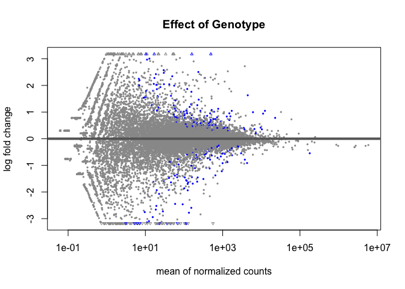
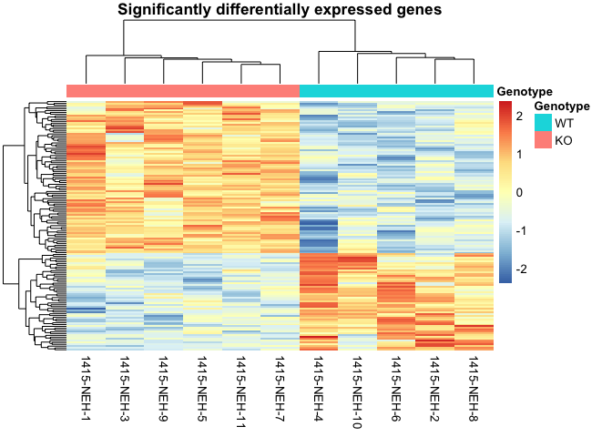
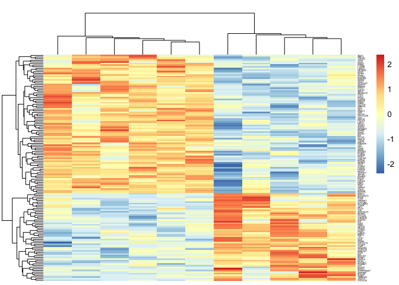
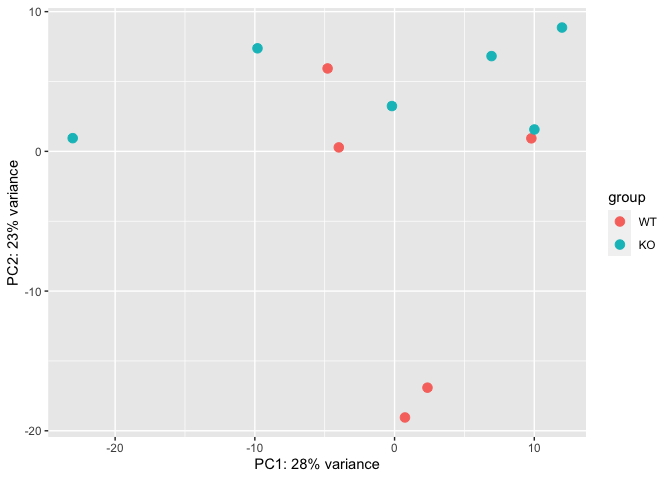

# Purpose

To analyse aTSC mammary gland RNAseq dataset

# Experimental Details

Prior to this analysis, reads were mapped to GRCm38 CDS via Salmon v 1.3.0 with flags `--gc-bias`, `--validateMappings` and `-l A`.  These data were saved into the quants folders.


```r
library(tximport) #loads the tximport package, needed to bring in the salmon files
quant.directories <- 'quants'
sample.directories <- list.dirs(quant.directories, 
                                recursive=F) #identify directories that contain salmon output
sample.directories <- sample.directories[grepl('NEH', sample.directories)] #only noura samples
salmon.files <- file.path(sample.directories,"quant.sf") #locate quant files for each directory
salmon.files <- salmon.files[file.exists(salmon.files)]

library("tximeta")

WT <- c(2,4,6,8,10)
WT.names <- paste('1415-NEH-',WT, sep="")
KO <- c(1,3,5,7,9,11)
KO.names <- paste('1415-NEH-',KO, sep="")


coldata <- data.frame(files=salmon.files, 
                      stringsAsFactors = F) %>%
  separate(col=files,
           sep='_',
           into=c('Folder','names'),
           remove=F) %>%
  mutate(Genotype=case_when(names %in% WT.names~'WT',
                            names %in% KO.names~'KO')) %>%
  mutate(Genotype = relevel(as.factor(Genotype), ref="WT"))

makeLinkedTxome(indexDir='mouse_index',
                source="Ensembl", organism="Mus musculus",
                release="101", genome="GRCm38.101",
                fasta='Mus_musculus.GRCm38.cds.all.fa.gz',
                gtf='Mus_musculus.GRCm38.101.gtf.gz')

se <- tximeta(coldata) # looks at all transcripts  and combines them together
#se.exons <- addExons(se) #to summarize to gene level data (individual exons, not done yet)
gse <- summarizeToGene(se) # the total number of genes 22Kx11 samples
```

These data can be found in **/Users/davebrid/Documents/GitHub/TissueSpecificTscKnockouts/RNAseq/Mammary Gland Adipocyte Tsc1 Knockout** in a set of folders located in quants. This script was most recently updated on **Fri Apr  2 12:19:49 2021**.


```r
library(DESeq2)
dds <- DESeqDataSet(gse, ~Genotype)
dds$Genotype <- relevel(dds$Genotype, ref = "WT")
dds <- DESeq(dds) #normalizing samples to each other
dds.genotype <- results(dds,contrast=c("Genotype","KO","WT")) #this must be column - numerator - denominator

library("org.Mm.eg.db")
dds.genotype$symbol <- mapIds(org.Mm.eg.db,
                     keys=rownames(dds.genotype),
                     column="SYMBOL",
                     keytype="ENSEMBL",
                     multiVals="first") #annotated with common gene symbols
```

# Summary of Results


```r
summary(dds.genotype, alpha=0.05)
```

```
## 
## out of 17605 with nonzero total read count
## adjusted p-value < 0.05
## LFC > 0 (up)       : 85, 0.48%
## LFC < 0 (down)     : 54, 0.31%
## outliers [1]       : 56, 0.32%
## low counts [2]     : 3363, 19%
## (mean count < 3)
## [1] see 'cooksCutoff' argument of ?results
## [2] see 'independentFiltering' argument of ?results
```

# MA Plot


```r
plotMA(dds.genotype, main="Effect of Genotype") #top vs bottom is comparing the 2 genotypes KO vs WT differences, 0x-axis means there is no difference in that gene's expression 
```

<!-- -->

```r
#x-axis is showing gene abundance , the more the count, the more to the right the dot will be 
```


```r
library(pheatmap)
ntd <- normTransform(dds)
selected.genes <- subset(dds.genotype, padj<0.05) # pick the 50 most significantly changed genes (up vs down)
df <- data.frame(colData(dds)$Genotype)
rownames(df) <- colnames(assay(ntd)[rownames(selected.genes),])

name.mapping <- as.data.frame(dds.genotype$symbol)
heatmap.data <- assay(ntd)[rownames(selected.genes),]
rownames(heatmap.data) <- name.mapping[rownames(selected.genes),]

df <- rename(df, 'colData.dds..Genotype'='Genotype')
pheatmap(heatmap.data,
         cluster_rows=T,
         show_rownames = F,
         cluster_cols = T,
         annotation_col=df,
         scale='row',
         main="Significantly differentially expressed genes")
```

<!-- -->

```r
pheatmap(heatmap.data,
         cluster_rows=T,
         show_rownames = T,
         show_colnames = F,
         fontsize_row = 3,
         cluster_cols = T,
         legend_labels=F,
         border_color=NA,
         scale='row',
         main="")
```

<!-- -->

```r
pheatmap(heatmap.data,
         cluster_rows=T,
         show_rownames = F,
         cluster_cols = T,
         #annotation_col=df,
         scale='none', #row is each row is the gene with each row having the same average value, normalized. In scale none, each row is still a ngene but no longer with normalized expression, harder to see since genes have different expression levels 
         main="Significantly modified genes")
```

<!-- -->


```r
#from https://www.biostars.org/p/282295/

#par(mar=c(5,5,5,5), cex=1.0, cex.main=1.4, cex.axis=1.4, cex.lab=1.4)

topT <- as.data.frame(dds.genotype)
library(ggplot2)
ggplot(topT,(aes(y=-log10(padj),
                x=log2FoldChange,
                col=padj>0.05))) +
  geom_point() +
  labs(y=bquote(~-log[10]~Q~value),
       x=bquote(~log[2]~fold~change),
       subtitle="") +
    geom_text(data=subset(topT, abs(log2FoldChange) > 2 | -log10(padj) > 2.5),
            aes(log2FoldChange,-log10(padj),label=symbol),
            check_overlap = TRUE, nudge_x = 0.5) +
  theme_classic() +
  theme(text=element_text(size=18),
        legend.position="none") +
  scale_colour_grey() +
  xlim(-5,5)
```

<!-- -->

```r
#Adjusted P values (FDR Q values)
with(topT, plot(log2FoldChange, -log10(padj), pch=20, main="Volcano plot", cex=1.0, xlab=bquote(~log[2]~fold~change), ylab=bquote(~-log[10]~Q~value)))

with(subset(topT, padj<0.05 & abs(log2FoldChange)>2), points(log2FoldChange, -log10(padj), pch=20, col="red", cex=0.5))

#with(subset(topT, padj<0.05 & abs(log2FoldChange)>2), text(log2FoldChange, -log10(padj), labels=subset(rownames(topT), topT$padj<0.05 & abs(topT$log2FoldChange)>2), cex=0.8, pos=3))

#Add lines for absolute FC>2 and P-value cut-off at FDR Q<0.05
abline(v=0, col="black", lty=3, lwd=1.0)
abline(v=-2, col="black", lty=4, lwd=2.0)
abline(v=2, col="black", lty=4, lwd=2.0)
abline(h=-log10(max(topT$pvalue[topT$padj<0.05], na.rm=TRUE)), col="black", lty=4, lwd=2.0)
```

<!-- -->

# Principal Components Analysis


```r
vsd <- vst(dds, blind=FALSE)
plotPCA(vsd, intgroup=c("Genotype")) #overall seeing how similar samples are to each other, across sample variance, this is not due to genotype since the genotypes are not clustered alone in two separate clusters
```

<!-- -->


```r
output.file <- 'DESeq2 Results.csv'
output.counts <- 'DESeq2 Normalized Counts.csv'
output.design <- 'Design Table.csv'

write.csv(as.data.frame(dds.genotype), file=output.file)
write.csv(counts(dds, normalized=T), file=output.counts)
write.csv(coldata, file=output.design)
```

# Session Information


```r
sessionInfo()
```

```
## R version 4.0.2 (2020-06-22)
## Platform: x86_64-apple-darwin17.0 (64-bit)
## Running under: macOS  10.16
## 
## Matrix products: default
## BLAS:   /Library/Frameworks/R.framework/Versions/4.0/Resources/lib/libRblas.dylib
## LAPACK: /Library/Frameworks/R.framework/Versions/4.0/Resources/lib/libRlapack.dylib
## 
## locale:
## [1] en_US.UTF-8/en_US.UTF-8/en_US.UTF-8/C/en_US.UTF-8/en_US.UTF-8
## 
## attached base packages:
## [1] parallel  stats4    stats     graphics  grDevices utils     datasets 
## [8] methods   base     
## 
## other attached packages:
##  [1] ggplot2_3.3.3               pheatmap_1.0.12            
##  [3] org.Mm.eg.db_3.12.0         AnnotationDbi_1.52.0       
##  [5] DESeq2_1.30.1               SummarizedExperiment_1.20.0
##  [7] Biobase_2.50.0              MatrixGenerics_1.2.1       
##  [9] matrixStats_0.58.0          GenomicRanges_1.42.0       
## [11] GenomeInfoDb_1.26.4         IRanges_2.24.1             
## [13] S4Vectors_0.28.1            BiocGenerics_0.36.0        
## [15] tximeta_1.8.4               tximport_1.18.0            
## [17] dplyr_1.0.5                 tidyr_1.1.3                
## [19] knitr_1.31                 
## 
## loaded via a namespace (and not attached):
##  [1] colorspace_2.0-0              ellipsis_0.3.1               
##  [3] XVector_0.30.0                farver_2.1.0                 
##  [5] bit64_4.0.5                   interactiveDisplayBase_1.28.0
##  [7] fansi_0.4.2                   xml2_1.3.2                   
##  [9] splines_4.0.2                 cachem_1.0.4                 
## [11] geneplotter_1.68.0            jsonlite_1.7.2               
## [13] Rsamtools_2.6.0               annotate_1.68.0              
## [15] dbplyr_2.1.0                  shiny_1.6.0                  
## [17] BiocManager_1.30.12           readr_1.4.0                  
## [19] compiler_4.0.2                httr_1.4.2                   
## [21] assertthat_0.2.1              Matrix_1.3-2                 
## [23] fastmap_1.1.0                 lazyeval_0.2.2               
## [25] later_1.1.0.1                 htmltools_0.5.1.1            
## [27] prettyunits_1.1.1             tools_4.0.2                  
## [29] gtable_0.3.0                  glue_1.4.2                   
## [31] GenomeInfoDbData_1.2.4        rappdirs_0.3.3               
## [33] Rcpp_1.0.6                    jquerylib_0.1.3              
## [35] vctrs_0.3.7                   Biostrings_2.58.0            
## [37] rtracklayer_1.50.0            xfun_0.22                    
## [39] stringr_1.4.0                 mime_0.10                    
## [41] lifecycle_1.0.0               ensembldb_2.14.0             
## [43] XML_3.99-0.6                  AnnotationHub_2.22.0         
## [45] zlibbioc_1.36.0               scales_1.1.1                 
## [47] hms_1.0.0                     promises_1.2.0.1             
## [49] ProtGenerics_1.22.0           AnnotationFilter_1.14.0      
## [51] RColorBrewer_1.1-2            yaml_2.2.1                   
## [53] curl_4.3                      memoise_2.0.0                
## [55] sass_0.3.1                    biomaRt_2.46.3               
## [57] stringi_1.5.3                 RSQLite_2.2.5                
## [59] BiocVersion_3.12.0            highr_0.8                    
## [61] genefilter_1.72.1             GenomicFeatures_1.42.2       
## [63] BiocParallel_1.24.1           rlang_0.4.10                 
## [65] pkgconfig_2.0.3               bitops_1.0-6                 
## [67] evaluate_0.14                 lattice_0.20-41              
## [69] purrr_0.3.4                   labeling_0.4.2               
## [71] GenomicAlignments_1.26.0      bit_4.0.4                    
## [73] tidyselect_1.1.0              magrittr_2.0.1               
## [75] R6_2.5.0                      generics_0.1.0               
## [77] DelayedArray_0.16.3           DBI_1.1.1                    
## [79] pillar_1.5.1                  withr_2.4.1                  
## [81] survival_3.2-10               RCurl_1.98-1.3               
## [83] tibble_3.1.0                  crayon_1.4.1                 
## [85] utf8_1.2.1                    BiocFileCache_1.14.0         
## [87] rmarkdown_2.7                 progress_1.2.2               
## [89] locfit_1.5-9.4                grid_4.0.2                   
## [91] blob_1.2.1                    digest_0.6.27                
## [93] xtable_1.8-4                  httpuv_1.5.5                 
## [95] openssl_1.4.3                 munsell_0.5.0                
## [97] bslib_0.2.4                   askpass_1.1
```
