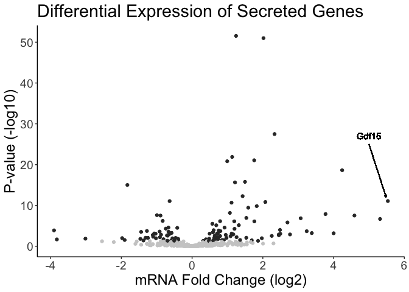

# Purpose

To broadly evaluate all potential myokines from mTORC1 activated muscles based on transcriptional changes from our RNAseq data 

# Experimental Details

Used RNAseq data compiled from our previous experiments  Used biomart to extract proteins with annotated signal peptides done via SignalP [@Almagro_Armenteros_2019].

# Raw Data


```r
library(readr) #loads the readr package
rnaseq.filename <- '../data/processed/Binary DESeq Results.csv' #make this a separate line, you can use any variable you want
rnaseq.analysed.filename <- '../data/processed/Binary Normalized Counts.csv'

#this loads whatever the file is into a dataframe called exp.data if it exists
rnaseq.stats <- read_csv(rnaseq.filename)
rnaseq.counts <- read_csv(rnaseq.analysed.filename)
```

## Annotated Proteins with Signal Peptides


```r
library(biomaRt)

mouse.data <- useDataset('mmusculus_gene_ensembl', mart=useMart('ensembl'))
#listFilters(mouse.data) #to locate with_signalp
#listAttributes(mouse.data)  #to locate ensembl_gene_id

signalp.data <- 
  getBM(attributes=c('ensembl_gene_id','signalp'), 
      values = rnaseq.stats$Row.names, 
      mart = mouse.data) %>%
  mutate(signap = as.factor(signalp))

signalp.genes <-
  signalp.data %>%
  filter(signalp %in% c('SignalP-noTM')) %>%
  pull(ensembl_gene_id)

membrane.genes <- getBM(attributes=c('ensembl_gene_id', 'go_id'),
                        filters = 'go', 
                        values = 'GO:0016020',
                        mart = mouse.data) %>%
  pull(ensembl_gene_id)


secreted.genes <-
  rnaseq.stats %>%
  mutate(SignalP=Row.names %in% signalp.genes,
         GO_Membrane=Row.names %in% membrane.genes) %>%
  mutate(Secreted=if_else(SignalP==TRUE&GO_Membrane==FALSE, 'Secreted','Non-Secreted'))
  
secreted.genes %>%  
  count(Secreted) %>%
  kable(caption="Predicted secreted gene products")
```


Table: Predicted secreted gene products

Secreted            n
-------------  ------
Non-Secreted    19610
Secreted         1780

These data can be found in **/Users/davebrid/Documents/GitHub/TissueSpecificTscKnockouts/RNAseq/scripts**.  The normalized RNAseq data can be found in a file named **../data/processed/Binary DESeq Results.csv**.  This script was most recently updated on **Mon Mar 30 15:12:22 2020**.


```r
human.secretome.link <- 'https://www.proteinatlas.org/search/sa_location%3ASecreted+to+blood?format=tsv'
human.secretome <- read_delim(human.secretome.link, delim='\t')
human.secretome.genes <-
  human.secretome %>%
  dplyr::select(Gene,`Protein class`, `Ensembl`)

human.data = useMart("ensembl", dataset = "hsapiens_gene_ensembl")

protein.atlas.genes <- getLDS(attributes = c("hgnc_symbol"), 
    filters = "hgnc_symbol", values = human.secretome$Gene, mart = human.data, 
    attributesL = c("external_gene_name"), martL = mouse.data) %>%
  distinct(Gene.name) %>%
  pull(Gene.name)
```

The human secretome was described at https://www.proteinatlas.org/search/sa_location%3ASecreted+to+blood?format=tsv and in @Uhlen_2015.  These data were downloaded from https://www.proteinatlas.org/search/sa_location%3ASecreted+to+blood?format=tsv.  After matching to the mouse genome via biomart and removing duplicates there were 772 secreted mouse genes.

## Comparason of Secretomes


```r
library(VennDiagram)
signal.p.genes <- secreted.genes %>% 
  filter(Secreted=='Secreted') %>% 
  distinct(external_gene_name) %>% 
  pull(external_gene_name)

grid.newpage()
draw.pairwise.venn(length(protein.atlas.genes),
                                length(signal.p.genes),
                                length(intersect(protein.atlas.genes, signal.p.genes)),
                   c("`Protein Atlas`", "`SignalP Non-Membrane`"),
                   fill=color.scheme)
```

<!-- -->

```
## (polygon[GRID.polygon.1], polygon[GRID.polygon.2], polygon[GRID.polygon.3], polygon[GRID.polygon.4], text[GRID.text.5], text[GRID.text.6], text[GRID.text.7], text[GRID.text.8], text[GRID.text.9])
```

# Analysis

The ENSEMBL dataset with genes annotated as having a signalP annotation includes 3766 and 157001 that are filtered with the GO annotation of 0016020, cellular component - membrane.  This resulted in 1780 secreted genes.


```r
rnaseq.secreted <-
  rnaseq.stats %>%
  filter(Row.names %in% signalp.genes)  %>% #keep proteins with signal peptide
  filter(!(Row.names %in% membrane.genes))  #remove membrane proteins

rnaseq.secreted <-
  rnaseq.stats %>%
  filter(external_gene_name %in% intersect(protein.atlas.genes, signal.p.genes))    #overlap of both

rnaseq.secreted <-
  rnaseq.stats %>%
  filter(external_gene_name %in% protein.atlas.genes)   #only protein atlas


secreted.output.file <- '../data/processed/Potential Secreted Genes.csv'

rnaseq.secreted %>%
  rename('ENSEMBL Gene ID'='Row.names',
         'Gene Name'='external_gene_name') %>%
  dplyr::select(-X1) %>%
  dplyr::select('Gene Name', everything()) %>%
  arrange(-abs(log2FoldChange)) %>%
  write_csv(secreted.output.file)

library(ggplot2)

sig.secreted <- 
  rnaseq.secreted %>%
  mutate(FC = 2^(log2FoldChange)) %>%
  filter(padj < 0.05,
         baseMean>2) %>%
  arrange(desc(abs(log2FoldChange))) 

sig.secreted %>%
  head(10) %>%
  kable(caption = "Top differentially expressed secreted proteins")
```


Table: Top differentially expressed secreted proteins

    X1  Row.names             baseMean   log2FoldChange   lfcSE    stat   pvalue    padj  external_gene_name        FC
------  -------------------  ---------  ---------------  ------  ------  -------  ------  -------------------  -------
 11042  ENSMUSG00000038508        3.23             5.53   0.750    7.38    0.000   0.000  Gdf15                 46.343
   200  ENSMUSG00000001131       13.98             4.24   0.445    9.53    0.000   0.000  Timp1                 18.925
 14364  ENSMUSG00000050069       37.19            -3.90   0.892   -4.38    0.000   0.000  Grem2                  0.067
 16151  ENSMUSG00000059201       18.23            -3.82   1.349   -2.83    0.005   0.021  Lep                    0.071
  3666  ENSMUSG00000022454        2.42             3.77   0.604    6.24    0.000   0.000  Nell2                 13.666
  3347  ENSMUSG00000021922        2.31             3.07   0.528    5.82    0.000   0.000  Itih4                  8.398
 11332  ENSMUSG00000039196        3.39            -3.02   1.008   -2.99    0.003   0.014  Orm1                   0.124
  2893  ENSMUSG00000021091      123.65             2.70   0.502    5.37    0.000   0.000  Serpina3n              6.480
  5954  ENSMUSG00000027249        4.09             2.49   0.643    3.87    0.000   0.001  F2                     5.629
 16102  ENSMUSG00000058914        3.81             2.48   0.559    4.45    0.000   0.000  C1qtnf3                5.600

```r
gdf15.data <- filter(rnaseq.secreted, external_gene_name=="Gdf15")  
ggplot(rnaseq.secreted,
       aes(x=log2FoldChange,
           y=-log10(padj))) +
  geom_point(aes(col=padj>0.05)) +
  labs(y="P-value (-log10)",
       x="mRNA Fold Change (log2)",
       title="Differential Expression of Secreted Genes") +
  geom_segment(
     xend = gdf15.data$log2FoldChange-0.05, yend = -log10(gdf15.data$padj)+1,
     x=5, y=25,
     arrow=arrow(length=unit(0.1,'cm'))) +
  geom_text(label="Gdf15", x=5, y=27) +
  scale_color_grey() +
  theme_classic() +
  theme(text=element_text(size=18),
        legend.position='none')
```

<!-- -->
These differentially expressed secreted proteins can be found in ../data/processed/Potential Secreted Genes.csv. 

Among 4403 genes that were differentially expressed in *Tsc1* knockout muscles, 116 were potential secreted proteins.

Gdf15 was upregulated 46.343 fold (p=8.236&times; 10^-12^)

# Session Information


```r
sessionInfo()
```

```
## R version 3.6.3 (2020-02-29)
## Platform: x86_64-apple-darwin15.6.0 (64-bit)
## Running under: macOS Catalina 10.15.3
## 
## Matrix products: default
## BLAS:   /Library/Frameworks/R.framework/Versions/3.6/Resources/lib/libRblas.0.dylib
## LAPACK: /Library/Frameworks/R.framework/Versions/3.6/Resources/lib/libRlapack.dylib
## 
## locale:
## [1] en_US.UTF-8/en_US.UTF-8/en_US.UTF-8/C/en_US.UTF-8/en_US.UTF-8
## 
## attached base packages:
## [1] grid      stats     graphics  grDevices utils     datasets  methods  
## [8] base     
## 
## other attached packages:
## [1] ggplot2_3.3.0.9000   VennDiagram_1.6.20   futile.logger_1.4.3 
## [4] biomaRt_2.42.0       readr_1.3.1          knitcitations_1.0.10
## [7] dplyr_0.8.5          tidyr_1.0.2          knitr_1.28          
## 
## loaded via a namespace (and not attached):
##  [1] Rcpp_1.0.4           lubridate_1.7.4      prettyunits_1.1.1   
##  [4] assertthat_0.2.1     digest_0.6.25        utf8_1.1.4          
##  [7] BiocFileCache_1.10.2 R6_2.4.1             plyr_1.8.6          
## [10] futile.options_1.0.1 stats4_3.6.3         RSQLite_2.2.0       
## [13] evaluate_0.14        httr_1.4.1           highr_0.8           
## [16] pillar_1.4.3         rlang_0.4.5          progress_1.2.2      
## [19] curl_4.3             blob_1.2.1           S4Vectors_0.24.3    
## [22] rmarkdown_2.1        labeling_0.3         RefManageR_1.2.12   
## [25] stringr_1.4.0        munsell_0.5.0        bit_1.1-15.2        
## [28] compiler_3.6.3       xfun_0.12            pkgconfig_2.0.3     
## [31] askpass_1.1          BiocGenerics_0.32.0  htmltools_0.4.0     
## [34] openssl_1.4.1        tidyselect_1.0.0     tibble_2.1.3        
## [37] IRanges_2.20.2       XML_3.99-0.3         fansi_0.4.1         
## [40] withr_2.1.2          crayon_1.3.4         dbplyr_1.4.2        
## [43] rappdirs_0.3.1       gtable_0.3.0         jsonlite_1.6.1      
## [46] lifecycle_0.2.0      DBI_1.1.0            magrittr_1.5        
## [49] formatR_1.7          scales_1.1.0         bibtex_0.4.2.2      
## [52] cli_2.0.2            stringi_1.4.6        farver_2.0.3        
## [55] xml2_1.2.5           vctrs_0.2.4          lambda.r_1.2.4      
## [58] tools_3.6.3          bit64_0.9-7          Biobase_2.46.0      
## [61] glue_1.3.2           purrr_0.3.3          hms_0.5.3           
## [64] parallel_3.6.3       yaml_2.2.1           colorspace_1.4-1    
## [67] AnnotationDbi_1.48.0 memoise_1.1.0
```

# Bibliography


```r
write.bibtex(file="secreted-database-references.bib")
bibliography("markdown")
```

<a
name=bib-Almagro_Armenteros_2019></a>[[1]](#cite-Almagro_Armenteros_2019)
J. J. A. Armenteros, K. D. Tsirigos, C. K. Sønderby, et al. "SignalP
5.0 improves signal peptide predictions using deep neural networks".
In: _Nature Biotechnology_ 37.4 (Feb. 2019), pp. 420-423. DOI:
[10.1038/s41587-019-0036-z](https://doi.org/10.1038%2Fs41587-019-0036-z).
URL:
[https://doi.org/10.1038/s41587-019-0036-z](https://doi.org/10.1038/s41587-019-0036-z).

<a name=bib-Uhlen_2015></a>[[2]](#cite-Uhlen_2015) M. Uhlen, L.
Fagerberg, B. M. Hallstrom, et al. "Tissue-based map of the human
proteome". In: _Science_ 347.6220 (Jan. 2015), pp. 1260419-1260419.
DOI:
[10.1126/science.1260419](https://doi.org/10.1126%2Fscience.1260419).
URL:
[https://doi.org/10.1126/science.1260419](https://doi.org/10.1126/science.1260419).
